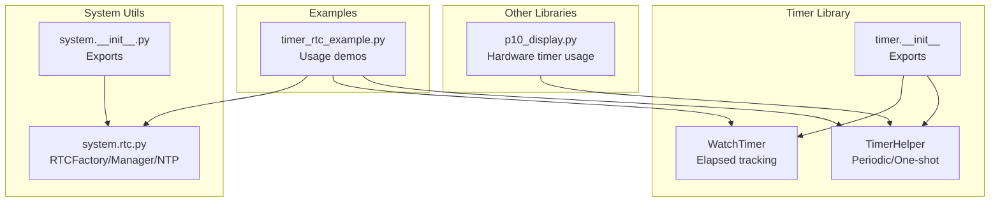
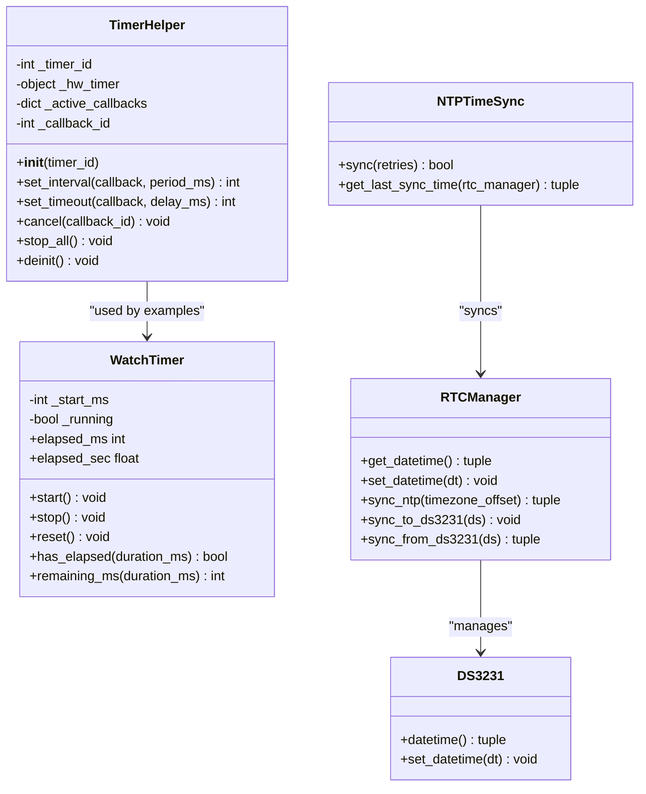
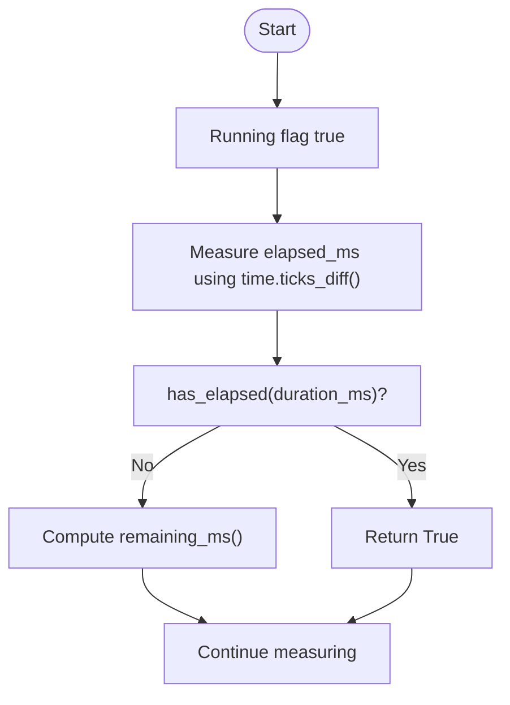
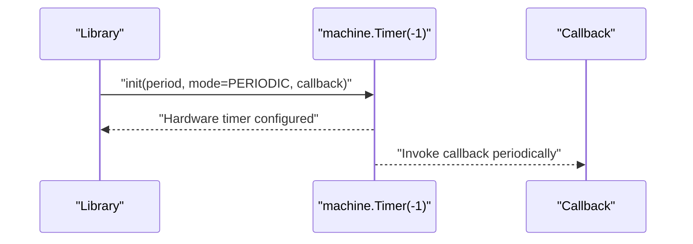
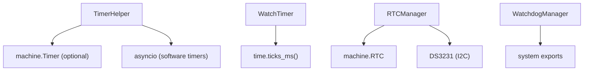

# Timers & Counters

<cite>
**Referenced Files in This Document**
- [timer_helper.py](file://src/lib/timer/timer_helper.py)
- [README.md](file://src/lib/timer/README.md)
- [__init__.py](file://src/lib/timer/__init__.py)
- [timer_rtc_example.py](file://src/main/examples/timer_rtc_example.py)
- [p10_display.py](file://src/lib/p10/p10_display.py)
- [rtc.py](file://src/lib/system/rtc.py)
- [__init__.py](file://src/lib/system/__init__.py)
- [device.cfg](file://src/device.cfg)
</cite>

## Table of Contents
1. [Introduction](#introduction)
2. [Project Structure](#project-structure)
3. [Core Components](#core-components)
4. [Architecture Overview](#architecture-overview)
5. [Detailed Component Analysis](#detailed-component-analysis)
6. [Dependency Analysis](#dependency-analysis)
7. [Performance Considerations](#performance-considerations)
8. [Troubleshooting Guide](#troubleshooting-guide)
9. [Conclusion](#conclusion)
10. [Appendices](#appendices)

## Introduction
This document explains hardware timer and counter management for the ESP32-C3 using the MicroPython framework. It focuses on the TimerHelper class for periodic and one-shot callbacks, the WatchTimer class for software-based elapsed time tracking, and the watchdog mechanism for system reliability. It also covers timer resolution, prescaler configuration, overflow handling patterns, and practical usage scenarios such as periodic tasks, pulse generation, and event counting. Guidance is included for interrupt latency, power consumption during long-running operations, and best practices for timer-based scheduling and watchdog implementation.

## Project Structure
The timer and counter functionality is primarily implemented in the timer library and complemented by examples and system utilities:
- TimerHelper and WatchTimer are defined in the timer library.
- Example usage demonstrates periodic timers, timeouts, debouncing, and performance measurement.
- Hardware timer usage appears in other libraries (e.g., P10 LED panel driver) to illustrate real-world patterns.
- System-level RTC and watchdog utilities provide timekeeping and reliability features.



**Diagram sources**
- [timer_helper.py:1-237](file://src/lib/timer/timer_helper.py#L1-L237)
- [__init__.py:1-12](file://src/lib/timer/__init__.py#L1-L12)
- [timer_rtc_example.py:1-284](file://src/main/examples/timer_rtc_example.py#L1-L284)
- [rtc.py:1-236](file://src/lib/system/rtc.py#L1-L236)
- [__init__.py:1-6](file://src/lib/system/__init__.py#L1-L6)
- [p10_display.py:180-379](file://src/lib/p10/p10_display.py#L180-L379)

**Section sources**
- [timer_helper.py:1-237](file://src/lib/timer/timer_helper.py#L1-L237)
- [README.md:1-150](file://src/lib/timer/README.md#L1-L150)
- [__init__.py:1-12](file://src/lib/timer/__init__.py#L1-L12)
- [timer_rtc_example.py:1-284](file://src/main/examples/timer_rtc_example.py#L1-L284)
- [rtc.py:1-236](file://src/lib/system/rtc.py#L1-L236)
- [__init__.py:1-6](file://src/lib/system/__init__.py#L1-L6)
- [p10_display.py:180-379](file://src/lib/p10/p10_display.py#L180-L379)

## Core Components
- TimerHelper: Abstraction over machine.Timer supporting periodic and one-shot callbacks with automatic hardware/software fallback and round-robin allocation across four hardware timers.
- WatchTimer: Software-based elapsed time tracker using time.ticks_ms() suitable for timeouts, debouncing, and pulse timing.
- Hardware timer usage: Demonstrated in other libraries (e.g., P10 display) to show periodic refresh patterns with machine.Timer(-1) indicating software fallback usage in those contexts.

Key capabilities:
- Periodic callbacks with set_interval and one-shot callbacks with set_timeout.
- Cancellation and cleanup via cancel and deinit.
- Automatic hardware timer allocation and fallback to software timers when hardware initialization fails.
- ESP32-C3-specific constraints: four hardware timers, ~1 µs resolution, and a maximum period per timer around ~134 seconds.

**Section sources**
- [timer_helper.py:23-172](file://src/lib/timer/timer_helper.py#L23-L172)
- [timer_helper.py:174-237](file://src/lib/timer/timer_helper.py#L174-L237)
- [README.md:141-150](file://src/lib/timer/README.md#L141-L150)
- [p10_display.py:180-379](file://src/lib/p10/p10_display.py#L180-L379)

## Architecture Overview
The timer subsystem integrates a hardware abstraction layer with a software fallback. TimerHelper encapsulates hardware timer initialization and callback dispatch, while WatchTimer provides lightweight elapsed tracking. The system also includes RTC and watchdog utilities for time synchronization and reliability.



**Diagram sources**
- [timer_helper.py:23-172](file://src/lib/timer/timer_helper.py#L23-L172)
- [timer_helper.py:174-237](file://src/lib/timer/timer_helper.py#L174-L237)
- [rtc.py:62-96](file://src/lib/system/rtc.py#L62-L96)
- [rtc.py:100-160](file://src/lib/system/rtc.py#L100-L160)
- [rtc.py:162-236](file://src/lib/system/rtc.py#L162-L236)

## Detailed Component Analysis

### TimerHelper: Hardware Abstraction and Fallback
TimerHelper wraps machine.Timer to provide:
- Round-robin allocation across four hardware timers (ESP32-C3).
- Periodic callbacks via set_interval and one-shot callbacks via set_timeout.
- Automatic fallback to software timers when hardware initialization fails.
- Cancellable callbacks and centralized cleanup.

Implementation highlights:
- Hardware timer selection and initialization with error handling.
- ISR-based callbacks for periodic timers and one-shot cleanup.
- Software timer implementation using asyncio tasks and sleep for set_interval and set_timeout.
- Resource management via cancel, stop_all, and deinit.

```mermaid
sequenceDiagram
participant App as "Application"
participant TH as "TimerHelper"
participant HW as "machine.Timer"
participant SW as "asyncio Task"
App->>TH : "set_interval(callback, period_ms)"
alt "Hardware timer available"
TH->>HW : "init(period=period_ms, mode=PERIODIC, callback)"
TH-->>App : "return callback_id"
HW-->>TH : "ISR invokes callback()"
else "Fallback to software"
TH->>SW : "create_task(_sw_interval())"
SW-->>TH : "loop : callback(); await sleep_ms(period_ms)"
TH-->>App : "return callback_id"
end
```

**Diagram sources**
- [timer_helper.py:66-98](file://src/lib/timer/timer_helper.py#L66-L98)
- [timer_helper.py:113-136](file://src/lib/timer/timer_helper.py#L113-L136)

**Section sources**
- [timer_helper.py:41-63](file://src/lib/timer/timer_helper.py#L41-L63)
- [timer_helper.py:66-98](file://src/lib/timer/timer_helper.py#L66-L98)
- [timer_helper.py:102-136](file://src/lib/timer/timer_helper.py#L102-L136)
- [timer_helper.py:140-171](file://src/lib/timer/timer_helper.py#L140-L171)

### WatchTimer: Software Elapsed Tracking
WatchTimer provides:
- Start, stop, and reset operations.
- Elapsed time in milliseconds and seconds.
- Timeout checks and remaining time calculation.
- Suitable for debouncing, timeouts, and pulse timing.



**Diagram sources**
- [timer_helper.py:194-237](file://src/lib/timer/timer_helper.py#L194-L237)

**Section sources**
- [timer_helper.py:174-237](file://src/lib/timer/timer_helper.py#L174-L237)

### Practical Usage Scenarios
- Periodic tasks: Use set_interval for recurring actions (e.g., heartbeat, sensor polling).
- One-shot delays: Use set_timeout for delayed actions.
- Debouncing: Use WatchTimer to enforce minimum intervals between events.
- Performance profiling: Use WatchTimer to measure execution time.
- Pulse generation: Combine periodic callbacks with output drivers for timed signals.
- Event counting: Use callbacks to increment counters and handle overflow conditions.

**Section sources**
- [timer_rtc_example.py:18-41](file://src/main/examples/timer_rtc_example.py#L18-L41)
- [timer_rtc_example.py:46-64](file://src/main/examples/timer_rtc_example.py#L46-L64)
- [timer_rtc_example.py:70-102](file://src/main/examples/timer_rtc_example.py#L70-L102)
- [timer_rtc_example.py:108-142](file://src/main/examples/timer_rtc_example.py#L108-L142)
- [timer_rtc_example.py:148-169](file://src/main/examples/timer_rtc_example.py#L148-L169)

### Hardware Timer Usage Patterns
- Hardware timer allocation: TimerHelper automatically cycles through Timer0–Timer3.
- Software fallback: When hardware initialization fails, TimerHelper switches to software timers using asyncio.
- Real-world usage: Other libraries demonstrate periodic refresh using machine.Timer(-1), indicating software fallback patterns.



**Diagram sources**
- [p10_display.py:180-194](file://src/lib/p10/p10_display.py#L180-L194)
- [p10_display.py:364-375](file://src/lib/p10/p10_display.py#L364-L375)

**Section sources**
- [timer_helper.py:45-62](file://src/lib/timer/timer_helper.py#L45-L62)
- [p10_display.py:180-194](file://src/lib/p10/p10_display.py#L180-L194)
- [p10_display.py:364-375](file://src/lib/p10/p10_display.py#L364-L375)

### Watchdog Implementation for System Monitoring
The system includes a watchdog manager for reliability:
- WatchdogManager provides start, feed, and stop operations.
- Typical usage involves feeding the watchdog periodically to prevent reset.
- Advanced patterns include asynchronous watchdog feeders.

```mermaid
sequenceDiagram
participant App as "Application"
participant WDT as "WatchdogManager"
participant Loop as "Main Loop"
App->>WDT : "start()"
loop "Periodic"
Loop->>WDT : "feed()"
Note right of WDT : "Reset timeout"
end
App->>WDT : "stop()"
```

**Diagram sources**
- [__init__.py:1-6](file://src/lib/system/__init__.py#L1-L6)
- [README.md:263-316](file://src/lib/system/README.md#L263-L316)

**Section sources**
- [__init__.py:1-6](file://src/lib/system/__init__.py#L1-L6)
- [README.md:263-316](file://src/lib/system/README.md#L263-L316)

## Dependency Analysis
- TimerHelper depends on machine.Timer when available and falls back to asyncio for scheduling.
- WatchTimer depends on time.ticks_ms() for elapsed time calculations.
- RTC utilities depend on machine.RTC and optional DS3231 via I2C.
- The system exports WatchdogManager for watchdog functionality.



**Diagram sources**
- [timer_helper.py:16-20](file://src/lib/timer/timer_helper.py#L16-L20)
- [timer_helper.py:13-14](file://src/lib/timer/timer_helper.py#L13-L14)
- [rtc.py:62-96](file://src/lib/system/rtc.py#L62-L96)
- [__init__.py:1-6](file://src/lib/system/__init__.py#L1-L6)

**Section sources**
- [timer_helper.py:16-20](file://src/lib/timer/timer_helper.py#L16-L20)
- [timer_helper.py:13-14](file://src/lib/timer/timer_helper.py#L13-L14)
- [rtc.py:62-96](file://src/lib/system/rtc.py#L62-L96)
- [__init__.py:1-6](file://src/lib/system/__init__.py#L1-L6)

## Performance Considerations
- Timer resolution: ~1 µs resolution is supported on ESP32-C3.
- Maximum period: Each hardware timer supports periods up to approximately 134 seconds.
- Interrupt latency: Hardware timers execute callbacks directly in ISR context, minimizing latency compared to software timers.
- Power consumption: Long-running software timers rely on asyncio sleep, which keeps the scheduler active. Consider hardware timers for low-power periodic tasks when feasible.
- Overflow handling: WatchTimer uses time.ticks_ms() arithmetic; ensure elapsed checks account for wraparound using time.ticks_diff semantics.

[No sources needed since this section provides general guidance]

## Troubleshooting Guide
Common issues and resolutions:
- Hardware timer initialization failures: TimerHelper automatically falls back to software timers. Verify hardware timer availability and error logs.
- Callback not firing: Confirm timer mode and period configuration. For one-shot timers, ensure cleanup after callback execution.
- Interrupt latency concerns: Prefer hardware timers for ISR-driven callbacks; avoid heavy work in ISR context.
- Power consumption: Reduce CPU wake-ups by using hardware timers for periodic tasks instead of tight software loops.
- Watchdog resets: Ensure regular feeding of the watchdog to prevent unintended resets.

**Section sources**
- [timer_helper.py:54-62](file://src/lib/timer/timer_helper.py#L54-L62)
- [timer_helper.py:113-125](file://src/lib/timer/timer_helper.py#L113-L125)
- [README.md:141-150](file://src/lib/timer/README.md#L141-L150)

## Conclusion
The ESP32-C3 timer and counter ecosystem combines a robust TimerHelper abstraction with a flexible WatchTimer for elapsed tracking. Hardware timers offer precise, low-latency callbacks, while software timers provide reliable fallback scheduling. The system’s watchdog and RTC utilities further enhance reliability and timekeeping. By leveraging these components appropriately—choosing hardware timers for ISR-driven tasks, software timers for flexibility, and watchdogs for reliability—you can build responsive, power-efficient, and dependable embedded systems.

[No sources needed since this section summarizes without analyzing specific files]

## Appendices

### API Reference Summary
- TimerHelper
  - __init__(timer_id): Create timer (None=auto, -1=software only)
  - set_interval(callback, period_ms) → id: Periodic callback
  - set_timeout(callback, delay_ms) → id: One-shot callback
  - cancel(callback_id): Cancel specific callback
  - stop_all(): Stop all callbacks
  - deinit(): Cleanup
- WatchTimer (Software)
  - start()/reset(): Start/reset timer
  - stop(): Stop timer
  - elapsed_ms → int: Elapsed ms
  - elapsed_sec → float: Elapsed seconds
  - has_elapsed(duration_ms) → bool: Check timeout
  - remaining_ms(duration_ms) → int: Remaining ms

**Section sources**
- [README.md:115-138](file://src/lib/timer/README.md#L115-L138)

### Device and Platform Notes
- ESP32-C3 platform: Four hardware timers (Timer0–Timer3), ~1 µs resolution, ~134 seconds max period per timer.

**Section sources**
- [README.md:141-150](file://src/lib/timer/README.md#L141-L150)
- [device.cfg:1-16](file://src/device.cfg#L1-L16)