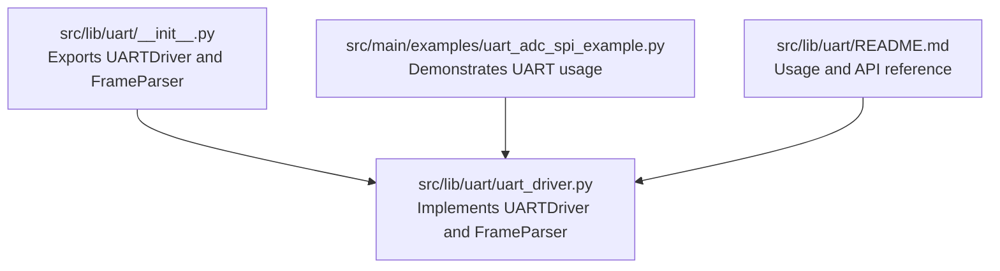
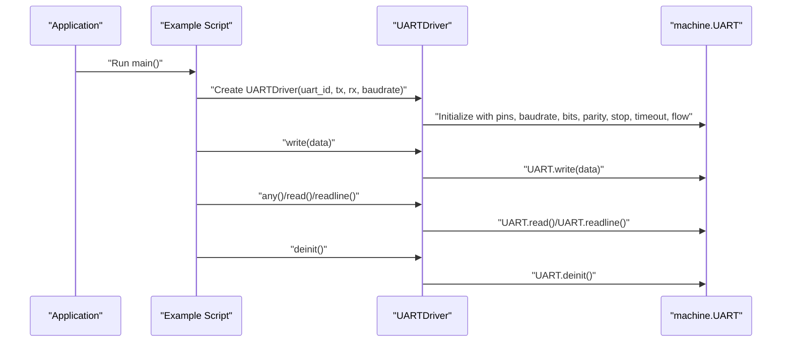
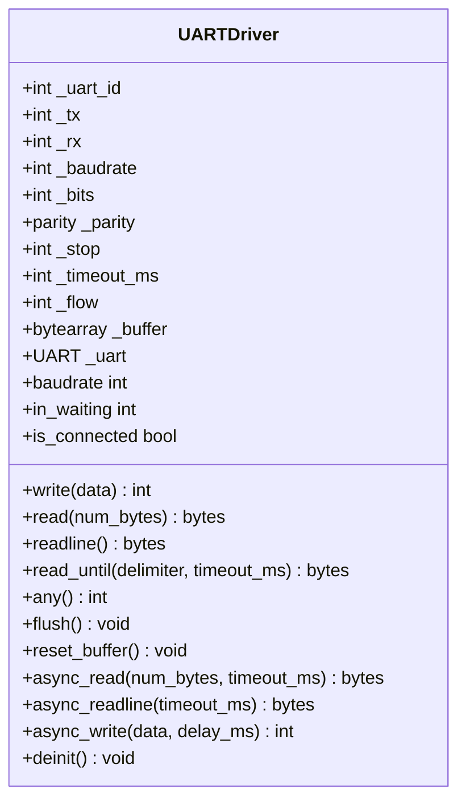
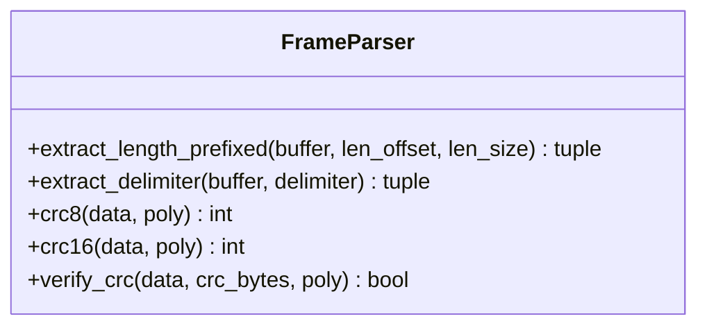
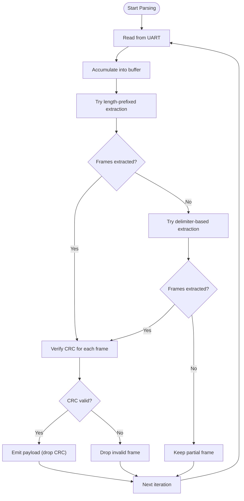
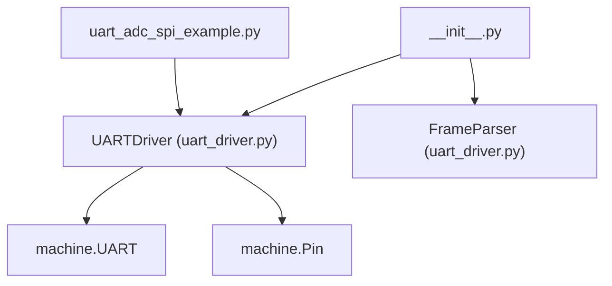

# UART Interface

<cite>
**Referenced Files in This Document**
- [__init__.py](file://src/lib/uart/__init__.py)
- [uart_driver.py](file://src/lib/uart/uart_driver.py)
- [README.md](file://src/lib/uart/README.md)
- [uart_adc_spi_example.py](file://src/main/examples/uart_adc_spi_example.py)
</cite>

## Table of Contents
1. [Introduction](#introduction)
2. [Project Structure](#project-structure)
3. [Core Components](#core-components)
4. [Architecture Overview](#architecture-overview)
5. [Detailed Component Analysis](#detailed-component-analysis)
6. [Dependency Analysis](#dependency-analysis)
7. [Performance Considerations](#performance-considerations)
8. [Troubleshooting Guide](#troubleshooting-guide)
9. [Conclusion](#conclusion)
10. [Appendices](#appendices)

## Introduction
This document provides comprehensive documentation for the UART interface implementation in the ESP32-C3 framework. It focuses on the UARTDriver class, covering initialization parameters, baud rate configuration, and frame format settings (data bits, parity, stop bits). It explains multi-instance support across multiple UART ports, buffer management, and asynchronous communication patterns. It also covers frame parsing techniques, character encoding handling, and flow control mechanisms. Practical examples from the provided example script demonstrate proper UART initialization and data transmission/reception patterns. Finally, it addresses common UART issues such as baud rate mismatches, framing errors, and buffer overflow conditions, along with best practices for signal integrity, noise immunity, and power management in low-power applications.

## Project Structure
The UART functionality is encapsulated under the src/lib/uart module and is demonstrated in the example script located under src/main/examples. The module exposes a public API via its package initializer and provides a robust UART driver with frame parsing capabilities.

**Diagram sources**
- [__init__.py:1-15](file://src/lib/uart/__init__.py#L1-L15)
- [uart_driver.py:1-354](file://src/lib/uart/uart_driver.py#L1-L354)
- [README.md:1-173](file://src/lib/uart/README.md#L1-L173)
- [uart_adc_spi_example.py:1-264](file://src/main/examples/uart_adc_spi_example.py#L1-L264)

**Section sources**
- [__init__.py:1-15](file://src/lib/uart/__init__.py#L1-L15)
- [README.md:1-173](file://src/lib/uart/README.md#L1-L173)

## Core Components
- UARTDriver: A high-level abstraction over machine.UART providing synchronous and asynchronous I/O, timeout handling, buffer management, and optional frame parsing helpers.
- FrameParser: Static helper utilities for extracting frames from UART streams using delimiter-based or length-prefixed schemes, and computing/verifying CRC-8 and CRC-16.

Key capabilities:
- Initialization with configurable uart_id, tx/rx pins, baudrate, data bits, parity, stop bits, timeout, and flow control.
- Character encoding handling for string writes (UTF-8).
- Buffer management for receive path and explicit reset capability.
- Asynchronous read/write primitives integrated with asyncio.
- Frame parsing helpers for delimiter-based and length-prefixed protocols with CRC verification.

**Section sources**
- [uart_driver.py:22-241](file://src/lib/uart/uart_driver.py#L22-L241)
- [uart_driver.py:243-354](file://src/lib/uart/uart_driver.py#L243-L354)
- [README.md:133-161](file://src/lib/uart/README.md#L133-L161)

## Architecture Overview
The UARTDriver wraps machine.UART and augments it with higher-level features such as async I/O, frame parsing, and buffer management. The example demonstrates a typical usage pattern: initialize a UART instance, send data, wait for responses, and properly clean up.

**Diagram sources**
- [uart_adc_spi_example.py:20-40](file://src/main/examples/uart_adc_spi_example.py#L20-L40)
- [uart_driver.py:71-82](file://src/lib/uart/uart_driver.py#L71-L82)
- [uart_driver.py:110-138](file://src/lib/uart/uart_driver.py#L110-L138)
- [uart_driver.py:235-241](file://src/lib/uart/uart_driver.py#L235-L241)

## Detailed Component Analysis

### UARTDriver Class
The UARTDriver class provides a unified interface for UART communication on ESP32-C3. It supports:
- Initialization parameters: uart_id, tx, rx, baudrate, bits, parity, stop, timeout_ms, flow.
- Property accessors for baudrate and connection status.
- Synchronous I/O: write, read, readline, read_until, any, flush, reset_buffer.
- Asynchronous I/O: async_read, async_readline, async_write.
- Cleanup via deinit.

Initialization and configuration:
- The constructor configures the underlying machine.UART with the provided parameters and prints a startup message indicating the configured pins and baud rate.
- Baud rate can be changed dynamically; the underlying UART is re-initialized accordingly.

Buffer management:
- Internal receive buffer is maintained for incremental parsing scenarios.
- reset_buffer clears the internal buffer and drains unread bytes from the hardware FIFO.

Asynchronous operations:
- Async read primitives integrate with asyncio and use cooperative yielding to avoid blocking the event loop.
- Delay after async_write allows inter-frame spacing when needed.

Flow control:
- The flow parameter controls RTS/CTS usage according to supported modes.

**Diagram sources**
- [uart_driver.py:22-241](file://src/lib/uart/uart_driver.py#L22-L241)

**Section sources**
- [uart_driver.py:42-82](file://src/lib/uart/uart_driver.py#L42-L82)
- [uart_driver.py:86-106](file://src/lib/uart/uart_driver.py#L86-L106)
- [uart_driver.py:110-176](file://src/lib/uart/uart_driver.py#L110-L176)
- [uart_driver.py:179-231](file://src/lib/uart/uart_driver.py#L179-L231)
- [uart_driver.py:235-241](file://src/lib/uart/uart_driver.py#L235-L241)

### FrameParser Utilities
FrameParser offers static methods to parse incoming UART streams:
- extract_length_prefixed: Parses length-prefixed frames with configurable offset and length field size.
- extract_delimiter: Splits frames separated by a given delimiter.
- CRC helpers: crc8, crc16, and verify_crc for integrity checks.

These utilities enable building robust serial protocols with structured frames and checksum validation.

**Diagram sources**
- [uart_driver.py:243-354](file://src/lib/uart/uart_driver.py#L243-L354)

**Section sources**
- [uart_driver.py:253-295](file://src/lib/uart/uart_driver.py#L253-L295)
- [uart_driver.py:297-354](file://src/lib/uart/uart_driver.py#L297-L354)

### Multi-Instance Support and Portability
- The driver supports multiple UART instances by varying uart_id, tx, and rx pin assignments.
- The example script demonstrates initializing a UART instance and performing echo-style tests, which can be replicated for multiple ports by creating separate instances with distinct identifiers and pins.
- The README emphasizes that UART0 is reserved for REPL on ESP32-C3, recommending UART1 or UART2 for general use.

Practical guidance:
- Instantiate multiple UARTDriver objects with different uart_id values and pin configurations to serve multiple peripherals concurrently.
- Ensure that pins are mapped correctly for the chosen UART peripheral and that external wiring matches TX/RX connections.

**Section sources**
- [README.md:164-173](file://src/lib/uart/README.md#L164-L173)
- [uart_adc_spi_example.py:20-40](file://src/main/examples/uart_adc_spi_example.py#L20-L40)

### Buffer Management and Overflow Handling
- The driver maintains an internal receive buffer to accumulate partial frames and supports resetting the buffer to recover from overflow or parsing errors.
- reset_buffer clears the internal buffer and drains any unread bytes from the hardware FIFO to prevent stale data accumulation.
- The README documents the reset_buffer method as part of the API reference.

Best practices:
- Periodically drain buffers when parsing long-lived streams.
- Reset buffers proactively when encountering unexpected data or protocol errors.
- Monitor in_waiting to avoid indefinite blocking and to schedule reads efficiently.

**Section sources**
- [uart_driver.py:69-70](file://src/lib/uart/uart_driver.py#L69-L70)
- [uart_driver.py:171-176](file://src/lib/uart/uart_driver.py#L171-L176)
- [README.md:144-146](file://src/lib/uart/README.md#L144-L146)

### Interrupt-Driven Communication Patterns
- The driver relies on the underlying machine.UART’s native buffering and readiness signaling (via any()) rather than explicit interrupts.
- Asynchronous methods integrate with asyncio to cooperatively yield control during waits, enabling efficient concurrent tasks without busy-wait loops.
- For high-throughput or latency-sensitive applications, consider using multiple UART instances and scheduling reads in separate tasks.

**Section sources**
- [uart_driver.py:140-161](file://src/lib/uart/uart_driver.py#L140-L161)
- [uart_driver.py:179-218](file://src/lib/uart/uart_driver.py#L179-L218)

### Frame Parsing Techniques and Character Encoding
- Character encoding: write accepts bytes or str; str inputs are encoded to UTF-8 automatically.
- Frame parsing: combine read/readline with FrameParser utilities to handle delimiter-based or length-prefixed protocols and verify CRC integrity.
- The example script showcases CRC computation and verification and delimiter-based parsing.

**Diagram sources**
- [README.md:86-129](file://src/lib/uart/README.md#L86-L129)
- [uart_driver.py:253-354](file://src/lib/uart/uart_driver.py#L253-L354)

**Section sources**
- [uart_driver.py:117-119](file://src/lib/uart/uart_driver.py#L117-L119)
- [README.md:80-132](file://src/lib/uart/README.md#L80-L132)

### Practical Examples from uart_adc_spi_example.py
- Basic echo test: Initializes a UARTDriver with specific pins and baud rate, sends a message, waits briefly, and reads a response line if available.
- Frame parser demo: Demonstrates CRC computations and verifications, and shows delimiter-based and length-prefixed frame extraction.

These examples illustrate correct initialization, data exchange, and frame parsing workflows.

**Section sources**
- [uart_adc_spi_example.py:20-40](file://src/main/examples/uart_adc_spi_example.py#L20-L40)
- [uart_adc_spi_example.py:45-76](file://src/main/examples/uart_adc_spi_example.py#L45-L76)

## Dependency Analysis
The UART module is self-contained and depends on MicroPython’s machine.UART and Pin abstractions. The example script imports the UART driver and demonstrates its usage in an asyncio context.

**Diagram sources**
- [uart_driver.py:15-19](file://src/lib/uart/uart_driver.py#L15-L19)
- [uart_driver.py:71-81](file://src/lib/uart/uart_driver.py#L71-L81)
- [__init__.py:14-14](file://src/lib/uart/__init__.py#L14-L14)
- [uart_adc_spi_example.py:26-26](file://src/main/examples/uart_adc_spi_example.py#L26-L26)

**Section sources**
- [uart_driver.py:15-19](file://src/lib/uart/uart_driver.py#L15-L19)
- [__init__.py:14-14](file://src/lib/uart/__init__.py#L14-L14)

## Performance Considerations
- Choose appropriate baud rates aligned with device capabilities and cable lengths to minimize errors and maximize throughput.
- Use asynchronous read primitives to keep the event loop responsive when handling multiple concurrent tasks.
- Tune timeout_ms to balance responsiveness and reliability for your application’s latency requirements.
- For high-speed transfers, consider reducing CPU load by batching reads and writes and avoiding excessive polling.
- Monitor in_waiting to adapt read sizes and reduce unnecessary wake-ups.

## Troubleshooting Guide
Common issues and resolutions:
- Baud rate mismatch: Ensure both ends of the UART link use identical baud rates. The driver supports dynamic baud rate updates; adjust both sides consistently.
- Framing errors: Verify data bits, parity, and stop bits match between devices. Incorrect settings lead to misaligned frames and checksum failures.
- Buffer overflow or stale data: Use reset_buffer to clear accumulated data and re-synchronize the parser. Also ensure timely draining of the receive buffer.
- Noisy environments: Use twisted-pair cables, proper grounding, and limit cable lengths. Consider adding filtering or shielding to improve noise immunity.
- Power management: In low-power designs, disable unused UART peripherals and consider sleep modes. Reinitialize UART on wake if needed and flush buffers to discard stale data.

Diagnostic tips:
- Confirm is_connected and in_waiting properties to validate initialization and readiness.
- Use read_until with a known delimiter to detect protocol synchronization points.
- Employ CRC verification to catch corrupted frames early.

**Section sources**
- [uart_driver.py:86-106](file://src/lib/uart/uart_driver.py#L86-L106)
- [uart_driver.py:140-161](file://src/lib/uart/uart_driver.py#L140-L161)
- [README.md:144-146](file://src/lib/uart/README.md#L144-L146)

## Conclusion
The UARTDriver provides a robust, high-level abstraction for ESP32-C3 serial communication, supporting synchronous and asynchronous I/O, configurable frame formats, and powerful frame parsing utilities. By leveraging the provided examples and best practices, developers can implement reliable multi-instance UART systems with proper buffer management, error detection, and performance tuning.

## Appendices

### API Reference Summary
- UARTDriver
  - Methods: __init__, write, read, readline, read_until, any, flush, reset_buffer, async_read, async_readline, async_write, deinit
  - Properties: baudrate, in_waiting, is_connected
- FrameParser
  - Methods: extract_length_prefixed, extract_delimiter, crc8, crc16, verify_crc

**Section sources**
- [README.md:133-161](file://src/lib/uart/README.md#L133-L161)
- [uart_driver.py:243-354](file://src/lib/uart/uart_driver.py#L243-L354)