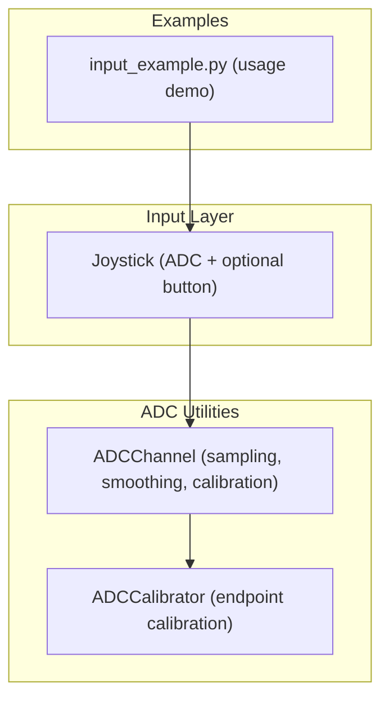
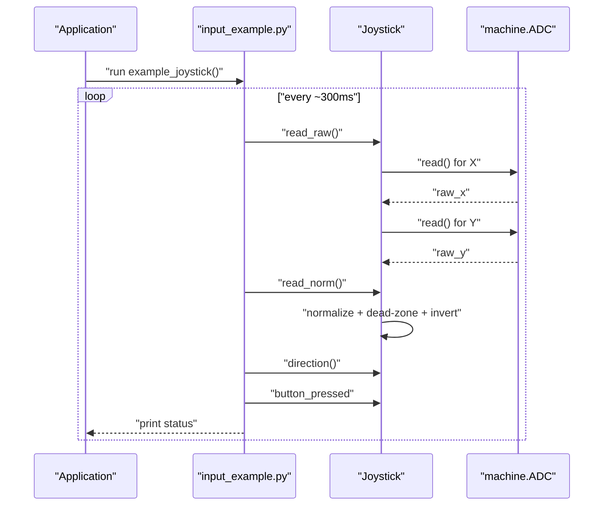
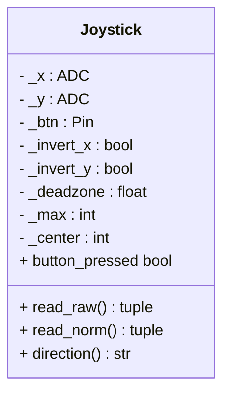
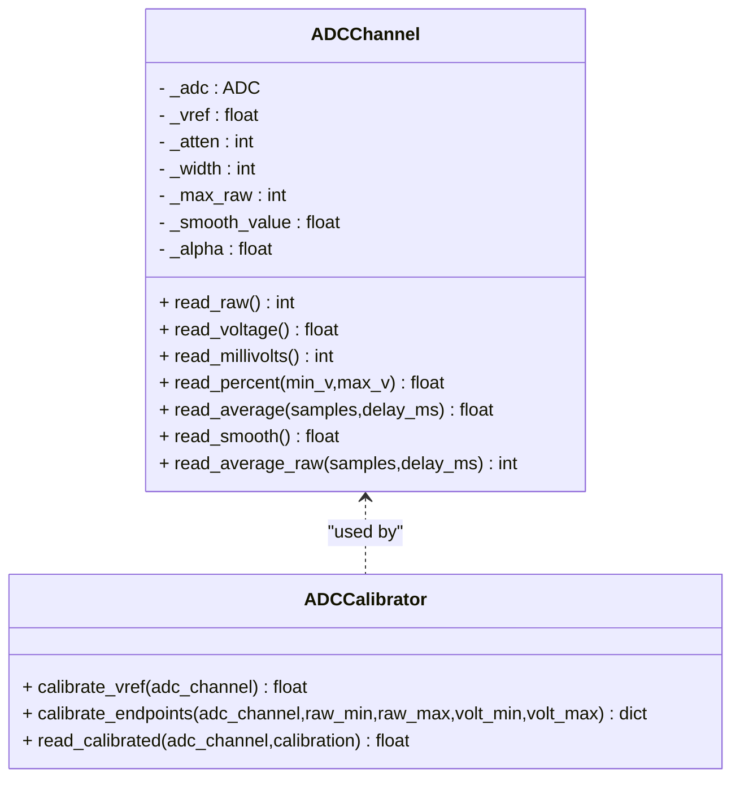
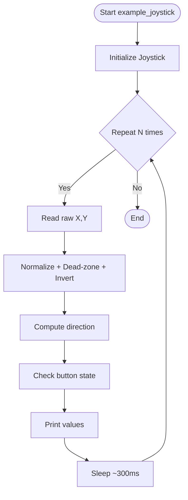
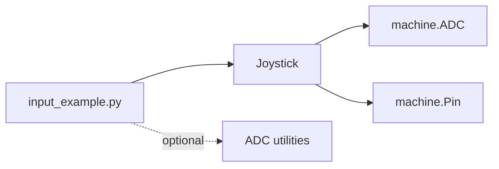

# Analog Inputs

<cite>
**Referenced Files in This Document**
- [joystick.py](file://src/lib/input/joystick.py)
- [input_example.py](file://src/main/examples/input_example.py)
- [adc_channel.py](file://src/lib/adc/adc_channel.py)
- [README.md](file://src/lib/input/README.md)
- [README.md](file://src/lib/README.md)
</cite>

## Table of Contents
1. [Introduction](#introduction)
2. [Project Structure](#project-structure)
3. [Core Components](#core-components)
4. [Architecture Overview](#architecture-overview)
5. [Detailed Component Analysis](#detailed-component-analysis)
6. [Dependency Analysis](#dependency-analysis)
7. [Performance Considerations](#performance-considerations)
8. [Troubleshooting Guide](#troubleshooting-guide)
9. [Conclusion](#conclusion)
10. [Appendices](#appendices)

## Introduction
This document explains analog input devices for the ESP32-C3 platform, with a focus on the Joystick class used for reading analog joysticks and similar sensors. It covers ADC reading, normalization, center detection, dead-zone configuration, coordinate transformations, and integration patterns. It also documents practical usage from input_example.py, and provides guidance on noise filtering, calibration, and power-aware operation.

## Project Structure
The analog input stack centers around:
- Joystick driver for ADC-based analog sticks
- Example usage demonstrating initialization, calibration awareness, and real-time tracking
- ADC channel utilities for advanced sampling, smoothing, and calibration

**Diagram sources**
- [joystick.py:10-66](file://src/lib/input/joystick.py#L10-L66)
- [adc_channel.py:22-276](file://src/lib/adc/adc_channel.py#L22-L276)
- [input_example.py:66-88](file://src/main/examples/input_example.py#L66-L88)

**Section sources**
- [README.md:1-72](file://src/lib/README.md#L1-L72)
- [README.md:1-553](file://src/lib/input/README.md#L1-L553)

## Core Components
- Joystick: Provides normalized axis values, optional button state, and directional interpretation from raw ADC readings.
- ADCChannel: Offers raw, voltage, percent, averaged, and exponentially smoothed readings; supports configurable attenuation and resolution.
- ADCCalibrator: Provides calibration mapping between raw ADC counts and calibrated voltage using two endpoint measurements.

Key capabilities:
- Normalized axes (-1.0 to 1.0) with dead-zone suppression
- Optional inversion per axis
- Directional interpretation ("center", "left", "right", "up", "down")
- Practical example showing real-time raw/norm tracking and button state

**Section sources**
- [joystick.py:10-66](file://src/lib/input/joystick.py#L10-L66)
- [adc_channel.py:22-276](file://src/lib/adc/adc_channel.py#L22-L276)
- [input_example.py:66-88](file://src/main/examples/input_example.py#L66-L88)

## Architecture Overview
The Joystick class encapsulates two ADC channels (X and Y) and an optional button pin. It normalizes raw ADC values to a signed percentage range and applies a dead-zone threshold. The example demonstrates periodic sampling and direction reporting.

**Diagram sources**
- [input_example.py:66-88](file://src/main/examples/input_example.py#L66-L88)
- [joystick.py:31-66](file://src/lib/input/joystick.py#L31-L66)

## Detailed Component Analysis

### Joystick Class
Responsibilities:
- Initialize ADC channels for X and Y axes with 11 dB attenuation
- Read raw ADC values and normalize to [-1.0, 1.0]
- Apply axis inversion and dead-zone suppression
- Provide directional interpretation and button state

Implementation highlights:
- Center detection uses the maximum raw value midpoint
- Dead-zone suppresses small deviations near center
- Direction method compares absolute axis magnitudes to resolve primary direction

**Diagram sources**
- [joystick.py:10-66](file://src/lib/input/joystick.py#L10-L66)

**Section sources**
- [joystick.py:15-66](file://src/lib/input/joystick.py#L15-L66)

### ADCChannel and ADCCalibrator
Capabilities:
- Raw, voltage, millivolt, and percent conversions
- Multi-sample averaging to reduce noise
- Exponentially weighted moving average smoothing
- Calibration helpers for endpoint-based scaling

Practical implications:
- Use averaging or smoothing for noisy analog signals
- Apply endpoint calibration when hardware-specific offsets or scaling differ from ideal
- Choose appropriate attenuation and resolution for your signal range

**Diagram sources**
- [adc_channel.py:22-276](file://src/lib/adc/adc_channel.py#L22-L276)

**Section sources**
- [adc_channel.py:51-178](file://src/lib/adc/adc_channel.py#L51-L178)
- [adc_channel.py:222-276](file://src/lib/adc/adc_channel.py#L222-L276)

### Practical Example: Real-Time Tracking
The example initializes a Joystick and periodically prints raw values, normalized values, direction, and button state. This demonstrates:
- Initialization with ADC pins and optional button pin
- Periodic sampling and printing
- Integration with asynchronous timing

**Diagram sources**
- [input_example.py:66-88](file://src/main/examples/input_example.py#L66-L88)

**Section sources**
- [input_example.py:66-88](file://src/main/examples/input_example.py#L66-L88)

## Dependency Analysis
- Joystick depends on machine.ADC and machine.Pin for hardware access
- ADC utilities are independent and reusable for other analog sensors
- Example code depends on the Joystick class and demonstrates typical usage patterns

**Diagram sources**
- [input_example.py:66-88](file://src/main/examples/input_example.py#L66-L88)
- [joystick.py:18-23](file://src/lib/input/joystick.py#L18-L23)

**Section sources**
- [joystick.py:15-32](file://src/lib/input/joystick.py#L15-L32)
- [input_example.py:66-88](file://src/main/examples/input_example.py#L66-L88)

## Performance Considerations
- Sampling rate and delays: Adjust sleep intervals and averaging window sizes to balance responsiveness and noise reduction.
- Resolution and attenuation: Choose appropriate ADC width and attenuation to maximize signal-to-noise ratio within the expected voltage range.
- Smoothing: Use exponential smoothing for continuous stability when displaying or controlling systems.
- Power consumption: Minimize continuous sampling intervals; consider sleeping between reads when idle.
- Dead-zone tuning: Increase dead-zone to avoid jitter near center; decrease for fine control.

[No sources needed since this section provides general guidance]

## Troubleshooting Guide
Common issues and remedies:
- Center drift: Theoretical center may not be exact; reinitialize with current readings or apply calibration.
- Noisy readings: Enable averaging or smoothing; add filtering capacitors on analog lines.
- Button bouncing: Use debouncing at the application level; ensure proper pull-up/pull-down configuration.
- Direction ambiguity: Verify dead-zone thresholds and axis inversion settings.

**Section sources**
- [README.md:544-553](file://src/lib/input/README.md#L544-L553)
- [adc_channel.py:145-178](file://src/lib/adc/adc_channel.py#L145-L178)

## Conclusion
The Joystick class provides a concise interface for analog stick input on ESP32-C3, with normalization, dead-zone suppression, and direction interpretation. Combined with ADC utilities for averaging, smoothing, and calibration, it enables robust, low-power, and responsive analog input suitable for gaming, robotics, and navigation interfaces.

[No sources needed since this section summarizes without analyzing specific files]

## Appendices

### Coordinate System and Transformations
- Normalized coordinates: Convert raw ADC counts to [-1.0, 1.0] using the center midpoint and scale
- Dead-zone: Suppress small deviations near center to improve stability
- Direction: Compare absolute magnitudes to determine primary axis

**Section sources**
- [joystick.py:34-66](file://src/lib/input/joystick.py#L34-L66)

### Practical Example References
- Initialization and real-time tracking: See the example that prints raw, normalized, direction, and button state

**Section sources**
- [input_example.py:66-88](file://src/main/examples/input_example.py#L66-L88)