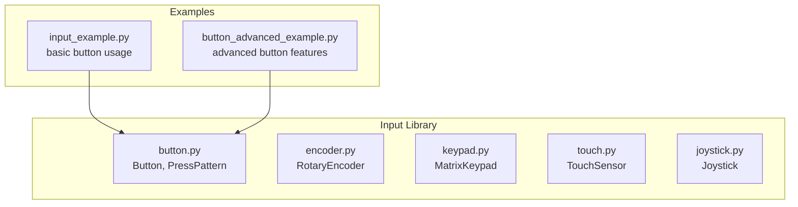
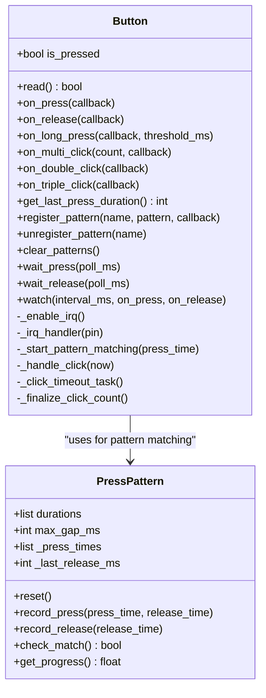
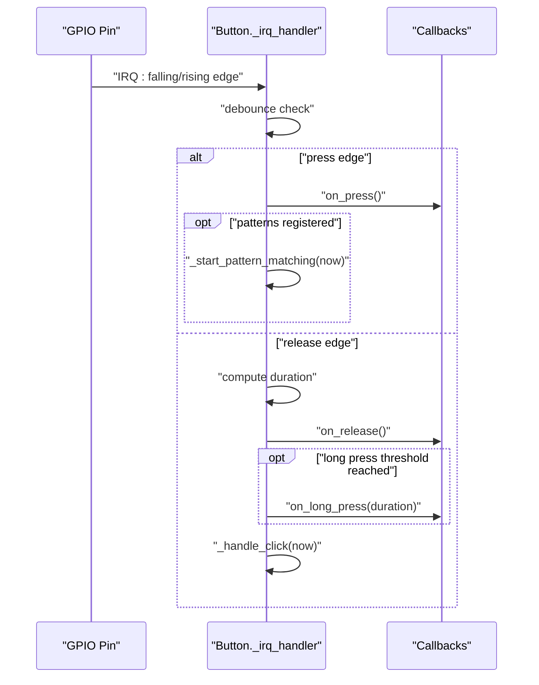
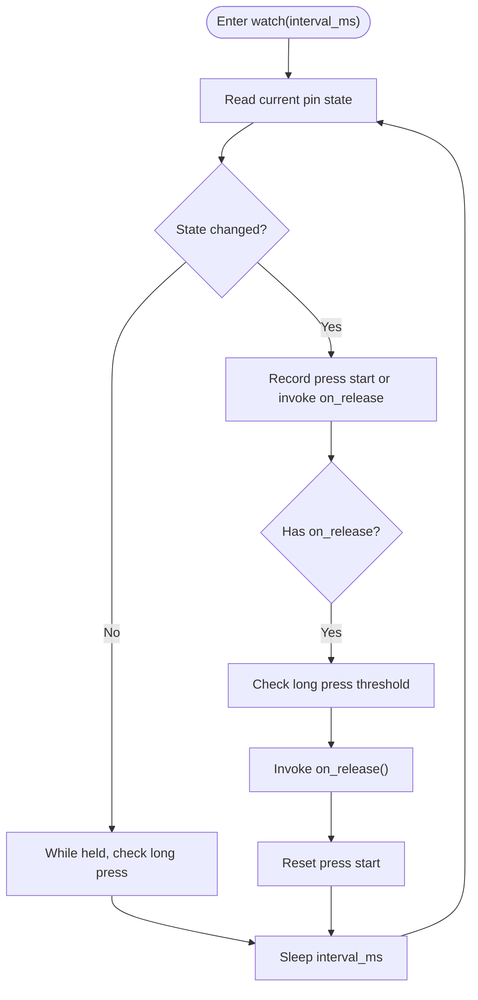
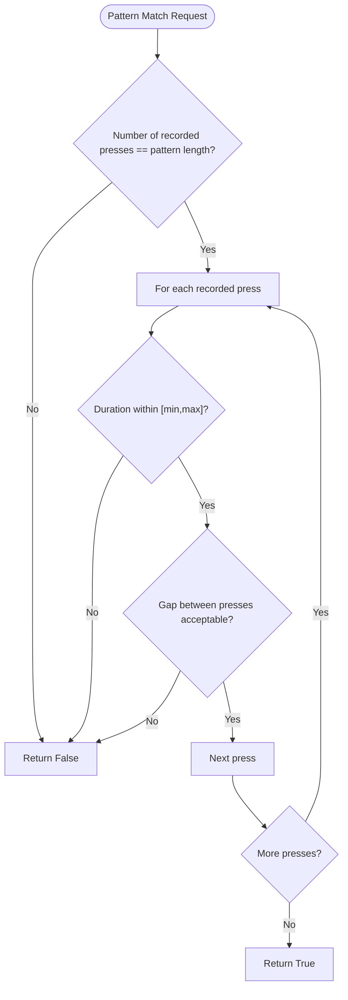
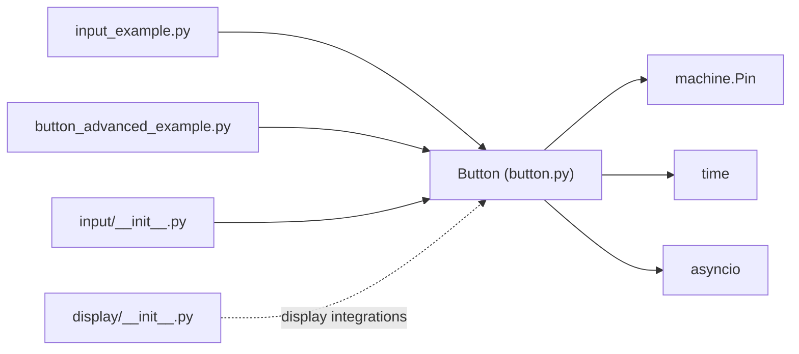

# Button & Switches

<cite>
**Referenced Files in This Document**
- [button.py](file://src/lib/input/button.py)
- [input_example.py](file://src/main/examples/input_example.py)
- [button_advanced_example.py](file://src/main/examples/button_advanced_example.py)
- [__init__.py (input)](file://src/lib/input/__init__.py)
- [__init__.py (display)](file://src/lib/display/__init__.py)
</cite>

## Table of Contents
1. [Introduction](#introduction)
2. [Project Structure](#project-structure)
3. [Core Components](#core-components)
4. [Architecture Overview](#architecture-overview)
5. [Detailed Component Analysis](#detailed-component-analysis)
6. [Dependency Analysis](#dependency-analysis)
7. [Performance Considerations](#performance-considerations)
8. [Troubleshooting Guide](#troubleshooting-guide)
9. [Conclusion](#conclusion)
10. [Appendices](#appendices)

## Introduction
This document explains button and switch input handling in the ESP32-C3 framework, focusing on the Button class implementation. It covers debouncing, press detection timing, state management, and advanced features such as long press detection, multi-click counting, press duration tracking, and pattern recognition. It also compares interrupt-driven and polling-based approaches, outlines debouncing strategies for mechanical switches, and provides practical examples from the repository’s input examples. Finally, it addresses power consumption optimization for continuous polling, input validation, and integration with display systems for visual feedback.

## Project Structure
The input subsystem resides under src/lib/input and exposes the Button class and related input devices. Example scripts demonstrate usage patterns for buttons and other input peripherals.

**Diagram sources**
- [button.py:1-425](file://src/lib/input/button.py#L1-L425)
- [input_example.py:1-88](file://src/main/examples/input_example.py#L1-L88)
- [button_advanced_example.py:1-321](file://src/main/examples/button_advanced_example.py#L1-L321)

**Section sources**
- [__init__.py (input):1-15](file://src/lib/input/__init__.py#L1-L15)
- [input_example.py:12-21](file://src/main/examples/input_example.py#L12-L21)
- [button_advanced_example.py:14-16](file://src/main/examples/button_advanced_example.py#L14-L16)

## Core Components
- Button: Interrupt-driven GPIO driver with debouncing, long press detection, multi-click counting, press duration tracking, pattern recognition, and polling/watch modes.
- PressPattern: A recognizer that matches sequences of press durations and inter-press gaps.

Key capabilities:
- Debouncing via IRQ with minimum time between interrupts.
- Long press detection with configurable threshold.
- Multi-click detection within a configurable click window.
- Press duration tracking and categorization.
- Pattern recognition with named patterns and progress reporting.
- Polling and watch modes for applications that prefer or require polling.

**Section sources**
- [button.py:92-425](file://src/lib/input/button.py#L92-L425)

## Architecture Overview
The Button class integrates hardware-level GPIO interrupts with higher-level state machines for press detection, timing, and pattern matching. It supports registering callbacks for press, release, long press, multi-click counts, and pattern matches. It can also operate in polling/watch mode for environments where interrupts are undesirable or unavailable.

**Diagram sources**
- [button.py:12-90](file://src/lib/input/button.py#L12-L90)
- [button.py:92-425](file://src/lib/input/button.py#L92-L425)

## Detailed Component Analysis

### Button Class Implementation
The Button class encapsulates:
- Pin configuration with internal pull-up/down or floating.
- Debouncing via IRQ handler with a minimum interval.
- Long press detection with a configurable threshold.
- Multi-click detection within a configurable window.
- Press duration tracking and retrieval.
- Pattern recognition engine with named patterns.
- Polling/wait and watch modes for event-driven or polling scenarios.

Debouncing algorithm:
- An IRQ handler filters events that occur closer than a configured debounce interval.
- On press, the press start time is recorded and long-press flag is reset.
- On release, the press duration is computed and stored; long press is checked if not yet triggered.
- Multi-click counting is managed with an async timeout task to finalize click counts within the click window.

Interrupt-driven flow:

**Diagram sources**
- [button.py:241-306](file://src/lib/input/button.py#L241-L306)

Polling/watch mode:
- The watch method continuously reads the pin state at a fixed interval.
- It detects transitions, computes durations, checks long press thresholds, and invokes callbacks.
- This mode avoids interrupts and is suitable for constrained environments or specific use cases.

**Diagram sources**
- [button.py:378-424](file://src/lib/input/button.py#L378-L424)

**Section sources**
- [button.py:111-157](file://src/lib/input/button.py#L111-L157)
- [button.py:241-306](file://src/lib/input/button.py#L241-L306)
- [button.py:368-376](file://src/lib/input/button.py#L368-L376)
- [button.py:378-424](file://src/lib/input/button.py#L378-L424)

### PressPattern Recognition
PressPattern defines a sequence of (min_duration, max_duration) tuples and a maximum inter-press gap. It records press/release timestamps and validates against the pattern specification.

**Diagram sources**
- [button.py:58-83](file://src/lib/input/button.py#L58-L83)

**Section sources**
- [button.py:12-90](file://src/lib/input/button.py#L12-L90)
- [button.py:216-239](file://src/lib/input/button.py#L216-L239)
- [button.py:307-321](file://src/lib/input/button.py#L307-L321)

### Button Types and Detection Patterns
- Momentary tactile switches: Single press/release events with optional long press and multi-click detection.
- Latching/toggle switches: Not directly modeled by Button; however, the same debouncing and timing logic applies to detect transitions and durations.
- Tactile switches: The Button class treats all inputs as momentary tactile switches with configurable pull-up/down and active-low/active-high semantics.

Detection patterns:
- Single click: Standard press/release with duration tracking.
- Double/triple/quadruple/quintuple clicks: Detected within a configurable click window.
- Long press: Triggered when the press duration exceeds a configurable threshold.
- Custom gesture patterns: Defined via PressPattern with explicit duration ranges and inter-press gaps.

**Section sources**
- [button.py:170-206](file://src/lib/input/button.py#L170-L206)
- [button.py:216-239](file://src/lib/input/button.py#L216-L239)
- [button.py:322-366](file://src/lib/input/button.py#L322-L366)

### Practical Examples
- Basic button usage: Demonstrates initializing a Button with pull-up and active-low configuration, waiting for press and release events.
- Advanced features: Shows long press detection, multi-click detection, pattern recognition, duration tracking, async watch, and combined features.

Example references:
- Basic button: [input_example.py:12-21](file://src/main/examples/input_example.py#L12-L21)
- Long press, multi-click, pattern recognition, duration tracking, async watch, combined features: [button_advanced_example.py:19-321](file://src/main/examples/button_advanced_example.py#L19-L321)

**Section sources**
- [input_example.py:12-21](file://src/main/examples/input_example.py#L12-L21)
- [button_advanced_example.py:19-321](file://src/main/examples/button_advanced_example.py#L19-L321)

## Dependency Analysis
The Button class depends on MicroPython machine.Pin and time for timing, and asyncio for async operations. The input library’s package initializer exposes Button for import.

**Diagram sources**
- [button.py:7-9](file://src/lib/input/button.py#L7-L9)
- [input_example.py:13-13](file://src/main/examples/input_example.py#L13-L13)
- [button_advanced_example.py:14-14](file://src/main/examples/button_advanced_example.py#L14-L14)
- [__init__.py (input):10-14](file://src/lib/input/__init__.py#L10-L14)
- [__init__.py (display):1-14](file://src/lib/display/__init__.py#L1-L14)

**Section sources**
- [button.py:7-9](file://src/lib/input/button.py#L7-L9)
- [__init__.py (input):10-14](file://src/lib/input/__init__.py#L10-L14)

## Performance Considerations
- Debounce interval: Tune debounce_ms to filter switch bounce without adding noticeable latency.
- Long press threshold: Set long_press_threshold_ms appropriate to the intended UX; lower values increase sensitivity but may trigger unintentionally.
- Click window: Configure click_window_ms to balance responsiveness and accuracy for multi-click detection.
- Polling vs interrupts:
  - Interrupt-driven mode reduces CPU usage and provides immediate response.
  - Polling/watch mode can reduce interrupt overhead in specific designs but increases CPU usage proportional to interval_ms.
- Power consumption:
  - Prefer interrupt-driven operation when possible.
  - Use sleep/idle modes in main loops and cancel async tasks when not in use.
  - Disable IRQs when pausing input monitoring to save power.
- Memory footprint:
  - Pattern recognition stores recent press/release timestamps; keep pattern lengths reasonable.
  - Multi-click detection uses an async timeout task; cancel tasks when not needed.

[No sources needed since this section provides general guidance]

## Troubleshooting Guide
Common issues and resolutions:
- No press events:
  - Verify pin configuration (pull-up/down) and active_low setting match hardware wiring.
  - Ensure callbacks are registered (on_press/on_release/on_long_press/etc.) to enable IRQs.
- Spurious triggers:
  - Increase debounce_ms to filter switch bounce.
  - Confirm wiring quality and external pull resistors.
- Long press not detected:
  - Adjust long_press_threshold_ms to match expected hold duration.
  - Ensure on_release callback does not consume excessive time before the long press check completes.
- Multi-click not recognized:
  - Verify click_window_ms accommodates user input speed.
  - Ensure on_multi_click handlers are registered for the desired click counts.
- Pattern recognition false positives:
  - Tighten duration ranges in PressPattern.
  - Reduce max_gap_ms to enforce stricter timing between presses.
- Polling/watch mode feels sluggish:
  - Decrease interval_ms for watch() to improve responsiveness.
  - Consider switching to interrupt-driven mode for lower latency.

**Section sources**
- [button.py:111-157](file://src/lib/input/button.py#L111-L157)
- [button.py:241-306](file://src/lib/input/button.py#L241-L306)
- [button.py:378-424](file://src/lib/input/button.py#L378-L424)

## Conclusion
The Button class provides a robust, feature-rich interface for button and switch input handling on ESP32-C3. It combines hardware-level debouncing with flexible software features—long press detection, multi-click counting, duration tracking, and pattern recognition—while supporting both interrupt-driven and polling-based operation. The included examples demonstrate practical initialization, event handling, and advanced capabilities. By tuning debounce, thresholds, and windows, and by choosing the optimal input mode, developers can achieve responsive, power-efficient, and reliable user interactions.

[No sources needed since this section summarizes without analyzing specific files]

## Appendices

### API Reference Summary
- Initialization: Button(pin, pull="up"/"down", active_low=True, debounce_ms=50, long_press_threshold_ms=1000, click_window_ms=300, max_clicks=5)
- Properties and methods:
  - is_pressed: bool
  - read(): bool
  - on_press(callback), on_release(callback)
  - on_long_press(callback, threshold_ms=None)
  - on_multi_click(count, callback), on_double_click(callback), on_triple_click(callback)
  - get_last_press_duration(): int (milliseconds)
  - register_pattern(name, PressPattern, callback), unregister_pattern(name), clear_patterns()
  - wait_press(poll_ms=20), wait_release(poll_ms=20)
  - watch(interval_ms=30, on_press=None, on_release=None)

Integration tips:
- Display feedback: Use display drivers to render button state or gesture recognition results. See display package exports for supported displays and drivers.
- Event-driven vs polling: Choose interrupt-driven for responsiveness and power efficiency; use watch() for environments requiring polling.

**Section sources**
- [button.py:92-425](file://src/lib/input/button.py#L92-L425)
- [__init__.py (display):1-14](file://src/lib/display/__init__.py#L1-L14)