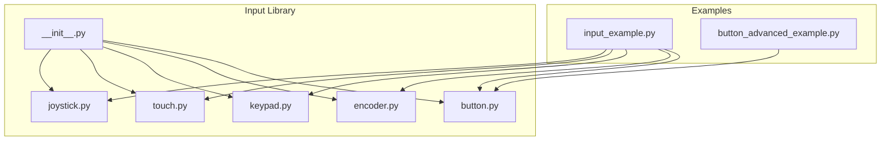
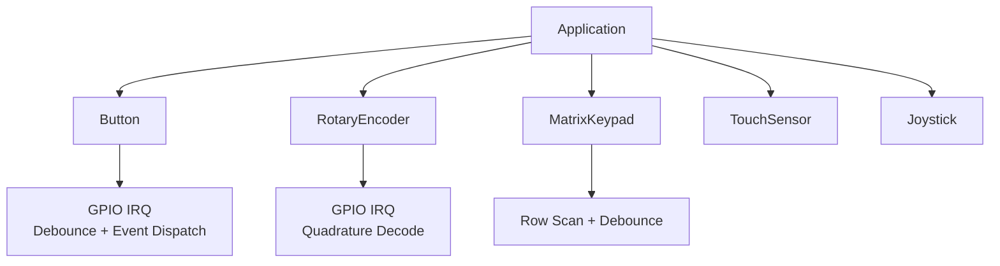
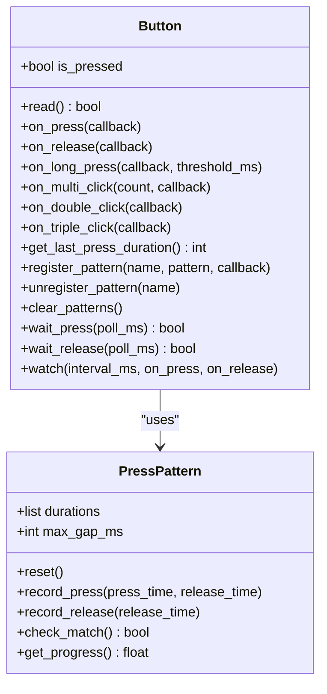
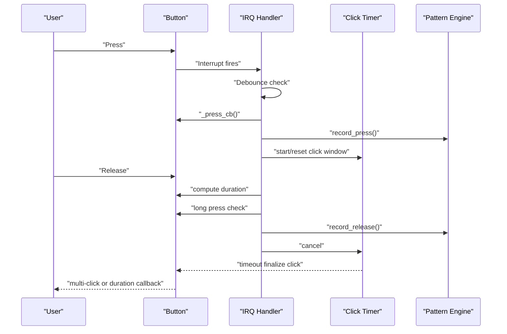
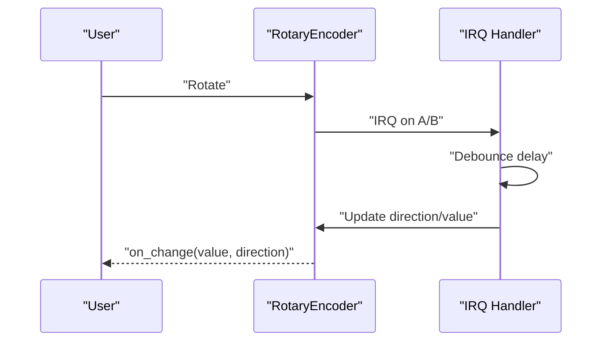
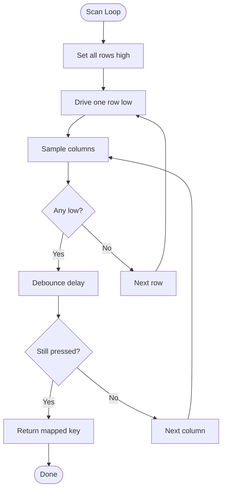
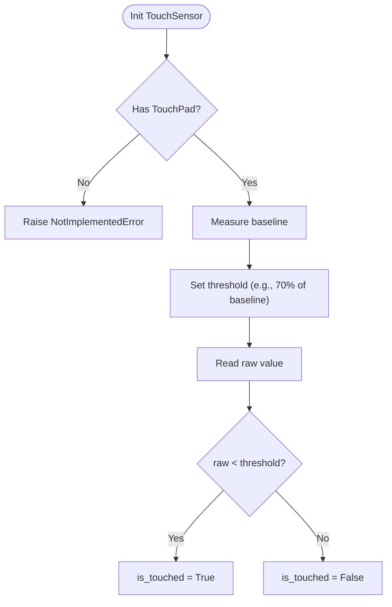
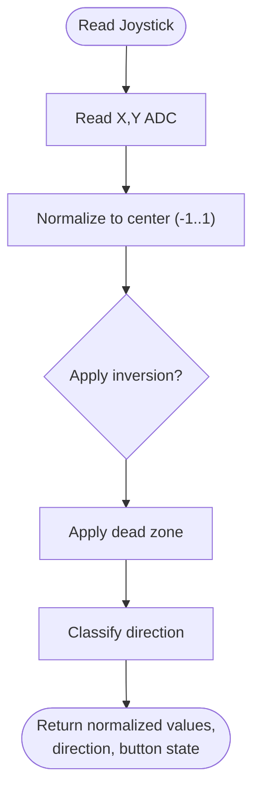
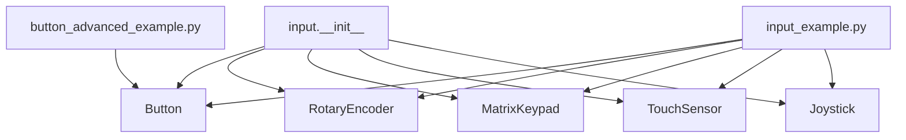

# Input Systems

<cite>
**Referenced Files in This Document**
- [__init__.py](file://src/lib/input/__init__.py)
- [button.py](file://src/lib/input/button.py)
- [encoder.py](file://src/lib/input/encoder.py)
- [keypad.py](file://src/lib/input/keypad.py)
- [touch.py](file://src/lib/input/touch.py)
- [joystick.py](file://src/lib/input/joystick.py)
- [input_example.py](file://src/main/examples/input_example.py)
- [button_advanced_example.py](file://src/main/examples/button_advanced_example.py)
</cite>

## Table of Contents
1. [Introduction](#introduction)
2. [Project Structure](#project-structure)
3. [Core Components](#core-components)
4. [Architecture Overview](#architecture-overview)
5. [Detailed Component Analysis](#detailed-component-analysis)
6. [Dependency Analysis](#dependency-analysis)
7. [Performance Considerations](#performance-considerations)
8. [Troubleshooting Guide](#troubleshooting-guide)
9. [Conclusion](#conclusion)
10. [Appendices](#appendices)

## Introduction
This document explains the input systems for the ESP32-C3 framework, focusing on button and switch handling with debouncing and advanced press pattern recognition, rotary encoders with direction detection and value tracking, matrix keypad scanning and key mapping, analog joystick reading with calibration and dead zones, and capacitive touch sensors with threshold management. It also covers input event processing, state management, interrupt handling, debouncing algorithms, latency optimization, power considerations for continuous polling, integration with display systems for user feedback, and best practices for validation, error handling, and user experience.

## Project Structure
The input subsystem is organized under a dedicated library module with individual drivers for each input type. Example scripts demonstrate usage patterns for buttons, rotary encoders, keypads, touch sensors, and joysticks.

**Diagram sources**
- [__init__.py:1-15](file://src/lib/input/__init__.py#L1-L15)
- [button.py:1-425](file://src/lib/input/button.py#L1-L425)
- [encoder.py:1-90](file://src/lib/input/encoder.py#L1-L90)
- [keypad.py:1-81](file://src/lib/input/keypad.py#L1-L81)
- [touch.py:1-60](file://src/lib/input/touch.py#L1-L60)
- [joystick.py:1-66](file://src/lib/input/joystick.py#L1-L66)
- [input_example.py:1-88](file://src/main/examples/input_example.py#L1-L88)
- [button_advanced_example.py:1-321](file://src/main/examples/button_advanced_example.py#L1-L321)

**Section sources**
- [__init__.py:1-15](file://src/lib/input/__init__.py#L1-L15)
- [input_example.py:1-88](file://src/main/examples/input_example.py#L1-L88)
- [button_advanced_example.py:1-321](file://src/main/examples/button_advanced_example.py#L1-L321)

## Core Components
- Button driver with interrupt-driven debouncing, long press detection, multi-click counting, press-duration tracking, pattern recognition engine, and polling/watch modes.
- Rotary encoder driver with quadrature decoding, direction detection, value clamping, and optional push-button support.
- Matrix keypad driver with row/column scanning, debouncing, and async polling/watch modes.
- Capacitive touch sensor driver with baseline calibration, threshold management, and touch detection.
- Analog joystick driver with ADC sampling, normalization, inversion, dead zone handling, and directional mapping.

**Section sources**
- [button.py:92-425](file://src/lib/input/button.py#L92-L425)
- [encoder.py:11-90](file://src/lib/input/encoder.py#L11-L90)
- [keypad.py:11-81](file://src/lib/input/keypad.py#L11-L81)
- [touch.py:11-60](file://src/lib/input/touch.py#L11-L60)
- [joystick.py:10-66](file://src/lib/input/joystick.py#L10-L66)

## Architecture Overview
The input system is built around lightweight drivers that encapsulate hardware-specific behavior and expose a consistent interface for event handling and polling. Interrupts are used where appropriate (buttons, encoders, keypads) to minimize CPU load and latency. Async helpers enable non-blocking waits and periodic watching for user feedback integration.

**Diagram sources**
- [button.py:241-306](file://src/lib/input/button.py#L241-L306)
- [encoder.py:42-63](file://src/lib/input/encoder.py#L42-L63)
- [keypad.py:42-61](file://src/lib/input/keypad.py#L42-L61)

## Detailed Component Analysis

### Button Driver
The Button driver manages GPIO interrupts for debounced press/release events, supports long press detection, multi-click counting, press-duration tracking, and pattern recognition. It exposes async polling and watch modes for integration with display and UI loops.

Key capabilities:
- Debouncing via interrupt handler with configurable debounce window.
- Long press detection with configurable threshold.
- Multi-click detection within a configurable click window.
- Press duration tracking for categorization and UX decisions.
- Pattern recognition engine supporting custom sequences with gap constraints.
- Async polling and watch modes for non-interrupt contexts.

**Diagram sources**
- [button.py:12-90](file://src/lib/input/button.py#L12-L90)
- [button.py:92-425](file://src/lib/input/button.py#L92-L425)

**Diagram sources**
- [button.py:248-306](file://src/lib/input/button.py#L248-L306)
- [button.py:350-367](file://src/lib/input/button.py#L350-L367)
- [button.py:307-321](file://src/lib/input/button.py#L307-L321)

**Section sources**
- [button.py:92-425](file://src/lib/input/button.py#L92-L425)
- [button_advanced_example.py:19-201](file://src/main/examples/button_advanced_example.py#L19-L201)

### Rotary Encoder Driver
The RotaryEncoder driver decodes quadrature signals to detect direction and accumulate counts. It supports optional push-button input and value clamping within configurable bounds.

Key capabilities:
- Quadrature decoding with interrupt-driven updates.
- Direction detection (+1/-1) per step.
- Value clamping to min/max boundaries.
- Optional button pin with debounced detection.
- Change callback with current value and direction.

**Diagram sources**
- [encoder.py:42-63](file://src/lib/input/encoder.py#L42-L63)

**Section sources**
- [encoder.py:11-90](file://src/lib/input/encoder.py#L11-L90)
- [input_example.py:23-35](file://src/main/examples/input_example.py#L23-L35)

### Matrix Keypad Driver
The MatrixKeypad driver performs row/column scanning to detect pressed keys. It includes debouncing and async polling/watch modes for integration with UI systems.

Key capabilities:
- Row pins driven low, column pins pulled up to detect closure.
- Debounce after key detection by re-sampling until released.
- Async polling and watch modes for non-blocking operation.

**Diagram sources**
- [keypad.py:42-61](file://src/lib/input/keypad.py#L42-L61)

**Section sources**
- [keypad.py:11-81](file://src/lib/input/keypad.py#L11-L81)
- [input_example.py:37-49](file://src/main/examples/input_example.py#L37-L49)

### Capacitive Touch Sensor Driver
The TouchSensor driver reads capacitive touch values and determines touch state against a dynamic threshold. It raises a platform-specific error on unsupported chips.

Key capabilities:
- Baseline measurement and automatic threshold calculation.
- Manual threshold adjustment.
- Touch detection via raw value comparison.
- Not supported on ESP32-C3/C6 due to missing TouchPad class.

**Diagram sources**
- [touch.py:19-60](file://src/lib/input/touch.py#L19-L60)

**Section sources**
- [touch.py:11-60](file://src/lib/input/touch.py#L11-L60)
- [input_example.py:51-64](file://src/main/examples/input_example.py#L51-L64)

### Analog Joystick Driver
The Joystick driver reads dual-axis ADC values, normalizes them to [-1, 1], applies inversion flags, enforces a dead zone, and reports directional mapping and button state.

Key capabilities:
- ADC attenuation configured for wide input range.
- Normalized readings with optional axis inversion.
- Dead zone suppression for center region.
- Direction classification and button detection.

**Diagram sources**
- [joystick.py:31-66](file://src/lib/input/joystick.py#L31-L66)

**Section sources**
- [joystick.py:10-66](file://src/lib/input/joystick.py#L10-L66)
- [input_example.py:66-75](file://src/main/examples/input_example.py#L66-L75)

## Dependency Analysis
The input library exposes a unified namespace and each driver is self-contained with minimal external dependencies. Example scripts demonstrate usage patterns and event-driven integration.

**Diagram sources**
- [__init__.py:10-15](file://src/lib/input/__init__.py#L10-L15)
- [input_example.py:1-88](file://src/main/examples/input_example.py#L1-L88)
- [button_advanced_example.py:1-321](file://src/main/examples/button_advanced_example.py#L1-L321)

**Section sources**
- [__init__.py:1-15](file://src/lib/input/__init__.py#L1-L15)
- [input_example.py:1-88](file://src/main/examples/input_example.py#L1-L88)
- [button_advanced_example.py:1-321](file://src/main/examples/button_advanced_example.py#L1-L321)

## Performance Considerations
- Interrupt-driven input (buttons, encoders, keypads) minimizes CPU usage and reduces latency compared to polling. Use debounce windows tuned to hardware noise characteristics.
- For continuous polling scenarios (e.g., keypad watch), choose reasonable intervals to balance responsiveness and power consumption.
- Debounce thresholds should account for mechanical bounce and electrical noise; typical values are tens to hundreds of milliseconds depending on hardware.
- Pattern recognition and multi-click detection rely on timers; ensure click windows are appropriate for intended user interactions.
- ADC sampling for joysticks should consider conversion speed and averaging if needed; dead zones reduce unnecessary UI updates.
- Touch sensors require stable baselines; frequent recalibration can increase power usage; adjust sampling rate accordingly.
- Disable interrupts when idle to save power; re-enable only during active input sessions.

[No sources needed since this section provides general guidance]

## Troubleshooting Guide
Common issues and resolutions:
- Buttons not responding:
  - Verify pull-up/pull-down configuration matches hardware.
  - Increase debounce threshold if mechanical bounce causes false triggers.
  - Ensure IRQ handler is enabled and not disabled prematurely.
- Multi-click and long press not firing:
  - Confirm click window and long press thresholds are set appropriately.
  - Check that callbacks are registered and not overwritten.
- Rotary encoder drift or missed steps:
  - Adjust minimum IRQ interval to avoid missed edges.
  - Verify wiring and pull-ups on A/B pins.
- Keypad not detecting keys:
  - Confirm row pins are outputs and columns are inputs with pull-ups.
  - Increase debounce delay to accommodate noisy switches.
- Touch sensor not supported:
  - TouchSensor raises a platform-specific error on unsupported chips; use alternative input methods.
- Joystick values jittery:
  - Increase dead zone to filter noise near center position.
  - Consider inversion flags if axes appear swapped.
- Power consumption too high:
  - Prefer interrupt-driven input over tight polling loops.
  - Disable unused IRQs and reduce watch intervals.

**Section sources**
- [button.py:241-306](file://src/lib/input/button.py#L241-L306)
- [encoder.py:42-63](file://src/lib/input/encoder.py#L42-L63)
- [keypad.py:42-61](file://src/lib/input/keypad.py#L42-L61)
- [touch.py:19-23](file://src/lib/input/touch.py#L19-L23)
- [joystick.py:31-51](file://src/lib/input/joystick.py#L31-L51)

## Conclusion
The ESP32-C3 input system provides robust, modular drivers for buttons, rotary encoders, keypads, joysticks, and capacitive touch sensors. By leveraging interrupts, debouncing, and async patterns, applications can achieve responsive, power-efficient input handling suitable for embedded UIs and interactive devices. The included examples illustrate practical integration patterns and advanced features such as long press detection, multi-click counting, pattern recognition, and continuous monitoring.

[No sources needed since this section summarizes without analyzing specific files]

## Appendices

### Practical Examples Index
- Button basics and polling:
  - [example_button:12-21](file://src/main/examples/input_example.py#L12-L21)
- Rotary encoder change notifications:
  - [example_encoder:23-35](file://src/main/examples/input_example.py#L23-L35)
- Matrix keypad key waiting:
  - [example_keypad:37-49](file://src/main/examples/input_example.py#L37-L49)
- Capacitive touch sensor usage with fallback:
  - [example_touch:51-64](file://src/main/examples/input_example.py#L51-L64)
- Joystick raw/norm readings and direction:
  - [example_joystick:66-75](file://src/main/examples/input_example.py#L66-L75)
- Advanced button features (long press, multi-click, patterns, duration):
  - [button_advanced_example.py:19-321](file://src/main/examples/button_advanced_example.py#L19-L321)

**Section sources**
- [input_example.py:12-75](file://src/main/examples/input_example.py#L12-L75)
- [button_advanced_example.py:19-321](file://src/main/examples/button_advanced_example.py#L19-L321)