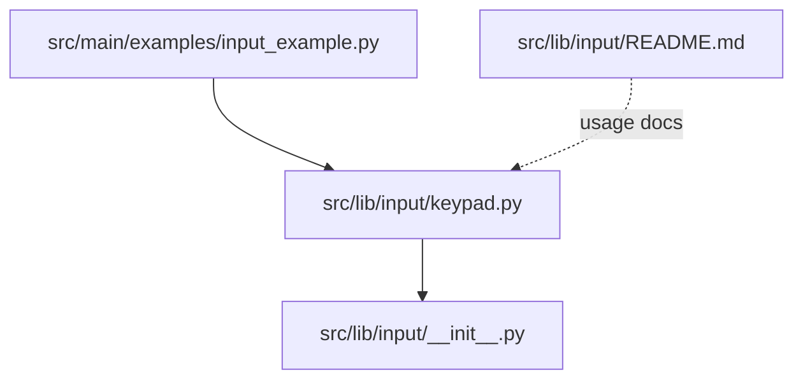
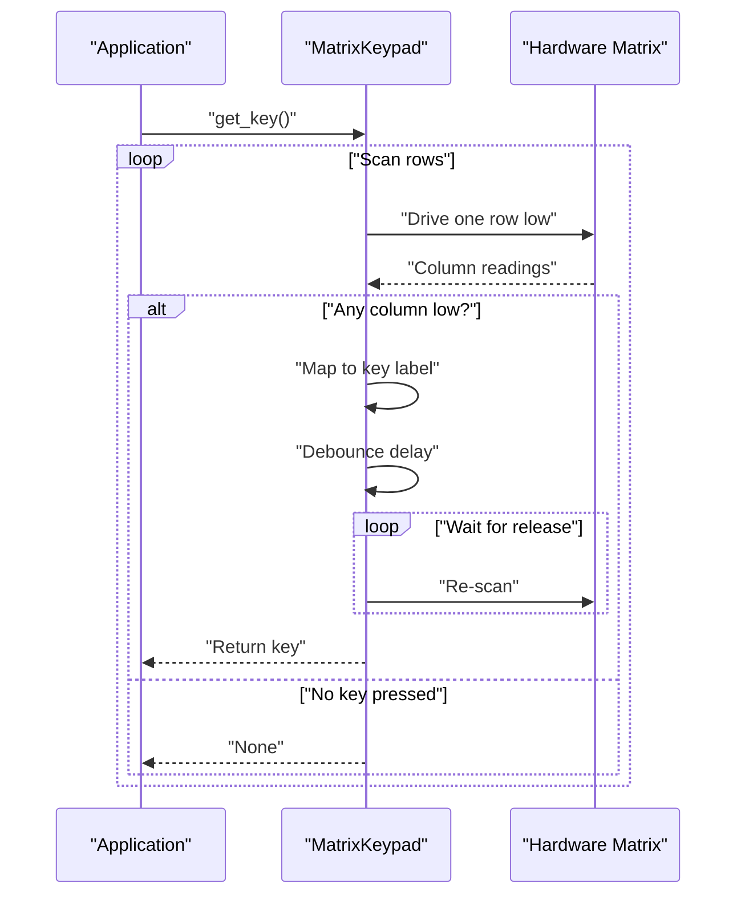
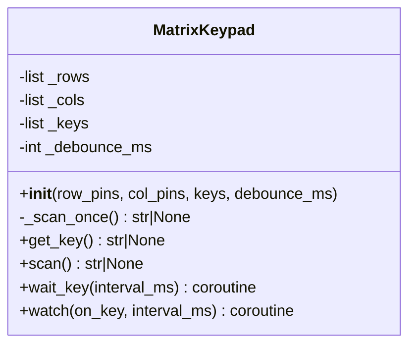
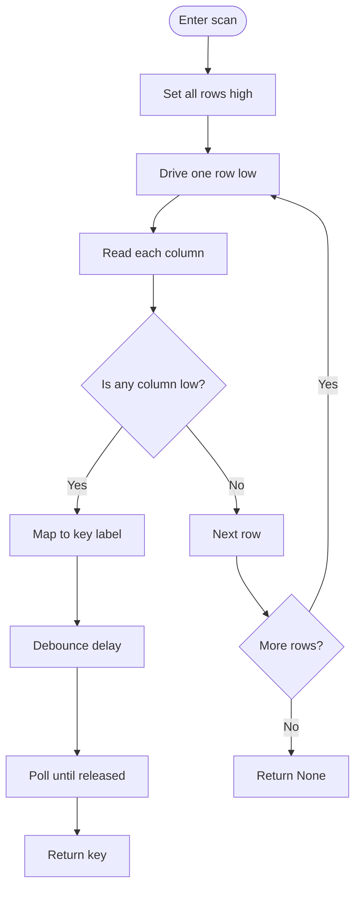
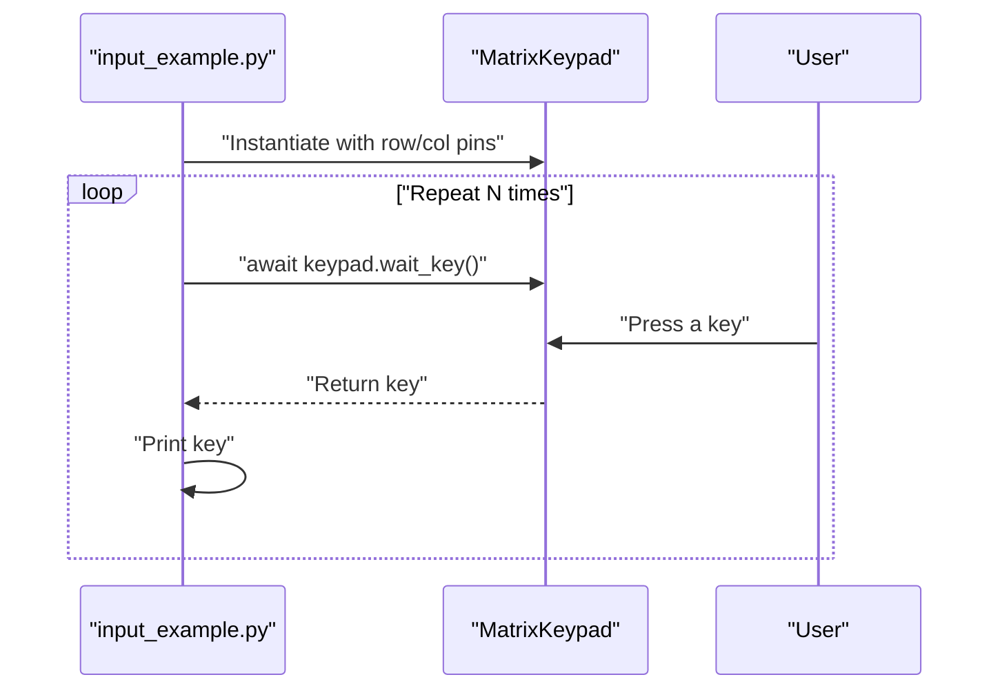
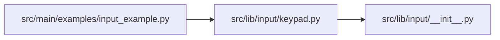

# Keypads & Keyboards

<cite>
**Referenced Files in This Document**
- [input_example.py](file://src/main/examples/input_example.py)
- [keypad.py](file://src/lib/input/keypad.py)
- [README.md](file://src/lib/input/README.md)
- [__init__.py](file://src/lib/input/__init__.py)
</cite>

## Table of Contents
1. [Introduction](#introduction)
2. [Project Structure](#project-structure)
3. [Core Components](#core-components)
4. [Architecture Overview](#architecture-overview)
5. [Detailed Component Analysis](#detailed-component-analysis)
6. [Dependency Analysis](#dependency-analysis)
7. [Performance Considerations](#performance-considerations)
8. [Troubleshooting Guide](#troubleshooting-guide)
9. [Conclusion](#conclusion)
10. [Appendices](#appendices)

## Introduction
This document explains matrix keypad and keyboard input handling in the ESP32-C3 framework, focusing on the Keypad class implementation and practical usage patterns. It covers matrix scanning algorithms, row/column multiplexing, key mapping strategies, layout variants (4x3, 4x4, custom), scan timing optimization, and debouncing. It also documents asynchronous scanning via polling, integration with user interface systems for menu navigation and data entry, and how to adapt the keypad driver for different hardware setups.

## Project Structure
The keypad functionality is implemented as part of the input library and demonstrated in example scripts:
- Keypad driver: src/lib/input/keypad.py
- Example usage: src/main/examples/input_example.py
- Library index: src/lib/input/__init__.py
- Documentation: src/lib/input/README.md

**Diagram sources**
- [input_example.py:37-49](file://src/main/examples/input_example.py#L37-L49)
- [keypad.py:11-81](file://src/lib/input/keypad.py#L11-L81)
- [__init__.py:10-14](file://src/lib/input/__init__.py#L10-L14)
- [README.md:342-432](file://src/lib/input/README.md#L342-L432)

**Section sources**
- [input_example.py:37-49](file://src/main/examples/input_example.py#L37-L49)
- [keypad.py:11-81](file://src/lib/input/keypad.py#L11-L81)
- [__init__.py:10-14](file://src/lib/input/__init__.py#L10-L14)
- [README.md:342-432](file://src/lib/input/README.md#L342-L432)

## Core Components
- MatrixKeypad class: Implements GPIO-based matrix scanning for 3x4 and 4x4 layouts, debounced key reading, and asynchronous waiting/watching for key events.
- Example usage: Demonstrates instantiation with row and column pins, and awaiting keys in an async loop.

Key capabilities:
- Row pins configured as outputs (high-impedance when idle)
- Column pins configured as inputs with internal pull-up
- Automatic key mapping for standard layouts or custom layouts
- Debounce handling during key press detection
- Asynchronous polling via wait_key and watch

**Section sources**
- [keypad.py:19-40](file://src/lib/input/keypad.py#L19-L40)
- [keypad.py:42-60](file://src/lib/input/keypad.py#L42-L60)
- [keypad.py:65-81](file://src/lib/input/keypad.py#L65-L81)
- [input_example.py:37-49](file://src/main/examples/input_example.py#L37-L49)

## Architecture Overview
The keypad driver uses a simple matrix scanning approach:
- Drive one row low while keeping others high
- Sample column inputs; a low indicates a pressed key
- Map the row/column indices to a key label via a layout table
- Debounce by waiting a fixed period and polling until the key is released

**Diagram sources**
- [keypad.py:42-60](file://src/lib/input/keypad.py#L42-L60)

## Detailed Component Analysis

### MatrixKeypad Class
The class encapsulates:
- Initialization with row and column pin lists, optional custom key layout, and debounce duration
- Scanning logic to detect a single pressed key
- Debounce handling to filter mechanical bounce
- Asynchronous helpers to wait for keys or continuously watch for key events

Implementation highlights:
- Pin configuration: rows as outputs initialized high; columns as inputs with pull-up
- Layout defaults: 4x4 numeric/tel-style layout if 4 rows and 4 columns; otherwise 3x4 numeric layout
- Debounce: fixed delay after detecting a key press, plus polling until the key is released
- Asynchronous methods: wait_key returns immediately upon key detection; watch invokes a callback on each detected key

**Diagram sources**
- [keypad.py:11-81](file://src/lib/input/keypad.py#L11-L81)

**Section sources**
- [keypad.py:19-40](file://src/lib/input/keypad.py#L19-L40)
- [keypad.py:42-60](file://src/lib/input/keypad.py#L42-L60)
- [keypad.py:65-81](file://src/lib/input/keypad.py#L65-L81)

### Scanning Algorithm and Debounce Flow
The scanning process:
- Iterate through rows, setting all rows high, then drive one row low
- For each column, read the input; if low, a key is pressed at that location
- Map coordinates to a key label from the layout table
- Apply debounce: wait for the debounce duration, then poll repeatedly until the key is no longer detected

**Diagram sources**
- [keypad.py:42-60](file://src/lib/input/keypad.py#L42-L60)

**Section sources**
- [keypad.py:42-60](file://src/lib/input/keypad.py#L42-L60)

### Layouts and Key Mapping
- Default layouts:
  - 4x4 layout for 4 rows × 4 columns
  - 3x4 layout for other configurations
- Custom layouts:
  - Supply a two-dimensional list of strings to define labels per cell
  - The driver maps row/column indices to entries in this table

Practical guidance:
- Ensure the number of rows and columns matches the layout table dimensions
- Use distinct labels for special keys (digits, symbols, function letters)

**Section sources**
- [keypad.py:25-40](file://src/lib/input/keypad.py#L25-L40)
- [README.md:358-365](file://src/lib/input/README.md#L358-L365)

### Asynchronous Scanning: wait_key and watch
- wait_key: Polling loop that checks for a key and returns when detected; configurable polling interval
- watch: Continuous polling loop invoking a callback when a key is detected; supports both sync and async callbacks

Integration tips:
- Use wait_key for simple blocking-style awaiting
- Use watch for continuous monitoring and event-driven UI updates

**Section sources**
- [keypad.py:65-81](file://src/lib/input/keypad.py#L65-L81)

### Practical Example: Keypad Initialization and Event Processing
The example demonstrates:
- Creating a MatrixKeypad with row and column pins
- Awaiting keys in an async loop
- Printing detected keys

**Diagram sources**
- [input_example.py:37-49](file://src/main/examples/input_example.py#L37-L49)
- [keypad.py:65-70](file://src/lib/input/keypad.py#L65-L70)

**Section sources**
- [input_example.py:37-49](file://src/main/examples/input_example.py#L37-L49)

### Advanced Example: PIN Entry System
The documentation includes a professional example of a PIN entry system using the keypad:
- Uses wait_key to collect digits
- Treats specific keys as control actions (e.g., clear, submit)
- Demonstrates integration with UI feedback and validation

**Section sources**
- [README.md:398-430](file://src/lib/input/README.md#L398-L430)

## Dependency Analysis
Module-level dependencies:
- The keypad module is exposed via the input package’s __init__.py
- Example scripts import the keypad class from the input package

**Diagram sources**
- [input_example.py:37-49](file://src/main/examples/input_example.py#L37-L49)
- [keypad.py:11-81](file://src/lib/input/keypad.py#L11-L81)
- [__init__.py:10-14](file://src/lib/input/__init__.py#L10-L14)

**Section sources**
- [input_example.py:37-49](file://src/main/examples/input_example.py#L37-L49)
- [__init__.py:10-14](file://src/lib/input/__init__.py#L10-L14)

## Performance Considerations
- Scan rate and polling interval:
  - The polling interval controls how often the keypad is checked; smaller intervals increase responsiveness but consume more CPU time
  - Adjust interval_ms in wait_key and watch to balance latency and power usage
- Debounce duration:
  - The fixed debounce delay reduces false positives caused by mechanical bounce; tune debounce_ms to match hardware quality
- Power consumption:
  - Keep polling intervals reasonable; avoid overly frequent scans when the keypad is idle
  - Consider deep sleep or reduced polling when the device is not expecting input
- Matrix scanning overhead:
  - Scanning involves driving rows high/low and reading columns; keep the number of rows/columns minimal for the target layout

[No sources needed since this section provides general guidance]

## Troubleshooting Guide
Common issues and resolutions:
- No keys detected:
  - Verify wiring: rows as outputs, columns as inputs with pull-up enabled
  - Confirm the layout dimensions match the actual keypad
- Random or repeated key presses:
  - Increase debounce_ms to filter bounce
  - Ensure the keypad is clean and contacts are making good contact
- Keys not releasing:
  - Debounce waits until the key is released; if stuck, re-check wiring and layout mapping
- Asynchronous behavior:
  - Use wait_key for simple awaited detection or watch for continuous monitoring; ensure callbacks are non-blocking for responsive UI

**Section sources**
- [keypad.py:19-23](file://src/lib/input/keypad.py#L19-L23)
- [keypad.py:53-60](file://src/lib/input/keypad.py#L53-L60)
- [README.md:544-553](file://src/lib/input/README.md#L544-L553)

## Conclusion
The MatrixKeypad driver provides a straightforward, efficient way to handle matrix keypads on ESP32 devices. Its polling-based scanning, configurable debounce, and asynchronous helpers enable flexible integration into UI systems for menu navigation and data entry. By tuning scan intervals and debounce durations, developers can optimize responsiveness and power usage for real-world applications.

[No sources needed since this section summarizes without analyzing specific files]

## Appendices

### API Summary
- Constructor parameters:
  - rows: list of row pin numbers
  - cols: list of column pin numbers
  - keys: optional custom layout table
  - debounce_ms: debounce delay in milliseconds
- Methods:
  - get_key(): returns the currently pressed key or None
  - scan(): returns the current key without debounce handling
  - wait_key(interval_ms): coroutine that returns on first detected key
  - watch(on_key, interval_ms): coroutine that continuously invokes on_key on key events

**Section sources**
- [keypad.py:19-40](file://src/lib/input/keypad.py#L19-L40)
- [keypad.py:53-60](file://src/lib/input/keypad.py#L53-L60)
- [keypad.py:65-81](file://src/lib/input/keypad.py#L65-L81)
- [README.md:373-379](file://src/lib/input/README.md#L373-L379)