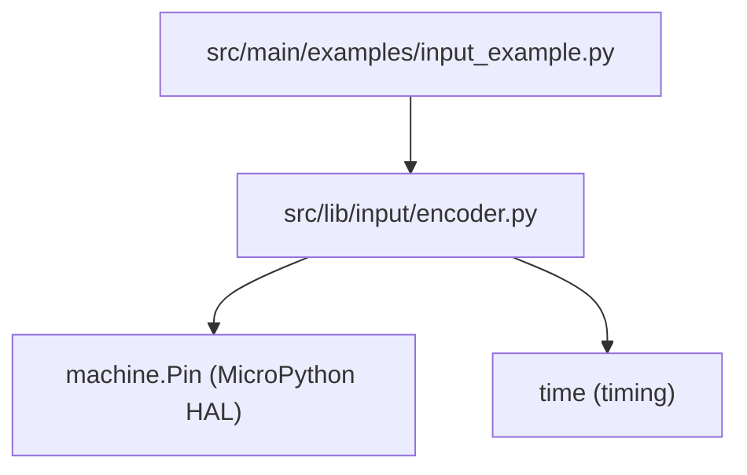
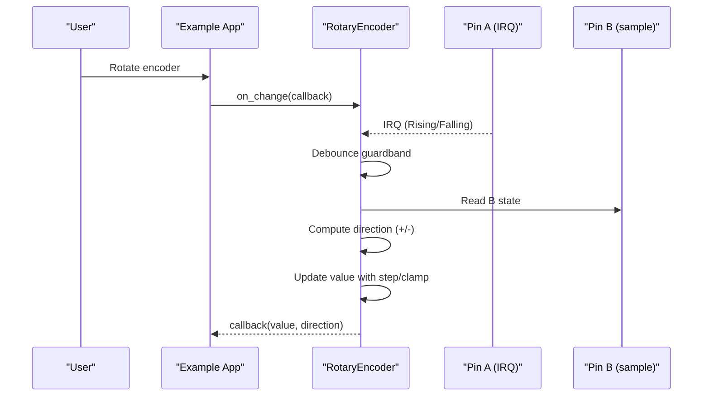
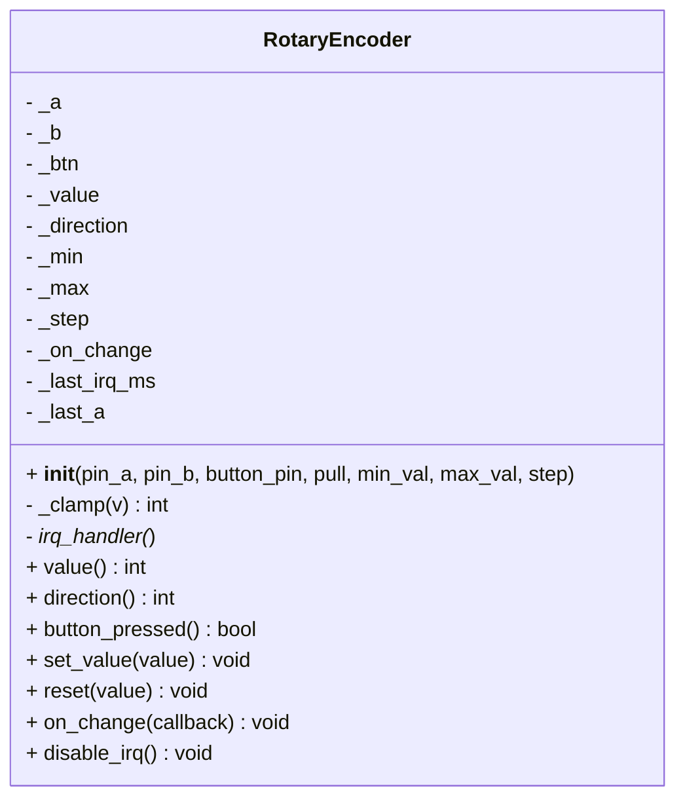
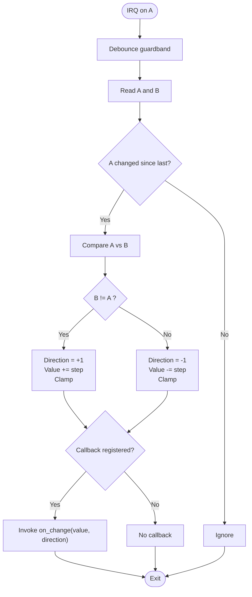
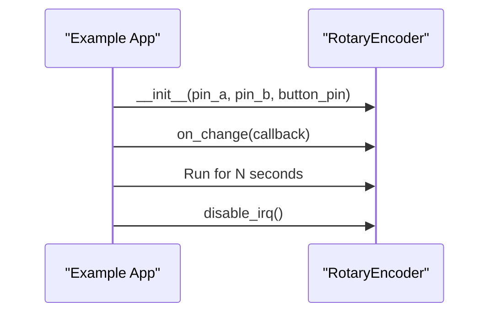
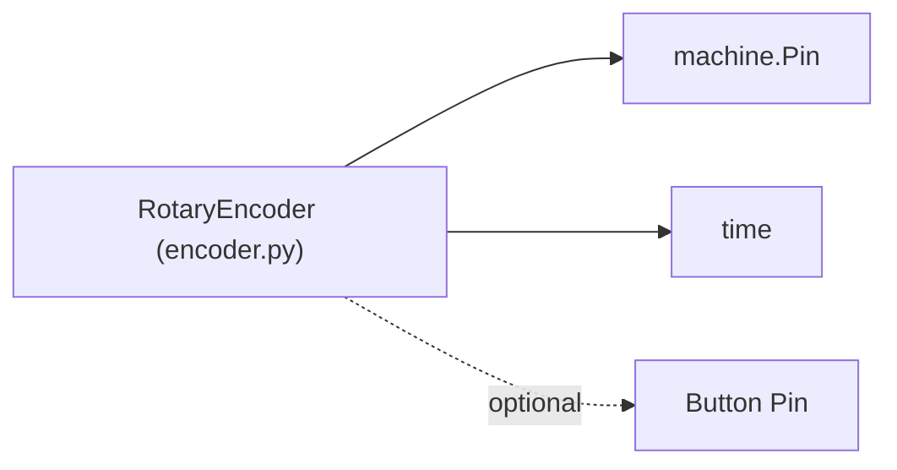

# Rotary Encoders

<cite>
**Referenced Files in This Document**
- [encoder.py](file://src/lib/input/encoder.py)
- [input_example.py](file://src/main/examples/input_example.py)
- [button.py](file://src/lib/input/button.py)
</cite>

## Table of Contents
1. [Introduction](#introduction)
2. [Project Structure](#project-structure)
3. [Core Components](#core-components)
4. [Architecture Overview](#architecture-overview)
5. [Detailed Component Analysis](#detailed-component-analysis)
6. [Dependency Analysis](#dependency-analysis)
7. [Performance Considerations](#performance-considerations)
8. [Troubleshooting Guide](#troubleshooting-guide)
9. [Conclusion](#conclusion)
10. [Appendices](#appendices)

## Introduction
This document explains rotary encoder input handling in the ESP32-C3 framework with a focus on the Encoder class implementation. It covers quadrature signal decoding, direction detection, position tracking, interrupt-driven processing, software debouncing, and practical usage patterns demonstrated in the example application. It also outlines performance considerations for high-speed rotation detection, power-aware operation, and integration with menu and parameter interfaces.

## Project Structure
The rotary encoder implementation resides in the input library and is exercised by the example application. The example demonstrates initialization, rotation detection, and value tracking via an on-change callback.

**Diagram sources**
- [input_example.py:23-34](file://src/main/examples/input_example.py#L23-L34)
- [encoder.py:16-33](file://src/lib/input/encoder.py#L16-L33)

**Section sources**
- [input_example.py:23-34](file://src/main/examples/input_example.py#L23-L34)
- [encoder.py:16-33](file://src/lib/input/encoder.py#L16-L33)

## Core Components
- RotaryEncoder: A quadrature encoder driver that monitors two phase signals (A/B), detects direction, updates a position value, and invokes a user callback on change. It supports optional button input and configurable bounds and step size. It uses hardware interrupts on the A-phase pin and applies software debouncing to reduce noise-induced spurious counts.

Key capabilities:
- Interrupt-triggered A/B phase sampling on rising and falling edges
- Direction detection by comparing previous and current phase states
- Position clamping within optional min/max bounds
- Optional button pin for push events
- Controlled via disable_irq to suspend processing

**Section sources**
- [encoder.py:11-90](file://src/lib/input/encoder.py#L11-L90)

## Architecture Overview
The encoder driver integrates with MicroPython’s machine.Pin and time modules. The A-phase pin is configured for interrupts; the B-phase pin is sampled within the interrupt handler. A small inter-sample guardband prevents rapid re-triggering. The driver computes direction and updates the internal value, then notifies a registered callback.

**Diagram sources**
- [encoder.py:42-62](file://src/lib/input/encoder.py#L42-L62)
- [input_example.py:28-31](file://src/main/examples/input_example.py#L28-L31)

## Detailed Component Analysis

### RotaryEncoder Class
The class encapsulates:
- Pin configuration for A, B, and optional button
- Internal state: current value, last A state, last IRQ timestamp, direction, min/max/step
- Interrupt handler that reads A and B, determines direction, updates value, and triggers callbacks
- Utility properties and methods for value manipulation and interrupt control

**Diagram sources**
- [encoder.py:11-90](file://src/lib/input/encoder.py#L11-L90)

Implementation highlights:
- Interrupt setup on A-phase pin for both edges
- Software debouncing using a minimal time delta between interrupts
- Direction logic based on comparing previous A state with current A and B relationship
- Value updates with step size and clamping to configured bounds
- Optional button pin polling for press detection

**Section sources**
- [encoder.py:16-33](file://src/lib/input/encoder.py#L16-L33)
- [encoder.py:35-40](file://src/lib/input/encoder.py#L35-L40)
- [encoder.py:42-62](file://src/lib/input/encoder.py#L42-L62)
- [encoder.py:64-89](file://src/lib/input/encoder.py#L64-L89)

### Quadrature Signal Decoding and Direction Detection
The interrupt handler performs:
- Debounce check against last IRQ timestamp
- Read current A and B states
- Determine direction by checking whether B differs from A (forward) or equals A (reverse)
- Increment/decrement value by step and clamp to bounds
- Invoke on-change callback with value and direction

**Diagram sources**
- [encoder.py:42-62](file://src/lib/input/encoder.py#L42-L62)

**Section sources**
- [encoder.py:42-62](file://src/lib/input/encoder.py#L42-L62)

### Position Tracking and Bounds
- The internal value increments or decrements per valid quadrature transition.
- Optional min/max bounds clamp the value to a desired range.
- Step size allows treating each detent as a larger increment if needed.

Practical implications:
- For high-resolution encoders, step can be tuned to match desired UI units.
- Clamping prevents wrap-around and ensures safe operation within UI constraints.

**Section sources**
- [encoder.py:23-28](file://src/lib/input/encoder.py#L23-L28)
- [encoder.py:35-40](file://src/lib/input/encoder.py#L35-L40)
- [encoder.py:54-62](file://src/lib/input/encoder.py#L54-L62)

### Interrupt-Based Signal Processing
- A-phase pin is configured for IRQ on both edges.
- Debounce guardband prevents multiple callbacks from a single transition.
- B-phase is sampled inside the handler to infer direction.

Considerations:
- Ensure external pull-ups/downs are configured appropriately for your hardware.
- Debounce threshold is fixed; adjust hardware or add filtering if needed.

**Section sources**
- [encoder.py:32-33](file://src/lib/input/encoder.py#L32-L33)
- [encoder.py:44-46](file://src/lib/input/encoder.py#L44-L46)
- [encoder.py:48-59](file://src/lib/input/encoder.py#L48-L59)

### Software Debouncing for Mechanical Encoders
- The driver implements a simple time-based debounce: it ignores interrupts occurring too close in time.
- This reduces false triggers caused by mechanical bounce or electrical noise.

Comparison with button debouncing:
- The button driver uses a similar time-based debounce with a configurable debounce window.
- Both rely on time.ticks_ms() and time.ticks_diff() for reliable cross-wrap calculations.

**Section sources**
- [encoder.py:44-46](file://src/lib/input/encoder.py#L44-L46)
- [button.py:248-252](file://src/lib/input/button.py#L248-L252)

### Practical Usage Example
The example demonstrates:
- Creating a RotaryEncoder with A/B pins and optional button pin
- Registering an on-change callback to receive value and direction updates
- Running for a fixed period and disabling interrupts afterward

**Diagram sources**
- [input_example.py:23-34](file://src/main/examples/input_example.py#L23-L34)
- [encoder.py:85-89](file://src/lib/input/encoder.py#L85-L89)

**Section sources**
- [input_example.py:23-34](file://src/main/examples/input_example.py#L23-L34)

### Absolute vs Incremental Encoding Modes
- The driver implements incremental counting based on quadrature transitions.
- There is no built-in absolute position storage; absolute positioning would require external memory or calibration routines outside this class.

Implications:
- For absolute encoders, maintain a persistent offset and add a method to set/reset zero-reference.
- Consider adding a calibration routine to capture a known reference position.

**Section sources**
- [encoder.py:23-28](file://src/lib/input/encoder.py#L23-L28)

### Resolution Enhancement and Gray Code Interpretation
- The driver treats each valid A/B transition as a step, effectively doubling the perceived resolution compared to single-signal sampling.
- Gray code ordering is implicitly respected by the quadrature nature of A/B signals; the direction logic relies on the relative relationship between A and B.

Recommendations:
- For very noisy environments, combine hardware filtering with the existing software debounce.
- If using higher CPR encoders, adjust step size to map detents to meaningful UI steps.

**Section sources**
- [encoder.py:48-59](file://src/lib/input/encoder.py#L48-L59)

### Overflow/Underflow Handling
- The driver clamps values to min/max bounds; under/overflow is prevented by design.
- If unbounded operation is required, configure min/max to match the operational range.

**Section sources**
- [encoder.py:35-40](file://src/lib/input/encoder.py#L35-L40)

### Calibration Procedures for Zero-Position Setting
- The example does not include a dedicated calibration routine.
- To calibrate zero:
  - Capture current value as reference during a known position.
  - Store the offset and subtract it from future readings for display or control.
  - Alternatively, expose a method to set_value(0) after aligning the shaft.

**Section sources**
- [encoder.py:78-83](file://src/lib/input/encoder.py#L78-L83)

## Dependency Analysis
The encoder driver depends on:
- machine.Pin for GPIO configuration and interrupts
- time for millisecond-precision timing and debounce
- Optional button pin for push detection

**Diagram sources**
- [encoder.py:7-8](file://src/lib/input/encoder.py#L7-L8)
- [encoder.py:19-21](file://src/lib/input/encoder.py#L19-L21)

**Section sources**
- [encoder.py:7-8](file://src/lib/input/encoder.py#L7-L8)
- [encoder.py:19-21](file://src/lib/input/encoder.py#L19-L21)

## Performance Considerations
- Debounce guardband: The fixed 2 ms minimum interval reduces interrupt load and false positives. For very fast rotation, ensure the guardband remains below the Nyquist threshold for reliable direction detection.
- Interrupt overhead: Each transition triggers a handler; keep callback logic lightweight.
- Polling alternatives: If interrupts are undesirable, a polling approach could be implemented, but it increases CPU usage and may miss fast transitions.
- Power management: Disable interrupts when idle to save power; re-enable before use.

[No sources needed since this section provides general guidance]

## Troubleshooting Guide
Common issues and remedies:
- No response to rotation:
  - Verify wiring and pull-up resistors on A/B pins.
  - Confirm interrupt trigger is enabled on the A-phase pin.
- Erratic counts or skipping:
  - Increase debounce threshold or improve hardware filtering.
  - Check for electromagnetic interference or poor PCB routing.
- Direction appears inverted:
  - Swap A/B connections or invert the direction interpretation in application logic.
- Excessive CPU usage:
  - Reduce step size or implement application-level throttling of UI updates.
- Button not detected:
  - Ensure button pin is configured with appropriate pull mode and connected to ground.
  - Confirm the button pin is passed to the constructor.

**Section sources**
- [encoder.py:32-33](file://src/lib/input/encoder.py#L32-L33)
- [encoder.py:73-76](file://src/lib/input/encoder.py#L73-L76)

## Conclusion
The RotaryEncoder class provides a robust, interrupt-driven foundation for decoding quadrature signals and tracking incremental position. Its design emphasizes simplicity, reliability, and ease of integration with UI and control systems. By combining hardware configuration, software debouncing, and careful application-level handling, it supports both steady and high-speed rotation scenarios while remaining power-conscious when interrupts are disabled.

[No sources needed since this section summarizes without analyzing specific files]

## Appendices

### API Reference Summary
- Constructor parameters:
  - pin_a, pin_b: GPIO numbers for A/B phases
  - button_pin: Optional GPIO number for button
  - pull: Pull mode for pins
  - min_val, max_val: Optional bounds
  - step: Increment per detent
- Properties:
  - value: Current position
  - direction: Last movement direction (+1/-1)
  - button_pressed: Whether button is currently pressed
- Methods:
  - set_value(value): Set position within bounds
  - reset(value): Reset position and direction
  - on_change(callback): Register change callback
  - disable_irq(): Disable interrupts

**Section sources**
- [encoder.py:16-28](file://src/lib/input/encoder.py#L16-L28)
- [encoder.py:64-89](file://src/lib/input/encoder.py#L64-L89)