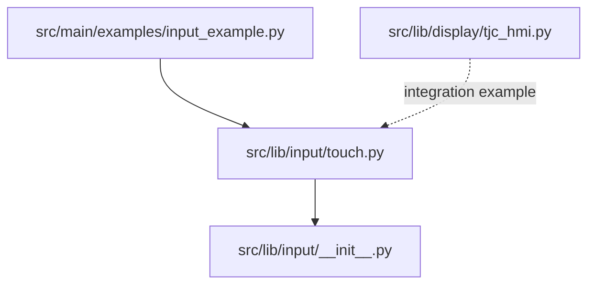
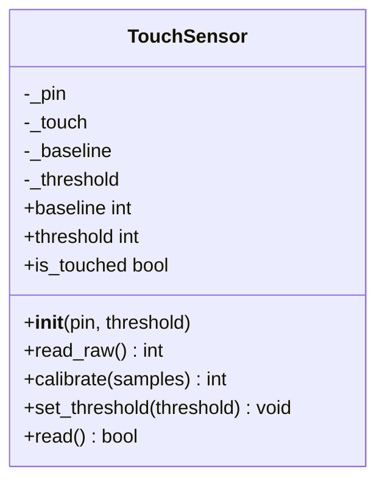
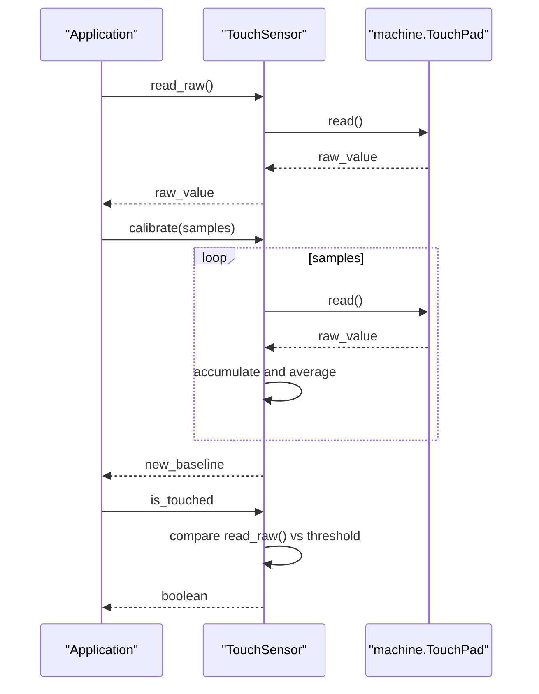
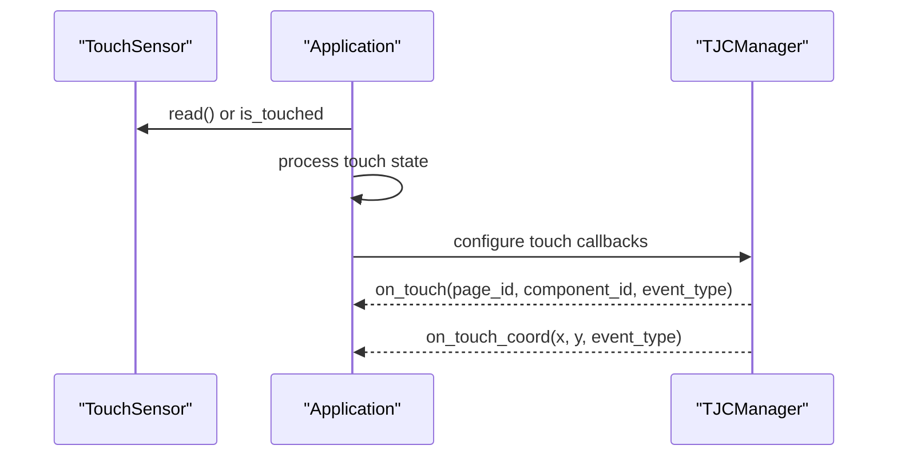
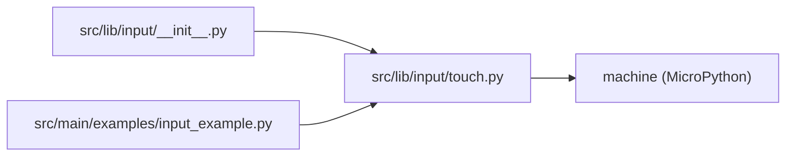

# Touch Sensors

<cite>
**Referenced Files in This Document**
- [touch.py](file://src/lib/input/touch.py)
- [input_example.py](file://src/main/examples/input_example.py)
- [__init__.py](file://src/lib/input/__init__.py)
- [tjc_hmi.py](file://src/lib/display/tjc_hmi.py)
</cite>

## Table of Contents
1. [Introduction](#introduction)
2. [Project Structure](#project-structure)
3. [Core Components](#core-components)
4. [Architecture Overview](#architecture-overview)
5. [Detailed Component Analysis](#detailed-component-analysis)
6. [Dependency Analysis](#dependency-analysis)
7. [Performance Considerations](#performance-considerations)
8. [Troubleshooting Guide](#troubleshooting-guide)
9. [Conclusion](#conclusion)
10. [Appendices](#appendices)

## Introduction
This document explains capacitive touch sensor input handling in the ESP32-C3 framework, focusing on the TouchSensor class and its integration with user interfaces. It covers capacitive sensing principles, threshold detection, baseline calibration, and touch state management. It also documents practical usage patterns shown in the example script, and outlines how to integrate touch events with display systems for interactive applications. Note that the TouchSensor driver targets ESP32-class chips with machine.TouchPad support; it is not available on ESP32-C3/C6.

## Project Structure
The touch sensor implementation resides in the input library and is demonstrated in the main examples. The display integration is handled by the TJC HMI driver.

**Diagram sources**
- [input_example.py:51-64](file://src/main/examples/input_example.py#L51-L64)
- [touch.py:11-60](file://src/lib/input/touch.py#L11-L60)
- [__init__.py:13](file://src/lib/input/__init__.py#L13)
- [tjc_hmi.py:42-46](file://src/lib/display/tjc_hmi.py#L42-L46)

**Section sources**
- [input_example.py:51-64](file://src/main/examples/input_example.py#L51-L64)
- [touch.py:11-60](file://src/lib/input/touch.py#L11-L60)
- [__init__.py:13](file://src/lib/input/__init__.py#L13)

## Core Components
- TouchSensor: Provides capacitive touch reading, baseline calibration, and threshold-based touch detection. It exposes raw readings, a calibrated baseline, adjustable thresholds, and a boolean touch state.
- Example usage: Demonstrates initialization, baseline inspection, raw reading loops, and basic touch state checks.

Key behaviors:
- Initialization sets up the underlying hardware touch pad and captures a baseline reading. Threshold defaults to a fraction of the baseline.
- Calibration averages multiple raw samples to update the baseline and adjusts threshold accordingly.
- Touch detection compares the latest raw reading against the configured threshold.

Practical example references:
- Touch initialization and loop: [input_example.py:51-64](file://src/main/examples/input_example.py#L51-L64)
- Baseline and raw reading access: [input_example.py:60-63](file://src/main/examples/input_example.py#L60-L63)

**Section sources**
- [touch.py:19-60](file://src/lib/input/touch.py#L19-L60)
- [input_example.py:51-64](file://src/main/examples/input_example.py#L51-L64)

## Architecture Overview
The touch subsystem integrates hardware-level capacitive sensing with a simple software model that tracks baseline and threshold to determine touch state.

**Diagram sources**
- [touch.py:11-60](file://src/lib/input/touch.py#L11-L60)

## Detailed Component Analysis

### TouchSensor Implementation
TouchSensor encapsulates capacitive touch logic:
- Hardware abstraction: Uses machine.TouchPad and machine.Pin to access the chip’s touch peripheral.
- Baseline and threshold: Captures an initial baseline and applies a default threshold derived from it. Threshold can be overridden.
- Calibration: Computes a new baseline from multiple samples and re-centers the threshold if needed.
- Detection: Reports whether the current reading indicates a touch based on the threshold comparison.

**Diagram sources**
- [touch.py:30-60](file://src/lib/input/touch.py#L30-L60)

Operational notes:
- Threshold selection: Defaults to a percentage of the baseline; adjust via set_threshold for different environments.
- Sensitivity tuning: Lower threshold increases sensitivity; higher threshold reduces false triggers.
- Debounce: The provided implementation does not include explicit debouncing; consider application-level debouncing if needed.

**Section sources**
- [touch.py:19-60](file://src/lib/input/touch.py#L19-L60)

### Practical Usage Patterns
The example demonstrates:
- Initialization with a pin and handling of unsupported devices.
- Inspecting baseline and iterating raw readings with touch state checks.
- Looping with small delays to observe sensor behavior.

Example references:
- Initialization and fallback: [input_example.py:54-58](file://src/main/examples/input_example.py#L54-L58)
- Baseline and readings: [input_example.py:60-63](file://src/main/examples/input_example.py#L60-L63)

**Section sources**
- [input_example.py:51-64](file://src/main/examples/input_example.py#L51-L64)

### Integration with Display Systems
While the TouchSensor class itself does not render UI, it can feed touch state into a display-driven UI. The TJC HMI driver supports touch events and coordinates, enabling integration with graphical user interfaces.

**Diagram sources**
- [tjc_hmi.py:42-46](file://src/lib/display/tjc_hmi.py#L42-L46)
- [tjc_hmi.py:850-856](file://src/lib/display/tjc_hmi.py#L850-L856)

Notes:
- Touch event constants and callback registration are provided by the display driver.
- Coordinate-based touch is supported for pointer-style interactions.

**Section sources**
- [tjc_hmi.py:42-46](file://src/lib/display/tjc_hmi.py#L42-L46)
- [tjc_hmi.py:850-856](file://src/lib/display/tjc_hmi.py#L850-L856)

## Dependency Analysis
TouchSensor depends on the MicroPython machine module for hardware access. The input package exports TouchSensor for external use.

**Diagram sources**
- [touch.py:8](file://src/lib/input/touch.py#L8)
- [__init__.py:13](file://src/lib/input/__init__.py#L13)
- [input_example.py:52](file://src/main/examples/input_example.py#L52)

**Section sources**
- [touch.py:8](file://src/lib/input/touch.py#L8)
- [__init__.py:13](file://src/lib/input/__init__.py#L13)
- [input_example.py:52](file://src/main/examples/input_example.py#L52)

## Performance Considerations
- Sampling rate: Adjust delays between reads to balance responsiveness and CPU usage.
- Calibration cadence: Recalibrate baselines periodically to adapt to environmental changes.
- Threshold tuning: Start with default threshold and refine based on measured noise and target sensitivity.
- Power considerations: Capacitive sensing typically runs continuously; reduce sampling frequency or disable sensing when idle to save power.

[No sources needed since this section provides general guidance]

## Troubleshooting Guide
Common issues and resolutions:
- Unsupported chip: TouchSensor raises a not-implemented error on chips without machine.TouchPad. Use ESP32-class boards for this driver.
  - Reference: [touch.py:20-23](file://src/lib/input/touch.py#L20-L23)
- Threshold too high/low: If touches are missed or falsely detected, recalibrate baseline and adjust threshold.
  - References: [touch.py:33-40](file://src/lib/input/touch.py#L33-L40), [touch.py:42-43](file://src/lib/input/touch.py#L42-L43)
- Noisy environment: Increase sampling for baseline averaging and consider application-level debouncing.
  - References: [touch.py:33-37](file://src/lib/input/touch.py#L33-L37), [touch.py:54-56](file://src/lib/input/touch.py#L54-L56)

**Section sources**
- [touch.py:20-23](file://src/lib/input/touch.py#L20-L23)
- [touch.py:33-43](file://src/lib/input/touch.py#L33-L43)
- [touch.py:54-56](file://src/lib/input/touch.py#L54-L56)

## Conclusion
The TouchSensor class offers a straightforward interface for capacitive touch on supported ESP32-class devices. It provides baseline-aware threshold detection suitable for single-touch scenarios. For ESP32-C3/C6, where machine.TouchPad is unavailable, alternative approaches (such as GPIO-based or external touch controllers) would be required. Integrating touch state with display systems enables rich interactive experiences, leveraging drivers like TJC HMI for touch event handling and coordinate reporting.

[No sources needed since this section summarizes without analyzing specific files]

## Appendices

### Practical Examples Index
- Touch initialization and reading loop: [input_example.py:51-64](file://src/main/examples/input_example.py#L51-L64)
- Baseline inspection and raw readings: [input_example.py:60-63](file://src/main/examples/input_example.py#L60-L63)

**Section sources**
- [input_example.py:51-64](file://src/main/examples/input_example.py#L51-L64)
- [input_example.py:60-63](file://src/main/examples/input_example.py#L60-L63)