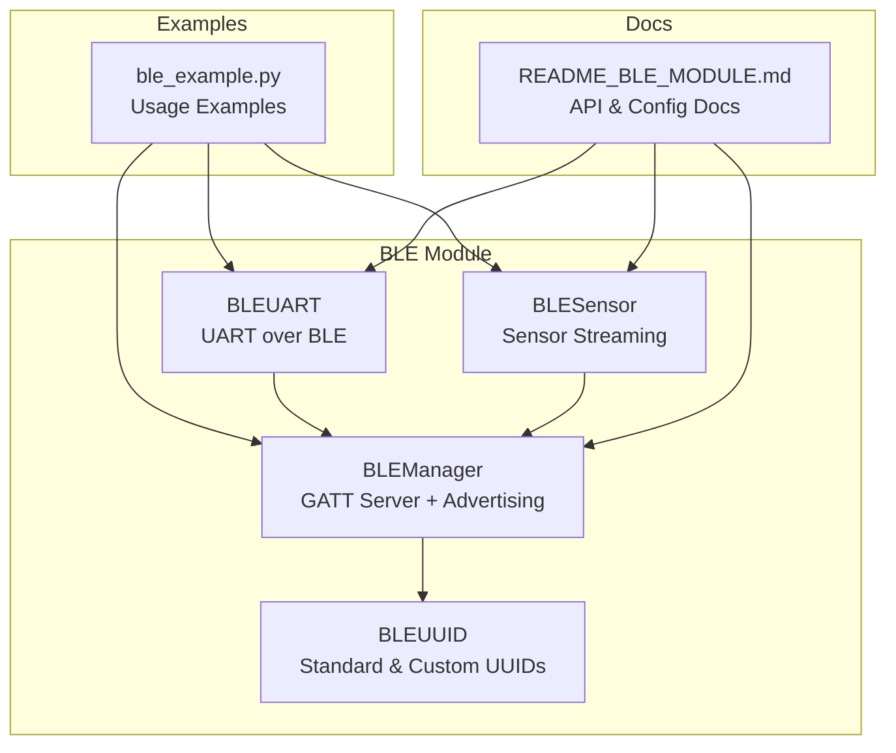
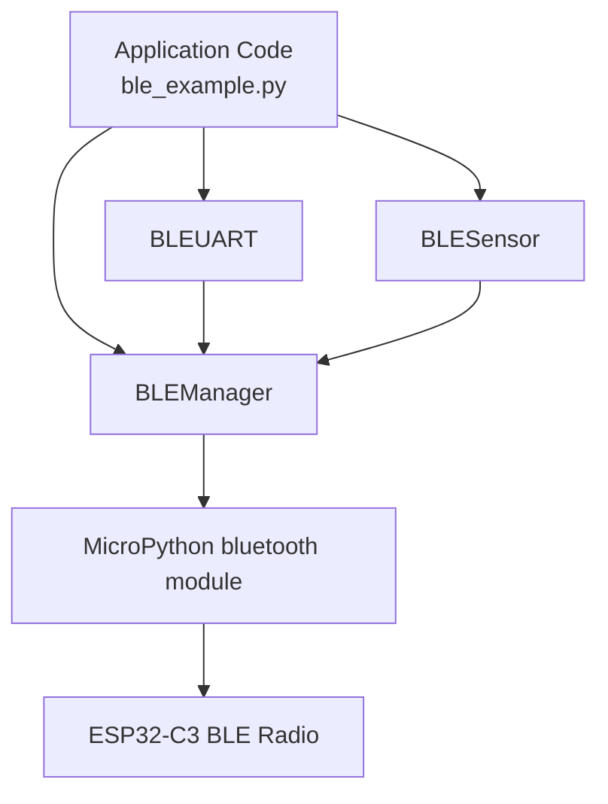
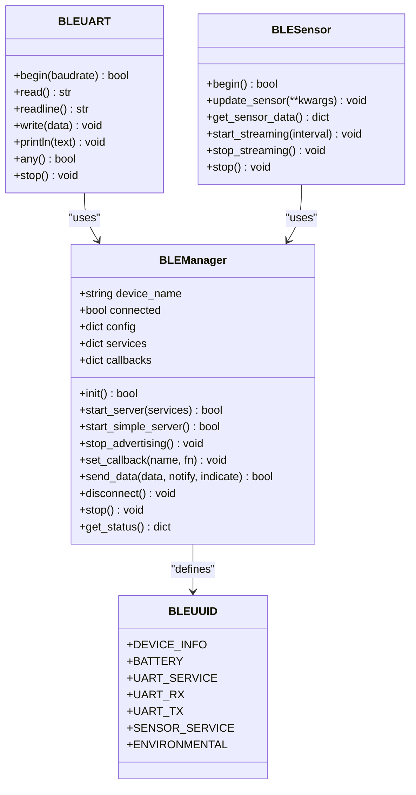
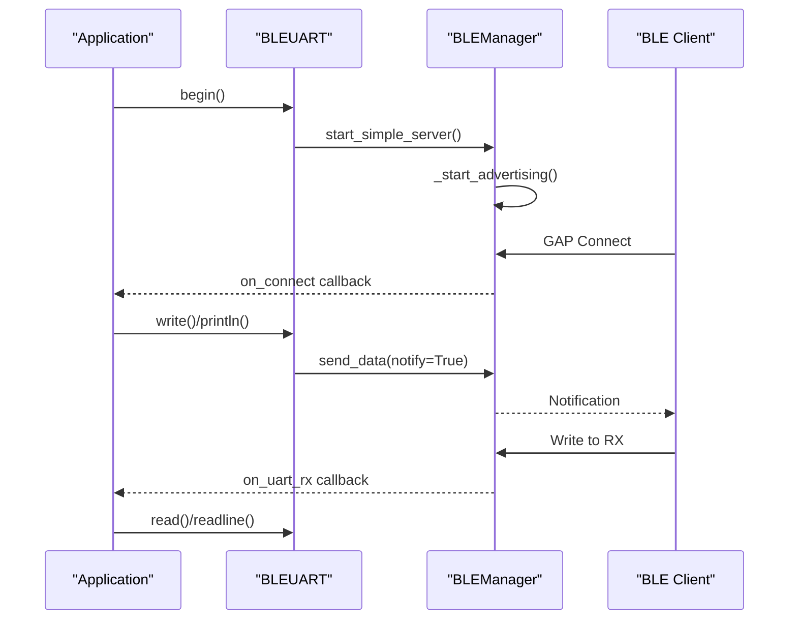
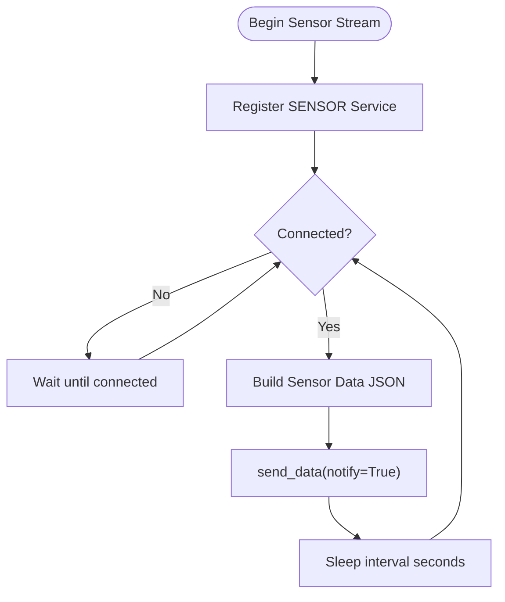
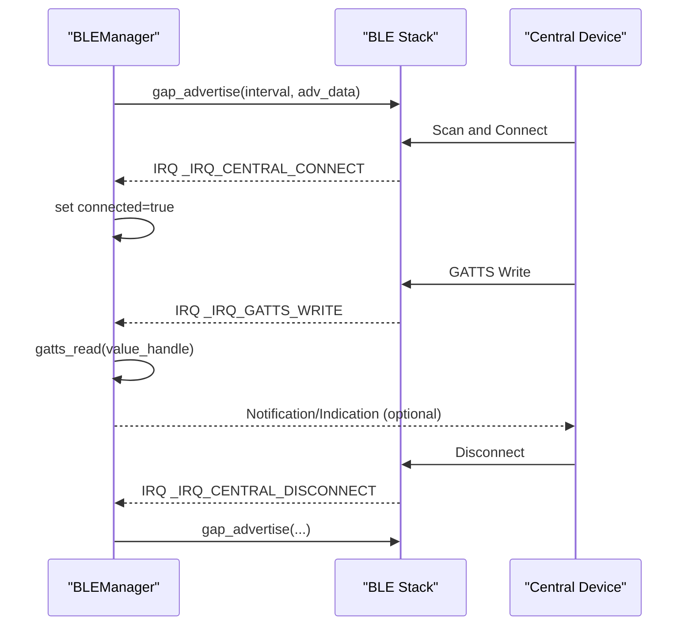
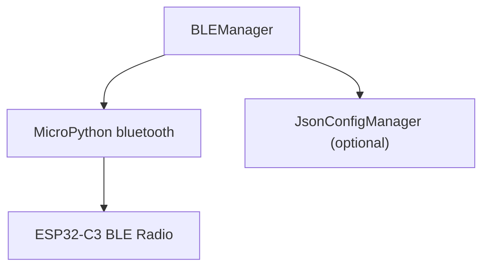

# BLE Communication

<cite>
**Referenced Files in This Document**
- [blemanager.py](file://src/lib/ble/blemanager.py)
- [ble_example.py](file://src/main/examples/ble_example.py)
- [README_BLE_MODULE.md](file://src/main/README_BLE_MODULE.md)
</cite>

## Table of Contents
1. [Introduction](#introduction)
2. [Project Structure](#project-structure)
3. [Core Components](#core-components)
4. [Architecture Overview](#architecture-overview)
5. [Detailed Component Analysis](#detailed-component-analysis)
6. [Dependency Analysis](#dependency-analysis)
7. [Performance Considerations](#performance-considerations)
8. [Troubleshooting Guide](#troubleshooting-guide)
9. [Conclusion](#conclusion)
10. [Appendices](#appendices)

## Introduction
This document explains the Bluetooth Low Energy (BLE) communication capabilities implemented for the ESP32-C3 using the MicroPython runtime. It focuses on the BLEManager class and related components that enable:
- GATT server functionality for peripheral mode operation
- Advertising configuration and connection handling
- Data transfer patterns via notifications and indications
- Service and characteristic management
- UART over BLE for serial-like communication
- Sensor streaming over BLE
- Practical examples demonstrating device discovery, connection establishment, data exchange, and service interaction

The documentation also covers BLE security considerations, connection intervals, advertising parameters, and troubleshooting common BLE connectivity issues in IoT applications.

## Project Structure
The BLE functionality is primarily implemented in a single module with supporting examples and documentation:
- BLE core implementation: [blemanager.py](file://src/lib/ble/blemanager.py)
- Example usage and demonstrations: [ble_example.py](file://src/main/examples/ble_example.py)
- API reference and usage guide: [README_BLE_MODULE.md](file://src/main/README_BLE_MODULE.md)

**Diagram sources**
- [blemanager.py:39-691](file://src/lib/ble/blemanager.py#L39-L691)
- [ble_example.py:1-408](file://src/main/examples/ble_example.py#L1-L408)
- [README_BLE_MODULE.md:1-526](file://src/main/README_BLE_MODULE.md#L1-L526)

**Section sources**
- [blemanager.py:1-691](file://src/lib/ble/blemanager.py#L1-L691)
- [ble_example.py:1-408](file://src/main/examples/ble_example.py#L1-L408)
- [README_BLE_MODULE.md:1-526](file://src/main/README_BLE_MODULE.md#L1-L526)

## Core Components
This section introduces the primary classes and their roles in BLE communication.

- BLEManager: Central class managing BLE initialization, GATT server registration, advertising, connection events, and data transmission.
- BLEUART: Simplified UART service built on top of BLEManager for serial-like communication.
- BLESensor: Sensor streaming service that periodically sends environmental data over BLE.
- BLEUUID: Defines standard and custom UUIDs used by services and characteristics.

Key responsibilities:
- BLEManager orchestrates BLE lifecycle, registers services, starts advertising, handles IRQ events, and sends notifications/indications.
- BLEUART wraps BLEManager to expose a simple read/write interface for console-style interaction.
- BLESensor encapsulates sensor data updates and periodic streaming to connected clients.
- BLEUUID centralizes UUID definitions for interoperability and clarity.

**Section sources**
- [blemanager.py:39-691](file://src/lib/ble/blemanager.py#L39-L691)
- [README_BLE_MODULE.md:120-301](file://src/main/README_BLE_MODULE.md#L120-L301)

## Architecture Overview
The BLE subsystem follows a layered architecture:
- Application layer: Examples and user code using BLEUART/BLESensor/BLEManager
- Service layer: BLEManager registers services and manages characteristics
- Transport layer: MicroPython bluetooth module for BLE stack operations
- Hardware layer: ESP32-C3 radio and BLE controller

**Diagram sources**
- [blemanager.py:55-384](file://src/lib/ble/blemanager.py#L55-L384)
- [ble_example.py:1-408](file://src/main/examples/ble_example.py#L1-L408)

## Detailed Component Analysis

### BLEManager: GATT Server and Connection Handling
BLEManager is the core class implementing BLE server functionality. It initializes the BLE hardware, registers services, starts advertising, and processes BLE events via IRQ handlers.

Key methods and behaviors:
- Initialization and availability checks: [init:126-139](file://src/lib/ble/blemanager.py#L126-L139)
- Service registration and default services: [_get_default_services:198-216](file://src/lib/ble/blemanager.py#L198-L216), [_register_service:218-229](file://src/lib/ble/blemanager.py#L218-L229)
- Advertising lifecycle: [_start_advertising:231-246](file://src/lib/ble/blemanager.py#L231-L246), [stop_advertising:248-252](file://src/lib/ble/blemanager.py#L248-L252)
- Event handling: [_ble_irq_handler:254-285](file://src/lib/ble/blemanager.py#L254-L285) for connect/disconnect and GATT writes
- Data transmission: [send_data:295-325](file://src/lib/ble/blemanager.py#L295-L325) supports notify/indicate
- Status reporting: [get_status:366-378](file://src/lib/ble/blemanager.py#L366-L378)

**Diagram sources**
- [blemanager.py:55-691](file://src/lib/ble/blemanager.py#L55-L691)

**Section sources**
- [blemanager.py:55-384](file://src/lib/ble/blemanager.py#L55-L384)
- [README_BLE_MODULE.md:120-210](file://src/main/README_BLE_MODULE.md#L120-L210)

### BLEUART: UART over BLE
BLEUART provides a simplified interface for serial-like communication over BLE. It leverages BLEManager to register a UART service and exposes read/write methods.

Key methods and behaviors:
- Initialization and service binding: [begin:404-411](file://src/lib/ble/blemanager.py#L404-L411)
- Receive buffer management: [read:420-430](file://src/lib/ble/blemanager.py#L420-L430), [readline:432-443](file://src/lib/ble/blemanager.py#L432-L443)
- Send operations: [write:445-461](file://src/lib/ble/blemanager.py#L445-L461), [println:455-461](file://src/lib/ble/blemanager.py#L455-L461)
- Buffer inspection: [any:463-469](file://src/lib/ble/blemanager.py#L463-L469)
- Lifecycle: [stop:471-474](file://src/lib/ble/blemanager.py#L471-L474)

**Diagram sources**
- [blemanager.py:387-474](file://src/lib/ble/blemanager.py#L387-L474)
- [blemanager.py:254-285](file://src/lib/ble/blemanager.py#L254-L285)

**Section sources**
- [blemanager.py:387-474](file://src/lib/ble/blemanager.py#L387-L474)
- [README_BLE_MODULE.md:213-251](file://src/main/README_BLE_MODULE.md#L213-L251)

### BLESensor: Sensor Streaming over BLE
BLESensor registers a sensor service and periodically streams environmental data to connected clients.

Key methods and behaviors:
- Service registration: [begin:495-508](file://src/lib/ble/blemanager.py#L495-L508)
- Data update and retrieval: [update_sensor:510-517](file://src/lib/ble/blemanager.py#L510-L517), [get_sensor_data:518-524](file://src/lib/ble/blemanager.py#L518-L524)
- Streaming loop: [start_streaming:526-543](file://src/lib/ble/blemanager.py#L526-L543), [stop_streaming:545-547](file://src/lib/ble/blemanager.py#L545-L547)
- Lifecycle: [stop:549-552](file://src/lib/ble/blemanager.py#L549-L552)

**Diagram sources**
- [blemanager.py:477-552](file://src/lib/ble/blemanager.py#L477-L552)

**Section sources**
- [blemanager.py:477-552](file://src/lib/ble/blemanager.py#L477-L552)
- [README_BLE_MODULE.md:254-288](file://src/main/README_BLE_MODULE.md#L254-L288)

### Advertising and Connection Handling
BLEManager controls advertising and connection events:
- Advertising: [_start_advertising:231-246](file://src/lib/ble/blemanager.py#L231-L246) constructs advertising data and starts GAP advertising
- Disconnection: [stop_advertising:248-252](file://src/lib/ble/blemanager.py#L248-L252) stops advertising; re-started on disconnect
- IRQ handling: [_ble_irq_handler:254-285](file://src/lib/ble/blemanager.py#L254-L285) dispatches connect, disconnect, and write events
- Data transmission: [send_data:295-325](file://src/lib/ble/blemanager.py#L295-L325) uses notify/indicate depending on parameters

**Diagram sources**
- [blemanager.py:231-285](file://src/lib/ble/blemanager.py#L231-L285)

**Section sources**
- [blemanager.py:231-285](file://src/lib/ble/blemanager.py#L231-L285)
- [README_BLE_MODULE.md:98-119](file://src/main/README_BLE_MODULE.md#L98-L119)

### Practical Examples from ble_example.py
The examples demonstrate real-world usage patterns:
- Basic server: [example_1_basic_server:14-58](file://src/main/examples/ble_example.py#L14-L58)
- BLE UART: [example_2_uart:62-94](file://src/main/examples/ble_example.py#L62-L94)
- Sensor streaming: [example_3_sensor:97-154](file://src/main/examples/ble_example.py#L97-L154)
- Callback-driven server: [example_4_callbacks:158-205](file://src/main/examples/ble_example.py#L158-L205)
- Concurrent BLE + WiFi: [example_5_ble_wifi:209-278](file://src/main/examples/ble_example.py#L209-L278)
- LED control via BLE: [example_6_ble_led:281-337](file://src/main/examples/ble_example.py#L281-L337)
- iBeacon-style advertising: [example_7_ibeacon:341-366](file://src/main/examples/ble_example.py#L341-L366)
- GATT client concept: [example_8_gatt_client:369-394](file://src/main/examples/ble_example.py#L369-L394)

These examples show device discovery, connection establishment, data exchange, service interaction, and concurrent operation with WiFi.

**Section sources**
- [ble_example.py:14-394](file://src/main/examples/ble_example.py#L14-L394)

## Dependency Analysis
The BLE module depends on:
- MicroPython bluetooth module for BLE stack operations
- Optional JsonConfigManager for persistent configuration
- ESP32-C3 hardware BLE radio

**Diagram sources**
- [blemanager.py:24-35](file://src/lib/ble/blemanager.py#L24-L35)
- [blemanager.py:60-82](file://src/lib/ble/blemanager.py#L60-L82)

**Section sources**
- [blemanager.py:24-35](file://src/lib/ble/blemanager.py#L24-L35)
- [blemanager.py:60-82](file://src/lib/ble/blemanager.py#L60-L82)

## Performance Considerations
- Advertising interval: Controlled via advertising payload construction; adjust to balance discoverability and power consumption.
- Connection intervals: Defined in configuration; affects latency and throughput.
- Data sizes: Keep notifications/indications reasonably sized to avoid fragmentation and improve reliability.
- Service complexity: Fewer services and characteristics reduce memory footprint and processing overhead.
- Concurrency: Running BLE alongside WiFi requires careful scheduling to prevent contention.

[No sources needed since this section provides general guidance]

## Troubleshooting Guide
Common issues and resolutions:
- BLE not available: Verify MicroPython supports the bluetooth module and firmware version.
- Cannot connect: Ensure device is advertising, distance is adequate, and no other device holds the connection.
- Data not sent: Confirm connection state, characteristic handles, and callback registrations.
- Memory errors: Reduce number of services, minimize data size, and disable unused services.

**Section sources**
- [README_BLE_MODULE.md:456-477](file://src/main/README_BLE_MODULE.md#L456-L477)

## Conclusion
The ESP32-C3 BLE implementation centers around BLEManager, complemented by BLEUART and BLESensor for common IoT use cases. The examples in ble_example.py illustrate practical patterns for server operation, UART over BLE, sensor streaming, callbacks, concurrent BLE/WiFi usage, and LED control. Proper configuration of advertising and connection parameters, along with attention to performance and troubleshooting, ensures robust BLE connectivity in IoT applications.

[No sources needed since this section summarizes without analyzing specific files]

## Appendices

### BLE Security Considerations
- Pairing and bonding are not implemented in the current code; future enhancements could integrate security features.
- For production deployments, consider enabling encryption and access controls at the application level.

[No sources needed since this section provides general guidance]

### Configuration Options
- Device name, advertising interval, and connection intervals are configurable via JSON configuration.

**Section sources**
- [README_BLE_MODULE.md:98-119](file://src/main/README_BLE_MODULE.md#L98-L119)

### API Reference Highlights
- BLEManager: [init:126-139](file://src/lib/ble/blemanager.py#L126-L139), [start_server:141-176](file://src/lib/ble/blemanager.py#L141-L176), [send_data:295-325](file://src/lib/ble/blemanager.py#L295-L325), [get_status:366-378](file://src/lib/ble/blemanager.py#L366-L378)
- BLEUART: [begin:404-411](file://src/lib/ble/blemanager.py#L404-L411), [read:420-430](file://src/lib/ble/blemanager.py#L420-L430), [write:445-461](file://src/lib/ble/blemanager.py#L445-L461)
- BLESensor: [begin:495-508](file://src/lib/ble/blemanager.py#L495-L508), [start_streaming:526-543](file://src/lib/ble/blemanager.py#L526-L543)

**Section sources**
- [README_BLE_MODULE.md:120-301](file://src/main/README_BLE_MODULE.md#L120-L301)
- [blemanager.py:126-325](file://src/lib/ble/blemanager.py#L126-L325)
- [blemanager.py:404-461](file://src/lib/ble/blemanager.py#L404-L461)
- [blemanager.py:495-543](file://src/lib/ble/blemanager.py#L495-L543)