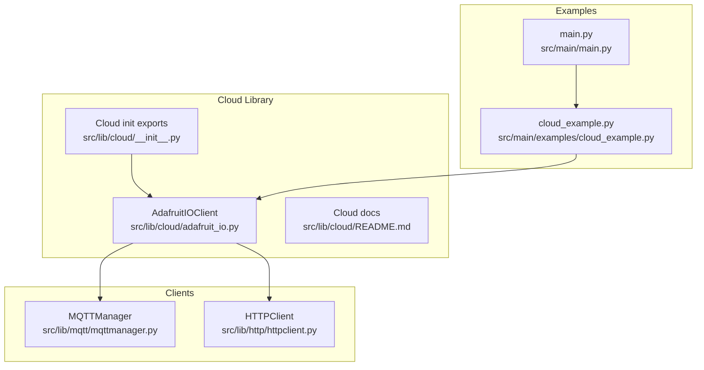
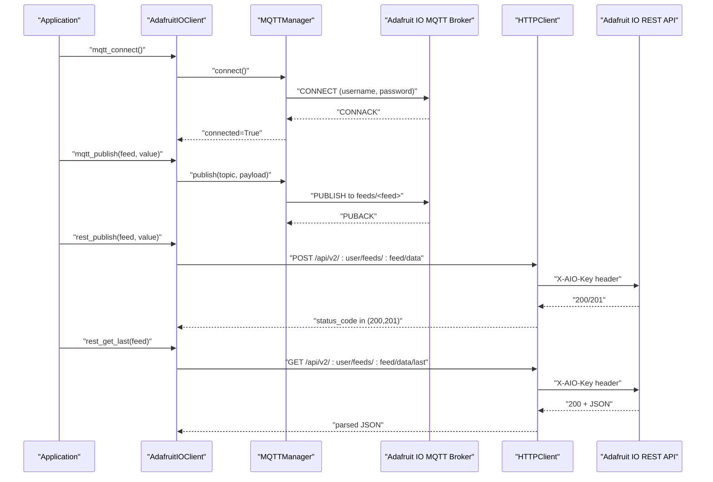
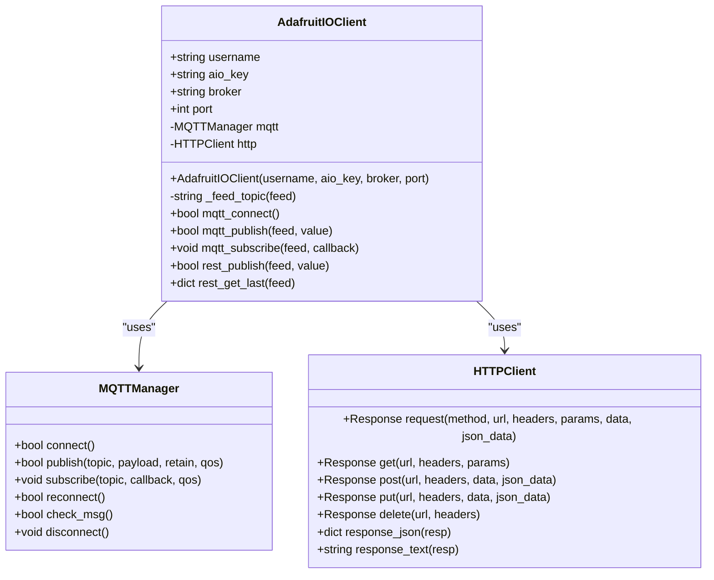
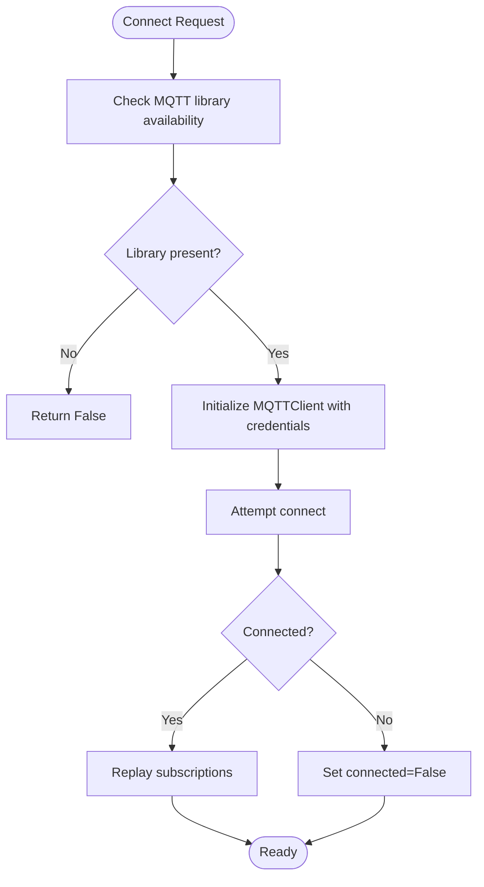
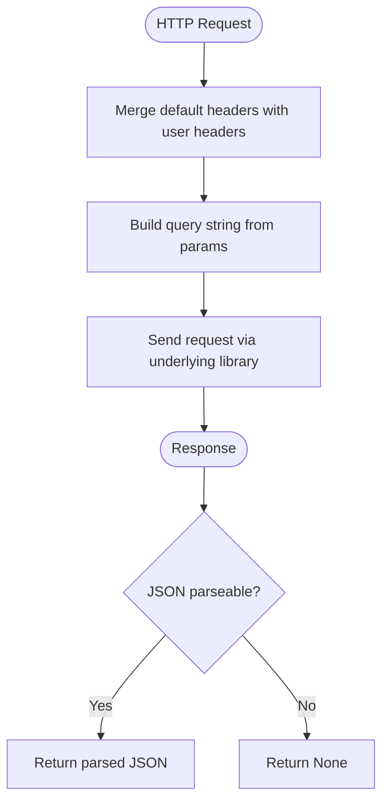
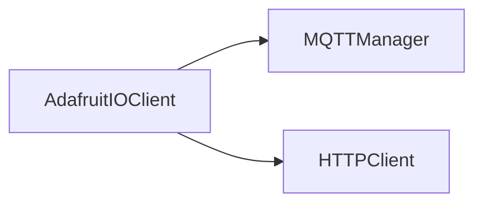

# Adafruit IO Integration

<cite>
**Referenced Files in This Document**
- [adafruit_io.py](file://src/lib/cloud/adafruit_io.py)
- [__init__.py](file://src/lib/cloud/__init__.py)
- [README.md](file://src/lib/cloud/README.md)
- [cloud_example.py](file://src/main/examples/cloud_example.py)
- [mqttmanager.py](file://src/lib/mqtt/mqttmanager.py)
- [httpclient.py](file://src/lib/http/httpclient.py)
- [main.py](file://src/main/main.py)
</cite>

## Table of Contents
1. [Introduction](#introduction)
2. [Project Structure](#project-structure)
3. [Core Components](#core-components)
4. [Architecture Overview](#architecture-overview)
5. [Detailed Component Analysis](#detailed-component-analysis)
6. [Dependency Analysis](#dependency-analysis)
7. [Performance Considerations](#performance-considerations)
8. [Troubleshooting Guide](#troubleshooting-guide)
9. [Conclusion](#conclusion)
10. [Appendices](#appendices)

## Introduction
This document explains how to integrate with Adafruit IO using the provided MicroPython library. It covers authentication via AIO key, publishing and subscribing to feeds over MQTT, and REST-based data submission and retrieval. It also provides guidance on dashboard setup, feed organization, and practical examples for real-time streaming and historical data access. Finally, it addresses rate limiting, data formatting, and common connection troubleshooting.

## Project Structure
The Adafruit IO integration is implemented as a standalone client that composes an MQTT manager and an HTTP client. The example script demonstrates how to enable and use the client in a MicroPython environment.

**Diagram sources**
- [adafruit_io.py:10-57](file://src/lib/cloud/adafruit_io.py#L10-L57)
- [__init__.py:1-6](file://src/lib/cloud/__init__.py#L1-L6)
- [README.md:71-114](file://src/lib/cloud/README.md#L71-L114)
- [cloud_example.py:23-27](file://src/main/examples/cloud_example.py#L23-L27)
- [mqttmanager.py:22-191](file://src/lib/mqtt/mqttmanager.py#L22-L191)
- [httpclient.py:12-69](file://src/lib/http/httpclient.py#L12-L69)
- [main.py:49-71](file://src/main/main.py#L49-L71)

**Section sources**
- [README.md:1-313](file://src/lib/cloud/README.md#L1-L313)
- [__init__.py:1-6](file://src/lib/cloud/__init__.py#L1-L6)
- [cloud_example.py:1-60](file://src/main/examples/cloud_example.py#L1-L60)

## Core Components
- AdafruitIOClient: Provides MQTT and REST APIs for Adafruit IO integration, including authentication via username and AIO key, feed topic construction, MQTT publish/subscribe, and REST publish/get last.
- MQTTManager: Handles MQTT connection, reconnection, publish, subscribe, and message callbacks.
- HTTPClient: Wraps HTTP requests for REST operations with JSON support and header management.

Key capabilities:
- Authentication: Username and AIO key passed to the MQTT broker and used in REST headers.
- Feed operations: Publish values to a feed topic (MQTT) or REST endpoint; retrieve the last data point via REST.
- Subscriptions: Subscribe to a feed topic and receive messages via a callback.

**Section sources**
- [adafruit_io.py:10-57](file://src/lib/cloud/adafruit_io.py#L10-L57)
- [mqttmanager.py:22-191](file://src/lib/mqtt/mqttmanager.py#L22-L191)
- [httpclient.py:12-69](file://src/lib/http/httpclient.py#L12-L69)

## Architecture Overview
The Adafruit IO client integrates two transport mechanisms:
- MQTT: Low-latency, bidirectional communication for live feeds and commands.
- REST: HTTP-based operations for publishing and retrieving data programmatically.

**Diagram sources**
- [adafruit_io.py:29-56](file://src/lib/cloud/adafruit_io.py#L29-L56)
- [mqttmanager.py:84-121](file://src/lib/mqtt/mqttmanager.py#L84-L121)
- [httpclient.py:25-54](file://src/lib/http/httpclient.py#L25-L54)

## Detailed Component Analysis

### AdafruitIOClient Class
Responsibilities:
- Construct feed topics using the username pattern.
- Manage MQTT connection and publish/subscribe lifecycle.
- Perform REST operations for publishing and fetching the last data point.

Implementation highlights:
- Constructor sets broker, port, and credentials; initializes MQTTManager and HTTPClient.
- Topic construction follows the Adafruit IO convention for feeds.
- REST endpoints use the X-AIO-Key header for authentication.

**Diagram sources**
- [adafruit_io.py:10-57](file://src/lib/cloud/adafruit_io.py#L10-L57)
- [mqttmanager.py:22-191](file://src/lib/mqtt/mqttmanager.py#L22-L191)
- [httpclient.py:12-69](file://src/lib/http/httpclient.py#L12-L69)

**Section sources**
- [adafruit_io.py:10-57](file://src/lib/cloud/adafruit_io.py#L10-L57)

### MQTTManager Behavior
Key behaviors:
- Auto-reconnect with configurable intervals.
- Message routing to global and per-topic callbacks.
- Robust connection handling with fallbacks for missing MQTT libraries.

Operational flow:
- Connect attempts to initialize the underlying MQTT client with provided credentials.
- On successful connect, subscriptions are replayed automatically.
- Publish operations handle encoding and reconnection on failure.

**Diagram sources**
- [mqttmanager.py:84-121](file://src/lib/mqtt/mqttmanager.py#L84-L121)

**Section sources**
- [mqttmanager.py:22-191](file://src/lib/mqtt/mqttmanager.py#L22-L191)

### HTTPClient Behavior
Key behaviors:
- Merges default headers with user-provided headers.
- Supports GET, POST, PUT, DELETE with optional JSON or raw data.
- Provides helpers to extract JSON or text from responses.

**Diagram sources**
- [httpclient.py:19-69](file://src/lib/http/httpclient.py#L19-L69)

**Section sources**
- [httpclient.py:12-69](file://src/lib/http/httpclient.py#L12-L69)

### Practical Examples from cloud_example.py
The example script demonstrates how to enable Adafruit IO integration by uncommenting the relevant code blocks and supplying credentials. It shows:
- Creating an Adafruit IO client with username and AIO key.
- Establishing an MQTT connection.
- Publishing a value to a feed.
- Subscribing to a feed and handling incoming messages.

Note: The example is intentionally commented out to prevent accidental execution without proper credentials.

**Section sources**
- [cloud_example.py:23-27](file://src/main/examples/cloud_example.py#L23-L27)

## Dependency Analysis
The Adafruit IO client depends on:
- MQTTManager for MQTT connectivity and messaging.
- HTTPClient for REST-based operations.

**Diagram sources**
- [adafruit_io.py:17-24](file://src/lib/cloud/adafruit_io.py#L17-L24)

**Section sources**
- [adafruit_io.py:10-25](file://src/lib/cloud/adafruit_io.py#L10-L25)

## Performance Considerations
- MQTT publish QoS is set to zero by default, minimizing overhead but offering no delivery guarantees.
- Auto-reconnect attempts are performed with a fixed number of retries and interval; tune reconnect_interval in MQTTManager if needed.
- REST operations are synchronous; consider batching or throttling for high-frequency updates.
- Memory usage for TLS/HTTP may be constrained on ESP32-C3; monitor free memory during network operations.

[No sources needed since this section provides general guidance]

## Troubleshooting Guide
Common issues and resolutions:
- Missing MQTT library: The MQTTManager logs an error when the required MQTT module is unavailable. Ensure the correct MicroPython MQTT package is installed.
- Connection failures: Verify WiFi connectivity before attempting cloud operations. Check broker host/port and AIO key validity.
- Authentication errors: Confirm username and AIO key match your Adafruit IO account.
- Rate limiting: Free Adafruit IO plans are limited to a small number of data points per minute. Consider reducing publish frequency or upgrading your plan.
- REST errors: Inspect HTTP status codes returned by REST operations; ensure the feed exists and the X-AIO-Key header is correctly set.
- Memory constraints: TLS and HTTP operations consume RAM. Monitor free memory and reduce concurrent operations if needed.

**Section sources**
- [mqttmanager.py:84-121](file://src/lib/mqtt/mqttmanager.py#L84-L121)
- [httpclient.py:25-54](file://src/lib/http/httpclient.py#L25-L54)
- [README.md:304-313](file://src/lib/cloud/README.md#L304-L313)

## Conclusion
The Adafruit IO integration provides a concise, transport-agnostic interface for publishing and consuming data. Use MQTT for real-time feeds and REST for programmatic operations. Follow the documented rate limits and authentication requirements, and leverage the example patterns to build robust monitoring and control systems.

[No sources needed since this section summarizes without analyzing specific files]

## Appendices

### Dashboard Setup and Feed Organization
- Create feeds in your Adafruit IO dashboard corresponding to your sensor categories (e.g., temperature, humidity, pressure).
- Use feed names that reflect the data type for consistent dashboard widgets.
- Configure widgets to visualize recent values, trends, and thresholds.

[No sources needed since this section provides general guidance]

### Data Formatting and Submission
- Values are published as strings over MQTT; ensure downstream consumers can parse numeric values if needed.
- REST publish expects a JSON body containing a value field; include timestamps if your application requires them.

**Section sources**
- [adafruit_io.py:32-33](file://src/lib/cloud/adafruit_io.py#L32-L33)
- [adafruit_io.py:38-45](file://src/lib/cloud/adafruit_io.py#L38-L45)

### Sensor Feed Recommendations
- Temperature/Humidity: Use separate feeds for each metric; choose appropriate units and ranges for dashboard scaling.
- Environmental Monitoring: Pressure, light intensity, air quality; group related metrics under descriptive feed names.
- Actuation Control: Use a dedicated feed for control commands; subscribe to it and apply values to actuators.

[No sources needed since this section provides general guidance]

### Example Usage Patterns
- Real-time streaming: Connect via MQTT, publish periodic sensor readings, and subscribe to control feeds.
- Historical access: Use REST to fetch the last data point for quick status checks or dashboard initialization.

**Section sources**
- [README.md:91-113](file://src/lib/cloud/README.md#L91-L113)
- [cloud_example.py:23-27](file://src/main/examples/cloud_example.py#L23-L27)