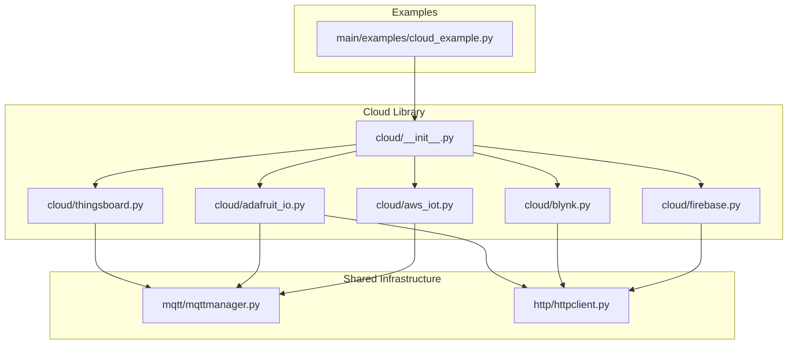
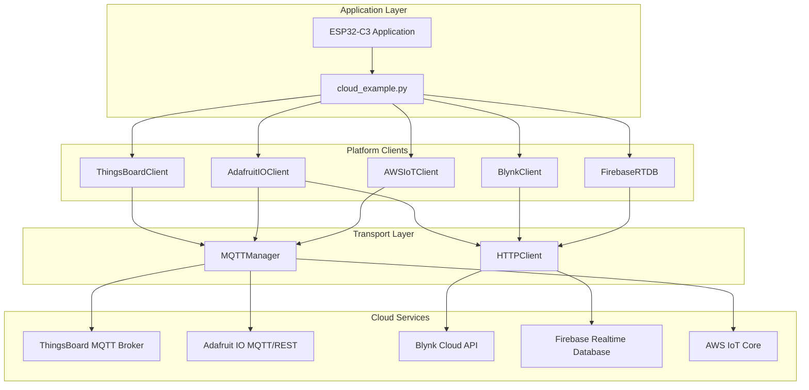
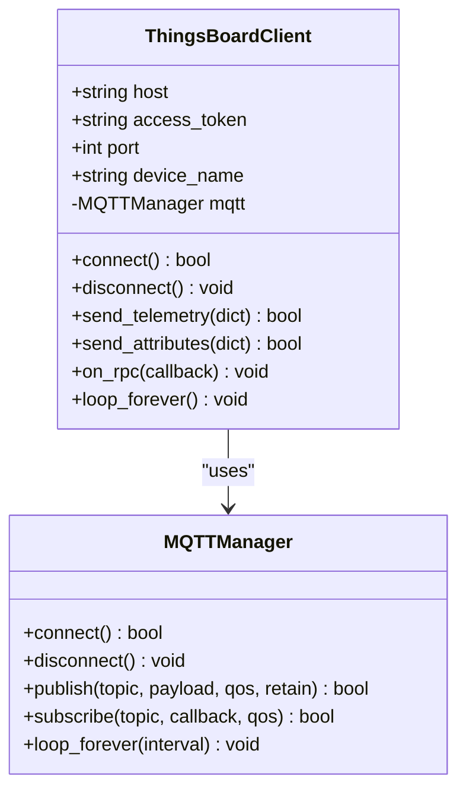
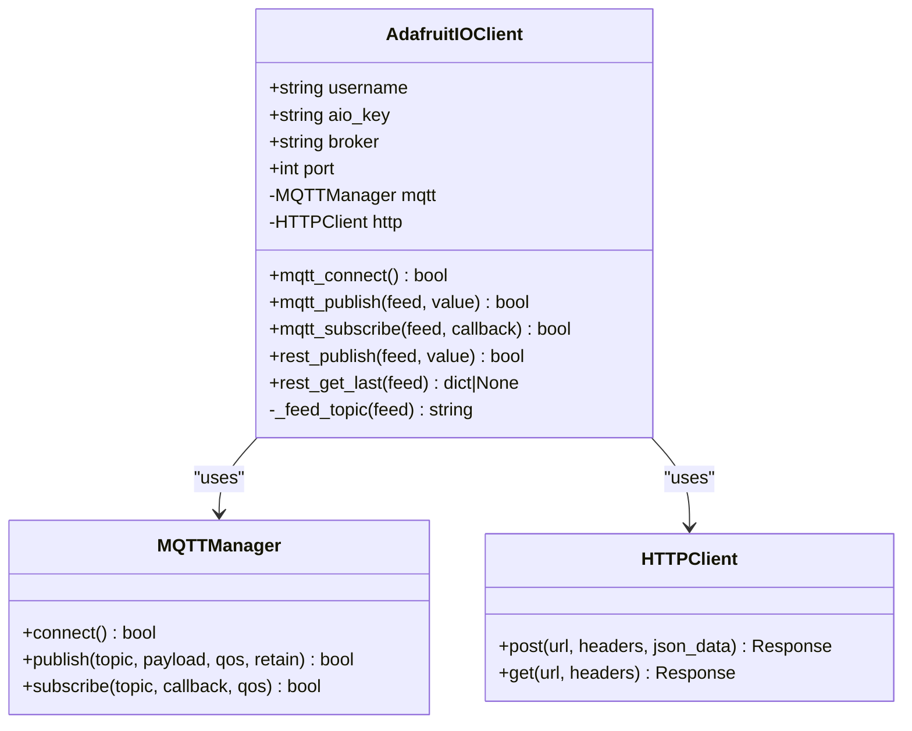
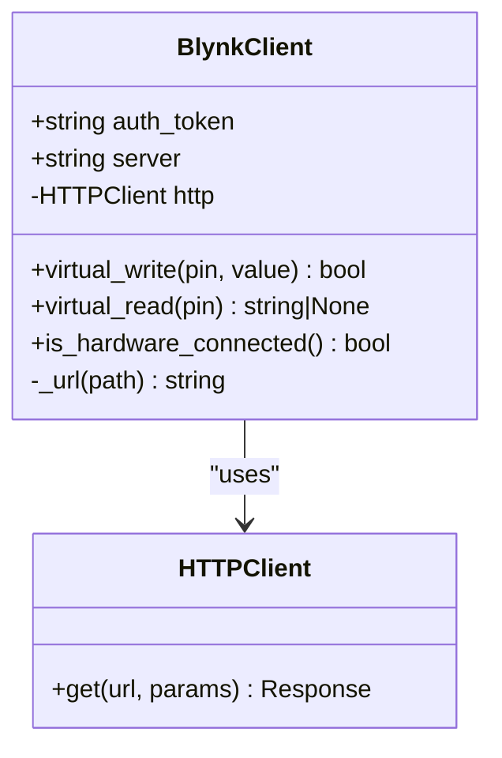
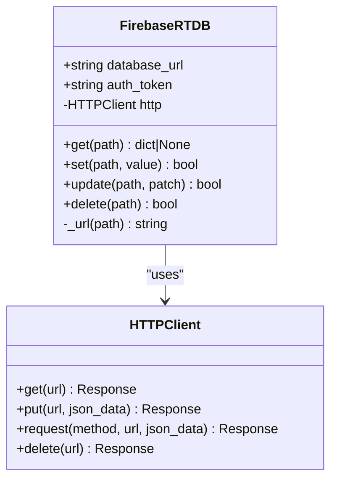
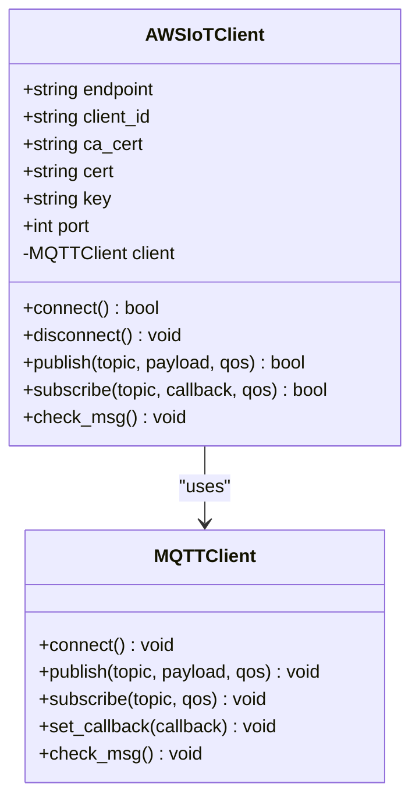
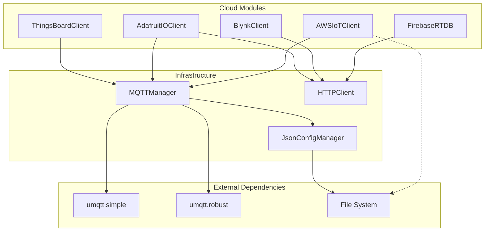
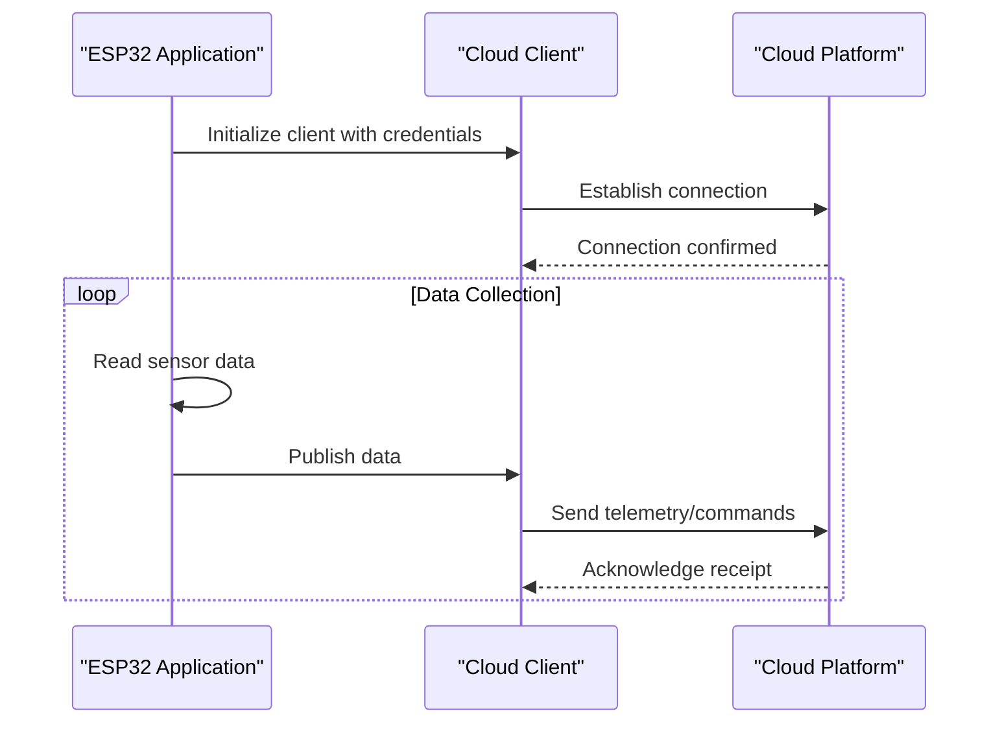

# Cloud Platform Integrations

<cite>
**Referenced Files in This Document**
- [cloud\README.md](file://src/lib/cloud/README.md)
- [cloud\__init__.py](file://src/lib/cloud/__init__.py)
- [cloud\thingsboard.py](file://src/lib/cloud/thingsboard.py)
- [cloud\adafruit_io.py](file://src/lib/cloud/adafruit_io.py)
- [cloud\blynk.py](file://src/lib/cloud/blynk.py)
- [cloud\firebase.py](file://src/lib/cloud/firebase.py)
- [cloud\aws_iot.py](file://src/lib/cloud/aws_iot.py)
- [cloud_example.py](file://src/main/examples/cloud_example.py)
- [mqtt\README.md](file://src/lib/mqtt/README.md)
- [mqtt\mqttmanager.py](file://src/lib/mqtt/mqttmanager.py)
- [http\README.md](file://src/lib/http/README.md)
- [http\httpclient.py](file://src/lib/http/httpclient.py)
</cite>

## Table of Contents
1. [Introduction](#introduction)
2. [Project Structure](#project-structure)
3. [Core Components](#core-components)
4. [Architecture Overview](#architecture-overview)
5. [Detailed Component Analysis](#detailed-component-analysis)
6. [Dependency Analysis](#dependency-analysis)
7. [Performance Considerations](#performance-considerations)
8. [Security and Privacy](#security-and-privacy)
9. [Rate Limiting and Throttling](#rate-limiting-and-throttling)
10. [Troubleshooting Guide](#troubleshooting-guide)
11. [Practical Examples](#practical-examples)
12. [Conclusion](#conclusion)

## Introduction
This document provides comprehensive documentation for cloud platform integrations in the ESP32-C3 framework. It covers five major cloud services: ThingsBoard, Adafruit IO, Blynk, Firebase Realtime Database, and AWS IoT Core. The documentation explains authentication methods, data formatting, API endpoints, and platform-specific features for each cloud service. It also includes practical examples from cloud_example.py demonstrating data upload, dashboard integration, and real-time monitoring scenarios. Security considerations, data privacy, rate limiting, and troubleshooting connectivity issues are addressed to help developers deploy robust IoT solutions.

## Project Structure
The cloud integration library is organized under the `src/lib/cloud/` directory with individual modules for each platform. Each module encapsulates platform-specific logic and leverages shared infrastructure from the MQTT and HTTP libraries. The main example script demonstrates how to enable and test each integration.

**Diagram sources**
- [cloud\__init__.py:1-6](file://src/lib/cloud/__init__.py#L1-L6)
- [cloud\thingsboard.py:1-49](file://src/lib/cloud/thingsboard.py#L1-L49)
- [cloud\adafruit_io.py:1-57](file://src/lib/cloud/adafruit_io.py#L1-L57)
- [cloud\blynk.py:1-49](file://src/lib/cloud/blynk.py#L1-L49)
- [cloud\firebase.py:1-50](file://src/lib/cloud/firebase.py#L1-L50)
- [cloud\aws_iot.py:1-82](file://src/lib/cloud/aws_iot.py#L1-L82)
- [mqtt\mqttmanager.py:1-191](file://src/lib/mqtt/mqttmanager.py#L1-L191)
- [http\httpclient.py](file://src/lib/http/httpclient.py)

**Section sources**
- [cloud\README.md:1-313](file://src/lib/cloud/README.md#L1-L313)
- [cloud\__init__.py:1-6](file://src/lib/cloud/__init__.py#L1-L6)

## Core Components
The cloud integration library provides five primary clients, each tailored to a specific cloud platform:

- **ThingsBoardClient**: Implements MQTT-based telemetry and attribute publishing with RPC subscription capabilities.
- **AdafruitIOClient**: Supports both MQTT and REST APIs for feed publishing and retrieval.
- **BlynkClient**: Provides HTTP-based virtual pin operations for mobile app connectivity.
- **FirebaseRTDB**: Offers REST API methods for database operations including get, set, update, and delete.
- **AWSIoTClient**: Manages TLS-secured MQTT connections with certificate-based authentication.

Each client leverages shared infrastructure:
- MQTTManager handles MQTT communication, connection management, and message routing.
- HTTPClient manages HTTP requests for REST-based platforms.

**Section sources**
- [cloud\README.md:13-21](file://src/lib/cloud/README.md#L13-L21)
- [cloud\thingsboard.py:9-49](file://src/lib/cloud/thingsboard.py#L9-L49)
- [cloud\adafruit_io.py:10-57](file://src/lib/cloud/adafruit_io.py#L10-L57)
- [cloud\blynk.py:8-49](file://src/lib/cloud/blynk.py#L8-L49)
- [cloud\firebase.py:8-50](file://src/lib/cloud/firebase.py#L8-L50)
- [cloud\aws_iot.py:12-82](file://src/lib/cloud/aws_iot.py#L12-L82)

## Architecture Overview
The cloud integration architecture follows a layered design pattern:

**Diagram sources**
- [cloud_example.py:1-60](file://src/main/examples/cloud_example.py#L1-L60)
- [cloud\thingsboard.py:1-49](file://src/lib/cloud/thingsboard.py#L1-L49)
- [cloud\adafruit_io.py:1-57](file://src/lib/cloud/adafruit_io.py#L1-L57)
- [cloud\blynk.py:1-49](file://src/lib/cloud/blynk.py#L1-L49)
- [cloud\firebase.py:1-50](file://src/lib/cloud/firebase.py#L1-L50)
- [cloud\aws_iot.py:1-82](file://src/lib/cloud/aws_iot.py#L1-L82)
- [mqtt\mqttmanager.py:1-191](file://src/lib/mqtt/mqttmanager.py#L1-L191)
- [http\httpclient.py](file://src/lib/http/httpclient.py)

## Detailed Component Analysis

### ThingsBoard Integration
ThingsBoardClient provides MQTT-based telemetry and attribute publishing with RPC subscription capabilities.

**Diagram sources**
- [cloud\thingsboard.py:9-49](file://src/lib/cloud/thingsboard.py#L9-L49)
- [mqtt\mqttmanager.py:22-191](file://src/lib/mqtt/mqttmanager.py#L22-L191)

Key features:
- Authentication via access token in MQTT username field
- Telemetry publishing to `/v1/devices/me/telemetry`
- Attribute publishing to `/v1/devices/me/attributes`
- RPC request subscription with automatic JSON parsing
- Configurable device name and broker port

**Section sources**
- [cloud\README.md:23-68](file://src/lib/cloud/README.md#L23-L68)
- [cloud\thingsboard.py:1-49](file://src/lib/cloud/thingsboard.py#L1-L49)

### Adafruit IO Integration
AdafruitIOClient supports both MQTT and REST APIs for comprehensive feed management.

**Diagram sources**
- [cloud\adafruit_io.py:10-57](file://src/lib/cloud/adafruit_io.py#L10-L57)
- [mqtt\mqttmanager.py:22-191](file://src/lib/mqtt/mqttmanager.py#L22-L191)
- [http\httpclient.py](file://src/lib/http/httpclient.py)

Implementation highlights:
- MQTT authentication using username/password combination
- REST API endpoints for feed data operations
- Automatic topic formatting for Adafruit IO feed structure
- Support for both publish and subscribe operations

**Section sources**
- [cloud\README.md:71-114](file://src/lib/cloud/README.md#L71-L114)
- [cloud\adafruit_io.py:1-57](file://src/lib/cloud/adafruit_io.py#L1-L57)

### Blynk Integration
BlynkClient provides HTTP-based virtual pin operations for mobile app connectivity.

**Diagram sources**
- [cloud\blynk.py:8-49](file://src/lib/cloud/blynk.py#L8-L49)
- [http\httpclient.py](file://src/lib/http/httpclient.py)

Blynk-specific features:
- Virtual pin write operations for sending sensor data to mobile apps
- Virtual pin read operations for receiving commands from mobile apps
- Hardware connection status checking
- Support for both legacy and Blynk.Cloud server configurations

**Section sources**
- [cloud\README.md:117-155](file://src/lib/cloud/README.md#L117-L155)
- [cloud\blynk.py:1-49](file://src/lib/cloud/blynk.py#L1-L49)

### Firebase Realtime Database Integration
FirebaseRTDB offers comprehensive REST API methods for database operations.

**Diagram sources**
- [cloud\firebase.py:8-50](file://src/lib/cloud/firebase.py#L8-L50)
- [http\httpclient.py](file://src/lib/http/httpclient.py)

Firebase capabilities:
- Full CRUD operations (Create, Read, Update, Delete)
- Automatic URL construction with optional authentication
- JSON response parsing for all operations
- Support for both authenticated and unauthenticated access modes

**Section sources**
- [cloud\README.md:158-230](file://src/lib/cloud/README.md#L158-L230)
- [cloud\firebase.py:1-50](file://src/lib/cloud/firebase.py#L1-L50)

### AWS IoT Core Integration
AWSIoTClient manages TLS-secured MQTT connections with certificate-based authentication.

**Diagram sources**
- [cloud\aws_iot.py:12-82](file://src/lib/cloud/aws_iot.py#L12-L82)
- [mqtt\mqttmanager.py:13-19](file://src/lib/mqtt/mqttmanager.py#L13-L19)

AWS IoT Core features:
- TLS-secured MQTT connections with configurable certificates
- Certificate-based authentication using client certificates
- Shadow document operations for device state management
- Support for both publish and subscribe operations

**Section sources**
- [cloud\README.md:233-301](file://src/lib/cloud/README.md#L233-L301)
- [cloud\aws_iot.py:1-82](file://src/lib/cloud/aws_iot.py#L1-L82)

## Dependency Analysis
The cloud integration modules share common dependencies on MQTT and HTTP infrastructure:

**Diagram sources**
- [cloud\thingsboard.py:6-22](file://src/lib/cloud/thingsboard.py#L6-L22)
- [cloud\adafruit_io.py:6-24](file://src/lib/cloud/adafruit_io.py#L6-L24)
- [cloud\blynk.py:5-12](file://src/lib/cloud/blynk.py#L5-L12)
- [cloud\firebase.py:5-12](file://src/lib/cloud/firebase.py#L5-L12)
- [cloud\aws_iot.py:6-21](file://src/lib/cloud/aws_iot.py#L6-L21)
- [mqtt\mqttmanager.py:8-19](file://src/lib/mqtt/mqttmanager.py#L8-L19)
- [http\httpclient.py](file://src/lib/http/httpclient.py)

Key dependency relationships:
- All MQTT-based clients depend on MQTTManager for connection management
- REST-based clients depend on HTTPClient for HTTP operations
- AWS IoT Core depends on file system for certificate storage
- Configuration management uses JsonConfigManager when available

**Section sources**
- [cloud\__init__.py:1-6](file://src/lib/cloud/__init__.py#L1-L6)
- [mqtt\README.md:1-139](file://src/lib/mqtt/README.md#L1-L139)
- [http\README.md:1-224](file://src/lib/http/README.md#L1-L224)

## Performance Considerations
Each cloud platform presents unique performance characteristics and constraints:

### Memory Management
- **ESP32-C3 RAM limitations**: TLS connections require significant memory overhead
- **MQTT message queuing**: Large payloads can consume available heap space
- **JSON serialization**: Complex data structures increase memory usage

### Network Optimization
- **Connection reuse**: Maintain persistent connections to reduce handshake overhead
- **Batch operations**: Group multiple data points into single transmissions
- **QoS selection**: Balance reliability against bandwidth usage

### Platform-Specific Optimizations
- **ThingsBoard**: Use appropriate QoS levels for telemetry vs. control messages
- **Adafruit IO**: Leverage MQTT for real-time updates, REST for bulk operations
- **Firebase**: Implement efficient query patterns and data indexing
- **AWS IoT**: Optimize certificate sizes and connection intervals

## Security and Privacy
Security considerations vary by platform but share common principles:

### Authentication Methods
- **ThingsBoard**: Access token authentication via MQTT username
- **Adafruit IO**: Username/password or API key authentication
- **Blynk**: Token-based authentication for API access
- **Firebase**: ID tokens or database secrets for authentication
- **AWS IoT**: Certificate-based mutual TLS authentication

### Data Protection
- **Encryption in transit**: All platforms support TLS/SSL encryption
- **Data validation**: Implement input sanitization and validation
- **Access control**: Use platform-specific policies for fine-grained permissions

### Privacy Compliance
- **Data retention**: Configure appropriate data lifecycle policies
- **Geographic restrictions**: Consider data residency requirements
- **Audit logging**: Enable logging for compliance auditing

**Section sources**
- [cloud\README.md:304-313](file://src/lib/cloud/README.md#L304-L313)
- [mqtt\README.md:130-139](file://src/lib/mqtt/README.md#L130-L139)
- [http\README.md:216-224](file://src/lib/http/README.md#L216-L224)

## Rate Limiting and Throttling
Each platform implements various rate limiting mechanisms:

### Platform Rate Limits
- **Adafruit IO Free Tier**: 30 data points per minute
- **ThingSpeak**: 15-second minimum update interval
- **Firebase**: Database-specific quotas and limits
- **AWS IoT**: Service quotas for MQTT operations

### Implementation Strategies
- **Exponential backoff**: Implement retry logic with increasing delays
- **Batch processing**: Combine multiple operations into single requests
- **Circuit breakers**: Detect and handle service degradation
- **Local caching**: Store data locally during network outages

### Monitoring and Alerts
- **Error tracking**: Log rate limit violations and connection failures
- **Health checks**: Monitor service availability and performance
- **Alert mechanisms**: Notify administrators of throttling events

**Section sources**
- [cloud\README.md:308-309](file://src/lib/cloud/README.md#L308-L309)

## Troubleshooting Guide
Common connectivity and configuration issues:

### Network Connectivity
- **WiFi connection failures**: Verify SSID/password and signal strength
- **DNS resolution errors**: Check DNS server configuration and network settings
- **Firewall blocking**: Ensure required ports are open (1883, 8883, 443)

### Authentication Issues
- **Invalid credentials**: Double-check API keys, tokens, and certificates
- **Certificate problems**: Verify certificate format and file paths
- **Time synchronization**: Ensure device clock is accurate for certificate validation

### Platform-Specific Diagnostics
- **MQTT connection drops**: Check broker availability and network stability
- **HTTP request failures**: Verify endpoint URLs and request formatting
- **Rate limit exceeded**: Implement proper throttling and retry logic

### Debugging Tools
- **Verbose logging**: Enable detailed logs for connection attempts
- **Network monitoring**: Use packet capture tools to analyze traffic
- **Service health checks**: Regularly test platform connectivity

**Section sources**
- [cloud\README.md:304-313](file://src/lib/cloud/README.md#L304-L313)
- [mqtt\README.md:130-139](file://src/lib/mqtt/README.md#L130-L139)
- [http\README.md:216-224](file://src/lib/http/README.md#L216-L224)

## Practical Examples
The cloud_example.py demonstrates practical integration patterns:

### Data Upload Patterns

**Diagram sources**
- [cloud_example.py:15-20](file://src/main/examples/cloud_example.py#L15-L20)
- [cloud_example.py:23-27](file://src/main/examples/cloud_example.py#L23-L27)
- [cloud_example.py:30-33](file://src/main/examples/cloud_example.py#L30-L33)

### Dashboard Integration
Real-time dashboard scenarios involve continuous data streaming and periodic updates. The examples demonstrate how to structure data for visualization and implement refresh mechanisms.

### Real-Time Monitoring
Monitoring implementations require careful balance between data frequency and platform limitations. The examples show strategies for efficient data transmission and responsive user interfaces.

**Section sources**
- [cloud_example.py:1-60](file://src/main/examples/cloud_example.py#L1-L60)

## Conclusion
The ESP32-C3 cloud integration library provides a comprehensive foundation for connecting IoT devices to major cloud platforms. Each client module encapsulates platform-specific logic while leveraging shared infrastructure for reliable communication. By understanding the authentication methods, data formatting requirements, and platform-specific features documented here, developers can build robust IoT solutions that leverage the strengths of each cloud service. The practical examples and troubleshooting guidance provide a solid foundation for production deployments, while the security and performance considerations ensure reliable operation in real-world conditions.