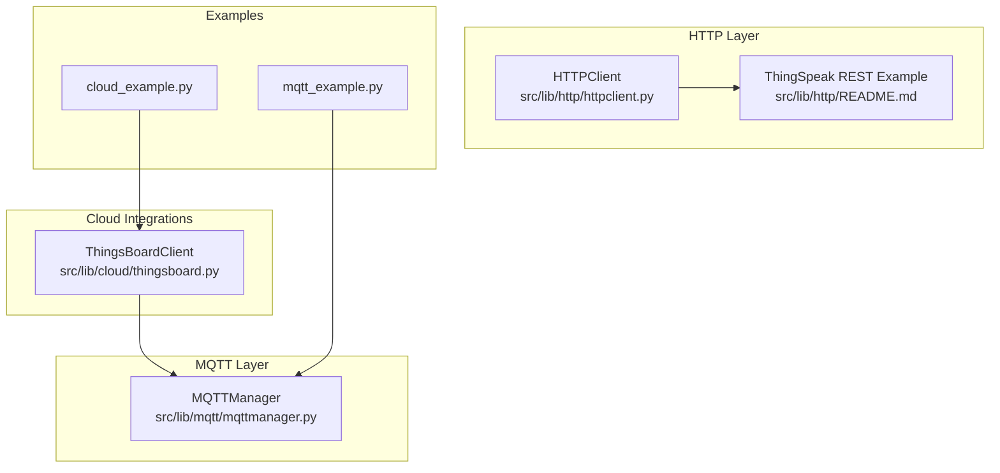
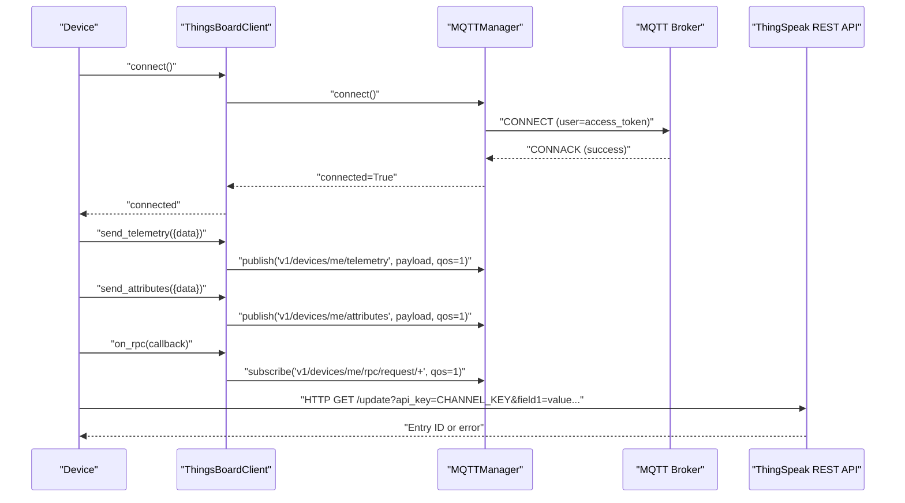
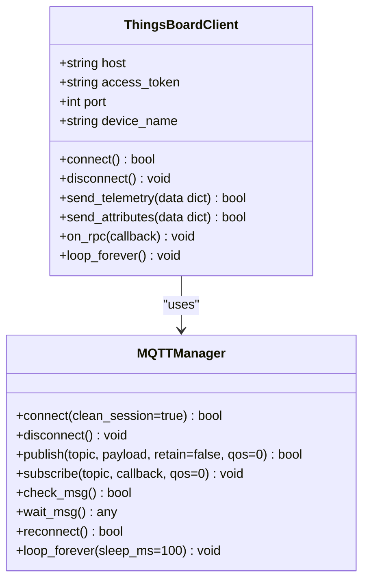
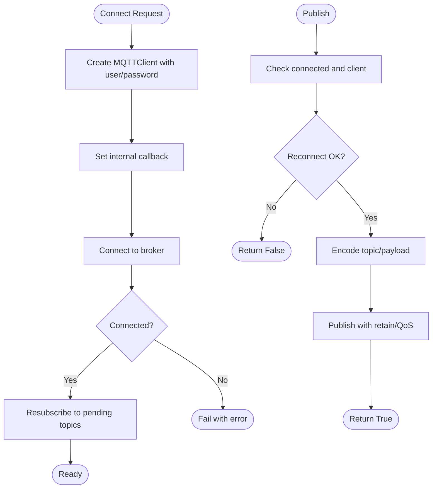
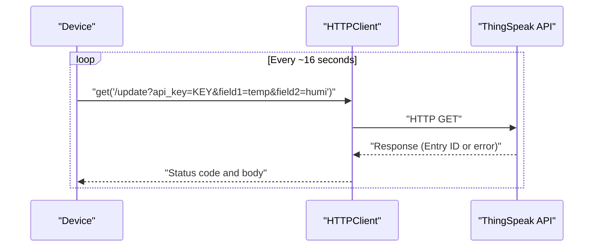
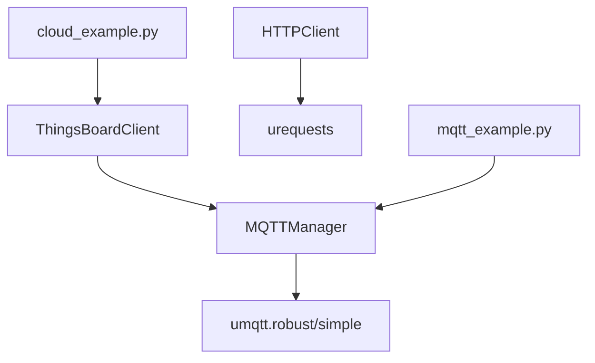

# ThingSpeak Integration

<cite>
**Referenced Files in This Document**
- [thingsboard.py](file://src/lib/cloud/thingsboard.py)
- [mqttmanager.py](file://src/lib/mqtt/mqttmanager.py)
- [httpclient.py](file://src/lib/http/httpclient.py)
- [README.md (HTTP Library)](file://src/lib/http/README.md)
- [cloud_example.py](file://src/main/examples/cloud_example.py)
- [mqtt_example.py](file://src/main/examples/mqtt_example.py)
</cite>

## Table of Contents
1. [Introduction](#introduction)
2. [Project Structure](#project-structure)
3. [Core Components](#core-components)
4. [Architecture Overview](#architecture-overview)
5. [Detailed Component Analysis](#detailed-component-analysis)
6. [Dependency Analysis](#dependency-analysis)
7. [Performance Considerations](#performance-considerations)
8. [Troubleshooting Guide](#troubleshooting-guide)
9. [Conclusion](#conclusion)
10. [Appendices](#appendices)

## Introduction
This document explains how to integrate with ThingSpeak using two complementary protocols available in the repository:
- MQTT-based integration via the ThingsBoardClient class for real-time telemetry, attributes, and RPC commands.
- REST-based integration via HTTPClient for uploading sensor data to ThingSpeak channels.

It covers the ThingsBoardClient class implementation, MQTT topic structure, authentication, QoS settings, error handling, and practical examples for sensor data upload, device attribute management, and RPC responses. It also provides guidance on integrating with ThingSpeak dashboards and visualizations.

## Project Structure
The relevant modules for ThingSpeak integration are organized as follows:
- Cloud integrations (including ThingsBoard) under src/lib/cloud
- MQTT manager under src/lib/mqtt
- HTTP client and examples under src/lib/http
- Example scripts under src/main/examples

**Diagram sources**
- [thingsboard.py:1-49](file://src/lib/cloud/thingsboard.py#L1-L49)
- [mqttmanager.py:1-190](file://src/lib/mqtt/mqttmanager.py#L1-L190)
- [httpclient.py:1-69](file://src/lib/http/httpclient.py#L1-L69)
- [README.md (HTTP Library):78-105](file://src/lib/http/README.md#L78-L105)
- [cloud_example.py:1-60](file://src/main/examples/cloud_example.py#L1-L60)
- [mqtt_example.py:1-40](file://src/main/examples/mqtt_example.py#L1-L40)

**Section sources**
- [thingsboard.py:1-49](file://src/lib/cloud/thingsboard.py#L1-L49)
- [mqttmanager.py:1-190](file://src/lib/mqtt/mqttmanager.py#L1-L190)
- [httpclient.py:1-69](file://src/lib/http/httpclient.py#L1-L69)
- [README.md (HTTP Library):78-105](file://src/lib/http/README.md#L78-L105)
- [cloud_example.py:1-60](file://src/main/examples/cloud_example.py#L1-L60)
- [mqtt_example.py:1-40](file://src/main/examples/mqtt_example.py#L1-L40)

## Core Components
- ThingsBoardClient: Provides MQTT-based device connectivity and messaging for telemetry, attributes, and RPC.
- MQTTManager: Handles MQTT connection lifecycle, subscriptions, publishing, and reconnection logic.
- HTTPClient: Enables REST-based uploads to ThingSpeak channels using GET requests with rate limiting guidance.

Key capabilities:
- Authentication via access tokens for MQTT connections.
- Telemetry publishing to v1/devices/me/telemetry with QoS 1.
- Attribute publishing to v1/devices/me/attributes with QoS 1.
- RPC subscription pattern v1/devices/me/rpc/request/+ with QoS 1.
- REST upload to ThingSpeak update endpoint with rate-limit awareness.

**Section sources**
- [thingsboard.py:9-49](file://src/lib/cloud/thingsboard.py#L9-L49)
- [mqttmanager.py:22-190](file://src/lib/mqtt/mqttmanager.py#L22-L190)
- [httpclient.py:12-69](file://src/lib/http/httpclient.py#L12-L69)
- [README.md (HTTP Library):83-105](file://src/lib/http/README.md#L83-L105)

## Architecture Overview
The integration supports two pathways:
- MQTT path: Device connects to broker using an access token, publishes telemetry and attributes, subscribes to RPC requests, and maintains persistent sessions.
- REST path: Device performs periodic GET requests to ThingSpeak update endpoint with a channel API key and respects rate limits.

**Diagram sources**
- [thingsboard.py:24-48](file://src/lib/cloud/thingsboard.py#L24-L48)
- [mqttmanager.py:84-121](file://src/lib/mqtt/mqttmanager.py#L84-L121)
- [README.md (HTTP Library):89-104](file://src/lib/http/README.md#L89-L104)

## Detailed Component Analysis

### ThingsBoardClient
Implements MQTT-based device integration with the following responsibilities:
- Constructor parameters: host, access_token, port, device_name. Uses the access_token as the MQTT username and sets up the underlying MQTTManager.
- connect(): Delegates to MQTTManager.connect().
- disconnect(): Delegates to MQTTManager.disconnect().
- send_telemetry(data): Serializes dictionary to JSON and publishes to v1/devices/me/telemetry with QoS 1.
- send_attributes(data): Serializes dictionary to JSON and publishes to v1/devices/me/attributes with QoS 1.
- on_rpc(callback): Subscribes to v1/devices/me/rpc/request/+ with QoS 1 and forwards parsed or raw messages to the provided callback.
- loop_forever(): Runs MQTT message loop with automatic reconnection.

**Diagram sources**
- [thingsboard.py:9-49](file://src/lib/cloud/thingsboard.py#L9-L49)
- [mqttmanager.py:22-190](file://src/lib/mqtt/mqttmanager.py#L22-L190)

**Section sources**
- [thingsboard.py:9-49](file://src/lib/cloud/thingsboard.py#L9-L49)

### MQTTManager
Provides robust MQTT connectivity and messaging:
- Constructor supports client_id, broker, port, user, password, keepalive, and optional persistent configuration.
- connect(): Creates an MQTTClient instance, sets callbacks, connects to broker, and resubscribes to previously subscribed topics.
- disconnect(): Safely closes the connection.
- publish(): Encodes topic/payload and publishes with configurable retain and QoS; attempts reconnection if disconnected.
- subscribe(): Registers a callback per topic and subscribes if already connected.
- check_msg()/wait_msg(): Receives incoming messages.
- reconnect(): Attempts to restore connection with exponential backoff.
- loop_forever(): Continuous loop checking messages and reconnecting on failure.

**Diagram sources**
- [mqttmanager.py:84-121](file://src/lib/mqtt/mqttmanager.py#L84-L121)
- [mqttmanager.py:132-147](file://src/lib/mqtt/mqttmanager.py#L132-L147)

**Section sources**
- [mqttmanager.py:22-190](file://src/lib/mqtt/mqttmanager.py#L22-L190)

### HTTPClient and ThingSpeak REST Upload
HTTPClient enables REST-based communication:
- Supports GET/POST/PUT/DELETE with merged headers and optional query parameters.
- Provides convenience methods for JSON parsing and text extraction.
- The HTTP library README demonstrates a ThingSpeak REST uploader that:
  - Uses GET to call /update with api_key and fieldN parameters.
  - Respects ThingSpeak rate limit by sleeping 16 seconds between updates.
  - Prints success or error status codes.

**Diagram sources**
- [httpclient.py:25-42](file://src/lib/http/httpclient.py#L25-L42)
- [README.md (HTTP Library):89-104](file://src/lib/http/README.md#L89-L104)

**Section sources**
- [httpclient.py:12-69](file://src/lib/http/httpclient.py#L12-L69)
- [README.md (HTTP Library):78-105](file://src/lib/http/README.md#L78-L105)

## Dependency Analysis
- ThingsBoardClient depends on MQTTManager for transport.
- MQTTManager depends on an MQTT library (umqtt.robust or umqtt.simple) and optionally a configuration manager for persistent settings.
- HTTPClient depends on urequests for REST calls.
- Example scripts demonstrate usage patterns for both MQTT and REST integrations.

**Diagram sources**
- [thingsboard.py](file://src/lib/cloud/thingsboard.py#L6)
- [mqttmanager.py:14-19](file://src/lib/mqtt/mqttmanager.py#L14-L19)
- [httpclient.py:6-9](file://src/lib/http/httpclient.py#L6-L9)
- [cloud_example.py:15-20](file://src/main/examples/cloud_example.py#L15-L20)
- [mqtt_example.py:13-17](file://src/main/examples/mqtt_example.py#L13-L17)

**Section sources**
- [thingsboard.py](file://src/lib/cloud/thingsboard.py#L6)
- [mqttmanager.py:14-19](file://src/lib/mqtt/mqttmanager.py#L14-L19)
- [httpclient.py:6-9](file://src/lib/http/httpclient.py#L6-L9)
- [cloud_example.py:15-20](file://src/main/examples/cloud_example.py#L15-L20)
- [mqtt_example.py:13-17](file://src/main/examples/mqtt_example.py#L13-L17)

## Performance Considerations
- QoS 1 is used for telemetry and attributes to ensure delivery; this increases reliability but may slightly increase overhead compared to QoS 0.
- MQTTManager automatically reconnects on failures; tune reconnect_interval and keepalive according to network stability.
- For REST uploads to ThingSpeak, respect the 15-second minimum update interval to avoid throttling.
- Minimize payload sizes for frequent updates to reduce bandwidth and latency.

[No sources needed since this section provides general guidance]

## Troubleshooting Guide
Common issues and resolutions:
- MQTT connection fails:
  - Verify broker host and port.
  - Confirm access_token correctness and broker support for token-based authentication.
  - Check network connectivity and firewall rules.
  - Review MQTTManager connect error logs.
- Messages not received:
  - Ensure topics match ThingsBoard MQTT contract:
    - Telemetry: v1/devices/me/telemetry
    - Attributes: v1/devices/me/attributes
    - RPC requests: v1/devices/me/rpc/request/+
  - Confirm QoS 1 subscriptions and that the device remains connected.
- RPC callbacks not invoked:
  - Ensure on_rpc is called with a proper callback and that the device stays connected.
  - Validate that RPC requests are published to the correct request topic pattern.
- REST upload errors:
  - Confirm channel API key and field indices.
  - Respect the 16-second delay between updates.
  - Inspect returned status codes and response bodies.

**Section sources**
- [mqttmanager.py:84-121](file://src/lib/mqtt/mqttmanager.py#L84-L121)
- [thingsboard.py:30-45](file://src/lib/cloud/thingsboard.py#L30-L45)
- [README.md (HTTP Library):89-104](file://src/lib/http/README.md#L89-L104)

## Conclusion
The repository provides a complete toolkit for integrating with ThingSpeak using both MQTT and REST:
- Use ThingsBoardClient for real-time telemetry, attributes, and RPC handling over MQTT with built-in QoS 1 reliability.
- Use HTTPClient to upload sensor data to ThingSpeak channels via REST with rate-limit-aware scheduling.
These components are modular, testable, and suitable for production deployments with proper error handling and reconnection logic.

[No sources needed since this section summarizes without analyzing specific files]

## Appendices

### Practical Examples Index
- MQTT-based telemetry and attributes:
  - See [thingsboard.py:30-36](file://src/lib/cloud/thingsboard.py#L30-L36) for publish methods and [cloud_example.py:15-20](file://src/main/examples/cloud_example.py#L15-L20) for usage pattern.
- RPC command handling:
  - See [thingsboard.py:38-45](file://src/lib/cloud/thingsboard.py#L38-L45) for subscription and callback forwarding.
- REST-based ThingSpeak upload:
  - See [README.md (HTTP Library):89-104](file://src/lib/http/README.md#L89-L104) for the example routine and rate-limit guidance.

**Section sources**
- [thingsboard.py:30-45](file://src/lib/cloud/thingsboard.py#L30-L45)
- [cloud_example.py:15-20](file://src/main/examples/cloud_example.py#L15-L20)
- [README.md (HTTP Library):89-104](file://src/lib/http/README.md#L89-L104)