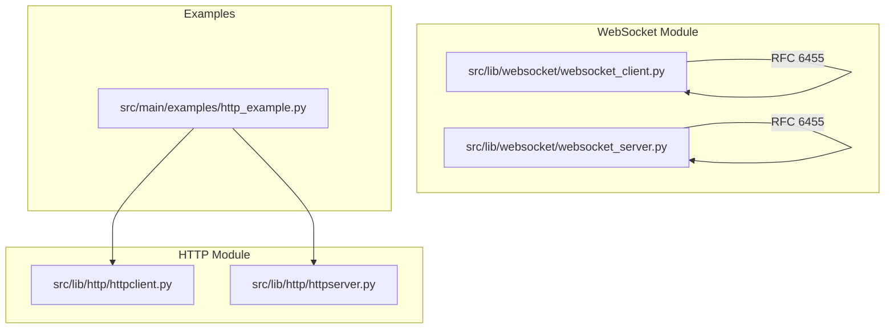
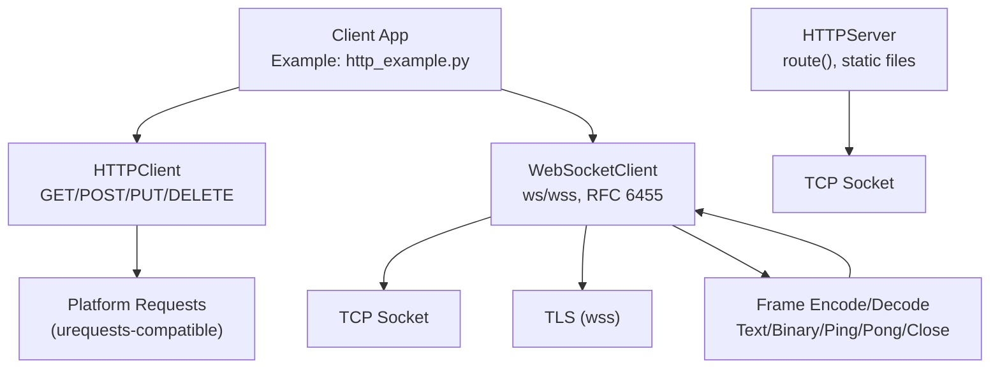
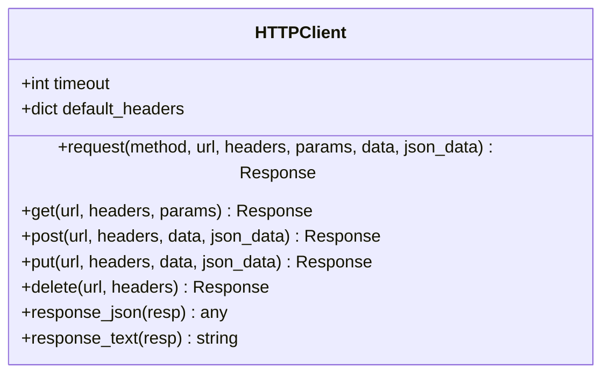
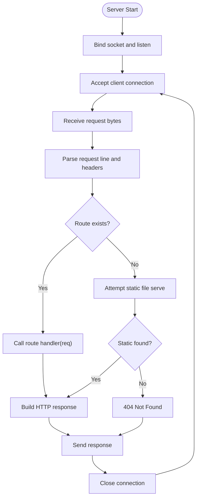
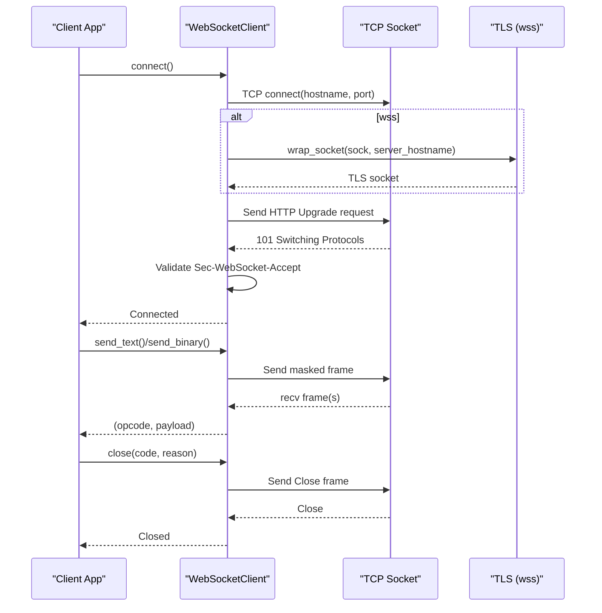
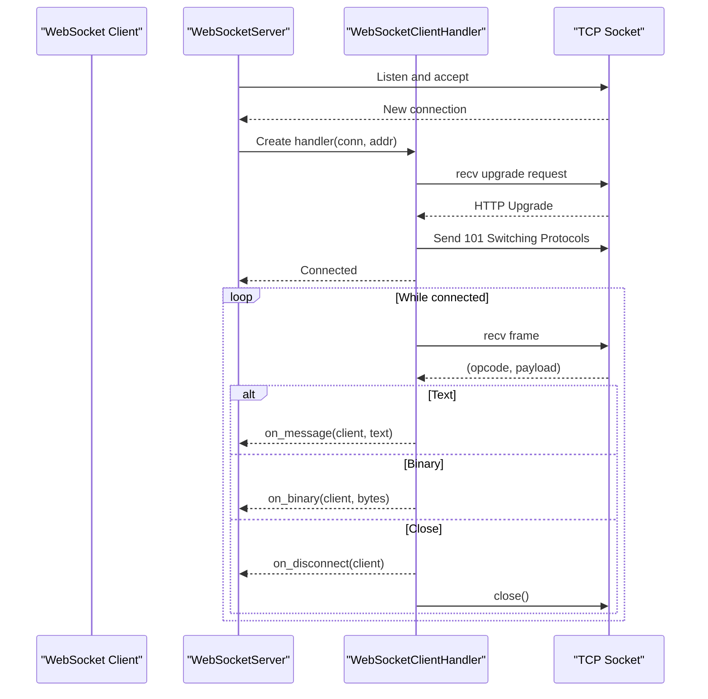
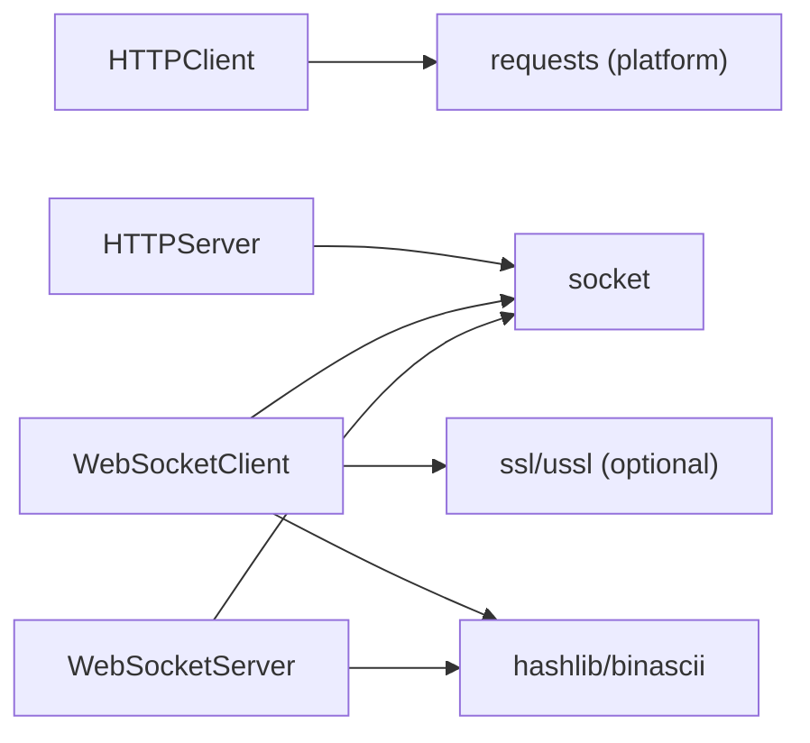

# HTTP & WebSocket

<cite>
**Referenced Files in This Document**
- [httpclient.py](file://src/lib/http/httpclient.py)
- [httpserver.py](file://src/lib/http/httpserver.py)
- [websocket_client.py](file://src/lib/websocket/websocket_client.py)
- [websocket_server.py](file://src/lib/websocket/websocket_server.py)
- [http_example.py](file://src/main/examples/http_example.py)
- [README.md](file://src/lib/README.md)
</cite>

## Table of Contents
1. [Introduction](#introduction)
2. [Project Structure](#project-structure)
3. [Core Components](#core-components)
4. [Architecture Overview](#architecture-overview)
5. [Detailed Component Analysis](#detailed-component-analysis)
6. [Dependency Analysis](#dependency-analysis)
7. [Performance Considerations](#performance-considerations)
8. [Troubleshooting Guide](#troubleshooting-guide)
9. [Conclusion](#conclusion)
10. [Appendices](#appendices)

## Introduction
This document provides comprehensive documentation for HTTP and WebSocket communication protocols in the ESP32-C3 framework. It covers:
- HTTP client implementation with REST API integration, request/response handling, and error management
- HTTP server functionality including route handling, static file serving, and API endpoint creation
- WebSocket client and server implementations aligned with RFC 6455, real-time communication patterns, connection lifecycle management, and message framing
- Practical examples from http_example.py and conceptual WebSocket usage patterns
- Security considerations, connection pooling, performance optimization, and troubleshooting network communication issues

## Project Structure
The HTTP and WebSocket modules are located under src/lib/http and src/lib/websocket respectively. The HTTP example resides under src/main/examples.

**Diagram sources**
- [httpclient.py:1-69](file://src/lib/http/httpclient.py#L1-L69)
- [httpserver.py:1-123](file://src/lib/http/httpserver.py#L1-L123)
- [websocket_client.py:1-455](file://src/lib/websocket/websocket_client.py#L1-L455)
- [websocket_server.py:1-318](file://src/lib/websocket/websocket_server.py#L1-L318)
- [http_example.py:1-43](file://src/main/examples/http_example.py#L1-L43)

**Section sources**
- [README.md:1-72](file://src/lib/README.md#L1-L72)
- [http_example.py:1-43](file://src/main/examples/http_example.py#L1-L43)

## Core Components
- HTTPClient: A lightweight HTTP client wrapper around the platform’s urequests-compatible interface, supporting GET, POST, PUT, DELETE, parameterized queries, JSON payloads, and response helpers.
- HTTPServer: A minimal HTTP server with route decorators, basic static file serving, and synchronous request handling loop.
- WebSocketClient: RFC 6455-compliant client supporting ws/wss, handshake validation, masking, ping/pong keepalive, and async send/receive.
- WebSocketServer: RFC 6455-compliant server with per-client handler, callbacks for connect/message/binary/disconnect, and async event loop.

**Section sources**
- [httpclient.py:12-69](file://src/lib/http/httpclient.py#L12-L69)
- [httpserver.py:9-123](file://src/lib/http/httpserver.py#L9-L123)
- [websocket_client.py:59-455](file://src/lib/websocket/websocket_client.py#L59-L455)
- [websocket_server.py:36-318](file://src/lib/websocket/websocket_server.py#L36-L318)

## Architecture Overview
The HTTP stack integrates with the platform’s networking primitives and optional TLS module. The WebSocket stack builds atop TCP sockets and supports both plaintext and TLS-wrapped connections.

**Diagram sources**
- [httpclient.py:25-42](file://src/lib/http/httpclient.py#L25-L42)
- [httpserver.py:102-114](file://src/lib/http/httpserver.py#L102-L114)
- [websocket_client.py:147-195](file://src/lib/websocket/websocket_client.py#L147-L195)
- [websocket_server.py:232-253](file://src/lib/websocket/websocket_server.py#L232-L253)

## Detailed Component Analysis

### HTTP Client
Key capabilities:
- Request construction with merged default headers and optional query parameters
- Support for form data and JSON payloads
- Convenience methods for common HTTP verbs
- Response helpers for JSON and text extraction

Processing logic:
- Merge default headers with user-provided headers
- Optionally append query parameters to the URL
- Forward request to the underlying requests library
- Provide response helpers to safely extract JSON/text

**Diagram sources**
- [httpclient.py:12-69](file://src/lib/http/httpclient.py#L12-L69)

**Section sources**
- [httpclient.py:12-69](file://src/lib/http/httpclient.py#L12-L69)
- [http_example.py:12-20](file://src/main/examples/http_example.py#L12-L20)

### HTTP Server
Key capabilities:
- Route registration via decorator or programmatic API
- Basic HTTP request parsing and routing
- Static file serving from a root directory
- Synchronous accept-loop with per-connection handling

Processing logic:
- Accept incoming connections
- Parse HTTP request line and headers
- Match route by method and path
- Invoke handler returning status/content-type/body
- Serve static files if no route matched
- Send standardized responses and close connection

**Diagram sources**
- [httpserver.py:102-114](file://src/lib/http/httpserver.py#L102-L114)
- [httpserver.py:71-101](file://src/lib/http/httpserver.py#L71-L101)

**Section sources**
- [httpserver.py:9-123](file://src/lib/http/httpserver.py#L9-L123)

### WebSocket Client (RFC 6455)
Key capabilities:
- URL parsing for ws/wss
- TCP connect and optional TLS wrap
- HTTP Upgrade handshake with key validation
- Frame encoding/decoding for Text/Binary/Ping/Pong/Close
- Automatic masking for client-to-server frames
- Optional periodic ping keepalive
- Async send/receive with timeouts

**Diagram sources**
- [websocket_client.py:147-195](file://src/lib/websocket/websocket_client.py#L147-L195)
- [websocket_client.py:285-393](file://src/lib/websocket/websocket_client.py#L285-L393)
- [websocket_client.py:412-435](file://src/lib/websocket/websocket_client.py#L412-L435)

**Section sources**
- [websocket_client.py:59-455](file://src/lib/websocket/websocket_client.py#L59-L455)

### WebSocket Server (RFC 6455)
Key capabilities:
- Single-connection listener with per-client handler
- HTTP Upgrade handshake validation
- Asynchronous receive/send with automatic PING/PONG handling
- Callback-driven lifecycle events (connect, message, binary, disconnect)
- Graceful close handling

**Diagram sources**
- [websocket_server.py:232-253](file://src/lib/websocket/websocket_server.py#L232-L253)
- [websocket_server.py:254-299](file://src/lib/websocket/websocket_server.py#L254-L299)

**Section sources**
- [websocket_server.py:36-318](file://src/lib/websocket/websocket_server.py#L36-L318)

## Dependency Analysis
- HTTPClient depends on the platform’s requests-compatible module and merges default headers with user-provided headers.
- HTTPServer depends on socket for TCP handling and maintains an internal route map.
- WebSocketClient depends on socket, optional TLS, and hashing/binary utilities for handshake and frame processing.
- WebSocketServer depends on socket and asyncio for asynchronous handling and per-client management.

**Diagram sources**
- [httpclient.py:6-9](file://src/lib/http/httpclient.py#L6-L9)
- [httpserver.py](file://src/lib/http/httpserver.py#L6)
- [websocket_client.py:14-26](file://src/lib/websocket/websocket_client.py#L14-L26)
- [websocket_server.py:9-22](file://src/lib/websocket/websocket_server.py#L9-L22)

**Section sources**
- [httpclient.py:6-9](file://src/lib/http/httpclient.py#L6-L9)
- [httpserver.py](file://src/lib/http/httpserver.py#L6)
- [websocket_client.py:14-26](file://src/lib/websocket/websocket_client.py#L14-L26)
- [websocket_server.py:9-22](file://src/lib/websocket/websocket_server.py#L9-L22)

## Performance Considerations
- HTTP
  - Reuse connections where possible; avoid frequent DNS lookups by resolving early and caching IP addresses.
  - Minimize payload sizes for frequent requests; compress where supported by the server.
  - Tune timeout values to balance responsiveness and resource usage.
- WebSocket
  - Use ping intervals appropriate to network conditions to maintain liveness without excessive overhead.
  - Fragment large messages to reduce peak memory usage during send/receive.
  - Prefer binary frames for structured data to minimize encoding overhead.
- General
  - Limit concurrent connections to prevent memory pressure.
  - Use non-blocking sockets and timeouts to avoid deadlocks.
  - Validate and sanitize inputs to prevent resource exhaustion.

## Troubleshooting Guide
- HTTPClient
  - Missing requests module: The client raises a runtime error if the underlying requests module is unavailable. Ensure the platform provides a compatible implementation.
  - Parameter encoding: Verify query parameters are properly appended to URLs.
  - Response handling: Use response helpers to safely extract JSON/text; handle exceptions gracefully.
- HTTPServer
  - Route not found: Confirm route registration uses uppercase method and exact path match.
  - Static file serving: Ensure the file exists under the configured root and has correct permissions.
  - Connection closure: Responses are sent with Connection: close; clients should reconnect if needed.
- WebSocketClient
  - TCP connect failures: Validate hostname/port and network connectivity.
  - TLS wrap failures: Ensure TLS module is available for wss; verify server hostname matches certificate.
  - Handshake validation: Confirm Sec-WebSocket-Accept matches the expected value derived from the key and GUID.
  - Frame parsing: Large or malformed frames can cause parse errors; implement robust error handling and reconnection logic.
- WebSocketServer
  - Upgrade failure: Verify the client sends a proper Upgrade: websocket request with a valid key.
  - Per-client handling: Ensure callbacks are set before starting the server; handle exceptions in callbacks to prevent server crashes.
  - Broadcast limitations: The current server model handles one client at a time; broadcasting is conceptual for single-client deployments.

**Section sources**
- [httpclient.py:25-42](file://src/lib/http/httpclient.py#L25-L42)
- [httpserver.py:71-101](file://src/lib/http/httpserver.py#L71-L101)
- [websocket_client.py:157-195](file://src/lib/websocket/websocket_client.py#L157-L195)
- [websocket_server.py:46-87](file://src/lib/websocket/websocket_server.py#L46-L87)

## Conclusion
The ESP32-C3 framework provides a compact yet capable set of HTTP and WebSocket primitives suitable for embedded IoT applications. The HTTP client and server offer straightforward REST and static file serving, while the WebSocket client and server implement RFC 6455-compliant real-time communication with essential lifecycle and framing features. By following the best practices and troubleshooting guidance herein, developers can build reliable, secure, and efficient networked applications.

## Appendices
- Practical usage example for HTTP client is demonstrated in http_example.py, showing GET requests with query parameters and safe response handling.
- For WebSocket usage, refer to the client and server APIs documented above; integrate with WiFi and system modules for production deployments.

**Section sources**
- [http_example.py:12-20](file://src/main/examples/http_example.py#L12-L20)
- [README.md:52-66](file://src/lib/README.md#L52-L66)