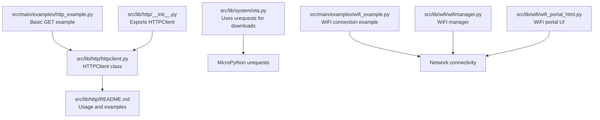
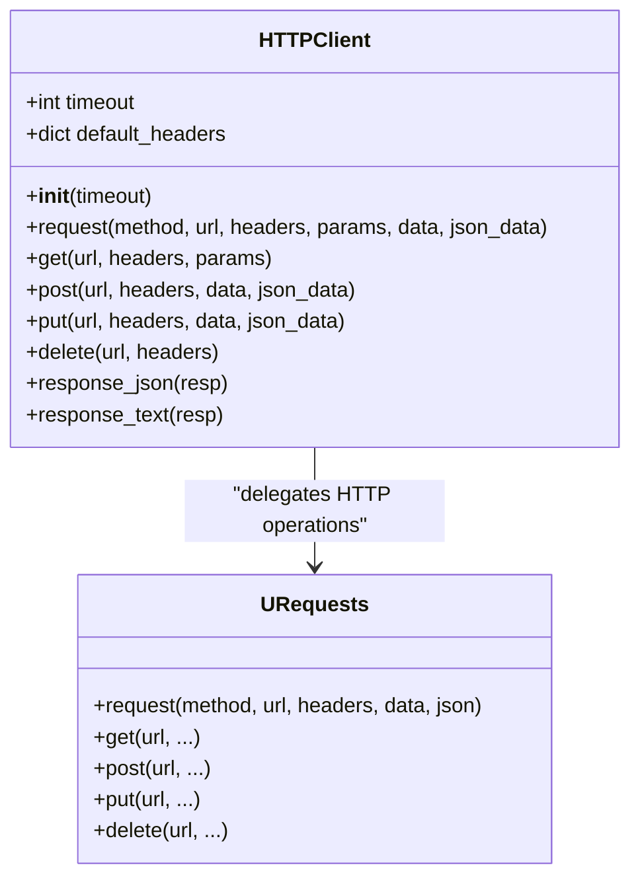
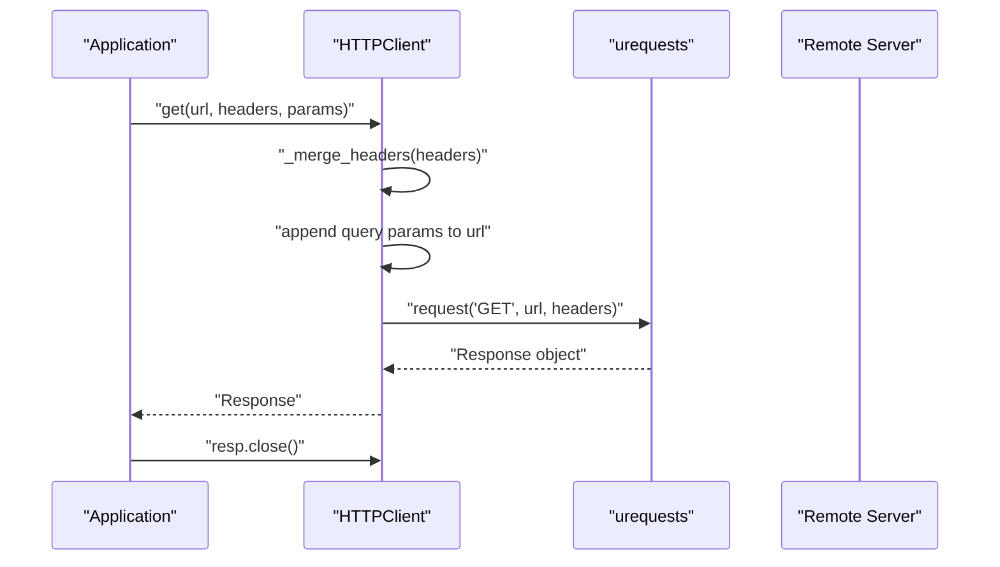
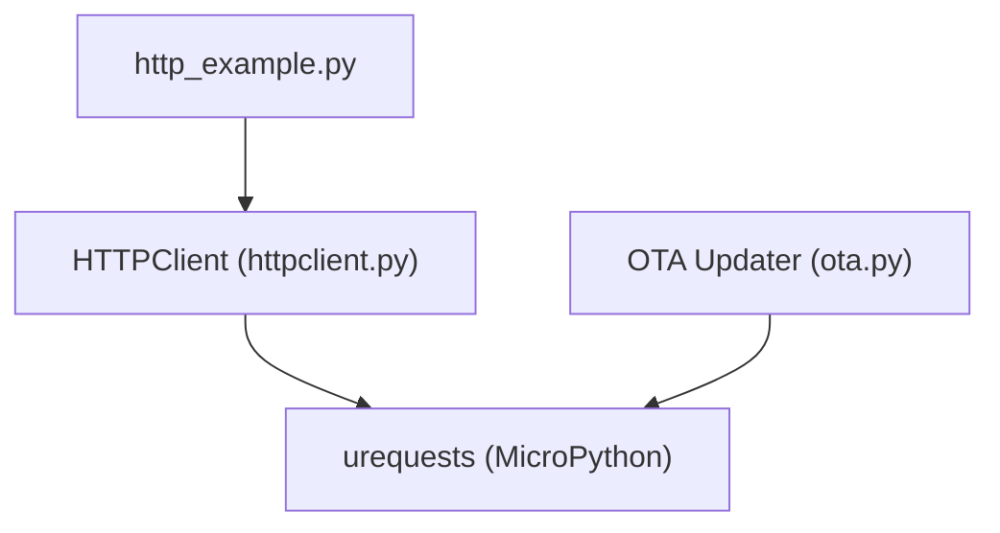

# HTTP Client

<cite>
**Referenced Files in This Document**
- [httpclient.py](file://src/lib/http/httpclient.py)
- [http_example.py](file://src/main/examples/http_example.py)
- [README.md](file://src/lib/http/README.md)
- [__init__.py](file://src/lib/http/__init__.py)
- [ota.py](file://src/lib/system/ota.py)
- [wifi_example.py](file://src/main/examples/wifi_example.py)
- [wifi_portal_html.py](file://src/lib/wifi/wifi_portal_html.py)
- [wifimanager.py](file://src/lib/wifi/wifimanager.py)
</cite>

## Table of Contents
1. [Introduction](#introduction)
2. [Project Structure](#project-structure)
3. [Core Components](#core-components)
4. [Architecture Overview](#architecture-overview)
5. [Detailed Component Analysis](#detailed-component-analysis)
6. [Dependency Analysis](#dependency-analysis)
7. [Performance Considerations](#performance-considerations)
8. [Troubleshooting Guide](#troubleshooting-guide)
9. [Conclusion](#conclusion)
10. [Appendices](#appendices)

## Introduction
This document provides comprehensive documentation for the HTTP Client implementation in the ESP32-C3 framework. It focuses on the HTTPClient class, supported HTTP methods, header management, parameter handling, response processing, integration with the MicroPython urequests module, timeout configuration, default headers, and error handling. Practical examples demonstrate REST API integration, authentication, JSON handling, and response parsing. The guide also covers connection management, retry strategies, performance optimization, common HTTP status codes, error scenarios, and troubleshooting network connectivity issues.

## Project Structure
The HTTP client resides under the HTTP library package and integrates with MicroPython’s urequests module. The example demonstrates basic usage and shows how to import and use the HTTPClient class.

**Diagram sources**
- [httpclient.py:1-69](file://src/lib/http/httpclient.py#L1-L69)
- [README.md:1-224](file://src/lib/http/README.md#L1-L224)
- [http_example.py:1-43](file://src/main/examples/http_example.py#L1-L43)
- [__init__.py:1-3](file://src/lib/http/__init__.py#L1-L3)
- [ota.py:1-67](file://src/lib/system/ota.py#L1-L67)
- [wifi_example.py:59-99](file://src/main/examples/wifi_example.py#L59-L99)
- [wifimanager.py:321-355](file://src/lib/wifi/wifimanager.py#L321-L355)
- [wifi_portal_html.py:353-382](file://src/lib/wifi/wifi_portal_html.py#L353-L382)

**Section sources**
- [httpclient.py:1-69](file://src/lib/http/httpclient.py#L1-L69)
- [README.md:1-224](file://src/lib/http/README.md#L1-L224)
- [http_example.py:1-43](file://src/main/examples/http_example.py#L1-L43)
- [__init__.py:1-3](file://src/lib/http/__init__.py#L1-L3)

## Core Components
- HTTPClient: A lightweight wrapper around MicroPython’s urequests module that supports GET, POST, PUT, DELETE, and PATCH-like operations. It merges default headers with caller-provided headers, handles query parameters, and exposes helpers to parse JSON and text from responses.
- Response helpers: Static methods to safely extract JSON or text from a response object, returning sensible defaults on failure.
- Integration with urequests: The client delegates actual HTTP operations to urequests, enabling HTTPS support and standard HTTP semantics on ESP32 MicroPython.

Key capabilities:
- Constructor parameters: timeout (seconds), default headers (merged into every request).
- Methods: get, post, put, delete, plus convenience helpers for JSON parsing and text extraction.
- Parameter handling: Query parameters are appended to the URL automatically.
- Header management: Default headers are merged with user-provided headers; default includes a User-Agent string.

**Section sources**
- [httpclient.py:12-69](file://src/lib/http/httpclient.py#L12-L69)
- [README.md:20-53](file://src/lib/http/README.md#L20-L53)

## Architecture Overview
The HTTPClient architecture is a thin facade over MicroPython’s urequests. It centralizes header merging, parameter encoding, and response parsing, while delegating network operations to urequests.

**Diagram sources**
- [httpclient.py:12-69](file://src/lib/http/httpclient.py#L12-L69)

## Detailed Component Analysis

### HTTPClient Class
The HTTPClient class encapsulates HTTP request creation and response handling. It manages:
- Timeout configuration at construction time.
- Default headers (e.g., User-Agent) merged with per-request headers.
- Query parameter encoding and URL composition.
- Delegation to urequests for actual network operations.
- Safe response parsing helpers for JSON and text.

**Diagram sources**
- [httpclient.py:25-42](file://src/lib/http/httpclient.py#L25-L42)

Implementation highlights:
- Header merging ensures default headers are always present while allowing overrides.
- Query parameters are encoded and appended to the URL using standard separators.
- The request method constructs keyword arguments for urequests and returns the response immediately.

**Section sources**
- [httpclient.py:12-69](file://src/lib/http/httpclient.py#L12-L69)

### Request Methods and Parameter Handling
Supported methods:
- GET: Fetches resources with optional query parameters and headers.
- POST: Sends data or JSON payload with optional headers.
- PUT: Updates resources with optional data or JSON payload.
- DELETE: Removes resources with optional headers.

Parameter handling:
- Query parameters are transformed into a query string and appended to the URL.
- Headers are merged with default headers before sending the request.
- Data and JSON payloads are passed through to urequests depending on the method.

Practical example paths:
- Basic GET with query parameters: [http_example.py:12-19](file://src/main/examples/http_example.py#L12-L19)
- REST API usage pattern: [README.md:78-105](file://src/lib/http/README.md#L78-L105)

**Section sources**
- [httpclient.py:44-54](file://src/lib/http/httpclient.py#L44-L54)
- [http_example.py:12-19](file://src/main/examples/http_example.py#L12-L19)
- [README.md:78-105](file://src/lib/http/README.md#L78-L105)

### Header Management
Default headers:
- User-Agent is set to a framework-specific identifier to aid server-side diagnostics.

Header precedence:
- Per-request headers override default headers for that request.
- Merging is performed in the internal header merge routine.

Integration note:
- When using HTTPS, headers are applied consistently through urequests.

**Section sources**
- [httpclient.py:13-23](file://src/lib/http/httpclient.py#L13-L23)

### Response Processing
Response helpers:
- response_json(resp): Safely parses JSON from a response, returning None on failure.
- response_text(resp): Returns response text or empty string on failure.

Usage pattern:
- Applications should inspect status_code, then use response helpers or access .text/.json() directly.

Example paths:
- Accessing status and text: [http_example.py:15-19](file://src/main/examples/http_example.py#L15-L19)
- Response object attributes: [README.md](file://src/lib/http/README.md#L52)

**Section sources**
- [httpclient.py:56-69](file://src/lib/http/httpclient.py#L56-L69)
- [http_example.py:15-19](file://src/main/examples/http_example.py#L15-L19)
- [README.md](file://src/lib/http/README.md#L52)

### Integration with urequests and HTTPS
- The HTTPClient relies on MicroPython’s urequests module for HTTP(S) operations.
- HTTPS is supported via urequests, enabling secure communication to remote APIs.
- OTA firmware updates also leverage urequests for downloading firmware images.

**Section sources**
- [httpclient.py:6-9](file://src/lib/http/httpclient.py#L6-L9)
- [ota.py:7-10](file://src/lib/system/ota.py#L7-L10)

### Practical Examples and Use Cases
- Basic GET request with query parameters: [http_example.py:12-19](file://src/main/examples/http_example.py#L12-L19)
- REST API client pattern with periodic polling and rate limiting: [README.md:78-105](file://src/lib/http/README.md#L78-L105)
- Authentication via headers: [README.md:83-87](file://src/lib/http/README.md#L83-L87)

JSON handling:
- Use post/put with json_data parameter for structured payloads.
- Parse responses with response_json(resp) or resp.json() for JSON endpoints.

**Section sources**
- [http_example.py:12-19](file://src/main/examples/http_example.py#L12-L19)
- [README.md:78-105](file://src/lib/http/README.md#L78-L105)
- [httpclient.py:47-51](file://src/lib/http/httpclient.py#L47-L51)

## Dependency Analysis
The HTTPClient depends on MicroPython’s urequests module for network operations. The example demonstrates importing and using the HTTPClient class. The OTA module also uses urequests for secure downloads.

**Diagram sources**
- [httpclient.py:6-9](file://src/lib/http/httpclient.py#L6-L9)
- [http_example.py](file://src/main/examples/http_example.py#L8)
- [ota.py:7-10](file://src/lib/system/ota.py#L7-L10)

**Section sources**
- [httpclient.py:6-9](file://src/lib/http/httpclient.py#L6-L9)
- [http_example.py](file://src/main/examples/http_example.py#L8)
- [ota.py:7-10](file://src/lib/system/ota.py#L7-L10)

## Performance Considerations
- Timeout tuning: Configure HTTPClient timeout to match service SLAs and network conditions.
- Minimal headers: Only include necessary headers to reduce overhead.
- Payload size: Prefer compact JSON payloads and avoid large binary transfers.
- Connection reuse: Reuse connections where possible; close responses promptly to free resources.
- Rate limiting: Apply backoff and throttling for frequent polling to remote APIs.
- Memory constraints: On ESP32, avoid building large response bodies in memory; process incrementally when feasible.

[No sources needed since this section provides general guidance]

## Troubleshooting Guide
Common issues and resolutions:
- Missing urequests module: The client raises a runtime error if urequests is unavailable. Ensure the MicroPython firmware includes urequests or install it on the device.
- No WiFi connectivity: HTTP requests require an active network connection. Verify WiFi is connected before making requests.
- Timeouts: Increase timeout for slow networks or remote servers. Consider retry logic with exponential backoff.
- SSL/TLS limitations: HTTPS is supported via urequests, but certificate verification behavior varies. Validate server certificates externally if strict security is required.
- Large responses: Avoid loading entire responses into memory. Close responses after use and consider streaming where applicable.
- Authentication failures: Ensure Authorization headers are correctly formatted and tokens are fresh.

Network connectivity references:
- WiFi connection example: [wifi_example.py:76-97](file://src/main/examples/wifi_example.py#L76-L97)
- Keep-alive mode for reconnection: [wifimanager.py:333-342](file://src/lib/wifi/wifimanager.py#L333-L342)
- Portal UI for testing connectivity: [wifi_portal_html.py:364-366](file://src/lib/wifi/wifi_portal_html.py#L364-L366)

**Section sources**
- [httpclient.py:25-27](file://src/lib/http/httpclient.py#L25-L27)
- [wifi_example.py:76-97](file://src/main/examples/wifi_example.py#L76-L97)
- [wifimanager.py:333-342](file://src/lib/wifi/wifimanager.py#L333-L342)
- [wifi_portal_html.py:364-366](file://src/lib/wifi/wifi_portal_html.py#L364-L366)

## Conclusion
The HTTPClient provides a concise, reliable interface for HTTP(S) communication on ESP32 MicroPython. By leveraging urequests, it offers robust support for modern protocols and common REST patterns. With proper timeout configuration, header management, and careful response handling, applications can integrate seamlessly with external APIs, implement authentication, and manage network reliability through retries and keep-alive strategies.

[No sources needed since this section summarizes without analyzing specific files]

## Appendices

### API Reference Summary
- Constructor: timeout (seconds), default headers (merged into every request)
- Methods: get, post, put, delete, plus response helpers response_json and response_text
- Parameter handling: Automatic query string encoding and URL composition
- Integration: Delegates to MicroPython’s urequests for HTTP(S) operations

**Section sources**
- [httpclient.py:12-69](file://src/lib/http/httpclient.py#L12-L69)
- [README.md:20-53](file://src/lib/http/README.md#L20-L53)