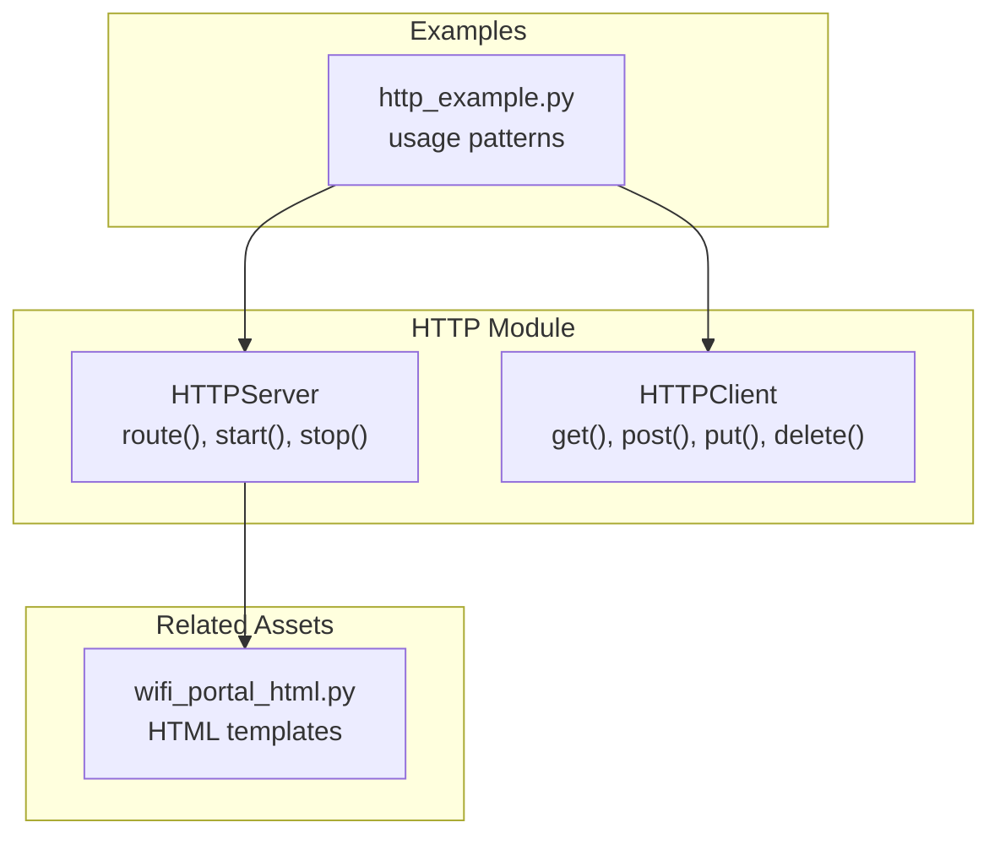
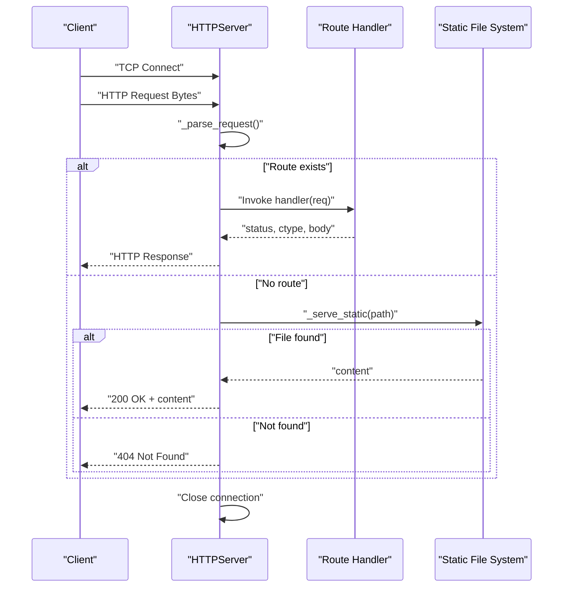
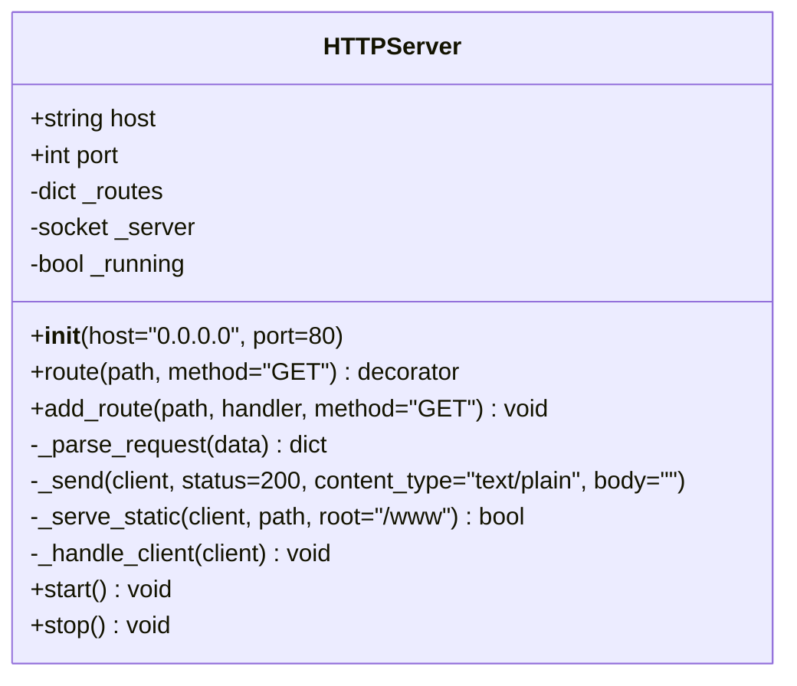
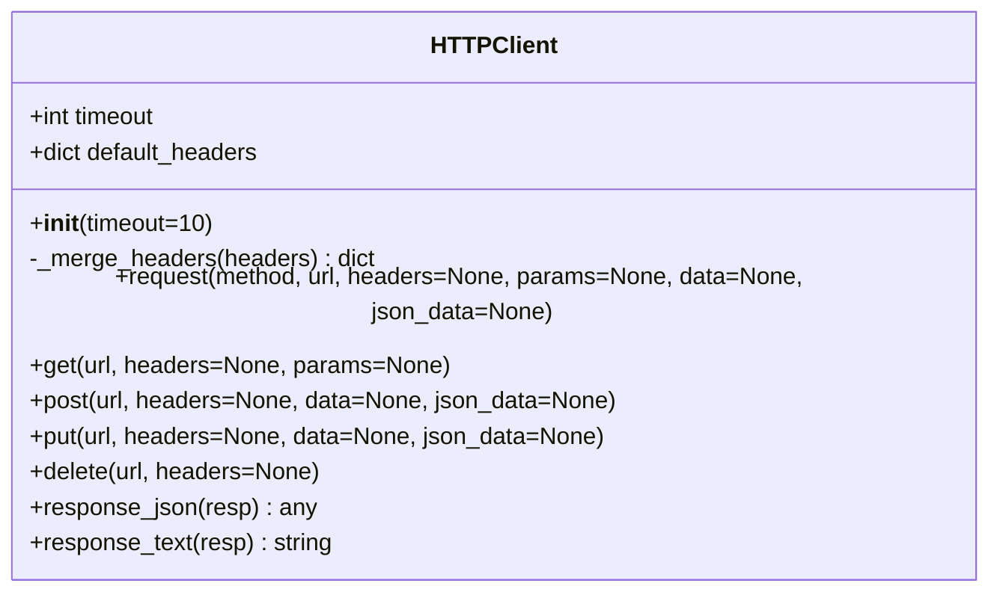
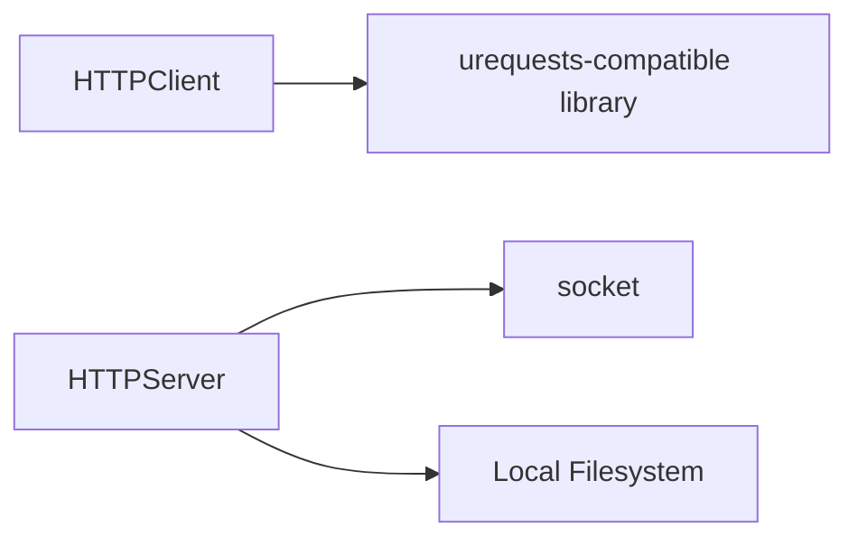

# HTTP Server

<cite>
**Referenced Files in This Document**
- [httpserver.py](file://src/lib/http/httpserver.py)
- [httpclient.py](file://src/lib/http/httpclient.py)
- [http_example.py](file://src/main/examples/http_example.py)
- [wifi_portal_html.py](file://src/lib/wifi/wifi_portal_html.py)
</cite>

## Table of Contents
1. [Introduction](#introduction)
2. [Project Structure](#project-structure)
3. [Core Components](#core-components)
4. [Architecture Overview](#architecture-overview)
5. [Detailed Component Analysis](#detailed-component-analysis)
6. [Dependency Analysis](#dependency-analysis)
7. [Performance Considerations](#performance-considerations)
8. [Troubleshooting Guide](#troubleshooting-guide)
9. [Conclusion](#conclusion)
10. [Appendices](#appendices)

## Introduction
This document describes the HTTP Server implementation for the ESP32-C3 using MicroPython. It focuses on the HTTPServer class, covering route registration and dispatch, request parsing, response formatting, static file serving, and practical usage patterns. It also outlines the HTTPClient companion utility and provides guidance on building RESTful APIs, serving web interfaces, handling forms, implementing basic authentication, and addressing security and performance considerations.

## Project Structure
The HTTP stack resides under src/lib/http and includes:
- HTTPServer: A lightweight TCP socket-based HTTP server with route decorators and static file serving.
- HTTPClient: A simple HTTP client wrapper around MicroPython's urequests-compatible interface.

Example usage and related assets are located under src/main/examples and src/lib/wifi respectively.

**Diagram sources**
- [httpserver.py](file://src/lib/http/httpserver.py)
- [httpclient.py](file://src/lib/http/httpclient.py)
- [http_example.py](file://src/main/examples/http_example.py)
- [wifi_portal_html.py](file://src/lib/wifi/wifi_portal_html.py)

**Section sources**
- [httpserver.py](file://src/lib/http/httpserver.py)
- [httpclient.py](file://src/lib/http/httpclient.py)
- [http_example.py](file://src/main/examples/http_example.py)
- [wifi_portal_html.py](file://src/lib/wifi/wifi_portal_html.py)

## Core Components
- HTTPServer
  - Host/port binding and socket lifecycle
  - Route registration via decorator and programmatic API
  - Request parsing and dispatch
  - Static file serving from a configurable root
  - Response formatting and content-type handling
  - Single-threaded accept-loop with per-connection handling

- HTTPClient
  - Wraps MicroPython HTTP capabilities
  - Supports GET/POST/PUT/DELETE
  - Query parameters, headers, JSON, and raw body
  - Utility helpers for response extraction

**Section sources**
- [httpserver.py](file://src/lib/http/httpserver.py)
- [httpclient.py](file://src/lib/http/httpclient.py)

## Architecture Overview
The HTTPServer is a single-threaded event loop over incoming TCP connections. Each accepted connection is handled synchronously until completion. Routing is a simple dictionary lookup keyed by (method, path). Static files are served from a fixed root directory with basic MIME inference.

**Diagram sources**
- [httpserver.py](file://src/lib/http/httpserver.py)

## Detailed Component Analysis

### HTTPServer Class
- Initialization and configuration
  - Accepts host and port parameters
  - Maintains an internal routes registry
  - Tracks server socket and running state

- Route handling
  - Decorator route(path, method="GET") registers handlers
  - Programmatic add_route(path, handler, method="GET") supported
  - Dispatch uses (method, path) tuple keys (case-normalized)

- Request parsing
  - Decodes bytes to UTF-8 with error tolerance
  - Extracts method, path, and optional body after header boundary
  - Returns structured request object for handlers

- Response formatting
  - Builds HTTP/1.1 response with status, reason, Content-Type, Connection: close, and body
  - Sends encoded bytes to client socket

- Static file serving
  - Serves index.html for root path "/"
  - Reads files from a configurable root directory
  - Infers content type based on extension (.html -> text/html, otherwise text/plain)
  - Returns 404 when file is missing

- Lifecycle
  - start(): resolves address, binds socket, listens, enters accept loop
  - stop(): stops accepting new connections and closes server socket

**Diagram sources**
- [httpserver.py](file://src/lib/http/httpserver.py)

**Section sources**
- [httpserver.py](file://src/lib/http/httpserver.py)

### HTTPClient Class
- Purpose
  - Provides a simplified interface to send HTTP requests using MicroPython's urequests-compatible library

- Capabilities
  - Methods: get, post, put, delete
  - Features: query parameters, custom headers, raw body, JSON payload
  - Helpers: response_json, response_text

- Behavior
  - Merges default headers with caller-provided headers
  - Constructs query string from params
  - Delegates to underlying requests.request with merged arguments

**Diagram sources**
- [httpclient.py](file://src/lib/http/httpclient.py)

**Section sources**
- [httpclient.py](file://src/lib/http/httpclient.py)

### Example Usage Patterns
- Basic client usage
  - Demonstrates constructing a GET request with query parameters and reading response metadata
  - Shows proper resource cleanup by closing the response

- Server scaffolding
  - Includes commented example of instantiating HTTPServer, registering routes, and starting the server
  - Highlights route handler signature receiving a request object and returning status/content-type/body

- Web interface asset
  - Provides a large HTML template suitable for serving a WiFi configuration portal
  - Useful as a static asset served by the HTTPServer

**Section sources**
- [http_example.py](file://src/main/examples/http_example.py)
- [wifi_portal_html.py](file://src/lib/wifi/wifi_portal_html.py)

## Dependency Analysis
- Internal dependencies
  - HTTPServer depends on Python socket module for networking
  - HTTPClient depends on MicroPython's urequests-compatible library

- External integration points
  - Static file serving relies on local filesystem access
  - Route handlers receive parsed request objects and return standardized tuples for responses

**Diagram sources**
- [httpserver.py](file://src/lib/http/httpserver.py)
- [httpclient.py](file://src/lib/http/httpclient.py)

**Section sources**
- [httpserver.py](file://src/lib/http/httpserver.py)
- [httpclient.py](file://src/lib/http/httpclient.py)

## Performance Considerations
- Threading model
  - Single-threaded accept loop; each connection is processed synchronously
  - Long-running handlers block new connections

- Buffering and parsing
  - Request buffer size is fixed; very large bodies may require client adjustments
  - Header/body separation uses a simple delimiter scan

- Static file serving
  - Entire file is read into memory before sending
  - Suitable for small assets; consider streaming for large files if needed

- Recommendations
  - Keep route handlers fast and non-blocking
  - Offload heavy tasks to cooperative async tasks if applicable
  - Use appropriate Content-Length for large responses when possible
  - Limit concurrent clients by controlling network topology or using a reverse proxy

[No sources needed since this section provides general guidance]

## Troubleshooting Guide
- Common issues and resolutions
  - Bad request parsing failures: Ensure requests include a proper HTTP line and headers
  - 404 Not Found: Verify route registration keys match method/path exactly; confirm static file path and root directory
  - Port binding errors: Check if port is in use or blocked by firewall
  - Socket errors during close: Graceful shutdown handles exceptions; ensure stop() is called to release resources

- Debugging tips
  - Log request method and path before dispatch
  - Print parsed request body for POST/PUT handlers
  - Validate route keys and handler signatures
  - Confirm static file existence and permissions

**Section sources**
- [httpserver.py](file://src/lib/http/httpserver.py)

## Conclusion
The HTTPServer provides a minimal yet effective foundation for serving both RESTful endpoints and static web assets on ESP32-C3. Its synchronous design simplifies development while limiting concurrency. Combined with HTTPClient, it enables straightforward client-server communication. For production scenarios, consider extending with async support, middleware, CORS, and robust authentication.

[No sources needed since this section summarizes without analyzing specific files]

## Appendices

### API Endpoint Creation and Response Formatting
- Define routes using the decorator or programmatic API
- Handlers receive a request object and must return a three-tuple: (status, content_type, body)
- For convenience, returning a scalar value yields a default 200 with text/plain

**Section sources**
- [httpserver.py](file://src/lib/http/httpserver.py)

### Serving Web Interfaces and Static Assets
- Place HTML/CSS/JS files under the configured static root
- Root path "/" maps to index.html
- Content-Type inferred from file extension

**Section sources**
- [httpserver.py](file://src/lib/http/httpserver.py)

### Building RESTful APIs
- Register handlers for desired HTTP methods and paths
- Parse query parameters and request body in handlers
- Return JSON responses with appropriate content type

**Section sources**
- [httpserver.py](file://src/lib/http/httpserver.py)

### Handling Form Submissions
- Access request body in handlers
- Parse form-encoded or multipart payloads as needed
- Validate and sanitize inputs before processing

**Section sources**
- [httpserver.py](file://src/lib/http/httpserver.py)

### Implementing Authentication Mechanisms
- Add pre-handler checks for credentials
- Support basic auth headers or custom tokens
- Enforce authentication for protected routes

[No sources needed since this section provides general guidance]

### Security Considerations
- Input validation and sanitization
- Avoid exposing sensitive files via static serving
- Prefer HTTPS termination at a gateway if possible
- Implement rate limiting and input size caps

[No sources needed since this section provides general guidance]

### CORS Handling
- Add appropriate headers in handlers for cross-origin requests
- Configure allowed origins, methods, and headers per endpoint

[No sources needed since this section provides general guidance]