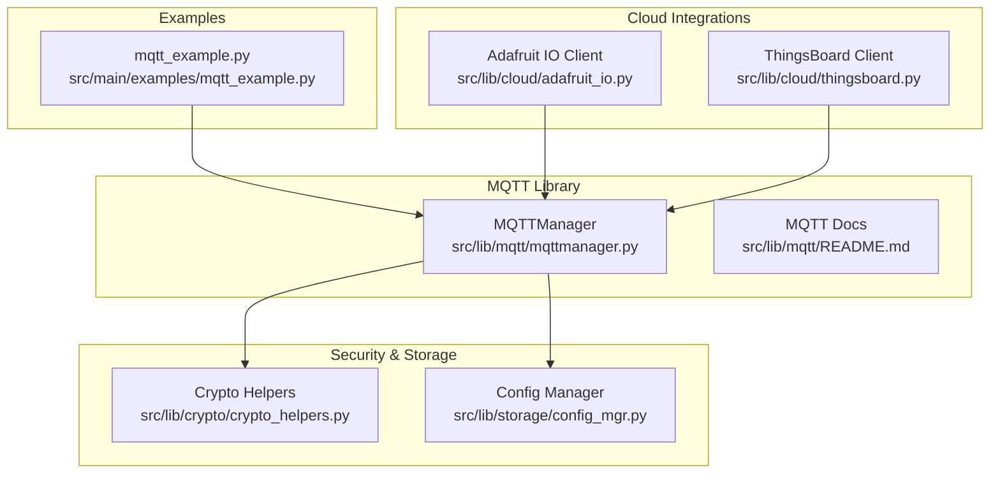
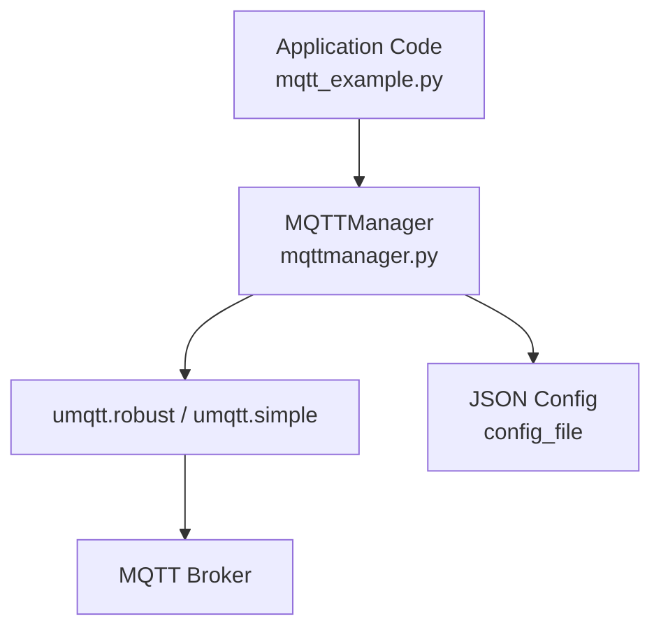
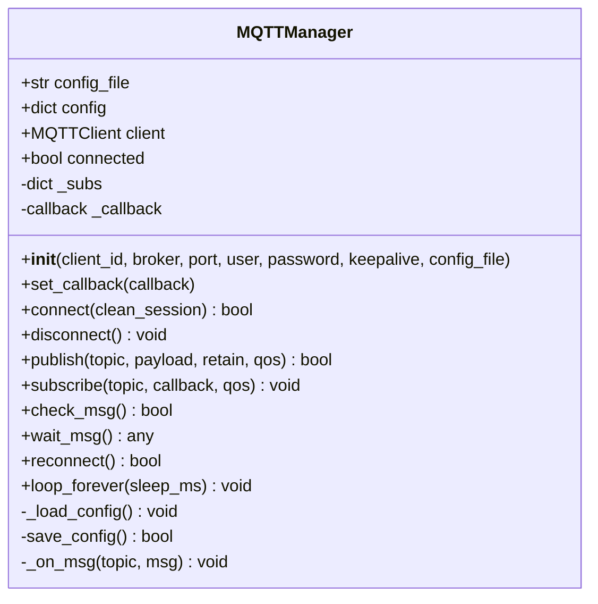
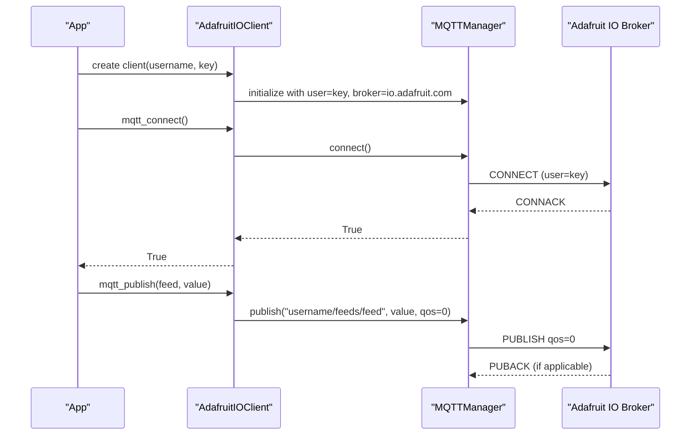
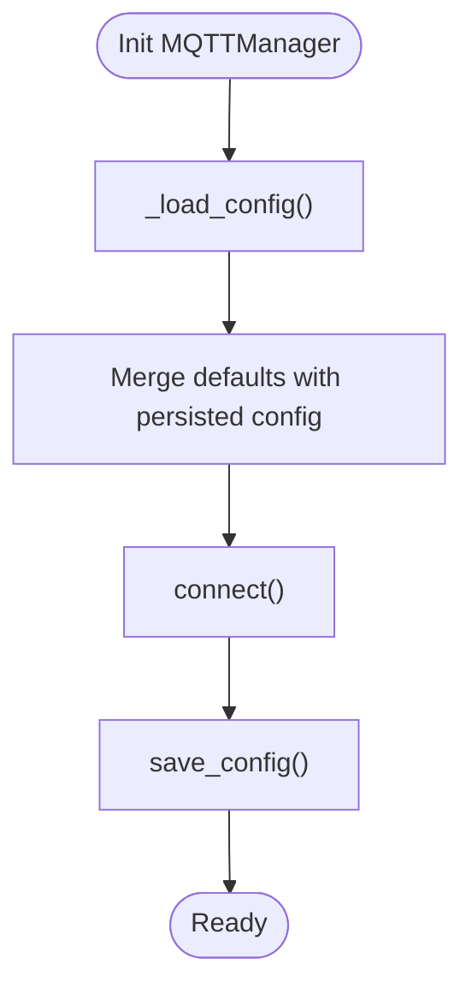
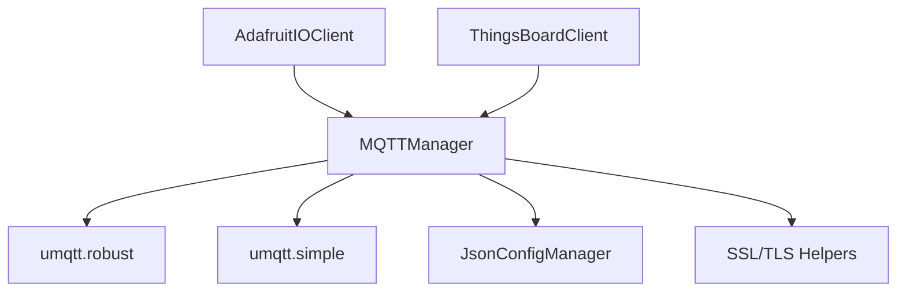
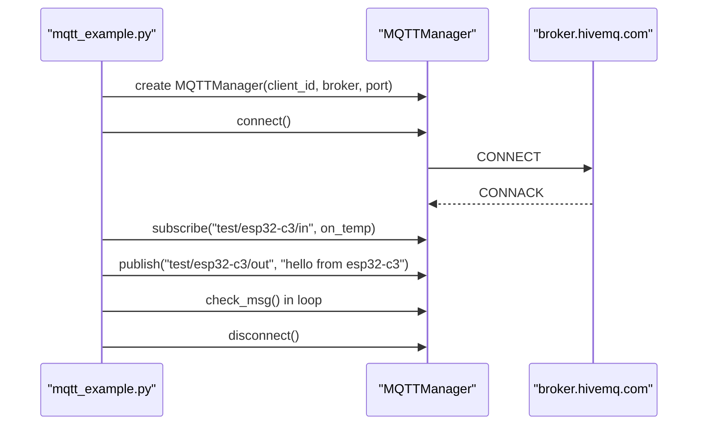

# MQTT Protocol

<cite>
**Referenced Files in This Document**
- [mqttmanager.py](file://src/lib/mqtt/mqttmanager.py)
- [README.md](file://src/lib/mqtt/README.md)
- [mqtt_example.py](file://src/main/examples/mqtt_example.py)
- [adafruit_io.py](file://src/lib/cloud/adafruit_io.py)
- [thingsboard.py](file://src/lib/cloud/thingsboard.py)
- [crypto_helpers.py](file://src/lib/crypto/crypto_helpers.py)
- [config_mgr.py](file://src/lib/storage/config_mgr.py)
</cite>

## Table of Contents
1. [Introduction](#introduction)
2. [Project Structure](#project-structure)
3. [Core Components](#core-components)
4. [Architecture Overview](#architecture-overview)
5. [Detailed Component Analysis](#detailed-component-analysis)
6. [Dependency Analysis](#dependency-analysis)
7. [Performance Considerations](#performance-considerations)
8. [Security Considerations](#security-considerations)
9. [Troubleshooting Guide](#troubleshooting-guide)
10. [Practical Examples](#practical-examples)
11. [Conclusion](#conclusion)

## Introduction
This document provides comprehensive documentation for the MQTT protocol implementation in the ESP32-C3 framework. It focuses on the MQTTManager class, covering broker connection, topic subscription, message publishing, and QoS level management. It also documents client configuration, authentication methods, keep-alive mechanisms, clean session handling, and practical usage patterns demonstrated in the included example scripts. Security considerations, message persistence, network resilience, and troubleshooting guidance are included to support robust IoT deployments.

## Project Structure
The MQTT implementation centers around the MQTTManager class located in the MQTT library, with supporting cloud integrations and cryptographic utilities. The example demonstrates basic pub/sub patterns and advanced scenarios such as reconnect loops and retained messages.

**Diagram sources**
- [mqttmanager.py:1-191](file://src/lib/mqtt/mqttmanager.py#L1-L191)
- [README.md:1-139](file://src/lib/mqtt/README.md#L1-L139)
- [mqtt_example.py:1-40](file://src/main/examples/mqtt_example.py#L1-L40)
- [adafruit_io.py:1-57](file://src/lib/cloud/adafruit_io.py#L1-L57)
- [thingsboard.py:1-49](file://src/lib/cloud/thingsboard.py#L1-L49)
- [crypto_helpers.py:1-194](file://src/lib/crypto/crypto_helpers.py#L1-L194)
- [config_mgr.py](file://src/lib/storage/config_mgr.py)

**Section sources**
- [mqttmanager.py:1-191](file://src/lib/mqtt/mqttmanager.py#L1-L191)
- [README.md:1-139](file://src/lib/mqtt/README.md#L1-L139)
- [mqtt_example.py:1-40](file://src/main/examples/mqtt_example.py#L1-L40)
- [adafruit_io.py:1-57](file://src/lib/cloud/adafruit_io.py#L1-L57)
- [thingsboard.py:1-49](file://src/lib/cloud/thingsboard.py#L1-L49)
- [crypto_helpers.py:1-194](file://src/lib/crypto/crypto_helpers.py#L1-L194)

## Core Components
- MQTTManager: Provides a unified interface for connecting to an MQTT broker, subscribing to topics, publishing messages, managing callbacks, and handling reconnection loops. It supports two underlying clients via optional imports and persists configuration to JSON.
- Cloud Clients: Adafruit IO and ThingsBoard clients demonstrate real-world usage patterns for publishing telemetry, attributes, and RPC requests using MQTTManager.
- Crypto Helpers: Document TLS support for MQTT over port 8883 and provide SSL/TLS wrapping utilities for custom socket code.
- Config Manager: Supplies JSON-based configuration persistence for MQTT settings.

Key capabilities:
- Broker connection with optional authentication and keep-alive configuration
- Topic subscription with per-topic callbacks and wildcard support
- Message publishing with QoS selection and retain flag
- Automatic reconnection with configurable intervals
- Loop-based message processing for continuous operation

**Section sources**
- [mqttmanager.py:22-191](file://src/lib/mqtt/mqttmanager.py#L22-L191)
- [README.md:20-139](file://src/lib/mqtt/README.md#L20-L139)
- [adafruit_io.py:10-37](file://src/lib/cloud/adafruit_io.py#L10-L37)
- [thingsboard.py:9-48](file://src/lib/cloud/thingsboard.py#L9-L48)
- [crypto_helpers.py:111-194](file://src/lib/crypto/crypto_helpers.py#L111-L194)

## Architecture Overview
The MQTT subsystem integrates with MicroPython’s umqtt clients and provides a higher-level abstraction for ESP32-C3 applications. The architecture supports:
- Flexible client selection (robust vs simple)
- Centralized configuration management
- Event-driven message handling with per-topic callbacks
- Robust reconnection and loop-based processing

**Diagram sources**
- [mqttmanager.py:8-19](file://src/lib/mqtt/mqttmanager.py#L8-L19)
- [mqttmanager.py:22-68](file://src/lib/mqtt/mqttmanager.py#L22-L68)
- [mqtt_example.py:12-36](file://src/main/examples/mqtt_example.py#L12-L36)

**Section sources**
- [mqttmanager.py:8-19](file://src/lib/mqtt/mqttmanager.py#L8-L19)
- [mqttmanager.py:22-68](file://src/lib/mqtt/mqttmanager.py#L22-L68)
- [mqtt_example.py:12-36](file://src/main/examples/mqtt_example.py#L12-L36)

## Detailed Component Analysis

### MQTTManager Class
MQTTManager encapsulates MQTT client lifecycle, configuration, subscriptions, and message handling. It supports:
- Constructor parameters: client_id, broker, port, user, password, keepalive, auto_reconnect, reconnect_interval, and config_file
- Connection: sets up the underlying client, registers callbacks, and resubscribes to subscribed topics
- Publishing: encodes topic/payload and publishes with selected QoS and retain flag
- Subscribing: stores per-topic callbacks and subscribes immediately if connected
- Message processing: check_msg and wait_msg delegate to the underlying client
- Reconnection: attempts reconnect with exponential backoff-like retries
- Looping: continuous message processing with periodic reconnect checks

**Diagram sources**
- [mqttmanager.py:22-191](file://src/lib/mqtt/mqttmanager.py#L22-L191)

**Section sources**
- [mqttmanager.py:22-191](file://src/lib/mqtt/mqttmanager.py#L22-L191)

### Cloud Integrations
- Adafruit IO Client: Wraps MQTTManager to publish/subscribe to Adafruit IO feeds using username and AIO key as broker credentials. Demonstrates QoS 0 usage for feed updates.
- ThingsBoard Client: Uses access token as user and publishes telemetry/attributes with QoS 1, and subscribes to RPC requests with wildcard.

**Diagram sources**
- [adafruit_io.py:10-37](file://src/lib/cloud/adafruit_io.py#L10-L37)
- [mqttmanager.py:84-121](file://src/lib/mqtt/mqttmanager.py#L84-L121)

**Section sources**
- [adafruit_io.py:10-37](file://src/lib/cloud/adafruit_io.py#L10-L37)
- [thingsboard.py:9-48](file://src/lib/cloud/thingsboard.py#L9-L48)

### Configuration Management
MQTTManager loads and saves configuration from a JSON file. It merges runtime defaults with persisted settings and supports saving updated configuration after connection or publish operations.

**Diagram sources**
- [mqttmanager.py:46-68](file://src/lib/mqtt/mqttmanager.py#L46-L68)
- [mqttmanager.py:58-68](file://src/lib/mqtt/mqttmanager.py#L58-L68)

**Section sources**
- [mqttmanager.py:46-68](file://src/lib/mqtt/mqttmanager.py#L46-L68)
- [config_mgr.py](file://src/lib/storage/config_mgr.py)

## Dependency Analysis
- MQTTManager depends on optional umqtt clients and falls back gracefully if neither is available.
- It optionally uses a JSON configuration manager for persistent settings.
- Cloud integrations depend on MQTTManager for transport and on HTTP clients for REST APIs.
- Crypto helpers document TLS support for MQTT over port 8883.

**Diagram sources**
- [mqttmanager.py:8-19](file://src/lib/mqtt/mqttmanager.py#L8-L19)
- [mqttmanager.py:27-27](file://src/lib/mqtt/mqttmanager.py#L27-L27)
- [adafruit_io.py:6-6](file://src/lib/cloud/adafruit_io.py#L6-L6)
- [thingsboard.py:6-6](file://src/lib/cloud/thingsboard.py#L6-L6)
- [crypto_helpers.py:111-123](file://src/lib/crypto/crypto_helpers.py#L111-L123)

**Section sources**
- [mqttmanager.py:8-19](file://src/lib/mqtt/mqttmanager.py#L8-L19)
- [adafruit_io.py:6-6](file://src/lib/cloud/adafruit_io.py#L6-L6)
- [thingsboard.py:6-6](file://src/lib/cloud/thingsboard.py#L6-L6)
- [crypto_helpers.py:111-123](file://src/lib/crypto/crypto_helpers.py#L111-L123)

## Performance Considerations
- Keep-alive tuning: Adjust keepalive to balance responsiveness and network overhead; lower values detect disconnections faster but increase ping traffic.
- QoS selection: Use QoS 0 for low-latency, best-effort messages; use QoS 1 for reliable delivery when duplicates are acceptable; avoid retain for high-frequency telemetry to reduce broker load.
- Subscription granularity: Prefer specific topics over broad wildcards to minimize unnecessary message processing.
- Loop frequency: Tune sleep_ms in loop_forever to match application needs; shorter intervals improve responsiveness but consume more CPU.
- Reconnection strategy: Auto-reconnect with bounded retries prevents indefinite stalls; configure reconnect_interval to avoid thundering herds.

[No sources needed since this section provides general guidance]

## Security Considerations
- Transport encryption: Use port 8883 with TLS for encrypted communication; ensure proper certificate verification.
- Credentials: Store user/password securely; avoid hardcoding secrets in production builds.
- Topic permissions: Restrict publish/subscribe permissions at the broker to minimize exposure.
- Network isolation: Place devices on secure networks and restrict broker access to trusted IPs.
- Integrity: Consider payload signing or encryption for sensitive data.

**Section sources**
- [README.md:138-139](file://src/lib/mqtt/README.md#L138-L139)
- [crypto_helpers.py:111-194](file://src/lib/crypto/crypto_helpers.py#L111-L194)

## Troubleshooting Guide
Common issues and resolutions:
- Connection failures: Verify broker reachability, credentials, and port. Check for missing umqtt modules and ensure WiFi connectivity.
- No messages received: Confirm topic subscription and wildcard correctness; ensure callbacks are registered and loop_forever is running.
- Publish errors: Validate topic encoding, payload types, and QoS compatibility; check broker permissions.
- Disconnections: Increase keepalive, reduce network latency, or adjust reconnect_interval; monitor broker logs.
- Retained messages: Confirm retain flag usage and verify broker retention policies.

**Section sources**
- [mqttmanager.py:84-121](file://src/lib/mqtt/mqttmanager.py#L84-L121)
- [mqttmanager.py:132-147](file://src/lib/mqtt/mqttmanager.py#L132-L147)
- [mqttmanager.py:156-173](file://src/lib/mqtt/mqttmanager.py#L156-L173)
- [mqttmanager.py:175-183](file://src/lib/mqtt/mqttmanager.py#L175-L183)

## Practical Examples
The example script demonstrates:
- Basic connection to a public broker
- Subscribe to a topic with a callback
- Publish a message
- Continuous message processing with periodic check_msg
- Clean shutdown with disconnect

**Diagram sources**
- [mqtt_example.py:12-36](file://src/main/examples/mqtt_example.py#L12-L36)
- [mqttmanager.py:84-121](file://src/lib/mqtt/mqttmanager.py#L84-L121)
- [mqttmanager.py:132-147](file://src/lib/mqtt/mqttmanager.py#L132-L147)
- [mqttmanager.py:156-164](file://src/lib/mqtt/mqttmanager.py#L156-L164)

**Section sources**
- [mqtt_example.py:12-36](file://src/main/examples/mqtt_example.py#L12-L36)

## Conclusion
The ESP32-C3 MQTT implementation provides a robust, configurable, and resilient foundation for IoT messaging. MQTTManager simplifies broker connectivity, topic management, and message handling while offering flexible configuration and reconnection strategies. Real-world cloud integrations illustrate practical patterns for telemetry, attributes, and RPC workflows. By applying the security and troubleshooting guidance herein, developers can build reliable and maintainable MQTT-based IoT solutions.

[No sources needed since this section summarizes without analyzing specific files]