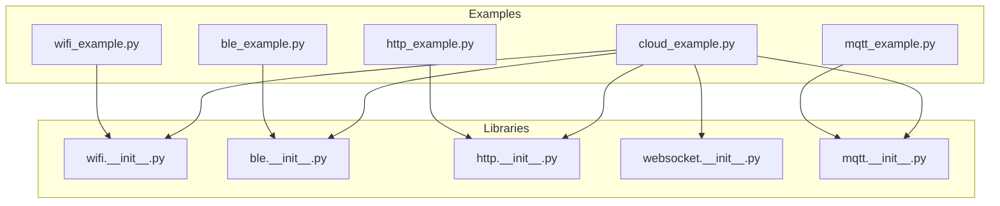
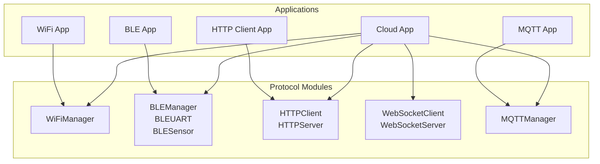
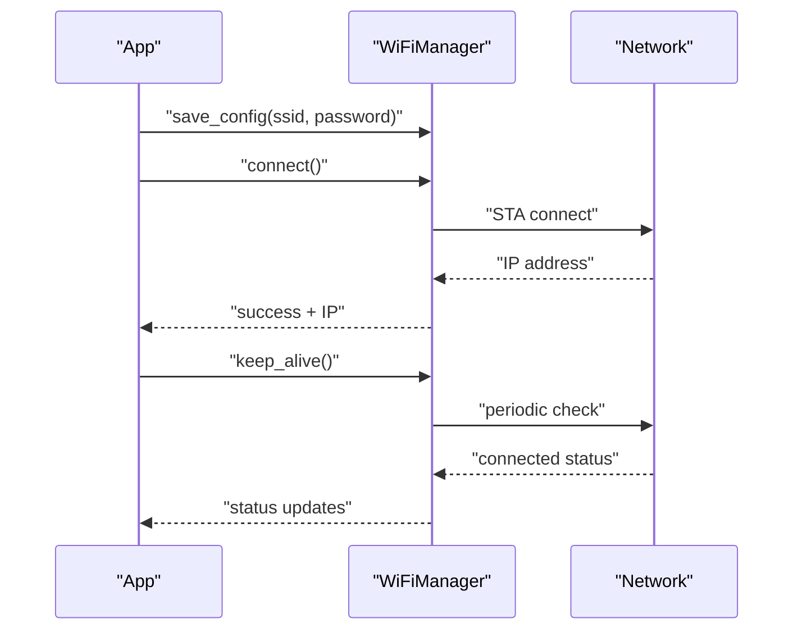
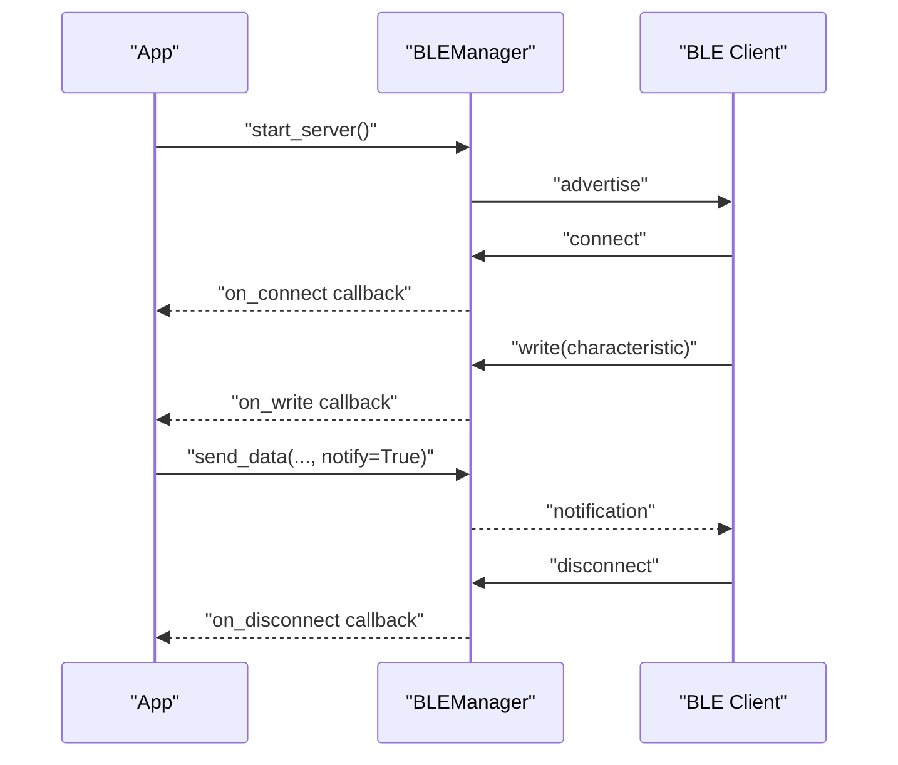
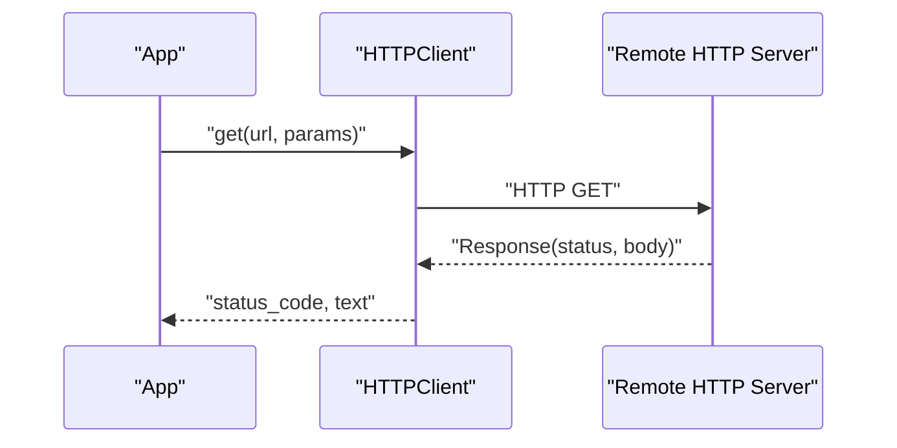
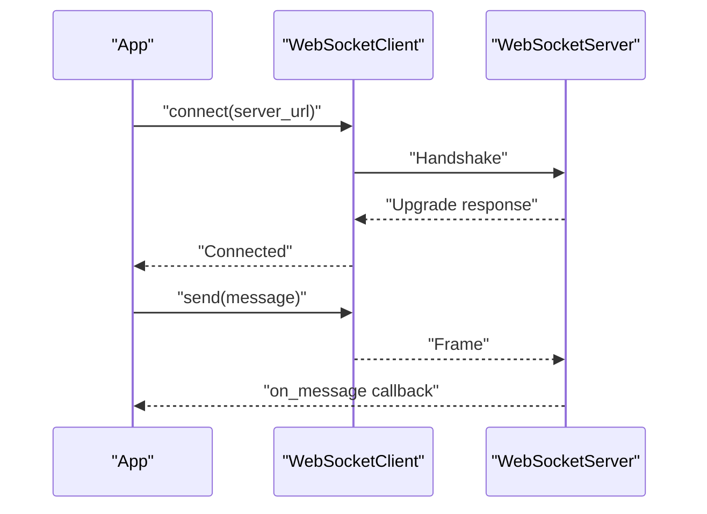
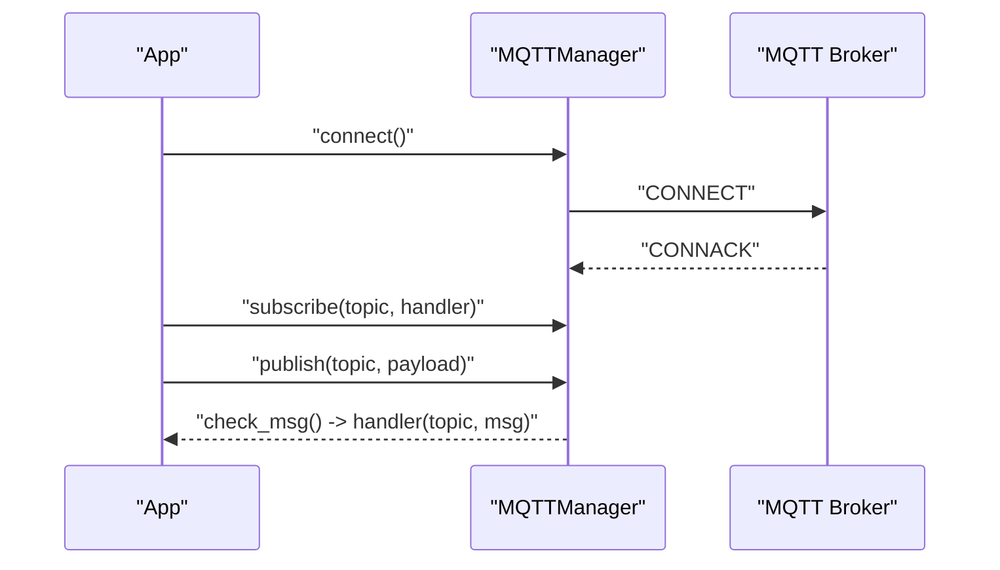
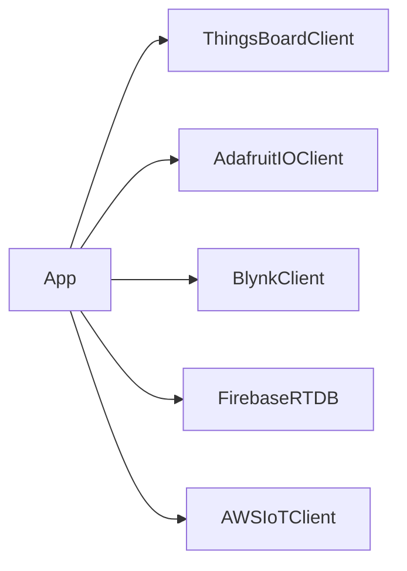
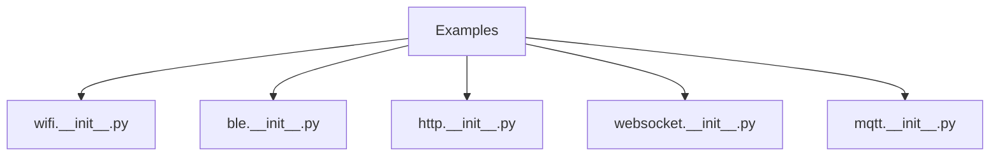

# Network & Communication

<cite>
**Referenced Files in This Document**
- [wifi_example.py](file://src/main/examples/wifi_example.py)
- [ble_example.py](file://src/main/examples/ble_example.py)
- [http_example.py](file://src/main/examples/http_example.py)
- [mqtt_example.py](file://src/main/examples/mqtt_example.py)
- [cloud_example.py](file://src/main/examples/cloud_example.py)
- [wifi.__init__.py](file://src/lib/wifi/__init__.py)
- [ble.__init__.py](file://src/lib/ble/__init__.py)
- [http.__init__.py](file://src/lib/http/__init__.py)
- [websocket.__init__.py](file://src/lib/websocket/__init__.py)
- [mqtt.__init__.py](file://src/lib/mqtt/__init__.py)
</cite>

## Table of Contents
1. [Introduction](#introduction)
2. [Project Structure](#project-structure)
3. [Core Components](#core-components)
4. [Architecture Overview](#architecture-overview)
5. [Detailed Component Analysis](#detailed-component-analysis)
6. [Dependency Analysis](#dependency-analysis)
7. [Performance Considerations](#performance-considerations)
8. [Troubleshooting Guide](#troubleshooting-guide)
9. [Conclusion](#conclusion)
10. [Appendices](#appendices)

## Introduction
This document provides comprehensive documentation for network and communication capabilities in the ESP32-C3 framework. It covers:
- WiFi management with the WiFiManager class for station (STA) and access point (AP) modes, plus a configuration portal
- Bluetooth Low Energy (BLE) communication with GATT server/client patterns and BLE UART
- HTTP client/server with REST API integration
- WebSocket communication aligned with RFC 6455 standards
- MQTT protocol support for client and server-like operation
- Cloud platform integrations including ThingsBoard, Adafruit IO, Blynk, Firebase, and AWS IoT Core

It also documents connection handling, authentication methods, data transfer patterns, security considerations, practical examples from the provided scripts, troubleshooting tips, performance optimization, and best practices for IoT connectivity.

## Project Structure
The framework organizes network-related functionality under the src/lib directory, with each protocol encapsulated in its own package. Example scripts in src/main/examples demonstrate usage patterns for WiFi, BLE, HTTP, MQTT, and cloud integrations.

**Diagram sources**
- [wifi_example.py:1-338](file://src/main/examples/wifi_example.py#L1-L338)
- [ble_example.py:1-408](file://src/main/examples/ble_example.py#L1-L408)
- [http_example.py:1-43](file://src/main/examples/http_example.py#L1-L43)
- [mqtt_example.py:1-40](file://src/main/examples/mqtt_example.py#L1-L40)
- [cloud_example.py:1-60](file://src/main/examples/cloud_example.py#L1-L60)
- [wifi.__init__.py:1-1](file://src/lib/wifi/__init__.py#L1-L1)
- [ble.__init__.py:1-1](file://src/lib/ble/__init__.py#L1-L1)
- [http.__init__.py:1-3](file://src/lib/http/__init__.py#L1-L3)
- [websocket.__init__.py:1-9](file://src/lib/websocket/__init__.py#L1-L9)
- [mqtt.__init__.py:1-2](file://src/lib/mqtt/__init__.py#L1-L2)

**Section sources**
- [wifi_example.py:1-338](file://src/main/examples/wifi_example.py#L1-L338)
- [ble_example.py:1-408](file://src/main/examples/ble_example.py#L1-L408)
- [http_example.py:1-43](file://src/main/examples/http_example.py#L1-L43)
- [mqtt_example.py:1-40](file://src/main/examples/mqtt_example.py#L1-L40)
- [cloud_example.py:1-60](file://src/main/examples/cloud_example.py#L1-L60)
- [wifi.__init__.py:1-1](file://src/lib/wifi/__init__.py#L1-L1)
- [ble.__init__.py:1-1](file://src/lib/ble/__init__.py#L1-L1)
- [http.__init__.py:1-3](file://src/lib/http/__init__.py#L1-L3)
- [websocket.__init__.py:1-9](file://src/lib/websocket/__init__.py#L1-L9)
- [mqtt.__init__.py:1-2](file://src/lib/mqtt/__init__.py#L1-L2)

## Core Components
- WiFi: WiFiManager supports saving/loading configurations, connecting to networks, scanning for networks, keep-alive monitoring, status reporting, and a configuration portal for AP-based setup.
- BLE: BLEManager provides GATT server functionality, callbacks for connect/disconnect/write/read events, and integrates with BLEUART and BLESensor for serial-like and sensor streaming use cases.
- HTTP: HTTPClient offers REST-style GET requests; HTTPServer is available for building web servers.
- WebSocket: WebSocketClient and WebSocketServer implement RFC 6455-compliant client and server functionality.
- MQTT: MQTTManager enables client-side publish/subscribe messaging with broker connections and message handling loops.
- Cloud: Cloud integrations are represented via imports for ThingsBoard, Adafruit IO, Blynk, Firebase Realtime Database, and AWS IoT Core clients.

Practical example references:
- WiFi examples: [wifi_example.py:14-337](file://src/main/examples/wifi_example.py#L14-L337)
- BLE examples: [ble_example.py:14-407](file://src/main/examples/ble_example.py#L14-L407)
- HTTP client example: [http_example.py:12-39](file://src/main/examples/http_example.py#L12-L39)
- MQTT example: [mqtt_example.py:12-36](file://src/main/examples/mqtt_example.py#L12-L36)
- Cloud integration placeholders: [cloud_example.py:15-56](file://src/main/examples/cloud_example.py#L15-L56)

**Section sources**
- [wifi_example.py:14-337](file://src/main/examples/wifi_example.py#L14-L337)
- [ble_example.py:14-407](file://src/main/examples/ble_example.py#L14-L407)
- [http_example.py:12-39](file://src/main/examples/http_example.py#L12-L39)
- [mqtt_example.py:12-36](file://src/main/examples/mqtt_example.py#L12-L36)
- [cloud_example.py:15-56](file://src/main/examples/cloud_example.py#L15-L56)
- [wifi.__init__.py:1-1](file://src/lib/wifi/__init__.py#L1-L1)
- [ble.__init__.py:1-1](file://src/lib/ble/__init__.py#L1-L1)
- [http.__init__.py:1-3](file://src/lib/http/__init__.py#L1-L3)
- [websocket.__init__.py:1-9](file://src/lib/websocket/__init__.py#L1-L9)
- [mqtt.__init__.py:1-2](file://src/lib/mqtt/__init__.py#L1-L2)

## Architecture Overview
The system follows a modular architecture where each protocol is self-contained under src/lib/<protocol>. Examples in src/main/examples demonstrate how to compose protocols for real-world IoT scenarios, such as BLE + WiFi coexistence, HTTP over WiFi, and MQTT telemetry.

**Diagram sources**
- [wifi_example.py:14-337](file://src/main/examples/wifi_example.py#L14-L337)
- [ble_example.py:14-407](file://src/main/examples/ble_example.py#L14-L407)
- [http_example.py:12-39](file://src/main/examples/http_example.py#L12-L39)
- [mqtt_example.py:12-36](file://src/main/examples/mqtt_example.py#L12-L36)
- [cloud_example.py:15-56](file://src/main/examples/cloud_example.py#L15-L56)
- [wifi.__init__.py:1-1](file://src/lib/wifi/__init__.py#L1-L1)
- [ble.__init__.py:1-1](file://src/lib/ble/__init__.py#L1-L1)
- [http.__init__.py:1-3](file://src/lib/http/__init__.py#L1-L3)
- [websocket.__init__.py:1-9](file://src/lib/websocket/__init__.py#L1-L9)
- [mqtt.__init__.py:1-2](file://src/lib/mqtt/__init__.py#L1-L2)

## Detailed Component Analysis

### WiFi Management (WiFiManager)
WiFiManager provides:
- Configuration persistence and loading
- Connection to STA networks with optional direct connect
- Keep-alive monitoring and periodic reconnection
- Network scanning and selection
- Status monitoring and connection info retrieval
- Configuration portal for AP-based setup

Key usage patterns:
- Basic connect and IP retrieval: [wifi_example.py:14-37](file://src/main/examples/wifi_example.py#L14-L37)
- Direct connect without saving config: [wifi_example.py:39-57](file://src/main/examples/wifi_example.py#L39-L57)
- Keep-alive mode with periodic checks: [wifi_example.py:59-90](file://src/main/examples/wifi_example.py#L59-L90)
- Scanning and connecting to a target network: [wifi_example.py:92-120](file://src/main/examples/wifi_example.py#L92-L120)
- Coexistence with other tasks and keep-alive: [wifi_example.py:122-180](file://src/main/examples/wifi_example.py#L122-L180)
- Multiple configs per device: [wifi_example.py:182-220](file://src/main/examples/wifi_example.py#L182-L220)
- WiFi + HTTP request: [wifi_example.py:222-264](file://src/main/examples/wifi_example.py#L222-L264)
- Status monitor loop: [wifi_example.py:266-302](file://src/main/examples/wifi_example.py#L266-L302)
- Configuration portal (AP mode): [wifi_example.py:304-337](file://src/main/examples/wifi_example.py#L304-L337)

**Diagram sources**
- [wifi_example.py:24-36](file://src/main/examples/wifi_example.py#L24-L36)
- [wifi_example.py:78-89](file://src/main/examples/wifi_example.py#L78-L89)
- [wifi_example.py:287-299](file://src/main/examples/wifi_example.py#L287-L299)

Security and best practices:
- Prefer saved configurations for production deployments
- Use keep-alive to maintain robust connectivity
- Implement status monitoring for proactive failure detection
- Use configuration portal for initial setup in field deployments

**Section sources**
- [wifi_example.py:14-337](file://src/main/examples/wifi_example.py#L14-L337)

### BLE Communication (GATT Server/Client, BLEUART, BLESensor)
BLEManager supports:
- Starting a GATT server with advertising
- Connection lifecycle callbacks (connect, disconnect, write, read)
- Sending notifications and indications
- Coexistence with WiFi for hybrid applications
- iBeacon advertising pattern
- Client-side scanning/connectivity patterns (placeholder)

BLEUART and BLESensor enable:
- UART-like serial communication over BLE
- Sensor data streaming with periodic updates

Key usage patterns:
- Basic GATT server: [ble_example.py:14-58](file://src/main/examples/ble_example.py#L14-L58)
- BLE UART echo: [ble_example.py:61-94](file://src/main/examples/ble_example.py#L61-L94)
- Sensor streaming: [ble_example.py:96-154](file://src/main/examples/ble_example.py#L96-L154)
- Callback-driven server: [ble_example.py:157-206](file://src/main/examples/ble_example.py#L157-L206)
- BLE + WiFi coexistence: [ble_example.py:208-278](file://src/main/examples/ble_example.py#L208-L278)
- LED control via BLE: [ble_example.py:280-338](file://src/main/examples/ble_example.py#L280-L338)
- iBeacon broadcasting: [ble_example.py:340-366](file://src/main/examples/ble_example.py#L340-L366)
- GATT client placeholder: [ble_example.py:368-394](file://src/main/examples/ble_example.py#L368-L394)

**Diagram sources**
- [ble_example.py:196-205](file://src/main/examples/ble_example.py#L196-L205)
- [ble_example.py:324-337](file://src/main/examples/ble_example.py#L324-L337)

Security and best practices:
- Use callbacks to enforce command validation and sanitization
- Implement connection keep-alive monitoring
- Limit notification frequency to reduce power consumption
- Consider pairing/authentication for sensitive environments

**Section sources**
- [ble_example.py:14-407](file://src/main/examples/ble_example.py#L14-L407)

### HTTP Client/Server and REST API Integration
HTTPClient demonstrates REST-style GET requests. HTTPServer is available for building web APIs and static content endpoints.

Key usage patterns:
- HTTP GET via HTTPClient: [http_example.py:12-19](file://src/main/examples/http_example.py#L12-L19)
- HTTPServer routing and handlers (commented): [http_example.py:22-34](file://src/main/examples/http_example.py#L22-L34)

**Diagram sources**
- [http_example.py:12-19](file://src/main/examples/http_example.py#L12-L19)

Security and best practices:
- Validate and sanitize request parameters
- Close responses to free resources
- Use HTTPS endpoints when possible
- Implement rate limiting and input validation on servers

**Section sources**
- [http_example.py:12-39](file://src/main/examples/http_example.py#L12-L39)

### WebSocket Communication (RFC 6455)
WebSocketClient and WebSocketServer provide RFC 6455-compliant client and server implementations. The module exports are available via websocket.__init__.py.

Usage patterns:
- Client and server imports: [websocket.__init__.py:7-8](file://src/lib/websocket/__init__.py#L7-L8)

**Diagram sources**
- [websocket.__init__.py:7-8](file://src/lib/websocket/__init__.py#L7-L8)

Security and best practices:
- Enforce origin validation on servers
- Use masking and secure contexts (wss) for production
- Implement heartbeat/ping-pong for reliability
- Validate frame sizes and close handshake handling

**Section sources**
- [websocket.__init__.py:1-9](file://src/lib/websocket/__init__.py#L1-L9)

### MQTT Protocol Support
MQTTManager provides client-side publish/subscribe functionality with a simple event loop.

Key usage patterns:
- Client instantiation, connect, subscribe, publish, and message loop: [mqtt_example.py:12-36](file://src/main/examples/mqtt_example.py#L12-L36)

**Diagram sources**
- [mqtt_example.py:12-36](file://src/main/examples/mqtt_example.py#L12-L36)

Security and best practices:
- Use TLS-enabled brokers for production
- Implement QoS appropriate to application needs
- Add retry/backoff for transient failures
- Validate topic names and payloads

**Section sources**
- [mqtt_example.py:12-36](file://src/main/examples/mqtt_example.py#L12-L36)

### Cloud Platform Integrations
Cloud integrations are represented by imports for:
- ThingsBoardClient
- AdafruitIOClient
- BlynkClient
- FirebaseRTDB
- AWSIoTClient

Example placeholders:
- ThingsBoard, Adafruit IO, Blynk, Firebase, AWS IoT Core: [cloud_example.py:15-56](file://src/main/examples/cloud_example.py#L15-L56)

**Diagram sources**
- [cloud_example.py:8-12](file://src/main/examples/cloud_example.py#L8-L12)
- [cloud_example.py:15-56](file://src/main/examples/cloud_example.py#L15-L56)

Security and best practices:
- Store credentials securely (e.g., encrypted storage or environment variables)
- Use device-specific tokens and scoped permissions
- Implement offline buffering and retry strategies
- Observe platform-specific rate limits and quotas

**Section sources**
- [cloud_example.py:15-56](file://src/main/examples/cloud_example.py#L15-L56)

## Dependency Analysis
The libraries expose clean entry points for consumers. The examples depend on these modules to demonstrate end-to-end workflows.

**Diagram sources**
- [wifi_example.py](file://src/main/examples/wifi_example.py#L10)
- [ble_example.py](file://src/main/examples/ble_example.py#L10)
- [http_example.py](file://src/main/examples/http_example.py#L8)
- [mqtt_example.py](file://src/main/examples/mqtt_example.py#L9)
- [wifi.__init__.py:1-1](file://src/lib/wifi/__init__.py#L1-L1)
- [ble.__init__.py:1-1](file://src/lib/ble/__init__.py#L1-L1)
- [http.__init__.py:1-3](file://src/lib/http/__init__.py#L1-L3)
- [websocket.__init__.py:1-9](file://src/lib/websocket/__init__.py#L1-L9)
- [mqtt.__init__.py:1-2](file://src/lib/mqtt/__init__.py#L1-L2)

**Section sources**
- [wifi_example.py](file://src/main/examples/wifi_example.py#L10)
- [ble_example.py](file://src/main/examples/ble_example.py#L10)
- [http_example.py](file://src/main/examples/http_example.py#L8)
- [mqtt_example.py](file://src/main/examples/mqtt_example.py#L9)
- [wifi.__init__.py:1-1](file://src/lib/wifi/__init__.py#L1-L1)
- [ble.__init__.py:1-1](file://src/lib/ble/__init__.py#L1-L1)
- [http.__init__.py:1-3](file://src/lib/http/__init__.py#L1-L3)
- [websocket.__init__.py:1-9](file://src/lib/websocket/__init__.py#L1-L9)
- [mqtt.__init__.py:1-2](file://src/lib/mqtt/__init__.py#L1-L2)

## Performance Considerations
- WiFi
  - Use keep-alive to detect and recover from dropped connections proactively
  - Minimize blocking operations during scans and connects
  - Batch configuration saves to reduce flash wear
- BLE
  - Tune advertising intervals to balance discoverability and power
  - Throttle notifications to avoid overwhelming clients
  - Use non-blocking asyncio patterns for concurrent tasks
- HTTP
  - Reuse sessions and connections when possible
  - Close responses promptly to free buffers
- WebSocket
  - Implement ping/pong for liveness and resource cleanup
  - Validate and cap frame sizes to prevent memory pressure
- MQTT
  - Choose appropriate QoS levels for your use case
  - Back off on reconnection attempts to avoid flooding the broker
- Cloud
  - Buffer telemetry locally and send in batches
  - Implement exponential backoff for retries

## Troubleshooting Guide
- WiFi
  - Verify SSID/password correctness and signal strength
  - Check configuration file path and permissions
  - Use status monitor to confirm IP acquisition and gateway reachability
  - Use configuration portal for AP-based setup when STA fails
- BLE
  - Confirm device name uniqueness and advertising interval
  - Validate characteristic permissions and descriptors
  - Inspect callbacks for malformed writes or missing decode paths
- HTTP
  - Ensure endpoint availability and correct URL construction
  - Check response status and handle exceptions gracefully
- WebSocket
  - Validate handshake headers and subprotocols
  - Implement proper close frames and error handling
- MQTT
  - Confirm broker reachability and credentials
  - Subscribe to debug topics if available
  - Verify topic filters and message routing
- Cloud
  - Validate tokens and device registration
  - Check network ACLs and firewall rules
  - Review platform-specific quotas and limits

## Conclusion
The ESP32-C3 framework provides a cohesive set of modules for network and communication, with clear examples demonstrating practical IoT scenarios. By combining WiFi, BLE, HTTP/WebSocket, MQTT, and cloud clients, developers can build robust, secure, and efficient IoT solutions. Following the best practices and troubleshooting guidance outlined here will help ensure reliable connectivity and optimal performance across diverse deployment environments.

## Appendices
- Practical example references:
  - WiFi: [wifi_example.py:14-337](file://src/main/examples/wifi_example.py#L14-L337)
  - BLE: [ble_example.py:14-407](file://src/main/examples/ble_example.py#L14-L407)
  - HTTP: [http_example.py:12-39](file://src/main/examples/http_example.py#L12-L39)
  - MQTT: [mqtt_example.py:12-36](file://src/main/examples/mqtt_example.py#L12-L36)
  - Cloud: [cloud_example.py:15-56](file://src/main/examples/cloud_example.py#L15-L56)