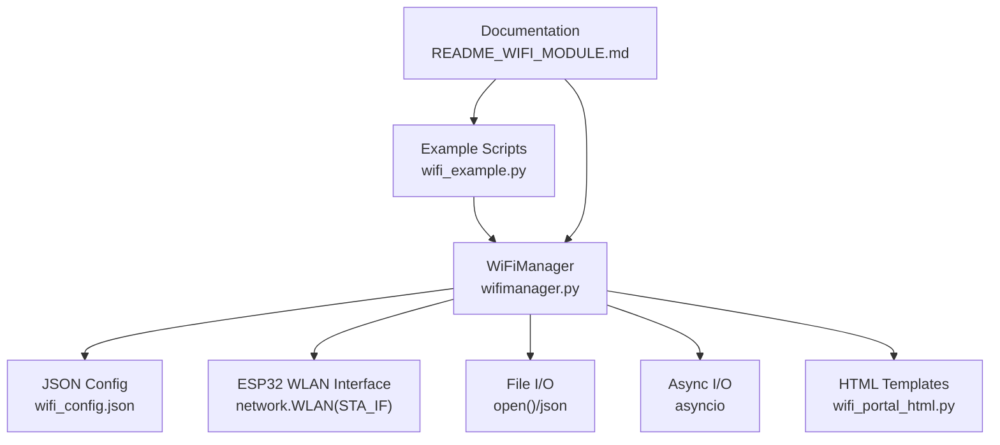
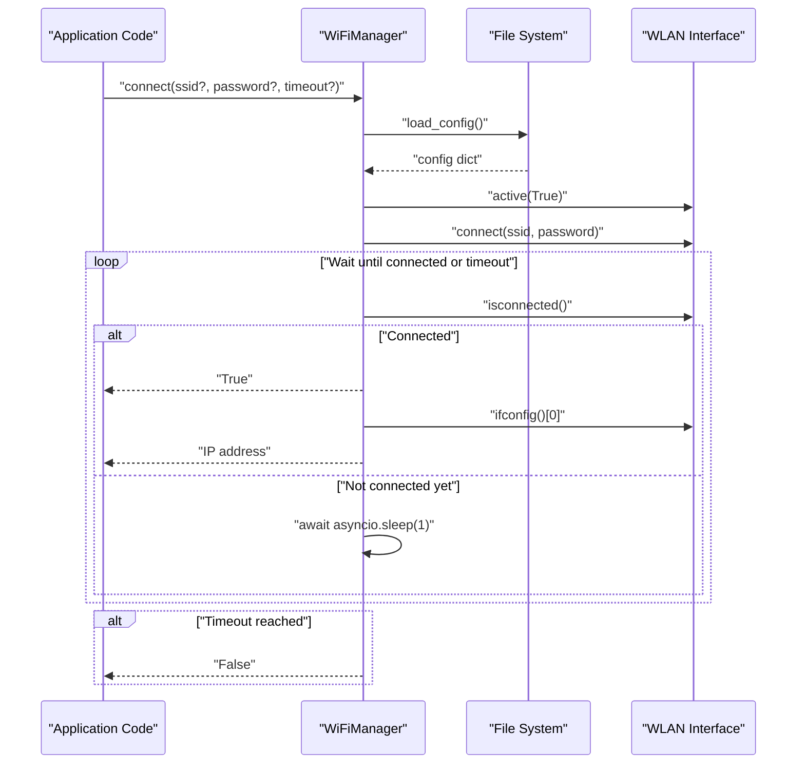
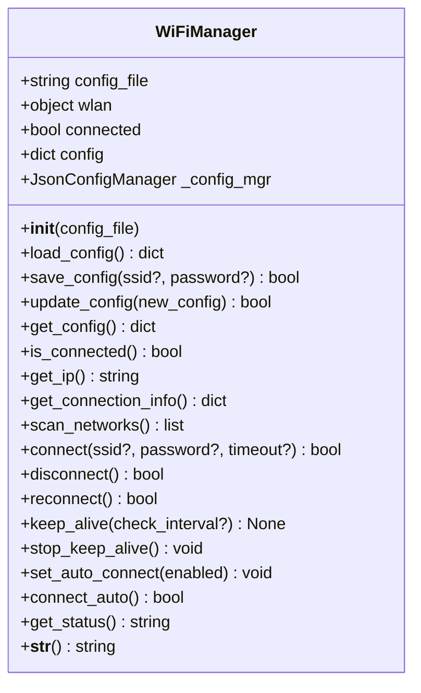
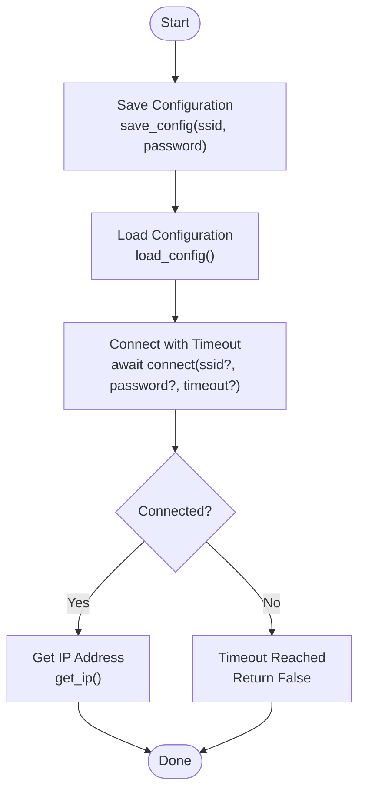
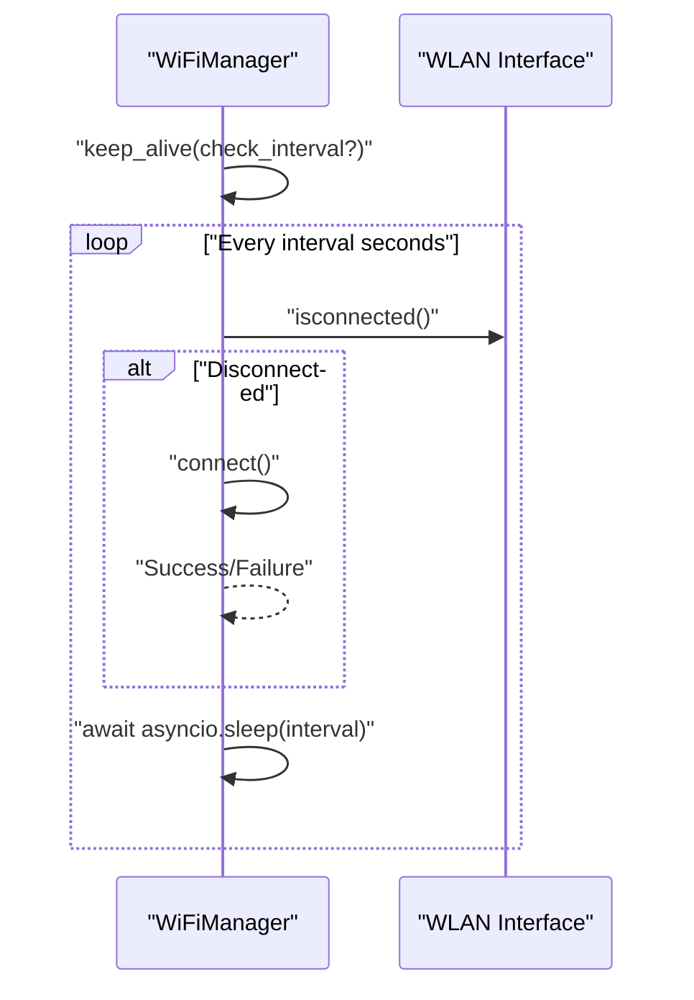
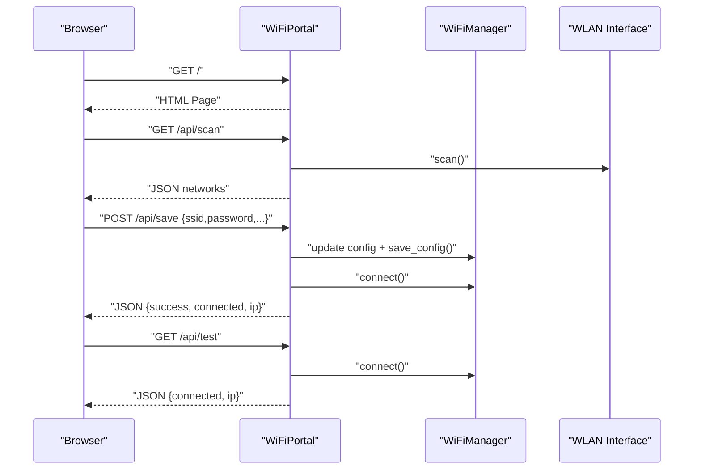
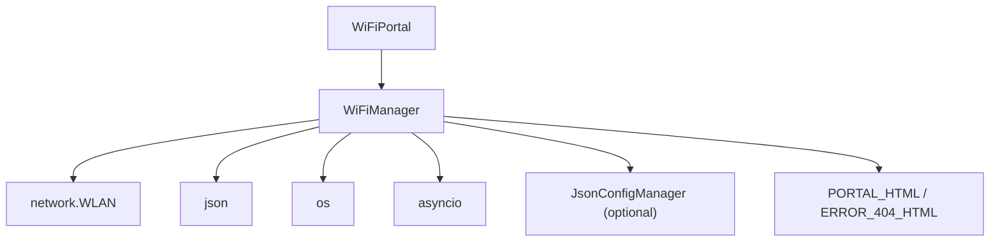

# Basic WiFi Connection

<cite>
**Referenced Files in This Document**
- [wifimanager.py](file://src/lib/wifi/wifimanager.py)
- [wifi_example.py](file://src/main/examples/wifi_example.py)
- [README_WIFI_MODULE.md](file://src/main/README_WIFI_MODULE.md)
- [wifi_portal_html.py](file://src/lib/wifi/wifi_portal_html.py)
</cite>

## Table of Contents
1. [Introduction](#introduction)
2. [Project Structure](#project-structure)
3. [Core Components](#core-components)
4. [Architecture Overview](#architecture-overview)
5. [Detailed Component Analysis](#detailed-component-analysis)
6. [Dependency Analysis](#dependency-analysis)
7. [Performance Considerations](#performance-considerations)
8. [Troubleshooting Guide](#troubleshooting-guide)
9. [Conclusion](#conclusion)
10. [Appendices](#appendices)

## Introduction
This document explains how to manage basic WiFi connections using the WiFiManager class in an ESP32-C3 environment. It covers the complete connection workflow: configuration loading from JSON files, establishing connections with timeout handling, retrieving IP addresses, and monitoring connection status. It also documents constructor parameters, configuration file management, and automatic reconnection capabilities. Practical examples from wifi_example.py demonstrate typical connection scenarios, configuration persistence, and troubleshooting steps. The guide explains async/await patterns for non-blocking operations, timeout mechanisms, and best practices for reliable WiFi connectivity in IoT applications.

## Project Structure
The WiFi functionality is implemented in a dedicated module with supporting example scripts and documentation. The key files involved in basic WiFi connection management are:
- WiFiManager implementation and WiFi Portal server
- Example scripts demonstrating various connection scenarios
- Documentation describing configuration options and API usage
- Embedded HTML templates for the WiFi configuration portal

**Diagram sources**
- [wifimanager.py:44-56](file://src/lib/wifi/wifimanager.py#L44-L56)
- [wifimanager.py:64-84](file://src/lib/wifi/wifimanager.py#L64-L84)
- [wifimanager.py:226-291](file://src/lib/wifi/wifimanager.py#L226-L291)
- [wifi_example.py:13-37](file://src/main/examples/wifi_example.py#L13-L37)
- [README_WIFI_MODULE.md:135-270](file://src/main/README_WIFI_MODULE.md#L135-L270)
- [wifi_portal_html.py:6](file://src/lib/wifi/wifi_portal_html.py#L6)

**Section sources**
- [wifimanager.py:18-36](file://src/lib/wifi/wifimanager.py#L18-L36)
- [wifi_example.py:13-37](file://src/main/examples/wifi_example.py#L13-L37)
- [README_WIFI_MODULE.md:1-470](file://src/main/README_WIFI_MODULE.md#L1-L470)

## Core Components
- WiFiManager: Central class for managing WiFi connections, configuration persistence, scanning, connecting, disconnecting, reconnecting, keep-alive monitoring, and status reporting.
- WiFiPortal: Optional web-based configuration portal that runs an HTTP server to configure WiFi via a browser.
- Configuration Management: JSON-based configuration stored on-device with support for default values and optional centralized configuration manager.
- Async Operations: Non-blocking operations using asyncio for scanning, connecting, keep-alive loops, and HTTP server handling.

Key responsibilities:
- Load and save configuration from/to JSON files
- Establish STA-mode connections with configurable timeouts
- Retrieve IP and connection metadata
- Monitor and maintain connectivity with periodic checks
- Provide status information for diagnostics

**Section sources**
- [wifimanager.py:38-397](file://src/lib/wifi/wifimanager.py#L38-L397)
- [wifimanager.py:478-791](file://src/lib/wifi/wifimanager.py#L478-L791)
- [README_WIFI_MODULE.md:135-270](file://src/main/README_WIFI_MODULE.md#L135-L270)

## Architecture Overview
The WiFiManager orchestrates the entire connection lifecycle. It interacts with the ESP32’s WLAN interface, manages configuration persistence, and exposes async APIs for scanning, connecting, and monitoring. The WiFiPortal extends this by offering a web UI to configure WiFi without hardcoding credentials.

**Diagram sources**
- [wifimanager.py:226-291](file://src/lib/wifi/wifimanager.py#L226-L291)
- [wifimanager.py:57-84](file://src/lib/wifi/wifimanager.py#L57-L84)
- [wifimanager.py:158-167](file://src/lib/wifi/wifimanager.py#L158-L167)

## Detailed Component Analysis

### WiFiManager Class
The WiFiManager class encapsulates all WiFi-related operations:
- Constructor: Initializes configuration file path, WLAN interface, connection state, and optional configuration manager.
- Configuration Management: Load, save, update, and retrieve configuration with defaults.
- Connection Lifecycle: Connect with timeout, disconnect, reconnect, and auto-connect based on configuration.
- Monitoring: Keep-alive mode with configurable intervals and status reporting.
- Information Retrieval: IP address, full connection info, and human-readable status.

**Diagram sources**
- [wifimanager.py:44-56](file://src/lib/wifi/wifimanager.py#L44-L56)
- [wifimanager.py:57-84](file://src/lib/wifi/wifimanager.py#L57-L84)
- [wifimanager.py:86-138](file://src/lib/wifi/wifimanager.py#L86-L138)
- [wifimanager.py:149-190](file://src/lib/wifi/wifimanager.py#L149-L190)
- [wifimanager.py:192-224](file://src/lib/wifi/wifimanager.py#L192-L224)
- [wifimanager.py:226-291](file://src/lib/wifi/wifimanager.py#L226-L291)
- [wifimanager.py:293-316](file://src/lib/wifi/wifimanager.py#L293-L316)
- [wifimanager.py:307-316](file://src/lib/wifi/wifimanager.py#L307-L316)
- [wifimanager.py:318-349](file://src/lib/wifi/wifimanager.py#L318-L349)
- [wifimanager.py:344-349](file://src/lib/wifi/wifimanager.py#L344-L349)
- [wifimanager.py:351-374](file://src/lib/wifi/wifimanager.py#L351-L374)
- [wifimanager.py:376-396](file://src/lib/wifi/wifimanager.py#L376-L396)

**Section sources**
- [wifimanager.py:38-397](file://src/lib/wifi/wifimanager.py#L38-L397)

### WiFi Configuration Workflow
The typical workflow involves saving configuration, loading it, and connecting with optional timeout handling. The class supports both persistent configuration and ad-hoc connection parameters.

**Diagram sources**
- [wifimanager.py:86-138](file://src/lib/wifi/wifimanager.py#L86-L138)
- [wifimanager.py:57-84](file://src/lib/wifi/wifimanager.py#L57-L84)
- [wifimanager.py:226-291](file://src/lib/wifi/wifimanager.py#L226-L291)
- [wifimanager.py:158-167](file://src/lib/wifi/wifimanager.py#L158-L167)

**Section sources**
- [wifimanager.py:86-138](file://src/lib/wifi/wifimanager.py#L86-L138)
- [wifimanager.py:57-84](file://src/lib/wifi/wifimanager.py#L57-L84)
- [wifimanager.py:226-291](file://src/lib/wifi/wifimanager.py#L226-L291)
- [wifimanager.py:158-167](file://src/lib/wifi/wifimanager.py#L158-L167)

### Keep-Alive Mode and Automatic Reconnection
Keep-alive mode periodically checks connection status and attempts to reconnect if the device becomes disconnected. The interval is configurable via configuration options.

**Diagram sources**
- [wifimanager.py:318-349](file://src/lib/wifi/wifimanager.py#L318-L349)

**Section sources**
- [wifimanager.py:318-349](file://src/lib/wifi/wifimanager.py#L318-L349)

### WiFi Portal (Web Configuration)
The WiFiPortal class provides a web-based configuration interface. It starts an AP, serves an HTML page, and exposes REST-like endpoints to scan networks, save configuration, and test connectivity.

**Diagram sources**
- [wifimanager.py:478-791](file://src/lib/wifi/wifimanager.py#L478-L791)
- [wifimanager.py:635-720](file://src/lib/wifi/wifimanager.py#L635-L720)

**Section sources**
- [wifimanager.py:478-791](file://src/lib/wifi/wifimanager.py#L478-L791)
- [wifi_portal_html.py:6](file://src/lib/wifi/wifi_portal_html.py#L6)

### Practical Examples from wifi_example.py
The example script demonstrates multiple scenarios:
- Basic connection with configuration persistence
- Direct connection without saving configuration
- Keep-alive mode with periodic status updates
- Scanning networks and connecting to a target
- Running WiFi alongside other async tasks
- Managing multiple configuration files
- Combining WiFi with HTTP requests
- Continuous status monitoring
- Using the WiFi Portal for configuration

These examples illustrate real-world usage patterns and help validate the WiFiManager API.

**Section sources**
- [wifi_example.py:13-37](file://src/main/examples/wifi_example.py#L13-L37)
- [wifi_example.py:39-57](file://src/main/examples/wifi_example.py#L39-L57)
- [wifi_example.py:59-90](file://src/main/examples/wifi_example.py#L59-L90)
- [wifi_example.py:92-120](file://src/main/examples/wifi_example.py#L92-L120)
- [wifi_example.py:122-180](file://src/main/examples/wifi_example.py#L122-L180)
- [wifi_example.py:182-220](file://src/main/examples/wifi_example.py#L182-L220)
- [wifi_example.py:222-264](file://src/main/examples/wifi_example.py#L222-L264)
- [wifi_example.py:266-302](file://src/main/examples/wifi_example.py#L266-L302)
- [wifi_example.py:304-338](file://src/main/examples/wifi_example.py#L304-L338)

## Dependency Analysis
The WiFiManager depends on:
- ESP32 networking APIs for STA/AP modes and interface configuration
- File system for JSON configuration persistence
- Async I/O for non-blocking operations
- Optional centralized configuration manager for configuration handling
- WiFiPortal for embedded web UI and HTTP endpoints

**Diagram sources**
- [wifimanager.py:18-36](file://src/lib/wifi/wifimanager.py#L18-L36)
- [wifimanager.py:44-56](file://src/lib/wifi/wifimanager.py#L44-L56)
- [wifimanager.py:478-791](file://src/lib/wifi/wifimanager.py#L478-L791)
- [wifi_portal_html.py:6](file://src/lib/wifi/wifi_portal_html.py#L6)

**Section sources**
- [wifimanager.py:18-36](file://src/lib/wifi/wifimanager.py#L18-L36)
- [wifimanager.py:44-56](file://src/lib/wifi/wifimanager.py#L44-L56)
- [wifimanager.py:478-791](file://src/lib/wifi/wifimanager.py#L478-L791)

## Performance Considerations
- Use keep-alive mode with reasonable intervals to balance reliability and power consumption.
- Increase timeout values for environments with slow routers or weak signals.
- Prefer scanning before connecting to avoid unnecessary connection attempts.
- Limit concurrent tasks to prevent resource contention on constrained devices.
- Use the WiFi Portal sparingly, as it consumes additional memory and CPU.

[No sources needed since this section provides general guidance]

## Troubleshooting Guide
Common issues and resolutions:
- Cannot connect to WiFi: Verify SSID/password, router availability, and increase timeout.
- Configuration not saved: Check filesystem permissions and available storage.
- Keep-alive not working: Ensure the keep-alive loop is started and the interval is set appropriately.
- Portal not opening: Confirm sufficient memory, AP mode support, and correct IP access.
- Cannot access portal web page: Ensure connection to the AP and correct IP address.

**Section sources**
- [README_WIFI_MODULE.md:438-462](file://src/main/README_WIFI_MODULE.md#L438-L462)

## Conclusion
The WiFiManager class provides a robust, async-friendly foundation for managing WiFi connections on ESP32-C3. It supports persistent configuration, flexible connection parameters, timeout handling, continuous monitoring, and optional web-based configuration. The included examples and documentation enable developers to implement reliable WiFi connectivity in IoT applications with minimal boilerplate.

[No sources needed since this section summarizes without analyzing specific files]

## Appendices

### API Reference Summary
- Constructor: WiFiManager(config_file="wifi_config.json")
- Configuration: load_config(), save_config(ssid=None, password=None), update_config(new_config), get_config()
- Connection: is_connected(), get_ip(), get_connection_info(), await scan_networks(), await connect(ssid=None, password=None, timeout=None), await disconnect(), await reconnect(), await connect_auto()
- Monitoring: await keep_alive(check_interval=None), stop_keep_alive(), set_auto_connect(enabled=True), get_status()

**Section sources**
- [README_WIFI_MODULE.md:163-270](file://src/main/README_WIFI_MODULE.md#L163-L270)