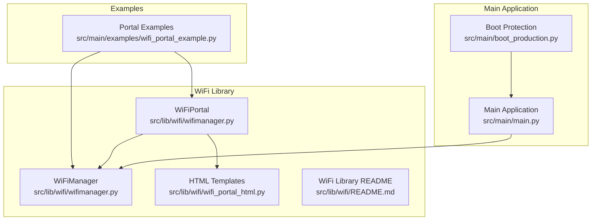
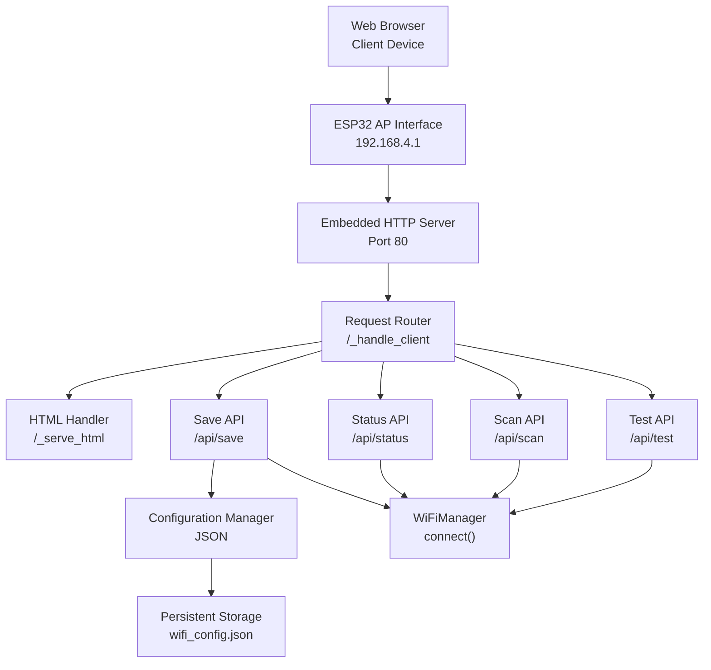
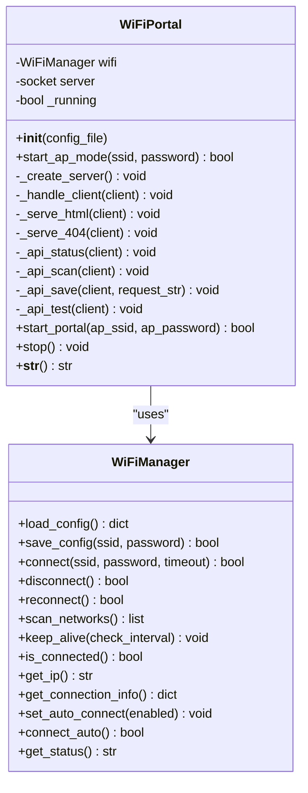
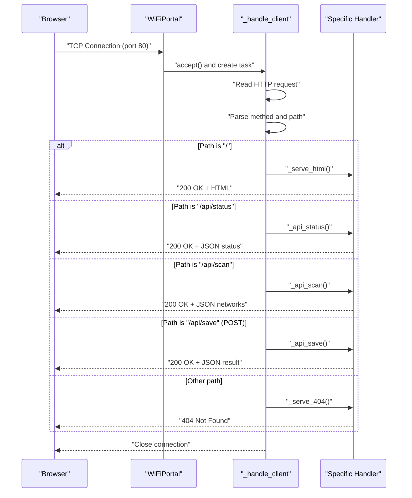
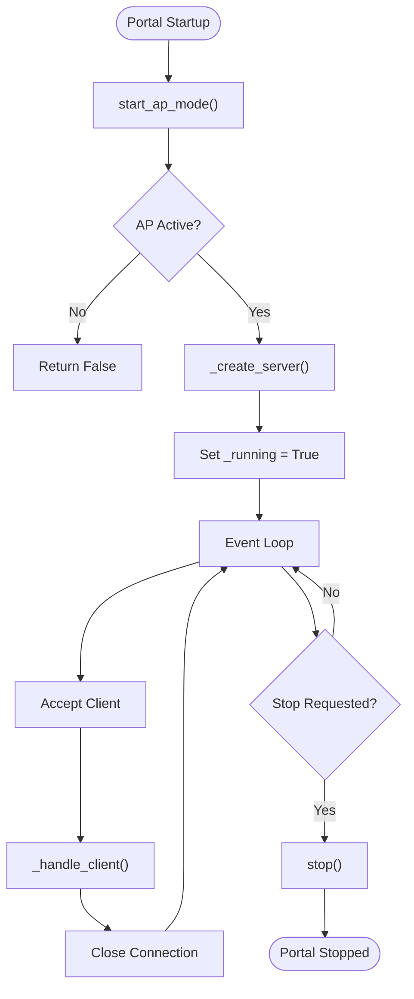
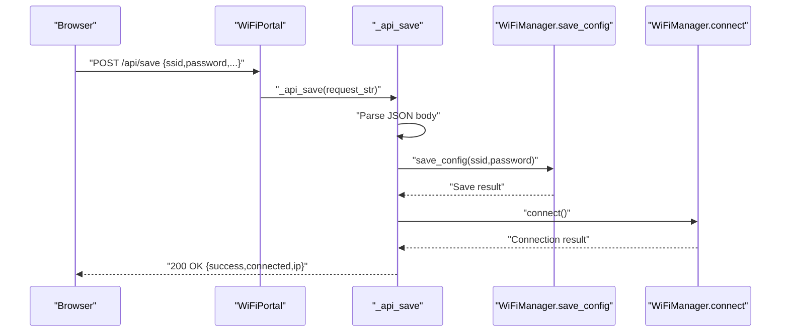
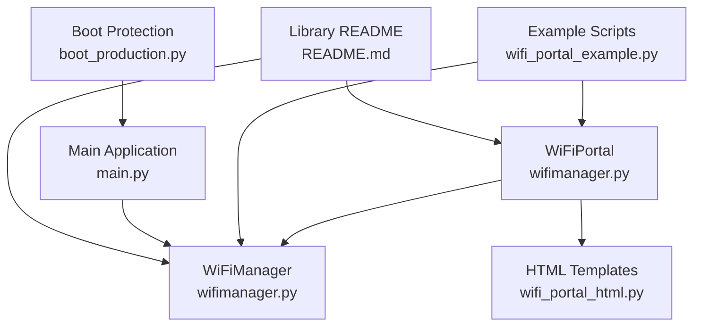

# WiFi Configuration Portal

<cite>
**Referenced Files in This Document**
- [wifimanager.py](file://src/lib/wifi/wifimanager.py)
- [wifi_portal_html.py](file://src/lib/wifi/wifi_portal_html.py)
- [wifi_portal_example.py](file://src/main/examples/wifi_portal_example.py)
- [README.md](file://src/lib/wifi/README.md)
- [main.py](file://src/main/main.py)
- [boot_production.py](file://src/main/boot_production.py)
</cite>

## Table of Contents
1. [Introduction](#introduction)
2. [Project Structure](#project-structure)
3. [Core Components](#core-components)
4. [Architecture Overview](#architecture-overview)
5. [Detailed Component Analysis](#detailed-component-analysis)
6. [Dependency Analysis](#dependency-analysis)
7. [Performance Considerations](#performance-considerations)
8. [Troubleshooting Guide](#troubleshooting-guide)
9. [Security Considerations](#security-considerations)
10. [Best Practices](#best-practices)
11. [Conclusion](#conclusion)

## Introduction
This document provides comprehensive technical documentation for the WiFi configuration portal system designed for ESP32-C3 devices. The portal enables web-based WiFi setup through an Access Point (AP) mode, serving a responsive HTML interface and exposing REST-like API endpoints for status reporting, network scanning, and configuration saving. It integrates tightly with the WiFiManager class to manage persistent configuration, automatic reconnection, and keep-alive monitoring.

The portal supports:
- AP mode creation with configurable SSID and password
- Embedded HTTP server handling static HTML and API routes
- Real-time WiFi scanning and selection via the web interface
- Secure configuration persistence and immediate connection attempts
- Integration with WiFiManager for seamless STA mode connectivity

## Project Structure
The WiFi portal system resides primarily in the WiFi library module and is demonstrated through example scripts and documentation.

**Diagram sources**
- [wifimanager.py:477-791](file://src/lib/wifi/wifimanager.py#L477-L791)
- [wifi_portal_html.py:1-548](file://src/lib/wifi/wifi_portal_html.py#L1-L548)
- [wifi_portal_example.py:1-350](file://src/main/examples/wifi_portal_example.py#L1-L350)
- [README.md:1-226](file://src/lib/wifi/README.md#L1-L226)
- [main.py:1-84](file://src/main/main.py#L1-L84)
- [boot_production.py:1-56](file://src/main/boot_production.py#L1-L56)

**Section sources**
- [wifimanager.py:1-800](file://src/lib/wifi/wifimanager.py#L1-L800)
- [wifi_portal_html.py:1-548](file://src/lib/wifi/wifi_portal_html.py#L1-L548)
- [wifi_portal_example.py:1-350](file://src/main/examples/wifi_portal_example.py#L1-L350)
- [README.md:1-226](file://src/lib/wifi/README.md#L1-L226)
- [main.py:1-84](file://src/main/main.py#L1-L84)
- [boot_production.py:1-56](file://src/main/boot_production.py#L1-L56)

## Core Components
This section documents the primary classes and their responsibilities within the portal system.

- WiFiManager: Handles STA mode connectivity, configuration persistence, network scanning, and keep-alive monitoring.
- WiFiPortal: Creates AP mode, serves the HTML interface, exposes API endpoints, and manages client requests.

Key responsibilities:
- WiFiManager
  - Load/save configuration from JSON
  - Connect/disconnect/reconnect to WiFi networks
  - Scan nearby networks and report metadata
  - Keep-alive monitoring with configurable intervals
  - Provide connection status and IP information
- WiFiPortal
  - Initialize AP mode with SSID/password
  - Create and run an embedded HTTP server
  - Route requests to handlers for HTML and APIs
  - Serve the captive portal HTML and 404 pages
  - Manage portal lifecycle (start/stop)

**Section sources**
- [wifimanager.py:38-397](file://src/lib/wifi/wifimanager.py#L38-L397)
- [wifimanager.py:477-791](file://src/lib/wifi/wifimanager.py#L477-L791)

## Architecture Overview
The portal architecture combines AP mode networking, an embedded HTTP server, and a responsive web interface. The system follows a request-response pattern where client browsers interact with the embedded server to configure WiFi credentials and trigger connections.

**Diagram sources**
- [wifimanager.py:546-721](file://src/lib/wifi/wifimanager.py#L546-L721)
- [wifi_portal_html.py:6-534](file://src/lib/wifi/wifi_portal_html.py#L6-L534)

**Section sources**
- [wifimanager.py:533-721](file://src/lib/wifi/wifimanager.py#L533-L721)
- [wifi_portal_html.py:6-534](file://src/lib/wifi/wifi_portal_html.py#L6-L534)

## Detailed Component Analysis

### WiFiPortal Class Implementation
The WiFiPortal class encapsulates the entire portal functionality, including AP mode initialization, HTTP server creation, and request routing.

**Diagram sources**
- [wifimanager.py:477-791](file://src/lib/wifi/wifimanager.py#L477-L791)
- [wifimanager.py:38-397](file://src/lib/wifi/wifimanager.py#L38-L397)

Implementation highlights:
- AP mode creation validates password length and activates the AP interface with WPA/WPA2 authentication.
- HTTP server binding to port 80 with non-blocking socket configuration.
- Request routing handles index HTML, status, scan, save, and test endpoints.
- Asynchronous client handling ensures concurrent request processing.

**Section sources**
- [wifimanager.py:495-545](file://src/lib/wifi/wifimanager.py#L495-L545)
- [wifimanager.py:546-721](file://src/lib/wifi/wifimanager.py#L546-L721)
- [wifimanager.py:722-791](file://src/lib/wifi/wifimanager.py#L722-L791)

### HTTP Server Functionality and Request Handling
The portal implements a lightweight HTTP server to serve the HTML interface and handle API requests. The server accepts connections, parses HTTP requests, and dispatches to appropriate handlers.

**Diagram sources**
- [wifimanager.py:546-598](file://src/lib/wifi/wifimanager.py#L546-L598)

**Section sources**
- [wifimanager.py:533-598](file://src/lib/wifi/wifimanager.py#L533-L598)

### Web Interface Management
The portal serves a responsive HTML interface containing:
- Status bar indicating current connection state
- WiFi network selection with live scanning
- Advanced configuration options (auto-connect, reconnect, timeouts)
- Real-time feedback and loading indicators
- JavaScript-driven interactions with API endpoints

The interface dynamically updates based on API responses and provides user-friendly controls for network selection and configuration.

**Section sources**
- [wifi_portal_html.py:6-534](file://src/lib/wifi/wifi_portal_html.py#L6-L534)

### API Endpoints
The portal exposes several API endpoints for programmatic control and status reporting:

- GET /api/status
  - Returns current connection status, IP address, and configured SSID
- GET /api/scan
  - Scans and returns nearby WiFi networks with signal strength, channel, and security status
- POST /api/save
  - Accepts JSON payload with SSID, password, and advanced options; saves configuration and attempts connection
- GET /api/test
  - Tests current connection without changing configuration

Each endpoint returns appropriate HTTP status codes and JSON responses for client-side consumption.

**Section sources**
- [wifimanager.py:621-721](file://src/lib/wifi/wifimanager.py#L621-L721)

### Real-Time Configuration Management
The portal integrates with WiFiManager to provide real-time configuration management:
- Live status updates reflect current connection state
- Network scanning leverages WiFiManager's scanning capabilities
- Configuration persistence uses JSON files with automatic defaults
- Keep-alive monitoring ensures robust connectivity after initial setup

**Section sources**
- [wifimanager.py:57-126](file://src/lib/wifi/wifimanager.py#L57-L126)
- [wifimanager.py:192-224](file://src/lib/wifi/wifimanager.py#L192-L224)
- [wifimanager.py:318-349](file://src/lib/wifi/wifimanager.py#L318-L349)

## Detailed Component Analysis

### WiFiPortal Class Analysis
The WiFiPortal class orchestrates the entire portal lifecycle, from AP activation to HTTP server operation and client request handling.

Key methods and behaviors:
- start_ap_mode: Initializes AP interface with provided credentials and validates activation
- _create_server: Sets up socket server bound to port 80 with non-blocking I/O
- _handle_client: Parses incoming HTTP requests and routes to appropriate handlers
- start_portal: Coordinates AP startup, server creation, and continuous client handling
- stop: Gracefully shuts down server and deactivates AP

**Diagram sources**
- [wifimanager.py:495-545](file://src/lib/wifi/wifimanager.py#L495-L545)
- [wifimanager.py:722-791](file://src/lib/wifi/wifimanager.py#L722-L791)

**Section sources**
- [wifimanager.py:477-791](file://src/lib/wifi/wifimanager.py#L477-L791)

### API Workflow Analysis
The API workflow demonstrates how client requests are processed and responded to, particularly focusing on the save endpoint which triggers configuration changes and connection attempts.

**Diagram sources**
- [wifimanager.py:661-707](file://src/lib/wifi/wifimanager.py#L661-L707)

**Section sources**
- [wifimanager.py:661-707](file://src/lib/wifi/wifimanager.py#L661-L707)

### HTML Interface Components
The HTML interface is structured with semantic elements and CSS styling to provide an intuitive user experience. It includes:
- Status bar with dynamic state indication
- Network scanning and selection UI
- Form controls for SSID/password and advanced options
- Loading indicators and message areas
- Responsive design optimized for mobile devices

The interface communicates with backend APIs through JavaScript fetch operations, enabling real-time updates without page reloads.

**Section sources**
- [wifi_portal_html.py:6-534](file://src/lib/wifi/wifi_portal_html.py#L6-L534)

## Dependency Analysis
The portal system exhibits clear separation of concerns with well-defined dependencies between components.

**Diagram sources**
- [wifimanager.py:477-791](file://src/lib/wifi/wifimanager.py#L477-L791)
- [wifi_portal_html.py:1-548](file://src/lib/wifi/wifi_portal_html.py#L1-L548)
- [wifi_portal_example.py:1-350](file://src/main/examples/wifi_portal_example.py#L1-L350)
- [README.md:1-226](file://src/lib/wifi/README.md#L1-L226)
- [main.py:1-84](file://src/main/main.py#L1-L84)
- [boot_production.py:1-56](file://src/main/boot_production.py#L1-L56)

**Section sources**
- [wifimanager.py:1-800](file://src/lib/wifi/wifimanager.py#L1-L800)
- [wifi_portal_example.py:1-350](file://src/main/examples/wifi_portal_example.py#L1-L350)
- [README.md:1-226](file://src/lib/wifi/README.md#L1-L226)

## Performance Considerations
- Non-blocking socket I/O prevents blocking the event loop during client handling
- Asynchronous sleep intervals (100ms) balance responsiveness with CPU usage
- Network scanning operations are performed with minimal overhead
- Keep-alive intervals should be tuned based on power and reliability requirements
- Memory usage considerations for embedded environments require periodic garbage collection

## Troubleshooting Guide
Common portal issues and resolutions:

- AP mode fails to start
  - Verify password meets minimum length requirements
  - Check AP interface availability and conflicts with other modes
  - Ensure proper error handling captures underlying exceptions

- HTTP server not responding
  - Confirm port 80 binding succeeds without conflicts
  - Verify socket configuration allows reuse of address
  - Check firewall or network restrictions on device

- Browser cannot reach portal
  - Connect to AP SSID and password shown during startup
  - Navigate to http://192.168.4.1
  - Clear browser cache or try incognito mode

- API endpoints failing
  - Validate JSON payload format for POST requests
  - Check network scanning permissions and WLAN activation
  - Review server logs for parsing or encoding errors

- Configuration not persisting
  - Verify JSON file write permissions
  - Check filesystem health and available space
  - Ensure configuration keys match expected schema

**Section sources**
- [wifimanager.py:506-531](file://src/lib/wifi/wifimanager.py#L506-L531)
- [wifimanager.py:533-545](file://src/lib/wifi/wifimanager.py#L533-L545)
- [wifimanager.py:661-707](file://src/lib/wifi/wifimanager.py#L661-L707)

## Security Considerations
- AP password enforcement: Minimum length requirements prevent weak security configurations
- Authentication mode: WPA/WPA2 PSK ensures encrypted communication between client and AP
- Configuration storage: Credentials stored in JSON files; avoid embedding in source code
- Production lockdown: Boot protection script can disable REPL and network interfaces for security
- Network scanning: Ensure WLAN interface is properly managed to prevent unintended exposure

Best practices:
- Use strong passwords for AP mode
- Regularly update firmware and libraries
- Implement production boot protection for deployed devices
- Monitor network activity and connection logs
- Consider disabling AP mode after successful configuration

**Section sources**
- [wifimanager.py:507-509](file://src/lib/wifi/wifimanager.py#L507-L509)
- [boot_production.py:1-56](file://src/main/boot_production.py#L1-L56)
- [README.md:218-226](file://src/lib/wifi/README.md#L218-L226)

## Best Practices
- User experience
  - Provide clear status indicators and feedback messages
  - Offer network scanning with signal strength visualization
  - Include advanced options for power users while maintaining simplicity
  - Ensure responsive design for mobile devices

- Reliability
  - Implement graceful error handling and recovery mechanisms
  - Use keep-alive monitoring for robust connectivity
  - Provide manual testing capabilities before saving configurations
  - Validate input parameters and provide meaningful error messages

- Integration
  - Leverage WiFiManager for consistent configuration management
  - Support multiple configuration files for different environments
  - Enable seamless transition from portal to normal operation
  - Provide hooks for custom initialization and cleanup

**Section sources**
- [wifi_portal_example.py:1-350](file://src/main/examples/wifi_portal_example.py#L1-L350)
- [README.md:135-214](file://src/lib/wifi/README.md#L135-L214)

## Conclusion
The WiFi configuration portal system provides a robust, user-friendly solution for configuring ESP32-C3 devices through a web-based interface. By combining AP mode networking, an embedded HTTP server, and a responsive HTML interface, it enables seamless WiFi setup with real-time feedback and configuration persistence. The system's modular design, clear separation of concerns, and comprehensive API support make it suitable for both development and production environments. Following the documented best practices and security considerations will ensure reliable operation and maintainable deployments.