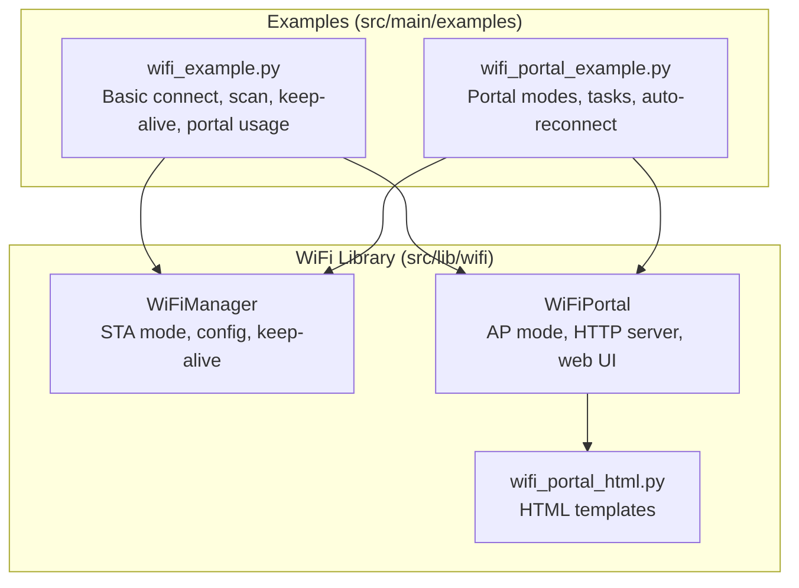
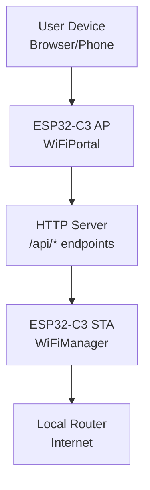
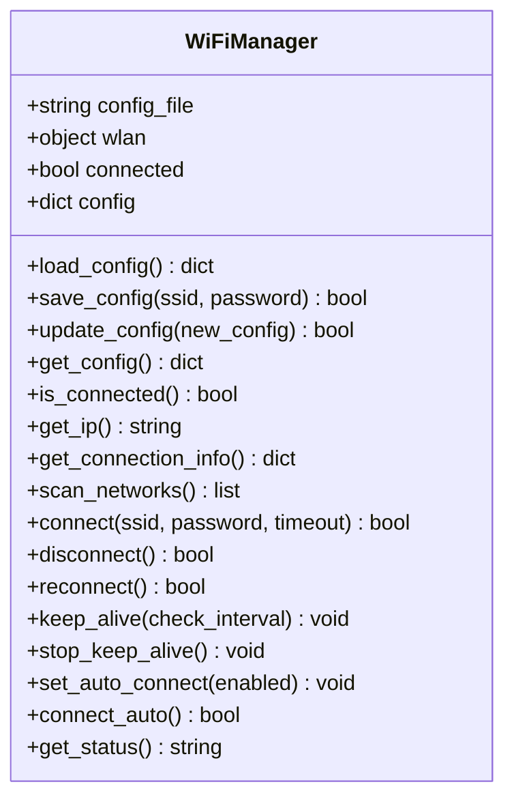
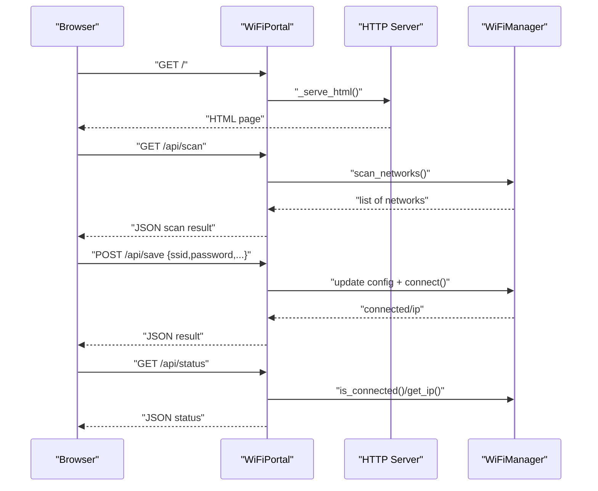
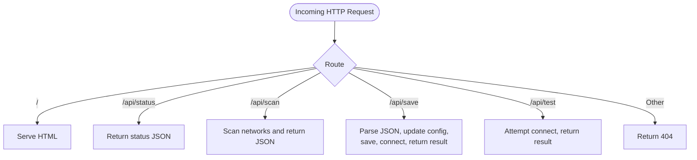
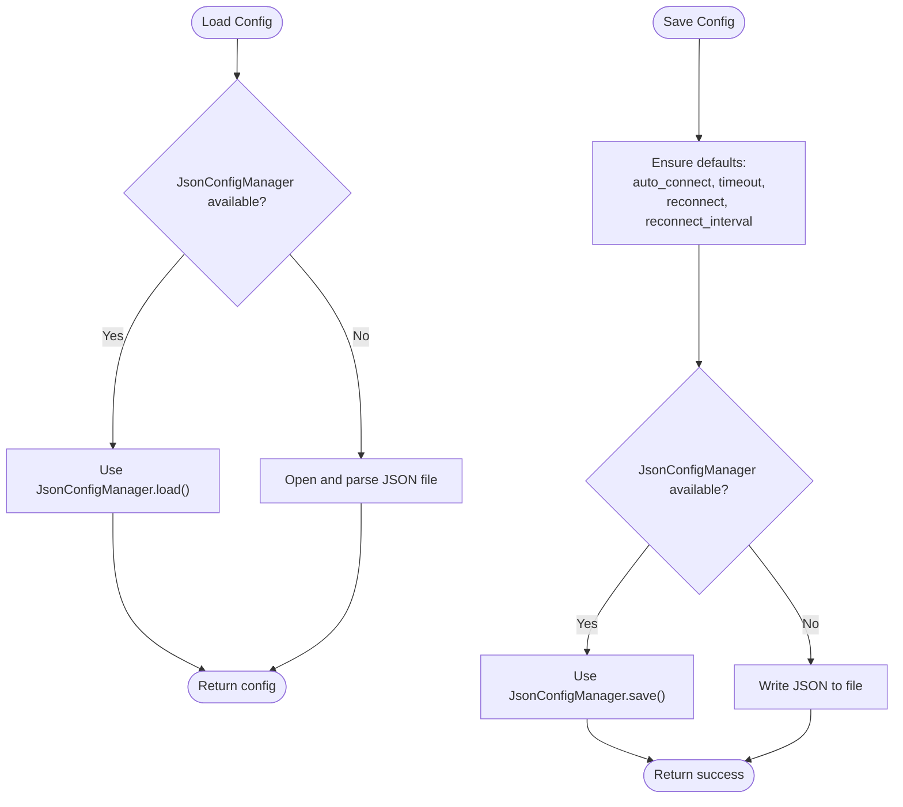
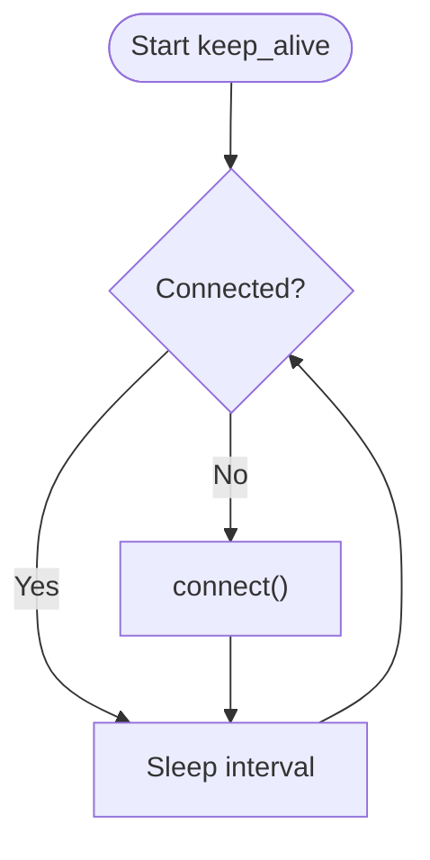
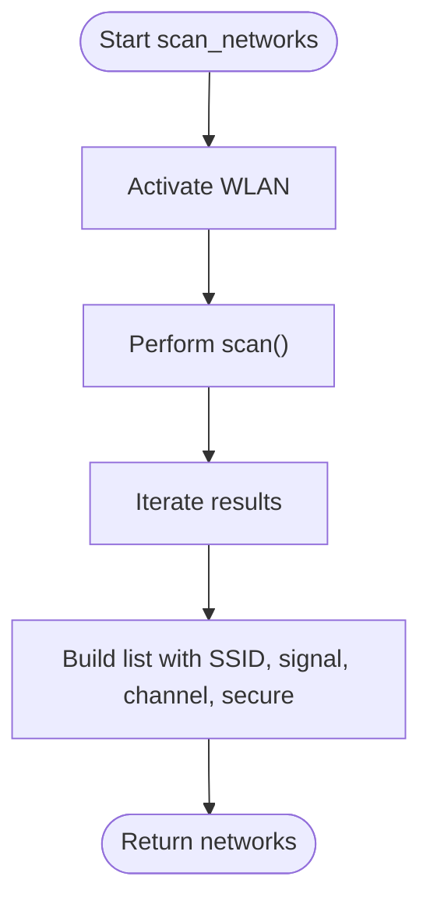
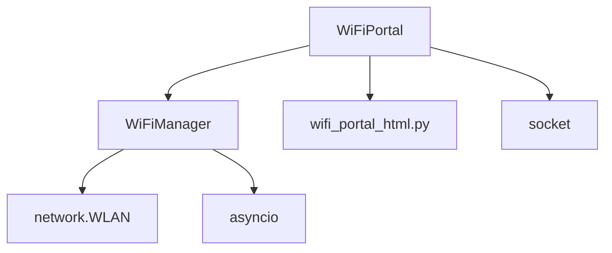

# WiFi Management

<cite>
**Referenced Files in This Document**
- [wifimanager.py](file://src/lib/wifi/wifimanager.py)
- [wifi_example.py](file://src/main/examples/wifi_example.py)
- [wifi_portal_example.py](file://src/main/examples/wifi_portal_example.py)
- [README.md](file://src/lib/wifi/README.md)
- [wifi_portal_html.py](file://src/lib/wifi/wifi_portal_html.py)
- [README_WIFI_MODULE.md](file://src/main/README_WIFI_MODULE.md)
</cite>

## Table of Contents
1. [Introduction](#introduction)
2. [Project Structure](#project-structure)
3. [Core Components](#core-components)
4. [Architecture Overview](#architecture-overview)
5. [Detailed Component Analysis](#detailed-component-analysis)
6. [Dependency Analysis](#dependency-analysis)
7. [Performance Considerations](#performance-considerations)
8. [Troubleshooting Guide](#troubleshooting-guide)
9. [Conclusion](#conclusion)
10. [Appendices](#appendices)

## Introduction
This document explains the WiFi management capabilities for the ESP32-C3 platform using the provided WiFi module. It covers:
- WiFiManager for STA (Station) mode connections, configuration persistence, automatic reconnection, and keep-alive monitoring
- WiFi configuration portal (AP mode + web UI) with HTTP APIs for status, scanning, and saving configurations
- Practical examples from wifi_example.py and wifi_portal_example.py
- Troubleshooting, connection timeouts, signal strength considerations, and best practices for IoT deployments

## Project Structure
The WiFi module resides under src/lib/wifi and includes:
- wifimanager.py: Core WiFiManager and WiFiPortal classes, configuration persistence, and HTTP API handlers
- wifi_portal_html.py: Embedded HTML templates for the captive portal
- README.md: High-level documentation for the WiFi library
- Examples under src/main/examples: wifi_example.py and wifi_portal_example.py demonstrate usage patterns

**Diagram sources**
- [wifimanager.py:38-396](file://src/lib/wifi/wifimanager.py#L38-L396)
- [wifimanager.py:478-791](file://src/lib/wifi/wifimanager.py#L478-L791)
- [wifi_portal_html.py:6-548](file://src/lib/wifi/wifi_portal_html.py#L6-L548)
- [wifi_example.py:1-338](file://src/main/examples/wifi_example.py#L1-L338)
- [wifi_portal_example.py:1-350](file://src/main/examples/wifi_portal_example.py#L1-L350)

**Section sources**
- [README.md:1-226](file://src/lib/wifi/README.md#L1-L226)
- [README_WIFI_MODULE.md:1-470](file://src/main/README_WIFI_MODULE.md#L1-L470)

## Core Components
- WiFiManager: Handles STA mode connection, configuration file management (JSON), scanning, connecting, reconnecting, keep-alive monitoring, and status reporting.
- WiFiPortal: Creates an AP (Access Point) mode, serves a web UI, exposes HTTP endpoints for status, scanning, and saving configurations, and optionally triggers automatic reconnection after saving.

Key responsibilities:
- Configuration persistence: load/save/update JSON config with defaults for auto_connect, timeout, reconnect, reconnect_interval, and optional hostname
- Connection lifecycle: connect with timeout, disconnect, reconnect, and keep-alive loop
- Scanning: scan_networks returning SSID, signal strength, channel, and security flag
- Web portal: AP mode, HTTP server, and API endpoints for status, scan, save, and test

**Section sources**
- [wifimanager.py:38-396](file://src/lib/wifi/wifimanager.py#L38-L396)
- [wifimanager.py:478-791](file://src/lib/wifi/wifimanager.py#L478-L791)

## Architecture Overview
The WiFi subsystem integrates MicroPython’s network.WLAN with asynchronous I/O and a lightweight HTTP server for the portal.

**Diagram sources**
- [wifimanager.py:495-771](file://src/lib/wifi/wifimanager.py#L495-L771)
- [wifimanager.py:533-721](file://src/lib/wifi/wifimanager.py#L533-L721)

## Detailed Component Analysis

### WiFiManager Class
Responsibilities:
- Manage STA_IF connection lifecycle
- Persist/load/update configuration in JSON
- Scan nearby networks and report signal strength
- Connect with timeout, reconnect, and keep-alive loop
- Expose status and connection info

Implementation highlights:
- Configuration file handling supports two modes: using JsonConfigManager (if available) or standard JSON file I/O
- Defaults applied for auto_connect, timeout, reconnect, reconnect_interval
- Connection loop waits up to configured timeout seconds, checking isconnected() periodically
- keep_alive checks connectivity at configurable intervals and attempts reconnect if disconnected

**Diagram sources**
- [wifimanager.py:38-396](file://src/lib/wifi/wifimanager.py#L38-L396)

**Section sources**
- [wifimanager.py:57-126](file://src/lib/wifi/wifimanager.py#L57-L126)
- [wifimanager.py:192-292](file://src/lib/wifi/wifimanager.py#L192-L292)
- [wifimanager.py:318-350](file://src/lib/wifi/wifimanager.py#L318-L350)
- [wifimanager.py:361-375](file://src/lib/wifi/wifimanager.py#L361-L375)
- [wifimanager.py:376-397](file://src/lib/wifi/wifimanager.py#L376-L397)

### WiFiPortal Class
Responsibilities:
- Create AP_IF access point with configurable SSID/password
- Serve a static HTML page and handle HTTP requests
- Expose REST-like endpoints: /, /api/status, /api/scan, /api/save (POST), /api/test
- On successful save, trigger a connection attempt and return current status/IP

**Diagram sources**
- [wifimanager.py:533-721](file://src/lib/wifi/wifimanager.py#L533-L721)
- [wifimanager.py:495-771](file://src/lib/wifi/wifimanager.py#L495-L771)

**Section sources**
- [wifimanager.py:495-545](file://src/lib/wifi/wifimanager.py#L495-L545)
- [wifimanager.py:546-607](file://src/lib/wifi/wifimanager.py#L546-L607)
- [wifimanager.py:621-721](file://src/lib/wifi/wifimanager.py#L621-L721)

### HTTP API Endpoints
- GET /: Serves the portal HTML page
- GET /api/status: Returns connected status, IP, and configured SSID
- GET /api/scan: Returns scanned networks with SSID, signal strength, channel, and security flag
- POST /api/save: Accepts JSON payload to update configuration and triggers connect
- GET /api/test: Attempts to connect and returns status/IP

**Diagram sources**
- [wifimanager.py:586-598](file://src/lib/wifi/wifimanager.py#L586-L598)
- [wifimanager.py:621-721](file://src/lib/wifi/wifimanager.py#L621-L721)

**Section sources**
- [wifimanager.py:586-607](file://src/lib/wifi/wifimanager.py#L586-L607)
- [wifimanager.py:621-721](file://src/lib/wifi/wifimanager.py#L621-L721)

### Configuration File Management (JSON Persistence)
- load_config(): Loads JSON config from file or falls back to default dict
- save_config(): Writes config to JSON file; sets defaults if missing keys
- update_config(): Merges new config and persists
- get_config(): Returns a copy of current config

**Diagram sources**
- [wifimanager.py:57-126](file://src/lib/wifi/wifimanager.py#L57-L126)

**Section sources**
- [wifimanager.py:57-126](file://src/lib/wifi/wifimanager.py#L57-L126)

### Keep-Alive Monitoring
- keep_alive(): Runs a loop at configured interval to check connection and reconnect if needed
- stop_keep_alive(): Stops the loop gracefully

**Diagram sources**
- [wifimanager.py:318-350](file://src/lib/wifi/wifimanager.py#L318-L350)

**Section sources**
- [wifimanager.py:318-350](file://src/lib/wifi/wifimanager.py#L318-L350)

### Network Scanning and Signal Strength
- scan_networks(): Activates WLAN, scans, and returns list of networks with SSID, signal strength (dBm), channel, and security flag
- Signal strength considerations: Lower dBm values indicate weaker signals; sorting by signal strength can help choose the best network

**Diagram sources**
- [wifimanager.py:192-225](file://src/lib/wifi/wifimanager.py#L192-L225)

**Section sources**
- [wifimanager.py:192-225](file://src/lib/wifi/wifimanager.py#L192-L225)

### Practical Examples

#### Basic Connection and Keep-Alive
- Demonstrates saving credentials, connecting, and running keep-alive mode
- Shows usage of scan_networks and status monitoring

**Section sources**
- [wifi_example.py:14-120](file://src/main/examples/wifi_example.py#L14-L120)
- [wifi_example.py:266-302](file://src/main/examples/wifi_example.py#L266-L302)

#### WiFi Portal Usage
- Starts AP mode and serves the web UI
- Integrates portal with background tasks and auto-reconnect

**Section sources**
- [wifi_portal_example.py:13-66](file://src/main/examples/wifi_portal_example.py#L13-L66)
- [wifi_portal_example.py:137-177](file://src/main/examples/wifi_portal_example.py#L137-L177)
- [wifi_portal_example.py:179-231](file://src/main/examples/wifi_portal_example.py#L179-L231)

#### Advanced Scenarios
- Temporary portal with time-bounded operation
- Portal combined with BLE
- Multiple configuration files for different environments

**Section sources**
- [wifi_portal_example.py:233-281](file://src/main/examples/wifi_portal_example.py#L233-L281)
- [wifi_portal_example.py:283-336](file://src/main/examples/wifi_portal_example.py#L283-L336)
- [wifi_example.py:182-220](file://src/main/examples/wifi_example.py#L182-L220)

## Dependency Analysis
- WiFiManager depends on MicroPython’s network.WLAN for STA/AP operations and asyncio for async control flow
- WiFiPortal depends on WiFiManager and creates a minimal HTTP server using sockets
- HTML templates are embedded in wifi_portal_html.py and imported by WiFiPortal

**Diagram sources**
- [wifimanager.py:18-36](file://src/lib/wifi/wifimanager.py#L18-L36)
- [wifimanager.py:478-791](file://src/lib/wifi/wifimanager.py#L478-L791)
- [wifi_portal_html.py:1-10](file://src/lib/wifi/wifi_portal_html.py#L1-L10)

**Section sources**
- [wifimanager.py:18-36](file://src/lib/wifi/wifimanager.py#L18-L36)
- [wifimanager.py:478-791](file://src/lib/wifi/wifimanager.py#L478-L791)

## Performance Considerations
- Keep-alive interval: Choose a balance between responsiveness and CPU usage; typical values between 15–60 seconds
- Scanning frequency: Limit scans to reduce power consumption and avoid blocking
- Memory footprint: Portal HTML and HTTP server consume additional RAM; ensure sufficient free memory
- Connection timeout: Increase timeout for weak or congested networks to avoid premature failures

## Troubleshooting Guide
Common issues and resolutions:
- Cannot connect to WiFi:
  - Verify SSID and password
  - Confirm router availability and signal strength
  - Increase timeout via configuration
- Configuration not saved:
  - Check filesystem write permissions and available space
- Keep-alive not working:
  - Ensure keep_alive is started and not stopped prematurely
  - Verify connectivity and signal quality
- Portal not opening:
  - Confirm AP mode support and sufficient memory
  - Reduce concurrent services to free memory
- Cannot access portal web page:
  - Connect to the AP SSID advertised by the device
  - Navigate to http://192.168.4.1
  - Restart device WiFi on the browser device if needed

**Section sources**
- [README_WIFI_MODULE.md:438-462](file://src/main/README_WIFI_MODULE.md#L438-L462)
- [README.md:218-226](file://src/lib/wifi/README.md#L218-L226)

## Conclusion
The WiFi module provides a robust, asynchronous solution for ESP32-C3 WiFi management:
- Reliable STA mode connection with JSON-based configuration
- Automatic reconnection and keep-alive monitoring
- A user-friendly captive portal with HTTP APIs for status, scanning, and saving configurations
- Extensive examples demonstrating basic and advanced usage patterns

Adopt the recommended practices for timeouts, keep-alive intervals, and signal considerations to achieve stable IoT deployments.

## Appendices

### Configuration Options
- ssid: WiFi network name
- password: WiFi password
- auto_connect: Enable/disable automatic connection on boot
- timeout: Connection timeout in seconds
- reconnect: Enable/disable automatic reconnect when disconnected
- reconnect_interval: Interval between keep-alive checks
- hostname: Optional DHCP hostname

**Section sources**
- [README_WIFI_MODULE.md:135-162](file://src/main/README_WIFI_MODULE.md#L135-L162)

### Example References
- Basic connection and keep-alive: [wifi_example.py:14-120](file://src/main/examples/wifi_example.py#L14-L120)
- Portal usage and tasks: [wifi_portal_example.py:13-66](file://src/main/examples/wifi_portal_example.py#L13-L66)
- Temporary portal and auto-reconnect: [wifi_portal_example.py:233-281](file://src/main/examples/wifi_portal_example.py#L233-L281)