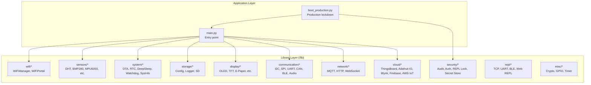
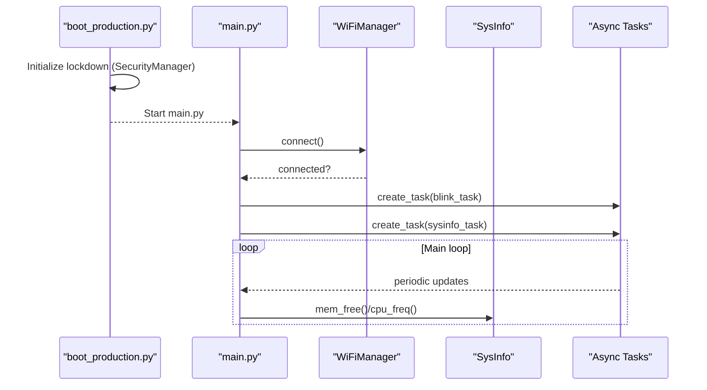
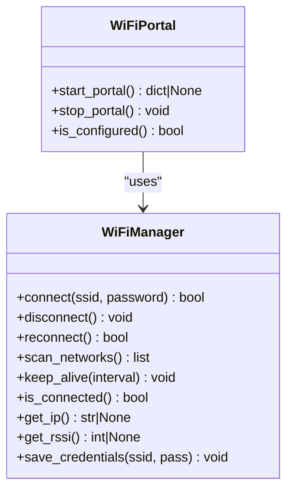
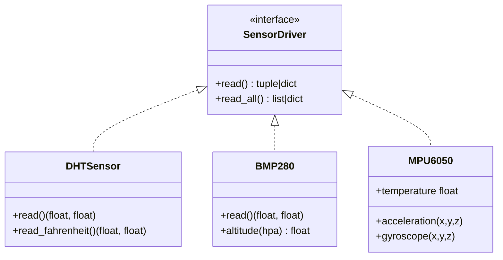
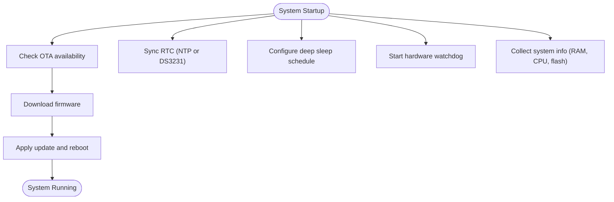
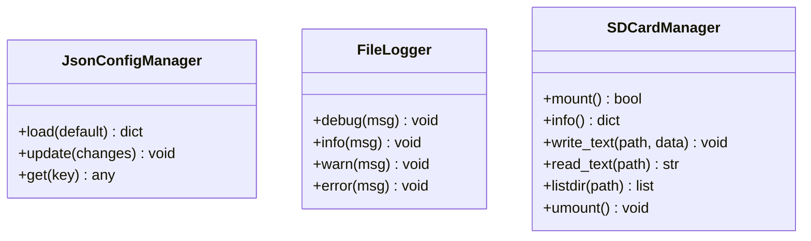
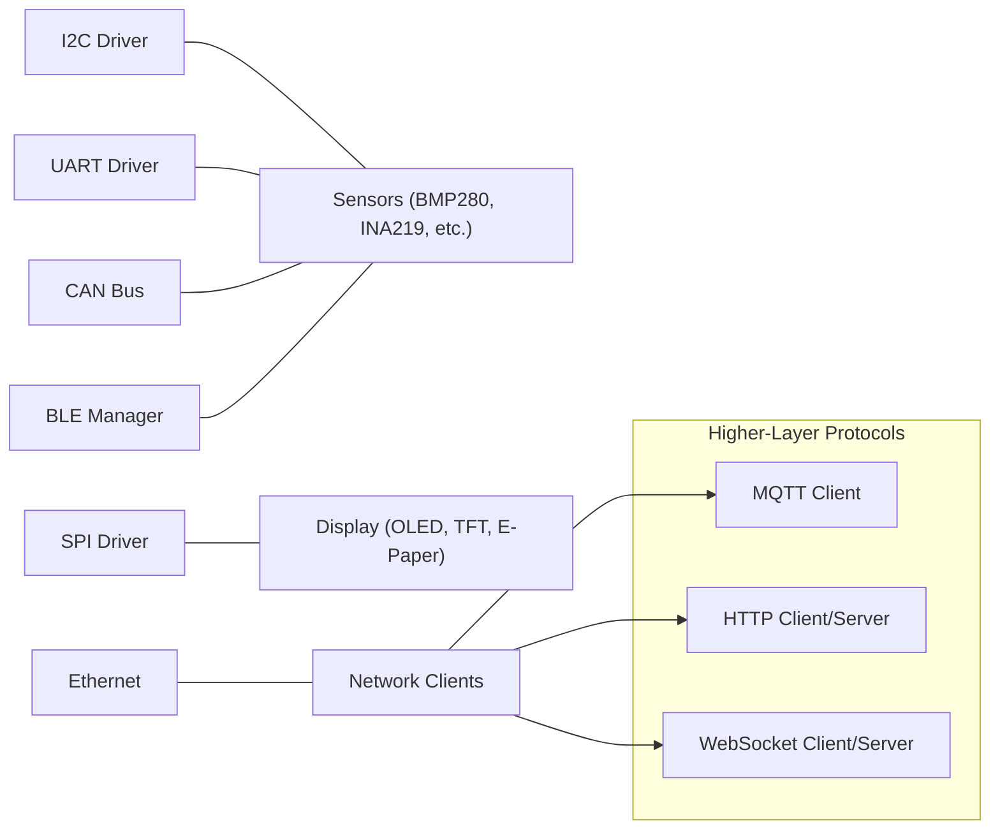
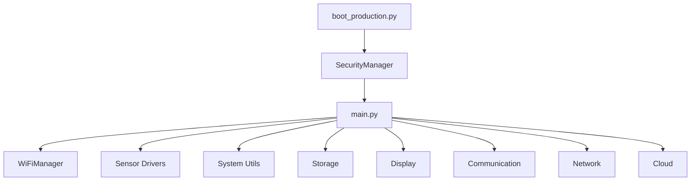

# Architecture Overview

<cite>
**Referenced Files in This Document**
- [README.md](file://src/lib/README.md)
- [List_module.md](file://src/List_module.md)
- [README_ASYNCIO.md](file://src/main/README_ASYNCIO.md)
- [device.cfg](file://src/device.cfg)
- [boot_production.py](file://src/main/boot_production.py)
- [main.py](file://src/main/main.py)
- [wifi/README.md](file://src/lib/wifi/README.md)
- [sensors/README.md](file://src/lib/sensors/README.md)
- [system/README.md](file://src/lib/system/README.md)
- [wifi_example.py](file://src/main/examples/wifi_example.py)
- [sensors_example.py](file://src/main/examples/sensors_example.py)
- [storage_example.py](file://src/main/examples/storage_example.py)
- [system_example.py](file://src/main/examples/system_example.py)
</cite>

## Table of Contents
1. [Introduction](#introduction)
2. [Project Structure](#project-structure)
3. [Core Components](#core-components)
4. [Architecture Overview](#architecture-overview)
5. [Detailed Component Analysis](#detailed-component-analysis)
6. [Dependency Analysis](#dependency-analysis)
7. [Performance Considerations](#performance-considerations)
8. [Troubleshooting Guide](#troubleshooting-guide)
9. [Conclusion](#conclusion)
10. [Appendices](#appendices)

## Introduction
This document presents the architecture of the ESP32-C3 MicroPython Library Framework. The framework emphasizes an async-first design using MicroPython’s asyncio to enable non-blocking operations across networking, sensors, storage, and system utilities. It organizes over 80 modules into functional categories (WiFi, BLE, sensors, displays, storage, system utilities, etc.), enabling modular composition for embedded IoT applications. Architectural patterns include:
- Factory pattern for dynamic WiFi portal creation
- Observer pattern for system monitoring and event-driven updates
- Strategy pattern for pluggable sensor drivers
- Singleton pattern for centralized configuration management

The document also covers component interaction models, data flow patterns, system boundaries, memory management strategies, performance considerations, and integration with the MicroPython ecosystem and platform-specific constraints.

## Project Structure
The repository follows a clear separation of concerns:
- src/lib: Modular library organized by domain (wifi, sensors, system, storage, etc.)
- src/main: Application entry points, examples, and production boot logic
- src/stubs: Type stubs for development ergonomics
- src/device.cfg: Device configuration for deployment targets

**Diagram sources**
- [main.py:1-84](file://src/main/main.py#L1-L84)
- [boot_production.py:1-56](file://src/main/boot_production.py#L1-L56)
- [README.md:1-72](file://src/lib/README.md#L1-L72)

**Section sources**
- [README.md:1-72](file://src/lib/README.md#L1-L72)
- [List_module.md:1-358](file://src/List_module.md#L1-L358)
- [device.cfg:1-16](file://src/device.cfg#L1-L16)

## Core Components
- Async runtime and patterns: The framework is built around cooperative multitasking using asyncio. Tasks are created for non-blocking operations such as blinking LEDs, periodic system checks, sensor sampling, and network operations.
- WiFi subsystem: Provides connection management, auto-reconnect, credential persistence, and captive portal setup for configuration.
- Sensors subsystem: Offers a broad set of drivers implementing a consistent interface for temperature, pressure, motion, gas, power, and environmental sensing.
- System utilities: Includes OTA updates, real-time clock synchronization, deep sleep, hardware watchdog, and system information collection.
- Storage: JSON configuration management, file logging, and optional SD card support.
- Communication and networking: I2C, SPI, UART, CAN, BLE, Ethernet, MQTT, HTTP, and WebSocket stacks.
- Cloud integrations: Ready-to-use clients for major IoT platforms.
- Security and REPL: Centralized security manager, audit logging, authentication, REPL locking, and secret storage.
- Crypto and peripherals: Cryptographic helpers, analog I/O (ADC, DAC, PWM), GPIO, and timers.

Key architectural patterns:
- Factory pattern: WiFiPortal dynamically creates a captive portal for configuration.
- Observer pattern: Event-driven monitoring via asyncio.Event, Queue, and callbacks for sensor and system updates.
- Strategy pattern: Sensor drivers expose a common interface allowing interchangeable implementations.
- Singleton pattern: Configuration managers (e.g., JsonConfigManager) provide centralized access to persisted settings.

**Section sources**
- [README_ASYNCIO.md:1-840](file://src/main/README_ASYNCIO.md#L1-L840)
- [wifi/README.md:1-226](file://src/lib/wifi/README.md#L1-L226)
- [sensors/README.md:1-2063](file://src/lib/sensors/README.md#L1-L2063)
- [system/README.md:1-399](file://src/lib/system/README.md#L1-L399)

## Architecture Overview
The framework adopts an async-first, modular architecture:
- Entry point: main.py initializes the async event loop and orchestrates tasks.
- Boot protection: boot_production.py enforces lockdown via SecurityManager before main application starts.
- Component orchestration: Tasks are created for WiFi connectivity, periodic system reporting, and application-specific workloads.
- Non-blocking operations: All long-running or I/O-bound operations leverage asyncio primitives (sleep, gather, events, queues, streams).

**Diagram sources**
- [boot_production.py:1-56](file://src/main/boot_production.py#L1-L56)
- [main.py:1-84](file://src/main/main.py#L1-L84)
- [system/README.md:317-386](file://src/lib/system/README.md#L317-L386)

**Section sources**
- [main.py:1-84](file://src/main/main.py#L1-L84)
- [boot_production.py:1-56](file://src/main/boot_production.py#L1-L56)

## Detailed Component Analysis

### WiFi Subsystem
The WiFi subsystem encapsulates station mode connectivity, credential management, scanning, and a captive portal for configuration.

Key capabilities:
- WiFiManager: Connects to a configured network, auto-reconnects, persists credentials, exposes connection info, and runs keep-alive loops.
- WiFiPortal: Starts an access point and serves a captive portal to collect SSID/password for initial provisioning.

Architectural patterns:
- Factory pattern: WiFiPortal constructs and manages the AP and web UI for configuration.
- Observer pattern: Events and callbacks notify about connection state changes and keep-alive status.

**Diagram sources**
- [wifi/README.md:28-226](file://src/lib/wifi/README.md#L28-L226)

**Section sources**
- [wifi/README.md:1-226](file://src/lib/wifi/README.md#L1-L226)
- [wifi_example.py:1-338](file://src/main/examples/wifi_example.py#L1-L338)

### Sensors Subsystem
The sensors library provides a comprehensive set of drivers with a consistent interface across temperature, pressure, motion, gas, power, and environmental measurements.

Design highlights:
- Strategy pattern: Each sensor driver implements a common interface, enabling interchangeable usage.
- Async-friendly operations: Many drivers support non-blocking reads and sampling intervals.

**Diagram sources**
- [sensors/README.md:45-2063](file://src/lib/sensors/README.md#L45-L2063)

**Section sources**
- [sensors/README.md:1-2063](file://src/lib/sensors/README.md#L1-L2063)
- [sensors_example.py:1-529](file://src/main/examples/sensors_example.py#L1-L529)

### System Utilities
System utilities provide OTA updates, real-time clock synchronization, deep sleep, hardware watchdog, and system information.

Patterns:
- Observer pattern: Watchdog feeds and system health reporters publish telemetry.
- Strategy pattern: Different update strategies (manual, scheduled) and RTC sync modes.

**Diagram sources**
- [system/README.md:21-399](file://src/lib/system/README.md#L21-L399)

**Section sources**
- [system/README.md:1-399](file://src/lib/system/README.md#L1-L399)
- [system_example.py:1-43](file://src/main/examples/system_example.py#L1-L43)

### Storage Subsystem
Storage components manage JSON configuration, file logging, and optional SD card mounting.

**Diagram sources**
- [storage_example.py:1-63](file://src/main/examples/storage_example.py#L1-L63)

**Section sources**
- [storage_example.py:1-63](file://src/main/examples/storage_example.py#L1-L63)

### Communication and Networking
The framework integrates communication stacks (I2C, SPI, UART, CAN), BLE, Ethernet, and higher-layer protocols (MQTT, HTTP, WebSocket).

**Diagram sources**
- [List_module.md:116-128](file://src/List_module.md#L116-L128)

**Section sources**
- [List_module.md:1-358](file://src/List_module.md#L1-L358)

## Dependency Analysis
The framework exhibits low coupling and high cohesion:
- Application entry points depend on library modules but remain thin orchestrators.
- Library modules are self-contained and expose clean interfaces.
- Async primitives (tasks, events, queues, streams) mediate inter-module communication.

**Diagram sources**
- [main.py:1-84](file://src/main/main.py#L1-L84)
- [boot_production.py:1-56](file://src/main/boot_production.py#L1-L56)

**Section sources**
- [main.py:1-84](file://src/main/main.py#L1-L84)
- [boot_production.py:1-56](file://src/main/boot_production.py#L1-L56)

## Performance Considerations
- Cooperative multitasking: Tasks must yield control using await to prevent blocking others.
- Memory management: Use asyncio.sleep_ms for short delays, limit queue sizes, and periodically call garbage collection in idle tasks.
- Resource contention: Use asyncio.Lock for shared resources (e.g., I2C, SPI) to avoid clashes.
- Timeouts: Use asyncio.wait_for to bound long operations and prevent stalls.
- Watchdog: Implement a dedicated task to feed the hardware watchdog to ensure system reliability.

Practical tips:
- Prefer asyncio.gather for parallelizing independent tasks.
- Use queues for producer-consumer patterns to decouple data generation and processing.
- Avoid global mutable state without locks.

**Section sources**
- [README_ASYNCIO.md:1-840](file://src/main/README_ASYNCIO.md#L1-L840)

## Troubleshooting Guide
Common pitfalls and remedies:
- Blocking operations: Using time.sleep in async contexts blocks the event loop. Replace with asyncio.sleep or asyncio.sleep_ms.
- Compute-heavy loops: Insert periodic yields (await asyncio.sleep(0)) to keep the loop responsive.
- Uncancelled tasks: Always re-raise CancelledError in exception handlers to ensure proper cleanup.
- Shared resource races: Protect access to I2C/SPI with asyncio.Lock.
- Memory leaks: Monitor free RAM and trigger garbage collection in idle tasks.

Operational checks:
- Verify WiFi connectivity and keep-alive status.
- Confirm sensor driver initialization and wiring.
- Validate storage mounts and file permissions.
- Ensure RTC synchronization and deep sleep wake reasons.

**Section sources**
- [README_ASYNCIO.md:670-750](file://src/main/README_ASYNCIO.md#L670-L750)
- [system/README.md:390-399](file://src/lib/system/README.md#L390-L399)

## Conclusion
The ESP32-C3 MicroPython Library Framework delivers a robust, async-first foundation for embedded IoT applications. Its modular design, extensive driver coverage, and adherence to established architectural patterns enable scalable, maintainable systems. By leveraging asyncio primitives, the framework achieves non-blocking concurrency, efficient resource utilization, and reliable operation on constrained devices.

## Appendices

### MicroPython Ecosystem and Platform Constraints
- MicroPython runtime: The framework targets MicroPython v1.21+ on ESP32-C3/C6 with cooperative multitasking.
- Hardware constraints: Limited RAM and flash require careful memory management and conservative buffer sizing.
- Platform specifics: Some modules are ESP32-family specific (e.g., touch pins absent on C3/C6, Ethernet requires external PHY).

**Section sources**
- [README.md:67-72](file://src/lib/README.md#L67-L72)
- [List_module.md:350-358](file://src/List_module.md#L350-L358)