# Advanced Integration Examples

<cite>
**Referenced Files in This Document**
- [asyncio_examples.py](file://src/main/examples/asyncio_examples.py)
- [secure_production_example.py](file://src/main/examples/secure_production_example.py)
- [wifi_portal_example.py](file://src/main/examples/wifi_portal_example.py)
- [mqtt_example.py](file://src/main/examples/mqtt_example.py)
- [http_example.py](file://src/main/examples/http_example.py)
- [audio_can_example.py](file://src/main/examples/audio_can_example.py)
- [i2c_pwm_pin_example.py](file://src/main/examples/i2c_pwm_pin_example.py)
- [uart_adc_spi_example.py](file://src/main/examples/uart_adc_spi_example.py)
- [cloud_example.py](file://src/main/examples/cloud_example.py)
- [dac_crypto_ethernet_example.py](file://src/main/examples/dac_crypto_ethernet_example.py)
- [button_advanced_example.py](file://src/main/examples/button_advanced_example.py)
- [buzzer_patterns_example.py](file://src/main/examples/buzzer_patterns_example.py)
- [boot_production.py](file://src/main/boot_production.py)
- [main.py](file://src/main/main.py)
- [README.md](file://src/lib/README.md)
</cite>

## Table of Contents
1. [Introduction](#introduction)
2. [Project Structure](#project-structure)
3. [Core Components](#core-components)
4. [Architecture Overview](#architecture-overview)
5. [Detailed Component Analysis](#detailed-component-analysis)
6. [Dependency Analysis](#dependency-analysis)
7. [Performance Considerations](#performance-considerations)
8. [Troubleshooting Guide](#troubleshooting-guide)
9. [Conclusion](#conclusion)
10. [Appendices](#appendices)

## Introduction
This document presents advanced integration examples for the ESP32-C3 MicroPython project, focusing on complex, real-world scenarios that coordinate multiple hardware interfaces and software modules. It demonstrates sophisticated patterns including asynchronous programming, secure production deployments, WiFi configuration portals, MQTT client/server implementations, HTTP/HTTPS communication, WebSocket real-time messaging, cloud platform integrations, cryptographic operations, and advanced sensor fusion. The examples emphasize multi-module coordination, timing considerations, resource management in constrained environments, and production-grade resilience and security.

## Project Structure
The project organizes functionality into two primary areas:
- src/lib: Modular libraries grouped by domain (WiFi, BLE, sensors, display, output, input, storage, MQTT, HTTP, WebSocket, cloud, system, audio, DAC, CAN, crypto, ethernet, etc.).
- src/main: Application entry points and example scripts under main/examples demonstrating integration patterns.

```mermaid
graph TB
subgraph "Application Layer"
MAIN["main.py"]
BOOT["boot_production.py"]
end
subgraph "Examples"
EX_ASYNC["asyncio_examples.py"]
EX_WIFI_PORTAL["wifi_portal_example.py"]
EX_SECURE["secure_production_example.py"]
EX_MQTT["mqtt_example.py"]
EX_HTTP["http_example.py"]
EX_AUDIO_CAN["audio_can_example.py"]
EX_I2C_PWM["i2c_pwm_pin_example.py"]
EX_UART_ADC_SPI["uart_adc_spi_example.py"]
EX_CLOUD["cloud_example.py"]
EX_DAC_CRYPTO_ETH["dac_crypto_ethernet_example.py"]
EX_BTN_ADV["button_advanced_example.py"]
EX_BUZZER["buzzer_patterns_example.py"]
end
subgraph "Libraries (/lib)"
LIB_WIFI["wifi/*"]
LIB_BLE["ble/*"]
LIB_SENSORS["sensors/*"]
LIB_DISPLAY["display/*"]
LIB_OUTPUT["output/*"]
LIB_INPUT["input/*"]
LIB_STORAGE["storage/*"]
LIB_MQTT["mqtt/*"]
LIB_HTTP["http/*"]
LIB_WS["websocket/*"]
LIB_CLOUD["cloud/*"]
LIB_SYSTEM["system/*"]
LIB_AUDIO["audio/*"]
LIB_DAC["dac/*"]
LIB_CAN["can/*"]
LIB_CRYPTO["crypto/*"]
LIB_ETHERNET["ethernet/*"]
end
MAIN --> LIB_WIFI
MAIN --> LIB_SYSTEM
EX_ASYNC --> LIB_WIFI
EX_WIFI_PORTAL --> LIB_WIFI
EX_SECURE --> LIB_WIFI
EX_SECURE --> LIB_CRYPTO
EX_MQTT --> LIB_MQTT
EX_HTTP --> LIB_HTTP
EX_AUDIO_CAN --> LIB_AUDIO
EX_AUDIO_CAN --> LIB_CAN
EX_I2C_PWM --> LIB_SENSORS
EX_UART_ADC_SPI --> LIB_SENSORS
EX_CLOUD --> LIB_CLOUD
EX_DAC_CRYPTO_ETH --> LIB_DAC
EX_DAC_CRYPTO_ETH --> LIB_CRYPTO
EX_DAC_CRYPTO_ETH --> LIB_ETHERNET
EX_BTN_ADV --> LIB_INPUT
EX_BUZZER --> LIB_OUTPUT
```

**Diagram sources**
- [README.md:1-72](file://src/lib/README.md#L1-L72)
- [main.py:1-84](file://src/main/main.py#L1-L84)
- [boot_production.py:1-56](file://src/main/boot_production.py#L1-L56)

**Section sources**
- [README.md:1-72](file://src/lib/README.md#L1-L72)
- [main.py:1-84](file://src/main/main.py#L1-L84)
- [boot_production.py:1-56](file://src/main/boot_production.py#L1-L56)

## Core Components
This section highlights the core modules and their roles in advanced integrations:
- WiFi and BLE: Connectivity and provisioning (STA/AP modes, BLE pairing, and configuration portals).
- Sensors and Actuators: I2C/SPI/UART/ADC/PWM interfaces for multi-sensor fusion and actuator control.
- Communication Protocols: MQTT, HTTP/HTTPS, and WebSocket for telemetry and control.
- Cloud Integrations: Platform-specific clients for telemetry and remote control.
- Security and Cryptography: Token-based authentication, audit logging, emergency wipe, and cryptographic helpers.
- Audio and CAN: I2S audio generation and CAN bus diagnostics.
- System and Storage: OTA updates, logging, and persistent configuration.

Key integration patterns include:
- Asynchronous orchestration of LED blink, sensor reads, and WiFi connectivity checks.
- Secure production boot with lockdown and optional development unlock pin.
- WiFi configuration portal coordinating HTTP server and background tasks.
- Multi-interface sensor fusion using I2C, SPI, and ADC with PWM/UART coordination.
- Audio/CAN integration for diagnostics and diagnostics-driven alerts.
- Cloud telemetry via MQTT/HTTP with TLS and token-based authentication.

**Section sources**
- [asyncio_examples.py:1-234](file://src/main/examples/asyncio_examples.py#L1-L234)
- [secure_production_example.py:1-268](file://src/main/examples/secure_production_example.py#L1-L268)
- [wifi_portal_example.py:1-350](file://src/main/examples/wifi_portal_example.py#L1-L350)
- [i2c_pwm_pin_example.py:1-364](file://src/main/examples/i2c_pwm_pin_example.py#L1-L364)
- [uart_adc_spi_example.py:1-264](file://src/main/examples/uart_adc_spi_example.py#L1-L264)
- [audio_can_example.py:1-253](file://src/main/examples/audio_can_example.py#L1-L253)
- [dac_crypto_ethernet_example.py:1-326](file://src/main/examples/dac_crypto_ethernet_example.py#L1-L326)
- [button_advanced_example.py:1-321](file://src/main/examples/button_advanced_example.py#L1-L321)
- [buzzer_patterns_example.py:1-180](file://src/main/examples/buzzer_patterns_example.py#L1-L180)
- [mqtt_example.py:1-40](file://src/main/examples/mqtt_example.py#L1-L40)
- [http_example.py:1-43](file://src/main/examples/http_example.py#L1-L43)
- [cloud_example.py:1-60](file://src/main/examples/cloud_example.py#L1-L60)

## Architecture Overview
The system architecture integrates asynchronous tasks, modular libraries, and layered security. At runtime:
- Boot protection initializes security lockdown before application startup.
- The main application connects to WiFi, then runs concurrent tasks for LED blink, system info, and optional cloud/protocol tasks.
- Examples demonstrate coordinated use of multiple interfaces (I2C/PWM, UART/ADC/SPI, audio/CAN) and protocols (MQTT, HTTP, WebSocket).

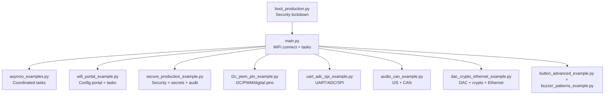

**Diagram sources**
- [boot_production.py:1-56](file://src/main/boot_production.py#L1-L56)
- [main.py:1-84](file://src/main/main.py#L1-L84)
- [asyncio_examples.py:146-193](file://src/main/examples/asyncio_examples.py#L146-L193)
- [wifi_portal_example.py:48-135](file://src/main/examples/wifi_portal_example.py#L48-L135)
- [secure_production_example.py:249-264](file://src/main/examples/secure_production_example.py#L249-L264)
- [i2c_pwm_pin_example.py:343-363](file://src/main/examples/i2c_pwm_pin_example.py#L343-L363)
- [uart_adc_spi_example.py:249-263](file://src/main/examples/uart_adc_spi_example.py#L249-L263)
- [audio_can_example.py:236-252](file://src/main/examples/audio_can_example.py#L236-L252)
- [dac_crypto_ethernet_example.py:305-325](file://src/main/examples/dac_crypto_ethernet_example.py#L305-L325)
- [button_advanced_example.py:286-320](file://src/main/examples/button_advanced_example.py#L286-L320)
- [buzzer_patterns_example.py:157-179](file://src/main/examples/buzzer_patterns_example.py#L157-L179)

## Detailed Component Analysis

### Asynchronous Programming Patterns
This example demonstrates concurrent tasks for LED blinking, periodic sensor reads, and WiFi connectivity checks. It showcases:
- Task creation and orchestration using asyncio.gather.
- Non-blocking sleeps and timeouts for robust operation.
- Graceful cleanup on exceptions and keyboard interrupts.

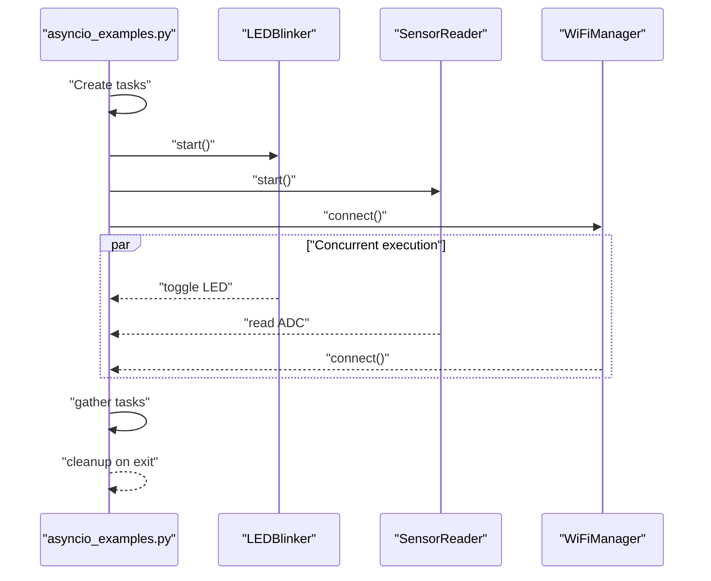

**Diagram sources**
- [asyncio_examples.py:146-193](file://src/main/examples/asyncio_examples.py#L146-L193)
- [asyncio_examples.py:20-117](file://src/main/examples/asyncio_examples.py#L20-L117)

**Section sources**
- [asyncio_examples.py:146-193](file://src/main/examples/asyncio_examples.py#L146-L193)

### Secure Production Deployment
This example integrates SecurityManager with REPL lockdown, encrypted secrets storage, token authentication, audit logging, and emergency wipe. It also simulates a full production environment with WiFi credentials stored securely and token generation for remote administration.

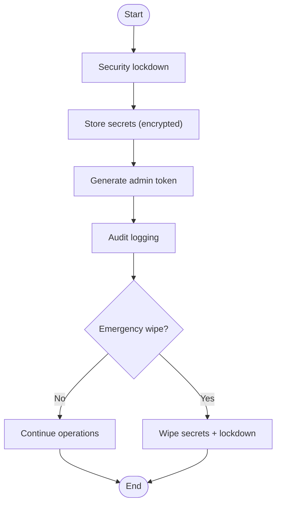

**Diagram sources**
- [secure_production_example.py:20-264](file://src/main/examples/secure_production_example.py#L20-L264)

**Section sources**
- [secure_production_example.py:20-264](file://src/main/examples/secure_production_example.py#L20-L264)
- [boot_production.py:24-48](file://src/main/boot_production.py#L24-L48)

### WiFi Configuration Portal
This example creates a captive configuration portal with an embedded HTTP server, coordinating background tasks (LED blink, sensor read) and optional BLE. It supports temporary portal windows, auto-reconnect, and STA mode transitions after configuration.

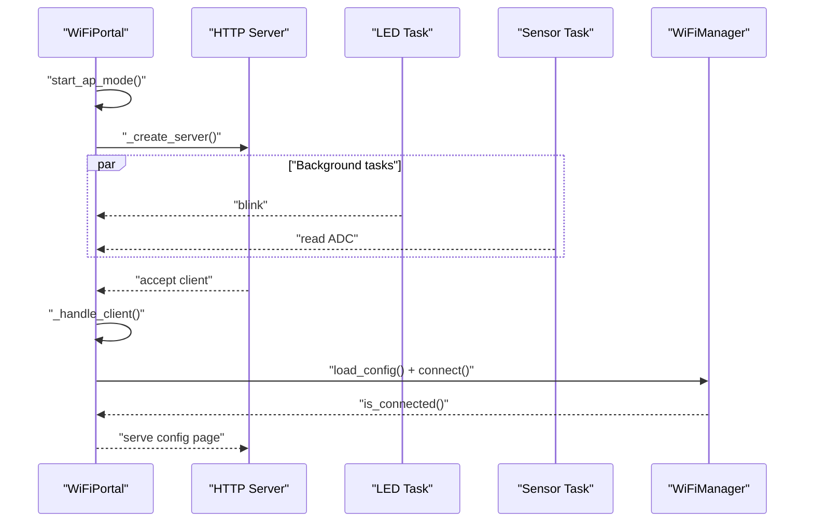

**Diagram sources**
- [wifi_portal_example.py:48-135](file://src/main/examples/wifi_portal_example.py#L48-L135)
- [wifi_portal_example.py:137-177](file://src/main/examples/wifi_portal_example.py#L137-L177)
- [wifi_portal_example.py:179-231](file://src/main/examples/wifi_portal_example.py#L179-L231)
- [wifi_portal_example.py:233-281](file://src/main/examples/wifi_portal_example.py#L233-L281)
- [wifi_portal_example.py:283-336](file://src/main/examples/wifi_portal_example.py#L283-L336)

**Section sources**
- [wifi_portal_example.py:48-135](file://src/main/examples/wifi_portal_example.py#L48-L135)
- [wifi_portal_example.py:137-177](file://src/main/examples/wifi_portal_example.py#L137-L177)
- [wifi_portal_example.py:179-231](file://src/main/examples/wifi_portal_example.py#L179-L231)
- [wifi_portal_example.py:233-281](file://src/main/examples/wifi_portal_example.py#L233-L281)
- [wifi_portal_example.py:283-336](file://src/main/examples/wifi_portal_example.py#L283-L336)

### MQTT Client Implementation
This example demonstrates connecting to an MQTT broker, subscribing to topics, publishing messages, and continuously checking for incoming messages. It illustrates a minimal client loop suitable for production telemetry.

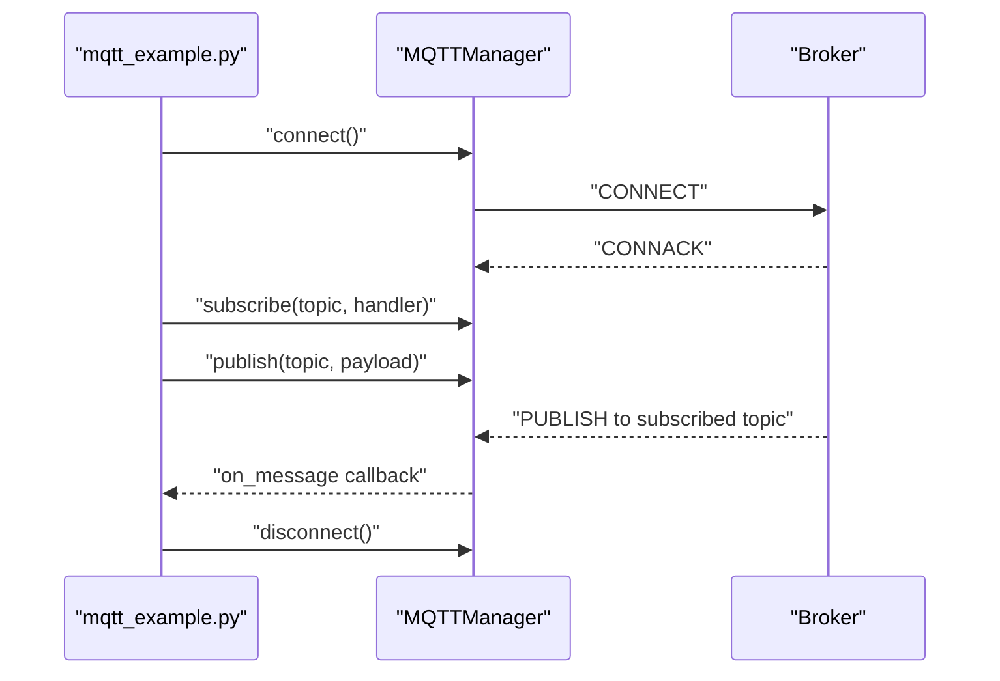

**Diagram sources**
- [mqtt_example.py:12-37](file://src/main/examples/mqtt_example.py#L12-L37)

**Section sources**
- [mqtt_example.py:12-37](file://src/main/examples/mqtt_example.py#L12-L37)

### HTTP Client Example
This example performs an HTTP GET request using the HTTP client module and prints response metadata. It demonstrates client-side usage for telemetry retrieval or API calls.

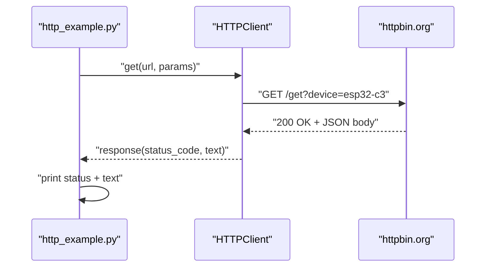

**Diagram sources**
- [http_example.py:12-20](file://src/main/examples/http_example.py#L12-L20)

**Section sources**
- [http_example.py:12-20](file://src/main/examples/http_example.py#L12-L20)

### Audio and CAN Integration
This example combines I2S audio generation (sine wave, WAV playback, volume control) with CAN bus loopback tests, filtering, and OBD-II patterns. It demonstrates multi-interface coordination for diagnostics and audio feedback.

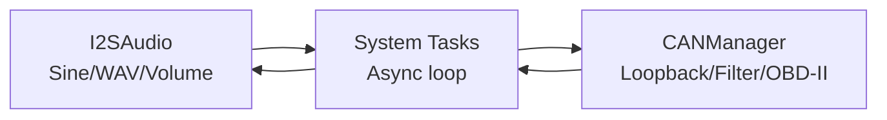

**Diagram sources**
- [audio_can_example.py:20-118](file://src/main/examples/audio_can_example.py#L20-L118)
- [audio_can_example.py:123-231](file://src/main/examples/audio_can_example.py#L123-L231)

**Section sources**
- [audio_can_example.py:20-118](file://src/main/examples/audio_can_example.py#L20-L118)
- [audio_can_example.py:123-231](file://src/main/examples/audio_can_example.py#L123-L231)

### I2C/PWM/Digital Pin Coordination
This example coordinates I2C scanning and register-level operations, PWM LED/servo control, and digital input/output with debouncing and IRQ handling. It demonstrates shared bus usage and multi-device sensor fusion.

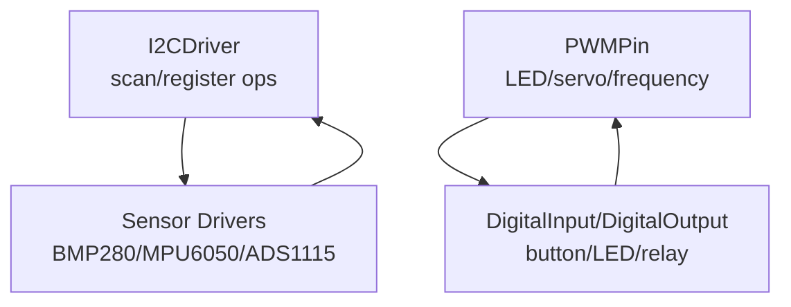

**Diagram sources**
- [i2c_pwm_pin_example.py:20-106](file://src/main/examples/i2c_pwm_pin_example.py#L20-L106)
- [i2c_pwm_pin_example.py:153-228](file://src/main/examples/i2c_pwm_pin_example.py#L153-L228)
- [i2c_pwm_pin_example.py:257-338](file://src/main/examples/i2c_pwm_pin_example.py#L257-L338)

**Section sources**
- [i2c_pwm_pin_example.py:20-106](file://src/main/examples/i2c_pwm_pin_example.py#L20-L106)
- [i2c_pwm_pin_example.py:153-228](file://src/main/examples/i2c_pwm_pin_example.py#L153-L228)
- [i2c_pwm_pin_example.py:257-338](file://src/main/examples/i2c_pwm_pin_example.py#L257-L338)

### UART/ADC/SPI Multi-Interface Setup
This example demonstrates UART echo and framing, ADC averaging/smoothing and calibration, and SPI device management with per-device CS control and register-level transfers. It showcases sensor patterns and multi-device SPI buses.

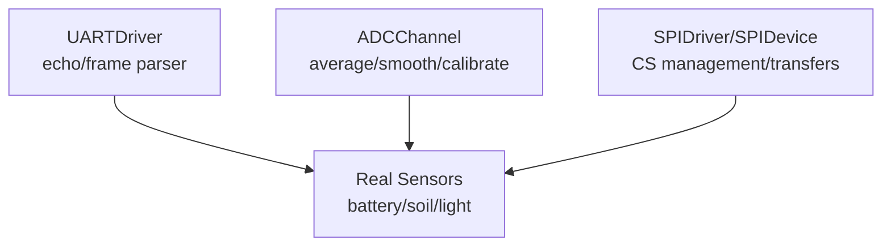

**Diagram sources**
- [uart_adc_spi_example.py:20-103](file://src/main/examples/uart_adc_spi_example.py#L20-L103)
- [uart_adc_spi_example.py:108-147](file://src/main/examples/uart_adc_spi_example.py#L108-L147)
- [uart_adc_spi_example.py:152-210](file://src/main/examples/uart_adc_spi_example.py#L152-L210)
- [uart_adc_spi_example.py:215-244](file://src/main/examples/uart_adc_spi_example.py#L215-L244)

**Section sources**
- [uart_adc_spi_example.py:20-103](file://src/main/examples/uart_adc_spi_example.py#L20-L103)
- [uart_adc_spi_example.py:108-147](file://src/main/examples/uart_adc_spi_example.py#L108-L147)
- [uart_adc_spi_example.py:152-210](file://src/main/examples/uart_adc_spi_example.py#L152-L210)
- [uart_adc_spi_example.py:215-244](file://src/main/examples/uart_adc_spi_example.py#L215-L244)

### Cloud Platform Integrations
This example outlines cloud integrations with placeholders for popular platforms (ThingsBoard, Adafruit IO, Blynk, Firebase, AWS IoT). It demonstrates how to structure cloud telemetry and remote control flows.

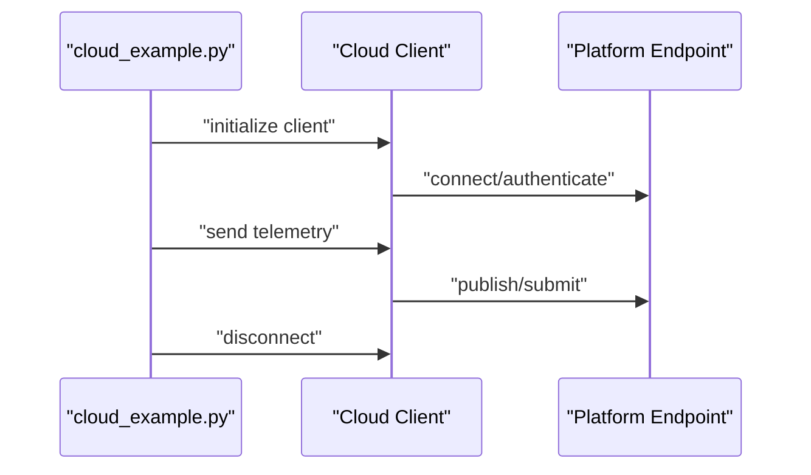

**Diagram sources**
- [cloud_example.py:15-56](file://src/main/examples/cloud_example.py#L15-L56)

**Section sources**
- [cloud_example.py:15-56](file://src/main/examples/cloud_example.py#L15-L56)

### DAC, Cryptography, and Ethernet
This example covers DAC waveform generation and ramping, cryptographic hashing and token signing, SSL context creation, and Ethernet connection with static IP and async connect. It demonstrates how to combine analog output, security, and wired networking.

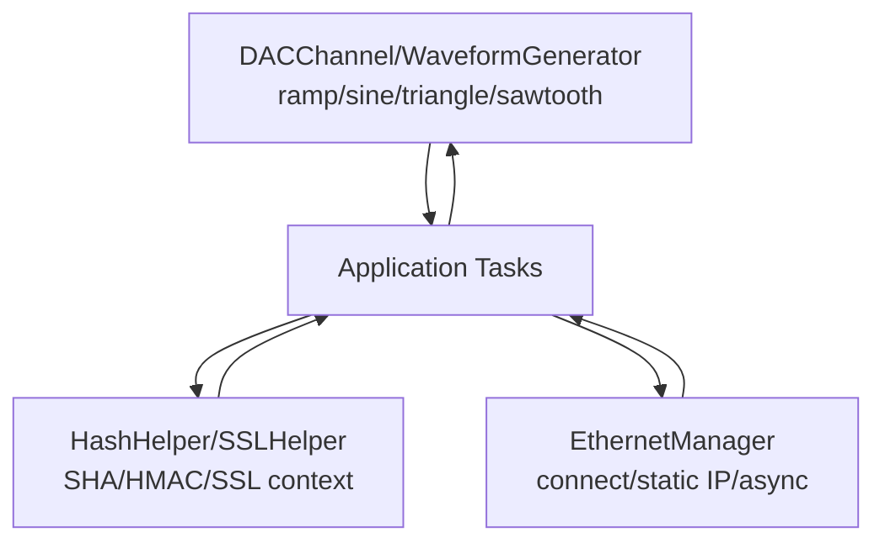

**Diagram sources**
- [dac_crypto_ethernet_example.py:20-114](file://src/main/examples/dac_crypto_ethernet_example.py#L20-L114)
- [dac_crypto_ethernet_example.py:119-203](file://src/main/examples/dac_crypto_ethernet_example.py#L119-L203)
- [dac_crypto_ethernet_example.py:214-226](file://src/main/examples/dac_crypto_ethernet_example.py#L214-L226)
- [dac_crypto_ethernet_example.py:231-265](file://src/main/examples/dac_crypto_ethernet_example.py#L231-L265)
- [dac_crypto_ethernet_example.py:270-299](file://src/main/examples/dac_crypto_ethernet_example.py#L270-L299)

**Section sources**
- [dac_crypto_ethernet_example.py:20-114](file://src/main/examples/dac_crypto_ethernet_example.py#L20-L114)
- [dac_crypto_ethernet_example.py:119-203](file://src/main/examples/dac_crypto_ethernet_example.py#L119-L203)
- [dac_crypto_ethernet_example.py:214-226](file://src/main/examples/dac_crypto_ethernet_example.py#L214-L226)
- [dac_crypto_ethernet_example.py:231-265](file://src/main/examples/dac_crypto_ethernet_example.py#L231-L265)
- [dac_crypto_ethernet_example.py:270-299](file://src/main/examples/dac_crypto_ethernet_example.py#L270-L299)

### Advanced Button and Buzzer Patterns
These examples demonstrate advanced button features (long press, multi-click, duration tracking, pattern recognition) and buzzer capabilities (patterns, Morse code, alarm sequences, melodies, and practical applications). They illustrate event-driven programming and user feedback systems.

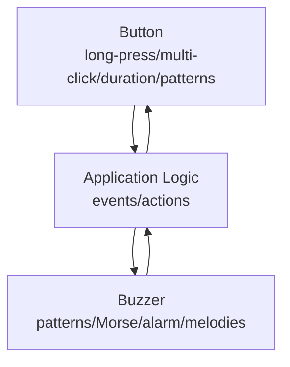

**Diagram sources**
- [button_advanced_example.py:19-201](file://src/main/examples/button_advanced_example.py#L19-L201)
- [buzzer_patterns_example.py:18-117](file://src/main/examples/buzzer_patterns_example.py#L18-L117)

**Section sources**
- [button_advanced_example.py:19-201](file://src/main/examples/button_advanced_example.py#L19-L201)
- [buzzer_patterns_example.py:18-117](file://src/main/examples/buzzer_patterns_example.py#L18-L117)

## Dependency Analysis
The examples depend on the modular library structure. The main dependencies observed across examples include:
- WiFi and BLE for connectivity and provisioning.
- Sensors for multi-interface fusion (I2C/SPI/ADC).
- Audio and CAN for diagnostics and feedback.
- Cloud and system modules for telemetry and OTA.
- Security and cryptography for production-grade protection.

```mermaid
graph TB
EX_MAIN["main.py"]
EX_BOOT["boot_production.py"]
EX_ASYNC["asyncio_examples.py"]
EX_WIFI_PORTAL["wifi_portal_example.py"]
EX_SECURE["secure_production_example.py"]
EX_MQTT["mqtt_example.py"]
EX_HTTP["http_example.py"]
EX_AUDIO_CAN["audio_can_example.py"]
EX_I2C_PWM["i2c_pwm_pin_example.py"]
EX_UART_ADC_SPI["uart_adc_spi_example.py"]
EX_CLOUD["cloud_example.py"]
EX_DAC_CRYPTO_ETH["dac_crypto_ethernet_example.py"]
EX_BTN_BUZZ["button_advanced_example.py + buzzer_patterns_example.py"]
EX_MAIN --> EX_BOOT
EX_MAIN --> EX_ASYNC
EX_MAIN --> EX_WIFI_PORTAL
EX_MAIN --> EX_SECURE
EX_MAIN --> EX_MQTT
EX_MAIN --> EX_HTTP
EX_MAIN --> EX_AUDIO_CAN
EX_MAIN --> EX_I2C_PWM
EX_MAIN --> EX_UART_ADC_SPI
EX_MAIN --> EX_CLOUD
EX_MAIN --> EX_DAC_CRYPTO_ETH
EX_MAIN --> EX_BTN_BUZZ
```

**Diagram sources**
- [main.py:1-84](file://src/main/main.py#L1-L84)
- [boot_production.py:1-56](file://src/main/boot_production.py#L1-L56)
- [asyncio_examples.py:1-234](file://src/main/examples/asyncio_examples.py#L1-L234)
- [wifi_portal_example.py:1-350](file://src/main/examples/wifi_portal_example.py#L1-L350)
- [secure_production_example.py:1-268](file://src/main/examples/secure_production_example.py#L1-L268)
- [mqtt_example.py:1-40](file://src/main/examples/mqtt_example.py#L1-L40)
- [http_example.py:1-43](file://src/main/examples/http_example.py#L1-L43)
- [audio_can_example.py:1-253](file://src/main/examples/audio_can_example.py#L1-L253)
- [i2c_pwm_pin_example.py:1-364](file://src/main/examples/i2c_pwm_pin_example.py#L1-L364)
- [uart_adc_spi_example.py:1-264](file://src/main/examples/uart_adc_spi_example.py#L1-L264)
- [cloud_example.py:1-60](file://src/main/examples/cloud_example.py#L1-L60)
- [dac_crypto_ethernet_example.py:1-326](file://src/main/examples/dac_crypto_ethernet_example.py#L1-L326)
- [button_advanced_example.py:1-321](file://src/main/examples/button_advanced_example.py#L1-L321)
- [buzzer_patterns_example.py:1-180](file://src/main/examples/buzzer_patterns_example.py#L1-L180)

**Section sources**
- [main.py:1-84](file://src/main/main.py#L1-L84)
- [boot_production.py:1-56](file://src/main/boot_production.py#L1-L56)
- [asyncio_examples.py:1-234](file://src/main/examples/asyncio_examples.py#L1-L234)
- [wifi_portal_example.py:1-350](file://src/main/examples/wifi_portal_example.py#L1-L350)
- [secure_production_example.py:1-268](file://src/main/examples/secure_production_example.py#L1-L268)
- [mqtt_example.py:1-40](file://src/main/examples/mqtt_example.py#L1-L40)
- [http_example.py:1-43](file://src/main/examples/http_example.py#L1-L43)
- [audio_can_example.py:1-253](file://src/main/examples/audio_can_example.py#L1-L253)
- [i2c_pwm_pin_example.py:1-364](file://src/main/examples/i2c_pwm_pin_example.py#L1-L364)
- [uart_adc_spi_example.py:1-264](file://src/main/examples/uart_adc_spi_example.py#L1-L264)
- [cloud_example.py:1-60](file://src/main/examples/cloud_example.py#L1-L60)
- [dac_crypto_ethernet_example.py:1-326](file://src/main/examples/dac_crypto_ethernet_example.py#L1-L326)
- [button_advanced_example.py:1-321](file://src/main/examples/button_advanced_example.py#L1-L321)
- [buzzer_patterns_example.py:1-180](file://src/main/examples/buzzer_patterns_example.py#L1-L180)

## Performance Considerations
- Asynchronous orchestration reduces blocking and improves responsiveness across concurrent tasks.
- Efficient resource management: deinitialize peripherals after use to conserve power and memory.
- ADC averaging and smoothing reduce noise and improve stability for sensor fusion.
- SPI and I2C sharing requires careful timing and device-specific delays to prevent bus contention.
- Audio generation and CAN bus operations require precise timing; use appropriate sample rates and baudrates.
- Security operations (hashing, tokens) should be performed judiciously to avoid excessive CPU usage.
- Network operations (MQTT, HTTP, WebSocket) benefit from non-blocking patterns and proper error handling.

[No sources needed since this section provides general guidance]

## Troubleshooting Guide
Common issues and strategies:
- WiFi connectivity failures: Implement keep-alive loops and reconnection logic with exponential backoff.
- Sensor bus conflicts: Ensure unique addresses and proper pull-ups; verify device presence before operations.
- Audio artifacts: Match sample rates to DAC/I2S capabilities; avoid buffer underruns.
- CAN bus errors: Validate filters and baudrate settings; use loopback tests to isolate issues.
- Security breaches: Enable audit logging, enforce rate limiting, and perform emergency wipe when compromised.
- Cloud connectivity: Use SSL contexts with certificate verification; handle network timeouts gracefully.
- Boot protection: Use unlock pin during development; disable during production to prevent unauthorized access.

**Section sources**
- [asyncio_examples.py:76-117](file://src/main/examples/asyncio_examples.py#L76-L117)
- [i2c_pwm_pin_example.py:66-105](file://src/main/examples/i2c_pwm_pin_example.py#L66-L105)
- [audio_can_example.py:123-156](file://src/main/examples/audio_can_example.py#L123-L156)
- [secure_production_example.py:156-178](file://src/main/examples/secure_production_example.py#L156-L178)
- [dac_crypto_ethernet_example.py:231-265](file://src/main/examples/dac_crypto_ethernet_example.py#L231-L265)
- [boot_production.py:24-48](file://src/main/boot_production.py#L24-L48)

## Conclusion
The advanced integration examples showcase how to coordinate multiple hardware interfaces and software modules in constrained environments. By leveraging asynchronous programming, robust security measures, and modular libraries, developers can build resilient, secure, and efficient IoT applications. The patterns demonstrated here—multi-interface sensor fusion, audio/CAN diagnostics, secure production boot, and cloud telemetry—provide a solid foundation for real-world deployments.

[No sources needed since this section summarizes without analyzing specific files]

## Appendices
- Recommended usage order: Connect to WiFi, read sensors, display or output results, send telemetry, persist data, and manage system health.
- Important notes: ESP32-C3 lacks touch support; AWS IoT TLS requires careful RAM planning; deploy the lib folder to /lib on flash.

**Section sources**
- [README.md:43-72](file://src/lib/README.md#L43-L72)