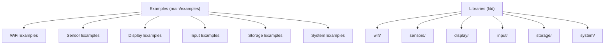
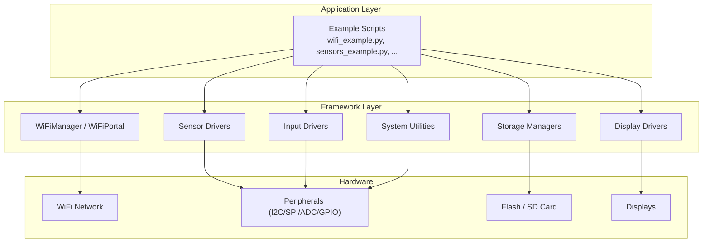
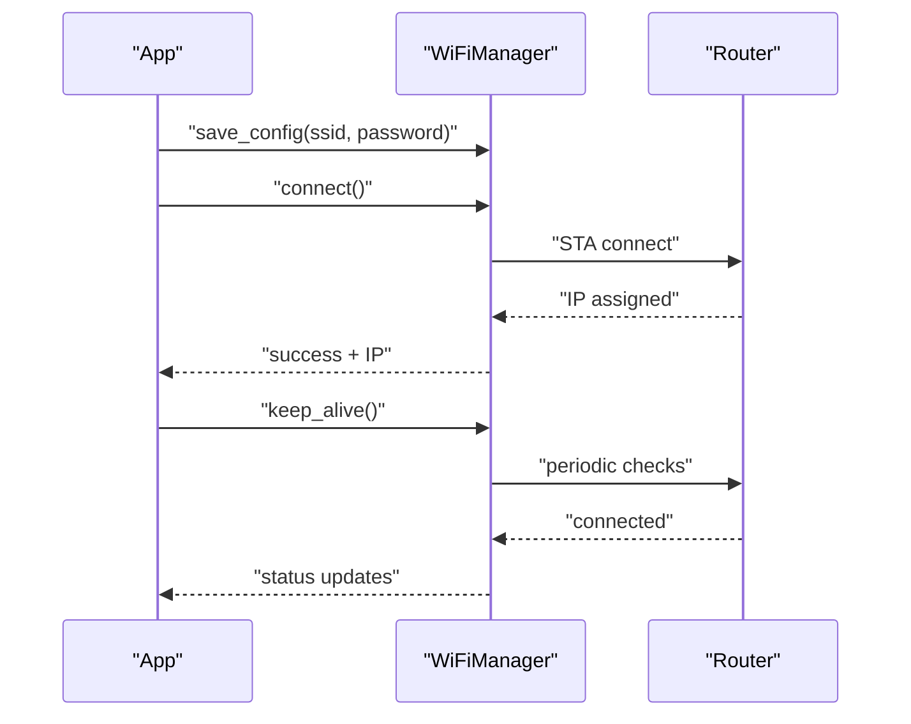
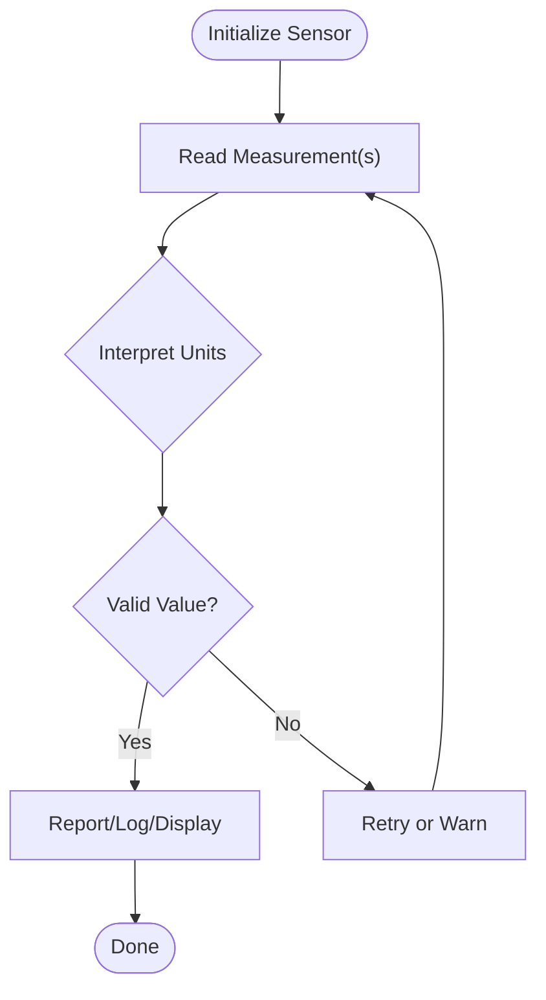
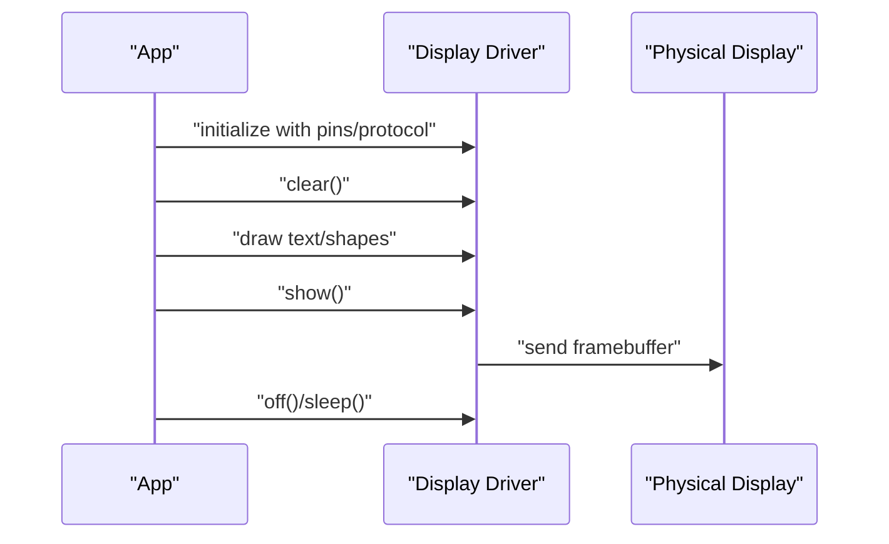
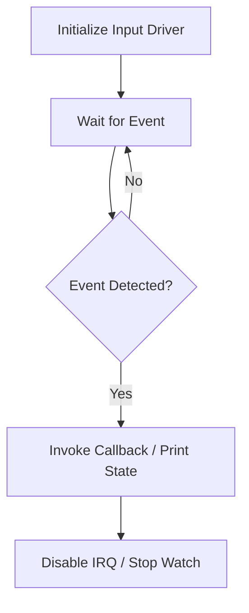
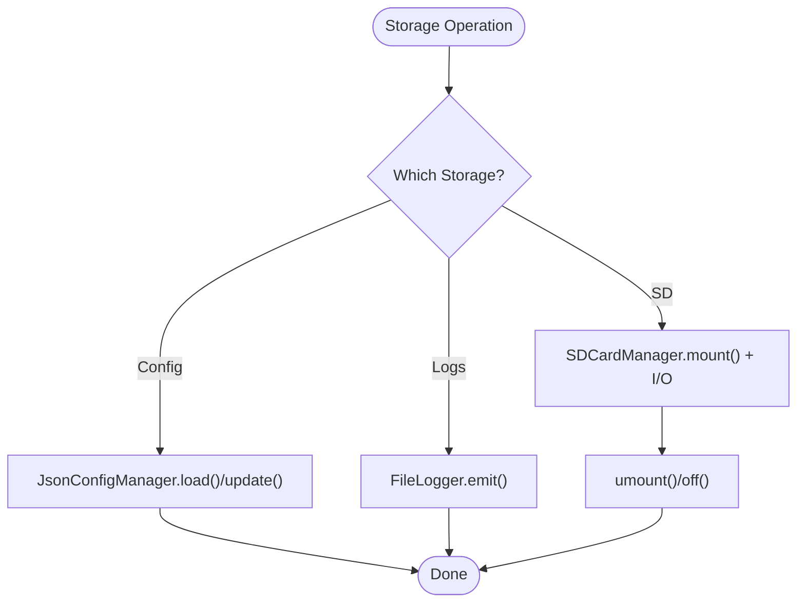
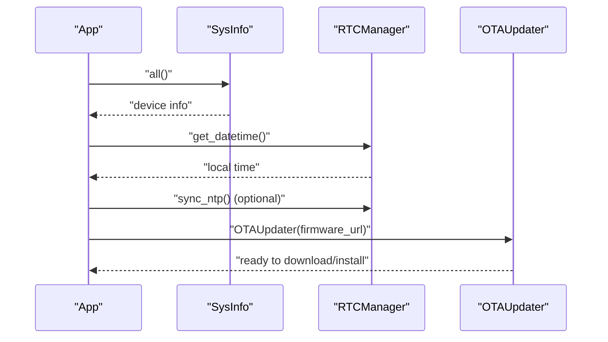
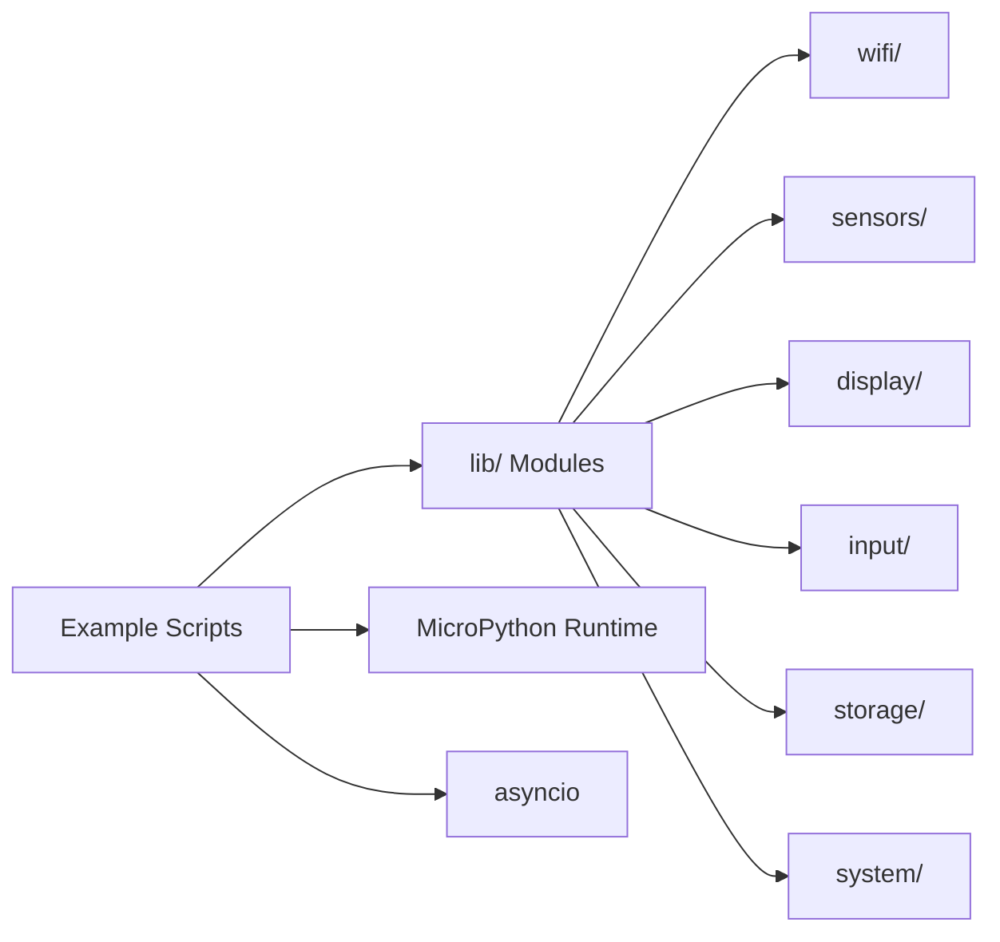

# Basic Examples

<cite>
**Referenced Files in This Document**
- [README.md](file://src/lib/README.md)
- [README_ASYNCIO.md](file://src/main/README_ASYNCIO.md)
- [README_WIFI_MODULE.md](file://src/main/README_WIFI_MODULE.md)
- [wifi_example.py](file://src/main/examples/wifi_example.py)
- [sensors_example.py](file://src/main/examples/sensors_example.py)
- [display_example.py](file://src/main/examples/display_example.py)
- [input_example.py](file://src/main/examples/input_example.py)
- [storage_example.py](file://src/main/examples/storage_example.py)
- [system_example.py](file://src/main/examples/system_example.py)
- [boot_production.py](file://src/main/boot_production.py)
</cite>

## Table of Contents
1. [Introduction](#introduction)
2. [Project Structure](#project-structure)
3. [Core Components](#core-components)
4. [Architecture Overview](#architecture-overview)
5. [Detailed Component Analysis](#detailed-component-analysis)
6. [Dependency Analysis](#dependency-analysis)
7. [Performance Considerations](#performance-considerations)
8. [Troubleshooting Guide](#troubleshooting-guide)
9. [Conclusion](#conclusion)
10. [Appendices](#appendices)

## Introduction
This document provides beginner-friendly, step-by-step basic examples for the ESP32-C3 MicroPython Library Framework. It focuses on five essential domains:
- WiFi connectivity setup
- Sensor data acquisition
- Display output configuration
- Basic input handling
- File storage operations
- System monitoring

Each example includes:
- Prerequisites and hardware requirements
- Step-by-step instructions
- Implementation notes and best practices
- Error handling and resource management guidance
- Troubleshooting tips

The examples are drawn from the repository’s official example files and documentation, ensuring accuracy and alignment with the framework’s patterns.

## Project Structure
The framework organizes functionality into categorized libraries under lib/, with practical examples under main/examples/. The examples demonstrate real-world usage of WiFi, sensors, displays, inputs, storage, and system utilities.

**Section sources**
- [README.md:1-72](file://src/lib/README.md#L1-L72)

## Core Components
This section highlights the foundational building blocks used across the basic examples.

- WiFi connectivity: Managed via WiFiManager and optional WiFiPortal for web-based configuration.
- Sensors: Diverse drivers for temperature, pressure, motion, gas, power monitoring, and more.
- Displays: Support for OLED, TFT, LCD, LED matrices, e-paper, and TJC HMI via UART.
- Inputs: Buttons, rotary encoders, keypads, touch sensors (ESP32-C3 limitation), and joysticks.
- Storage: JSON configuration management, file logging, and SD card operations.
- System: Device information, RTC synchronization, and OTA updates.

Key concepts:
- Asynchronous programming patterns are central to the framework. Use cooperative multitasking with asyncio to avoid blocking the event loop.
- Resource management: Initialize peripherals carefully, guard against missing hardware, and clean up resources when appropriate.

**Section sources**
- [README.md:1-72](file://src/lib/README.md#L1-L72)
- [README_ASYNCIO.md:1-800](file://src/main/README_ASYNCIO.md#L1-L800)

## Architecture Overview
The examples follow a consistent pattern:
- Import and initialize modules
- Configure hardware pins and protocols
- Perform operations (connect, read, draw, log)
- Handle errors gracefully and manage resources

[No sources needed since this diagram shows conceptual workflow, not actual code structure]

## Detailed Component Analysis

### WiFi Connectivity Setup
Goal: Establish and maintain a stable WiFi connection, optionally via a captive portal.

Steps:
1. Prepare environment
   - Ensure the lib/ folder is deployed to the device so imports resolve correctly.
   - Confirm MicroPython supports asyncio for concurrent operations.
2. Basic connection
   - Instantiate WiFiManager.
   - Save credentials once, then connect automatically.
   - Retrieve IP and connection info.
3. Keep-alive mode
   - Enable periodic checks to recover from disconnections.
4. Scan and connect
   - Discover nearby networks and select one to join.
5. Concurrency
   - Run WiFi alongside other tasks using asyncio tasks and gather.
6. Multiple configurations
   - Switch between home/work profiles by selecting different config files.
7. HTTP over WiFi
   - After connecting, perform HTTP requests using standard libraries.
8. Status monitoring
   - Periodically poll status and connection info.
9. Captive portal
   - Start a local AP with a friendly web UI to configure WiFi without hardcoded credentials.

Implementation notes:
- Use save_config() to persist credentials; load_config() to reuse later.
- keep_alive() runs indefinitely until stopped; call stop_keep_alive() to halt.
- WiFiPortal creates an AP and serves a small web UI for configuration.

Common pitfalls:
- Incorrect SSID/password or router downtime.
- Insufficient memory for portal mode.
- Missing network libraries (requests) leading to import errors.

**Diagram sources**
- [wifi_example.py:14-90](file://src/main/examples/wifi_example.py#L14-L90)
- [README_WIFI_MODULE.md:16-94](file://src/main/README_WIFI_MODULE.md#L16-L94)

**Section sources**
- [wifi_example.py:1-338](file://src/main/examples/wifi_example.py#L1-L338)
- [README_WIFI_MODULE.md:1-470](file://src/main/README_WIFI_MODULE.md#L1-L470)

### Sensor Data Acquisition
Goal: Read measurements from various sensors using standardized drivers.

Steps:
1. Import the specific sensor driver.
2. Initialize the sensor with appropriate pins and addresses.
3. Read values and interpret units (e.g., Celsius, hectoPascals, volts).
4. Use advanced features like averaging, calibration, or async monitoring where supported.

Supported sensors (selected):
- DHT22 for temperature/humidity
- BMP280/BME280 for pressure/altitude/humidity
- DS18B20 for 1-Wire temperature
- MPU-6050 for accelerometer/gyroscope
- HC-SR04 ultrasonic distance
- ADS1115 16-bit ADC
- MAX30102 pulse oximeter
- LDR, soil moisture, PIR, RCWL-0516 motion sensors
- MQ gas sensors
- INA219 power monitor
- OH49E Hall effect sensor
- PZEM energy monitors (v1/v2 and v3 Modbus variant)

Best practices:
- Respect pull-up requirements for 1-Wire and I2C devices.
- Use async watch modes for event-driven monitoring.
- Apply calibration constants where provided.
- Handle timeouts and invalid readings gracefully.

**Diagram sources**
- [sensors_example.py:31-473](file://src/main/examples/sensors_example.py#L31-L473)

**Section sources**
- [sensors_example.py:1-529](file://src/main/examples/sensors_example.py#L1-L529)

### Display Output Configuration
Goal: Render text, shapes, and animations on various display types.

Supported displays (selected):
- SSD1306 OLED (I2C)
- ILI9341 TFT (SPI)
- ST7789 TFT (SPI)
- LCD 16x2 via I2C backpack
- MAX7219 LED matrix (SPI)
- E-Paper 2.9" (SPI)
- TJC HMI over UART
- P10 monochrome and RGB LED panels

Steps:
1. Import the display driver.
2. Initialize with correct pins and interface parameters.
3. Draw primitives (text, rectangles, lines) or higher-level helpers (centered text, scroll).
4. Refresh the display and power down when finished.

Notes:
- Some displays require off() or sleep() to conserve power.
- TJC HMI requires UART wiring and a start/stop lifecycle.

**Diagram sources**
- [display_example.py:14-239](file://src/main/examples/display_example.py#L14-L239)

**Section sources**
- [display_example.py:1-240](file://src/main/examples/display_example.py#L1-L240)

### Basic Input Handling
Goal: Detect button presses, encoder rotations, keypad entries, joystick positions, and capacitive touches (where supported).

Supported inputs (selected):
- Button with debouncing and press/release events
- Rotary encoder with position and direction callbacks
- Matrix keypad scanning
- Capacitive touch sensor (not available on ESP32-C3)
- Joystick with analog axes and digital button

Steps:
1. Import the input driver.
2. Initialize with GPIO pins and options (pull-ups, thresholds).
3. Wait for events or register callbacks.
4. Clean up IRQs or disable watchers when done.

Notes:
- ESP32-C3 does not support capacitive touch; the example handles this gracefully.
- Use async-friendly waits and callbacks for responsive UI.

**Diagram sources**
- [input_example.py:12-88](file://src/main/examples/input_example.py#L12-L88)

**Section sources**
- [input_example.py:1-88](file://src/main/examples/input_example.py#L1-L88)

### File Storage Operations
Goal: Persist configuration, log messages, and manage SD card data.

Components:
- JsonConfigManager: Load/update/save structured settings.
- FileLogger: Write logs with levels and rotation policies.
- SDCardManager: Mount, read/write files, and list directories.

Steps:
1. JsonConfigManager
   - Load defaults if missing, update values, and persist.
2. FileLogger
   - Set level and size limits, then emit debug/info/warn/error.
3. SDCardManager
   - Mount with SPI pins and mount point, then write/read/list.

Best practices:
- Validate mount success before I/O.
- Use reasonable log sizes to prevent flash wear.
- Close or unmount resources when finished.

**Diagram sources**
- [storage_example.py:10-62](file://src/main/examples/storage_example.py#L10-L62)

**Section sources**
- [storage_example.py:1-63](file://src/main/examples/storage_example.py#L1-L63)

### System Monitoring
Goal: Inspect device health, synchronize time, and prepare over-the-air updates.

Components:
- SysInfo: Retrieve chip info, firmware version, and memory stats.
- RTCManager: Read/set time; optionally sync via NTP (requires WiFi).
- OTAUpdater: Download and schedule firmware installation.

Steps:
1. SysInfo: Collect and print all system metrics.
2. RTC: Read current time; optionally sync with NTP after connecting to WiFi.
3. OTA: Initialize updater with a firmware URL; download and schedule install.

Notes:
- NTP sync requires an active network connection.
- OTA operations should be tested carefully in development environments.

**Diagram sources**
- [system_example.py:15-42](file://src/main/examples/system_example.py#L15-L42)

**Section sources**
- [system_example.py:1-43](file://src/main/examples/system_example.py#L1-L43)

## Dependency Analysis
The examples depend on the lib/ modules and follow a consistent import pattern. They also rely on MicroPython’s asyncio for concurrency and optional network/file libraries for HTTP and SD operations.

**Section sources**
- [README.md:1-72](file://src/lib/README.md#L1-L72)
- [README_ASYNCIO.md:1-800](file://src/main/README_ASYNCIO.md#L1-L800)

## Performance Considerations
- Prefer asyncio.sleep_ms() for short delays to reduce overhead.
- Use queues and producers/consumers to decouple I/O-heavy tasks.
- Limit queue sizes and periodically call garbage collection in idle tasks.
- Avoid long synchronous operations inside the event loop; yield control frequently.
- Defer heavy computations to background tasks or offload to external modules when possible.

[No sources needed since this section provides general guidance]

## Troubleshooting Guide
- WiFi not connecting
  - Verify SSID/password and router availability.
  - Increase timeout in configuration.
  - Check keep-alive mode and signal strength.
- Configuration not saved
  - Ensure filesystem permissions and available space.
- Portal not opening
  - Confirm sufficient memory and AP mode support.
  - Reduce concurrent services during portal startup.
- No HTTP response
  - Ensure WiFi is connected before making requests.
  - Handle import differences for HTTP libraries.
- Sensor reads fail
  - Check wiring, pull-ups, and addresses.
  - Use async watch modes to avoid blocking.
- Display not updating
  - Ensure show() is called after drawing.
  - Verify correct pin assignments and protocol settings.
- Storage errors
  - Confirm SD card is mounted before I/O.
  - Manage log file sizes to prevent overflow.
- System utilities
  - NTP sync requires WiFi; OTA downloads should be validated before installation.

**Section sources**
- [README_WIFI_MODULE.md:438-470](file://src/main/README_WIFI_MODULE.md#L438-L470)
- [wifi_example.py:222-338](file://src/main/examples/wifi_example.py#L222-L338)

## Conclusion
These basic examples demonstrate how to build reliable, asynchronous applications on ESP32-C3 using the framework’s modular libraries. By following the outlined steps, best practices, and troubleshooting tips, you can confidently implement WiFi connectivity, acquire sensor data, drive displays, handle inputs, manage storage, and monitor system health.

[No sources needed since this section summarizes without analyzing specific files]

## Appendices

### Beginner’s Checklist
- Deploy lib/ to the device and import sys.path.append('/lib') at runtime.
- Use asyncio for all concurrent operations.
- Start with minimal hardware and expand incrementally.
- Test each module independently before integrating.
- Keep configuration files separate per environment (home/work).
- Back up critical data to SD or remote services.

### Production Boot Protection (Optional)
- Use boot_production.py to lockdown the device at boot.
- Optional unlock pin allows development mode.
- After lockdown, REPL and remote access are disabled until unlocked or updated via OTA/esptool.

**Section sources**
- [boot_production.py:1-56](file://src/main/boot_production.py#L1-L56)