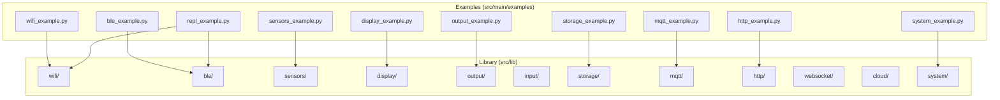
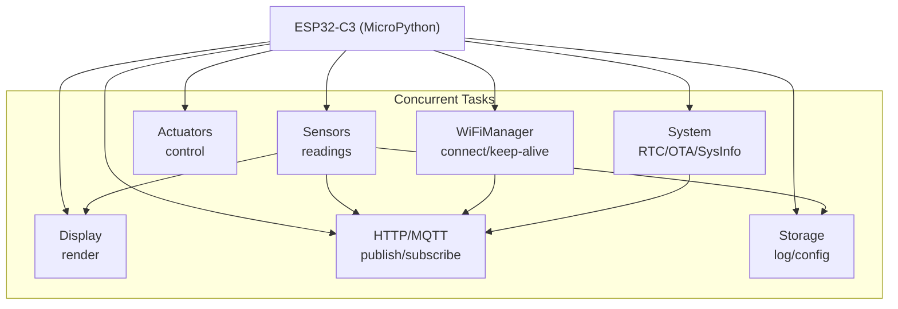
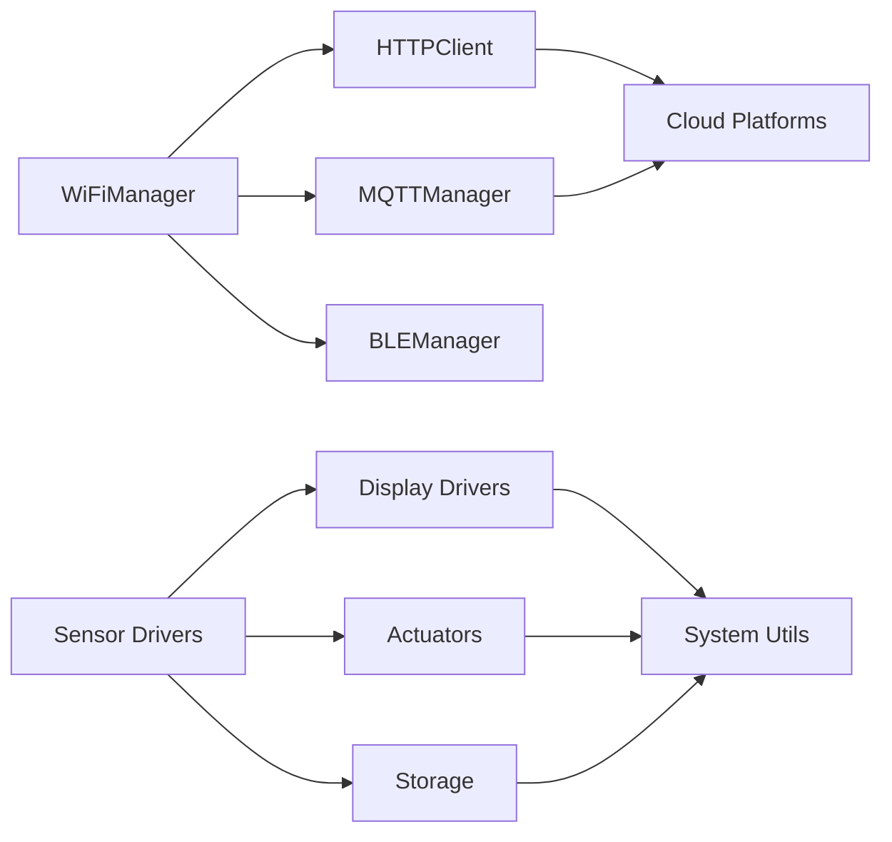

# Examples & Showcase

<cite>
**Referenced Files in This Document**
- [README.md](file://src/lib/README.md)
- [README.md](file://src/main/examples/README.md)
- [README_ASYNCIO.md](file://src/main/README_ASYNCIO.md)
- [README_WIFI_MODULE.md](file://src/main/README_WIFI_MODULE.md)
- [README_BLE_MODULE.md](file://src/main/README_BLE_MODULE.md)
- [wifi_example.py](file://src/main/examples/wifi_example.py)
- [ble_example.py](file://src/main/examples/ble_example.py)
- [sensors_example.py](file://src/main/examples/sensors_example.py)
- [display_example.py](file://src/main/examples/display_example.py)
- [output_example.py](file://src/main/examples/output_example.py)
- [storage_example.py](file://src/main/examples/storage_example.py)
- [system_example.py](file://src/main/examples/system_example.py)
- [http_example.py](file://src/main/examples/http_example.py)
- [mqtt_example.py](file://src/main/examples/mqtt_example.py)
- [repl_example.py](file://src/main/examples/repl_example.py)
</cite>

## Table of Contents
1. [Introduction](#introduction)
2. [Project Structure](#project-structure)
3. [Core Components](#core-components)
4. [Architecture Overview](#architecture-overview)
5. [Detailed Component Analysis](#detailed-component-analysis)
6. [Dependency Analysis](#dependency-analysis)
7. [Performance Considerations](#performance-considerations)
8. [Troubleshooting Guide](#troubleshooting-guide)
9. [Conclusion](#conclusion)
10. [Appendices](#appendices)

## Introduction
This document presents a comprehensive Examples & Showcase for the ESP32-C3 MicroPython Library Framework. It demonstrates practical, reproducible examples across all major feature categories: WiFi connectivity, BLE, sensors, displays, actuators, storage, system utilities, HTTP, MQTT, and remote REPL. Each example includes step-by-step walkthroughs, implementation notes, error handling strategies, performance considerations, and troubleshooting tips. The content is designed to support learners from beginner to advanced levels, with clear guidance for adapting examples to real-world IoT projects.

## Project Structure
The repository organizes the library under src/lib and showcases usage in src/main/examples. The examples directory README provides a categorized index of all example files and cross-references to hardware/protocol coverage and typical use cases.

**Diagram sources**
- [README.md:1-72](file://src/lib/README.md#L1-L72)
- [README.md:1-403](file://src/main/examples/README.md#L1-L403)

**Section sources**
- [README.md:1-72](file://src/lib/README.md#L1-L72)
- [README.md:1-403](file://src/main/examples/README.md#L1-L403)

## Core Components
This section highlights the primary modules and their roles, along with recommended usage order and cross-module integration patterns.

- WiFi Manager: Establishes STA connections, supports keep-alive, scanning, and configuration portal workflows.
- BLE Manager: Provides GATT server/client, UART service, sensor streaming, and callbacks for remote control.
- Sensors: Broad driver set for environmental, motion, power, gas, and air quality measurements.
- Display: Drivers for OLED, TFT, LCD, LED matrices, e-paper, and TJC HMI.
- Output/Actuators: Neopixels, servos, DC motors, steppers, relays, buzzers, and PWM LEDs.
- Storage: JSON config manager, file logging, and SD card operations.
- System: SysInfo, RTC, OTA updates.
- HTTP/MQTT/Cloud/WebSocket: Networking clients and integrations for cloud platforms.
- REPL: Multi-transport remote command interface via TCP, UART, and BLE.

Recommended workflow order:
1) WiFi
2) Sensors
3) Display or Output
4) MQTT/HTTP/Cloud
5) Storage
6) System

**Section sources**
- [README.md:22-51](file://src/lib/README.md#L22-L51)

## Architecture Overview
The examples demonstrate a layered, cooperative multitasking architecture using asyncio. WiFi, BLE, networking, and peripheral tasks run concurrently, coordinated via asyncio tasks, events, queues, and timeouts. The examples also illustrate modular composition: a single program can orchestrate sensor reads, display updates, network publishing, and storage logging simultaneously.

[No sources needed since this diagram shows conceptual workflow, not actual code structure]

## Detailed Component Analysis

### WiFi Connectivity Examples
This category covers basic connection, keep-alive, scanning, concurrent tasks, multiple configurations, HTTP requests, status monitoring, and the configuration portal.

- Basic connect and status retrieval
- Direct connect without persistent config
- Keep-alive with periodic reconnection checks
- Network scanning and selection
- Running WiFi alongside other tasks
- Multiple configuration profiles
- WiFi + HTTP request
- Continuous status monitoring
- Configuration portal for offline setup

Implementation notes:
- Use asyncio tasks to keep WiFi alive while other tasks run.
- Prefer configuration portals for user-friendly setup.
- Guard HTTP requests with connection checks.

Error handling:
- Gracefully handle connection failures and timeouts.
- Stop keep-alive loops on keyboard interrupt.

Performance:
- Tune reconnect intervals to balance responsiveness and power usage.

**Section sources**
- [wifi_example.py:14-338](file://src/main/examples/wifi_example.py#L14-L338)
- [README_WIFI_MODULE.md:1-470](file://src/main/README_WIFI_MODULE.md#L1-L470)

### BLE Examples
This category demonstrates BLE server, UART transport, sensor streaming, callbacks, concurrent BLE + WiFi, LED control, iBeacon advertising, and client scanning.

- Basic BLE server with status reporting
- BLE UART echo and response
- Sensor streaming with periodic updates
- Callback-driven event handling
- Coexistence with WiFi via asyncio.gather
- Remote LED control via BLE writes
- iBeacon advertisement loop
- Client-side scanning and connection (conceptual)

Implementation notes:
- Register callbacks for connect/disconnect/write/read events.
- Use asyncio tasks for continuous monitoring and streaming.
- Combine BLE and WiFi by launching separate tasks.

Error handling:
- Stop BLE gracefully on keyboard interrupt.
- Validate device availability and advertising limits.

Performance:
- Limit advertised services and payload sizes for memory-constrained boards.

**Section sources**
- [ble_example.py:14-408](file://src/main/examples/ble_example.py#L14-L408)
- [README_BLE_MODULE.md:1-526](file://src/main/README_BLE_MODULE.md#L1-L526)

### Sensor Data Collection Examples
This category showcases drivers for DHT, BMP280/BME280, DS18B20, MPU-6050, HC-SR04, ADS1115, MAX30102, LDR, soil moisture, PIR, RCWL-0516, MQ gas, INA219, OH49E, PZEM-004T v1/v2/v3, and PM sensors.

- Single-shot and averaged readings
- Multi-sensor I2C/SPI bus sharing
- Asynchronous watch modes and callbacks
- Calibration and unit conversions
- Async monitoring loops

Implementation notes:
- Use async watch methods for non-blocking detection.
- Apply median filtering for robust distance measurements.
- Calibrate analog sensors for accurate percentages.

Error handling:
- Handle sensor timeouts and invalid readings.
- Gracefully skip unavailable sensors.

Performance:
- Batch reads where supported to reduce bus overhead.

**Section sources**
- [sensors_example.py:31-529](file://src/main/examples/sensors_example.py#L31-L529)

### Display Output Examples
This category includes SSD1306 OLED, ILI9341 TFT, ST7789 TFT, LCD I2C, MAX7219 LED matrix, E-Paper 2.9", TJC HMI, and P10 LED panels.

- Drawing primitives, text, and shapes
- Backlight control and sleep modes
- Scrolling text and graphics
- TJC HMI widget manipulation

Implementation notes:
- Initialize displays with correct pins and offsets.
- Use async delays between frames for smooth animation.

Error handling:
- Verify I2C addresses and wiring.
- Handle display off/sleep transitions.

Performance:
- Minimize redraws and use show() sparingly.

**Section sources**
- [display_example.py:14-240](file://src/main/examples/display_example.py#L14-L240)

### Output and Actuator Examples
This category covers NeoPixels, servos, DC motors, steppers, relays, buzzers, and PWM LEDs.

- Pixel effects, color wipes, rainbow cycles
- Servo sweeps and centering
- Motor forward/backward/brake
- Stepper rotation and enable/disable
- Relay on/off and timed operations
- Melodies and beep patterns
- PWM fades and blinking

Implementation notes:
- Use proper PWM frequencies for servos and LEDs.
- Enable steppers only when needed to save power.

Error handling:
- Deinitialize peripherals to free resources.
- Handle invalid angles or speeds.

Performance:
- Batch LED updates and limit update rates.

**Section sources**
- [output_example.py:14-251](file://src/main/examples/output_example.py#L14-L251)

### Storage and Logging Examples
This category includes JSON configuration management, file logging with rotation, and SD card operations.

- Load/update JSON configs
- Write logs with levels and rotation
- Mount SD, write/read files, list entries

Implementation notes:
- Choose appropriate max_bytes for log rotation.
- Unmount SD safely after operations.

Error handling:
- Skip SD operations if mount fails.
- Handle missing files gracefully.

Performance:
- Limit log verbosity in production.

**Section sources**
- [storage_example.py:10-63](file://src/main/examples/storage_example.py#L10-L63)

### System Utilities Examples
This category covers system information, RTC synchronization, and OTA update preparation.

- Chip info, memory, and firmware version
- RTC get/set and optional NTP sync
- OTA updater setup and scheduling

Implementation notes:
- RTC NTP requires WiFi connectivity.
- OTA downloads and installs firmware images.

Error handling:
- Validate system calls and handle exceptions.

Performance:
- Avoid frequent RTC queries.

**Section sources**
- [system_example.py:15-43](file://src/main/examples/system_example.py#L15-L43)

### HTTP Client Example
This example demonstrates making GET requests with query parameters and handling responses.

- Constructing requests and reading status/text
- Proper response lifecycle management

Implementation notes:
- Close responses to free resources.
- Handle network errors and timeouts.

**Section sources**
- [http_example.py:12-43](file://src/main/examples/http_example.py#L12-L43)

### MQTT Client Example
This example shows connecting to a public broker, subscribing to topics, publishing messages, and processing incoming data.

- Client initialization and connection
- Topic subscription and message handling
- Publishing and periodic listening

Implementation notes:
- Use non-blocking loops and periodic check_msg calls.
- Disconnect cleanly on exit.

**Section sources**
- [mqtt_example.py:12-40](file://src/main/examples/mqtt_example.py#L12-L40)

### Remote REPL Examples
This category demonstrates local command dispatch, TCP REPL over WiFi, UART REPL over serial, BLE REPL, and multi-transport coordination.

- Basic command dispatcher with built-in commands
- TCP REPL with optional password protection
- UART REPL with GPIO/ADC commands
- BLE REPL with device discovery
- Multi-transport with shared dispatcher and auto-telemetry

Implementation notes:
- Use shared dispatchers to avoid duplicating commands.
- Enable WebREPL for browser-based access.

Error handling:
- Graceful shutdown of REPL servers.
- Validate transport availability.

Performance:
- Avoid long BLE responses; chunk large outputs.

**Section sources**
- [repl_example.py:31-392](file://src/main/examples/repl_example.py#L31-L392)

### Advanced Integration Scenarios
These scenarios combine multiple modules for realistic IoT applications.

- Weather station: sensors + WiFi + MQTT
- Robot control: actuators + input + BLE
- Smart home: outputs + sensors + MQTT
- Data logger: sensors + storage + timer/RTC
- Remote debugging: REPL over TCP/UART/BLE
- IoT dashboard: cloud + MQTT + WiFi
- Audio player: I2S + DAC
- Vehicle diagnostics: CAN OBD-II
- GPIO expansion: I/O expanders
- Security/crypto: hashing, tokens, SSL

Implementation notes:
- Orchestrate tasks with asyncio.gather.
- Use locks for shared peripherals (I2C/SPI).
- Implement watchdogs and keep-alives for reliability.

**Section sources**
- [README.md:380-394](file://src/main/examples/README.md#L380-L394)

## Dependency Analysis
The examples illustrate dependencies and coupling across modules. WiFi and BLE often coexist, sensors feed display and network layers, and storage persists configuration and logs. The examples emphasize loose coupling via asyncio tasks and shared dispatchers.

[No sources needed since this diagram shows conceptual relationships, not specific code structure]

## Performance Considerations
- Prefer cooperative multitasking with asyncio.sleep and asyncio.sleep_ms.
- Use queues and events for inter-task communication.
- Limit queue sizes and periodically call garbage collection in idle tasks.
- Avoid blocking operations; use async I/O everywhere.
- Tune reconnect intervals and advertising parameters to balance connectivity and power.
- Minimize display redraws and batching updates where possible.

**Section sources**
- [README_ASYNCIO.md:765-800](file://src/main/README_ASYNCIO.md#L765-L800)

## Troubleshooting Guide
Common issues and resolutions:

- WiFi
  - Cannot connect: verify SSID/password, router availability, and increase timeout.
  - Config not saved: check filesystem permissions and available space.
  - Keep-alive not working: ensure keep_alive task runs continuously.
  - Portal not opening: confirm AP mode support and sufficient memory.

- BLE
  - Not advertising: check device availability and firmware support.
  - No data received: verify connection state and characteristic handles.
  - Memory errors: reduce number of services and payload sizes.

- Sensors
  - Invalid readings: check wiring, pull-ups, and calibration.
  - I2C bus conflicts: ensure unique addresses and shared bus patterns.

- Displays
  - Blank screen: verify wiring, initialization parameters, and power.
  - Slow updates: minimize redraws and use show() efficiently.

- Outputs
  - Servo jitter: adjust PWM frequency and duty cycle.
  - Motor not moving: verify wiring and enable pins.

- Storage
  - SD mount fails: check wiring and filesystem health.
  - Logs not rotating: verify max_bytes and file permissions.

- System
  - RTC not syncing: ensure WiFi availability for NTP.
  - OTA download/install issues: validate URLs and firmware compatibility.

**Section sources**
- [README_WIFI_MODULE.md:438-462](file://src/main/README_WIFI_MODULE.md#L438-L462)
- [README_BLE_MODULE.md:456-477](file://src/main/README_BLE_MODULE.md#L456-L477)

## Conclusion
The ESP32-C3 MicroPython Library Framework provides a rich set of modules and examples for building robust IoT applications. By following the recommended workflows, leveraging asyncio patterns, and applying the troubleshooting and performance guidance herein, you can rapidly prototype and deploy solutions ranging from simple sensor dashboards to complex, multi-transport remote control systems.

## Appendices

### Getting Started Checklist
- Deploy the lib folder to /lib on the device.
- Run individual example scripts from /main/examples.
- Adapt pin assignments and hardware connections to your setup.
- Use configuration portals for WiFi setup when needed.
- Gradually combine modules for advanced integrations.

### Reproducibility Tips
- Comment/uncomment example sections to test incrementally.
- Save and reuse configurations for WiFi and BLE.
- Use async patterns consistently to avoid blocking behavior.
- Validate hardware connections before running network-dependent examples.