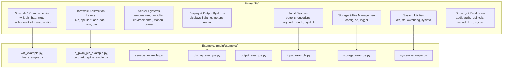
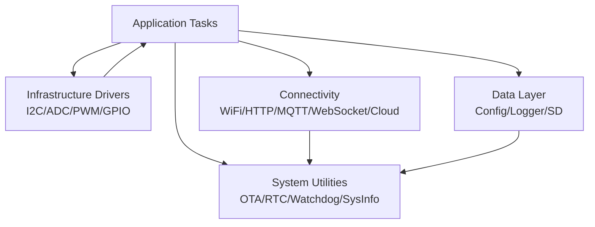
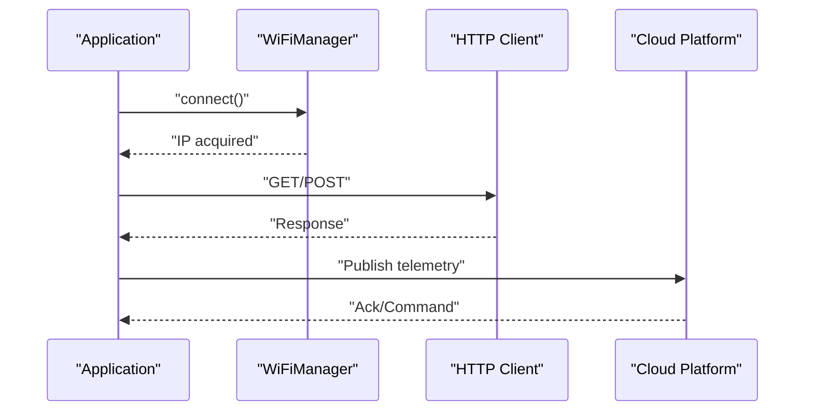
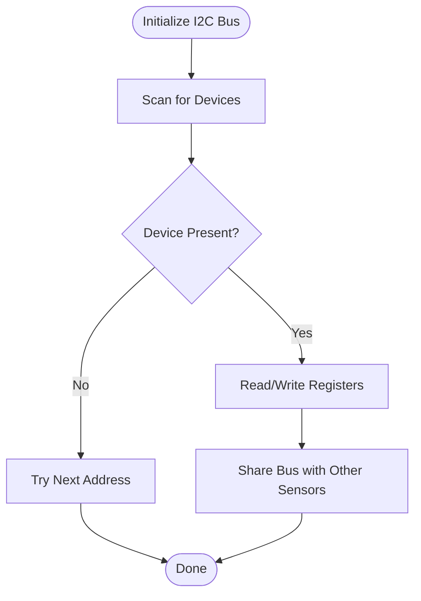
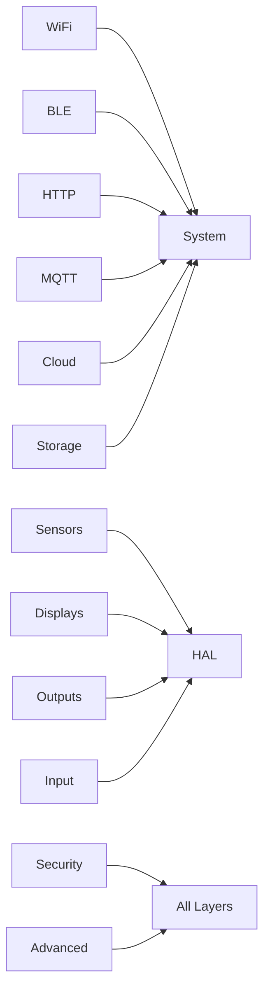

# Feature Categories

<cite>
**Referenced Files in This Document**
- [README.md](file://src/lib/README.md)
- [README_BLE_MODULE.md](file://src/main/README_BLE_MODULE.md)
- [README_WIFI_MODULE.md](file://src/main/README_WIFI_MODULE.md)
- [List_module.md](file://src/List_module.md)
- [Task.md](file://src/Task.md)
- [wifi_example.py](file://src/main/examples/wifi_example.py)
- [ble_example.py](file://src/main/examples/ble_example.py)
- [sensors_example.py](file://src/main/examples/sensors_example.py)
- [display_example.py](file://src/main/examples/display_example.py)
- [output_example.py](file://src/main/examples/output_example.py)
- [i2c_pwm_pin_example.py](file://src/main/examples/i2c_pwm_pin_example.py)
- [uart_adc_spi_example.py](file://src/main/examples/uart_adc_spi_example.py)
- [input_example.py](file://src/main/examples/input_example.py)
- [storage_example.py](file://src/main/examples/storage_example.py)
- [system_example.py](file://src/main/examples/system_example.py)
</cite>

## Table of Contents
1. [Introduction](#introduction)
2. [Project Structure](#project-structure)
3. [Core Components](#core-components)
4. [Architecture Overview](#architecture-overview)
5. [Detailed Component Analysis](#detailed-component-analysis)
6. [Dependency Analysis](#dependency-analysis)
7. [Performance Considerations](#performance-considerations)
8. [Troubleshooting Guide](#troubleshooting-guide)
9. [Conclusion](#conclusion)
10. [Appendices](#appendices)

## Introduction
This document presents a comprehensive overview of the ESP32-C3 feature categories implemented in the repository. It organizes functionality into 12+ categories, explains purpose and typical use cases, highlights integration patterns, and documents architectural relationships and cross-category dependencies. The goal is to help you select appropriate modules for your projects and understand how they work together.

## Project Structure
The repository follows a modular structure under src/lib organized by functional categories. Each category contains cohesive modules and examples demonstrating usage patterns. The top-level overview and category listings are defined in the library overview and module list.

**Diagram sources**
- [README.md:1-72](file://src/lib/README.md#L1-L72)
- [List_module.md:9-358](file://src/List_module.md#L9-L358)

**Section sources**
- [README.md:1-72](file://src/lib/README.md#L1-L72)
- [List_module.md:9-358](file://src/List_module.md#L9-L358)

## Core Components
This section summarizes the primary categories and their responsibilities, derived from the library overview and module list.

- Network & Communication: WiFi, BLE, HTTP, MQTT, WebSocket, Ethernet, Audio I2S
- Hardware Abstraction Layers: I2C, SPI, UART, ADC, DAC, PWM, Digital GPIO
- Sensor Systems: Temperature, humidity, environmental, motion, power, gas, light, soil, PIR, radar, heart rate, current/power
- Display & Output Systems: OLED/TFT/LCD/E-paper, LED matrices, P10 panels, motors, servos, steppers, relays, buzzers, IR remote
- Input Systems: Buttons, rotary encoders, keypads, joystick, capacitive touch (ESP32/S2/S3 only)
- Storage & File Management: JSON config, SD card, file logger
- System Utilities: OTA updates, RTC/NTP, deep sleep, watchdog, system info
- Security & Production: Audit logging, authentication, REPL lock, secret store, cryptography
- Advanced Topics: REPL over TCP/UART/BLE/Web, command dispatch, timers, CAN bus, cloud integrations

Typical integration pattern:
- Start with Network (WiFi/Portal) and System (OTA/RTC/SysInfo)
- Read sensors and optionally log/store data
- Drive displays/outputs and accept inputs
- Publish telemetry via HTTP/MQTT/WebSocket or cloud platforms
- Secure and manage secrets

**Section sources**
- [README.md:5-21](file://src/lib/README.md#L5-L21)
- [List_module.md:11-28](file://src/List_module.md#L11-L28)
- [Task.md:9-32](file://src/Task.md#L9-L32)

## Architecture Overview
The system architecture emphasizes layered integration:
- Application layer orchestrates tasks and workflows
- Infrastructure layer provides foundational drivers (I2C, SPI, UART, ADC/PWM/GPIO)
- Connectivity layer handles network protocols and cloud integrations
- Data layer manages persistence (internal flash, SD card)
- System layer ensures reliability and lifecycle management (OTA, watchdog, RTC)

[No sources needed since this diagram shows conceptual workflow, not actual code structure]

## Detailed Component Analysis

### Network & Communication
Purpose:
- Establish and maintain connectivity to local networks and the internet
- Enable real-time messaging and cloud integration

Key modules:
- WiFi: STA mode, configuration portal, keep-alive monitoring
- BLE: GATT server/client, UART service, sensor streaming, callbacks
- HTTP: client and server capabilities
- MQTT: client with auto-reconnect and QoS support
- WebSocket: client/server per RFC 6455
- Ethernet: LAN8720 transceiver over SPI
- Audio I2S: DAC playback

Typical use cases:
- Home automation hub with Wi-Fi portal setup
- BLE remote control or sensor streaming
- Telemetry publishing via HTTP/MQTT/WebSocket
- Cloud dashboards and mobile apps

Integration patterns:
- WiFi first, then HTTP/MQTT/WebSocket/cloud
- BLE can coexist with WiFi using cooperative tasks
- Use keep-alive to maintain connectivity

**Diagram sources**
- [wifi_example.py:13-338](file://src/main/examples/wifi_example.py#L13-L338)
- [ble_example.py:13-408](file://src/main/examples/ble_example.py#L13-L408)

**Section sources**
- [README.md:9-19](file://src/lib/README.md#L9-L19)
- [List_module.md:131-139](file://src/List_module.md#L131-L139)
- [README_WIFI_MODULE.md:1-470](file://src/main/README_WIFI_MODULE.md#L1-L470)
- [README_BLE_MODULE.md:1-526](file://src/main/README_BLE_MODULE.md#L1-L526)

### Hardware Abstraction Layers
Purpose:
- Provide generic, reusable drivers for peripherals
- Reduce complexity and improve portability across devices

Key modules:
- I2C: bus scanning, register ops, shared bus with multiple devices
- SPI: bus operations, per-device CS management, frame transfers
- UART: basic driver, frame parser with CRC and delimiters
- ADC: channel reading, averaging, smoothing, calibration
- DAC: waveform generation (sine/triangle/sawtooth)
- PWM: frequency/duty control, servo mapping
- Digital GPIO: input/output with debouncing, interrupts, edge detection

Typical use cases:
- Multi-sensor I2C bus sharing
- SPI device chaining with per-device CS
- ADC-based sensor patterns (battery, soil, light)
- PWM dimming and servo positioning

Integration patterns:
- Use generic drivers to abstract hardware differences
- Combine with sensor drivers for higher-level operations
- Manage timing carefully for real-time constraints

**Diagram sources**
- [i2c_pwm_pin_example.py:20-148](file://src/main/examples/i2c_pwm_pin_example.py#L20-L148)
- [uart_adc_spi_example.py:18-244](file://src/main/examples/uart_adc_spi_example.py#L18-L244)

**Section sources**
- [List_module.md:116-128](file://src/List_module.md#L116-L128)
- [List_module.md:208-215](file://src/List_module.md#L208-L215)
- [i2c_pwm_pin_example.py:17-364](file://src/main/examples/i2c_pwm_pin_example.py#L17-L364)
- [uart_adc_spi_example.py:1-264](file://src/main/examples/uart_adc_spi_example.py#L1-L264)

### Sensor Systems
Purpose:
- Acquire environmental, physical, and biological measurements
- Provide calibrated and filtered readings

Key modules:
- Temperature/Humidity: DHT, BMP280/BME280, DS18B20
- Environmental: LDR, soil moisture, air quality sensors
- Motion: PIR, radar sensors
- Power: INA219, PZEM series, MQ gas sensors
- Biometric: MAX30102 (heart rate/spO2)
- Position/IMU: MPU-6050/9250
- Distance: HC-SR04 ultrasonic

Typical use cases:
- Weather station with multiple sensors
- Smart agriculture monitoring
- Health tracking and safety alerts
- Energy monitoring and fault detection

Integration patterns:
- Use I2C/SPI/ADC drivers consistently
- Apply averaging/smoothing for noisy signals
- Calibrate sensors when necessary

**Section sources**
- [List_module.md:32-56](file://src/List_module.md#L32-L56)
- [sensors_example.py:1-529](file://src/main/examples/sensors_example.py#L1-L529)

### Display & Output Systems
Purpose:
- Present information visually and actuate mechanical/electrical systems

Key modules:
- Displays: OLED (SSD1306), TFT (ILI9341, ST7789), LCD via I2C, E-paper, LED matrix (MAX7219), TJC HMI, P10 panels
- Lighting: NeoPixels, PWM LEDs, RGB LEDs
- Motors: Servos, DC motors, steppers (various drivers)
- Audio: Buzzer (active/passive), IR remote

Typical use cases:
- Dashboard with OLED/TFT
- Signage with P10 panels
- Robotic control with servos/steppers
- Audio feedback and remote control

Integration patterns:
- Initialize display drivers with correct pins/interfaces
- Use PWM for brightness and precise control
- Coordinate actuators with sensor feedback loops

**Section sources**
- [List_module.md:59-71](file://src/List_module.md#L59-L71)
- [List_module.md:74-91](file://src/List_module.md#L74-L91)
- [display_example.py:1-240](file://src/main/examples/display_example.py#L1-L240)
- [output_example.py:1-251](file://src/main/examples/output_example.py#L1-L251)

### Input Systems
Purpose:
- Capture user interactions and environmental triggers

Key modules:
- Buttons, rotary encoders, keypads
- Joystick with analog axes and switch
- Capacitive touch (ESP32/S2/S3 only)

Typical use cases:
- Control panels and kiosks
- Navigation and menu selection
- Gesture-based interfaces

Integration patterns:
- Debounce inputs for reliable detection
- Use interrupts for responsive handling
- Map inputs to application actions

**Section sources**
- [List_module.md:94-103](file://src/List_module.md#L94-L103)
- [input_example.py:1-88](file://src/main/examples/input_example.py#L1-L88)

### Storage & File Management
Purpose:
- Persist configuration, logs, and data to internal flash or SD card

Key modules:
- JSON configuration manager
- File logger with rotation
- SD card manager (SPI-based)

Typical use cases:
- Store device settings and calibration data
- Log operational events and sensor readings
- Archive data to SD for long-term retention

Integration patterns:
- Use JSON config for small persistent settings
- Use file logger for structured logs with levels
- Use SD card for larger datasets or archival

**Section sources**
- [List_module.md:154-161](file://src/List_module.md#L154-L161)
- [storage_example.py:1-63](file://src/main/examples/storage_example.py#L1-L63)

### System Utilities
Purpose:
- Ensure robust operation, maintenance, and lifecycle management

Key modules:
- OTA updater via HTTP
- RTC with NTP synchronization
- Deep sleep manager
- Watchdog manager
- System info (RAM, CPU, chip ID, reset reason)

Typical use cases:
- Over-the-air firmware updates
- Reliable timekeeping and scheduling
- Power-aware operation and recovery
- Diagnostics and monitoring

Integration patterns:
- Schedule OTA downloads during maintenance windows
- Sync RTC periodically after network availability
- Use watchdog to protect against hangs
- Monitor system info for health insights

**Section sources**
- [List_module.md:164-173](file://src/List_module.md#L164-L173)
- [system_example.py:1-43](file://src/main/examples/system_example.py#L1-L43)

### Security & Production
Purpose:
- Protect systems and enable secure operations

Key modules:
- Audit logger with timestamps
- Authentication provider
- REPL lock with token-based access
- Secret store with encryption (PBKDF2 + AES)
- Security manager coordinating policies

Typical use cases:
- Compliance logging and audit trails
- Controlled access to development interfaces
- Secure storage of credentials and keys
- Production hardening and policy enforcement

Integration patterns:
- Enforce REPL locks in production builds
- Rotate secrets and audit access
- Centralize security decisions via security manager

**Section sources**
- [List_module.md:176-185](file://src/List_module.md#L176-L185)

### Advanced Topics
Purpose:
- Extend capabilities for specialized scenarios

Key modules:
- REPL over TCP/UART/BLE/Web with command dispatch
- Crypto helpers (hashes, HMAC, AES, base64, PBKDF2, TLS)
- Timers (hardware/software)
- CAN bus (TWAI transceiver)
- Cloud integrations (ThingsBoard, Adafruit IO, Blynk, Firebase, AWS IoT)

Typical use cases:
- Remote diagnostics and scripting
- Encrypted communications and storage
- Industrial-grade telemetry and control
- Multi-platform dashboards and analytics

Integration patterns:
- Use crypto primitives for secure channels and secrets
- Employ CAN for vehicle/industrial networks
- Leverage cloud SDKs for scalable data ingestion

**Section sources**
- [List_module.md:188-205](file://src/List_module.md#L188-L205)
- [List_module.md:208-232](file://src/List_module.md#L208-L232)
- [List_module.md:234-250](file://src/List_module.md#L234-L250)

## Dependency Analysis
Cross-category dependencies and relationships:

- Network depends on System (keep-alive, OTA) and HAL (I2C/SPI/UART for sensors/cloud modules)
- Sensors depend on HAL (I2C/SPI/ADC) and Storage (logging)
- Display/Output depends on HAL (PWM/I2C/SPI) and Input for control
- Storage depends on System (filesystem, OTA) and HAL (SD SPI)
- Security integrates with all layers (audit, auth, secrets)
- Advanced topics (REPL, crypto, timers, CAN, cloud) support cross-cutting concerns

[No sources needed since this diagram shows conceptual relationships, not specific code structure]

**Section sources**
- [README.md:22-51](file://src/lib/README.md#L22-L51)
- [Task.md:252-261](file://src/Task.md#L252-L261)

## Performance Considerations
- Concurrency: Use cooperative tasks for WiFi, BLE, and I/O-bound operations
- Memory: BLE and cloud integrations can be memory-intensive; profile carefully on ESP32-C3
- Timing: PWM, ADC averaging, and SPI transfers require precise timing; avoid blocking operations
- Power: Use deep sleep and watchdog to conserve energy and recover from faults
- Network stability: Keep-alive and reconnection strategies prevent downtime

[No sources needed since this section provides general guidance]

## Troubleshooting Guide
Common issues and resolutions:
- WiFi not connecting: verify credentials, router status, and increase timeout
- BLE not responding: confirm BLE availability, reduce services, and restart device
- Sensor reads invalid: check wiring, pull-ups, and device presence on bus
- Display artifacts: verify pin assignments, interface speed, and power supply
- Storage errors: check filesystem health, SD card compatibility, and free space
- OTA failures: ensure network connectivity and sufficient free flash space

**Section sources**
- [README_WIFI_MODULE.md:438-470](file://src/main/README_WIFI_MODULE.md#L438-L470)
- [README_BLE_MODULE.md:456-477](file://src/main/README_BLE_MODULE.md#L456-L477)

## Conclusion
The ESP32-C3 feature categories provide a cohesive, modular foundation for building connected IoT applications. By organizing functionality into clear categories and emphasizing reusable drivers and integration patterns, the system supports rapid prototyping and production-ready deployments. Select modules based on your project’s connectivity, sensing, actuation, and persistence needs, and leverage cross-category dependencies to build robust, maintainable solutions.

[No sources needed since this section summarizes without analyzing specific files]

## Appendices

### Recommended Selection Guide
- Connectivity-first projects: start with WiFi/Portal, then BLE and HTTP/MQTT
- Sensor-heavy projects: choose appropriate I2C/SPI/ADC drivers and apply averaging
- Actuator-driven projects: combine PWM/GPIO with input feedback loops
- Logging/archival projects: use JSON config and file logger; consider SD card
- Production-hardened projects: enable security modules and OTA with watchdog

**Section sources**
- [README.md:43-51](file://src/lib/README.md#L43-L51)
- [Task.md:263-279](file://src/Task.md#L263-L279)