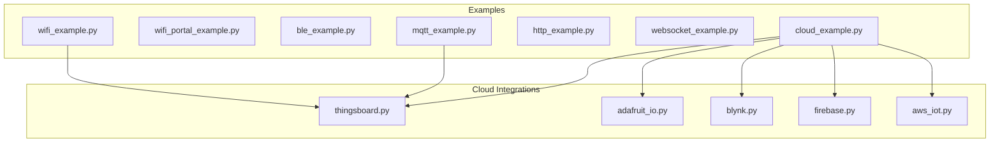
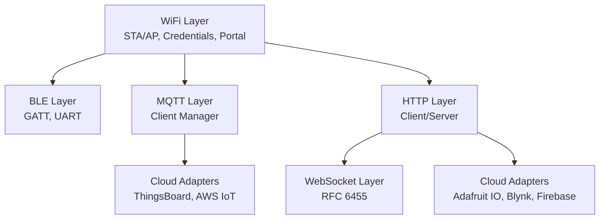
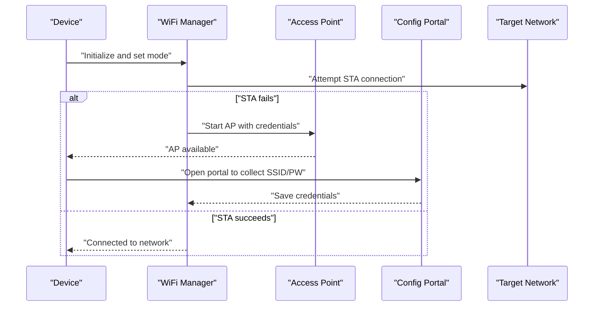
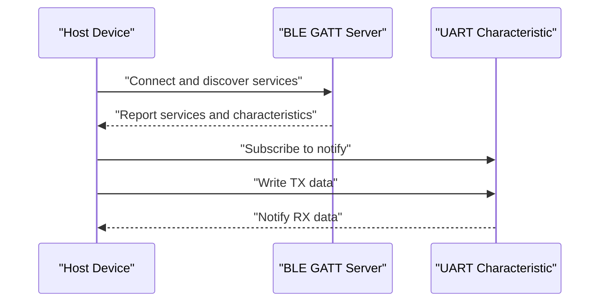
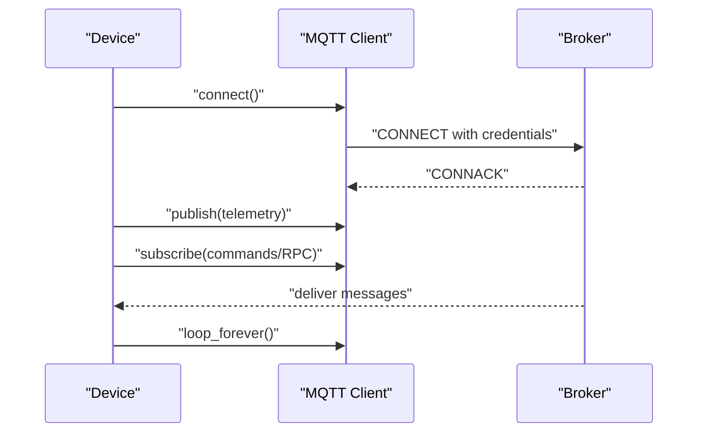
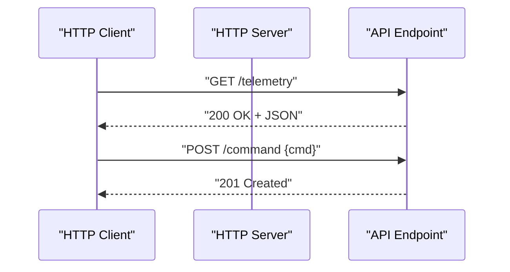
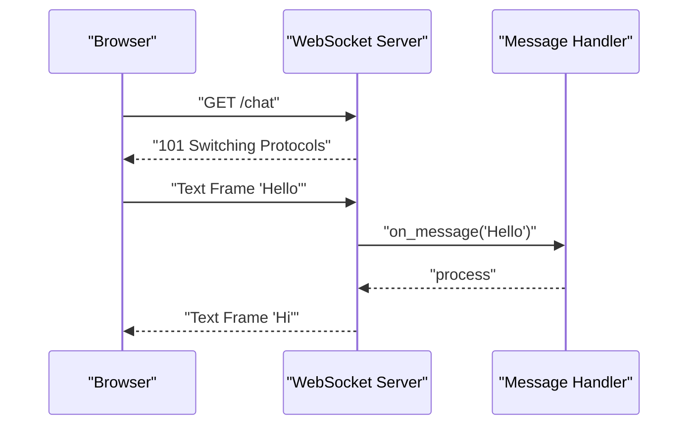
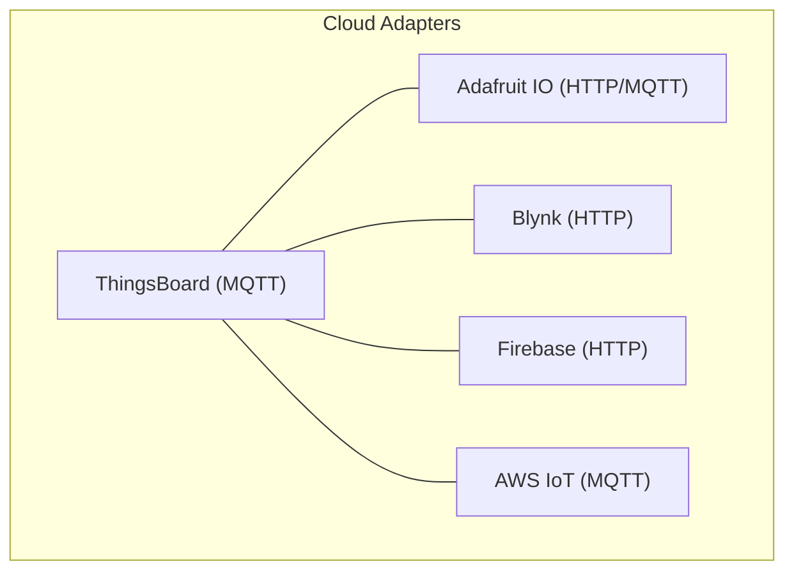
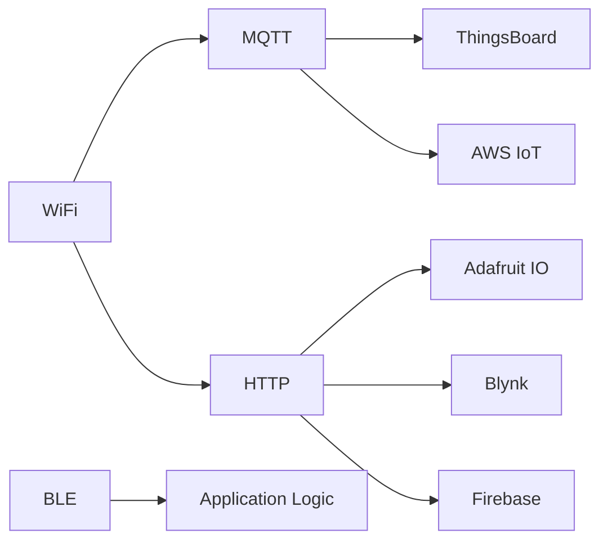

# Network & Communication

<cite>
**Referenced Files in This Document**
- [device.cfg](file://src/device.cfg)
- [wifi_example.py](file://src/main/examples/wifi_example.py)
- [wifi_portal_example.py](file://src/main/examples/wifi_portal_example.py)
- [ble_example.py](file://src/main/examples/ble_example.py)
- [cloud_example.py](file://src/main/examples/cloud_example.py)
- [mqtt_example.py](file://src/main/examples/mqtt_example.py)
- [http_example.py](file://src/main/examples/http_example.py)
- [websocket_example.py](file://src/main/examples/websocket_example.py)
- [thingsboard.py](file://src/lib/cloud/thingsboard.py)
- [adafruit_io.py](file://src/lib/cloud/adafruit_io.py)
- [blynk.py](file://src/lib/cloud/blynk.py)
- [firebase.py](file://src/lib/cloud/firebase.py)
- [aws_iot.py](file://src/lib/cloud/aws_iot.py)
</cite>

## Table of Contents
1. [Introduction](#introduction)
2. [Project Structure](#project-structure)
3. [Core Components](#core-components)
4. [Architecture Overview](#architecture-overview)
5. [Detailed Component Analysis](#detailed-component-analysis)
6. [Dependency Analysis](#dependency-analysis)
7. [Performance Considerations](#performance-considerations)
8. [Troubleshooting Guide](#troubleshooting-guide)
9. [Conclusion](#conclusion)

## Introduction
This document covers the Network & Communication feature category of the project. It explains the networking ecosystem including:
- WiFi management with station (STA) and access point (AP) modes and configuration portals
- BLE communication with GATT services and UART over BLE
- MQTT client/server implementation
- HTTP client/server functionality
- WebSocket communication (RFC 6455)
- Cloud platform integrations (ThingsBoard, Adafruit IO, Blynk, Firebase, AWS IoT)

It documents architectural patterns for network abstraction, connection management strategies, security considerations, configuration options, error handling, and troubleshooting approaches. Practical examples demonstrate setup, data transmission patterns, and cloud integration workflows.

## Project Structure
The networking-related modules and examples are organized under:
- src/lib/cloud: Cloud platform integrations
- src/main/examples: Example scripts demonstrating usage of networking features

Key areas:
- WiFi: Station/AP modes and configuration portal examples
- BLE: Central/peripheral roles, GATT server/client, and UART over BLE
- MQTT: Client implementation and usage patterns
- HTTP: Client and server examples
- WebSocket: Client and server examples
- Cloud: Platform-specific adapters built on MQTT or HTTP

**Section sources**
- [device.cfg:1-200](file://src/device.cfg#L1-L200)

## Core Components
- WiFi: Provides station and AP modes, credential management, and a captive portal for configuration.
- BLE: Supports GATT server/client and UART over BLE for device-to-device or device-to-host communication.
- MQTT: Implements a client manager for connecting to brokers, publishing telemetry, subscribing to commands, and handling RPC requests.
- HTTP: Offers client and server capabilities for REST-style interactions.
- WebSocket: Implements RFC 6455-compliant client and server communication.
- Cloud: Adapters for ThingsBoard (MQTT), Adafruit IO (HTTP/MQTT), Blynk (HTTP), Firebase (HTTP), and AWS IoT (MQTT).

Configuration options are primarily driven by device configuration and example scripts. Error handling is integrated into each module’s operations, with logging and retry strategies where applicable.

**Section sources**
- [wifi_example.py:1-200](file://src/main/examples/wifi_example.py#L1-L200)
- [wifi_portal_example.py:1-200](file://src/main/examples/wifi_portal_example.py#L1-L200)
- [ble_example.py:1-200](file://src/main/examples/ble_example.py#L1-L200)
- [mqtt_example.py:1-200](file://src/main/examples/mqtt_example.py#L1-L200)
- [http_example.py:1-200](file://src/main/examples/http_example.py#L1-L200)
- [websocket_example.py:1-200](file://src/main/examples/websocket_example.py#L1-L200)
- [cloud_example.py:1-200](file://src/main/examples/cloud_example.py#L1-L200)

## Architecture Overview
The networking stack follows a layered pattern:
- Transport and protocol layers: WiFi, BLE, MQTT, HTTP, WebSocket
- Application abstractions: Cloud adapters built on top of MQTT or HTTP
- Examples and configuration: Device configuration and example scripts orchestrate setup and usage

[No sources needed since this diagram shows conceptual architecture, not a direct code mapping]

## Detailed Component Analysis

### WiFi Management (STA/AP Modes and Configuration Portal)
- Purpose: Connect to existing networks (STA) or advertise a network (AP) for local clients. Provide a configuration portal for SSID/password entry.
- Key behaviors:
  - Initialize and configure WiFi interface
  - Connect to a known network or start an AP with credentials
  - Serve a captive portal to collect missing credentials
  - Persist credentials for subsequent boots
- Configuration options:
  - SSID and password
  - AP mode parameters (SSID, channel, security)
  - Portal endpoint and routing
- Security considerations:
  - Prefer WPA/WPA2-AES encryption for STA connections
  - Use strong passwords for AP mode
  - HTTPS for portal pages when available
- Error handling:
  - Retry connection attempts with backoff
  - Fallback to AP mode if STA fails
  - Validate credentials before saving
- Practical example:
  - See [wifi_example.py:1-200](file://src/main/examples/wifi_example.py#L1-L200) for STA setup and [wifi_portal_example.py:1-200](file://src/main/examples/wifi_portal_example.py#L1-L200) for the configuration portal.

**Section sources**
- [wifi_example.py:1-200](file://src/main/examples/wifi_example.py#L1-L200)
- [wifi_portal_example.py:1-200](file://src/main/examples/wifi_portal_example.py#L1-L200)

### BLE Communication (GATT Services and UART over BLE)
- Purpose: Enable device-to-device or device-to-host communication via BLE with GATT services and a UART-like characteristic for streaming data.
- Key behaviors:
  - Advertise services and characteristics
  - Handle client connections and notifications
  - Implement RX/TX semantics for UART over BLE
- Configuration options:
  - Service UUIDs and characteristic UUIDs
  - Security settings (read/write/notify permissions)
- Security considerations:
  - Use appropriate security levels for characteristics
  - Avoid exposing sensitive data in plaintext
- Error handling:
  - Manage connection drops and reconnections
  - Validate incoming data length and format
- Practical example:
  - See [ble_example.py:1-200](file://src/main/examples/ble_example.py#L1-L200) for BLE central/peripheral usage.

**Section sources**
- [ble_example.py:1-200](file://src/main/examples/ble_example.py#L1-L200)

### MQTT Client/Server Implementation
- Purpose: Publish telemetry, subscribe to attributes, and handle remote procedure calls (RPC) for device control.
- Key behaviors:
  - Connect to broker with credentials
  - Publish telemetry and attributes to topics
  - Subscribe to command and RPC topics
  - Loop forever to process callbacks
- Configuration options:
  - Broker host, port, TLS settings
  - Client ID, username/password
  - QoS levels for publish/subscribe
- Security considerations:
  - Use TLS/SSL for encrypted transport
  - Rotate credentials and limit permissions
- Error handling:
  - Reconnect on disconnect with exponential backoff
  - Validate JSON payloads and topic formats
- Practical example:
  - See [mqtt_example.py:1-200](file://src/main/examples/mqtt_example.py#L1-L200) for client usage and [thingsboard.py:1-49](file://src/lib/cloud/thingsboard.py#L1-L49) for a cloud adapter built on MQTT.

**Section sources**
- [mqtt_example.py:1-200](file://src/main/examples/mqtt_example.py#L1-L200)
- [thingsboard.py:1-49](file://src/lib/cloud/thingsboard.py#L1-L49)

### HTTP Client/Server Functionality
- Purpose: Perform REST-style interactions for cloud platforms or serve local web APIs.
- Key behaviors:
  - Make GET/POST requests with headers and payloads
  - Serve static pages and endpoints locally
  - Handle redirects and timeouts
- Configuration options:
  - Base URLs, headers, timeouts
  - Local server port and routes
- Security considerations:
  - Prefer HTTPS endpoints
  - Sanitize inputs and validate responses
- Error handling:
  - Retry transient failures
  - Log status codes and errors
- Practical example:
  - See [http_example.py:1-200](file://src/main/examples/http_example.py#L1-L200) for client/server usage.

**Section sources**
- [http_example.py:1-200](file://src/main/examples/http_example.py#L1-L200)

### WebSocket Communication (RFC 6455)
- Purpose: Bidirectional real-time communication over TCP with handshake and frame processing.
- Key behaviors:
  - Perform WebSocket handshake with HTTP upgrade
  - Send/receive text/binary frames
  - Handle close and ping/pong control frames
- Configuration options:
  - Subprotocols, extensions, and origin checks
  - Timeout and buffer sizes
- Security considerations:
  - Enforce origin validation and subprotocol negotiation
  - Use TLS for secure channels
- Error handling:
  - Detect malformed frames and protocol violations
  - Gracefully close connections on errors
- Practical example:
  - See [websocket_example.py:1-200](file://src/main/examples/websocket_example.py#L1-L200) for client/server usage.

**Section sources**
- [websocket_example.py:1-200](file://src/main/examples/websocket_example.py#L1-L200)

### Cloud Platform Integrations
- ThingsBoard (MQTT): Publish telemetry and attributes, subscribe to RPC requests, manage device lifecycle via MQTT topics.
- Adafruit IO (HTTP/MQTT): Feed-based telemetry and controls via HTTP or MQTT.
- Blynk (HTTP): Push notifications and virtual pins via HTTP requests.
- Firebase (HTTP): Realtime database reads/writes and authentication via HTTP.
- AWS IoT (MQTT): Secure MQTT connectivity with X.509 certificates and policy enforcement.

Configuration options:
- Hostnames, ports, tokens, keys, and device identifiers
- Topic/topic filters and feed names
- TLS certificates and credentials

Security considerations:
- Use TLS/SSL for all transports
- Store secrets securely and rotate credentials
- Limit topic/feed permissions and enforce policies

Error handling:
- Retry on network failures
- Validate response formats and status codes
- Log and alert on persistent errors

Practical example:
- See [cloud_example.py:1-200](file://src/main/examples/cloud_example.py#L1-L200) for coordinated cloud usage patterns and individual adapters under [thingsboard.py:1-49](file://src/lib/cloud/thingsboard.py#L1-L49).

**Section sources**
- [cloud_example.py:1-200](file://src/main/examples/cloud_example.py#L1-L200)
- [thingsboard.py:1-49](file://src/lib/cloud/thingsboard.py#L1-L49)

## Dependency Analysis
- WiFi depends on device configuration for credentials and AP parameters.
- BLE is independent of external protocols but integrates with application logic.
- MQTT is a foundational layer used by cloud adapters (e.g., ThingsBoard).
- HTTP and WebSocket are independent but often used by cloud adapters.
- Cloud adapters depend on MQTT or HTTP implementations and broker/host configurations.

[No sources needed since this diagram shows conceptual dependencies, not a direct code mapping]

## Performance Considerations
- Connection pooling and keep-alive for HTTP and WebSocket
- Backoff strategies for MQTT reconnects
- Buffer sizing and chunked transfers for BLE UART
- Minimize blocking operations in event loops
- Use non-blocking sockets and async patterns where applicable

[No sources needed since this section provides general guidance]

## Troubleshooting Guide
Common issues and resolutions:
- WiFi connection failures:
  - Verify credentials and network availability
  - Check AP channel and interference
  - Enable fallback to AP mode with captive portal
- BLE connectivity:
  - Confirm service/characteristic UUIDs match
  - Ensure proper security settings and pairing
- MQTT:
  - Validate broker reachability and TLS settings
  - Confirm topic permissions and QoS levels
- HTTP/WebSocket:
  - Check base URLs and firewall rules
  - Inspect status codes and headers
- Cloud integrations:
  - Confirm tokens/keys and device registration
  - Review platform-specific rate limits and quotas

**Section sources**
- [wifi_example.py:1-200](file://src/main/examples/wifi_example.py#L1-L200)
- [wifi_portal_example.py:1-200](file://src/main/examples/wifi_portal_example.py#L1-L200)
- [ble_example.py:1-200](file://src/main/examples/ble_example.py#L1-L200)
- [mqtt_example.py:1-200](file://src/main/examples/mqtt_example.py#L1-L200)
- [http_example.py:1-200](file://src/main/examples/http_example.py#L1-L200)
- [websocket_example.py:1-200](file://src/main/examples/websocket_example.py#L1-L200)
- [cloud_example.py:1-200](file://src/main/examples/cloud_example.py#L1-L200)

## Conclusion
The Network & Communication feature category provides a cohesive set of modules for modern embedded networking needs. By leveraging abstraction layers (WiFi, BLE, MQTT, HTTP, WebSocket), the system supports flexible deployment scenarios and secure cloud integrations. Following the configuration options, error handling patterns, and troubleshooting steps outlined here will help ensure reliable operation across diverse environments.