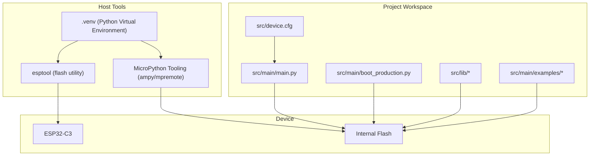
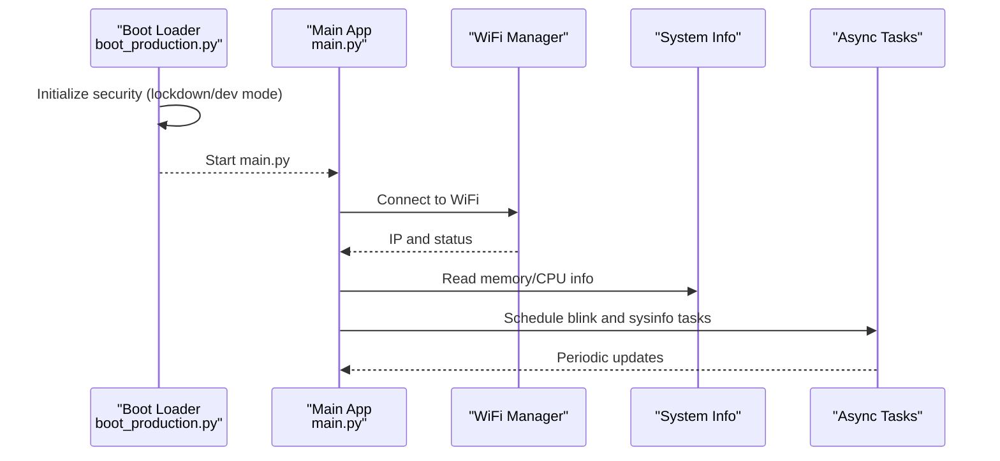
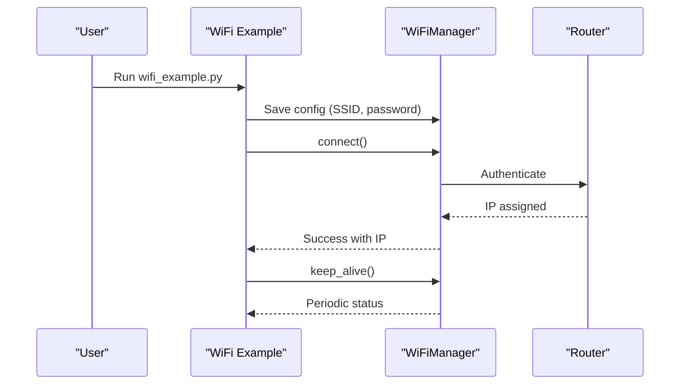
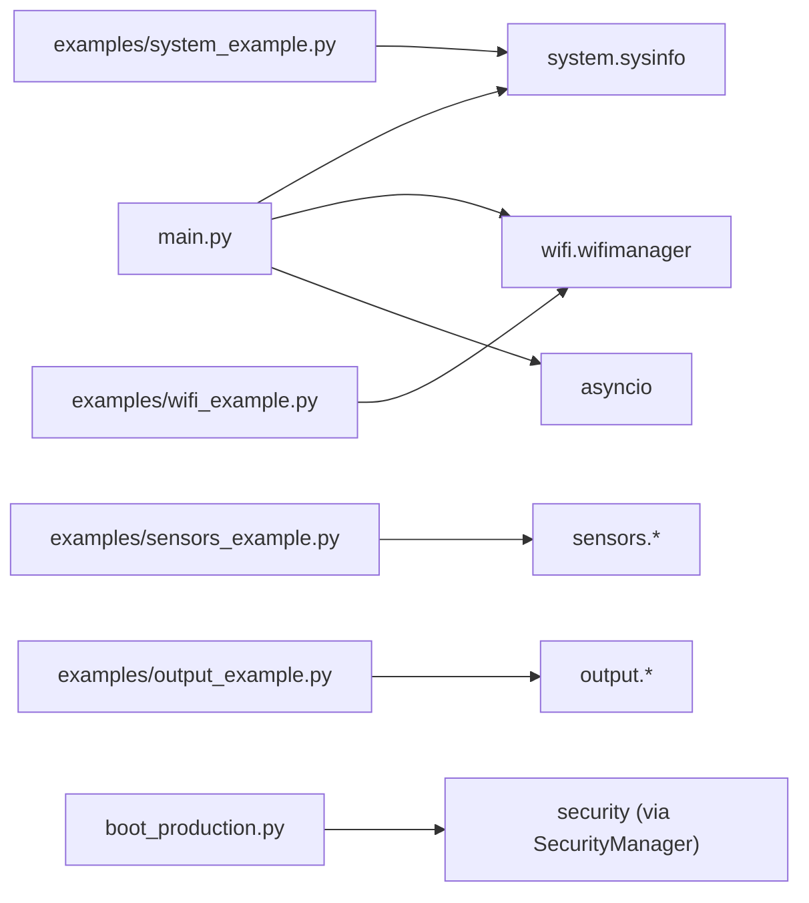

# Getting Started

<cite>
**Referenced Files in This Document**
- [device.cfg](file://src/device.cfg)
- [main.py](file://src/main/main.py)
- [boot_production.py](file://src/main/boot_production.py)
- [lib README](file://src/lib/README.md)
- [examples README](file://src/main/examples/README.md)
- [wifi_example.py](file://src/main/examples/wifi_example.py)
- [sensors_example.py](file://src/main/examples/sensors_example.py)
- [output_example.py](file://src/main/examples/output_example.py)
- [system_example.py](file://src/main/examples/system_example.py)
- [asyncio guide](file://src/main/README_ASYNCIO.md)
- [WiFi module README](file://src/main/README_WIFI_MODULE.md)
- [BLE module README](file://src/main/README_BLE_MODULE.md)
- [Task.md](file://Task.md)
- [plan.md](file://plan.md)
</cite>

## Table of Contents
1. [Introduction](#introduction)
2. [Project Structure](#project-structure)
3. [Core Components](#core-components)
4. [Architecture Overview](#architecture-overview)
5. [Detailed Component Analysis](#detailed-component-analysis)
6. [Dependency Analysis](#dependency-analysis)
7. [Performance Considerations](#performance-considerations)
8. [Troubleshooting Guide](#troubleshooting-guide)
9. [Conclusion](#conclusion)
10. [Appendices](#appendices)

## Introduction
This guide helps you set up a complete development environment and run your first ESP32-C3 MicroPython project using the ESP32-C3 MicroPython Library Framework. You will learn how to prepare your hardware, configure the device, establish WiFi connectivity, run example applications, and understand the project’s modular structure. Practical workflows demonstrate connecting to WiFi, reading sensors, controlling outputs, and basic system monitoring. Common setup issues and troubleshooting tips are included to help you resolve problems quickly.

## Project Structure
The framework organizes code into reusable libraries and example applications:
- src/lib: Modular drivers and utilities (wifi, sensors, display, output, input, storage, mqtt, http, cloud, system)
- src/main: Entry point (main.py), production boot protection (boot_production.py), and example applications
- src/main/examples: Feature-focused examples grouped by category
- src/device.cfg: Device configuration for deployment targets

**Diagram sources**
- [device.cfg:1-16](file://src/device.cfg#L1-L16)
- [main.py:1-84](file://src/main/main.py#L1-L84)
- [boot_production.py:1-56](file://src/main/boot_production.py#L1-L56)

**Section sources**
- [lib README:1-72](file://src/lib/README.md#L1-L72)
- [examples README:1-403](file://src/main/examples/README.md#L1-L403)
- [Task.md:9-32](file://Task.md#L9-L32)

## Core Components
- Device configuration: device.cfg defines target port, MCU type, sync folders, and virtual environment paths.
- Entry point: main.py initializes libraries, sets up WiFi, and runs concurrent tasks (blink LED and system info).
- Production boot protection: boot_production.py provides lockdown and optional development mode via an unlock pin.
- Library modules: lib/ provides categorized drivers and utilities for sensors, displays, outputs, connectivity, and system functions.
- Example applications: examples/ demonstrate real-world usage patterns for WiFi, sensors, outputs, and system utilities.

Key capabilities:
- WiFi connectivity with configuration management and keep-alive monitoring
- Sensor reading (DHT, BMP280, DS18B20, MPU6050, HC-SR04, ADS1115, MAX30102, LDR, soil, PIR, RCWL-0516, MQ gas, INA219, OH49E, PZEM, PM2.5)
- Output control (NeoPixel, servo, DC motor, stepper, relay, buzzer, PWM LED)
- System utilities (SysInfo, RTC, OTA)

**Section sources**
- [device.cfg:1-16](file://src/device.cfg#L1-L16)
- [main.py:1-84](file://src/main/main.py#L1-L84)
- [boot_production.py:1-56](file://src/main/boot_production.py#L1-L56)
- [lib README:1-72](file://src/lib/README.md#L1-L72)
- [examples README:1-403](file://src/main/examples/README.md#L1-L403)

## Architecture Overview
The runtime architecture centers on an asynchronous main loop that coordinates WiFi connectivity, sensor reads, output controls, and system monitoring. Optional production boot protection secures the device by disabling REPL and transport interfaces until unlocked.

**Diagram sources**
- [boot_production.py:1-56](file://src/main/boot_production.py#L1-L56)
- [main.py:1-84](file://src/main/main.py#L1-L84)

## Detailed Component Analysis

### Development Environment Setup
- Python development environment
  - Create and activate a virtual environment for host-side tooling.
  - Install MicroPython tooling (e.g., ampy or mpremote) to upload files to the device.
- ESP-IDF and esptool
  - While this project targets MicroPython on ESP32-C3, esptool is commonly used to flash firmware and erase partitions.
  - Use esptool to communicate with the device bootloader and manage partitions.
- Device configuration
  - Update device.cfg to set the serial port, MCU type, and sync folders for your environment.

Practical steps:
- Prepare a Python virtual environment and install required packages.
- Verify serial communication with the device using esptool.
- Configure device.cfg with your COM port and project directories.

**Section sources**
- [device.cfg:1-16](file://src/device.cfg#L1-L16)

### Hardware Requirements and Board Preparation
- ESP32-C3 board with MicroPython firmware supporting asyncio.
- USB-to-serial adapter or onboard USB for flashing and REPL access.
- Optional peripherals for examples (e.g., sensors, LEDs, buzzers, relays).
- Ensure the board has sufficient free flash space for libraries and examples.

Notes:
- Some modules require specific pins or external components (e.g., pull-up resistors for 1-Wire, flyback diodes for motors).
- For production deployments, enable boot protection and optionally use an unlock pin for development mode.

**Section sources**
- [boot_production.py:13-48](file://src/main/boot_production.py#L13-L48)

### Initial Device Configuration Using device.cfg
- Set the serial port (port) to match your OS.
- Define mcu as esp32c3.
- Configure sync_folder and root_folder to align with your project layout.
- Ensure virtualEnv and virtualPython point to your activated .venv.

Tip:
- After changing device.cfg, re-scan ports and reflash if needed to ensure correct deployment paths.

**Section sources**
- [device.cfg:1-16](file://src/device.cfg#L1-L16)

### First-Time User Workflow: Basic WiFi Connectivity
- Copy example WiFi code to the device and run it from the examples directory.
- Save WiFi credentials once, then connect automatically.
- Monitor connection status and keep-alive behavior.

Recommended example:
- wifi_example.py demonstrates saving credentials, connecting, keep-alive mode, scanning, concurrent tasks, multiple configs, HTTP after WiFi, status monitoring, and captive portal.

**Diagram sources**
- [wifi_example.py:14-37](file://src/main/examples/wifi_example.py#L14-L37)
- [WiFi module README:19-40](file://src/main/README_WIFI_MODULE.md#L19-L40)

**Section sources**
- [wifi_example.py:1-338](file://src/main/examples/wifi_example.py#L1-L338)
- [WiFi module README:1-470](file://src/main/README_WIFI_MODULE.md#L1-L470)

### Running Example Applications
- Upload individual example files to the device (e.g., /main/examples/wifi_example.py).
- Import and run the example from the device’s REPL or schedule it in main.py.
- Many examples support selective enabling/disabling of sections to test hardware-specific features.

Categories of examples:
- WiFi, BLE, sensors, displays, outputs, input devices, storage, MQTT, HTTP, cloud platforms, system utilities, and async patterns.

**Section sources**
- [examples README:1-403](file://src/main/examples/README.md#L1-L403)

### Understanding the Project Structure
- src/lib: Modular drivers organized by domain (wifi, sensors, display, output, input, storage, mqtt, http, cloud, system).
- src/main: Entry point (main.py), production boot protection (boot_production.py), and examples.
- src/main/examples: Feature-indexed examples demonstrating practical usage patterns.

Guidance:
- Use sys.path.append('/lib') to import modules from the device’s /lib directory.
- Follow the recommended usage order: WiFi → sensors → display/output → MQTT/HTTP/cloud → storage → system.

**Section sources**
- [lib README:1-72](file://src/lib/README.md#L1-L72)
- [Task.md:9-32](file://Task.md#L9-L32)

### Practical Workflows

#### Connect to WiFi
- Save credentials once, then connect automatically.
- Use keep-alive mode to monitor and recover from disconnections.
- Combine with HTTP requests after successful connection.

Reference:
- [wifi_example.py:14-37](file://src/main/examples/wifi_example.py#L14-L37)
- [WiFi module README:73-94](file://src/main/README_WIFI_MODULE.md#L73-L94)

#### Read Sensors
- Choose appropriate sensor drivers (DHT, BMP280, DS18B20, MPU6050, HC-SR04, ADS1115, MAX30102, LDR, soil, PIR, RCWL-0516, MQ gas, INA219, OH49E, PZEM, PM2.5).
- Enable only the sensors you have wired.

Reference:
- [sensors_example.py:1-529](file://src/main/examples/sensors_example.py#L1-L529)

#### Control Outputs
- Drive NeoPixels, servos, DC motors, steppers, relays, buzzers, and PWM LEDs.
- Use async patterns to avoid blocking the event loop.

Reference:
- [output_example.py:1-251](file://src/main/examples/output_example.py#L1-L251)

#### Basic System Monitoring
- Read free memory, CPU frequency, and chip ID.
- Optionally synchronize RTC via NTP after WiFi is available.

Reference:
- [system_example.py:1-43](file://src/main/examples/system_example.py#L1-L43)

### Async Programming Patterns
- Use asyncio.run for the main entry point.
- Create tasks for concurrent operations (e.g., blinking LED and logging system info).
- Use gather to coordinate multiple coroutines.
- Apply locks, events, queues, and timeouts for robust concurrency.

Reference:
- [asyncio guide:1-840](file://src/main/README_ASYNCIO.md#L1-L840)

## Dependency Analysis
The project follows a layered dependency model:
- main.py depends on system and WiFi modules.
- Examples depend on lib modules (e.g., sensors, output, system).
- Boot protection depends on security utilities.

**Diagram sources**
- [main.py:12-13](file://src/main/main.py#L12-L13)
- [wifi_example.py:6-10](file://src/main/examples/wifi_example.py#L6-L10)
- [sensors_example.py:6-27](file://src/main/examples/sensors_example.py#L6-L27)
- [output_example.py:5-8](file://src/main/examples/output_example.py#L5-L8)
- [system_example.py:8-12](file://src/main/examples/system_example.py#L8-L12)
- [boot_production.py:22-43](file://src/main/boot_production.py#L22-L43)

**Section sources**
- [main.py:1-84](file://src/main/main.py#L1-L84)
- [boot_production.py:1-56](file://src/main/boot_production.py#L1-L56)

## Performance Considerations
- Prefer asyncio.sleep_ms over asyncio.sleep for short delays to reduce overhead.
- Use gc.collect() periodically in idle tasks to manage memory pressure.
- Limit queue sizes to prevent memory exhaustion.
- Avoid long synchronous computations in the event loop; break work into smaller chunks with yields.
- Use locks when sharing peripherals (I2C/SPI/UART) among tasks.

[No sources needed since this section provides general guidance]

## Troubleshooting Guide
Common issues and resolutions:
- Cannot connect to WiFi
  - Verify SSID/password and router availability.
  - Increase timeout in configuration.
  - Use keep-alive mode to recover from disconnections.
- Configuration not saved
  - Check available flash space and write permissions.
- Keep-alive not working
  - Ensure keep_alive is awaited and WiFi signal is adequate.
- Portal not opening
  - Confirm sufficient memory and AP mode support.
  - Reduce other active services.
- BLE not responding
  - Confirm BLE module availability and firmware compatibility.
  - Check connection limits and proximity.
- Production boot protection disables REPL
  - Use the unlock pin to enter development mode during development.
  - For production, rely on OTA or esptool for updates.

**Section sources**
- [WiFi module README:438-470](file://src/main/README_WIFI_MODULE.md#L438-L470)
- [BLE module README:456-526](file://src/main/README_BLE_MODULE.md#L456-L526)
- [boot_production.py:13-48](file://src/main/boot_production.py#L13-L48)

## Conclusion
You now have the essentials to set up your ESP32-C3 development environment, configure the device, connect to WiFi, run example applications, and understand the modular structure. Use the examples as templates for building real-world projects, and apply the async patterns and troubleshooting tips to ensure reliable operation. As you advance, explore advanced modules and integrate cloud platforms, storage, and system utilities.

[No sources needed since this section summarizes without analyzing specific files]

## Appendices

### Appendix A: Recommended First Steps
- Install Python and create a virtual environment.
- Install MicroPython tooling (ampy/mpremote) and esptool.
- Flash MicroPython firmware to your ESP32-C3.
- Configure device.cfg with your COM port and project paths.
- Upload /lib to the device’s /lib directory.
- Run main.py to see basic LED blinking and system info.
- Try wifi_example.py to connect to WiFi.
- Explore sensors_example.py and output_example.py for hardware tests.

**Section sources**
- [device.cfg:1-16](file://src/device.cfg#L1-L16)
- [main.py:1-84](file://src/main/main.py#L1-L84)
- [lib README:67-72](file://src/lib/README.md#L67-L72)
- [examples README:52-66](file://src/main/examples/README.md#L52-L66)

### Appendix B: Module Expansion Plans
- Stepper motor drivers (A4988, TMC2208/TMC2209, DRV8825, TMC5160)
- PM2.5 sensors (PMS7003, PMS5003)
- Updated documentation and examples

**Section sources**
- [plan.md:1-93](file://plan.md#L1-L93)