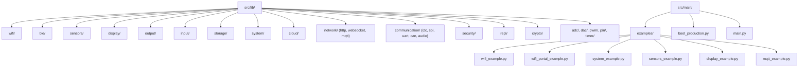
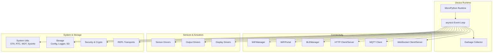
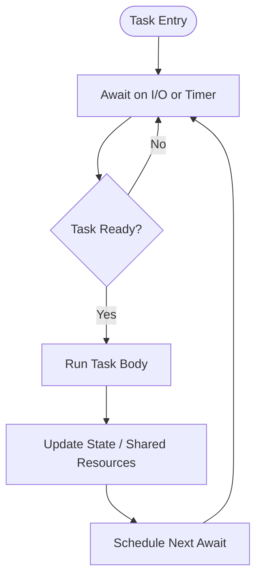
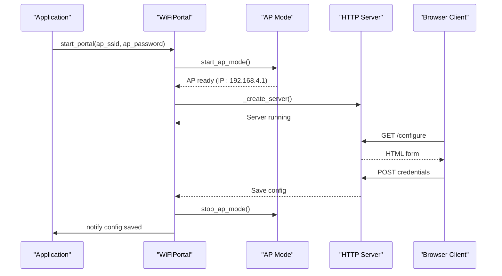
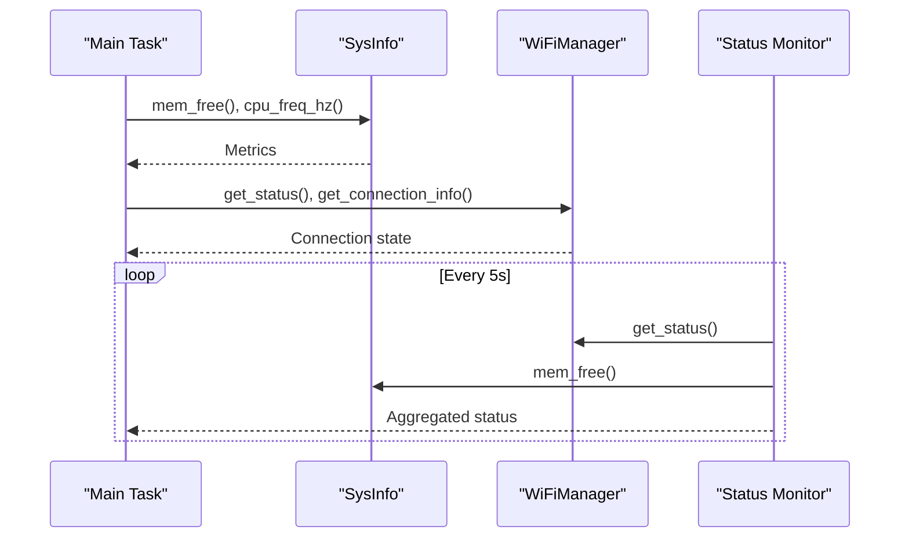
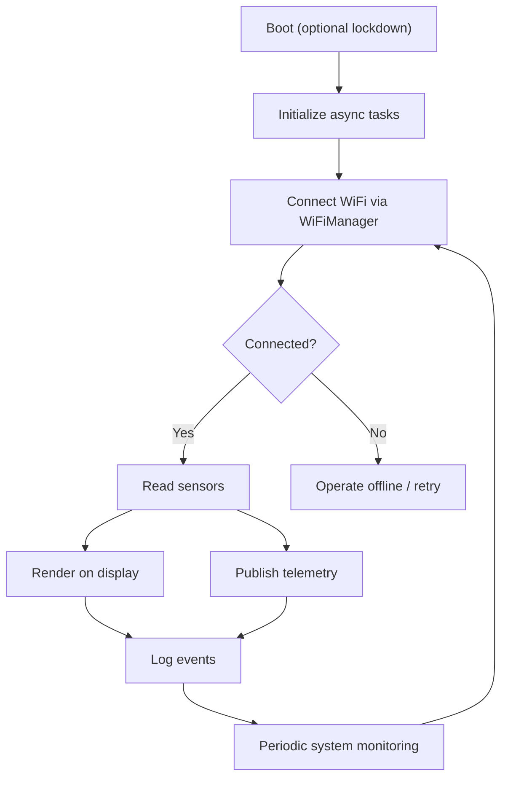
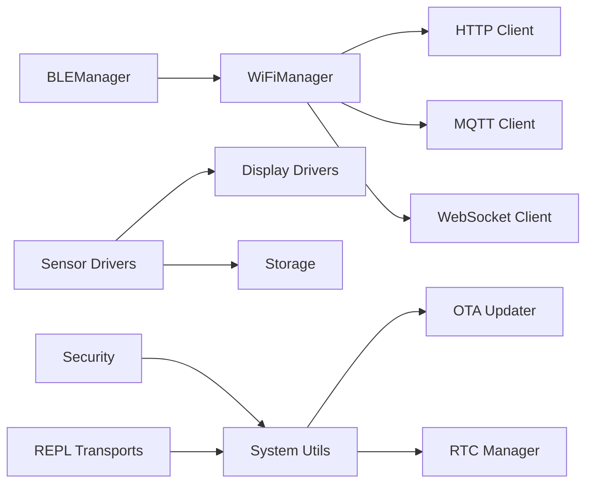

# Project Overview

<cite>
**Referenced Files in This Document**
- [README.md](file://src/lib/README.md)
- [List_module.md](file://src/List_module.md)
- [README_ASYNCIO.md](file://src/main/README_ASYNCIO.md)
- [device.cfg](file://src/device.cfg)
- [boot_production.py](file://src/main/boot_production.py)
- [main.py](file://src/main/main.py)
- [wifi_example.py](file://src/main/examples/wifi_example.py)
- [wifi_portal_example.py](file://src/main/examples/wifi_portal_example.py)
- [system_example.py](file://src/main/examples/system_example.py)
- [sensors_example.py](file://src/main/examples/sensors_example.py)
- [display_example.py](file://src/main/examples/display_example.py)
- [mqtt_example.py](file://src/main/examples/mqtt_example.py)
- [asyncio.pyi](file://src/stubs/asyncio.pyi)
</cite>

## Table of Contents
1. [Introduction](#introduction)
2. [Project Structure](#project-structure)
3. [Core Components](#core-components)
4. [Architecture Overview](#architecture-overview)
5. [Detailed Component Analysis](#detailed-component-analysis)
6. [Dependency Analysis](#dependency-analysis)
7. [Performance Considerations](#performance-considerations)
8. [Troubleshooting Guide](#troubleshooting-guide)
9. [Conclusion](#conclusion)
10. [Appendices](#appendices)

## Introduction
This document presents the ESP32-C3 MicroPython Library Framework as a comprehensive hardware abstraction and IoT connectivity platform tailored for ESP32-class microcontrollers. It provides a modular ecosystem of 80+ modules organized into functional categories spanning sensors, displays, outputs, communication stacks, networking, cloud integrations, storage, system utilities, security, REPL transports, cryptography, analog I/O, GPIO, and timers. The framework emphasizes an async-first design using MicroPython’s asyncio to enable cooperative multitasking, and demonstrates practical patterns such as the factory pattern for dynamic WiFi configuration portals and the observer pattern for system monitoring.

Target audience:
- Embedded developers building real-time IoT systems on ESP32 microcontrollers
- Makers prototyping sensor dashboards, actuators, and connectivity solutions
- DevOps engineers automating OTA updates and remote diagnostics
- Educators teaching embedded systems with a focus on concurrency and modularity

Key capabilities:
- Unified async programming model for I/O-bound and mixed workloads
- Factory-style WiFi portal creation for out-of-box device configuration
- Observer-style system monitoring and telemetry collection
- Extensive peripheral drivers and protocol stacks (I2C, SPI, UART, I2S, CAN, BLE, Ethernet)
- Cloud integrations (MQTT, HTTP, WebSockets) and secure storage/logging
- Production-grade boot protection and system utilities (OTA, RTC, watchdog, deep sleep)

Relationship to the MicroPython ecosystem:
- Built on MicroPython v1.21+ with asyncio support
- Compatible across ESP32 families (C3, S2, S3, C6)
- Provides stubs and examples aligned with MicroPython toolchains and deployment workflows

## Project Structure
The repository is organized around a modular library under src/lib/, with example applications and boot/security utilities under src/main/. The top-level README and module catalog summarize the library’s breadth and categorization.

**Diagram sources**
- [README.md:1-72](file://src/lib/README.md#L1-L72)
- [List_module.md:1-358](file://src/List_module.md#L1-L358)

**Section sources**
- [README.md:1-72](file://src/lib/README.md#L1-L72)
- [List_module.md:1-358](file://src/List_module.md#L1-L358)

## Core Components
- WiFi and BLE managers for station and access-point modes, plus BLE-based provisioning
- Sensor drivers for environmental, motion, power, gas, optical, and industrial sensing
- Display drivers for OLED, TFT, LCD, LED matrix, E-paper, and TJC HMI
- Output drivers for LEDs, servos, steppers, relays, buzzers, and NeoPixels
- Communication stacks (I2C, SPI, UART, I2S, CAN) and transport protocols (HTTP, MQTT, WebSocket)
- Cloud integrations (ThingsBoard, Adafruit IO, Blynk, Firebase, AWS IoT)
- System utilities (OTA, RTC, watchdog, deep sleep, sysinfo)
- Security and crypto helpers (audit logging, auth tokens, secret store, hashing)
- REPL transports (TCP, UART, BLE, Web REPL) and command dispatch
- Analog I/O (ADC, DAC, PWM) and digital GPIO/timer abstractions

Recommended workflow:
1. Initialize device and optional boot lockdown
2. Establish WiFi connectivity via WiFiManager or WiFiPortal
3. Read sensors and process telemetry
4. Visualize data on displays or outputs
5. Stream telemetry via MQTT/HTTP/WebSocket or log locally
6. Monitor system health and schedule maintenance tasks
7. Apply OTA updates and manage secrets securely

**Section sources**
- [README.md:43-51](file://src/lib/README.md#L43-L51)
- [List_module.md:327-347](file://src/List_module.md#L327-L347)

## Architecture Overview
The framework follows an async-first architecture centered on cooperative multitasking. Modules expose high-level APIs for peripherals and protocols, while examples demonstrate integration patterns. The WiFi portal factory pattern enables dynamic AP provisioning with an embedded HTTP server, and system monitoring leverages observers (status polling and periodic tasks).

**Diagram sources**
- [README_ASYNCIO.md:31-50](file://src/main/README_ASYNCIO.md#L31-L50)
- [wifi_example.py:304-321](file://src/main/examples/wifi_example.py#L304-L321)
- [wifi_portal_example.py:13-27](file://src/main/examples/wifi_portal_example.py#L13-L27)
- [system_example.py:1-43](file://src/main/examples/system_example.py#L1-L43)
- [sensors_example.py:1-529](file://src/main/examples/sensors_example.py#L1-L529)
- [display_example.py:1-240](file://src/main/examples/display_example.py#L1-L240)
- [mqtt_example.py:1-40](file://src/main/examples/mqtt_example.py#L1-L40)

## Detailed Component Analysis

### Async-first Design and Concurrency Patterns
- Cooperative multitasking: tasks yield control via await to prevent blocking the event loop
- Task lifecycle: creation, cancellation, and cleanup with proper exception handling
- Synchronization primitives: Events, Locks, Queues, and ThreadSafeFlag for ISR-safe signaling
- Streaming I/O: StreamReader/StreamWriter for UART and TCP sockets
- Practical patterns: Producer/consumer, state machines, watchdogs, and debouncing

**Diagram sources**
- [README_ASYNCIO.md:31-50](file://src/main/README_ASYNCIO.md#L31-L50)
- [README_ASYNCIO.md:113-172](file://src/main/README_ASYNCIO.md#L113-L172)
- [README_ASYNCIO.md:206-238](file://src/main/README_ASYNCIO.md#L206-L238)
- [README_ASYNCIO.md:274-322](file://src/main/README_ASYNCIO.md#L274-L322)
- [README_ASYNCIO.md:363-431](file://src/main/README_ASYNCIO.md#L363-L431)
- [README_ASYNCIO.md:434-466](file://src/main/README_ASYNCIO.md#L434-L466)
- [README_ASYNCIO.md:468-574](file://src/main/README_ASYNCIO.md#L468-L574)
- [README_ASYNCIO.md:577-620](file://src/main/README_ASYNCIO.md#L577-L620)
- [README_ASYNCIO.md:623-667](file://src/main/README_ASYNCIO.md#L623-L667)

**Section sources**
- [README_ASYNCIO.md:1-840](file://src/main/README_ASYNCIO.md#L1-L840)
- [asyncio.pyi:1-28](file://src/stubs/asyncio.pyi#L1-L28)

### WiFi Manager and Factory Pattern for Dynamic Portal Creation
- WiFiManager supports saving/loading credentials, connecting with timeouts, keep-alive monitoring, and status reporting
- WiFiPortal creates an AP with an embedded HTTP server, enabling web-based configuration
- Factory pattern: portal instance encapsulates AP setup, HTTP server lifecycle, and credential persistence

**Diagram sources**
- [wifi_example.py:304-321](file://src/main/examples/wifi_example.py#L304-L321)
- [wifi_portal_example.py:13-27](file://src/main/examples/wifi_portal_example.py#L13-L27)
- [wifi_portal_example.py:137-177](file://src/main/examples/wifi_portal_example.py#L137-L177)

**Section sources**
- [wifi_example.py:1-338](file://src/main/examples/wifi_example.py#L1-L338)
- [wifi_portal_example.py:1-350](file://src/main/examples/wifi_portal_example.py#L1-L350)

### Observer Pattern for System Monitoring
- Periodic tasks report system metrics (memory, CPU frequency) and device status
- Status monitors poll connection state, IP, gateway, and MAC address
- Watchdog tasks enforce liveness checks and reset on timeout

**Diagram sources**
- [main.py:38-44](file://src/main/main.py#L38-L44)
- [system_example.py:15-43](file://src/main/examples/system_example.py#L15-L43)
- [wifi_example.py:266-302](file://src/main/examples/wifi_example.py#L266-L302)

**Section sources**
- [main.py:1-84](file://src/main/main.py#L1-L84)
- [system_example.py:1-43](file://src/main/examples/system_example.py#L1-L43)
- [wifi_example.py:266-302](file://src/main/examples/wifi_example.py#L266-L302)

### Practical Workflow: From WiFi Setup to System Monitoring
- Boot lockdown (optional) secures device before main application starts
- Main application initializes async tasks, connects to WiFi, and runs periodic monitoring
- Example patterns demonstrate sensor reading, display rendering, MQTT publishing, and storage logging

**Diagram sources**
- [boot_production.py:1-56](file://src/main/boot_production.py#L1-L56)
- [main.py:49-71](file://src/main/main.py#L49-L71)
- [sensors_example.py:504-529](file://src/main/examples/sensors_example.py#L504-L529)
- [display_example.py:221-239](file://src/main/examples/display_example.py#L221-L239)
- [mqtt_example.py:12-40](file://src/main/examples/mqtt_example.py#L12-L40)

**Section sources**
- [boot_production.py:1-56](file://src/main/boot_production.py#L1-L56)
- [main.py:1-84](file://src/main/main.py#L1-L84)
- [sensors_example.py:1-529](file://src/main/examples/sensors_example.py#L1-L529)
- [display_example.py:1-240](file://src/main/examples/display_example.py#L1-L240)
- [mqtt_example.py:1-40](file://src/main/examples/mqtt_example.py#L1-L40)

## Dependency Analysis
- Module cohesion: Each category (wifi, sensors, display, output, storage, system, etc.) groups related drivers and utilities
- Cross-category dependencies: WiFi and BLE managers integrate with HTTP/MQTT/WebSocket clients; sensors feed display and storage modules; system utilities coordinate OTA and watchdog behavior
- External dependencies: Cloud platforms (ThingsBoard, Adafruit IO, Blynk, Firebase, AWS IoT) and transport libraries (urequests, websockets) are referenced in examples

**Diagram sources**
- [wifi_example.py:222-264](file://src/main/examples/wifi_example.py#L222-L264)
- [mqtt_example.py:12-40](file://src/main/examples/mqtt_example.py#L12-L40)
- [system_example.py:28-43](file://src/main/examples/system_example.py#L28-L43)

**Section sources**
- [List_module.md:1-358](file://src/List_module.md#L1-L358)
- [README.md:1-72](file://src/lib/README.md#L1-L72)

## Performance Considerations
- Prefer asyncio.sleep_ms over asyncio.sleep for sub-second delays to reduce overhead
- Use bounded queues and periodic garbage collection in idle tasks
- Avoid blocking operations; use cooperative yields and async I/O everywhere
- Limit shared mutable state; protect cross-task data with locks
- Defer heavy computations to background tasks and split work into small chunks

[No sources needed since this section provides general guidance]

## Troubleshooting Guide
Common pitfalls and remedies:
- Using time.sleep in async contexts blocks the event loop; replace with asyncio.sleep variants
- Forgetting to await coroutines or create tasks leads to no-op execution
- Race conditions on shared resources require explicit locking
- ISR-triggered signals must use ThreadSafeFlag to avoid unsafe operations
- Boot lockdown disables REPL by design; use unlock pin or OTA for recovery

**Section sources**
- [README_ASYNCIO.md:670-750](file://src/main/README_ASYNCIO.md#L670-L750)
- [boot_production.py:13-17](file://src/main/boot_production.py#L13-L17)

## Conclusion
The ESP32-C3 MicroPython Library Framework delivers a robust, modular foundation for building IoT devices with strong emphasis on asynchronous programming, practical connectivity, and production-ready system features. Its factory-style WiFi portal and observer-style monitoring simplify device onboarding and maintenance, while the extensive driver catalog accelerates development across diverse use cases.

[No sources needed since this section summarizes without analyzing specific files]

## Appendices

### Device Configuration
- Target MCU: ESP32-C3
- Firmware: MicroPython
- Sync folder: device_code
- Root project folder: Test

**Section sources**
- [device.cfg:1-16](file://src/device.cfg#L1-L16)