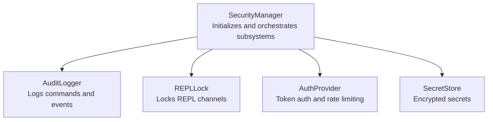
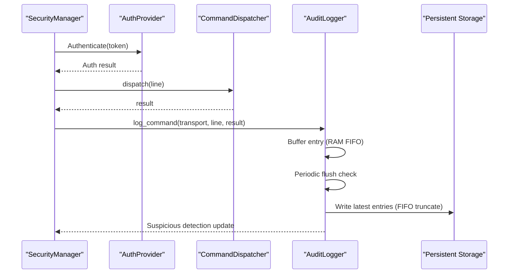
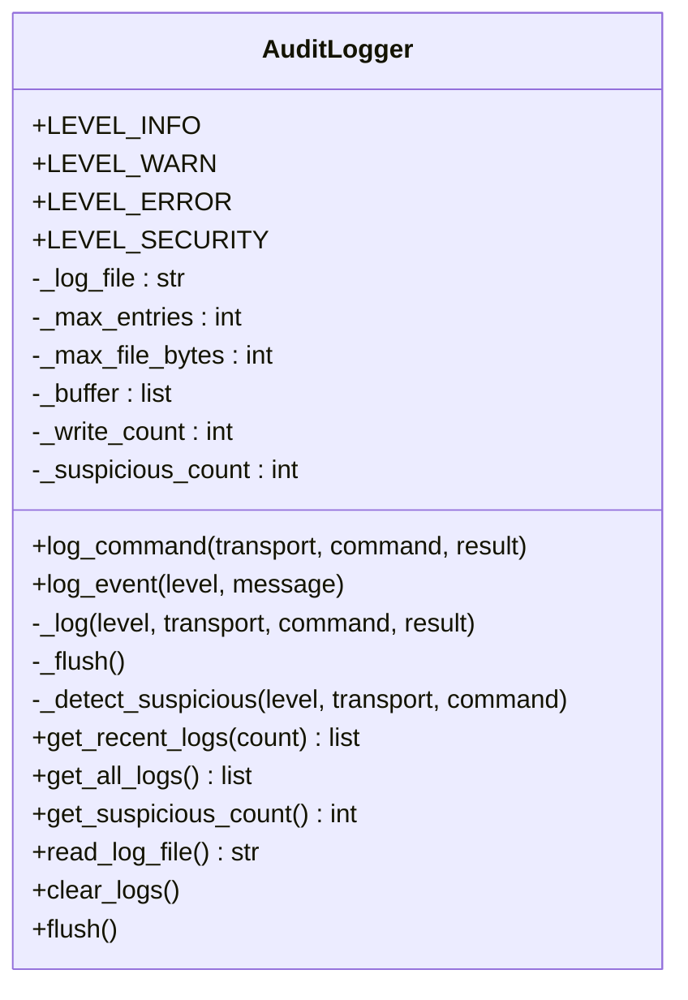
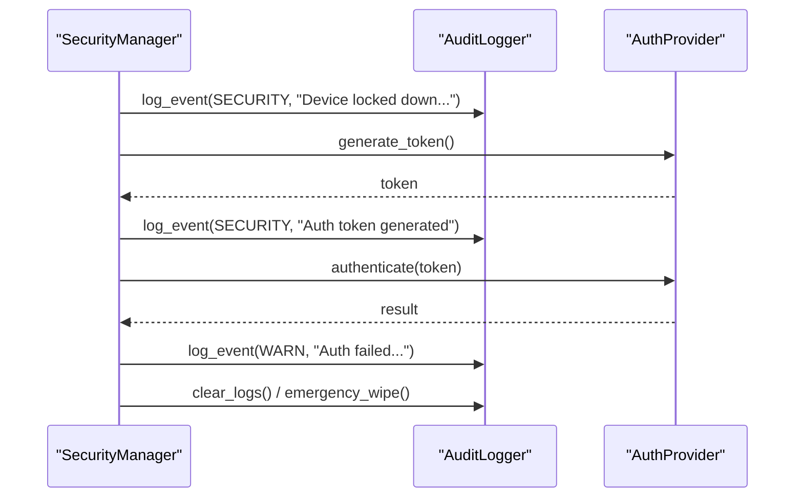
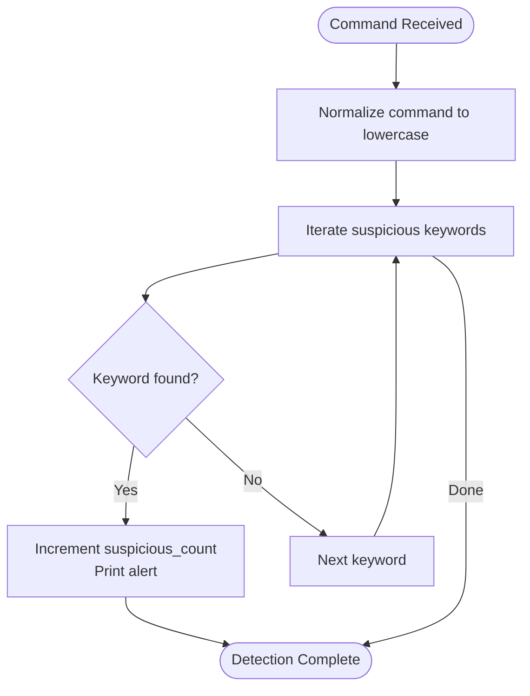
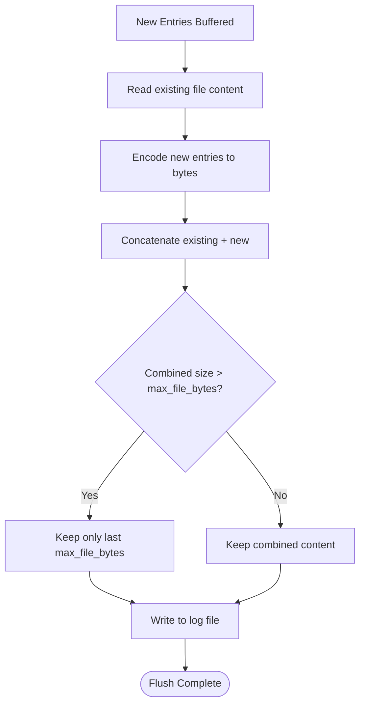
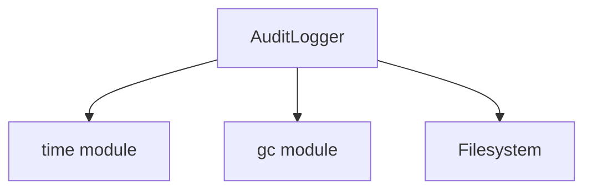

# Audit Logging

<cite>
**Referenced Files in This Document**
- [audit_logger.py](file://src/lib/security/audit_logger.py)
- [security_manager.py](file://src/lib/security/security_manager.py)
- [README.md](file://src/lib/security/README.md)
- [secure_production_example.py](file://src/main/examples/secure_production_example.py)
- [logger.py](file://src/lib/storage/logger.py)
</cite>

## Table of Contents
1. [Introduction](#introduction)
2. [Project Structure](#project-structure)
3. [Core Components](#core-components)
4. [Architecture Overview](#architecture-overview)
5. [Detailed Component Analysis](#detailed-component-analysis)
6. [Dependency Analysis](#dependency-analysis)
7. [Performance Considerations](#performance-considerations)
8. [Troubleshooting Guide](#troubleshooting-guide)
9. [Conclusion](#conclusion)
10. [Appendices](#appendices)

## Introduction
This document provides comprehensive documentation for the AuditLogger class, focusing on security event tracking and audit trail management in enterprise IoT deployments. It explains how the class logs events with different severity levels, tracks commands across transports, detects suspicious activity, manages log files with size limits and rotation, and integrates with the SecurityManager for holistic security monitoring. Practical configuration examples, logging patterns, and security workflows are included, along with guidance on audit logging security considerations, log integrity protection, storage optimization for constrained environments, and compliance readiness.

## Project Structure
The audit logging capability is part of the security module and integrates with other security subsystems (REPL lock, authentication provider, and secret store). The AuditLogger is instantiated and configured by the SecurityManager, and examples demonstrate usage patterns in production scenarios.

**Diagram sources**
- [security_manager.py:42-79](file://src/lib/security/security_manager.py#L42-L79)
- [audit_logger.py:38-51](file://src/lib/security/audit_logger.py#L38-L51)

**Section sources**
- [security_manager.py:42-79](file://src/lib/security/security_manager.py#L42-L79)
- [audit_logger.py:38-51](file://src/lib/security/audit_logger.py#L38-L51)

## Core Components
- AuditLogger: Provides command and event logging with severity levels, RAM buffering, periodic flushing to persistent storage, suspicious pattern detection, and log file management with size limits.
- SecurityManager: Creates and configures AuditLogger, coordinates lockdown, and integrates audit logging into authentication and emergency workflows.
- FileLogger (storage module): Demonstrates structured file logging with rotation and size limits for comparison and complementary use cases.

Key responsibilities:
- Event logging with severity levels (INFO, WARN, ERROR, SECURITY).
- Command auditing with transport-specific tracking (e.g., tcp, ble, uart).
- Suspicious activity detection via keyword-based heuristics.
- Log file management with FIFO-based rotation and configurable size limits.
- Integration with SecurityManager for unified security monitoring.

**Section sources**
- [audit_logger.py:33-36](file://src/lib/security/audit_logger.py#L33-L36)
- [audit_logger.py:57-74](file://src/lib/security/audit_logger.py#L57-L74)
- [audit_logger.py:134-149](file://src/lib/security/audit_logger.py#L134-L149)
- [audit_logger.py:100-131](file://src/lib/security/audit_logger.py#L100-L131)
- [security_manager.py:71-74](file://src/lib/security/security_manager.py#L71-L74)
- [logger.py:23-28](file://src/lib/storage/logger.py#L23-L28)

## Architecture Overview
The AuditLogger participates in a layered security architecture. It receives audit events from the SecurityManager during authentication, REPL dispatch, and system events. Logs are buffered in RAM and periodically flushed to persistent storage, maintaining a rolling window of recent entries and enforcing size limits.

**Diagram sources**
- [security_manager.py:220-251](file://src/lib/security/security_manager.py#L220-L251)
- [audit_logger.py:76-96](file://src/lib/security/audit_logger.py#L76-L96)
- [audit_logger.py:100-131](file://src/lib/security/audit_logger.py#L100-L131)

## Detailed Component Analysis

### AuditLogger Class
The AuditLogger maintains a small RAM buffer of recent entries and flushes to persistent storage when thresholds are met. It supports severity levels, transport-aware command logging, suspicious activity detection, and retrieval helpers.

**Diagram sources**
- [audit_logger.py:17-51](file://src/lib/security/audit_logger.py#L17-L51)
- [audit_logger.py:57-96](file://src/lib/security/audit_logger.py#L57-L96)
- [audit_logger.py:100-131](file://src/lib/security/audit_logger.py#L100-L131)
- [audit_logger.py:134-149](file://src/lib/security/audit_logger.py#L134-L149)
- [audit_logger.py:152-196](file://src/lib/security/audit_logger.py#L152-L196)

Implementation highlights:
- Severity levels: INFO, WARN, ERROR, SECURITY.
- Command logging: Captures transport, command, and result; truncates result for brevity.
- Suspicious detection: Keyword-based heuristic scanning of commands.
- Flush policy: Writes after every N writes or immediately on ERROR/SECURITY events.
- Log rotation: Maintains a fixed-size log by keeping only the most recent bytes.

**Section sources**
- [audit_logger.py:33-36](file://src/lib/security/audit_logger.py#L33-L36)
- [audit_logger.py:57-74](file://src/lib/security/audit_logger.py#L57-L74)
- [audit_logger.py:76-96](file://src/lib/security/audit_logger.py#L76-L96)
- [audit_logger.py:100-131](file://src/lib/security/audit_logger.py#L100-L131)
- [audit_logger.py:134-149](file://src/lib/security/audit_logger.py#L134-L149)
- [audit_logger.py:152-196](file://src/lib/security/audit_logger.py#L152-L196)

### SecurityManager Integration
The SecurityManager initializes AuditLogger with configuration-driven parameters and integrates audit logging into critical workflows such as lockdown, token generation, authentication failures, and emergency wipe.

**Diagram sources**
- [security_manager.py:163-166](file://src/lib/security/security_manager.py#L163-L166)
- [security_manager.py:199-201](file://src/lib/security/security_manager.py#L199-L201)
- [security_manager.py:210-216](file://src/lib/security/security_manager.py#L210-L216)
- [security_manager.py:311-318](file://src/lib/security/security_manager.py#L311-L318)

**Section sources**
- [security_manager.py:71-74](file://src/lib/security/security_manager.py#L71-L74)
- [security_manager.py:163-166](file://src/lib/security/security_manager.py#L163-L166)
- [security_manager.py:199-201](file://src/lib/security/security_manager.py#L199-L201)
- [security_manager.py:210-216](file://src/lib/security/security_manager.py#L210-L216)
- [security_manager.py:311-318](file://src/lib/security/security_manager.py#L311-L318)

### Suspicious Activity Detection
Suspicious detection scans incoming commands for risky keywords and increments a counter. This enables quick identification of potential malicious intent during REPL sessions.

**Diagram sources**
- [audit_logger.py:134-149](file://src/lib/security/audit_logger.py#L134-L149)

**Section sources**
- [audit_logger.py:134-149](file://src/lib/security/audit_logger.py#L134-L149)

### Log Formatting and Storage
Audit logs are formatted as human-readable lines with timestamp, severity, transport, and message segments. The logger appends new entries to existing content and enforces a maximum file size by truncating older data.

**Diagram sources**
- [audit_logger.py:100-131](file://src/lib/security/audit_logger.py#L100-L131)

**Section sources**
- [audit_logger.py:100-131](file://src/lib/security/audit_logger.py#L100-L131)

### Practical Configuration and Usage
- Configuration: The SecurityManager loads audit settings from a JSON configuration file or defaults. Relevant keys include maximum log file size and whether to log commands and detect suspicious activity.
- Example usage: The production example demonstrates logging REPL commands and security events, retrieving recent logs, checking suspicious counts, and reading the on-disk log.

**Section sources**
- [security_manager.py:85-110](file://src/lib/security/security_manager.py#L85-L110)
- [README.md:167-193](file://src/lib/security/README.md#L167-L193)
- [secure_production_example.py:115-150](file://src/main/examples/secure_production_example.py#L115-L150)

## Dependency Analysis
The AuditLogger depends on standard libraries for timing and garbage collection. It interacts with persistent storage for log file operations and integrates with SecurityManager for centralized configuration and event coordination.

**Diagram sources**
- [audit_logger.py:13-14](file://src/lib/security/audit_logger.py#L13-L14)
- [audit_logger.py:100-131](file://src/lib/security/audit_logger.py#L100-L131)

**Section sources**
- [audit_logger.py:13-14](file://src/lib/security/audit_logger.py#L13-L14)
- [audit_logger.py:100-131](file://src/lib/security/audit_logger.py#L100-L131)

## Performance Considerations
- RAM buffer sizing: Controls memory footprint and latency of log retrieval. Adjust max_entries to balance responsiveness and memory usage.
- Flush frequency: Flushing occurs periodically or on critical events to reduce write amplification. Tune write cadence to match operational needs.
- Log file size limits: Enforced FIFO truncation prevents unbounded growth and protects against excessive flash writes.
- Garbage collection: Explicit collection after logging reduces fragmentation and improves stability under frequent writes.

[No sources needed since this section provides general guidance]

## Troubleshooting Guide
Common issues and resolutions:
- Flush failures: The logger catches and reports OS errors during flush. Verify filesystem availability and permissions.
- Empty log file: If the file does not exist or is empty, ensure that sufficient entries have been logged and that flush conditions were met.
- Memory pressure: Excessive logging can increase RAM usage. Monitor buffer size and adjust max_entries accordingly.
- Suspicious detection noise: Review suspicious keywords and refine heuristics to minimize false positives.

**Section sources**
- [audit_logger.py:129-130](file://src/lib/security/audit_logger.py#L129-L130)
- [audit_logger.py:169-179](file://src/lib/security/audit_logger.py#L169-L179)

## Conclusion
The AuditLogger provides a lightweight, robust mechanism for capturing security-relevant events and commands in resource-constrained IoT devices. Its integration with SecurityManager ensures that audit trails are consistently maintained during authentication, REPL operations, and emergency actions. With configurable size limits, periodic flushing, and suspicious activity detection, it supports both forensic analysis and real-time security monitoring in enterprise-grade deployments.

[No sources needed since this section summarizes without analyzing specific files]

## Appendices

### Audit Event Categories and Severity Levels
- INFO: General operational events.
- WARN: Potentially problematic conditions.
- ERROR: Operational errors requiring attention.
- SECURITY: Security-related events such as authentication failures or lockdown actions.

**Section sources**
- [audit_logger.py:33-36](file://src/lib/security/audit_logger.py#L33-L36)
- [audit_logger.py:67-74](file://src/lib/security/audit_logger.py#L67-L74)

### Log File Management and Rotation
- Size limits: Configurable maximum file size enforced via FIFO truncation.
- Rotation behavior: Keeps the most recent bytes, discarding older content.
- Flush triggers: Periodic flushes and immediate flushes on critical events.

**Section sources**
- [audit_logger.py:38-48](file://src/lib/security/audit_logger.py#L38-L48)
- [audit_logger.py:100-131](file://src/lib/security/audit_logger.py#L100-L131)

### Security Monitoring Workflows
- Production lockdown: Logs security-relevant system state changes.
- Token lifecycle: Records token generation and authentication outcomes.
- Emergency wipe: Clears sensitive data and audit logs, then logs the action.

**Section sources**
- [security_manager.py:163-166](file://src/lib/security/security_manager.py#L163-L166)
- [security_manager.py:199-201](file://src/lib/security/security_manager.py#L199-L201)
- [security_manager.py:210-216](file://src/lib/security/security_manager.py#L210-L216)
- [security_manager.py:311-318](file://src/lib/security/security_manager.py#L311-L318)

### Compliance and Integrity Guidance
- Integrity: Maintain immutable audit trails by avoiding modification after initial write; rely on FIFO truncation for rotation.
- Retention: Align max_file_bytes with compliance retention periods.
- Forensics: Use get_recent_logs and read_log_file to extract evidence for investigations.
- Structured logging: Consider structured formats (e.g., JSON) for downstream SIEM ingestion when appropriate.

[No sources needed since this section provides general guidance]