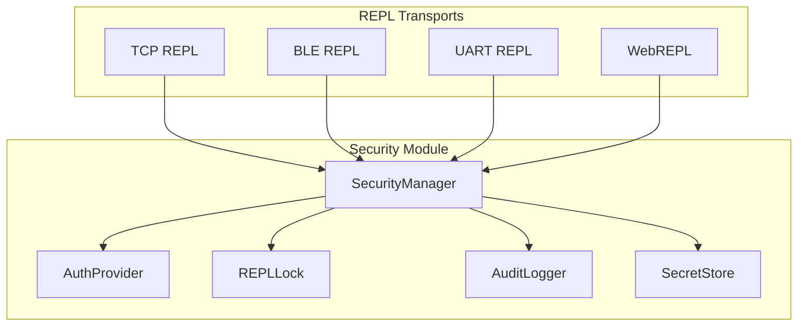
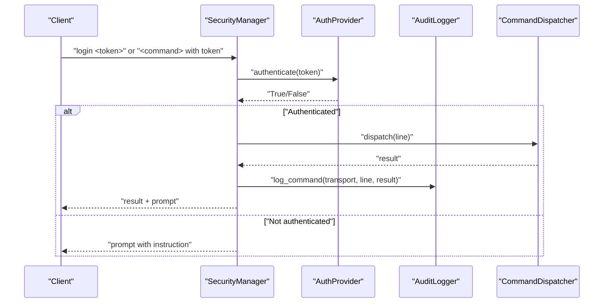
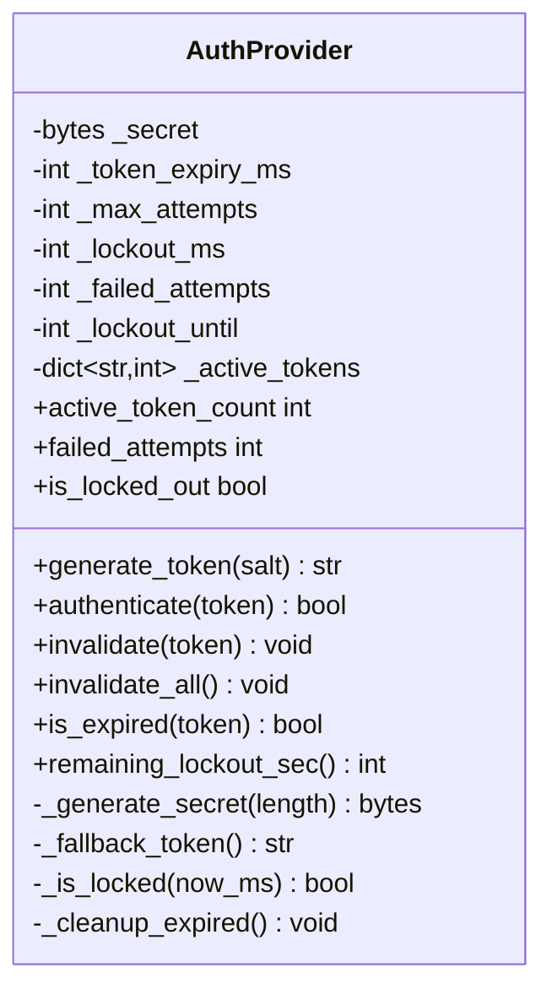
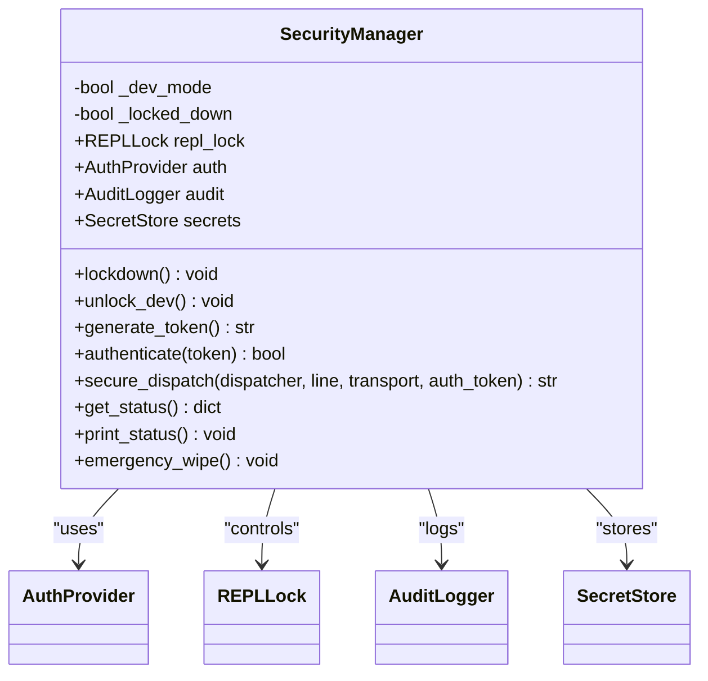
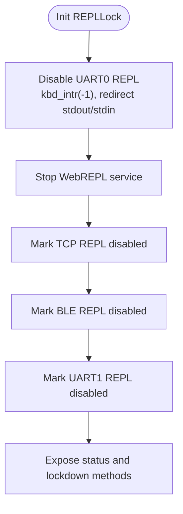
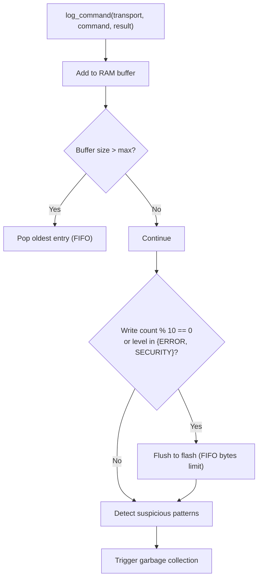
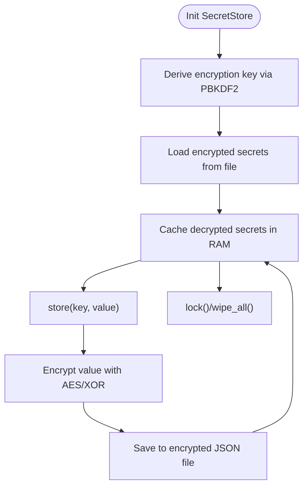
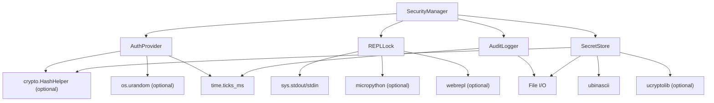
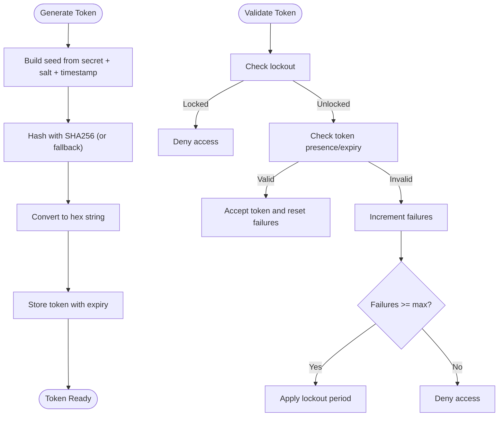

# Authentication System

<cite>
**Referenced Files in This Document**
- [auth_provider.py](file://src/lib/security/auth_provider.py)
- [security_manager.py](file://src/lib/security/security_manager.py)
- [repl_lock.py](file://src/lib/security/repl_lock.py)
- [secret_store.py](file://src/lib/security/secret_store.py)
- [audit_logger.py](file://src/lib/security/audit_logger.py)
- [secure_production_example.py](file://src/main/examples/secure_production_example.py)
- [repl_example.py](file://src/main/examples/repl_example.py)
</cite>

## Table of Contents
1. [Introduction](#introduction)
2. [Project Structure](#project-structure)
3. [Core Components](#core-components)
4. [Architecture Overview](#architecture-overview)
5. [Detailed Component Analysis](#detailed-component-analysis)
6. [Dependency Analysis](#dependency-analysis)
7. [Performance Considerations](#performance-considerations)
8. [Troubleshooting Guide](#troubleshooting-guide)
9. [Conclusion](#conclusion)
10. [Appendices](#appendices)

## Introduction
This document describes the authentication system centered around the AuthProvider class, which implements token-based authentication and session-like management for secure REPL access in embedded IoT environments. It covers token generation with cryptographically secure randomness, token validation and expiration handling, failed attempt tracking with lockout mechanisms, and rate limiting to protect against brute-force attacks. It also explains how the AuthProvider integrates with the SecurityManager to orchestrate lockdown, audit logging, secret storage, and secure REPL dispatching. Practical examples demonstrate authentication flows, token lifecycle management, and security configuration patterns tailored for resource-constrained devices.

## Project Structure
The authentication system resides under the security module and integrates with REPL transports and auxiliary components:
- AuthProvider: token generation, validation, lockout, and token lifecycle
- SecurityManager: orchestrates AuthProvider, REPLLock, AuditLogger, and SecretStore
- REPLLock: disables REPL channels in production
- AuditLogger: records commands and suspicious activity
- SecretStore: encrypted storage for sensitive data
- Example scripts demonstrate usage patterns and integration

**Diagram sources**
- [auth_provider.py:23-257](file://src/lib/security/auth_provider.py#L23-L257)
- [security_manager.py:25-323](file://src/lib/security/security_manager.py#L25-L323)
- [repl_lock.py:29-227](file://src/lib/security/repl_lock.py#L29-L227)
- [audit_logger.py:17-197](file://src/lib/security/audit_logger.py#L17-L197)
- [secret_store.py:39-375](file://src/lib/security/secret_store.py#L39-L375)

**Section sources**
- [auth_provider.py:1-257](file://src/lib/security/auth_provider.py#L1-L257)
- [security_manager.py:1-323](file://src/lib/security/security_manager.py#L1-L323)
- [repl_lock.py:1-227](file://src/lib/security/repl_lock.py#L1-L227)
- [audit_logger.py:1-197](file://src/lib/security/audit_logger.py#L1-L197)
- [secret_store.py:1-375](file://src/lib/security/secret_store.py#L1-L375)

## Core Components
- AuthProvider
  - Generates cryptographically strong tokens using entropy from device identifiers and random sources
  - Validates tokens against active token set and expiry timestamps
  - Tracks failed attempts and applies lockout periods
  - Manages token lifecycle (creation, invalidation, cleanup)
- SecurityManager
  - Initializes and coordinates AuthProvider, REPLLock, AuditLogger, and SecretStore
  - Provides secure dispatch for REPL commands with optional token-based authentication
  - Exposes lockdown and emergency operations
- REPLLock
  - Disables various REPL channels in production to prevent unauthorized access
- AuditLogger
  - Logs commands and security events with FIFO buffering and suspicious pattern detection
- SecretStore
  - Stores secrets encrypted at rest with PBKDF2-derived keys and optional AES encryption

**Section sources**
- [auth_provider.py:23-257](file://src/lib/security/auth_provider.py#L23-L257)
- [security_manager.py:25-323](file://src/lib/security/security_manager.py#L25-L323)
- [repl_lock.py:29-227](file://src/lib/security/repl_lock.py#L29-L227)
- [audit_logger.py:17-197](file://src/lib/security/audit_logger.py#L17-L197)
- [secret_store.py:39-375](file://src/lib/security/secret_store.py#L39-L375)

## Architecture Overview
The SecurityManager acts as the central orchestrator. It initializes the AuthProvider with configurable expiry, failure thresholds, and lockout durations. When REPL commands arrive via TCP, BLE, UART, or WebREPL, the SecurityManager’s secure dispatch wraps the CommandDispatcher to enforce authentication. AuditLogger captures all commands and suspicious activity. REPLLock ensures REPL channels are disabled in production. SecretStore manages encrypted credentials.

**Diagram sources**
- [security_manager.py:220-251](file://src/lib/security/security_manager.py#L220-L251)
- [auth_provider.py:147-183](file://src/lib/security/auth_provider.py#L147-L183)
- [audit_logger.py:57-96](file://src/lib/security/audit_logger.py#L57-L96)

## Detailed Component Analysis

### AuthProvider
AuthProvider encapsulates token-based authentication with the following capabilities:
- Cryptographically secure token generation using device entropy and random salts
- Token validation against active tokens and expiry timestamps
- Failed attempt tracking and lockout enforcement
- Token lifecycle management (invalidate, invalidate_all, is_expired, cleanup)

**Diagram sources**
- [auth_provider.py:23-257](file://src/lib/security/auth_provider.py#L23-L257)

Key implementation patterns:
- Secret generation combines device identifiers and random sources for uniqueness and entropy
- Token composition includes a secret, random salt, and timestamp, hashed to produce a 64-character hex token
- Validation checks lockout state, token presence, and expiry; increments failures and applies lockout after threshold
- Token storage maps token to expiry timestamps; periodic cleanup removes expired entries

Security configurations:
- Token expiry defaults to 10 minutes
- Maximum failed attempts before lockout defaults to 5
- Lockout duration defaults to 5 minutes

Practical usage patterns:
- Generate a token and distribute it securely to authorized operators
- Authenticate incoming tokens for REPL commands
- Invalidate tokens on logout or revocation
- Monitor lockout state and remaining lockout time

**Section sources**
- [auth_provider.py:42-66](file://src/lib/security/auth_provider.py#L42-L66)
- [auth_provider.py:70-96](file://src/lib/security/auth_provider.py#L70-L96)
- [auth_provider.py:100-143](file://src/lib/security/auth_provider.py#L100-L143)
- [auth_provider.py:147-194](file://src/lib/security/auth_provider.py#L147-L194)
- [auth_provider.py:198-233](file://src/lib/security/auth_provider.py#L198-L233)
- [auth_provider.py:236-257](file://src/lib/security/auth_provider.py#L236-L257)

### SecurityManager
SecurityManager orchestrates the authentication and security subsystems:
- Initializes AuthProvider with configurable parameters
- Coordinates REPLLock to disable channels in production
- Integrates AuditLogger for command and security event logging
- Manages SecretStore for encrypted credential storage
- Provides secure dispatch for REPL commands with optional token-based authentication

**Diagram sources**
- [security_manager.py:25-82](file://src/lib/security/security_manager.py#L25-L82)
- [security_manager.py:125-177](file://src/lib/security/security_manager.py#L125-L177)
- [security_manager.py:193-251](file://src/lib/security/security_manager.py#L193-L251)
- [security_manager.py:255-294](file://src/lib/security/security_manager.py#L255-L294)

Operational highlights:
- Default configuration balances security and usability (REPL lockdown, auth expiry, audit limits, secret PBKDF2 iterations)
- Secure dispatch handles login commands and enforces authentication for subsequent commands
- Status reporting exposes active tokens, failed attempts, lockout state, suspicious events, and secret store state
- Emergency wipe clears secrets, audit logs, invalidates tokens, and enforces lockdown

**Section sources**
- [security_manager.py:42-82](file://src/lib/security/security_manager.py#L42-L82)
- [security_manager.py:85-122](file://src/lib/security/security_manager.py#L85-L122)
- [security_manager.py:125-177](file://src/lib/security/security_manager.py#L125-L177)
- [security_manager.py:193-251](file://src/lib/security/security_manager.py#L193-L251)
- [security_manager.py:255-294](file://src/lib/security/security_manager.py#L255-L294)
- [security_manager.py:297-323](file://src/lib/security/security_manager.py#L297-L323)

### REPLLock
REPLLock disables REPL channels in production to prevent unauthorized access:
- UART0 REPL lockdown with keyboard interrupt disabling and stream redirection
- WebREPL service stoppage
- TCP and BLE REPL channel marking for external authentication
- Status reporting and lockdown/unlock operations

**Diagram sources**
- [repl_lock.py:47-100](file://src/lib/security/repl_lock.py#L47-L100)
- [repl_lock.py:116-149](file://src/lib/security/repl_lock.py#L116-L149)
- [repl_lock.py:152-181](file://src/lib/security/repl_lock.py#L152-L181)
- [repl_lock.py:174-203](file://src/lib/security/repl_lock.py#L174-L203)

**Section sources**
- [repl_lock.py:62-100](file://src/lib/security/repl_lock.py#L62-L100)
- [repl_lock.py:116-149](file://src/lib/security/repl_lock.py#L116-L149)
- [repl_lock.py:152-181](file://src/lib/security/repl_lock.py#L152-L181)
- [repl_lock.py:185-203](file://src/lib/security/repl_lock.py#L185-L203)

### AuditLogger
AuditLogger maintains a FIFO buffer of recent commands and detects suspicious patterns:
- Logs commands with transport, command, and result
- Flushes buffer to flash periodically and on security events
- Suspicious pattern detection for potentially dangerous commands
- Query recent logs and clear logs

**Diagram sources**
- [audit_logger.py:57-96](file://src/lib/security/audit_logger.py#L57-L96)
- [audit_logger.py:100-131](file://src/lib/security/audit_logger.py#L100-L131)
- [audit_logger.py:134-149](file://src/lib/security/audit_logger.py#L134-L149)

**Section sources**
- [audit_logger.py:57-96](file://src/lib/security/audit_logger.py#L57-L96)
- [audit_logger.py:100-131](file://src/lib/security/audit_logger.py#L100-L131)
- [audit_logger.py:134-149](file://src/lib/security/audit_logger.py#L134-L149)

### SecretStore
SecretStore provides encrypted storage for secrets:
- PBKDF2-derived encryption key from master key and salt
- AES-CBC encryption (when available) with XOR fallback
- JSON-based encrypted storage with automatic loading and saving
- Lock and wipe operations for emergency scenarios

**Diagram sources**
- [secret_store.py:53-79](file://src/lib/security/secret_store.py#L53-L79)
- [secret_store.py:112-129](file://src/lib/security/secret_store.py#L112-L129)
- [secret_store.py:222-236](file://src/lib/security/secret_store.py#L222-L236)
- [secret_store.py:311-364](file://src/lib/security/secret_store.py#L311-L364)

**Section sources**
- [secret_store.py:82-129](file://src/lib/security/secret_store.py#L82-L129)
- [secret_store.py:222-236](file://src/lib/security/secret_store.py#L222-L236)
- [secret_store.py:311-364](file://src/lib/security/secret_store.py#L311-L364)

## Dependency Analysis
The SecurityManager composes and coordinates the authentication and security subsystems. AuthProvider depends on device entropy and random sources for token generation and uses a hashing interface when available. REPLLock interacts with system streams and optional REPL services. AuditLogger persists logs to flash with FIFO constraints. SecretStore relies on cryptographic primitives and filesystem I/O.

**Diagram sources**
- [security_manager.py:19-22](file://src/lib/security/security_manager.py#L19-L22)
- [auth_provider.py:16-20](file://src/lib/security/auth_provider.py#L16-L20)
- [auth_provider.py:13-14](file://src/lib/security/auth_provider.py#L13-L14)
- [auth_provider.py:13-14](file://src/lib/security/auth_provider.py#L13-L14)
- [repl_lock.py:16-26](file://src/lib/security/repl_lock.py#L16-L26)
- [audit_logger.py:13-14](file://src/lib/security/audit_logger.py#L13-L14)
- [secret_store.py:20-36](file://src/lib/security/secret_store.py#L20-L36)

**Section sources**
- [security_manager.py:19-22](file://src/lib/security/security_manager.py#L19-L22)
- [auth_provider.py:16-20](file://src/lib/security/auth_provider.py#L16-L20)
- [auth_provider.py:13-14](file://src/lib/security/auth_provider.py#L13-L14)
- [repl_lock.py:16-26](file://src/lib/security/repl_lock.py#L16-L26)
- [audit_logger.py:13-14](file://src/lib/security/audit_logger.py#L13-L14)
- [secret_store.py:20-36](file://src/lib/security/secret_store.py#L20-L36)

## Performance Considerations
- Token storage uses an in-memory dictionary keyed by token with expiry timestamps; cleanup removes expired entries periodically
- Authentication checks lockout state, token presence, and expiry in O(1) average time
- AuditLogger uses a bounded RAM buffer and flushes to flash to minimize flash wear
- SecretStore caches decrypted secrets in RAM for fast access but locks or wipes on security events
- REPLLock minimizes overhead by marking channels disabled and redirecting streams

[No sources needed since this section provides general guidance]

## Troubleshooting Guide
Common issues and resolutions:
- Authentication fails repeatedly due to lockout
  - Cause: exceeded maximum failed attempts
  - Resolution: wait for lockout period to expire or reset counters via API
- Expired tokens
  - Cause: token lifetime exceeded
  - Resolution: generate a new token and distribute it securely
- REPL access still possible
  - Cause: development mode or unlocked channels
  - Resolution: ensure lockdown is applied and channels are disabled
- Audit logs missing
  - Cause: buffer not flushed or file write failure
  - Resolution: trigger flush or check filesystem permissions
- Secrets inaccessible
  - Cause: store locked or corrupted file
  - Resolution: unlock store or perform emergency wipe and reload

**Section sources**
- [auth_provider.py:156-183](file://src/lib/security/auth_provider.py#L156-L183)
- [auth_provider.py:213-224](file://src/lib/security/auth_provider.py#L213-L224)
- [security_manager.py:125-177](file://src/lib/security/security_manager.py#L125-L177)
- [audit_logger.py:100-131](file://src/lib/security/audit_logger.py#L100-L131)
- [secret_store.py:311-335](file://src/lib/security/secret_store.py#L311-L335)

## Conclusion
The AuthProvider and SecurityManager deliver a robust, embedded-friendly authentication and session management solution. They combine cryptographically sound token generation, strict expiry handling, rate limiting, and lockout mechanisms to mitigate brute-force attacks. Integration with REPLLock, AuditLogger, and SecretStore provides a comprehensive security posture suitable for production IoT deployments. The included examples illustrate practical deployment patterns and secure operational procedures.

[No sources needed since this section summarizes without analyzing specific files]

## Appendices

### Authentication Workflows
- Token generation
  - Generate a new token with a random salt and current timestamp
  - Store token with expiry timestamp
- Token validation
  - Check lockout state
  - Verify token presence and non-expiry
  - Increment failures on mismatch and apply lockout if threshold reached
- Secure REPL dispatch
  - Accept login command with token
  - Enforce authentication for subsequent commands
  - Log commands and suspicious activity

**Diagram sources**
- [auth_provider.py:100-127](file://src/lib/security/auth_provider.py#L100-L127)
- [auth_provider.py:147-194](file://src/lib/security/auth_provider.py#L147-L194)

### Security Configuration Patterns
- Default production configuration
  - REPL lockdown for UART0, WebREPL, TCP, BLE, and UART1
  - Auth token expiry: 10 minutes
  - Max failed attempts: 5
  - Lockout duration: 5 minutes
  - Audit log size cap: 10 KB
  - Secret PBKDF2 iterations: 10,000
- Development mode
  - Unlock all channels and disable lockdown for testing
- Emergency operations
  - Wipe secrets, clear logs, revoke tokens, enforce lockdown

**Section sources**
- [security_manager.py:85-122](file://src/lib/security/security_manager.py#L85-L122)
- [security_manager.py:125-177](file://src/lib/security/security_manager.py#L125-L177)
- [security_manager.py:297-323](file://src/lib/security/security_manager.py#L297-L323)

### Practical Examples
- Basic lockdown and status
  - Initialize SecurityManager and apply lockdown
  - Print security status
- Encrypted secrets
  - Store, retrieve, list, and delete secrets
- Token authentication
  - Generate token, authenticate valid and invalid tokens, revoke tokens
- Audit logging
  - Log commands and security events, detect suspicious activity, read logs
- Emergency wipe
  - Wipe secrets, logs, revoke tokens, enforce lockdown
- REPL channel control
  - Lock specific channels individually

**Section sources**
- [secure_production_example.py:20-40](file://src/main/examples/secure_production_example.py#L20-L40)
- [secure_production_example.py:44-74](file://src/main/examples/secure_production_example.py#L44-L74)
- [secure_production_example.py:79-110](file://src/main/examples/secure_production_example.py#L79-L110)
- [secure_production_example.py:115-151](file://src/main/examples/secure_production_example.py#L115-L151)
- [secure_production_example.py:157-178](file://src/main/examples/secure_production_example.py#L157-L178)
- [secure_production_example.py:184-207](file://src/main/examples/secure_production_example.py#L184-L207)
- [secure_production_example.py:212-244](file://src/main/examples/secure_production_example.py#L212-L244)

### Authentication Security Best Practices
- Prefer token-based authentication over static passwords for higher entropy
- Keep token lifetimes short and rotate tokens regularly
- Enforce lockout policies to deter brute-force attacks
- Use encrypted secret storage for credentials and sensitive data
- Log all REPL commands and monitor for suspicious activity
- Apply production lockdown to disable REPL channels by default
- Use emergency wipe procedures to recover from compromise scenarios

[No sources needed since this section provides general guidance]