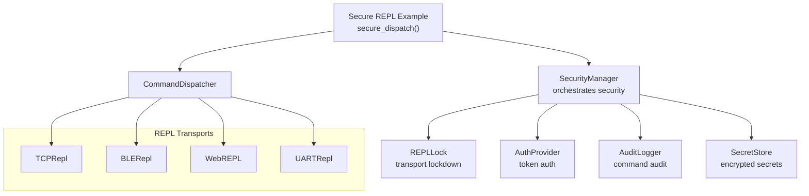
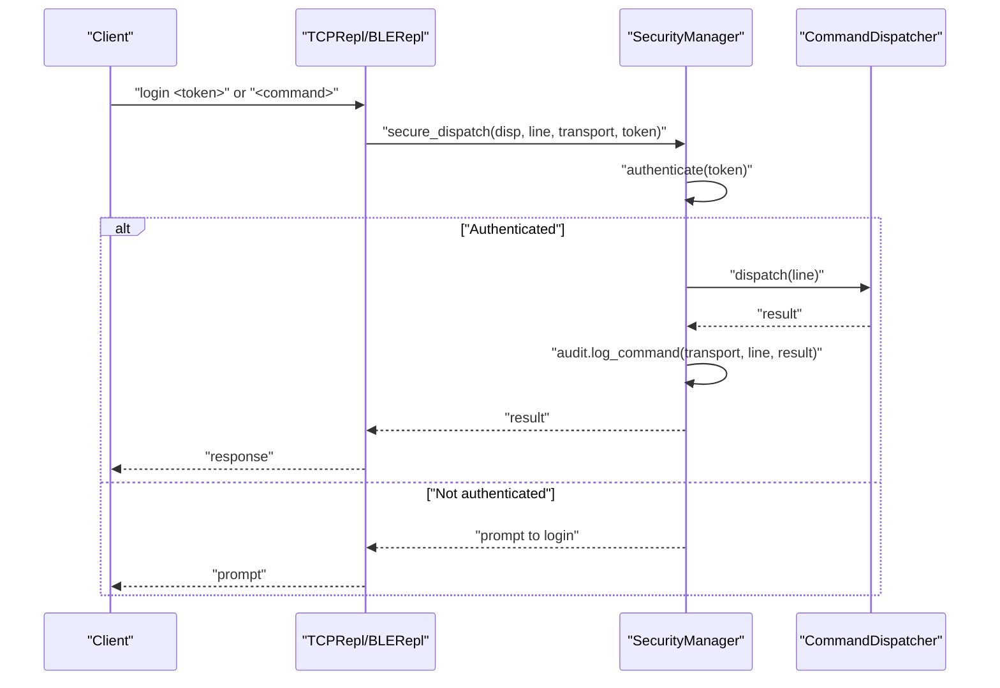
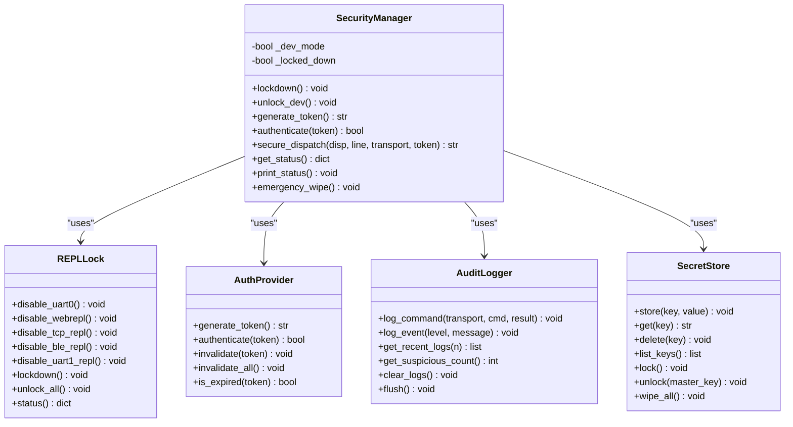
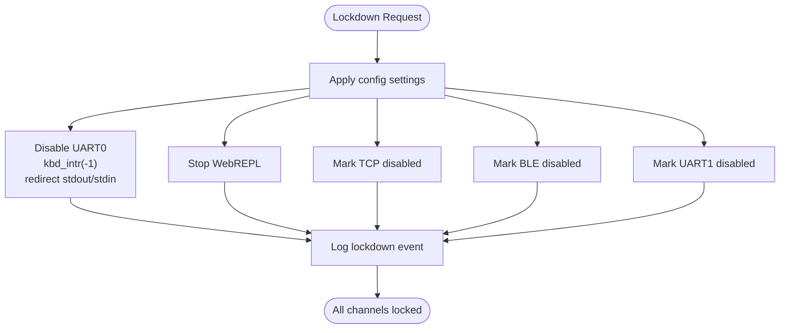
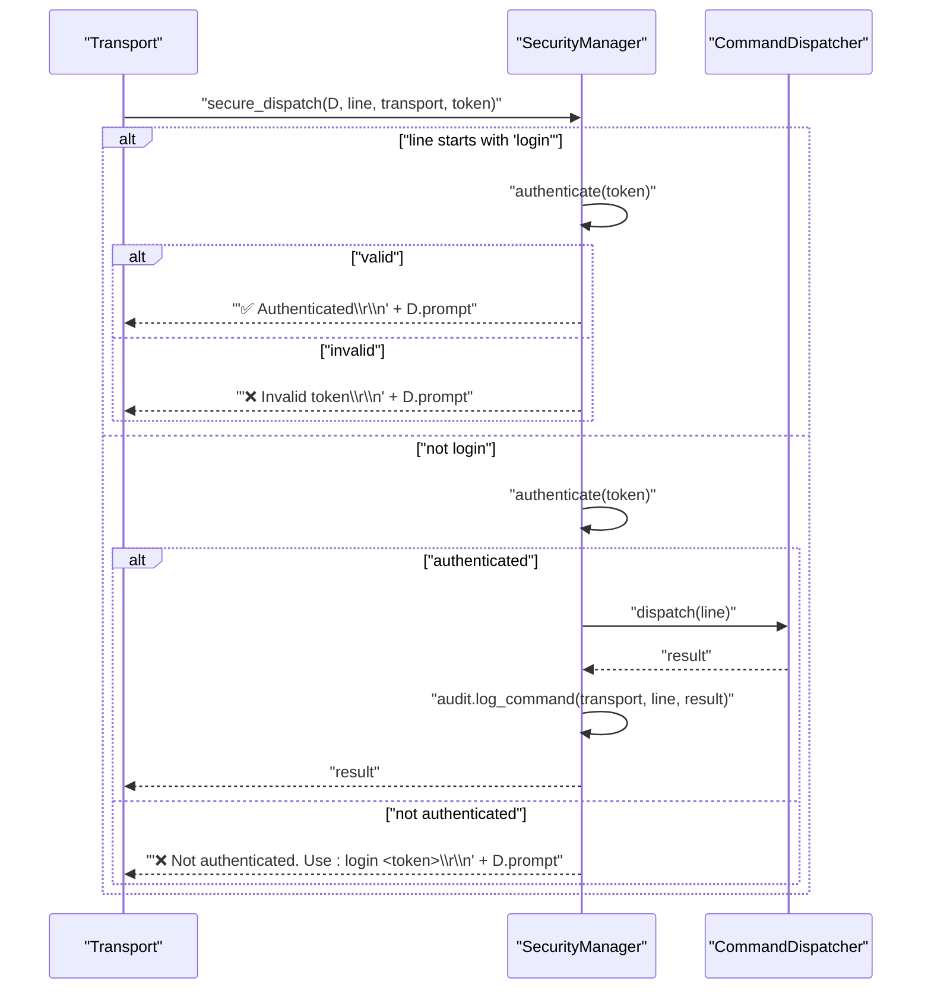
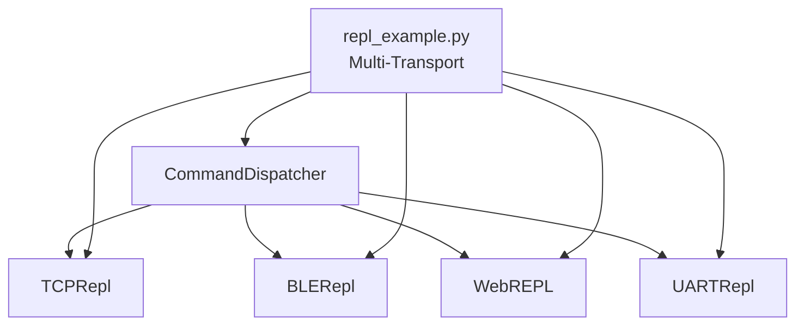
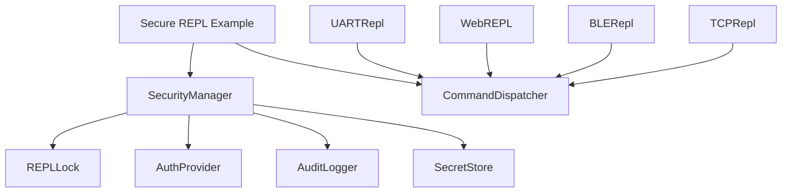

# REPL Security

<cite>
**Referenced Files in This Document**
- [security_manager.py](file://src/lib/security/security_manager.py)
- [repl_lock.py](file://src/lib/security/repl_lock.py)
- [README.md](file://src/lib/security/README.md)
- [repl_example.py](file://src/main/examples/repl_example.py)
- [secure_production_example.py](file://src/main/examples/secure_production_example.py)
- [tcp_repl.py](file://src/lib/repl/tcp_repl.py)
- [__init__.py](file://src/lib/repl/__init__.py)
</cite>

## Table of Contents
1. [Introduction](#introduction)
2. [Project Structure](#project-structure)
3. [Core Components](#core-components)
4. [Architecture Overview](#architecture-overview)
5. [Detailed Component Analysis](#detailed-component-analysis)
6. [Dependency Analysis](#dependency-analysis)
7. [Performance Considerations](#performance-considerations)
8. [Troubleshooting Guide](#troubleshooting-guide)
9. [Conclusion](#conclusion)
10. [Appendices](#appendices)

## Introduction
This document explains REPL security management centered around the SecurityManager and REPLLock classes, and demonstrates secure command dispatching with authentication gating. It covers multi-transport REPL control (UART0/UART1 disabling, WebREPL and TCP REPL lockdown, BLE REPL security), transport-specific command routing, and integration with CommandDispatcher for protected REPL access. It also documents lockdown procedures, emergency access management, and best practices for secure remote access in embedded IoT systems.

## Project Structure
The security and REPL modules are organized under src/lib/security and src/lib/repl. Example scripts demonstrate secure configuration and protected command execution across transports.

**Diagram sources**
- [security_manager.py:25-82](file://src/lib/security/security_manager.py#L25-L82)
- [repl_lock.py:29-58](file://src/lib/security/repl_lock.py#L29-L58)
- [__init__.py:1-6](file://src/lib/repl/__init__.py#L1-L6)

**Section sources**
- [security_manager.py:25-82](file://src/lib/security/security_manager.py#L25-L82)
- [repl_lock.py:29-58](file://src/lib/security/repl_lock.py#L29-L58)
- [__init__.py:1-6](file://src/lib/repl/__init__.py#L1-L6)

## Core Components
- SecurityManager: Central orchestrator for lockdown, token generation/authentication, secure dispatch, audit logging, and emergency wipe.
- REPLLock: Transport-level lockdown controller for UART0, WebREPL, TCP, BLE, and UART1.
- CommandDispatcher: Command routing and execution engine integrated with secure dispatch.
- TCPRepl/BLERepl/WebREPL/UARTRepl: Transport implementations supporting optional authentication and secure dispatch.

Key responsibilities:
- Lockdown: Disable REPL channels and enforce audit/logging/secrets policies.
- Authentication: Token-based gating for protected REPL access.
- Secure dispatch: Wraps CommandDispatcher to require authentication per transport.
- Audit: Logs commands and suspicious activity.
- Emergency: Wipe secrets, revoke tokens, clear logs, and lock down.

**Section sources**
- [security_manager.py:125-178](file://src/lib/security/security_manager.py#L125-L178)
- [security_manager.py:220-251](file://src/lib/security/security_manager.py#L220-L251)
- [repl_lock.py:204-227](file://src/lib/security/repl_lock.py#L204-L227)
- [README.md:199-234](file://src/lib/security/README.md#L199-L234)

## Architecture Overview
The secure REPL architecture integrates SecurityManager with transport-specific REPL servers and CommandDispatcher. SecurityManager enforces lockdown and authentication, while transports route commands through secure_dispatch().

**Diagram sources**
- [security_manager.py:220-251](file://src/lib/security/security_manager.py#L220-L251)
- [tcp_repl.py:35-106](file://src/lib/repl/tcp_repl.py#L35-L106)

## Detailed Component Analysis

### SecurityManager
SecurityManager orchestrates lockdown, authentication, secure dispatch, audit, and secrets. It loads configuration, initializes subsystems, and exposes APIs for token generation, authentication, and emergency wipe.

- Lockdown procedure:
  - Applies REPLLock settings from configuration.
  - Logs lockdown event and optionally locks secret store.
- Secure dispatch:
  - Handles login command and validates token.
  - Requires authentication before dispatching commands.
  - Audits each command execution.
- Status and emergency:
  - Provides consolidated status across subsystems.
  - Emergency wipe clears secrets, logs, revokes tokens, and locks down if needed.

**Diagram sources**
- [security_manager.py:25-82](file://src/lib/security/security_manager.py#L25-L82)
- [repl_lock.py:29-58](file://src/lib/security/repl_lock.py#L29-L58)

**Section sources**
- [security_manager.py:125-178](file://src/lib/security/security_manager.py#L125-L178)
- [security_manager.py:220-251](file://src/lib/security/security_manager.py#L220-L251)
- [security_manager.py:297-323](file://src/lib/security/security_manager.py#L297-L323)

### REPLLock
REPLLock provides transport-specific lockdown controls:
- UART0: Disables keyboard interrupts and redirects stdout/stdin to prevent interactive access.
- WebREPL: Stops the built-in WebREPL service.
- TCP/UART1: Marks channels disabled for enforcement by transport servers and secure dispatch.
- BLE: Marks channel disabled for enforcement by transport servers and secure dispatch.

**Diagram sources**
- [security_manager.py:149-166](file://src/lib/security/security_manager.py#L149-L166)
- [repl_lock.py:62-100](file://src/lib/security/repl_lock.py#L62-L100)
- [repl_lock.py:116-130](file://src/lib/security/repl_lock.py#L116-L130)
- [repl_lock.py:152-159](file://src/lib/security/repl_lock.py#L152-L159)
- [repl_lock.py:163-170](file://src/lib/security/repl_lock.py#L163-L170)
- [repl_lock.py:174-181](file://src/lib/security/repl_lock.py#L174-L181)

**Section sources**
- [repl_lock.py:62-100](file://src/lib/security/repl_lock.py#L62-L100)
- [repl_lock.py:116-130](file://src/lib/security/repl_lock.py#L116-L130)
- [repl_lock.py:152-159](file://src/lib/security/repl_lock.py#L152-L159)
- [repl_lock.py:163-170](file://src/lib/security/repl_lock.py#L163-L170)
- [repl_lock.py:174-181](file://src/lib/security/repl_lock.py#L174-L181)
- [repl_lock.py:204-227](file://src/lib/security/repl_lock.py#L204-L227)

### Secure Command Dispatching
SecurityManager.secure_dispatch wraps CommandDispatcher.dispatch with authentication and audit logging. It supports:
- Login command to validate tokens.
- Transport-specific gating via token-based authentication.
- Audit logging of commands and results.

**Diagram sources**
- [security_manager.py:220-251](file://src/lib/security/security_manager.py#L220-L251)

**Section sources**
- [security_manager.py:220-251](file://src/lib/security/security_manager.py#L220-L251)

### Multi-Transport REPL Control
The examples demonstrate enabling/disabling transports and combining them with shared CommandDispatcher:
- TCP REPL with optional password.
- BLE REPL with advertising and command support.
- WebREPL enablement for browser-based access.
- Shared CommandDispatcher across transports.

**Diagram sources**
- [repl_example.py:320-360](file://src/main/examples/repl_example.py#L320-L360)
- [__init__.py:1-6](file://src/lib/repl/__init__.py#L1-L6)

**Section sources**
- [repl_example.py:353-368](file://src/main/examples/repl_example.py#L353-L368)
- [repl_example.py:143-165](file://src/main/examples/repl_example.py#L143-L165)
- [repl_example.py:247-299](file://src/main/examples/repl_example.py#L247-L299)

### Practical Examples from repl_example.py
- Basic CommandDispatcher usage without network.
- TCP REPL with WiFi and optional password.
- UART REPL on UART1 (avoiding UART0).
- BLE REPL with advertising and commands.
- Multi-transport setup with shared CommandDispatcher and WebREPL enablement.

These examples illustrate secure REPL configuration patterns and protected command execution workflows.

**Section sources**
- [repl_example.py:31-76](file://src/main/examples/repl_example.py#L31-L76)
- [repl_example.py:82-141](file://src/main/examples/repl_example.py#L82-L141)
- [repl_example.py:171-241](file://src/main/examples/repl_example.py#L171-L241)
- [repl_example.py:247-299](file://src/main/examples/repl_example.py#L247-L299)
- [repl_example.py:305-383](file://src/main/examples/repl_example.py#L305-L383)

### Secure Production Example
Demonstrates individual channel locking and full production simulation with SecurityManager lockdown and secret storage.

**Section sources**
- [secure_production_example.py:183-207](file://src/main/examples/secure_production_example.py#L183-L207)
- [secure_production_example.py:212-223](file://src/main/examples/secure_production_example.py#L212-L223)

## Dependency Analysis
SecurityManager composes REPLLock, AuthProvider, AuditLogger, and SecretStore. REPL transports depend on CommandDispatcher and optionally on SecurityManager for secure dispatch.

**Diagram sources**
- [security_manager.py:64-79](file://src/lib/security/security_manager.py#L64-L79)
- [__init__.py:1-6](file://src/lib/repl/__init__.py#L1-L6)

**Section sources**
- [security_manager.py:64-79](file://src/lib/security/security_manager.py#L64-L79)
- [__init__.py:1-6](file://src/lib/repl/__init__.py#L1-L6)

## Performance Considerations
- Authentication overhead: Token validation and audit logging add minimal overhead but provide strong protection against unauthorized access.
- Transport selection: Prefer BLE/TCP with tokens for remote access; avoid UART0 for production to prevent physical access bypass.
- Audit log size: Configure max file size to balance visibility and storage constraints.
- Memory usage: REPLLock redirects stdout/stdin and SecurityManager locks secret stores to minimize memory footprint during lockdown.

## Troubleshooting Guide
Common issues and resolutions:
- Authentication failures:
  - Verify token validity and expiration.
  - Check failed attempts and lockout status.
  - Use emergency_wipe to recover from compromised state.
- Transport access problems:
  - Confirm lockdown status and transport-specific flags.
  - Re-enable transports only in development mode.
- Audit anomalies:
  - Review recent logs and suspicious event counts.
  - Clear logs if needed and re-run diagnostics.

**Section sources**
- [security_manager.py:255-294](file://src/lib/security/security_manager.py#L255-L294)
- [security_manager.py:297-323](file://src/lib/security/security_manager.py#L297-L323)
- [README.md:236-246](file://src/lib/security/README.md#L236-L246)

## Conclusion
The SecurityManager and REPLLock provide a robust, layered approach to REPL security in embedded IoT systems. By combining transport-specific lockdown, token-based authentication, audit logging, and emergency recovery, the system achieves strong protection against unauthorized access and code theft. Integrating secure_dispatch with CommandDispatcher ensures consistent authentication gating across all transports, while practical examples demonstrate secure configuration and protected command execution workflows.

## Appendices

### Best Practices
- Always use lockdown in production environments.
- Enforce token-based authentication for TCP/BLE/UART1 REPL.
- Avoid UART0 in production; reserve for development.
- Enable audit logging and monitor suspicious events.
- Use emergency_wipe to recover from compromise scenarios.
- Store secrets using SecretStore and lock them during lockdown.

**Section sources**
- [README.md:19-32](file://src/lib/security/README.md#L19-L32)
- [README.md:261-357](file://src/lib/security/README.md#L261-L357)