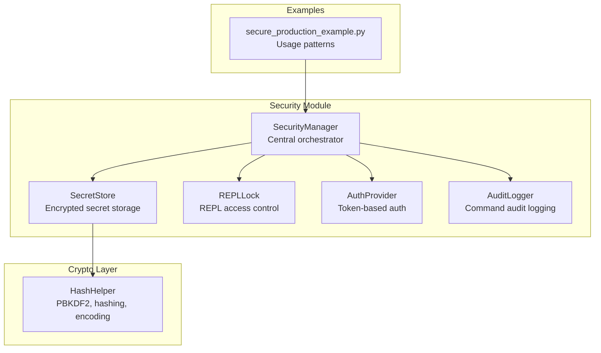
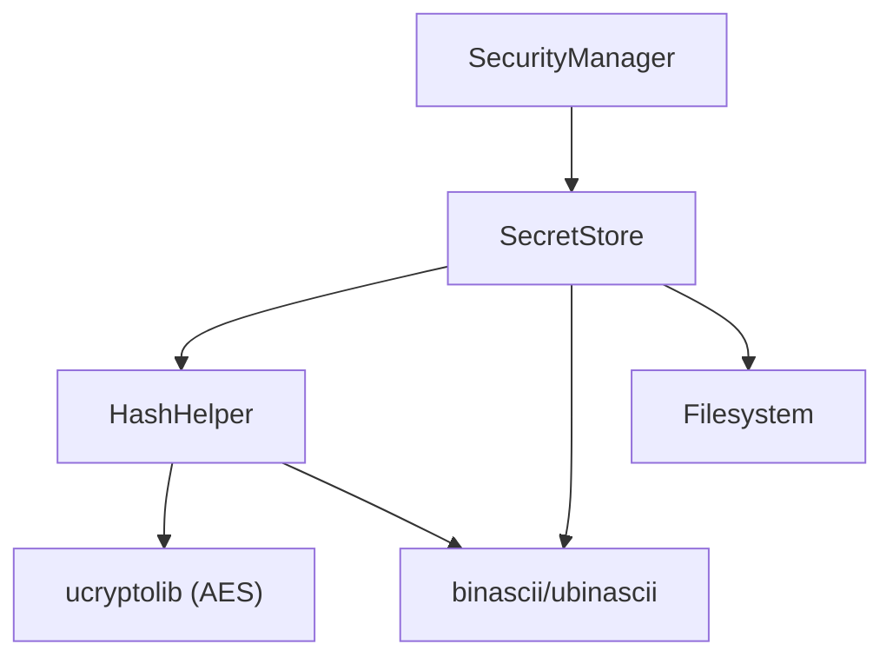
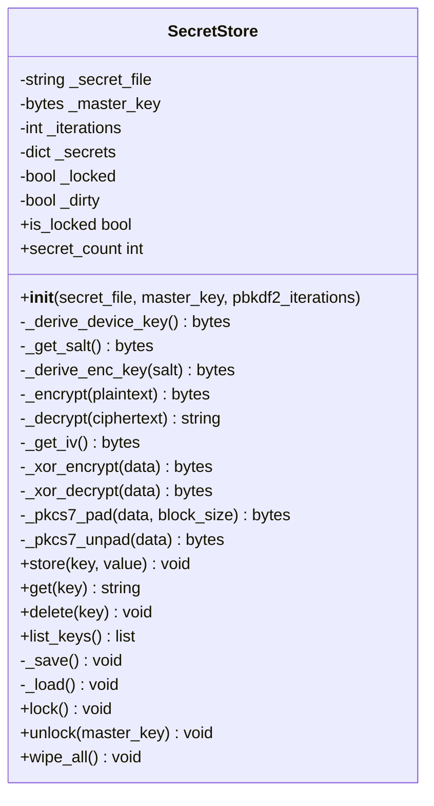
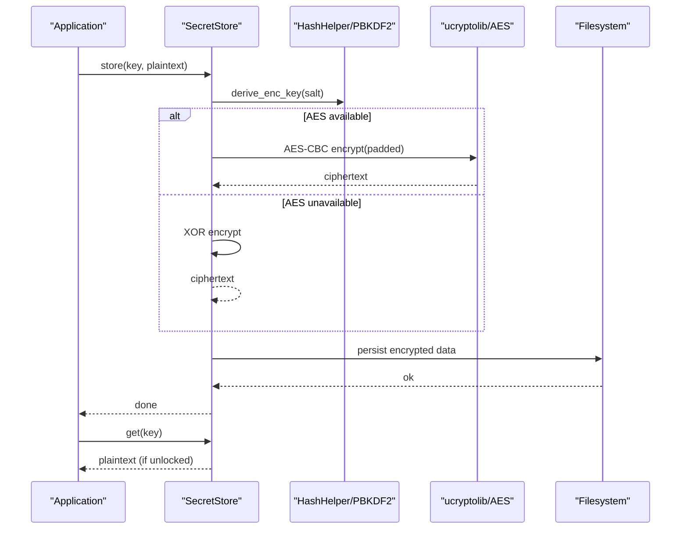
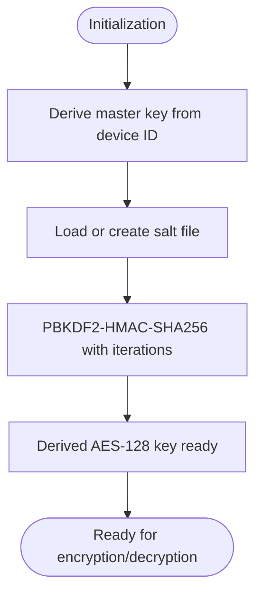
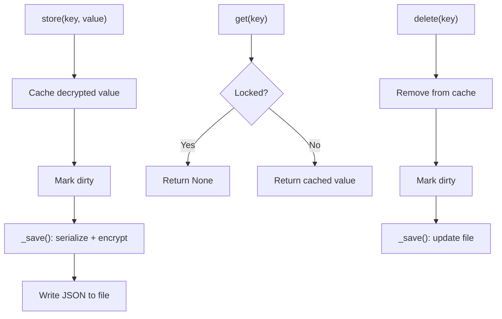
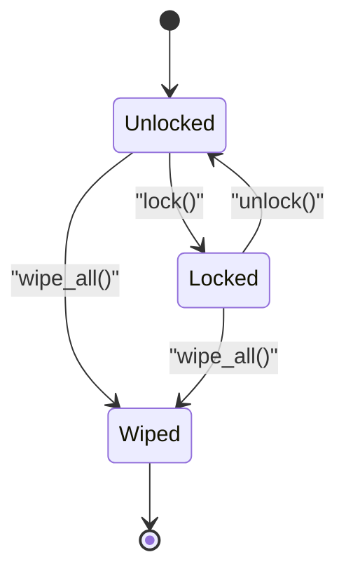
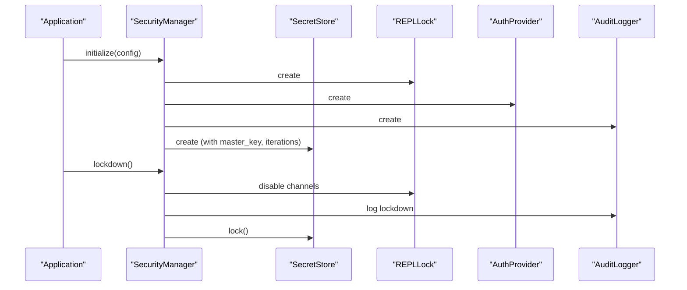
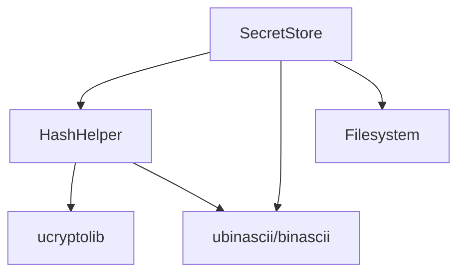

# Secret Management

<cite>
**Referenced Files in This Document**
- [secret_store.py](file://src/lib/security/secret_store.py)
- [security_manager.py](file://src/lib/security/security_manager.py)
- [__init__.py](file://src/lib/security/__init__.py)
- [crypto_helpers.py](file://src/lib/crypto/crypto_helpers.py)
- [secure_production_example.py](file://src/main/examples/secure_production_example.py)
- [repl_lock.py](file://src/lib/security/repl_lock.py)
- [auth_provider.py](file://src/lib/security/auth_provider.py)
- [audit_logger.py](file://src/lib/security/audit_logger.py)
</cite>

## Table of Contents
1. [Introduction](#introduction)
2. [Project Structure](#project-structure)
3. [Core Components](#core-components)
4. [Architecture Overview](#architecture-overview)
5. [Detailed Component Analysis](#detailed-component-analysis)
6. [Dependency Analysis](#dependency-analysis)
7. [Performance Considerations](#performance-considerations)
8. [Troubleshooting Guide](#troubleshooting-guide)
9. [Conclusion](#conclusion)
10. [Appendices](#appendices)

## Introduction
This document provides comprehensive documentation for the SecretStore class, focusing on secure secret storage and management for embedded IoT devices. It explains encryption and decryption operations using PBKDF2 key derivation with configurable iteration counts, secret persistence to encrypted files, master key management for device-unique encryption, and automatic memory wiping during lockdown. It also covers secret CRUD operations, secure storage mechanisms, key derivation processes, and integration with the SecurityManager for production deployments. Practical examples demonstrate secret configuration, encryption workflows, and secure storage patterns, along with security considerations for key management, encryption algorithms, file-based storage, and memory protection strategies tailored for constrained environments.

## Project Structure
The SecretStore resides in the security module alongside related components that collectively form a production-ready security framework for ESP32 devices running MicroPython. The module integrates with cryptographic helpers and supports fallback mechanisms for environments without dedicated hardware acceleration.

**Diagram sources**
- [secret_store.py](file://src/lib/security/secret_store.py)
- [security_manager.py](file://src/lib/security/security_manager.py)
- [crypto_helpers.py](file://src/lib/crypto/crypto_helpers.py)
- [secure_production_example.py](file://src/main/examples/secure_production_example.py)

**Section sources**
- [__init__.py](file://src/lib/security/__init__.py)
- [security_manager.py](file://src/lib/security/security_manager.py)

## Core Components
- SecretStore: Provides encrypted storage for secrets with PBKDF2-derived keys, AES-CBC encryption (when available), and XOR-based fallback. Supports CRUD operations, automatic persistence, and secure lockdown/wipe procedures.
- SecurityManager: Central orchestrator integrating REPLLock, AuthProvider, AuditLogger, and SecretStore for production-grade security.
- HashHelper: Cryptographic primitives including PBKDF2-HMAC-SHA256, SHA-256, and encoding utilities used by SecretStore.
- REPLLock: Controls REPL access channels to prevent unauthorized code execution.
- AuthProvider: Token-based authentication with expiry, rate limiting, and brute-force protection.
- AuditLogger: Records REPL commands and security events with FIFO buffering and flash persistence.

**Section sources**
- [secret_store.py](file://src/lib/security/secret_store.py)
- [security_manager.py](file://src/lib/security/security_manager.py)
- [crypto_helpers.py](file://src/lib/crypto/crypto_helpers.py)
- [repl_lock.py](file://src/lib/security/repl_lock.py)
- [auth_provider.py](file://src/lib/security/auth_provider.py)
- [audit_logger.py](file://src/lib/security/audit_logger.py)

## Architecture Overview
SecretStore participates in a layered security architecture where cryptographic operations are abstracted via HashHelper, and operational security is coordinated by SecurityManager. The system supports device-unique master keys, PBKDF2 key derivation, AES-CBC encryption with AES fallback, and robust file-based persistence with integrity checks.

**Diagram sources**
- [security_manager.py](file://src/lib/security/security_manager.py)
- [secret_store.py](file://src/lib/security/secret_store.py)
- [crypto_helpers.py](file://src/lib/crypto/crypto_helpers.py)

## Detailed Component Analysis

### SecretStore Class
SecretStore encapsulates secure secret management with the following capabilities:
- Device-unique master key derivation using device identifiers.
- PBKDF2-HMAC-SHA256 key derivation with configurable iterations.
- AES-CBC encryption with hardware acceleration fallback to XOR-based encryption.
- JSON-based encrypted storage with per-secret encryption and integrity checks.
- Automatic RAM clearing during lockdown and full wipe procedures.
- CRUD operations with transparent encryption/decryption and persistence.

Key implementation highlights:
- Master key and salt management for device uniqueness.
- PBKDF2 key derivation with AES-128 output.
- AES-CBC encryption with IV generation and PKCS7 padding.
- XOR-based fallback encryption for environments without AES support.
- JSON serialization/deserialization of encrypted secrets.
- Lockdown and wipe procedures for secure incident response.

**Diagram sources**
- [secret_store.py](file://src/lib/security/secret_store.py)

**Section sources**
- [secret_store.py](file://src/lib/security/secret_store.py)

### Encryption and Decryption Workflows
SecretStore supports two primary modes:
- AES-CBC encryption with hardware acceleration when available, using PBKDF2-derived keys and PKCS7 padding.
- XOR-based fallback encryption when AES is unavailable, using the derived key for stream-like encryption.

**Diagram sources**
- [secret_store.py](file://src/lib/security/secret_store.py)
- [crypto_helpers.py](file://src/lib/crypto/crypto_helpers.py)

**Section sources**
- [secret_store.py](file://src/lib/security/secret_store.py)
- [crypto_helpers.py](file://src/lib/crypto/crypto_helpers.py)

### Key Derivation and Master Key Management
SecretStore derives a device-unique encryption key using:
- Device identifier for master key uniqueness.
- Salt persisted separately for encryption reproducibility.
- PBKDF2-HMAC-SHA256 with configurable iteration count for key strengthening.

**Diagram sources**
- [secret_store.py](file://src/lib/security/secret_store.py)

**Section sources**
- [secret_store.py](file://src/lib/security/secret_store.py)

### Secret CRUD Operations and Persistence
SecretStore exposes straightforward CRUD operations:
- Store: Encrypts and persists secrets; marks dirty for batch saving.
- Retrieve: Returns plaintext from cached decrypted secrets (when unlocked).
- Delete: Removes from cache and persists updates.
- List Keys: Enumerates stored keys without exposing values.

Persistence uses JSON with hex-encoded ciphertext values and handles corrupted entries gracefully.

**Diagram sources**
- [secret_store.py](file://src/lib/security/secret_store.py)

**Section sources**
- [secret_store.py](file://src/lib/security/secret_store.py)

### Lockdown and Emergency Wipe Procedures
During lockdown, SecretStore clears decrypted secrets from RAM and prevents further reads/writes. Emergency wipe overwrites and removes secret files and salts, ensuring complete removal of sensitive data.

**Diagram sources**
- [secret_store.py](file://src/lib/security/secret_store.py)

**Section sources**
- [secret_store.py](file://src/lib/security/secret_store.py)

### Integration with SecurityManager
SecurityManager coordinates SecretStore with REPLLock, AuthProvider, and AuditLogger for production deployments. It initializes components, applies configuration, and triggers lockdown sequences that include locking the secret store.

**Diagram sources**
- [security_manager.py](file://src/lib/security/security_manager.py)
- [secret_store.py](file://src/lib/security/secret_store.py)
- [repl_lock.py](file://src/lib/security/repl_lock.py)
- [auth_provider.py](file://src/lib/security/auth_provider.py)
- [audit_logger.py](file://src/lib/security/audit_logger.py)

**Section sources**
- [security_manager.py](file://src/lib/security/security_manager.py)

## Dependency Analysis
SecretStore depends on cryptographic helpers and optional hardware acceleration. SecurityManager composes all security components and applies configuration-driven behavior.

**Diagram sources**
- [secret_store.py](file://src/lib/security/secret_store.py)
- [crypto_helpers.py](file://src/lib/crypto/crypto_helpers.py)

**Section sources**
- [secret_store.py](file://src/lib/security/secret_store.py)
- [crypto_helpers.py](file://src/lib/crypto/crypto_helpers.py)

## Performance Considerations
- PBKDF2 iterations: Higher iteration counts increase security but also CPU time. The default value balances security and performance for ESP32-class devices.
- AES vs XOR fallback: AES-CBC is preferred when available; XOR fallback reduces security but ensures operability on constrained systems.
- File I/O: Batch saves are triggered when secrets change; avoid frequent small writes to reduce flash wear.
- Memory management: Use lockdown to clear decrypted caches and trigger garbage collection after sensitive operations.

[No sources needed since this section provides general guidance]

## Troubleshooting Guide
Common issues and resolutions:
- Secrets not loading: Verify salt and secret files exist and are readable; check for corruption and rely on graceful skipping of corrupted entries.
- Lockdown behavior: Ensure lockdown is invoked via SecurityManager to lock the SecretStore and clear RAM caches.
- Emergency wipe: Confirm wipe_all removes both secrets and salt files; reinitialize the store afterward.
- Authentication and REPL access: Use SecurityManager to coordinate token-based access and REPL channel controls.

**Section sources**
- [secret_store.py](file://src/lib/security/secret_store.py)
- [security_manager.py](file://src/lib/security/security_manager.py)
- [repl_lock.py](file://src/lib/security/repl_lock.py)
- [auth_provider.py](file://src/lib/security/auth_provider.py)

## Conclusion
SecretStore provides a robust, layered approach to secret management on embedded IoT devices. By combining device-unique master keys, PBKDF2 key derivation, AES-CBC encryption with fallback, and secure file-based persistence, it delivers strong confidentiality and integrity guarantees. Integrated with SecurityManager, it enables production-grade lockdown, authentication, auditing, and emergency response, making it suitable for secure deployment in constrained environments.

[No sources needed since this section summarizes without analyzing specific files]

## Appendices

### Practical Examples and Usage Patterns
- Basic lockdown and status reporting for production security.
- Storing, retrieving, listing, and deleting secrets with SecretStore.
- Token generation and authentication for controlled REPL access.
- Audit logging of commands and security events.
- Emergency wipe to remove all traces of secrets and logs.

These examples demonstrate end-to-end workflows for secure secret management and operational security.

**Section sources**
- [secure_production_example.py](file://src/main/examples/secure_production_example.py)