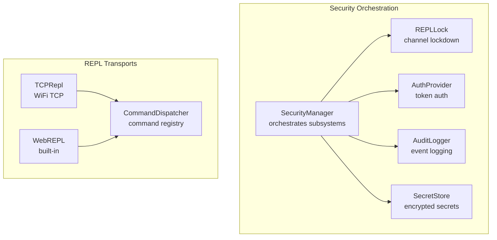
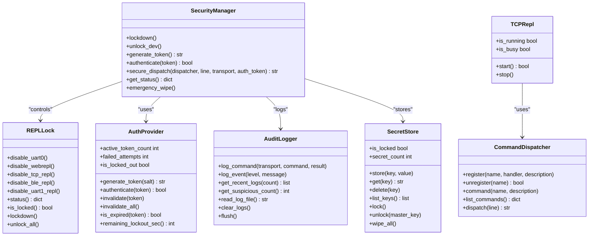
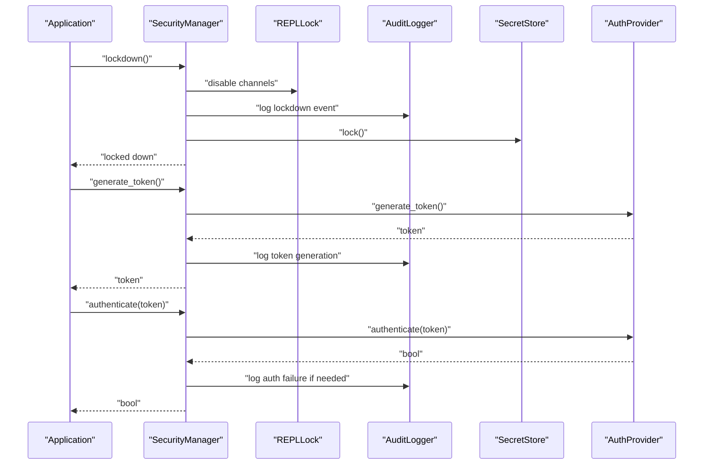
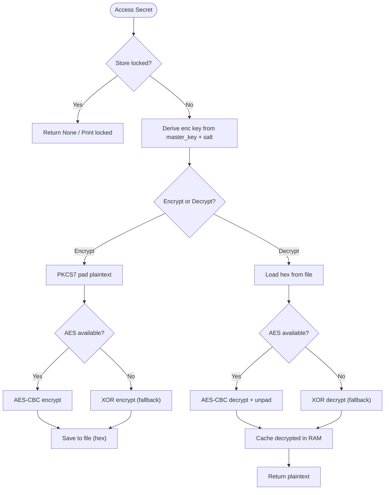
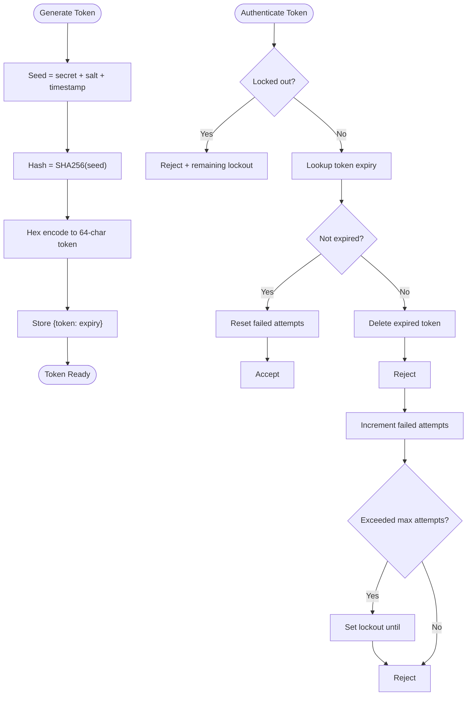
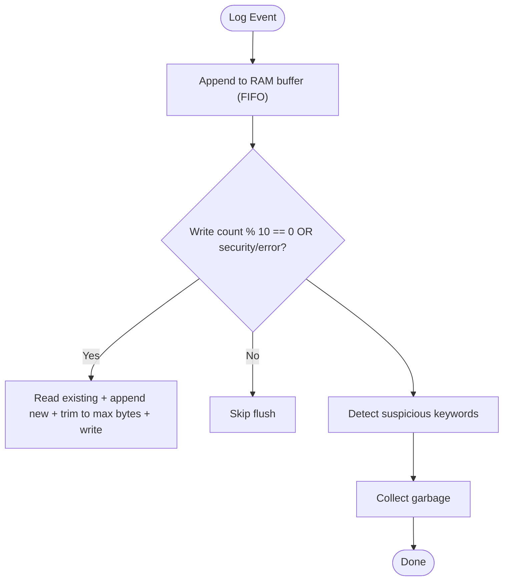
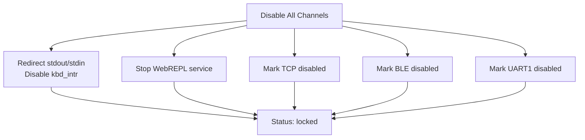
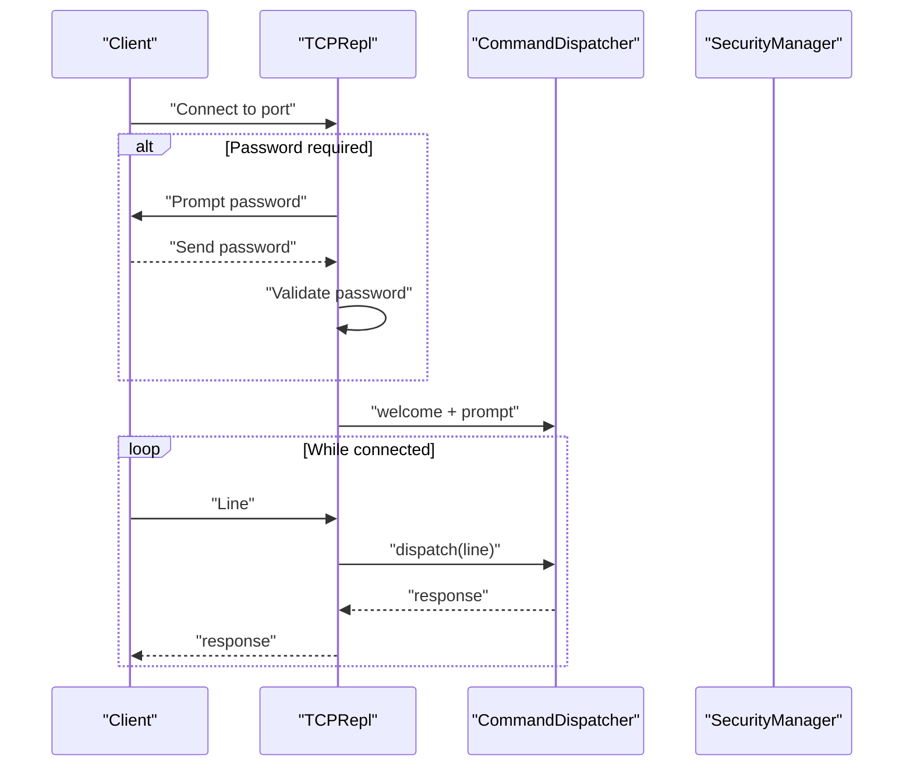
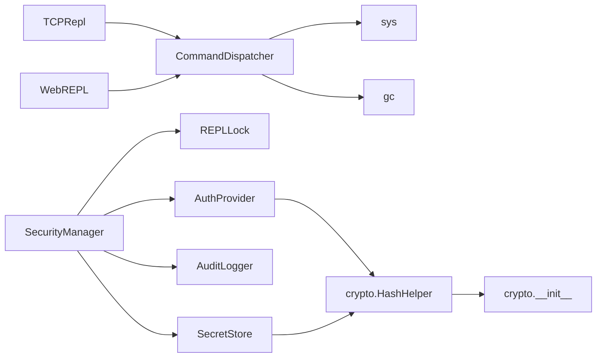

# Security & Production

<cite>
**Referenced Files in This Document**
- [secure_production_example.py](file://src/main/examples/secure_production_example.py)
- [repl_example.py](file://src/main/examples/repl_example.py)
- [security_manager.py](file://src/lib/security/security_manager.py)
- [secret_store.py](file://src/lib/security/secret_store.py)
- [auth_provider.py](file://src/lib/security/auth_provider.py)
- [audit_logger.py](file://src/lib/security/audit_logger.py)
- [repl_lock.py](file://src/lib/security/repl_lock.py)
- [command_dispatcher.py](file://src/lib/repl/command_dispatcher.py)
- [tcp_repl.py](file://src/lib/repl/tcp_repl.py)
- [crypto/__init__.py](file://src/lib/crypto/__init__.py)
</cite>

## Table of Contents
1. [Introduction](#introduction)
2. [Project Structure](#project-structure)
3. [Core Components](#core-components)
4. [Architecture Overview](#architecture-overview)
5. [Detailed Component Analysis](#detailed-component-analysis)
6. [Dependency Analysis](#dependency-analysis)
7. [Performance Considerations](#performance-considerations)
8. [Troubleshooting Guide](#troubleshooting-guide)
9. [Conclusion](#conclusion)
10. [Appendices](#appendices)

## Introduction
This document explains the security and production capabilities of the ESP32-C3 framework with a focus on:
- Security management via SecurityManager for lockdown procedures and development versus production modes
- Secret management via SecretStore for encryption and key derivation
- Authentication via AuthProvider for token-based authentication and session management
- Audit logging via AuditLogger for security event tracking
- REPL security via REPLLock for remote command interface control across TCP, UART, BLE, and Web transports
It also provides practical examples from secure_production_example.py and repl_example.py, along with best practices, threat mitigations, compliance considerations, and production deployment guidelines for enterprise IoT applications.

## Project Structure
The security and REPL stack is organized under src/lib/security and src/lib/repl, with example usage under src/main/examples. The SecurityManager orchestrates REPLLock, AuthProvider, AuditLogger, and SecretStore. REPL transports (TCP, UART, BLE, Web) integrate with CommandDispatcher and optional authentication.

**Diagram sources**
- [security_manager.py:25-82](file://src/lib/security/security_manager.py#L25-L82)
- [repl_lock.py:29-58](file://src/lib/security/repl_lock.py#L29-L58)
- [auth_provider.py:23-66](file://src/lib/security/auth_provider.py#L23-L66)
- [audit_logger.py:17-53](file://src/lib/security/audit_logger.py#L17-L53)
- [secret_store.py:39-78](file://src/lib/security/secret_store.py#L39-L78)
- [command_dispatcher.py:22-44](file://src/lib/repl/command_dispatcher.py#L22-L44)
- [tcp_repl.py:26-54](file://src/lib/repl/tcp_repl.py#L26-L54)

**Section sources**
- [secure_production_example.py:10-392](file://src/main/examples/secure_production_example.py#L10-L392)
- [repl_example.py:10-392](file://src/main/examples/repl_example.py#L10-L392)

## Core Components
- SecurityManager: central orchestrator that initializes and coordinates REPLLock, AuthProvider, AuditLogger, and SecretStore. Provides lockdown, token generation, authentication, audit logging, and emergency wipe.
- SecretStore: encrypted secret vault using PBKDF2-derived keys and AES-CBC (or XOR fallback) with on-disk persistence and RAM cache.
- AuthProvider: token-based authentication with SHA-256 tokens, expiry, rate limiting, and lockout.
- AuditLogger: in-memory buffer with periodic flush to flash, suspicious command detection, and event logging.
- REPLLock: lockdown controller for UART0, WebREPL, TCP, BLE, and UART1 channels.
- CommandDispatcher: command registration and dispatch for REPL transports.
- TCPRepl: TCP-based REPL server with optional password authentication.

**Section sources**
- [security_manager.py:25-323](file://src/lib/security/security_manager.py#L25-L323)
- [secret_store.py:39-375](file://src/lib/security/secret_store.py#L39-L375)
- [auth_provider.py:23-257](file://src/lib/security/auth_provider.py#L23-L257)
- [audit_logger.py:17-197](file://src/lib/security/audit_logger.py#L17-L197)
- [repl_lock.py:29-227](file://src/lib/security/repl_lock.py#L29-L227)
- [command_dispatcher.py:22-212](file://src/lib/repl/command_dispatcher.py#L22-L212)
- [tcp_repl.py:26-154](file://src/lib/repl/tcp_repl.py#L26-L154)

## Architecture Overview
The SecurityManager composes subsystems and exposes a unified API for production lockdown, secret management, authentication, auditing, and REPL dispatch. REPL transports feed into CommandDispatcher, optionally protected by AuthProvider and enforced by REPLLock.

**Diagram sources**
- [security_manager.py:25-323](file://src/lib/security/security_manager.py#L25-L323)
- [repl_lock.py:29-227](file://src/lib/security/repl_lock.py#L29-L227)
- [auth_provider.py:23-257](file://src/lib/security/auth_provider.py#L23-L257)
- [audit_logger.py:17-197](file://src/lib/security/audit_logger.py#L17-L197)
- [secret_store.py:39-375](file://src/lib/security/secret_store.py#L39-L375)
- [command_dispatcher.py:22-212](file://src/lib/repl/command_dispatcher.py#L22-L212)
- [tcp_repl.py:26-154](file://src/lib/repl/tcp_repl.py#L26-L154)

## Detailed Component Analysis

### SecurityManager: Central Security Orchestrator
SecurityManager initializes and coordinates all security subsystems, supports development and production modes, and provides lockdown, token management, audit logging, and emergency wipe.

Key responsibilities:
- Load configuration or defaults
- Initialize REPLLock, AuthProvider, AuditLogger, SecretStore
- Production lockdown: disable REPL channels, enable audit, lock secrets
- Token lifecycle: generate, authenticate, revoke
- Secure dispatch wrapper around CommandDispatcher
- Status reporting and emergency wipe

**Diagram sources**
- [security_manager.py:125-217](file://src/lib/security/security_manager.py#L125-L217)
- [auth_provider.py:100-183](file://src/lib/security/auth_provider.py#L100-L183)
- [audit_logger.py:57-96](file://src/lib/security/audit_logger.py#L57-L96)

**Section sources**
- [security_manager.py:42-122](file://src/lib/security/security_manager.py#L42-L122)
- [security_manager.py:125-190](file://src/lib/security/security_manager.py#L125-L190)
- [security_manager.py:193-251](file://src/lib/security/security_manager.py#L193-L251)
- [security_manager.py:255-323](file://src/lib/security/security_manager.py#L255-L323)

### SecretStore: Encrypted Secret Vault
SecretStore persists secrets securely using PBKDF2-derived keys and AES-CBC encryption (with ucryptolib) and falls back to XOR encryption when hardware acceleration is unavailable. It maintains an in-memory decrypted cache and supports locking and wiping.

**Diagram sources**
- [secret_store.py:112-182](file://src/lib/security/secret_store.py#L112-L182)
- [secret_store.py:222-308](file://src/lib/security/secret_store.py#L222-L308)

**Section sources**
- [secret_store.py:53-78](file://src/lib/security/secret_store.py#L53-L78)
- [secret_store.py:112-129](file://src/lib/security/secret_store.py#L112-L129)
- [secret_store.py:132-182](file://src/lib/security/secret_store.py#L132-L182)
- [secret_store.py:222-264](file://src/lib/security/secret_store.py#L222-L264)
- [secret_store.py:311-375](file://src/lib/security/secret_store.py#L311-L375)

### AuthProvider: Token-Based Authentication
AuthProvider generates SHA-256 tokens seeded by device secret, salt, and timestamp, enforces expiry, and applies rate limiting with lockout. It tracks failed attempts and supports token invalidation.

**Diagram sources**
- [auth_provider.py:100-143](file://src/lib/security/auth_provider.py#L100-L143)
- [auth_provider.py:147-194](file://src/lib/security/auth_provider.py#L147-L194)

**Section sources**
- [auth_provider.py:42-66](file://src/lib/security/auth_provider.py#L42-L66)
- [auth_provider.py:100-143](file://src/lib/security/auth_provider.py#L100-L143)
- [auth_provider.py:147-257](file://src/lib/security/auth_provider.py#L147-L257)

### AuditLogger: Security Event Tracking
AuditLogger maintains an in-memory FIFO buffer of recent events and periodically flushes to flash, detects suspicious commands, and supports clearing and reading logs.

**Diagram sources**
- [audit_logger.py:76-96](file://src/lib/security/audit_logger.py#L76-L96)
- [audit_logger.py:100-131](file://src/lib/security/audit_logger.py#L100-L131)
- [audit_logger.py:134-149](file://src/lib/security/audit_logger.py#L134-L149)

**Section sources**
- [audit_logger.py:38-53](file://src/lib/security/audit_logger.py#L38-L53)
- [audit_logger.py:57-96](file://src/lib/security/audit_logger.py#L57-L96)
- [audit_logger.py:134-197](file://src/lib/security/audit_logger.py#L134-L197)

### REPLLock: Multi-Transport REPL Control
REPLLock disables or enables REPL channels (UART0, WebREPL, TCP, BLE, UART1). It redirects stdout/stdin for UART0 and stops WebREPL service when available.

**Diagram sources**
- [repl_lock.py:62-130](file://src/lib/security/repl_lock.py#L62-L130)
- [repl_lock.py:152-181](file://src/lib/security/repl_lock.py#L152-L181)
- [repl_lock.py:204-227](file://src/lib/security/repl_lock.py#L204-L227)

**Section sources**
- [repl_lock.py:47-58](file://src/lib/security/repl_lock.py#L47-L58)
- [repl_lock.py:62-130](file://src/lib/security/repl_lock.py#L62-L130)
- [repl_lock.py:152-181](file://src/lib/security/repl_lock.py#L152-L181)
- [repl_lock.py:204-227](file://src/lib/security/repl_lock.py#L204-L227)

### CommandDispatcher and TCPRepl: REPL Transport Integration
CommandDispatcher registers commands and dispatches user input. TCPRepl accepts connections, optionally authenticates with a password, and streams responses back to clients.

**Diagram sources**
- [tcp_repl.py:83-143](file://src/lib/repl/tcp_repl.py#L83-L143)
- [command_dispatcher.py:111-151](file://src/lib/repl/command_dispatcher.py#L111-L151)

**Section sources**
- [command_dispatcher.py:28-44](file://src/lib/repl/command_dispatcher.py#L28-L44)
- [command_dispatcher.py:111-151](file://src/lib/repl/command_dispatcher.py#L111-L151)
- [tcp_repl.py:37-54](file://src/lib/repl/tcp_repl.py#L37-L54)
- [tcp_repl.py:83-143](file://src/lib/repl/tcp_repl.py#L83-L143)

### Practical Examples: Secure Deployment and Remote Access
- secure_production_example.py demonstrates:
  - Basic lockdown with SecurityManager
  - Secret storage and retrieval with SecretStore
  - Token generation and authentication with AuthProvider
  - Audit logging and suspicious event detection
  - Emergency wipe and REPL channel locking
  - Full production simulation with lockdown and status reporting
- repl_example.py demonstrates:
  - Basic CommandDispatcher usage
  - TCP REPL with and without password
  - UART REPL over serial
  - BLE REPL over Bluetooth
  - Multi-transport REPL with shared dispatcher

**Section sources**
- [secure_production_example.py:20-268](file://src/main/examples/secure_production_example.py#L20-L268)
- [repl_example.py:31-392](file://src/main/examples/repl_example.py#L31-L392)

## Dependency Analysis
SecurityManager depends on REPLLock, AuthProvider, AuditLogger, and SecretStore. REPL transports depend on CommandDispatcher. Crypto helpers are used for hashing and optional AES.

**Diagram sources**
- [security_manager.py:19-22](file://src/lib/security/security_manager.py#L19-L22)
- [secret_store.py:26](file://src/lib/security/secret_store.py#L26)
- [auth_provider.py:16-20](file://src/lib/security/auth_provider.py#L16-L20)
- [crypto/__init__.py:11](file://src/lib/crypto/__init__.py#L11)

**Section sources**
- [security_manager.py:19-22](file://src/lib/security/security_manager.py#L19-L22)
- [secret_store.py:20-36](file://src/lib/security/secret_store.py#L20-L36)
- [auth_provider.py:16-20](file://src/lib/security/auth_provider.py#L16-L20)
- [crypto/__init__.py:11](file://src/lib/crypto/__init__.py#L11)

## Performance Considerations
- AuditLogger uses an in-memory FIFO buffer and periodic flush to minimize flash writes; tune max_file_bytes and max_entries for constrained environments.
- SecretStore caches decrypted secrets in RAM for fast access; lock clears cache to reduce exposure.
- AuthProvider stores active tokens with expiry; cleanup removes expired tokens automatically.
- REPLLock redirection avoids heavy operations but still performs IO redirection; ensure minimal overhead in production.
- TCPRepl limits concurrency to one client to control memory usage.

[No sources needed since this section provides general guidance]

## Troubleshooting Guide
Common issues and remedies:
- REPL access unexpectedly enabled: Verify lockdown was called and check REPLLock status.
- Authentication failures: Confirm token validity, expiry, and rate limit lockout; review audit logs for suspicious activity.
- SecretStore locked or empty: Unlock with correct master key or reinitialize; avoid manual file edits.
- Audit logs missing: Ensure flush conditions trigger or force flush; verify file permissions and size limits.
- TCP REPL not starting: Check port availability, WiFi connectivity, and firewall settings.

**Section sources**
- [security_manager.py:125-190](file://src/lib/security/security_manager.py#L125-L190)
- [auth_provider.py:147-194](file://src/lib/security/auth_provider.py#L147-L194)
- [secret_store.py:311-375](file://src/lib/security/secret_store.py#L311-L375)
- [audit_logger.py:100-131](file://src/lib/security/audit_logger.py#L100-L131)
- [tcp_repl.py:55-73](file://src/lib/repl/tcp_repl.py#L55-L73)

## Conclusion
The ESP32-C3 security stack provides a cohesive, production-ready framework for securing embedded IoT devices. SecurityManager orchestrates lockdown, authentication, auditing, and secret management, while REPLLock and REPL transports integrate seamlessly. The examples demonstrate secure deployment patterns and multi-transport access control suitable for enterprise-grade IoT applications.

[No sources needed since this section summarizes without analyzing specific files]

## Appendices

### Best Practices and Compliance Considerations
- Use SecurityManager lockdown in production; maintain development mode only during testing.
- Store sensitive credentials exclusively in SecretStore; avoid plaintext storage.
- Enforce token-based access for remote REPL; set appropriate expiry and rate limits.
- Monitor audit logs for suspicious commands and repeated failures.
- Perform emergency wipe when compromise is suspected.
- Align transport controls with risk posture; disable unnecessary channels.

[No sources needed since this section provides general guidance]