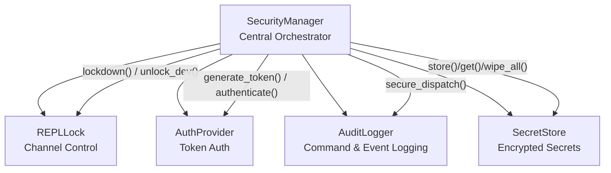
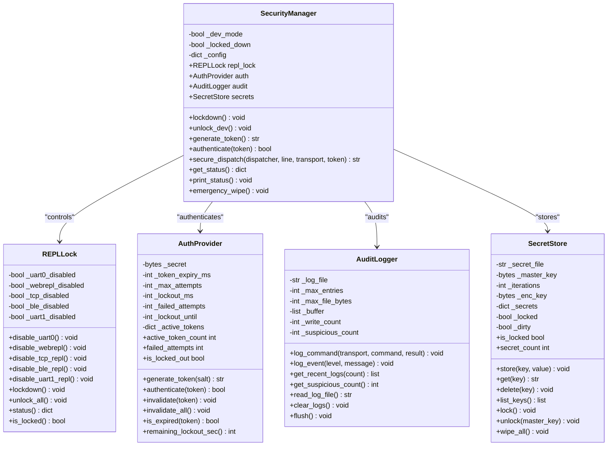
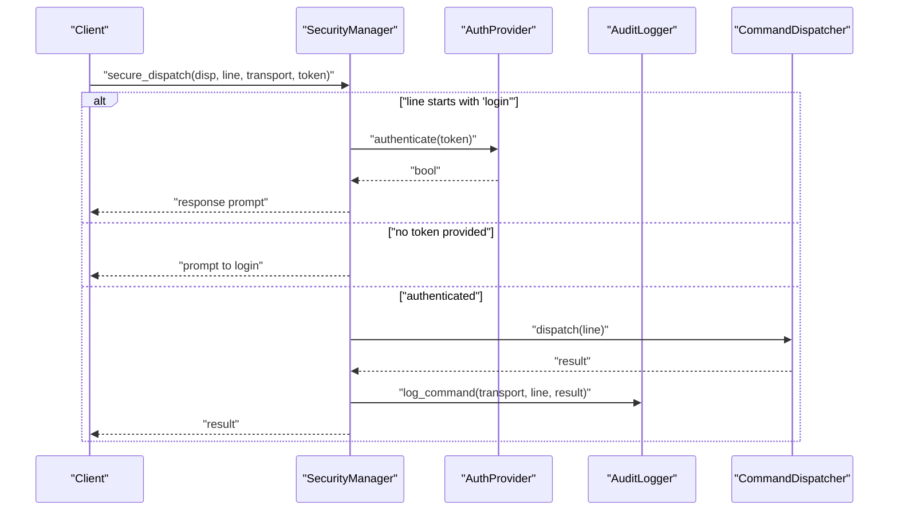
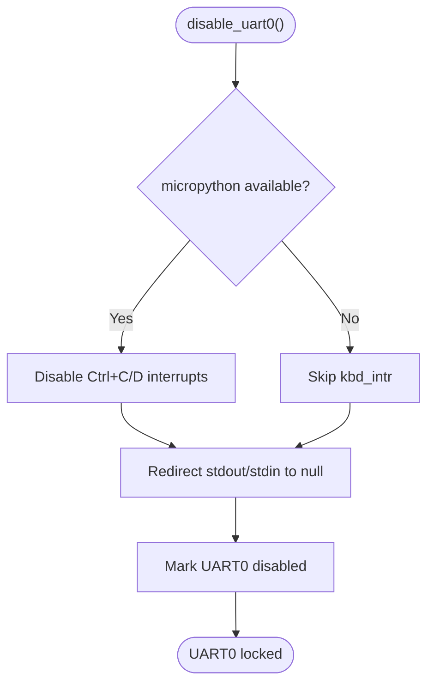
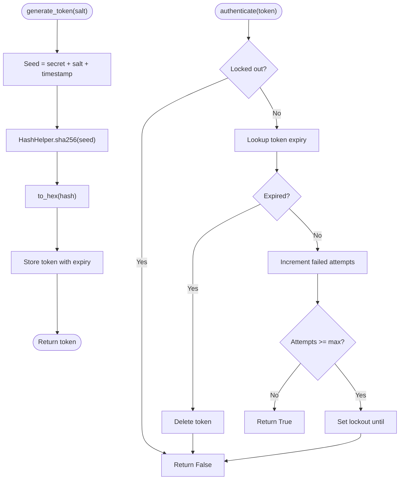
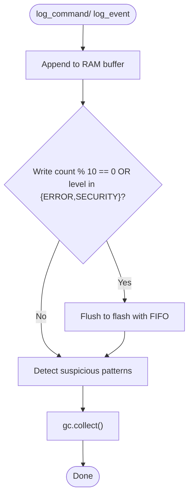
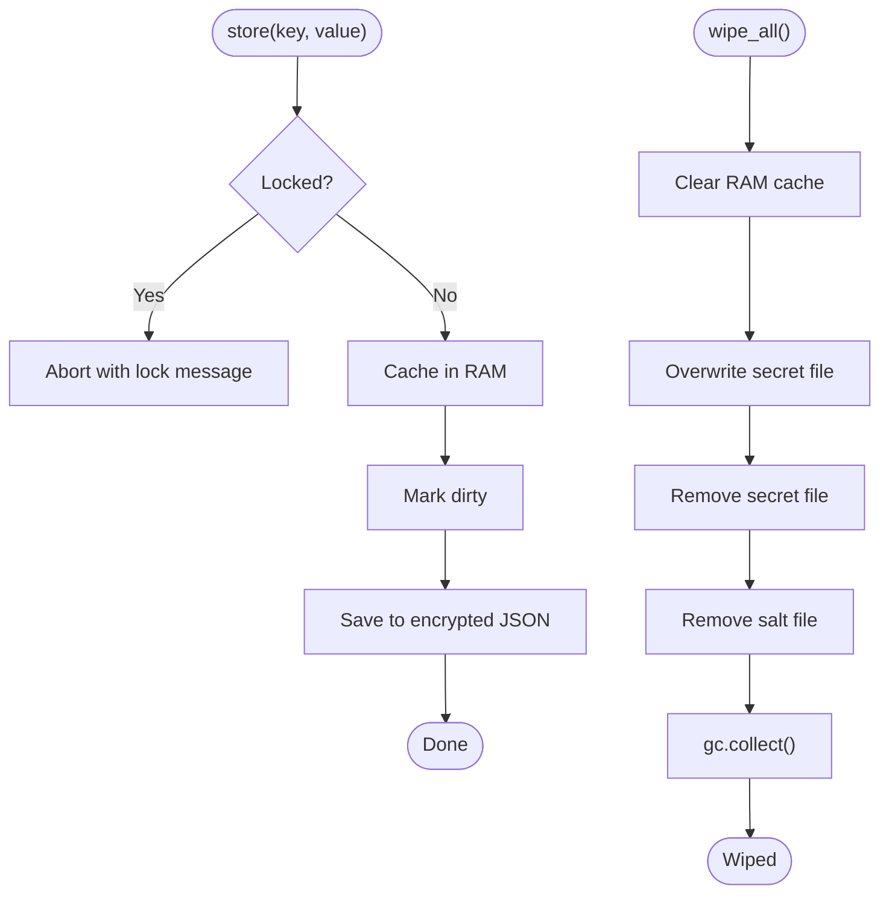
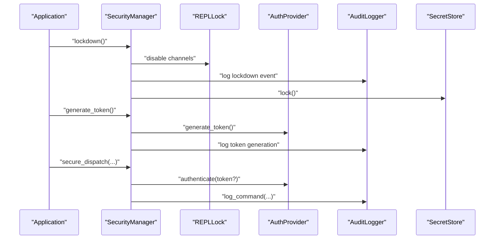
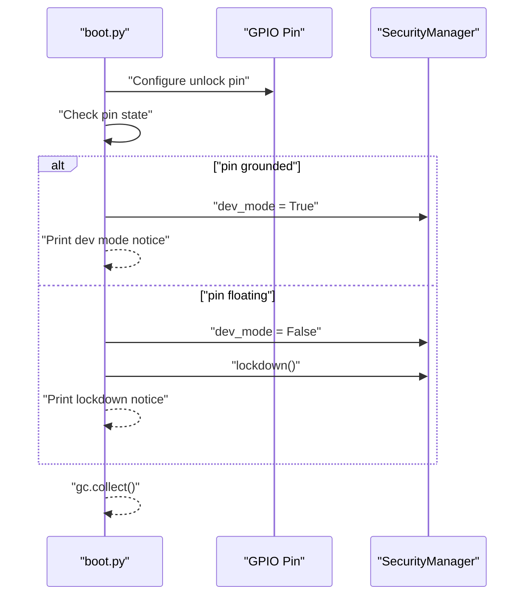
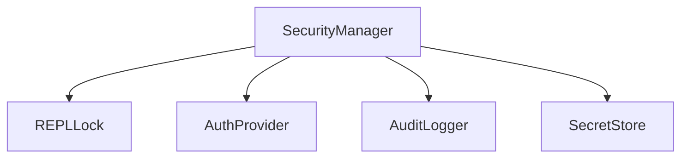

# Security Manager

<cite>
**Referenced Files in This Document**
- [security_manager.py](file://src/lib/security/security_manager.py)
- [repl_lock.py](file://src/lib/security/repl_lock.py)
- [auth_provider.py](file://src/lib/security/auth_provider.py)
- [secret_store.py](file://src/lib/security/secret_store.py)
- [audit_logger.py](file://src/lib/security/audit_logger.py)
- [__init__.py](file://src/lib/security/__init__.py)
- [README.md](file://src/lib/security/README.md)
- [secure_production_example.py](file://src/main/examples/secure_production_example.py)
- [boot_production.py](file://src/main/boot_production.py)
</cite>

## Table of Contents
1. [Introduction](#introduction)
2. [Project Structure](#project-structure)
3. [Core Components](#core-components)
4. [Architecture Overview](#architecture-overview)
5. [Detailed Component Analysis](#detailed-component-analysis)
6. [Dependency Analysis](#dependency-analysis)
7. [Performance Considerations](#performance-considerations)
8. [Troubleshooting Guide](#troubleshooting-guide)
9. [Conclusion](#conclusion)
10. [Appendices](#appendices)

## Introduction
This document provides comprehensive documentation for the SecurityManager class, the central security orchestrator for the ESP32-C3 framework. It explains the lockdown procedure for production deployment, development mode unlocking, token management, secure command dispatching for protected REPL access, and status monitoring. It also details the integrated security architecture coordinating REPLLock, AuthProvider, AuditLogger, and SecretStore subsystems, and demonstrates practical examples from secure_production_example.py for production workflows, security configuration patterns, and emergency wipe procedures.

## Project Structure
The security module is organized around a central orchestrator (SecurityManager) that composes four subsystems:
- REPLLock: Controls REPL access across UART0, WebREPL, TCP, BLE, and UART1 channels.
- AuthProvider: Provides token-based authentication with expiry, rate limiting, and revocation.
- AuditLogger: Logs all REPL commands and security events with suspicious pattern detection.
- SecretStore: Stores sensitive data encrypted on flash with PBKDF2-derived keys and optional wipe.

**Diagram sources**
- [security_manager.py:25-82](file://src/lib/security/security_manager.py#L25-L82)
- [repl_lock.py:29-59](file://src/lib/security/repl_lock.py#L29-L59)
- [auth_provider.py:23-67](file://src/lib/security/auth_provider.py#L23-L67)
- [audit_logger.py:17-54](file://src/lib/security/audit_logger.py#L17-L54)
- [secret_store.py:39-79](file://src/lib/security/secret_store.py#L39-L79)

**Section sources**
- [__init__.py:11-16](file://src/lib/security/__init__.py#L11-L16)
- [README.md:9-16](file://src/lib/security/README.md#L9-L16)

## Core Components
- SecurityManager: Initializes and coordinates REPLLock, AuthProvider, AuditLogger, and SecretStore. Provides lockdown(), unlock_dev(), generate_token(), authenticate(), secure_dispatch(), get_status(), print_status(), and emergency_wipe().
- REPLLock: Disables REPL channels and manages status reporting.
- AuthProvider: Generates and validates tokens with expiry and rate limiting.
- AuditLogger: Records REPL commands and security events with suspicious detection and log rotation.
- SecretStore: Stores secrets encrypted on flash with PBKDF2 and optional wipe.

**Section sources**
- [security_manager.py:25-323](file://src/lib/security/security_manager.py#L25-L323)
- [repl_lock.py:29-227](file://src/lib/security/repl_lock.py#L29-L227)
- [auth_provider.py:23-257](file://src/lib/security/auth_provider.py#L23-L257)
- [audit_logger.py:17-197](file://src/lib/security/audit_logger.py#L17-L197)
- [secret_store.py:39-375](file://src/lib/security/secret_store.py#L39-L375)

## Architecture Overview
The SecurityManager acts as a facade that initializes and delegates to subsystems. It enforces production lockdown by disabling REPL channels, enabling audit logging, locking secret storage, and configuring rate limiting. It integrates token-based authentication for protected REPL access and provides secure command dispatching with audit logging.

**Diagram sources**
- [security_manager.py:25-323](file://src/lib/security/security_manager.py#L25-L323)
- [repl_lock.py:29-227](file://src/lib/security/repl_lock.py#L29-L227)
- [auth_provider.py:23-257](file://src/lib/security/auth_provider.py#L23-L257)
- [audit_logger.py:17-197](file://src/lib/security/audit_logger.py#L17-L197)
- [secret_store.py:39-375](file://src/lib/security/secret_store.py#L39-L375)

## Detailed Component Analysis

### SecurityManager
SecurityManager orchestrates the entire security stack. It initializes subsystems with configurable parameters, enforces lockdown in production, unlocks for development, generates and authenticates tokens, dispatches secure REPL commands, and provides status reporting and emergency wipe.

Key methods:
- lockdown(): Applies production lockdown by disabling REPL channels, logging the event, locking secret store, and setting internal flags.
- unlock_dev(): Unlocks all subsystems for development use and logs the event.
- generate_token(): Creates a time-bound token and logs the generation.
- authenticate(): Validates tokens and logs failed attempts.
- secure_dispatch(): Handles login commands, checks authentication, dispatches commands, and audits results.
- get_status()/print_status(): Reports consolidated security status across subsystems.
- emergency_wipe(): Wipes secrets, clears audit logs, invalidates tokens, and ensures lockdown.

**Diagram sources**
- [security_manager.py:220-251](file://src/lib/security/security_manager.py#L220-L251)
- [auth_provider.py:147-184](file://src/lib/security/auth_provider.py#L147-L184)
- [audit_logger.py:57-97](file://src/lib/security/audit_logger.py#L57-L97)

**Section sources**
- [security_manager.py:125-178](file://src/lib/security/security_manager.py#L125-L178)
- [security_manager.py:179-189](file://src/lib/security/security_manager.py#L179-L189)
- [security_manager.py:193-201](file://src/lib/security/security_manager.py#L193-L201)
- [security_manager.py:203-216](file://src/lib/security/security_manager.py#L203-L216)
- [security_manager.py:220-251](file://src/lib/security/security_manager.py#L220-L251)
- [security_manager.py:255-294](file://src/lib/security/security_manager.py#L255-L294)
- [security_manager.py:297-323](file://src/lib/security/security_manager.py#L297-L323)

### REPLLock
Controls REPL access across multiple channels. It disables UART0 (redirects stdin/stdout and disables keyboard interrupts), stops WebREPL, and marks TCP, BLE, and UART1 channels as disabled. It provides status reporting and bulk lockdown/unlock operations.

**Diagram sources**
- [repl_lock.py:62-99](file://src/lib/security/repl_lock.py#L62-L99)

**Section sources**
- [repl_lock.py:62-113](file://src/lib/security/repl_lock.py#L62-L113)
- [repl_lock.py:116-149](file://src/lib/security/repl_lock.py#L116-L149)
- [repl_lock.py:152-171](file://src/lib/security/repl_lock.py#L152-L171)
- [repl_lock.py:174-182](file://src/lib/security/repl_lock.py#L174-L182)
- [repl_lock.py:185-203](file://src/lib/security/repl_lock.py#L185-L203)
- [repl_lock.py:204-227](file://src/lib/security/repl_lock.py#L204-L227)

### AuthProvider
Implements token-based authentication with SHA256-based tokens derived from a device-unique secret, random salt, and timestamp. Tokens expire after a configurable period, and repeated failures trigger a lockout with exponential backoff-like behavior.

**Diagram sources**
- [auth_provider.py:100-128](file://src/lib/security/auth_provider.py#L100-L128)
- [auth_provider.py:147-184](file://src/lib/security/auth_provider.py#L147-L184)

**Section sources**
- [auth_provider.py:100-144](file://src/lib/security/auth_provider.py#L100-L144)
- [auth_provider.py:147-184](file://src/lib/security/auth_provider.py#L147-L184)
- [auth_provider.py:198-225](file://src/lib/security/auth_provider.py#L198-L225)
- [auth_provider.py:236-257](file://src/lib/security/auth_provider.py#L236-L257)

### AuditLogger
Logs all REPL commands and security events with FIFO buffer management and suspicious pattern detection. It flushes logs to flash periodically and maintains a suspicious event counter.

**Diagram sources**
- [audit_logger.py:76-97](file://src/lib/security/audit_logger.py#L76-L97)
- [audit_logger.py:100-131](file://src/lib/security/audit_logger.py#L100-L131)
- [audit_logger.py:134-149](file://src/lib/security/audit_logger.py#L134-L149)

**Section sources**
- [audit_logger.py:57-97](file://src/lib/security/audit_logger.py#L57-L97)
- [audit_logger.py:100-131](file://src/lib/security/audit_logger.py#L100-L131)
- [audit_logger.py:134-149](file://src/lib/security/audit_logger.py#L134-L149)
- [audit_logger.py:152-197](file://src/lib/security/audit_logger.py#L152-L197)

### SecretStore
Stores secrets encrypted on flash using PBKDF2-derived keys and AES-CBC (or XOR fallback). It supports locking to clear RAM cache, unlocking with the master key, and wiping all data including files and salts.

**Diagram sources**
- [secret_store.py:222-236](file://src/lib/security/secret_store.py#L222-L236)
- [secret_store.py:337-365](file://src/lib/security/secret_store.py#L337-L365)

**Section sources**
- [secret_store.py:222-264](file://src/lib/security/secret_store.py#L222-L264)
- [secret_store.py:311-336](file://src/lib/security/secret_store.py#L311-L336)
- [secret_store.py:337-375](file://src/lib/security/secret_store.py#L337-L375)

### Practical Examples and Workflows
The secure_production_example.py demonstrates:
- Basic lockdown for production environments.
- Secret storage and retrieval with encrypted persistence.
- Token generation and authentication with rate limiting feedback.
- Audit logging for REPL commands and security events.
- Emergency wipe for compromised devices.
- Individual REPL channel locking.
- Full production simulation including token generation and status reporting.

**Diagram sources**
- [secure_production_example.py:20-40](file://src/main/examples/secure_production_example.py#L20-L40)
- [secure_production_example.py:44-74](file://src/main/examples/secure_production_example.py#L44-L74)
- [secure_production_example.py:79-110](file://src/main/examples/secure_production_example.py#L79-L110)
- [secure_production_example.py:115-151](file://src/main/examples/secure_production_example.py#L115-L151)
- [secure_production_example.py:156-178](file://src/main/examples/secure_production_example.py#L156-L178)
- [secure_production_example.py:183-207](file://src/main/examples/secure_production_example.py#L183-L207)
- [secure_production_example.py:212-244](file://src/main/examples/secure_production_example.py#L212-L244)

**Section sources**
- [secure_production_example.py:20-40](file://src/main/examples/secure_production_example.py#L20-L40)
- [secure_production_example.py:44-74](file://src/main/examples/secure_production_example.py#L44-L74)
- [secure_production_example.py:79-110](file://src/main/examples/secure_production_example.py#L79-L110)
- [secure_production_example.py:115-151](file://src/main/examples/secure_production_example.py#L115-L151)
- [secure_production_example.py:156-178](file://src/main/examples/secure_production_example.py#L156-L178)
- [secure_production_example.py:183-207](file://src/main/examples/secure_production_example.py#L183-L207)
- [secure_production_example.py:212-244](file://src/main/examples/secure_production_example.py#L212-L244)

### Boot Integration for Production
The boot_production.py script demonstrates integrating lockdown at boot time, with an optional unlock pin to enable development mode. It ensures the device is locked before main application logic runs.

**Diagram sources**
- [boot_production.py:24-48](file://src/main/boot_production.py#L24-L48)

**Section sources**
- [boot_production.py:24-48](file://src/main/boot_production.py#L24-L48)

## Dependency Analysis
SecurityManager depends on REPLLock, AuthProvider, AuditLogger, and SecretStore. Each subsystem encapsulates its own responsibilities and exposes a focused API. The orchestrator coordinates initialization, configuration, and lifecycle operations.

**Diagram sources**
- [security_manager.py:19-22](file://src/lib/security/security_manager.py#L19-L22)

**Section sources**
- [security_manager.py:19-22](file://src/lib/security/security_manager.py#L19-L22)

## Performance Considerations
- Token generation and authentication involve cryptographic hashing and dictionary lookups; ensure sufficient entropy sources and avoid excessive token creation during lockout periods.
- Audit logging uses a RAM buffer with periodic flushing to flash; tune max entries and file size to balance memory usage and flash wear.
- SecretStore encryption uses PBKDF2 with configurable iterations; higher iteration counts increase security but may impact performance on constrained devices.
- REPLLock redirection and WebREPL stopping are lightweight operations; monitor for exceptions in embedded environments.

## Troubleshooting Guide
Common issues and remedies:
- Authentication failures: Verify token validity and lockout status via status reporting. Check failed attempts and remaining lockout time.
- REPL access not disabled: Confirm lockdown was called and that the device is not in development mode. Review REPLLock status.
- Audit logs not appearing: Ensure audit logging is enabled and that flush conditions are met; check suspicious detection thresholds.
- Secrets not readable: Confirm SecretStore is unlocked and that the master key matches the one used during encryption.
- Emergency wipe effectiveness: After emergency_wipe, verify lockdown status and confirm secrets and logs are cleared.

**Section sources**
- [security_manager.py:255-294](file://src/lib/security/security_manager.py#L255-L294)
- [auth_provider.py:156-184](file://src/lib/security/auth_provider.py#L156-L184)
- [audit_logger.py:100-131](file://src/lib/security/audit_logger.py#L100-L131)
- [secret_store.py:311-336](file://src/lib/security/secret_store.py#L311-L336)
- [security_manager.py:297-323](file://src/lib/security/security_manager.py#L297-L323)

## Conclusion
The SecurityManager provides a cohesive, production-ready security framework for ESP32-C3 devices. By coordinating REPL lockdown, token-based authentication, audit logging, and encrypted secret storage, it delivers strong software-level protection suitable for enterprise IoT deployments. The included examples and boot integration demonstrate practical deployment patterns, while the emergency wipe capability ensures robust incident response.

## Appendices
- API Reference and configuration examples are documented in the module’s README and example scripts.
- For advanced use cases, consider combining the security module with additional protections such as Secure Boot and bytecode compilation.