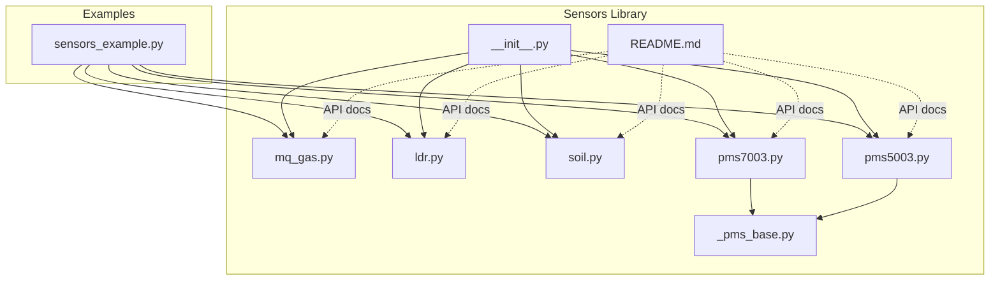
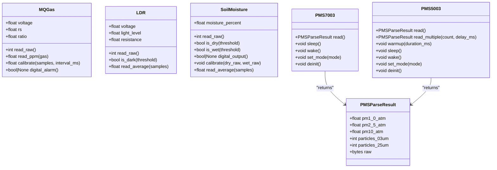
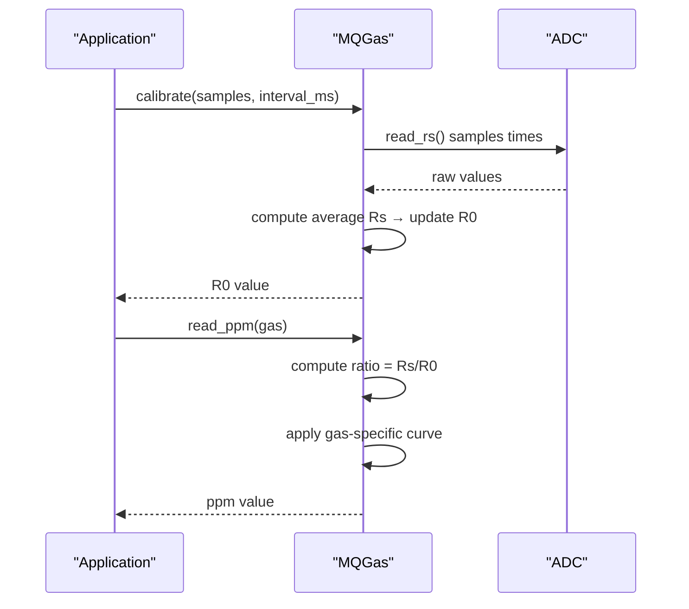
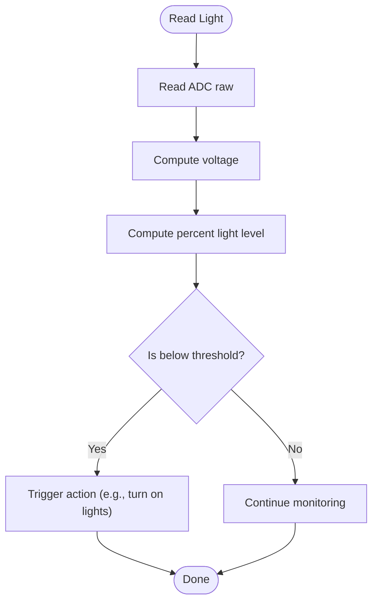
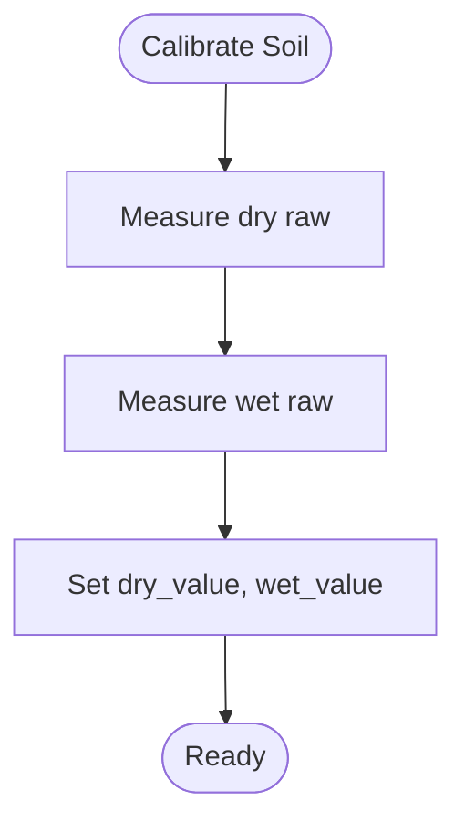
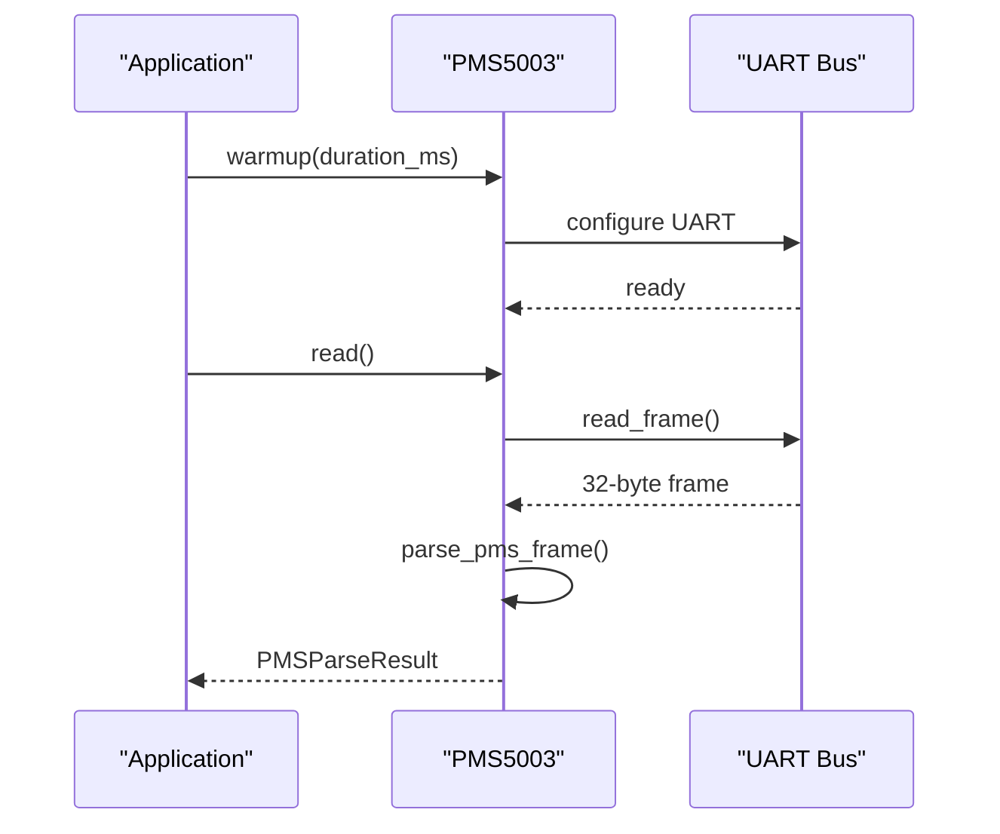
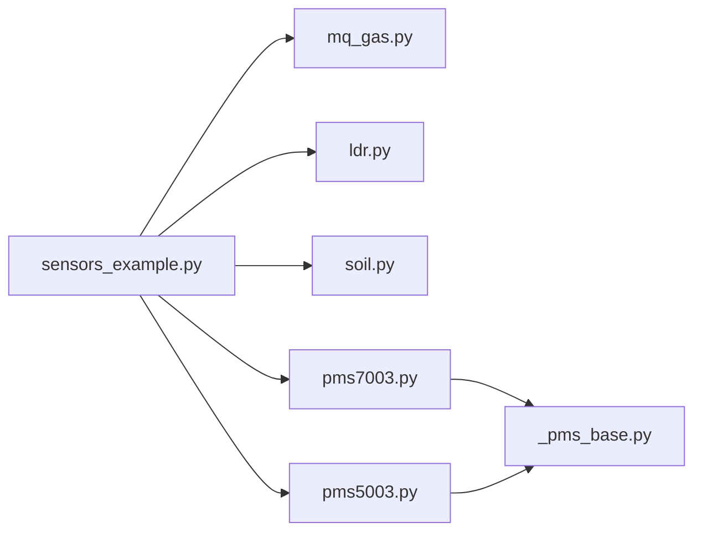

# Environmental Monitoring Sensors

<cite>
**Referenced Files in This Document**
- [sensors_example.py](file://src/main/examples/sensors_example.py)
- [mq_gas.py](file://src/lib/sensors/mq_gas.py)
- [ldr.py](file://src/lib/sensors/ldr.py)
- [soil.py](file://src/lib/sensors/soil.py)
- [pms7003.py](file://src/lib/sensors/pms7003.py)
- [_pms_base.py](file://src/lib/sensors/_pms_base.py)
- [pms5003.py](file://src/lib/sensors/pms5003.py)
- [README.md](file://src/lib/sensors/README.md)
- [__init__.py](file://src/lib/sensors/__init__.py)
</cite>

## Table of Contents
1. [Introduction](#introduction)
2. [Project Structure](#project-structure)
3. [Core Components](#core-components)
4. [Architecture Overview](#architecture-overview)
5. [Detailed Component Analysis](#detailed-component-analysis)
6. [Dependency Analysis](#dependency-analysis)
7. [Performance Considerations](#performance-considerations)
8. [Troubleshooting Guide](#troubleshooting-guide)
9. [Conclusion](#conclusion)

## Introduction
This document provides comprehensive guidance for environmental monitoring sensor drivers implemented in the repository. It focuses on:
- MQ series gas sensors (LPG, methane, carbon monoxide, smoke detection) with baseline calibration and sensor behavior considerations
- Light-dependent resistor (LDR) sensors for ambient light measurement and automatic brightness control
- Soil moisture sensors for agriculture with calibration and interpretation
- PM2.5 and PM10 particulate matter sensors (PMS7003, PMS5003) with UART communication, frame parsing, and AQI calculation
It also includes practical examples for calibration, data smoothing, threshold-based alerts, and operational best practices such as sensor lifespan, drift compensation, and environmental conditioning.

## Project Structure
The sensor drivers are organized under the sensors library and demonstrated via example scripts:
- Sensor drivers live under src/lib/sensors/
- Example usage is provided in src/main/examples/sensors_example.py
- The README in src/lib/sensors/ provides detailed API documentation per sensor

**Diagram sources**
- [sensors_example.py:1-529](file://src/main/examples/sensors_example.py#L1-L529)
- [__init__.py:1-27](file://src/lib/sensors/__init__.py#L1-L27)
- [mq_gas.py:1-167](file://src/lib/sensors/mq_gas.py#L1-L167)
- [ldr.py:1-89](file://src/lib/sensors/ldr.py#L1-L89)
- [soil.py:1-120](file://src/lib/sensors/soil.py#L1-L120)
- [pms7003.py:1-200](file://src/lib/sensors/pms7003.py#L1-L200)
- [_pms_base.py:1-195](file://src/lib/sensors/_pms_base.py#L1-L195)
- [pms5003.py:1-244](file://src/lib/sensors/pms5003.py#L1-L244)
- [README.md:1-800](file://src/lib/sensors/README.md#L1-L800)

**Section sources**
- [sensors_example.py:1-529](file://src/main/examples/sensors_example.py#L1-L529)
- [README.md:1-800](file://src/lib/sensors/README.md#L1-L800)

## Core Components
This section summarizes the primary sensor drivers and their capabilities:
- MQGas: Analog gas sensor with Rs/R0 ratio, PPM estimation, and optional digital threshold output
- LDR: Ambient light measurement via ADC with dark detection and averaging
- SoilMoisture: Capacitive/resistive soil moisture with calibration and digital comparator output
- PMS7003: PM2.5/PM10 sensor over UART with active/passive modes and sleep/wake commands
- PMS5003: Similar to PMS7003 with extended lifetime and a mandatory warmup period

Key usage patterns are demonstrated in the example script, including calibration, averaging, and threshold-based alerts.

**Section sources**
- [mq_gas.py:34-167](file://src/lib/sensors/mq_gas.py#L34-L167)
- [ldr.py:12-89](file://src/lib/sensors/ldr.py#L12-L89)
- [soil.py:12-120](file://src/lib/sensors/soil.py#L12-L120)
- [pms7003.py:35-200](file://src/lib/sensors/pms7003.py#L35-L200)
- [pms5003.py:43-244](file://src/lib/sensors/pms5003.py#L43-L244)
- [sensors_example.py:157-183](file://src/main/examples/sensors_example.py#L157-L183)
- [sensors_example.py:265-286](file://src/main/examples/sensors_example.py#L265-L286)

## Architecture Overview
The sensors are accessed through dedicated Python classes that encapsulate:
- Hardware abstraction (ADC, UART, GPIO)
- Data acquisition and conversion
- Optional smoothing and alerting logic

**Diagram sources**
- [mq_gas.py:34-167](file://src/lib/sensors/mq_gas.py#L34-L167)
- [ldr.py:12-89](file://src/lib/sensors/ldr.py#L12-L89)
- [soil.py:12-120](file://src/lib/sensors/soil.py#L12-L120)
- [pms7003.py:35-200](file://src/lib/sensors/pms7003.py#L35-L200)
- [pms5003.py:43-244](file://src/lib/sensors/pms5003.py#L43-L244)
- [_pms_base.py:13-45](file://src/lib/sensors/_pms_base.py#L13-L45)

## Detailed Component Analysis

### MQ Series Gas Sensors (LPG, methane, CO, smoke)
MQ sensors operate on an analog Rs/R0 principle. The driver exposes:
- Raw ADC reading and derived Rs
- Rs/R0 ratio for gas estimation
- PPM calculation using preconfigured curves per model
- Optional digital threshold output
- Baseline calibration in clean air

Operational guidance:
- Preheat for 20–48 hours before first use
- Calibrate R0 in a clean-air environment using the built-in routine
- Use read_ppm() for gas-specific estimates; supported gases depend on model
- Optionally use digital_alarm() for threshold-triggered alerts

**Diagram sources**
- [mq_gas.py:140-156](file://src/lib/sensors/mq_gas.py#L140-L156)
- [mq_gas.py:113-138](file://src/lib/sensors/mq_gas.py#L113-L138)

Practical examples:
- Calibration in clean air using calibrate()
- Threshold-based digital alarm via digital_alarm()

**Section sources**
- [mq_gas.py:16-31](file://src/lib/sensors/mq_gas.py#L16-L31)
- [mq_gas.py:140-156](file://src/lib/sensors/mq_gas.py#L140-L156)
- [mq_gas.py:158-167](file://src/lib/sensors/mq_gas.py#L158-L167)
- [sensors_example.py:265-286](file://src/main/examples/sensors_example.py#L265-L286)

### Light-Dependent Resistor (LDR)
The LDR driver reads ambient light via a voltage divider and provides:
- Raw ADC reading and computed voltage
- Percent light level (0–100%)
- Resistance approximation
- Dark detection with configurable threshold
- Averaging over multiple samples to reduce noise

Usage patterns:
- Measure light level periodically
- Trigger automatic lighting systems when below a threshold
- Apply read_average() for smoother control loops

**Diagram sources**
- [ldr.py:43-88](file://src/lib/sensors/ldr.py#L43-L88)

Practical examples:
- Automatic lighting control using read_average() and is_dark()

**Section sources**
- [ldr.py:12-89](file://src/lib/sensors/ldr.py#L12-L89)
- [sensors_example.py:157-169](file://src/main/examples/sensors_example.py#L157-L169)
- [README.md:627-693](file://src/lib/sensors/README.md#L627-L693)

### Soil Moisture Sensors (Agricultural Applications)
The soil moisture driver supports both analog and digital outputs:
- Raw ADC reading and percent moisture calculation
- Dry/wet calibration values
- Digital comparator output (if present)
- Averaging to smooth noisy readings
- Threshold checks for dry/wet conditions

Calibration procedure:
- Measure ADC raw when soil is dry and when fully submerged
- Update calibration values accordingly
- Use read_average() for stable readings in control loops

**Diagram sources**
- [soil.py:96-107](file://src/lib/sensors/soil.py#L96-L107)

Practical examples:
- Threshold-based irrigation control using is_dry() and is_wet()

**Section sources**
- [soil.py:12-120](file://src/lib/sensors/soil.py#L12-L120)
- [sensors_example.py:171-183](file://src/main/examples/sensors_example.py#L171-L183)
- [README.md:696-767](file://src/lib/sensors/README.md#L696-L767)

### PM2.5 and PM10 Sensors (PMS7003, PMS5003)
Both sensors communicate over UART at 9600 baud with a 32-byte frame format. The shared parser extracts:
- PM1.0, PM2.5, PM10 concentrations (CF=1 and atmospheric)
- Particle counts per size bin
- Raw frame for diagnostics

Key differences:
- PMS5003 requires a warmup period (~30 seconds) for thermal stabilization
- Both support active and passive modes; passive mode requires explicit polling
- Sleep/wake commands are available to reduce power consumption

**Diagram sources**
- [pms5003.py:155-187](file://src/lib/sensors/pms5003.py#L155-L187)
- [_pms_base.py:62-125](file://src/lib/sensors/_pms_base.py#L62-L125)

AQI calculation example:
- Use PM2.5 concentration to estimate AQI (example scaling provided in the example script)
- Consider median filtering via read_multiple() for stability

**Section sources**
- [pms7003.py:35-200](file://src/lib/sensors/pms7003.py#L35-L200)
- [pms5003.py:43-244](file://src/lib/sensors/pms5003.py#L43-L244)
- [_pms_base.py:13-195](file://src/lib/sensors/_pms_base.py#L13-L195)
- [sensors_example.py:457-501](file://src/main/examples/sensors_example.py#L457-L501)

## Dependency Analysis
The PMS drivers rely on a shared parser module for frame decoding and command generation. The example script demonstrates usage of all sensor modules.

**Diagram sources**
- [sensors_example.py:1-27](file://src/main/examples/sensors_example.py#L1-L27)
- [pms7003.py:19-26](file://src/lib/sensors/pms7003.py#L19-L26)
- [pms5003.py:27-34](file://src/lib/sensors/pms5003.py#L27-L34)

**Section sources**
- [sensors_example.py:1-27](file://src/main/examples/sensors_example.py#L1-L27)
- [pms7003.py:19-26](file://src/lib/sensors/pms7003.py#L19-L26)
- [pms5003.py:27-34](file://src/lib/sensors/pms5003.py#L27-L34)

## Performance Considerations
- Sampling and averaging
  - Use read_average() for LDR and SoilMoisture to reduce noise
  - Use read_multiple() for PMS5003 to compute median-filtered values
- Timing and delays
  - PMS5003 requires a warmup delay before accurate readings
  - Calibrate MQ sensors in a clean environment with adequate sampling intervals
- Power management
  - Use sleep() commands on PMS sensors during idle periods
- Data smoothing
  - Maintain rolling windows for distance sensors and similar noisy measurements
- Environmental conditioning
  - Allow preheat time for MQ sensors before calibration and operation
  - Avoid operating PMS sensors in extreme temperatures/humidity without enclosure effects

[No sources needed since this section provides general guidance]

## Troubleshooting Guide
Common issues and resolutions:
- MQ sensor readings unstable or drifting
  - Recalibrate R0 in a clean-air environment
  - Allow sufficient preheat time before first use
  - Verify load resistor and ADC attenuation settings
- LDR reports unexpected values
  - Confirm fixed resistor value and supply voltage
  - Use read_average() to mitigate noise
- Soil moisture calibration mismatch
  - Re-measure dry and wet raw values in situ
  - Update calibration and adjust thresholds
- PMS sensor timeouts or invalid frames
  - Ensure UART wiring is correct and 3.3V logic level
  - Verify baud rate and framing
  - Call warmup() for PMS5003 before reading
  - Use passive mode polling when configured as passive
- Automatic control oscillation
  - Add hysteresis around thresholds
  - Increase averaging window sizes

**Section sources**
- [mq_gas.py:140-156](file://src/lib/sensors/mq_gas.py#L140-L156)
- [ldr.py:80-88](file://src/lib/sensors/ldr.py#L80-L88)
- [soil.py:96-107](file://src/lib/sensors/soil.py#L96-L107)
- [pms5003.py:155-169](file://src/lib/sensors/pms5003.py#L155-L169)
- [pms7003.py:105-144](file://src/lib/sensors/pms7003.py#L105-L144)

## Conclusion
The repository provides robust, production-ready drivers for common environmental sensors:
- MQ series sensors with calibrated Rs/R0 behavior and PPM estimation
- LDR for ambient light measurement with averaging and threshold control
- Soil moisture sensors with straightforward calibration and digital comparator support
- PMS7003 and PMS5003 with reliable UART parsing, warmup requirements, and power-saving sleep modes

Adopt the recommended calibration procedures, smoothing techniques, and threshold-based alerting patterns to achieve stable and actionable environmental monitoring systems.