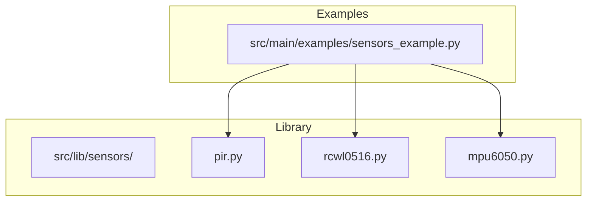
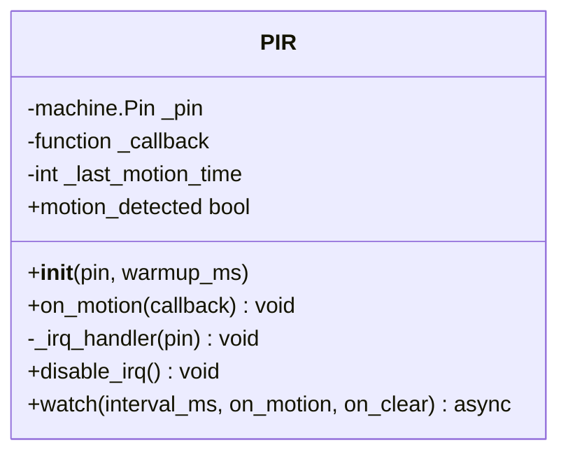
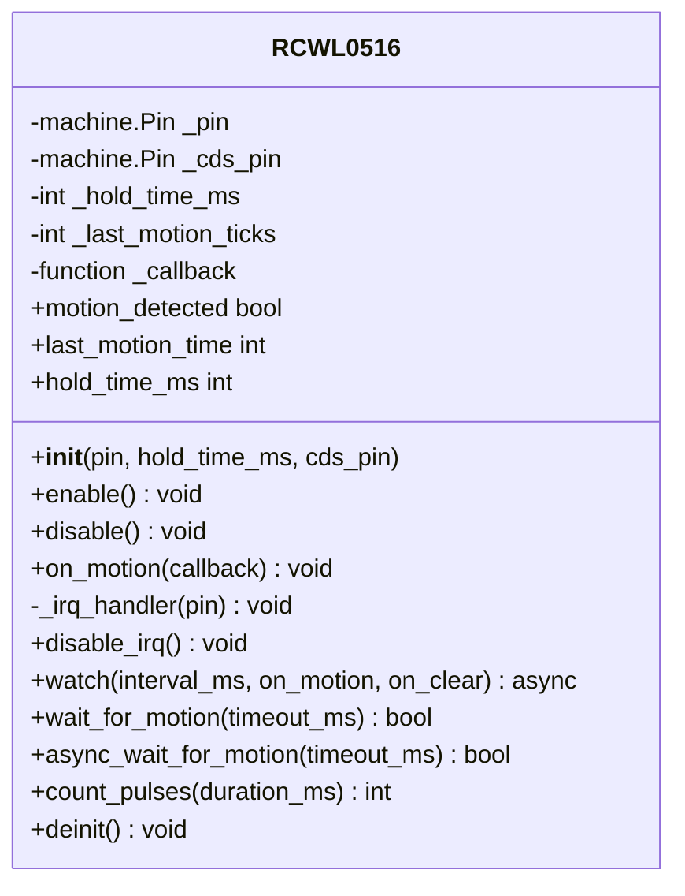
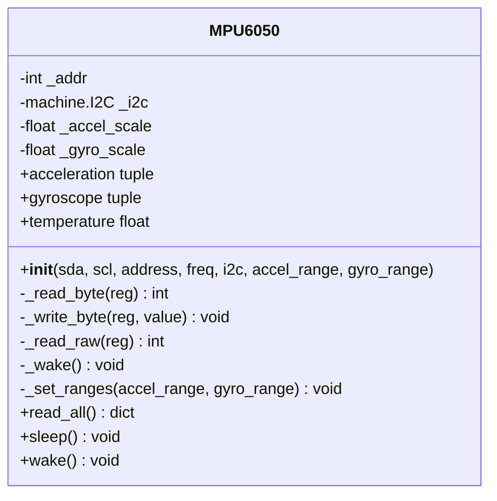
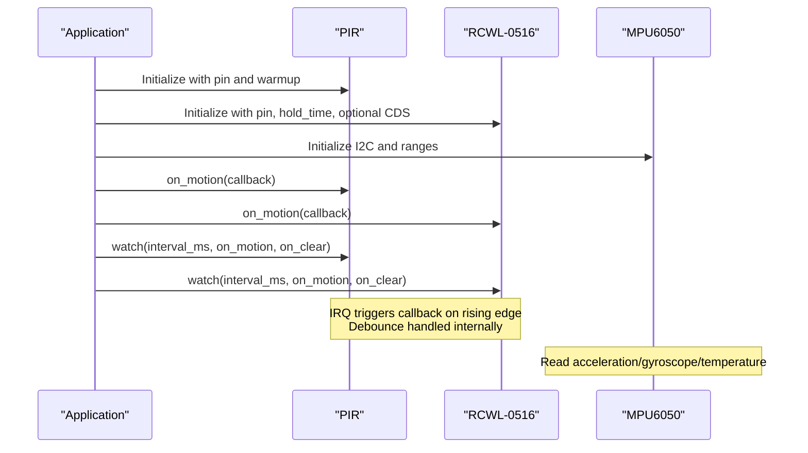
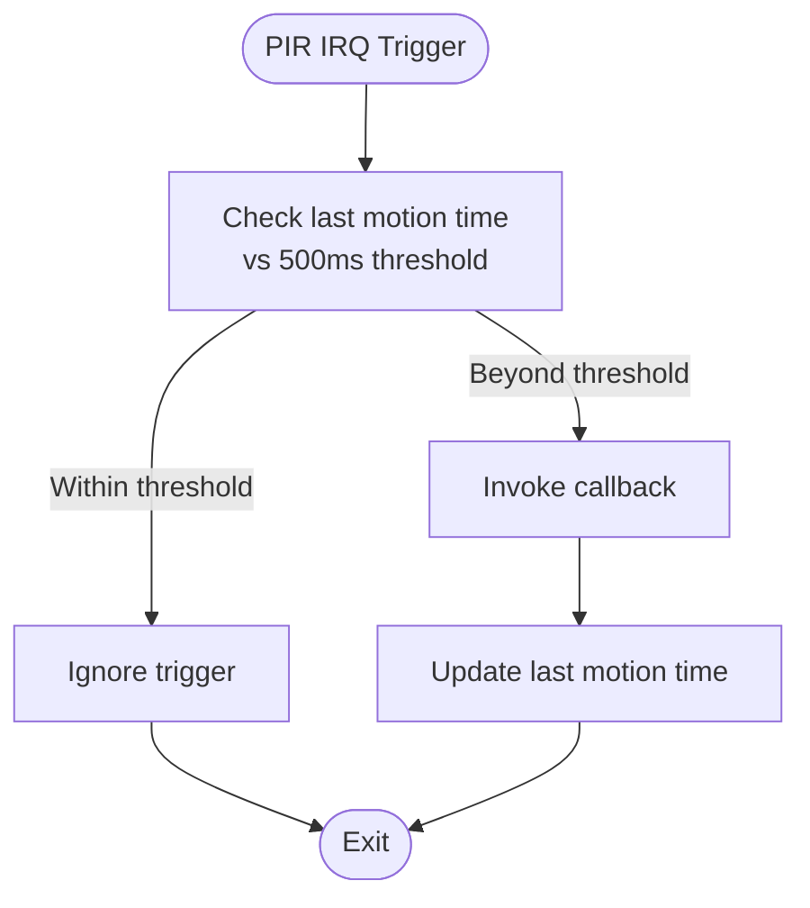
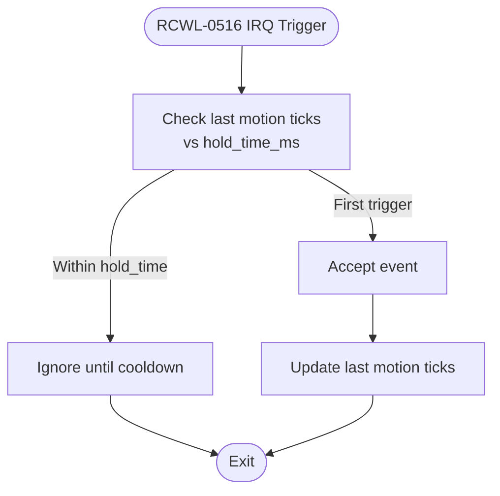
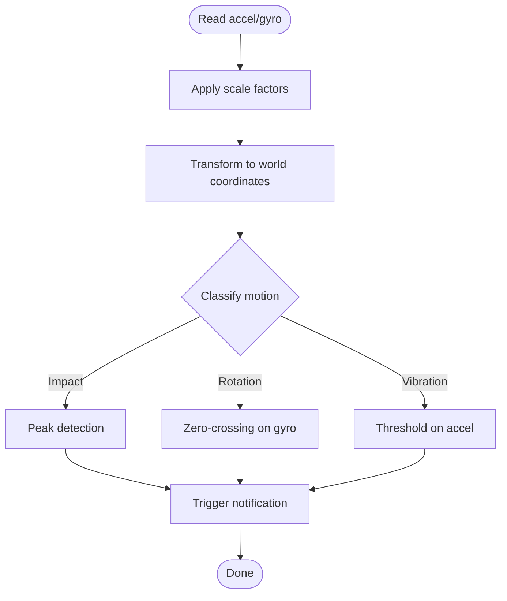
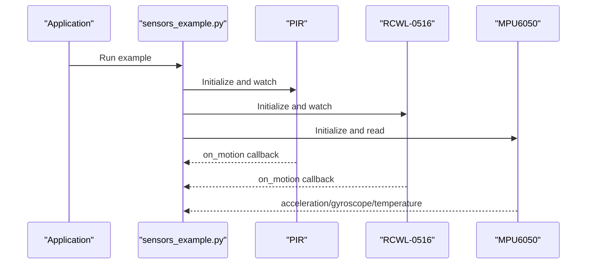
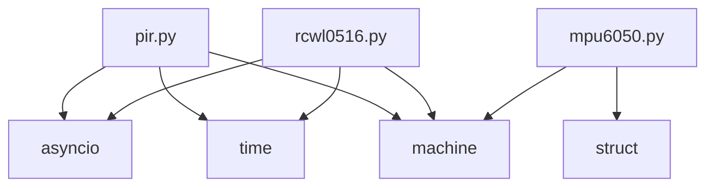

# Motion & Presence Sensors

<cite>
**Referenced Files in This Document**
- [pir.py](file://src/lib/sensors/pir.py)
- [rcwl0516.py](file://src/lib/sensors/rcwl0516.py)
- [mpu6050.py](file://src/lib/sensors/mpu6050.py)
- [sensors_example.py](file://src/main/examples/sensors_example.py)
- [README.md](file://src/lib/README.md)
</cite>

## Table of Contents
1. [Introduction](#introduction)
2. [Project Structure](#project-structure)
3. [Core Components](#core-components)
4. [Architecture Overview](#architecture-overview)
5. [Detailed Component Analysis](#detailed-component-analysis)
6. [Dependency Analysis](#dependency-analysis)
7. [Performance Considerations](#performance-considerations)
8. [Troubleshooting Guide](#troubleshooting-guide)
9. [Conclusion](#conclusion)

## Introduction
This document focuses on motion and presence detection sensors implemented in the repository: PIR (Passive Infrared) motion sensors, RCWL-0516 microwave radar sensors, and MPU6050 accelerometer/gyroscope integration. It explains detection characteristics, sensitivity and debounce handling, driver initialization, interrupt handling, power management, and practical examples for callbacks, sensitivity tuning, and notification system integration. It also covers false positive mitigation, detection area configuration, and environmental factors affecting sensor performance.

## Project Structure
The motion and presence sensor drivers are located under the sensors library. The example program demonstrates usage patterns for PIR, RCWL-0516, and MPU6050.



**Diagram sources**
- [pir.py](file://src/lib/sensors/pir.py)
- [rcwl0516.py](file://src/lib/sensors/rcwl0516.py)
- [mpu6050.py](file://src/lib/sensors/mpu6050.py)
- [sensors_example.py](file://src/main/examples/sensors_example.py)

**Section sources**
- [README.md:1-72](file://src/lib/README.md#L1-L72)
- [sensors_example.py:1-529](file://src/main/examples/sensors_example.py#L1-L529)

## Core Components
- PIR motion sensor driver (GPIO-based passive infrared detection)
- RCWL-0516 microwave radar sensor driver (GPIO-based Doppler radar detection)
- MPU6050 I2C IMU driver (accelerometer, gyroscope, temperature)

Key capabilities:
- Interrupt-driven callbacks and polling watch loops
- Debounce handling via time-based thresholds
- Optional hardware shutdown via CDS pin for RCWL-0516
- I2C sleep/wake for MPU6050 power management
- Practical examples for motion detection callbacks, sensitivity tuning, and integration with notification systems

**Section sources**
- [pir.py:14-106](file://src/lib/sensors/pir.py#L14-L106)
- [rcwl0516.py:15-255](file://src/lib/sensors/rcwl0516.py#L15-L255)
- [mpu6050.py:32-167](file://src/lib/sensors/mpu6050.py#L32-L167)
- [sensors_example.py:185-263](file://src/main/examples/sensors_example.py#L185-L263)

## Architecture Overview
The drivers expose a simple interface for motion detection and sensor data retrieval. They integrate with MicroPython’s machine and asyncio modules to support both blocking and asynchronous operation.

```mermaid
graph TB
subgraph "Host Application"
APP["Application Code"]
EX["sensors_example.py"]
end
subgraph "PIR"
PIR["PIR Class<br/>GPIO input + IRQ"]
PIR --> |motion_detected| APP
PIR --> |on_motion()/watch()| APP
end
subgraph "RCWL-0516"
RCWL["RCWL0516 Class<br/>GPIO input + IRQ + optional CDS"]
RCWL --> |motion_detected| APP
RCWL --> |on_motion()/watch()/wait_for_motion()| APP
RCWL --> |enable()/disable()| APP
end
subgraph "MPU6050"
MPU["MPU6050 Class<br/>I2C accel/gyro/temp"]
MPU --> |acceleration/gyroscope/temperature| APP
MPU --> |sleep()/wake()| APP
end
EX --> PIR
EX --> RCWL
EX --> MPU
```

**Diagram sources**
- [pir.py:14-106](file://src/lib/sensors/pir.py#L14-L106)
- [rcwl0516.py:15-255](file://src/lib/sensors/rcwl0516.py#L15-L255)
- [mpu6050.py:32-167](file://src/lib/sensors/mpu6050.py#L32-L167)
- [sensors_example.py:185-263](file://src/main/examples/sensors_example.py#L185-L263)

## Detailed Component Analysis

### PIR Motion Sensor (HC-SR501)
- Detection principle: Passive Infrared (PIR) sensing with analog potentiometer controls detection range and hold time; jumper selects repeatable or non-repeatable modes.
- Initialization: Configures GPIO input and optional warm-up delay.
- Detection state: Boolean property indicating motion.
- Interrupt handling: Rising-edge IRQ with internal debounce using a 500 ms threshold.
- Polling watch loop: Periodic polling with optional on-motion/on-clear callbacks.
- Deinitialization: Disables IRQ.



**Diagram sources**
- [pir.py:14-106](file://src/lib/sensors/pir.py#L14-L106)

**Section sources**
- [pir.py:14-106](file://src/lib/sensors/pir.py#L14-L106)
- [sensors_example.py:185-215](file://src/main/examples/sensors_example.py#L185-L215)

Practical usage patterns:
- Basic detection check and async watch with callbacks
- Debounce handling via IRQ and polling intervals

Integration tips:
- Use on_motion callback for immediate notifications
- Use watch loop for periodic status updates
- Disable IRQ when not needed to save CPU

### RCWL-0516 Microwave Radar Sensor
- Detection principle: 5.8 GHz Doppler radar; detects motion through walls and non-metal materials; no warm-up required; fixed detection range; 360° horizontal field of view.
- Initialization: Configures GPIO input; optional CDS pin for sensor enable/disable.
- Detection state: Boolean property indicating motion.
- Interrupt handling: Rising-edge IRQ with configurable hold time for debounce.
- Polling watch loop: Periodic polling with on-motion and on-clear callbacks; tracks last motion time.
- Blocking and async wait helpers: wait_for_motion and async_wait_for_motion with timeouts.
- Pulse counting: count_pulses to count motion events over a duration.
- Deinitialization: Disables IRQ and optionally disables sensor via CDS pin.



**Diagram sources**
- [rcwl0516.py:15-255](file://src/lib/sensors/rcwl0516.py#L15-L255)

**Section sources**
- [rcwl0516.py:15-255](file://src/lib/sensors/rcwl0516.py#L15-L255)
- [sensors_example.py:217-262](file://src/main/examples/sensors_example.py#L217-L262)

Practical usage patterns:
- Immediate detection via on_motion callback
- Continuous monitoring via watch loop
- One-shot waits for motion detection
- Pulse counting for throughput analytics
- Enable/disable control via CDS pin

Integration tips:
- Use hold_time_ms to tune debounce and cooldown behavior
- Use last_motion_time to infer recent activity
- Use enable/disable to conserve power or temporarily suspend detection

### MPU6050 Accelerometer and Gyroscope
- Interface: I2C with configurable address and sampling ranges.
- Data access: Provides acceleration (g), gyroscope (deg/s), and temperature (die temperature).
- Calibration and scaling: Full-scale ranges configured via constructor parameters; scale factors applied during conversion.
- Power management: Sleep/wake via I2C register writes.



**Diagram sources**
- [mpu6050.py:32-167](file://src/lib/sensors/mpu6050.py#L32-L167)

**Section sources**
- [mpu6050.py:32-167](file://src/lib/sensors/mpu6050.py#L32-L167)
- [sensors_example.py:88-101](file://src/main/examples/sensors_example.py#L88-L101)

Practical usage patterns:
- Read acceleration, gyroscope, and temperature
- Use read_all for batch reads
- Enter sleep mode to reduce power consumption

Motion detection algorithms with MPU6050:
- Peak detection on acceleration channels to identify impact-like events
- Zero-crossing detection on angular rate for rotation events
- Threshold-based classification for vibration or tilt detection
- Coordinate system transformation: align axes to device orientation and map to world coordinates as needed for application-specific geometry

Integration tips:
- Choose appropriate full-scale ranges for expected motion
- Apply low-pass filtering to reduce noise
- Use sleep/wake to balance accuracy and power

## Architecture Overview
The motion and presence drivers follow a consistent pattern:
- GPIO-based drivers expose motion_detected and on_motion callback registration
- Both IRQ-based and polling-based monitoring modes are supported
- RCWL-0516 adds optional hardware enable control and pulse counting
- MPU6050 exposes I2C-based sensor data with power management



**Diagram sources**
- [pir.py:14-106](file://src/lib/sensors/pir.py#L14-L106)
- [rcwl0516.py:15-255](file://src/lib/sensors/rcwl0516.py#L15-L255)
- [mpu6050.py:32-167](file://src/lib/sensors/mpu6050.py#L32-L167)
- [sensors_example.py:185-263](file://src/main/examples/sensors_example.py#L185-L263)

## Detailed Component Analysis

### PIR: Detection Range, Sensitivity, and Debounce
- Detection range: Module potentiometer sets range; typical 3–7 meters per module specification.
- Sensitivity adjustment: Potentiometer controls sensitivity; jumper selects repeatable vs non-repeatable operation.
- Debounce handling: Internal 500 ms debounce prevents false triggers from noise or small movements.



**Diagram sources**
- [pir.py:68-76](file://src/lib/sensors/pir.py#L68-L76)

**Section sources**
- [pir.py:14-106](file://src/lib/sensors/pir.py#L14-L106)

### RCWL-0516: Distance Measurement and Threshold Configuration
- Distance measurement: Not applicable; the RCWL-0516 is a presence/motion sensor operating at 5.8 GHz Doppler radar. It does not provide distance measurements.
- Threshold configuration: No adjustable threshold in the driver; sensitivity is fixed. Debounce/cooldown controlled via hold_time_ms.



**Diagram sources**
- [rcwl0516.py:141-149](file://src/lib/sensors/rcwl0516.py#L141-L149)

**Section sources**
- [rcwl0516.py:15-255](file://src/lib/sensors/rcwl0516.py#L15-L255)

### MPU6050: Calibration, Coordinate Transformation, and Motion Algorithms
- Calibration: Set full-scale ranges during initialization; scale factors are applied when reading raw values.
- Coordinate system transformation: Convert raw accelerometer/gyroscope values to meaningful units; align axes to device orientation and transform to world coordinates as needed.
- Motion detection algorithms:
  - Acceleration peak detection for impacts or jolts
  - Angular rate zero-crossing for rotation detection
  - Threshold-based classification for vibration or tilt
  - Optional filtering to reduce noise



**Diagram sources**
- [mpu6050.py:104-147](file://src/lib/sensors/mpu6050.py#L104-L147)

**Section sources**
- [mpu6050.py:32-167](file://src/lib/sensors/mpu6050.py#L32-L167)

### Practical Examples: Callbacks, Tuning, and Notification Integration
- PIR callbacks and watch loop usage are demonstrated in the example program.
- RCWL-0516 callbacks, blocking wait, async wait, and pulse counting are demonstrated.
- MPU6050 data reading and sleep/wake are demonstrated.



**Diagram sources**
- [sensors_example.py:185-263](file://src/main/examples/sensors_example.py#L185-L263)
- [pir.py:81-106](file://src/lib/sensors/pir.py#L81-L106)
- [rcwl0516.py:158-187](file://src/lib/sensors/rcwl0516.py#L158-L187)
- [mpu6050.py:148-158](file://src/lib/sensors/mpu6050.py#L148-L158)

**Section sources**
- [sensors_example.py:185-263](file://src/main/examples/sensors_example.py#L185-L263)

## Dependency Analysis
- PIR depends on machine.Pin and time for GPIO input and debouncing.
- RCWL-0516 depends on machine.Pin, time, and optional machine.Pin for CDS control.
- MPU6050 depends on machine.I2C and struct for register access and data unpacking.



**Diagram sources**
- [pir.py:9-11](file://src/lib/sensors/pir.py#L9-L11)
- [rcwl0516.py:10-12](file://src/lib/sensors/rcwl0516.py#L10-L12)
- [mpu6050.py:9-11](file://src/lib/sensors/mpu6050.py#L9-L11)

**Section sources**
- [pir.py:9-11](file://src/lib/sensors/pir.py#L9-L11)
- [rcwl0516.py:10-12](file://src/lib/sensors/rcwl0516.py#L10-L12)
- [mpu6050.py:9-11](file://src/lib/sensors/mpu6050.py#L9-L11)

## Performance Considerations
- Debounce thresholds: Tune PIR debounce (500 ms) and RCWL hold_time_ms to balance responsiveness and false positives.
- Polling intervals: Adjust watch loop interval_ms to trade off CPU usage and latency.
- Power management: Use MPU6050 sleep/wake to reduce power; use RCWL-0516 enable/disable via CDS pin when idle.
- Noise reduction: Apply filtering to accelerometer/gyroscope data to mitigate environmental vibrations and thermal drift.

## Troubleshooting Guide
- PIR not triggering:
  - Verify wiring and warmup period; ensure correct pin assignment.
  - Check debounce threshold; increase interval if motion is slow.
- RCWL-0516 false positives:
  - Increase hold_time_ms to extend cooldown.
  - Ensure mounting is stable; avoid placing near vibrating equipment.
  - Use enable/disable to isolate detection periods.
- MPU6050 invalid data:
  - Confirm I2C address and wiring; verify WHO_AM_I response.
  - Adjust full-scale ranges and apply filtering.
- General:
  - Use disable_irq/disable to stop interrupts when not needed.
  - Use deinit/deactivate methods to release resources cleanly.

**Section sources**
- [pir.py:77-80](file://src/lib/sensors/pir.py#L77-L80)
- [rcwl0516.py:151-154](file://src/lib/sensors/rcwl0516.py#L151-L154)
- [mpu6050.py:160-167](file://src/lib/sensors/mpu6050.py#L160-L167)

## Conclusion
The repository provides robust drivers for PIR, RCWL-0516, and MPU6050 sensors with flexible interrupt and polling modes, built-in debounce, and power management features. The example program demonstrates practical integration patterns for callbacks, sensitivity tuning, and notification system connectivity. By understanding the drivers’ behavior and applying appropriate tuning and filtering, developers can achieve reliable motion and presence detection across diverse environments.