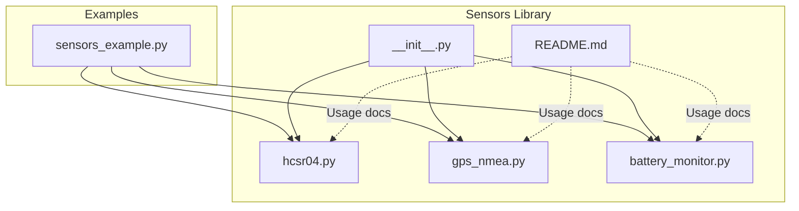
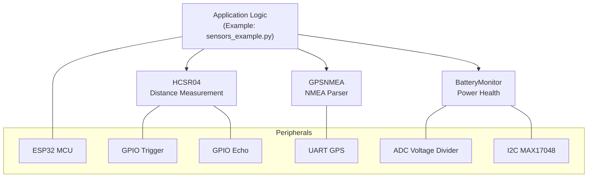
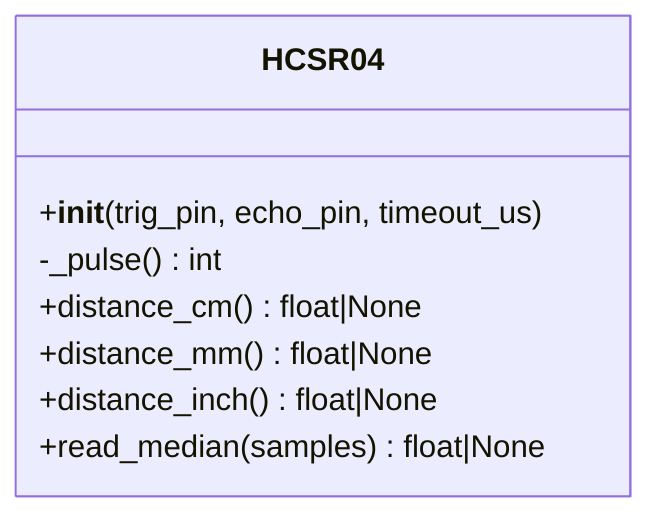
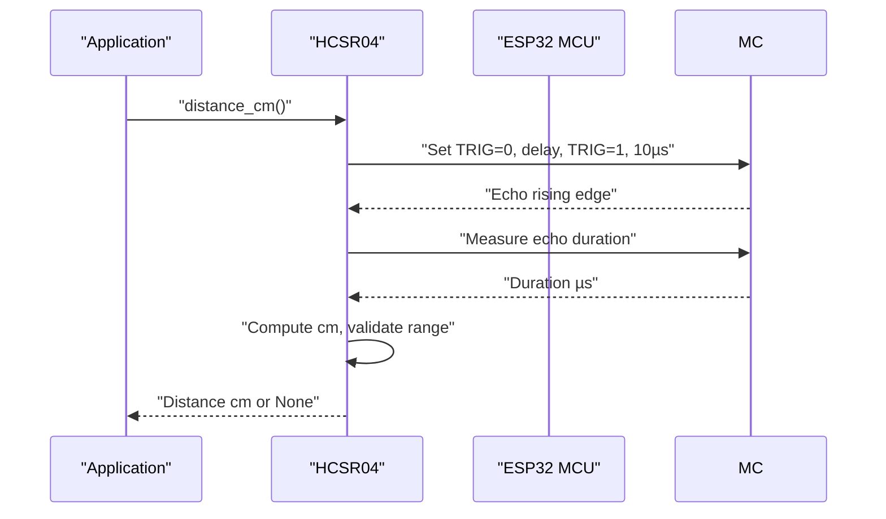
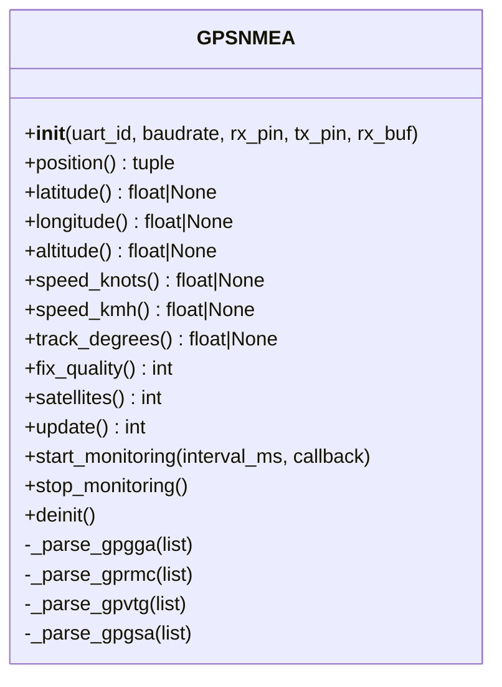
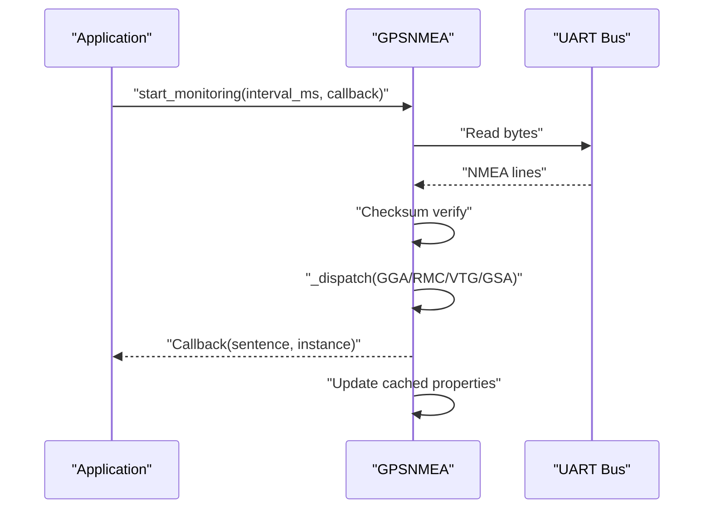
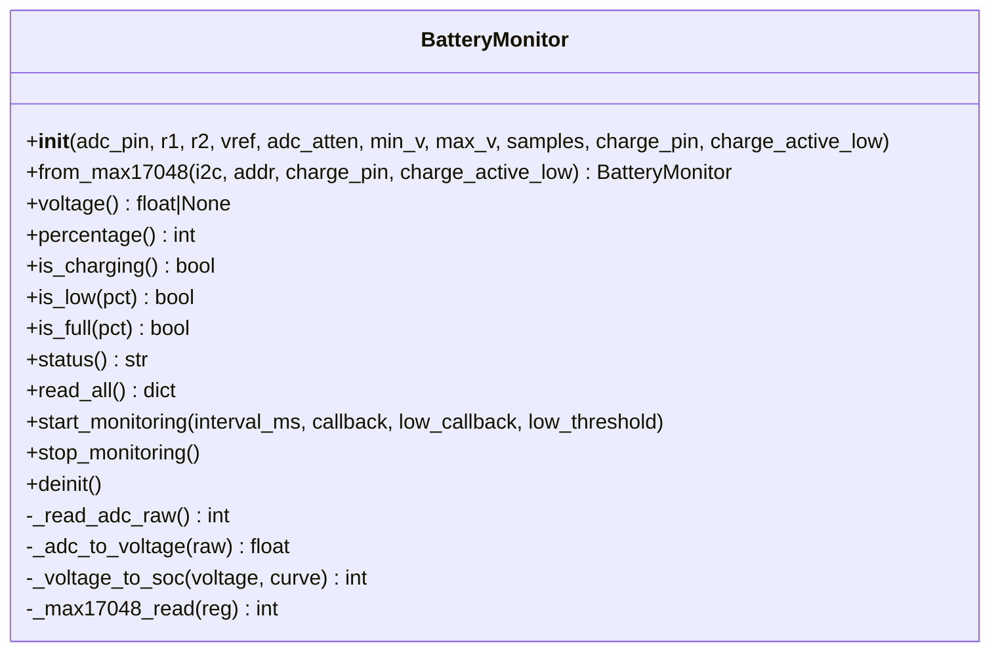
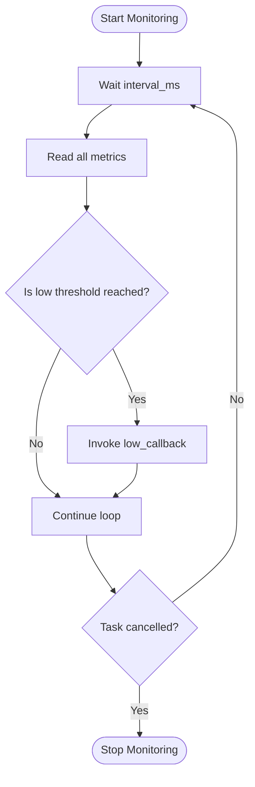
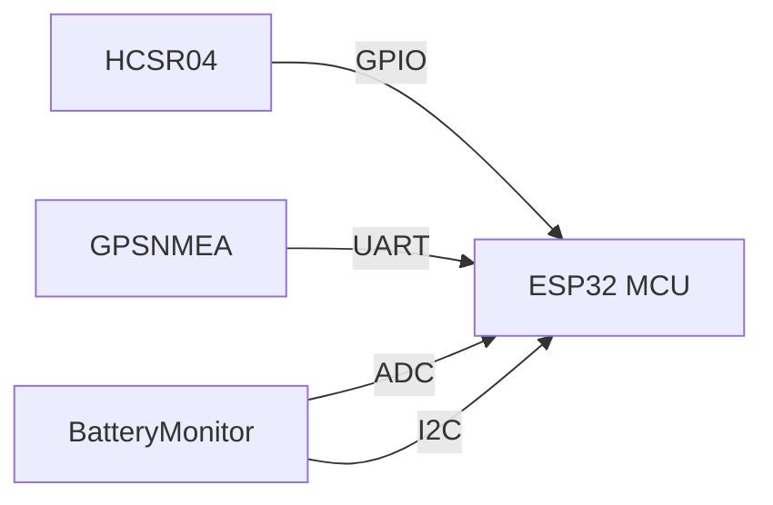

# Position & Navigation Sensors

<cite>
**Referenced Files in This Document**
- [sensors_example.py](file://src/main/examples/sensors_example.py)
- [hcsr04.py](file://src/lib/sensors/hcsr04.py)
- [gps_nmea.py](file://src/lib/sensors/gps_nmea.py)
- [battery_monitor.py](file://src/lib/sensors/battery_monitor.py)
- [README.md](file://src/lib/sensors/README.md)
- [__init__.py](file://src/lib/sensors/__init__.py)
</cite>

## Table of Contents
1. [Introduction](#introduction)
2. [Project Structure](#project-structure)
3. [Core Components](#core-components)
4. [Architecture Overview](#architecture-overview)
5. [Detailed Component Analysis](#detailed-component-analysis)
6. [Dependency Analysis](#dependency-analysis)
7. [Performance Considerations](#performance-considerations)
8. [Troubleshooting Guide](#troubleshooting-guide)
9. [Conclusion](#conclusion)
10. [Appendices](#appendices)

## Introduction
This document focuses on position and navigation sensor drivers within the repository, specifically:
- HC-SR04 ultrasonic distance sensor driver with median filtering and distance interpretation
- GPS NMEA parser supporting multiple message types and async monitoring
- Battery monitoring system supporting ADC voltage divider and MAX17048 fuel gauge

It explains implementation details, data flows, error handling, and practical examples for distance measurement, GPS data processing pipelines, and battery health monitoring. It also outlines sensor fusion strategies, calibration procedures, environmental considerations, and power-aware measurement approaches.

## Project Structure
The relevant sensor drivers are located under src/lib/sensors/. Example usage and integration patterns are demonstrated in src/main/examples/sensors_example.py. The sensors package exposes a unified import interface via src/lib/sensors/__init__.py.

**Diagram sources**
- [sensors_example.py:1-529](file://src/main/examples/sensors_example.py#L1-L529)
- [hcsr04.py:1-115](file://src/lib/sensors/hcsr04.py#L1-L115)
- [gps_nmea.py:1-410](file://src/lib/sensors/gps_nmea.py#L1-L410)
- [battery_monitor.py:1-291](file://src/lib/sensors/battery_monitor.py#L1-L291)
- [__init__.py:1-27](file://src/lib/sensors/__init__.py#L1-L27)
- [README.md:1-2063](file://src/lib/sensors/README.md#L1-L2063)

**Section sources**
- [sensors_example.py:1-529](file://src/main/examples/sensors_example.py#L1-L529)
- [__init__.py:1-27](file://src/lib/sensors/__init__.py#L1-L27)

## Core Components
- HC-SR04 Ultrasonic Distance Sensor
  - Provides single-shot and median-filtered distance measurements with timeout handling and range validation.
  - See [distance_cm:67-84](file://src/lib/sensors/hcsr04.py#L67-L84), [read_median:96-114](file://src/lib/sensors/hcsr04.py#L96-L114).
- GPS NMEA Parser
  - Parses GGA, RMC, VTG, and GSA messages; supports async monitoring and sentence callbacks.
  - See [update:314-332](file://src/lib/sensors/gps_nmea.py#L314-L332), [start_monitoring:363-379](file://src/lib/sensors/gps_nmea.py#L363-L379).
- Battery Monitor
  - Supports ADC voltage divider mode and MAX17048 I2C fuel gauge; provides voltage, percentage, charging detection, and async monitoring.
  - See [voltage:167-176](file://src/lib/sensors/battery_monitor.py#L167-L176), [percentage:178-197](file://src/lib/sensors/battery_monitor.py#L178-L197), [start_monitoring:245-277](file://src/lib/sensors/battery_monitor.py#L245-L277).

**Section sources**
- [hcsr04.py:11-115](file://src/lib/sensors/hcsr04.py#L11-L115)
- [gps_nmea.py:19-410](file://src/lib/sensors/gps_nmea.py#L19-L410)
- [battery_monitor.py:24-291](file://src/lib/sensors/battery_monitor.py#L24-L291)

## Architecture Overview
The position and navigation stack integrates three primary subsystems:
- Distance sensing via HC-SR04
- GNSS positioning via GPS NMEA parser
- Power awareness via Battery Monitor

**Diagram sources**
- [sensors_example.py:103-123](file://src/main/examples/sensors_example.py#L103-L123)
- [hcsr04.py:26-37](file://src/lib/sensors/hcsr04.py#L26-L37)
- [gps_nmea.py:64-70](file://src/lib/sensors/gps_nmea.py#L64-L70)
- [battery_monitor.py:51-93](file://src/lib/sensors/battery_monitor.py#L51-L93)
- [battery_monitor.py:96-128](file://src/lib/sensors/battery_monitor.py#L96-L128)

## Detailed Component Analysis

### HC-SR04 Ultrasonic Distance Sensor
- Implementation highlights
  - Trigger pulse generation and echo timing using microsecond-precision timers
  - Timeout handling to avoid indefinite waits
  - Range validation and unit conversions (cm/mm/inch)
  - Median filtering across multiple samples to reduce noise
- Practical examples
  - Single-shot measurement and median filtering are demonstrated in the example script
  - See [example_hcsr04:103-123](file://src/main/examples/sensors_example.py#L103-L123)

**Diagram sources**
- [hcsr04.py:11-115](file://src/lib/sensors/hcsr04.py#L11-L115)

**Diagram sources**
- [hcsr04.py:39-84](file://src/lib/sensors/hcsr04.py#L39-L84)

Key implementation notes
- Timeout and range checks prevent invalid readings
- Median sampling improves robustness against outliers
- Unit conversion helpers support downstream processing

Practical examples
- See [example_hcsr04:103-123](file://src/main/examples/sensors_example.py#L103-L123) for usage patterns including median filtering.

**Section sources**
- [hcsr04.py:11-115](file://src/lib/sensors/hcsr04.py#L11-L115)
- [sensors_example.py:103-123](file://src/main/examples/sensors_example.py#L103-L123)

### GPS NMEA Parser
- Implementation highlights
  - Asynchronous monitoring loop with configurable intervals
  - Sentence-level parsing for GGA, RMC, VTG, and GSA
  - Checksum verification and coordinate conversion from DMS to decimal degrees
  - Satellite count, fix quality, and DOP metrics
- Practical examples
  - Async monitoring with callbacks and periodic updates are shown in the example script
  - See [GPSNMEA usage:1871-1905](file://src/main/examples/sensors_example.py#L1871-L1905)

**Diagram sources**
- [gps_nmea.py:19-410](file://src/lib/sensors/gps_nmea.py#L19-L410)

**Diagram sources**
- [gps_nmea.py:363-379](file://src/lib/sensors/gps_nmea.py#L363-L379)
- [gps_nmea.py:278-296](file://src/lib/sensors/gps_nmea.py#L278-L296)

Key implementation notes
- Fix quality and satellite count inform reliability
- DOP metrics (HDOP, PDOP, VDOP) quantify geometric precision
- UTC date/time can be combined to derive datetime tuples

Practical examples
- See [GPS basic usage:1871-1885](file://src/main/examples/sensors_example.py#L1871-L1885) and [async monitoring:1887-1905](file://src/main/examples/sensors_example.py#L1887-L1905).

**Section sources**
- [gps_nmea.py:19-410](file://src/lib/sensors/gps_nmea.py#L19-L410)
- [sensors_example.py:1871-1905](file://src/main/examples/sensors_example.py#L1871-L1905)

### Battery Monitor
- Implementation highlights
  - ADC voltage divider mode with configurable resistors and attenuation
  - MAX17048 I2C fuel gauge integration (SOC%, voltage, alarms)
  - Charging detection via GPIO with active-low/high configuration
  - Async monitoring with low-battery alerts and periodic callbacks
- Practical examples
  - ADC and MAX17048 modes are documented in the example script
  - See [BatteryMonitor usage:287-304](file://src/main/examples/sensors_example.py#L287-L304)

**Diagram sources**
- [battery_monitor.py:24-291](file://src/lib/sensors/battery_monitor.py#L24-L291)

**Diagram sources**
- [battery_monitor.py:245-277](file://src/lib/sensors/battery_monitor.py#L245-L277)

Key implementation notes
- ADC mode converts raw readings to battery voltage using a voltage divider formula
- MAX17048 registers provide direct voltage and state-of-charge
- Blended SOC estimation combines lookup table and linear interpolation

Practical examples
- See [ADC mode example:287-304](file://src/main/examples/sensors_example.py#L287-L304) and [MAX17048 mode example:1972-1977](file://src/main/examples/sensors_example.py#L1972-L1977).

**Section sources**
- [battery_monitor.py:24-291](file://src/lib/sensors/battery_monitor.py#L24-L291)
- [sensors_example.py:287-304](file://src/main/examples/sensors_example.py#L287-L304)
- [sensors_example.py:1972-1977](file://src/main/examples/sensors_example.py#L1972-L1977)

## Dependency Analysis
- HC-SR04 depends on GPIO pins for trigger and echo and uses microsecond timing primitives
- GPSNMEA depends on UART for asynchronous NMEA stream ingestion and asyncio for non-blocking monitoring
- BatteryMonitor depends on ADC for analog voltage measurement and optionally I2C for MAX17048

**Diagram sources**
- [hcsr04.py:33-37](file://src/lib/sensors/hcsr04.py#L33-L37)
- [gps_nmea.py:64-70](file://src/lib/sensors/gps_nmea.py#L64-L70)
- [battery_monitor.py:80-93](file://src/lib/sensors/battery_monitor.py#L80-L93)
- [battery_monitor.py:107-128](file://src/lib/sensors/battery_monitor.py#L107-L128)

**Section sources**
- [hcsr04.py:26-37](file://src/lib/sensors/hcsr04.py#L26-L37)
- [gps_nmea.py:54-70](file://src/lib/sensors/gps_nmea.py#L54-L70)
- [battery_monitor.py:51-93](file://src/lib/sensors/battery_monitor.py#L51-L93)
- [battery_monitor.py:96-128](file://src/lib/sensors/battery_monitor.py#L96-L128)

## Performance Considerations
- HC-SR04
  - Median filtering trades latency for accuracy; adjust sample count based on real-time constraints
  - Timeout tuning affects maximum measurable distance and responsiveness
- GPSNMEA
  - Async monitoring reduces CPU load; tune interval_ms to balance freshness and power consumption
  - Parsing overhead increases with higher baud rates; ensure UART buffer sizing
- BatteryMonitor
  - ADC averaging improves SNR but increases measurement time; choose sample count carefully
  - I2C reads are efficient; avoid excessive polling during sleep/low-power modes

[No sources needed since this section provides general guidance]

## Troubleshooting Guide
- HC-SR04
  - No readings or timeouts: verify wiring, use voltage divider if powered from 5V, confirm trigger/echo pins, and adjust timeout_us
  - Outliers: increase samples for median filtering
  - Reference: [distance_cm:67-84](file://src/lib/sensors/hcsr04.py#L67-L84), [read_median:96-114](file://src/lib/sensors/hcsr04.py#L96-L114)
- GPSNMEA
  - No fixes: ensure antenna visibility, verify UART connections, and confirm baudrate
  - Invalid checksums: check wiring and power stability; reinitialize UART if needed
  - Reference: [update:314-332](file://src/lib/sensors/gps_nmea.py#L314-L332), [deinit:398-402](file://src/lib/sensors/gps_nmea.py#L398-L402)
- BatteryMonitor
  - Incorrect voltage: verify resistor values and ADC attenuation; confirm I2C address for MAX17048
  - Charging detection false positives: configure charge_active_low appropriately
  - Reference: [voltage:167-176](file://src/lib/sensors/battery_monitor.py#L167-L176), [is_charging:200-205](file://src/lib/sensors/battery_monitor.py#L200-L205)

**Section sources**
- [hcsr04.py:67-114](file://src/lib/sensors/hcsr04.py#L67-L114)
- [gps_nmea.py:314-402](file://src/lib/sensors/gps_nmea.py#L314-L402)
- [battery_monitor.py:167-205](file://src/lib/sensors/battery_monitor.py#L167-L205)

## Conclusion
The repository provides robust, production-ready drivers for HC-SR04 distance sensing, GPS NMEA parsing, and battery monitoring. Their asynchronous designs enable efficient resource utilization, while practical examples demonstrate integration patterns. Together, these components form a solid foundation for position and navigation applications requiring accurate measurements, reliable data processing, and power-aware operation.

[No sources needed since this section summarizes without analyzing specific files]

## Appendices

### Practical Examples Index
- HC-SR04 distance measurement
  - [example_hcsr04:103-123](file://src/main/examples/sensors_example.py#L103-L123)
- GPS data processing pipeline
  - [GPS basic usage:1871-1885](file://src/main/examples/sensors_example.py#L1871-L1885)
  - [GPS async monitoring:1887-1905](file://src/main/examples/sensors_example.py#L1887-L1905)
- Battery health monitoring
  - [ADC mode example:287-304](file://src/main/examples/sensors_example.py#L287-L304)
  - [MAX17048 mode example:1972-1977](file://src/main/examples/sensors_example.py#L1972-L1977)

### Sensor Fusion Strategies
- Combine HC-SR04 with GPS-derived positions for obstacle avoidance and localization
- Use GPS fix quality and DOP metrics to weight sensor fusion estimates
- Implement power-aware measurement scheduling: reduce HC-SR04 polling when battery is low

[No sources needed since this section provides general guidance]

### Calibration and Environmental Factors
- HC-SR04
  - Calibrate mounting angle and surface material effects; account for temperature-dependent speed of sound
- GPS
  - Account for multipath and atmospheric delays; use differential/GNSS augmentation when available
- BatteryMonitor
  - Calibrate ADC offsets and MAX17048 capacity curves; consider load regulation and cable resistance

[No sources needed since this section provides general guidance]