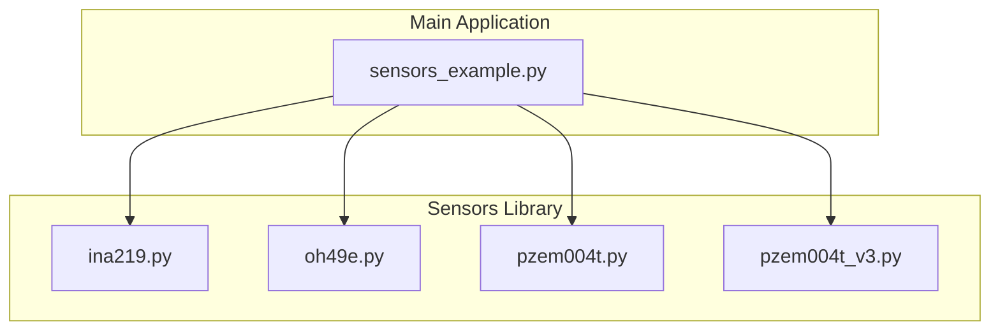
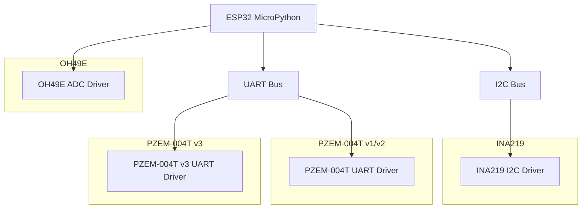
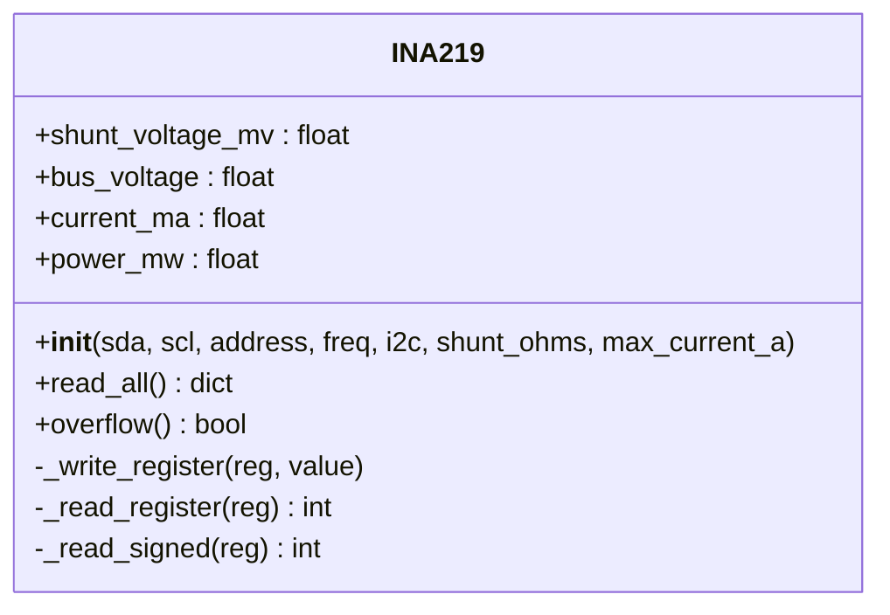
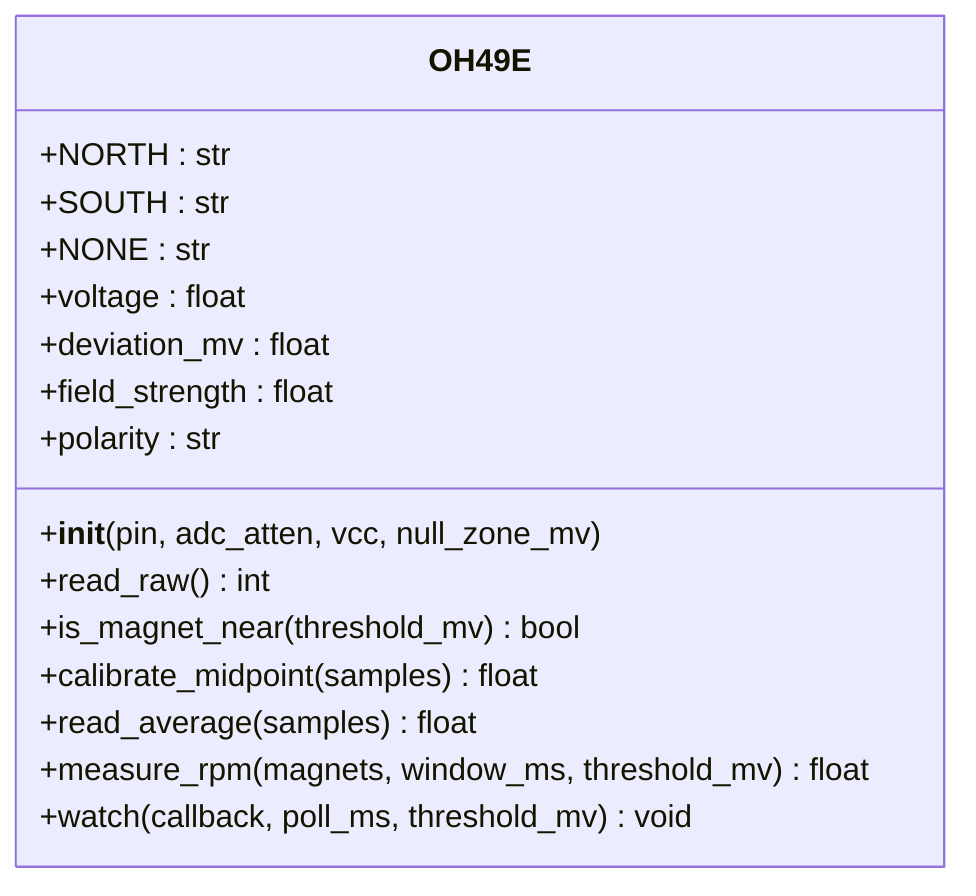
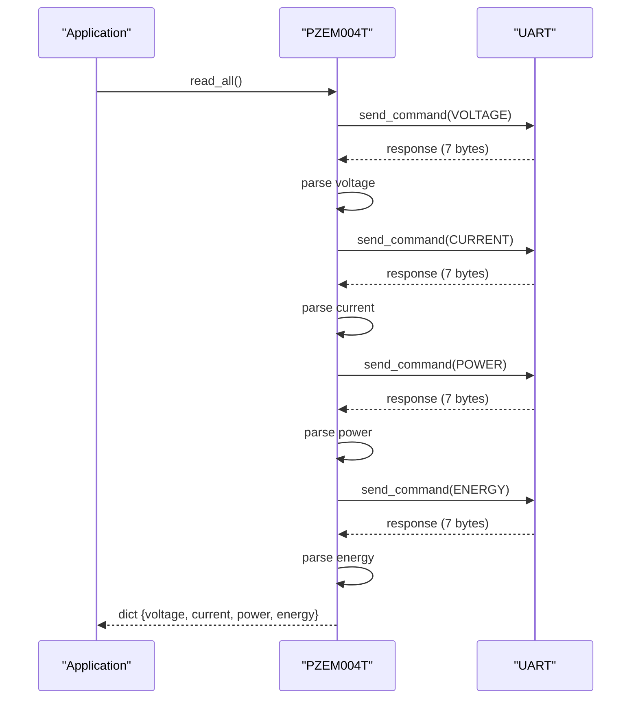
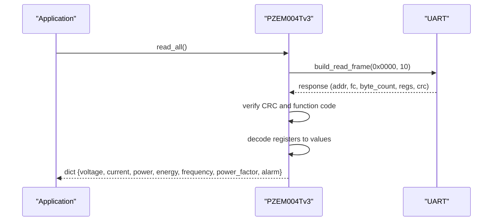
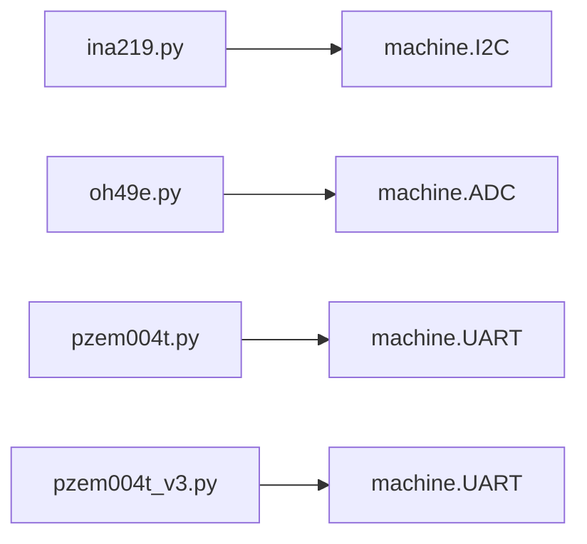

# Power & Energy Sensors

<cite>
**Referenced Files in This Document**
- [ina219.py](file://src/lib/sensors/ina219.py)
- [oh49e.py](file://src/lib/sensors/oh49e.py)
- [pzem004t.py](file://src/lib/sensors/pzem004t.py)
- [pzem004t_v3.py](file://src/lib/sensors/pzem004t_v3.py)
- [sensors_example.py](file://src/main/examples/sensors_example.py)
- [README.md](file://src/lib/README.md)
- [README.md](file://src/lib/sensors/README.md)
</cite>

## Table of Contents
1. [Introduction](#introduction)
2. [Project Structure](#project-structure)
3. [Core Components](#core-components)
4. [Architecture Overview](#architecture-overview)
5. [Detailed Component Analysis](#detailed-component-analysis)
6. [Dependency Analysis](#dependency-analysis)
7. [Performance Considerations](#performance-considerations)
8. [Troubleshooting Guide](#troubleshooting-guide)
9. [Conclusion](#conclusion)
10. [Appendices](#appendices)

## Introduction
This document explains power and energy monitoring sensors implemented in the repository, focusing on:
- INA219 current and power monitor with shunt resistor configuration and calibration
- OH49E Hall effect sensors for non-contact current measurement and magnetic field sensing
- PZEM-004T and PZEM-004T v3 power meters with Modbus RTU communication, energy tracking, and power quality monitoring

It provides practical examples for continuous monitoring, energy calculations, cost estimation, fault detection, calibration procedures, accuracy considerations, and integration with load management systems. Safety precautions, electrical isolation requirements, and measurement accuracy optimization techniques are also addressed.

## Project Structure
The power/energy sensor drivers live under the sensors library and are demonstrated in the main examples:
- INA219: I2C-based current/power monitor
- OH49E: ADC-based linear Hall sensor
- PZEM-004T: UART-based legacy protocol
- PZEM-004T v3: UART-based Modbus RTU

**Diagram sources**
- [sensors_example.py:287-455](file://src/main/examples/sensors_example.py#L287-L455)
- [ina219.py:33-140](file://src/lib/sensors/ina219.py#L33-L140)
- [oh49e.py:16-225](file://src/lib/sensors/oh49e.py#L16-L225)
- [pzem004t.py:37-271](file://src/lib/sensors/pzem004t.py#L37-L271)
- [pzem004t_v3.py:63-406](file://src/lib/sensors/pzem004t_v3.py#L63-L406)

**Section sources**
- [README.md:1-72](file://src/lib/README.md#L1-L72)
- [README.md:1-2063](file://src/lib/sensors/README.md#L1-L2063)

## Core Components
- INA219: I2C interface, measures bus voltage, shunt voltage, current, and power; supports overflow detection and continuous monitoring via properties and read_all().
- OH49E: ADC interface, measures magnetic field strength, polarity, and detects nearby magnets; supports midpoint calibration and average deviation filtering.
- PZEM-004T (v1/v2): UART interface with custom binary protocol, measures voltage, current, power, energy, and approximates power factor; supports async monitoring and energy reset.
- PZEM-004T v3 (Modbus RTU): UART interface with Modbus RTU, measures voltage, current, power, energy, frequency, power factor, and alarm status; supports setting thresholds, slave addressing, and energy reset.

Practical examples demonstrate continuous monitoring loops, energy accumulation, and asynchronous monitoring.

**Section sources**
- [ina219.py:33-140](file://src/lib/sensors/ina219.py#L33-L140)
- [oh49e.py:16-225](file://src/lib/sensors/oh49e.py#L16-L225)
- [pzem004t.py:37-271](file://src/lib/sensors/pzem004t.py#L37-L271)
- [pzem004t_v3.py:63-406](file://src/lib/sensors/pzem004t_v3.py#L63-L406)
- [sensors_example.py:287-455](file://src/main/examples/sensors_example.py#L287-L455)

## Architecture Overview
The system architecture separates hardware abstraction (drivers) from application usage. Each sensor driver exposes a simple Python interface with properties and optional async monitoring.

**Diagram sources**
- [ina219.py:52-79](file://src/lib/sensors/ina219.py#L52-L79)
- [oh49e.py:47-66](file://src/lib/sensors/oh49e.py#L47-L66)
- [pzem004t.py:61-79](file://src/lib/sensors/pzem004t.py#L61-L79)
- [pzem004t_v3.py:89-111](file://src/lib/sensors/pzem004t_v3.py#L89-L111)

## Detailed Component Analysis

### INA219 Current and Power Monitor
- Interface: I2C
- Key capabilities:
  - Measures bus voltage, shunt voltage, current, and power
  - Configures calibration based on shunt resistance and maximum current
  - Provides overflow detection
  - Supports continuous monitoring via read_all()

Implementation highlights:
- Default configuration and calibration constants are pre-defined for typical 0.1Ω shunts and 3.2A max current scenarios.
- Calibration constant calculation uses LSB scaling derived from shunt resistance and desired current range.
- Properties convert raw register values to engineering units with rounding for readability.

**Diagram sources**
- [ina219.py:33-140](file://src/lib/sensors/ina219.py#L33-L140)

Practical example usage:
- Continuous monitoring loop and energy accumulation are demonstrated in the example script.

**Section sources**
- [ina219.py:33-140](file://src/lib/sensors/ina219.py#L33-L140)
- [sensors_example.py:287-304](file://src/main/examples/sensors_example.py#L287-L304)

### OH49E Hall Effect Sensor
- Interface: ADC
- Key capabilities:
  - Measures magnetic field strength and polarity
  - Detects nearby magnet presence with configurable null zone
  - Supports midpoint calibration and average deviation filtering
  - Provides async watch for polarity change events

Implementation highlights:
- Sensitivity scales with supply voltage; field strength is computed from deviation from midpoint.
- Null zone prevents false triggering near zero-field conditions.
- Async watch polls polarity and invokes a callback on change.

**Diagram sources**
- [oh49e.py:16-225](file://src/lib/sensors/oh49e.py#L16-L225)

Practical example usage:
- Midpoint calibration, average deviation, and async watch are demonstrated in the example script.

**Section sources**
- [oh49e.py:16-225](file://src/lib/sensors/oh49e.py#L16-L225)
- [sensors_example.py:305-358](file://src/main/examples/sensors_example.py#L305-L358)

### PZEM-004T v1/v2 Energy Meter (Custom UART Protocol)
- Interface: UART (custom binary protocol)
- Key capabilities:
  - Measures voltage, current, power, and cumulative energy
  - Approximates power factor from measured values
  - Supports async monitoring and energy reset

Protocol specifics:
- Commands are sent as fixed-length requests; responses are validated with a simple checksum.
- Values are parsed from response bytes with appropriate scaling.

**Diagram sources**
- [pzem004t.py:85-201](file://src/lib/sensors/pzem004t.py#L85-L201)

Practical example usage:
- Basic read_all and async monitor are demonstrated in the example script.

**Section sources**
- [pzem004t.py:37-271](file://src/lib/sensors/pzem004t.py#L37-L271)
- [sensors_example.py:360-400](file://src/main/examples/sensors_example.py#L360-L400)

### PZEM-004T v3 Energy Meter (Modbus RTU)
- Interface: UART (Modbus RTU)
- Key capabilities:
  - Measures voltage, current, power, energy, frequency, power factor, and alarm status
  - Supports setting alarm threshold, reading threshold, changing slave address, and resetting energy
  - Efficient single-frame read_all() to fetch all values

Modbus specifics:
- Uses function code 0x04 to read input registers and function code 0x06 to write a single holding register.
- Includes CRC-16 validation and slave address verification.

**Diagram sources**
- [pzem004t_v3.py:117-185](file://src/lib/sensors/pzem004t_v3.py#L117-L185)
- [pzem004t_v3.py:263-299](file://src/lib/sensors/pzem004t_v3.py#L263-L299)

Practical example usage:
- Setting alarm threshold, reading alarm status, and async monitor are demonstrated in the example script.

**Section sources**
- [pzem004t_v3.py:63-406](file://src/lib/sensors/pzem004t_v3.py#L63-L406)
- [sensors_example.py:402-455](file://src/main/examples/sensors_example.py#L402-L455)

## Dependency Analysis
- INA219 depends on I2C hardware abstraction and register-level reads/writes.
- OH49E depends on ADC hardware abstraction and polling with async support.
- PZEM-004T v1/v2 depends on UART with custom framing and checksum.
- PZEM-004T v3 depends on UART with Modbus RTU framing, CRC-16, and register addressing.

**Diagram sources**
- [ina219.py:64-68](file://src/lib/sensors/ina219.py#L64-L68)
- [oh49e.py:58-60](file://src/lib/sensors/oh49e.py#L58-L60)
- [pzem004t.py:69-77](file://src/lib/sensors/pzem004t.py#L69-L77)
- [pzem004t_v3.py:99-107](file://src/lib/sensors/pzem004t_v3.py#L99-L107)

**Section sources**
- [ina219.py:52-79](file://src/lib/sensors/ina219.py#L52-L79)
- [oh49e.py:47-66](file://src/lib/sensors/oh49e.py#L47-L66)
- [pzem004t.py:61-79](file://src/lib/sensors/pzem004t.py#L61-L79)
- [pzem004t_v3.py:89-111](file://src/lib/sensors/pzem004t_v3.py#L89-L111)

## Performance Considerations
- INA219
  - Calibration impacts resolution; choose shunt resistance and max current to maximize LSB utilization.
  - Use read_all() to minimize I2C transactions.
  - Monitor overflow flag to detect saturation.
- OH49E
  - Increase samples for read_average() to reduce noise.
  - Tune null_zone_mv to avoid false triggers near zero field.
  - Use calibrate_midpoint() periodically for drift compensation.
- PZEM-004T v1/v2
  - Use read_all() to batch measurements and reduce UART overhead.
  - Approximated power factor may vary with load characteristics.
- PZEM-004T v3
  - Prefer read_all() to fetch all values in one transaction.
  - Set alarm threshold appropriately to trigger early warnings.
  - Use set_slave_address() to enable multi-meter setups on the same bus.

[No sources needed since this section provides general guidance]

## Troubleshooting Guide
Common issues and remedies:
- INA219 overflow
  - Symptom: overflow() returns True.
  - Action: Reduce max_current_a or use a lower shunt resistance during initialization.
- OH49E noisy readings
  - Symptom: Rapid polarity toggles or unstable deviation.
  - Action: Increase samples in read_average(); adjust null_zone_mv; recalibrate midpoint.
- PZEM-004T v1/v2 timeouts or checksum errors
  - Symptom: Returned values are None.
  - Action: Verify wiring, correct baud rate, and power supply; ensure CT is properly connected.
- PZEM-004T v3 CRC mismatch or wrong address
  - Symptom: None returned from register reads.
  - Action: Confirm slave address, CRC calculation, and wiring; reconfigure address if needed.
- Asynchronous monitoring stalls
  - Symptom: monitor callbacks not invoked.
  - Action: Ensure event loop is running; verify callback invocation path.

**Section sources**
- [ina219.py:137-140](file://src/lib/sensors/ina219.py#L137-L140)
- [oh49e.py:154-163](file://src/lib/sensors/oh49e.py#L154-L163)
- [pzem004t.py:85-124](file://src/lib/sensors/pzem004t.py#L85-L124)
- [pzem004t_v3.py:124-163](file://src/lib/sensors/pzem004t_v3.py#L124-L163)

## Conclusion
The repository provides robust drivers for power and energy monitoring across multiple sensor technologies:
- INA219 offers precise current/power monitoring via I2C with configurable calibration.
- OH49E enables non-invasive magnetic field sensing with calibration and async watch.
- PZEM-004T v1/v2 delivers basic energy metrics over UART with async monitoring.
- PZEM-004T v3 extends capabilities with Modbus RTU, power quality metrics, and advanced configuration.

These drivers integrate cleanly with asynchronous applications and support continuous monitoring, energy accumulation, and fault detection workflows.

[No sources needed since this section summarizes without analyzing specific files]

## Appendices

### Practical Examples Index
- INA219 continuous monitoring and overflow detection
  - [sensors_example.py:287-304](file://src/main/examples/sensors_example.py#L287-L304)
- OH49E midpoint calibration, average deviation, and async watch
  - [sensors_example.py:305-358](file://src/main/examples/sensors_example.py#L305-L358)
- PZEM-004T v1/v2 read_all and async monitor
  - [sensors_example.py:360-400](file://src/main/examples/sensors_example.py#L360-L400)
- PZEM-004T v3 read_all, alarm threshold, and async monitor
  - [sensors_example.py:402-455](file://src/main/examples/sensors_example.py#L402-L455)

### Safety and Isolation Guidelines
- Electrical isolation
  - Use galvanic isolation between AC mains and ESP32 (e.g., isolated current transformers and optocouplers).
  - Ensure proper PCB layout and creepage distances per voltage rating.
- Live/Neutral connections
  - Connect load terminals to the meter’s line/neutral inputs as indicated on the device.
- Supply voltages
  - Respect device-specific supply voltage limits (e.g., PZEM-004T v1/v2 requires 5V supply).
- Grounding
  - Maintain a single-point ground reference to avoid ground loops.

[No sources needed since this section provides general guidance]

### Accuracy and Calibration Procedures
- INA219
  - Select shunt resistance and max current to utilize the full dynamic range.
  - Recalibrate if shunt resistance varies; update constructor parameters accordingly.
- OH49E
  - Periodically recalibrate midpoint when environmental conditions change.
  - Adjust null_zone_mv to suit installation proximity to ferrous materials.
- PZEM-004T v3
  - Set alarm threshold based on acceptable load limits.
  - Configure slave addresses to avoid conflicts on multi-meter buses.

[No sources needed since this section provides general guidance]