# Sensor Systems

<cite>
**Referenced Files in This Document**
- [sensors_example.py](file://src/main/examples/sensors_example.py)
- [__init__.py](file://src/lib/sensors/__init__.py)
- [README.md](file://src/lib/sensors/README.md)
- [dht.py](file://src/lib/sensors/dht.py)
- [bmp280.py](file://src/lib/sensors/bmp280.py)
- [ds18x20.py](file://src/lib/sensors/ds18x20.py)
- [mpu6050.py](file://src/lib/sensors/mpu6050.py)
- [hcsr04.py](file://src/lib/sensors/hcsr04.py)
- [ads1115.py](file://src/lib/sensors/ads1115.py)
- [max30102.py](file://src/lib/sensors/max30102.py)
- [ldr.py](file://src/lib/sensors/ldr.py)
- [soil.py](file://src/lib/sensors/soil.py)
- [pir.py](file://src/lib/sensors/pir.py)
- [rcwl0516.py](file://src/lib/sensors/rcwl0516.py)
- [mq_gas.py](file://src/lib/sensors/mq_gas.py)
- [ina219.py](file://src/lib/sensors/ina219.py)
- [oh49e.py](file://src/lib/sensors/oh49e.py)
- [pzem004t.py](file://src/lib/sensors/pzem004t.py)
- [pzem004t_v3.py](file://src/lib/sensors/pzem004t_v3.py)
- [pms7003.py](file://src/lib/sensors/_pms_base.py)
- [pms5003.py](file://src/lib/sensors/pms5003.py)
- [gps_nmea.py](file://src/lib/sensors/gps_nmea.py)
- [battery_monitor.py](file://src/lib/sensors/battery_monitor.py)
</cite>

## Table of Contents
1. [Introduction](#introduction)
2. [Project Structure](#project-structure)
3. [Core Components](#core-components)
4. [Architecture Overview](#architecture-overview)
5. [Detailed Component Analysis](#detailed-component-analysis)
6. [Dependency Analysis](#dependency-analysis)
7. [Performance Considerations](#performance-considerations)
8. [Troubleshooting Guide](#troubleshooting-guide)
9. [Conclusion](#conclusion)
10. [Appendices](#appendices)

## Introduction
This document describes the comprehensive sensor driver ecosystem for the ESP32-C3 platform, focusing on temperature and humidity sensors (DHT, BMP280/BME280), DS18B20 OneWire temperature sensors, motion and presence detection (PIR and radar), environmental monitoring (air quality via MQ series, light via LDR, soil moisture), gas detection, power and energy monitoring (INA219, Hall effect sensors, PZEM), position and navigation (ultrasonic distance and GPS NMEA parsing), and specialized sensors (MAX30102 pulse oximeter and battery monitors). It explains driver patterns, calibration procedures, data processing techniques, and integration with the storage system. Practical examples from sensors_example.py demonstrate sensor reading, data processing, and transmission workflows, along with sensor fusion, noise filtering, and accuracy optimization strategies.

## Project Structure
The sensor drivers are organized under src/lib/sensors/, with a central module exposing all drivers and a README that documents wiring, constructor parameters, methods, and usage examples per sensor. The examples demonstrate practical integration patterns across multiple sensor types.

```mermaid
graph TB
A["src/lib/sensors/__init__.py<br/>Exports all sensor drivers"] --> B["dht.py<br/>DHT11/DHT22"]
A --> C["bmp280.py<br/>BMP280/BME280"]
A --> D["ds18x20.py<br/>DS18B20 OneWire"]
A --> E["mpu6050.py<br/>IMU Accelerometer/Gyroscope"]
A --> F["hcsr04.py<br/>Ultrasonic Distance"]
A --> G["ads1115.py<br/>16-bit ADC"]
A --> H["max30102.py<br/>Pulse Oximeter"]
A --> I["ldr.py<br/>Light-dependent Resistor"]
A --> J["soil.py<br/>Soil Moisture"]
A --> K["pir.py<br/>PIR Motion"]
A --> L["rcwl0516.py<br/>Microwave Radar"]
A --> M["mq_gas.py<br/>MQ Series Gas"]
A --> N["ina219.py<br/>Current/Voltage Monitor"]
A --> O["oh49e.py<br/>Hall Effect Sensor"]
A --> P["pzem004t.py<br/>Energy Monitor v1/v2"]
A --> Q["pzem004t_v3.py<br/>Energy Monitor v3 (Modbus)"]
A --> R["_pms_base.py<br/>PMx.x Base"]
A --> S["pms5003.py<br/>PM2.5 Sensor"]
A --> T["gps_nmea.py<br/>GPS NMEA Parser"]
A --> U["battery_monitor.py<br/>Battery Monitor"]
```

**Diagram sources**
- [__init__.py:1-27](file://src/lib/sensors/__init__.py#L1-L27)
- [dht.py:1-78](file://src/lib/sensors/dht.py#L1-L78)
- [bmp280.py:1-204](file://src/lib/sensors/bmp280.py#L1-L204)
- [ds18x20.py:1-107](file://src/lib/sensors/ds18x20.py#L1-L107)
- [mpu6050.py](file://src/lib/sensors/mpu6050.py)
- [hcsr04.py](file://src/lib/sensors/hcsr04.py)
- [ads1115.py](file://src/lib/sensors/ads1115.py)
- [max30102.py](file://src/lib/sensors/max30102.py)
- [ldr.py](file://src/lib/sensors/ldr.py)
- [soil.py](file://src/lib/sensors/soil.py)
- [pir.py](file://src/lib/sensors/pir.py)
- [rcwl0516.py](file://src/lib/sensors/rcwl0516.py)
- [mq_gas.py](file://src/lib/sensors/mq_gas.py)
- [ina219.py](file://src/lib/sensors/ina219.py)
- [oh49e.py](file://src/lib/sensors/oh49e.py)
- [pzem004t.py](file://src/lib/sensors/pzem004t.py)
- [pzem004t_v3.py](file://src/lib/sensors/pzem004t_v3.py)
- [pms5003.py](file://src/lib/sensors/pms5003.py)
- [gps_nmea.py](file://src/lib/sensors/gps_nmea.py)
- [battery_monitor.py](file://src/lib/sensors/battery_monitor.py)

**Section sources**
- [__init__.py:1-27](file://src/lib/sensors/__init__.py#L1-L27)
- [README.md:18-42](file://src/lib/sensors/README.md#L18-L42)

## Core Components
This section outlines the primary sensor families and their representative drivers, highlighting shared patterns such as I2C/SPI initialization, calibration, and data compensation.

- Temperature/Humidity: DHTSensor (DHT11/DHT22), BMP280/BME280 (with calibration and altitude calculation), DS18B20 (1-Wire multi-drop).
- Motion/Presence: PIR and RCWL-0516 radar sensors with async watch and blocking wait patterns.
- Environmental Monitoring: LDR (voltage divider), Soil Moisture (ADC with dry/wet calibration), MQ series gas sensors (ratio and PPM).
- Power/Energy: INA219 (shunt/current/power), OH49E Hall effect (linear sensing), PZEM (AC energy via UART/Modbus).
- Position/Navigation: HCSR04 ultrasonic distance with median filtering; GPS NMEA parsing for location.
- Specialized: MAX30102 pulse oximeter (IR/red FIFO sampling), battery monitor (ADC/I2C).
- Air Quality: PMS5003 PM2.5 sensor with warm-up and median filtering.

**Section sources**
- [dht.py:28-78](file://src/lib/sensors/dht.py#L28-L78)
- [bmp280.py:52-111](file://src/lib/sensors/bmp280.py#L52-L111)
- [ds18x20.py:30-58](file://src/lib/sensors/ds18x20.py#L30-L58)
- [hcsr04.py](file://src/lib/sensors/hcsr04.py)
- [ldr.py](file://src/lib/sensors/ldr.py)
- [soil.py](file://src/lib/sensors/soil.py)
- [mq_gas.py](file://src/lib/sensors/mq_gas.py)
- [ina219.py](file://src/lib/sensors/ina219.py)
- [oh49e.py](file://src/lib/sensors/oh49e.py)
- [pzem004t.py](file://src/lib/sensors/pzem004t.py)
- [pzem004t_v3.py](file://src/lib/sensors/pzem004t_v3.py)
- [pms5003.py](file://src/lib/sensors/pms5003.py)
- [gps_nmea.py](file://src/lib/sensors/gps_nmea.py)
- [max30102.py](file://src/lib/sensors/max30102.py)

## Architecture Overview
The sensor drivers follow a consistent pattern:
- Initialization with explicit pin/I2C/SPI parameters or prebuilt I2C objects.
- Optional calibration routines (e.g., BMP280 calibration registers, DS18B20 ROM addressing, OH49E midpoint).
- Data acquisition with compensation formulas (e.g., BMP280 temperature/pressure/humidity).
- Utility methods for averaging, filtering (median), and async monitoring/watch callbacks.
- Integration points for storage and cloud via example scripts.

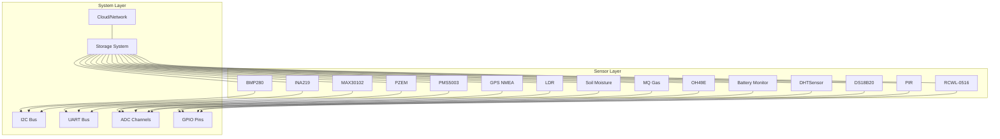

**Diagram sources**
- [__init__.py:1-27](file://src/lib/sensors/__init__.py#L1-L27)
- [dht.py:28-39](file://src/lib/sensors/dht.py#L28-L39)
- [bmp280.py:62-76](file://src/lib/sensors/bmp280.py#L62-L76)
- [ds18x20.py:34-38](file://src/lib/sensors/ds18x20.py#L34-L38)
- [hcsr04.py](file://src/lib/sensors/hcsr04.py)
- [ldr.py](file://src/lib/sensors/ldr.py)
- [soil.py](file://src/lib/sensors/soil.py)
- [mq_gas.py](file://src/lib/sensors/mq_gas.py)
- [ina219.py](file://src/lib/sensors/ina219.py)
- [oh49e.py](file://src/lib/sensors/oh49e.py)
- [pzem004t.py](file://src/lib/sensors/pzem004t.py)
- [pzem004t_v3.py](file://src/lib/sensors/pzem004t_v3.py)
- [pms5003.py](file://src/lib/sensors/pms5003.py)
- [gps_nmea.py](file://src/lib/sensors/gps_nmea.py)
- [max30102.py](file://src/lib/sensors/max30102.py)

## Detailed Component Analysis

### DHT Sensor (DHT11/DHT22)
- Pattern: Uses MicroPython’s built-in dht module with a wrapper class. Supports Celsius and Fahrenheit conversions.
- Calibration: Not applicable; relies on internal timing and checksum verification.
- Data Processing: Returns temperature and humidity tuples; handles exceptions gracefully.
- Integration: Suitable for logging and alerting workflows.

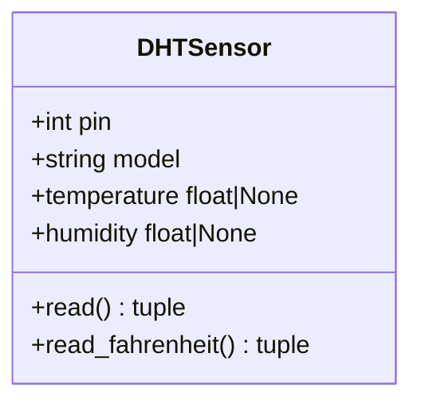

**Diagram sources**
- [dht.py:11-78](file://src/lib/sensors/dht.py#L11-L78)

**Section sources**
- [dht.py:28-78](file://src/lib/sensors/dht.py#L28-L78)
- [README.md:45-128](file://src/lib/sensors/README.md#L45-L128)

### BMP280/BME280 (Temperature/Pressure/Humidity)
- Pattern: I2C-based driver with calibration register loading and compensation formulas for temperature, pressure, and optional humidity.
- Calibration: Loads factory calibration coefficients; configures oversampling and normal mode.
- Data Processing: Converts raw ADC values to physical units with rounding; altitude calculation supported.
- Integration: Ideal for weather stations and barometric altitude estimation.

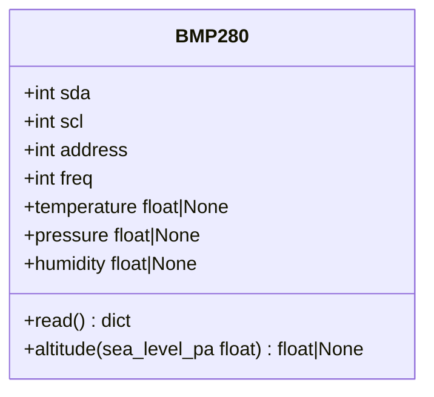

**Diagram sources**
- [bmp280.py:36-204](file://src/lib/sensors/bmp280.py#L36-L204)

**Section sources**
- [bmp280.py:52-111](file://src/lib/sensors/bmp280.py#L52-L111)
- [bmp280.py:147-204](file://src/lib/sensors/bmp280.py#L147-L204)
- [README.md:131-209](file://src/lib/sensors/README.md#L131-L209)

### DS18B20 (OneWire Temperature)
- Pattern: 1-Wire multi-drop support; scans ROM addresses and supports indexed or ROM-specific reads.
- Calibration: No calibration; relies on precision of sensor chips.
- Data Processing: Reads all devices on bus with appropriate timing; returns list of (ROM, temperature).
- Integration: Useful for distributed temperature monitoring.

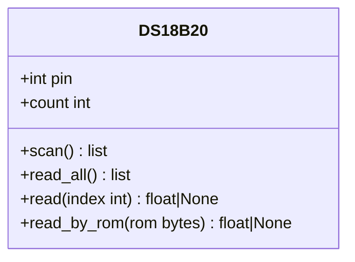

**Diagram sources**
- [ds18x20.py:15-107](file://src/lib/sensors/ds18x20.py#L15-L107)

**Section sources**
- [ds18x20.py:30-58](file://src/lib/sensors/ds18x20.py#L30-L58)
- [ds18x20.py:60-107](file://src/lib/sensors/ds18x20.py#L60-L107)
- [README.md:211-280](file://src/lib/sensors/README.md#L211-L280)

### PIR Motion Sensor (HC-SR501)
- Pattern: Digital output with warm-up period; provides immediate detection and async watch with timeout.
- Calibration: Warm-up time configurable; reduces false positives during initial stabilization.
- Data Processing: Boolean detection property; watch callback pattern for event-driven monitoring.
- Integration: Presence detection for lighting, alarms, and automation.

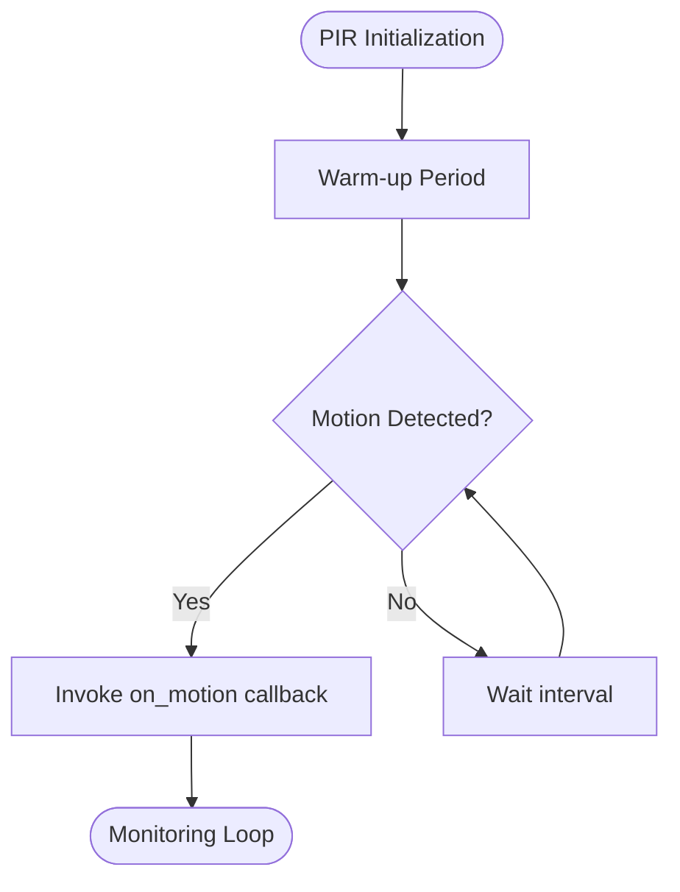

**Diagram sources**
- [pir.py](file://src/lib/sensors/pir.py)
- [sensors_example.py:186-215](file://src/main/examples/sensors_example.py#L186-L215)

**Section sources**
- [pir.py](file://src/lib/sensors/pir.py)
- [sensors_example.py:186-215](file://src/main/examples/sensors_example.py#L186-L215)
- [README.md:771-806](file://src/lib/sensors/README.md#L771-L806)

### RCWL-0516 Microwave Radar
- Pattern: Digital output with hold time; supports blocking wait and async watch with separate on-clear callbacks.
- Calibration: Hold time configuration; last motion timestamp tracking.
- Data Processing: Motion detection with timeout; watch with configurable intervals.
- Integration: Non-contact presence detection suitable for occupancy and security.

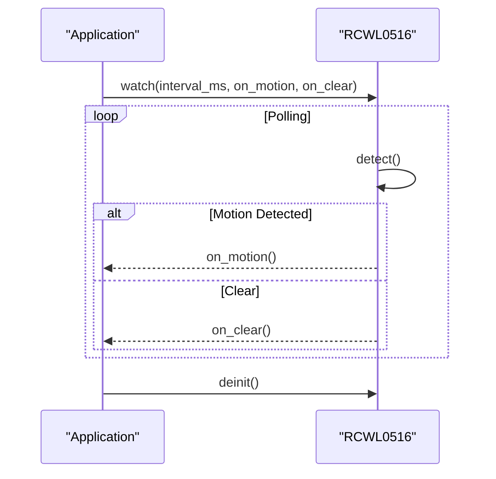

**Diagram sources**
- [rcwl0516.py](file://src/lib/sensors/rcwl0516.py)
- [sensors_example.py:218-262](file://src/main/examples/sensors_example.py#L218-L262)

**Section sources**
- [rcwl0516.py](file://src/lib/sensors/rcwl0516.py)
- [sensors_example.py:218-262](file://src/main/examples/sensors_example.py#L218-L262)
- [README.md:807-840](file://src/lib/sensors/README.md#L807-L840)

### LDR Light Sensor
- Pattern: Voltage divider with fixed resistor; provides raw, voltage, resistance, and normalized light level.
- Calibration: Not required; normalization yields 0–1 scale.
- Data Processing: Average over N samples to reduce noise; dark detection thresholds.
- Integration: Automatic lighting control and environmental logging.

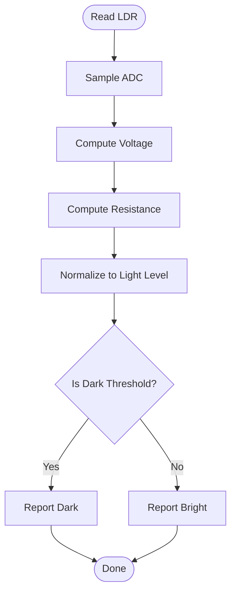

**Diagram sources**
- [ldr.py](file://src/lib/sensors/ldr.py)
- [sensors_example.py:158-169](file://src/main/examples/sensors_example.py#L158-L169)

**Section sources**
- [ldr.py](file://src/lib/sensors/ldr.py)
- [sensors_example.py:158-169](file://src/main/examples/sensors_example.py#L158-L169)
- [README.md:627-693](file://src/lib/sensors/README.md#L627-L693)

### Soil Moisture Sensor
- Pattern: Analog measurement with dry/wet calibration values; optional digital output.
- Calibration: Dry and wet raw values define linear mapping to percent.
- Data Processing: Percent moisture, dry/wet thresholds, and averaging.
- Integration: Irrigation control and plant health monitoring.

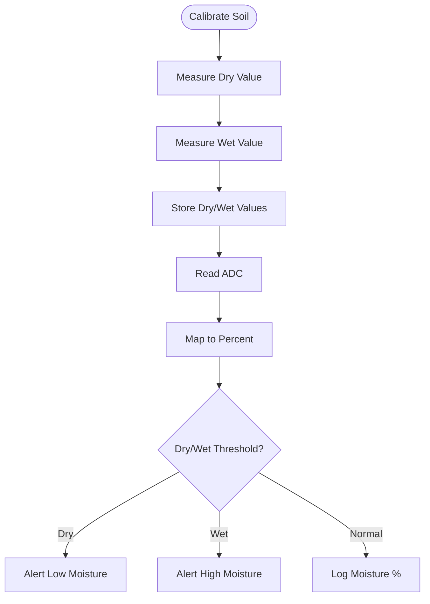

**Diagram sources**
- [soil.py](file://src/lib/sensors/soil.py)
- [sensors_example.py:172-183](file://src/main/examples/sensors_example.py#L172-L183)

**Section sources**
- [soil.py](file://src/lib/sensors/soil.py)
- [sensors_example.py:172-183](file://src/main/examples/sensors_example.py#L172-L183)
- [README.md:696-768](file://src/lib/sensors/README.md#L696-L768)

### MQ Series Gas Sensors
- Pattern: Analog sensor with R0 calibration; computes ratio and converts to PPM for specific gases.
- Calibration: Pre-calibrated R0 or dynamic calibration over clean air.
- Data Processing: Ratio Rs/R0; digital alarm thresholding.
- Integration: Air quality monitoring and leak detection.

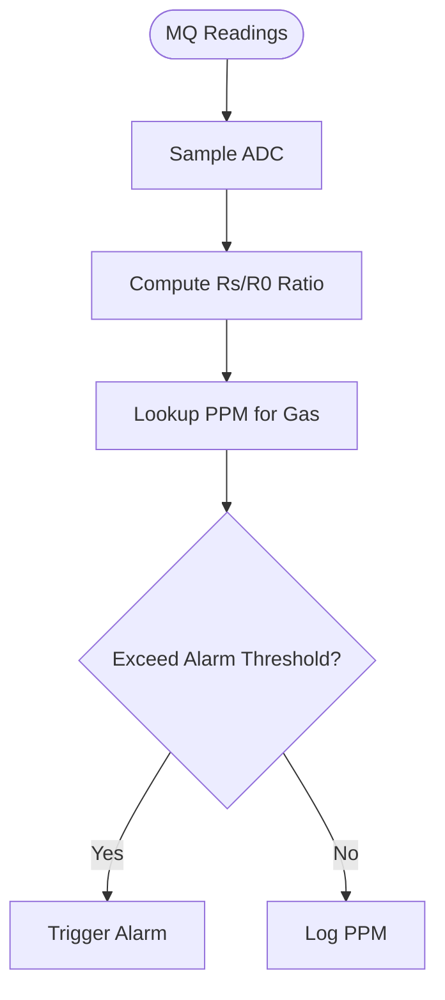

**Diagram sources**
- [mq_gas.py](file://src/lib/sensors/mq_gas.py)
- [sensors_example.py:266-286](file://src/main/examples/sensors_example.py#L266-L286)

**Section sources**
- [mq_gas.py](file://src/lib/sensors/mq_gas.py)
- [sensors_example.py:266-286](file://src/main/examples/sensors_example.py#L266-L286)
- [README.md:771-806](file://src/lib/sensors/README.md#L771-L806)

### INA219 Current/Voltage Monitor
- Pattern: I2C-based shunt monitor; reads bus voltage, shunt voltage, current, and power.
- Calibration: Shunt resistance and max current configurable.
- Data Processing: Full readout and overflow detection.
- Integration: Power budgeting and fault detection.

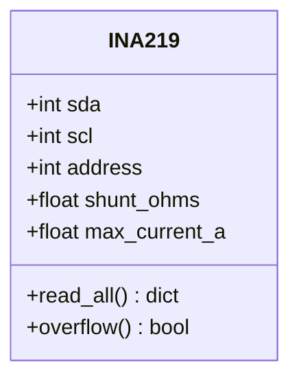

**Diagram sources**
- [ina219.py](file://src/lib/sensors/ina219.py)
- [sensors_example.py:288-304](file://src/main/examples/sensors_example.py#L288-L304)

**Section sources**
- [ina219.py](file://src/lib/sensors/ina219.py)
- [sensors_example.py:288-304](file://src/main/examples/sensors_example.py#L288-L304)
- [README.md:807-840](file://src/lib/sensors/README.md#L807-L840)

### OH49E Hall Effect Sensor
- Pattern: Linear magnetic sensor with midpoint calibration and deviation measurement.
- Calibration: Midpoint calibration with configurable samples; polarity detection.
- Data Processing: Deviation in mV, field strength in mT, average filtering.
- Integration: RPM sensing, proximity detection, and magnetic field monitoring.

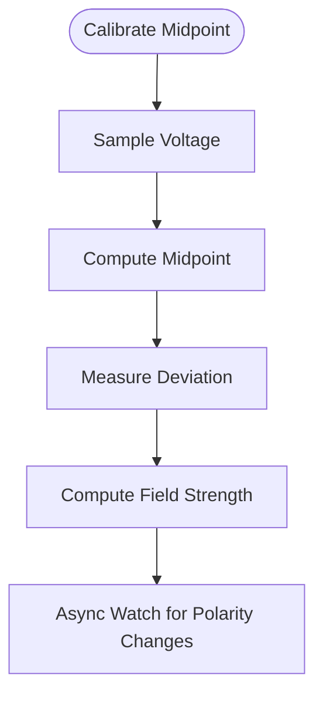

**Diagram sources**
- [oh49e.py](file://src/lib/sensors/oh49e.py)
- [sensors_example.py:306-358](file://src/main/examples/sensors_example.py#L306-L358)

**Section sources**
- [oh49e.py](file://src/lib/sensors/oh49e.py)
- [sensors_example.py:306-358](file://src/main/examples/sensors_example.py#L306-L358)
- [README.md:807-840](file://src/lib/sensors/README.md#L807-L840)

### PZEM Energy Monitors (v1/v2 and v3 Modbus RTU)
- Pattern: UART-based AC energy metering; v3 supports Modbus RTU for richer telemetry.
- Calibration: Not applicable; device-configurable parameters.
- Data Processing: Voltage, current, power, energy, frequency, power factor, alarms.
- Integration: Async monitoring with periodic callbacks; alarm thresholding.

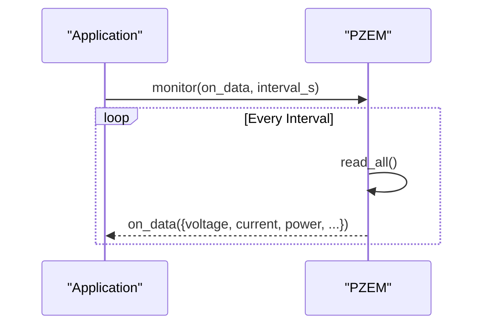

**Diagram sources**
- [pzem004t.py](file://src/lib/sensors/pzem004t.py)
- [pzem004t_v3.py](file://src/lib/sensors/pzem004t_v3.py)
- [sensors_example.py:361-455](file://src/main/examples/sensors_example.py#L361-L455)

**Section sources**
- [pzem004t.py](file://src/lib/sensors/pzem004t.py)
- [pzem004t_v3.py](file://src/lib/sensors/pzem004t_v3.py)
- [sensors_example.py:361-455](file://src/main/examples/sensors_example.py#L361-L455)
- [README.md:807-840](file://src/lib/sensors/README.md#L807-L840)

### PMS5003 PM2.5 Sensor
- Pattern: UART-based PM sensor with warm-up and median filtering for stable readings.
- Calibration: Not applicable; device-specific.
- Data Processing: Multiple samples with median aggregation; optional AQI computation.
- Integration: Indoor/outdoor air quality monitoring.

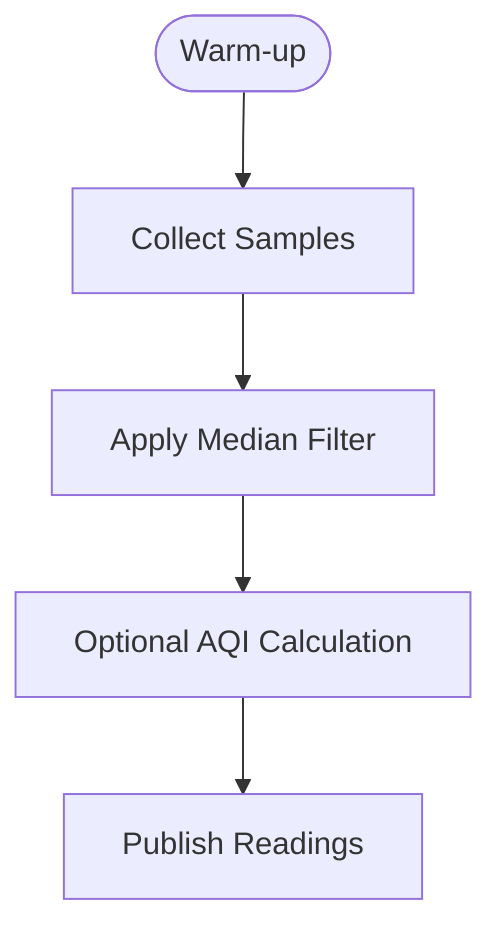

**Diagram sources**
- [pms5003.py](file://src/lib/sensors/pms5003.py)
- [sensors_example.py:477-501](file://src/main/examples/sensors_example.py#L477-L501)

**Section sources**
- [pms5003.py](file://src/lib/sensors/pms5003.py)
- [sensors_example.py:477-501](file://src/main/examples/sensors_example.py#L477-L501)
- [README.md:807-840](file://src/lib/sensors/README.md#L807-L840)

### GPS NMEA Parser
- Pattern: UART-based NMEA sentence parsing for position and timing.
- Calibration: Not applicable.
- Data Processing: Extracts latitude/longitude, speed, course, fix quality, and UTC time.
- Integration: Navigation, geofencing, and timestamp synchronization.

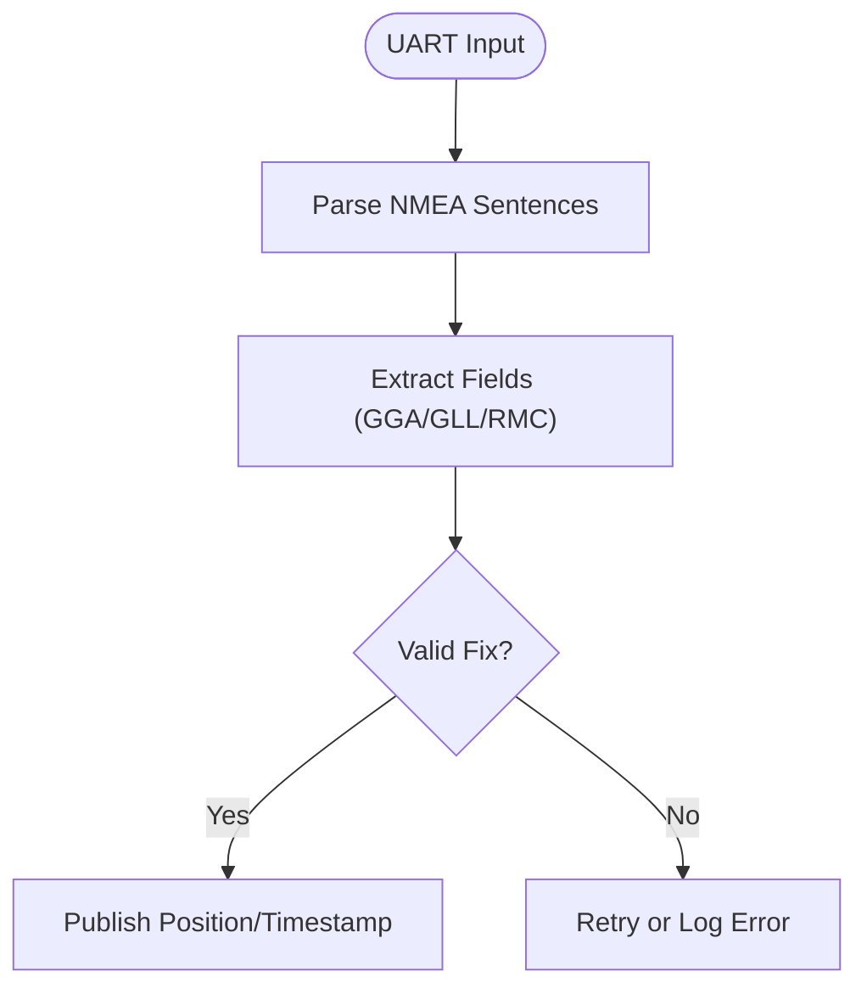

**Diagram sources**
- [gps_nmea.py](file://src/lib/sensors/gps_nmea.py)
- [sensors_example.py](file://src/main/examples/sensors_example.py)

**Section sources**
- [gps_nmea.py](file://src/lib/sensors/gps_nmea.py)
- [sensors_example.py](file://src/main/examples/sensors_example.py)

### MAX30102 Pulse Oximeter
- Pattern: I2C-based optical sensor; reads red/IR FIFO samples for heart rate and SpO2.
- Calibration: Not applicable; requires finger placement.
- Data Processing: Finger detection, FIFO sampling, peak detection for BPM.
- Integration: Health monitoring and wellness applications.

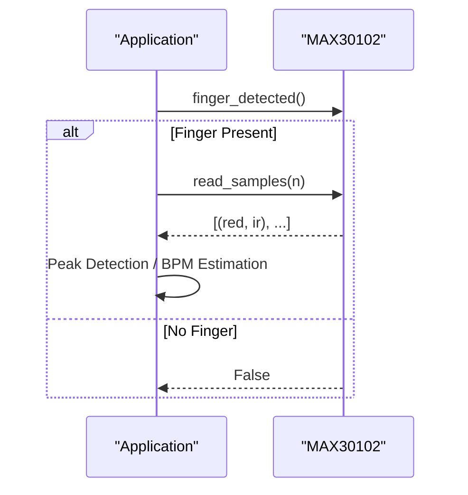

**Diagram sources**
- [max30102.py](file://src/lib/sensors/max30102.py)
- [sensors_example.py:138-155](file://src/main/examples/sensors_example.py#L138-L155)

**Section sources**
- [max30102.py](file://src/lib/sensors/max30102.py)
- [sensors_example.py:138-155](file://src/main/examples/sensors_example.py#L138-L155)
- [README.md:543-625](file://src/lib/sensors/README.md#L543-L625)

### Battery Monitor
- Pattern: ADC-based or I2C-based battery monitoring (voltage, charge state).
- Calibration: Voltage divider or IC-specific calibration.
- Data Processing: Voltage scaling, capacity estimation, low-battery alerts.
- Integration: Power management and autonomous operation.

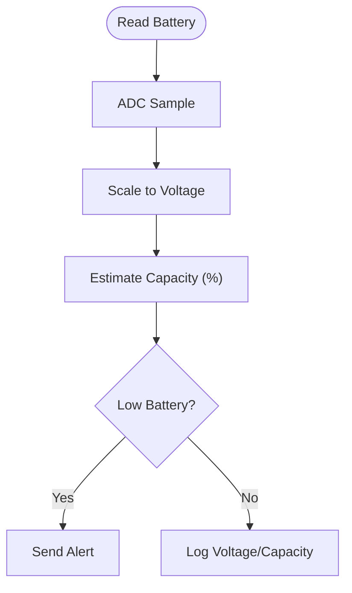

**Diagram sources**
- [battery_monitor.py](file://src/lib/sensors/battery_monitor.py)
- [sensors_example.py](file://src/main/examples/sensors_example.py)

**Section sources**
- [battery_monitor.py](file://src/lib/sensors/battery_monitor.py)
- [sensors_example.py](file://src/main/examples/sensors_example.py)

## Dependency Analysis
Drivers depend on ESP32 MicroPython hardware abstractions:
- I2C: machine.I2C and device registers for BMP280, INA219, MAX30102, MPU6050.
- UART: UART bus for PZEM and GPS; Modbus RTU for PZEM v3.
- ADC: machine.ADC for LDR, Soil Moisture, OH49E, MQ series.
- 1-Wire: onewire and ds18x20 for DS18B20.
- GPIO: digital pins for PIR, RCWL-0516, HCSR04 trigger/echo.

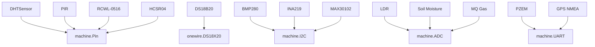

**Diagram sources**
- [dht.py:33-39](file://src/lib/sensors/dht.py#L33-L39)
- [ds18x20.py:34-35](file://src/lib/sensors/ds18x20.py#L34-L35)
- [bmp280.py:66-67](file://src/lib/sensors/bmp280.py#L66-L67)
- [ina219.py](file://src/lib/sensors/ina219.py)
- [max30102.py](file://src/lib/sensors/max30102.py)
- [pir.py](file://src/lib/sensors/pir.py)
- [rcwl0516.py](file://src/lib/sensors/rcwl0516.py)
- [ldr.py](file://src/lib/sensors/ldr.py)
- [soil.py](file://src/lib/sensors/soil.py)
- [mq_gas.py](file://src/lib/sensors/mq_gas.py)
- [pzem004t.py](file://src/lib/sensors/pzem004t.py)
- [gps_nmea.py](file://src/lib/sensors/gps_nmea.py)
- [hcsr04.py](file://src/lib/sensors/hcsr04.py)

**Section sources**
- [__init__.py:1-27](file://src/lib/sensors/__init__.py#L1-L27)

## Performance Considerations
- I2C Bus Sharing: Initialize a single I2C object and pass it to multiple drivers to avoid conflicts and reduce overhead.
- Oversampling and Averaging: Use built-in averaging and median filters (e.g., HCSR04 median, OH49E average) to reduce noise.
- Timing and Delays: Respect sensor-specific conversion delays (e.g., DS18B20 750 ms) to prevent timeouts.
- Async Monitoring: Prefer async monitor/watch patterns for continuous data collection without blocking the main loop.
- Storage Integration: Batch writes to storage to minimize flash wear; apply exponential backoff on failures.

[No sources needed since this section provides general guidance]

## Troubleshooting Guide
- DHT Read Failures: Verify pull-up resistor and wiring; catch exceptions and retry with backoff.
- BMP280 No Data: Confirm I2C address and wiring; check chip ID detection; ensure proper configuration.
- DS18B20 No Devices: Check 4.7kΩ pull-up resistor; verify ROM scanning; ensure multiple sensors are properly wired in parallel.
- PIR/RCWL-0516 False Positives: Increase warm-up and hold times; adjust detection thresholds; shield from interference.
- LDR/Soil Noise: Apply averaging over multiple samples; use appropriate ADC reference and filtering.
- MQ Sensor Drift: Re-calibrate R0 periodically; ensure adequate ventilation during calibration.
- INA219 Overflow: Reduce max current or shunt resistance; verify load configuration.
- PZEM Communication: Verify UART wiring and baud rates; for v3, confirm Modbus slave address and register mapping.
- GPS Fix Issues: Ensure antenna placement and unobstructed sky; validate NMEA sentence parsing.

**Section sources**
- [dht.py:47-54](file://src/lib/sensors/dht.py#L47-L54)
- [bmp280.py:170-172](file://src/lib/sensors/bmp280.py#L170-L172)
- [ds18x20.py:43-44](file://src/lib/sensors/ds18x20.py#L43-L44)
- [hcsr04.py](file://src/lib/sensors/hcsr04.py)
- [ldr.py](file://src/lib/sensors/ldr.py)
- [soil.py](file://src/lib/sensors/soil.py)
- [mq_gas.py](file://src/lib/sensors/mq_gas.py)
- [ina219.py](file://src/lib/sensors/ina219.py)
- [pzem004t.py](file://src/lib/sensors/pzem004t.py)
- [pzem004t_v3.py](file://src/lib/sensors/pzem004t_v3.py)
- [gps_nmea.py](file://src/lib/sensors/gps_nmea.py)

## Conclusion
The ESP32-C3 sensor ecosystem provides robust, modular drivers for a wide range of environmental, safety, and health monitoring applications. By following the documented patterns—consistent initialization, calibration where applicable, noise reduction via averaging and median filtering, and async monitoring—the system achieves reliable, efficient, and scalable sensor data collection. Integration with storage and cloud enables long-term analytics and actionable insights.

[No sources needed since this section summarizes without analyzing specific files]

## Appendices

### Practical Workflows from sensors_example.py
- DHT: Basic read and Fahrenheit conversion.
- BMP280/BME280: I2C readout and altitude calculation.
- DS18B20: Multi-device readout and indexed retrieval.
- MPU6050: Acceleration, gyroscope, and die temperature.
- HCSR04: Single and median-filtered distance measurements.
- ADS1115: Multi-channel ADC readings.
- MAX30102: Finger detection and sample reading.
- LDR: Light level, voltage, and darkness detection.
- Soil Moisture: Percent moisture and dry/wet thresholds.
- PIR: Immediate detection and async watch.
- RCWL-0516: Blocking wait and async watch with on-clear.
- MQ Gas: Ratio, PPM, and digital alarm.
- INA219: Full power metrics and overflow detection.
- OH49E: Midpoint calibration, deviation, and polarity watch.
- PZEM (v1/v2): Read-all and async monitoring.
- PZEM (v3): Modbus RTU read-all, alarm threshold, and monitor.
- PMS5003: Warm-up and median-filtered readings.
- GPS: NMEA parsing for position and time.
- MAX30102: Heart rate estimation via peak detection.
- Battery Monitor: Voltage and capacity reporting.

**Section sources**
- [sensors_example.py:31-529](file://src/main/examples/sensors_example.py#L31-L529)