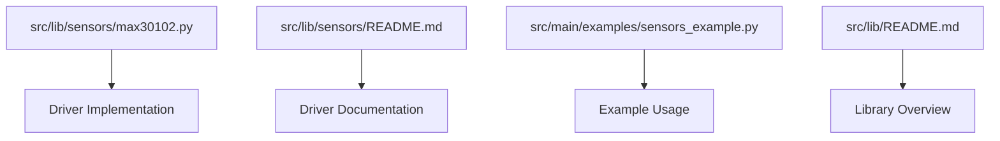
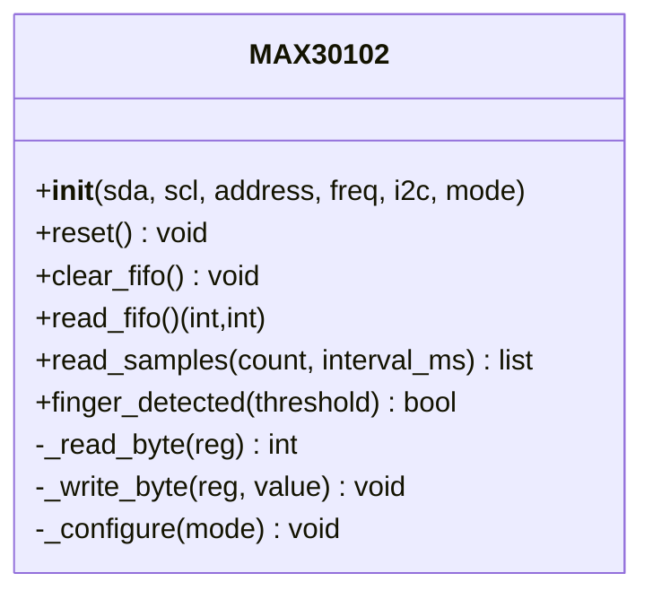
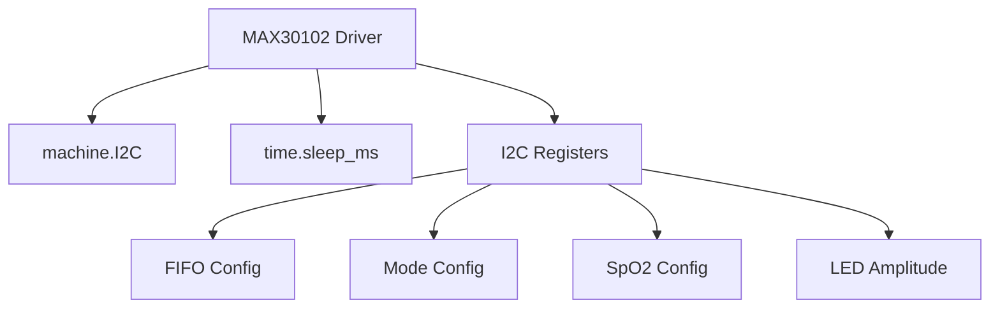

# Specialized Sensors

<cite>
**Referenced Files in This Document**
- [max30102.py](file://src/lib/sensors/max30102.py)
- [README.md](file://src/lib/sensors/README.md)
- [sensors_example.py](file://src/main/examples/sensors_example.py)
- [README.md](file://src/lib/README.md)
</cite>

## Table of Contents
1. [Introduction](#introduction)
2. [Project Structure](#project-structure)
3. [Core Components](#core-components)
4. [Architecture Overview](#architecture-overview)
5. [Detailed Component Analysis](#detailed-component-analysis)
6. [Dependency Analysis](#dependency-analysis)
7. [Performance Considerations](#performance-considerations)
8. [Troubleshooting Guide](#troubleshooting-guide)
9. [Conclusion](#conclusion)
10. [Appendices](#appendices)

## Introduction
This document focuses on the specialized sensor driver for the MAX30102 integrated optical heart rate and SpO2 sensor. It explains the driver’s initialization, configuration, and data acquisition pipeline, and provides practical guidance for pulse detection, SpO2 estimation, motion artifact handling, and integration with health monitoring systems. It also covers sensor placement, skin contact requirements, and environmental considerations that impact measurement accuracy.

## Project Structure
The MAX30102 driver resides under the sensors library and is accompanied by example usage and documentation.

**Diagram sources**
- [max30102.py:1-169](file://src/lib/sensors/max30102.py#L1-L169)
- [README.md:543-624](file://src/lib/sensors/README.md#L543-L624)
- [sensors_example.py:137-155](file://src/main/examples/sensors_example.py#L137-L155)
- [README.md:1-72](file://src/lib/README.md#L1-L72)

**Section sources**
- [max30102.py:1-169](file://src/lib/sensors/max30102.py#L1-L169)
- [README.md:543-624](file://src/lib/sensors/README.md#L543-L624)
- [sensors_example.py:137-155](file://src/main/examples/sensors_example.py#L137-L155)
- [README.md:1-72](file://src/lib/README.md#L1-L72)

## Core Components
- MAX30102 driver class encapsulates I2C communication, register configuration, FIFO data readout, and finger presence detection.
- The driver exposes methods to initialize the sensor, configure modes (HR-only or SpO2), clear FIFO buffers, read raw samples, and detect finger presence.

Key capabilities:
- I2C interface with configurable SDA/SCL and address.
- Mode selection between heart rate (HR) and SpO2 (HR + oxygen saturation).
- FIFO configuration for 100 Hz sampling and 4-sample averaging.
- LED current control via register settings for Red and IR channels.
- Finger presence detection using IR channel thresholds.

**Section sources**
- [max30102.py:56-102](file://src/lib/sensors/max30102.py#L56-L102)
- [README.md:556-582](file://src/lib/sensors/README.md#L556-L582)

## Architecture Overview
The MAX30102 driver follows a straightforward architecture:
- Initialization validates the device ID, resets the chip, and applies configuration registers.
- Data acquisition reads FIFO pointers and data registers to retrieve raw Red and IR values.
- Higher-level algorithms (not included in this driver) process the raw samples to estimate heart rate and SpO2.

**Diagram sources**
- [max30102.py:34-169](file://src/lib/sensors/max30102.py#L34-L169)

**Section sources**
- [max30102.py:34-169](file://src/lib/sensors/max30102.py#L34-L169)

## Detailed Component Analysis

### MAX30102 Driver: Initialization and Configuration
- Device identification: The driver reads the part ID register and compares it to the expected value, printing a warning if mismatched.
- Reset: Applies a reset command to the mode register and waits briefly.
- Configuration: Sets FIFO averaging, operating mode (HR or SpO2), SpO2 configuration (ADC range, sampling rate, pulse width), and LED pulse amplitudes.

Operational notes:
- Sampling rate and averaging are configured at initialization.
- LED current is controlled via dedicated registers for Red and IR channels.

**Section sources**
- [max30102.py:73-102](file://src/lib/sensors/max30102.py#L73-L102)

### FIFO Data Acquisition
- FIFO pointer registers indicate available data; if read/write pointers match, no new data is available.
- For SpO2 mode, the driver reads six bytes (two 18-bit samples) and extracts Red and IR values.
- For HR-only mode, it reads three bytes and returns only the Red value.

Error handling:
- Exceptions during read operations are caught and logged, returning None values to signal failure.

**Section sources**
- [max30102.py:117-139](file://src/lib/sensors/max30102.py#L117-L139)

### Finger Presence Detection
- Uses the IR channel value to infer finger presence.
- Threshold-based detection returns a boolean indicating whether the sensor detects sufficient IR absorption for a finger.

Practical tip:
- Adjust the threshold depending on ambient conditions and sensor placement.

**Section sources**
- [max30102.py:158-169](file://src/lib/sensors/max30102.py#L158-L169)

### Example Usage Patterns
- Basic usage demonstrates initializing the sensor in SpO2 mode, checking for finger presence, and reading a small batch of samples.
- The example prints raw Red and IR values for inspection.

Integration guidance:
- Use finger detection to gate data collection.
- Collect multiple samples to improve reliability before applying higher-level algorithms.

**Section sources**
- [sensors_example.py:137-155](file://src/main/examples/sensors_example.py#L137-L155)
- [README.md:585-595](file://src/lib/sensors/README.md#L585-L595)

### Pulse Detection and SpO2 Estimation (External Algorithms)
- The driver provides raw Red and IR samples suitable for external algorithms.
- The README includes a professional example that counts local maxima in the IR channel to estimate heart rate (BPM).
- SpO2 estimation requires additional algorithms that process the ratio of Red to IR signals; this is not implemented in the driver.

Recommended approach:
- Apply peak detection on the IR channel to estimate heart rate.
- Use bandpass filtering and baseline estimation to reduce motion artifacts.
- For SpO2, compute the ratio of AC to DC components of Red and IR signals and apply calibration curves or lookup tables.

**Section sources**
- [README.md:597-623](file://src/lib/sensors/README.md#L597-L623)

### Interrupt Handling and New Sample Availability
- The driver does not expose interrupt-driven mechanisms; it operates in polling mode.
- Applications can periodically check finger presence and read FIFO data to detect new samples.

Integration suggestion:
- Use asynchronous loops to periodically poll the sensor and trigger processing routines when new samples arrive.

**Section sources**
- [max30102.py:117-139](file://src/lib/sensors/max30102.py#L117-L139)

### Practical Examples and Health Monitoring Applications
- The example demonstrates placing a finger on the sensor and collecting a short stream of samples.
- For continuous monitoring, collect samples at regular intervals, apply filtering, and estimate heart rate and SpO2 using external algorithms.

Health monitoring integration:
- Combine with display or logging modules to visualize trends.
- Send metrics to cloud platforms via network libraries for remote monitoring.

**Section sources**
- [sensors_example.py:137-155](file://src/main/examples/sensors_example.py#L137-L155)

## Dependency Analysis
The MAX30102 driver depends on MicroPython’s I2C interface and timing utilities. It interacts with hardware registers to configure the sensor and read FIFO data.

**Diagram sources**
- [max30102.py:9-102](file://src/lib/sensors/max30102.py#L9-L102)

**Section sources**
- [max30102.py:9-102](file://src/lib/sensors/max30102.py#L9-L102)

## Performance Considerations
- Sampling rate and averaging: The driver configures 100 Hz sampling with 4-sample averaging. This balances noise reduction and latency.
- FIFO buffering: The driver clears FIFO pointers before reading to ensure fresh data.
- Motion artifacts: External algorithms should incorporate filtering and baseline estimation to mitigate motion-induced noise.
- Power and thermal effects: Ensure stable power supply and minimize thermal drift by avoiding excessive heating around the sensor.

[No sources needed since this section provides general guidance]

## Troubleshooting Guide
Common issues and remedies:
- No data available: Verify that finger is firmly placed on the sensor and that finger detection returns True.
- Incorrect part ID: Confirm wiring and supply voltage; the driver expects a specific part ID.
- Read errors: Catch exceptions during FIFO reads; ensure I2C bus integrity and correct addressing.
- Low-quality signals: Reduce motion, ensure good skin contact, and avoid ambient light interference.

**Section sources**
- [max30102.py:73-77](file://src/lib/sensors/max30102.py#L73-L77)
- [max30102.py:137-139](file://src/lib/sensors/max30102.py#L137-L139)

## Conclusion
The MAX30102 driver provides a solid foundation for acquiring raw optical sensor data via I2C. It initializes the device, configures sampling and LED current, and exposes methods to read FIFO data and detect finger presence. While the driver does not implement pulse detection or SpO2 calculation internally, it supplies the necessary raw samples for external algorithms. Proper sensor placement, motion mitigation, and environmental controls are essential for reliable measurements.

[No sources needed since this section summarizes without analyzing specific files]

## Appendices

### Sensor Placement and Environmental Factors
- Skin contact: Ensure the sensor window makes firm contact with the finger pad.
- Motion: Minimize movement to avoid motion artifacts that degrade signal quality.
- Ambient light: Shield the sensor from strong external light sources.
- Temperature: Avoid extreme temperatures that can affect sensor performance.

[No sources needed since this section provides general guidance]

### Safety and Medical Device Compliance
- Accuracy validation: Compare readings against a known reference device when feasible.
- Regulatory considerations: Consult applicable standards for wearable devices and pulse oximeters.
- Risk management: Provide warnings for abnormal readings and encourage consultation with healthcare professionals.

[No sources needed since this section provides general guidance]