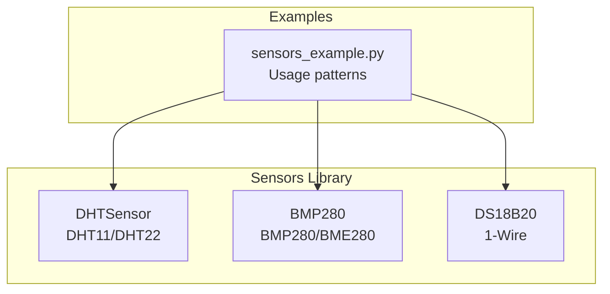
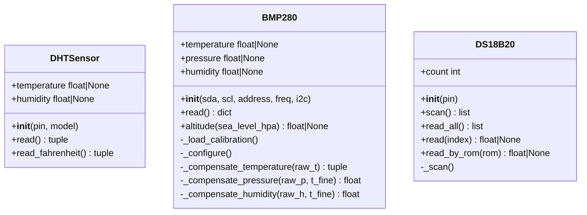
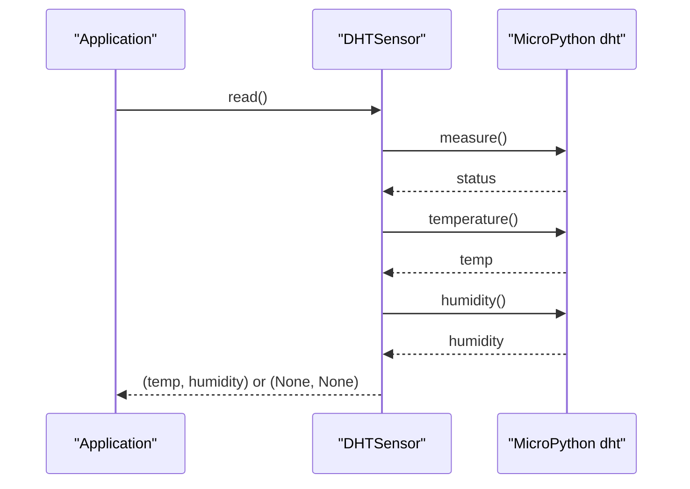
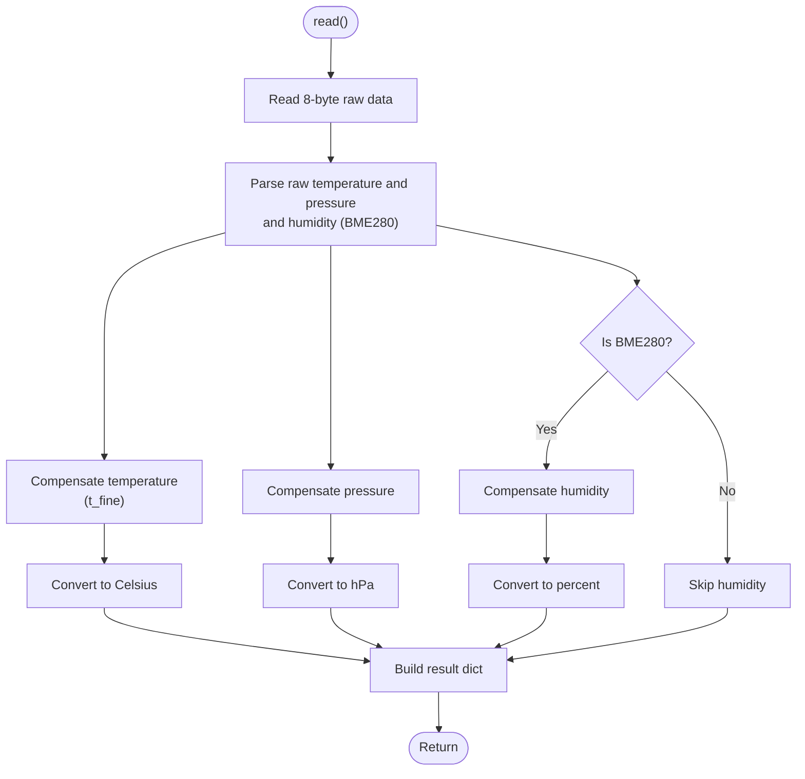
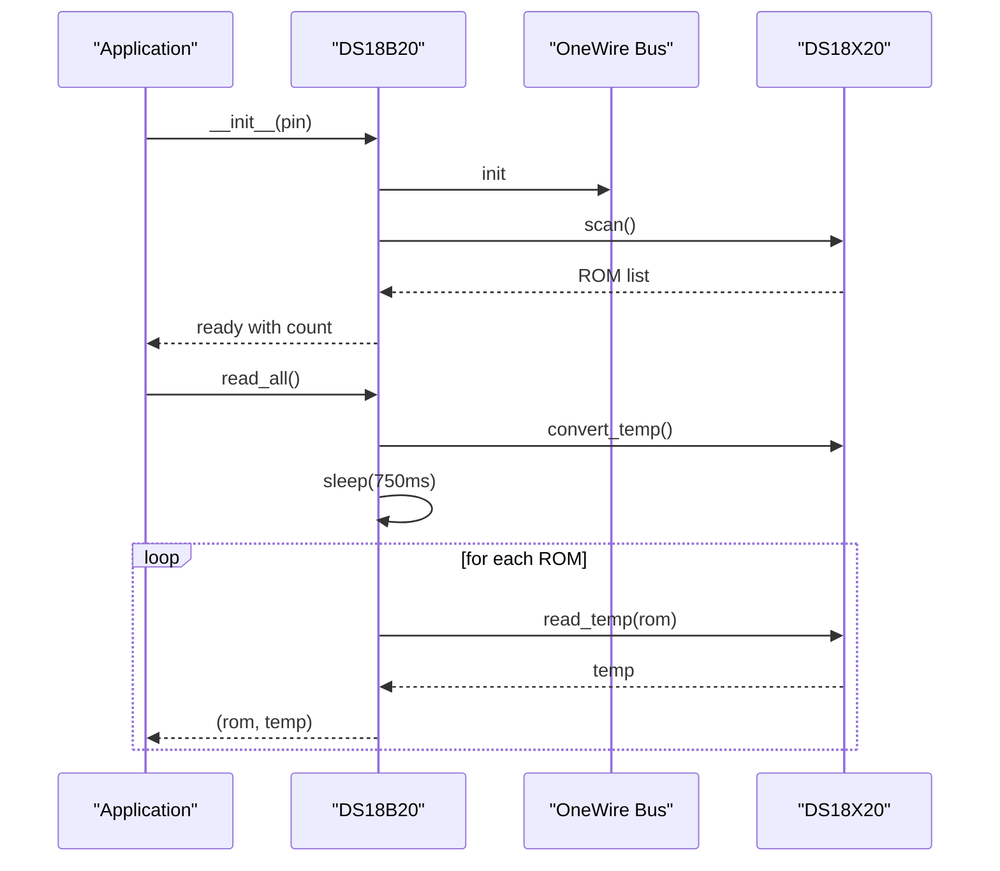
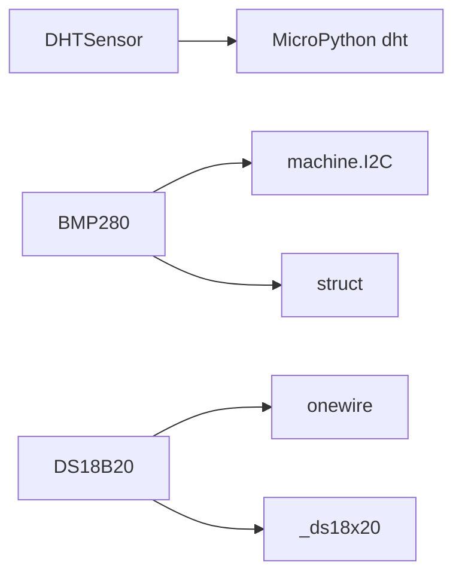

# Temperature & Humidity Sensors

<cite>
**Referenced Files in This Document**
- [dht.py](file://src/lib/sensors/dht.py)
- [bmp280.py](file://src/lib/sensors/bmp280.py)
- [ds18x20.py](file://src/lib/sensors/ds18x20.py)
- [sensors_example.py](file://src/main/examples/sensors_example.py)
- [README.md](file://src/lib/sensors/README.md)
</cite>

## Table of Contents
1. [Introduction](#introduction)
2. [Project Structure](#project-structure)
3. [Core Components](#core-components)
4. [Architecture Overview](#architecture-overview)
5. [Detailed Component Analysis](#detailed-component-analysis)
6. [Dependency Analysis](#dependency-analysis)
7. [Performance Considerations](#performance-considerations)
8. [Troubleshooting Guide](#troubleshooting-guide)
9. [Conclusion](#conclusion)

## Introduction
This document provides comprehensive guidance for temperature and humidity sensor drivers in the repository, focusing on:
- DHT sensor family (DHT11/DHT22) with timing and checksum validation
- BMP280/BME280 sensors with I2C communication, calibration, and compensation algorithms
- DS18B20 1-Wire temperature sensors including parasite power mode, resolution, and multi-device addressing
It includes practical examples, driver patterns, polling intervals, accuracy optimization, and solutions for common issues such as timeouts and invalid readings.

## Project Structure
The temperature and humidity sensor drivers are located under src/lib/sensors/. Example usage is demonstrated in src/main/examples/sensors_example.py. The README provides detailed wiring, constructor parameters, methods, and usage patterns.

**Diagram sources**
- [dht.py:11-78](file://src/lib/sensors/dht.py#L11-L78)
- [bmp280.py:36-204](file://src/lib/sensors/bmp280.py#L36-L204)
- [ds18x20.py:15-107](file://src/lib/sensors/ds18x20.py#L15-L107)
- [sensors_example.py:30-86](file://src/main/examples/sensors_example.py#L30-L86)

**Section sources**
- [README.md:1-2063](file://src/lib/sensors/README.md#L1-L2063)
- [sensors_example.py:30-86](file://src/main/examples/sensors_example.py#L30-L86)

## Core Components
- DHTSensor: Supports DHT11 and DHT22 via MicroPython’s built-in dht module. Provides read(), temperature, humidity, and read_fahrenheit().
- BMP280: Supports BMP280 and BME280 via I2C. Handles chip ID detection, calibration loading, configuration, compensation algorithms, and altitude calculation.
- DS18B20: Supports 1-Wire devices including parasite power mode. Provides scanning, multi-device addressing, and temperature reads.

Key capabilities and units:
- DHT: temperature in Celsius, humidity in percent; optional Fahrenheit conversion
- BMP280/BME280: temperature in Celsius, pressure in hectopascals, humidity in percent (BME280 only)
- DS18B20: temperature in Celsius per device

**Section sources**
- [dht.py:11-78](file://src/lib/sensors/dht.py#L11-L78)
- [bmp280.py:36-204](file://src/lib/sensors/bmp280.py#L36-L204)
- [ds18x20.py:15-107](file://src/lib/sensors/ds18x20.py#L15-L107)
- [README.md:45-280](file://src/lib/sensors/README.md#L45-L280)

## Architecture Overview
The drivers encapsulate sensor-specific protocols and expose a unified interface:
- DHTSensor wraps the MicroPython dht driver and exposes temperature/humidity properties
- BMP280 initializes I2C, detects chip type, loads calibration, configures oversampling, and performs compensation
- DS18B20 manages 1-Wire bus, scans ROM addresses, and reads temperatures with parasite power support

**Diagram sources**
- [dht.py:11-78](file://src/lib/sensors/dht.py#L11-L78)
- [bmp280.py:36-204](file://src/lib/sensors/bmp280.py#L36-L204)
- [ds18x20.py:15-107](file://src/lib/sensors/ds18x20.py#L15-L107)

## Detailed Component Analysis

### DHT Sensor Implementation (DHT11/DHT22)
- Interface: 1-Wire GPIO
- Wiring: VCC to 3.3V or 5V, GND, DATA with pull-up resistor
- Operation:
  - Initializes a dht sensor instance based on model selection
  - measure() triggers acquisition; temperature() and humidity() extract values
  - read_fahrenheit() converts Celsius to Fahrenheit
- Timing and validation:
  - Uses the underlying MicroPython dht driver which enforces timing and checksum validation
  - Returns None on failure and logs errors
- Practical usage:
  - See example usage in sensors_example.py for basic read and Fahrenheit conversion

**Diagram sources**
- [dht.py:41-54](file://src/lib/sensors/dht.py#L41-L54)
- [sensors_example.py:31-46](file://src/main/examples/sensors_example.py#L31-L46)

**Section sources**
- [dht.py:11-78](file://src/lib/sensors/dht.py#L11-L78)
- [README.md:45-127](file://src/lib/sensors/README.md#L45-L127)
- [sensors_example.py:30-47](file://src/main/examples/sensors_example.py#L30-L47)

### BMP280/BME280 Sensor Driver
- Interface: I2C
- Wiring: VCC to 3.3V, GND, SDA/SCL, SDO to GND or VCC for address selection
- Initialization:
  - Detects chip ID to distinguish BMP280 vs BME280
  - Loads calibration coefficients from OTP memory
  - Configures oversampling and normal mode
- Compensation:
  - Temperature compensation using t_fine
  - Pressure compensation using t_fine and calibration parameters
  - Optional humidity compensation (BME280 only)
- Altitude calculation:
  - Computes altitude from sea level pressure using barometric formula
- Practical usage:
  - Example shows I2C wiring and reading temperature, pressure, and optional humidity; altitude calculation

**Diagram sources**
- [bmp280.py:147-172](file://src/lib/sensors/bmp280.py#L147-L172)
- [bmp280.py:112-143](file://src/lib/sensors/bmp280.py#L112-L143)

**Section sources**
- [bmp280.py:36-204](file://src/lib/sensors/bmp280.py#L36-L204)
- [README.md:131-209](file://src/lib/sensors/README.md#L131-L209)
- [sensors_example.py:49-66](file://src/main/examples/sensors_example.py#L49-L66)

### DS18B20 1-Wire Temperature Sensors
- Interface: 1-Wire with pull-up resistor
- Wiring: VCC to 3.3V, GND, DATA with 4.7kΩ pull-up
- Features:
  - Parasite power mode supported (pull low to power device)
  - Multi-device addressing via ROM scanning
  - Resolution settings managed by the underlying ds library
- Operation:
  - Scans bus to discover devices
  - Converts temperature and reads per-device values
  - Supports reading by ROM address for reliable identification
- Practical usage:
  - Example demonstrates counting devices, reading all, and reading a specific index

**Diagram sources**
- [ds18x20.py:30-91](file://src/lib/sensors/ds18x20.py#L30-L91)
- [sensors_example.py:68-86](file://src/main/examples/sensors_example.py#L68-L86)

**Section sources**
- [ds18x20.py:15-107](file://src/lib/sensors/ds18x20.py#L15-L107)
- [README.md:211-280](file://src/lib/sensors/README.md#L211-L280)
- [sensors_example.py:68-86](file://src/main/examples/sensors_example.py#L68-L86)

## Dependency Analysis
- DHTSensor depends on MicroPython’s dht module for timing and checksum validation
- BMP280 depends on machine.I2C and struct for register access and calibration parsing
- DS18B20 depends on onewire and ds18x20 libraries for 1-Wire communication and ROM addressing

**Diagram sources**
- [dht.py:7-8](file://src/lib/sensors/dht.py#L7-L8)
- [bmp280.py:10-11](file://src/lib/sensors/bmp280.py#L10-L11)
- [ds18x20.py:9-12](file://src/lib/sensors/ds18x20.py#L9-L12)

**Section sources**
- [dht.py:7-8](file://src/lib/sensors/dht.py#L7-L8)
- [bmp280.py:10-11](file://src/lib/sensors/bmp280.py#L10-L11)
- [ds18x20.py:9-12](file://src/lib/sensors/ds18x20.py#L9-L12)

## Performance Considerations
- DHT:
  - Retry loops and asynchronous scheduling recommended for robustness
  - Example patterns show retry attempts and async logging
- BMP280/BME280:
  - Oversampling settings balance accuracy and power; default configured in driver
  - I2C frequency set to 400 kHz; ensure bus integrity for reliable reads
- DS18B20:
  - Conversion delay accounts for 12-bit resolution timing
  - Parasite power mode reduces wiring but requires careful timing

[No sources needed since this section provides general guidance]

## Troubleshooting Guide
Common issues and remedies:
- DHT timeouts/invalid readings:
  - Verify wiring and pull-up resistor
  - Implement retry logic and handle None returns gracefully
  - Use read_fahrenheit() for cross-unit verification
- BMP280/BME280 invalid values:
  - Confirm I2C address and wiring
  - Ensure chip ID detection succeeded and calibration loaded
  - Check altitude calculation inputs (sea level pressure)
- DS18B20 no devices found:
  - Confirm pull-up resistor and 1-Wire bus integrity
  - Use scan() to re-discover devices and read_by_rom() for reliable addressing
- Parasite power mode:
  - Ensure proper bus control for powering devices during conversion

**Section sources**
- [README.md:45-280](file://src/lib/sensors/README.md#L45-L280)
- [sensors_example.py:30-86](file://src/main/examples/sensors_example.py#L30-L86)

## Conclusion
The repository provides robust drivers for DHT, BMP280/BME280, and DS18B20 sensors with clear interfaces and practical examples. By following the documented wiring, initialization, and usage patterns, developers can achieve accurate temperature and humidity measurements with appropriate error handling and optimization strategies.