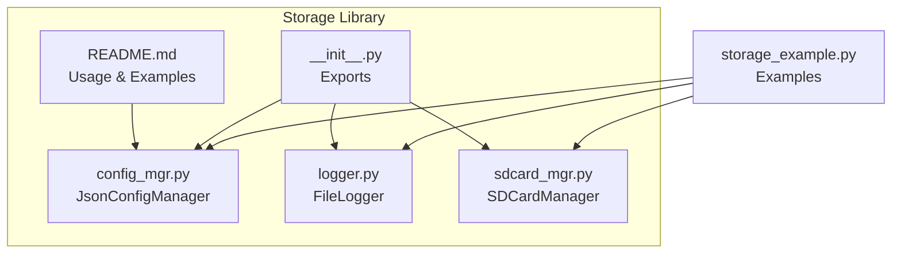
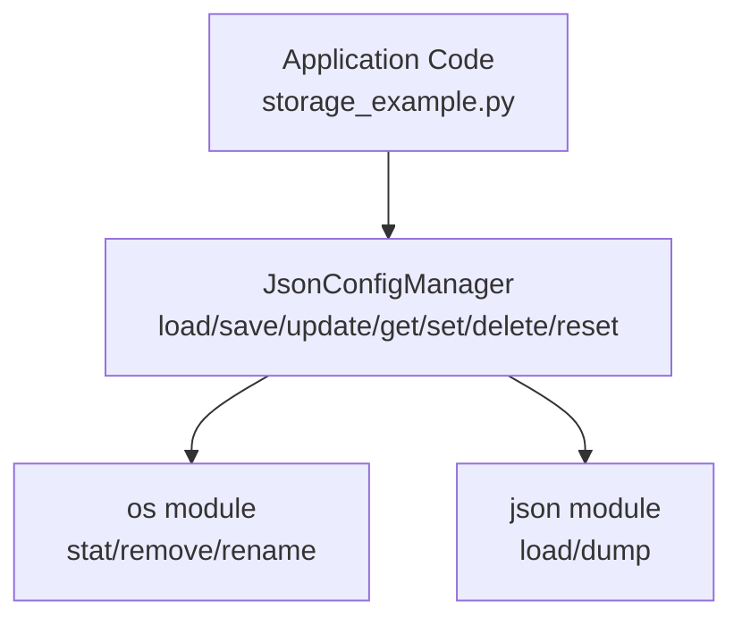
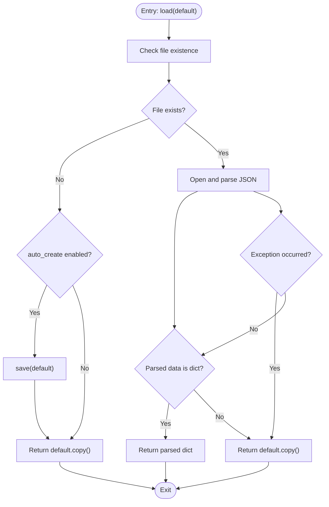
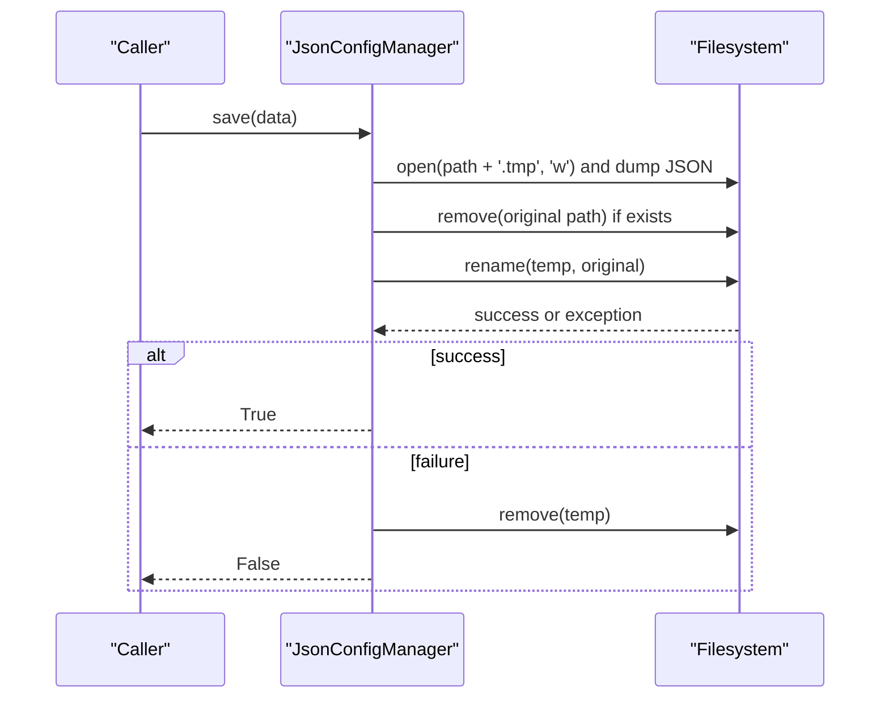
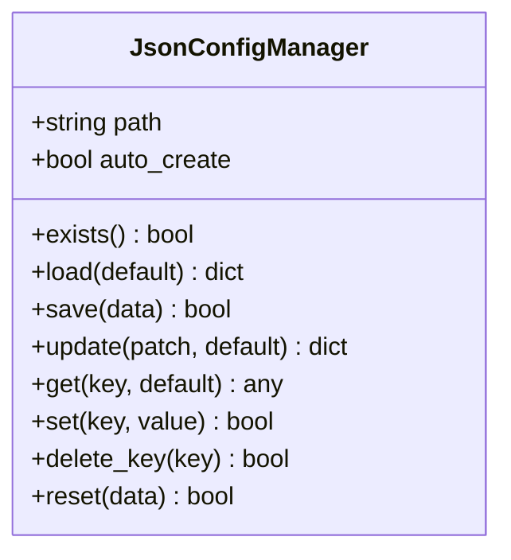
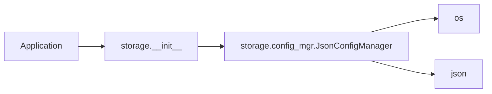

# Configuration Management

<cite>
**Referenced Files in This Document**
- [config_mgr.py](file://src/lib/storage/config_mgr.py)
- [README.md](file://src/lib/storage/README.md)
- [storage_example.py](file://src/main/examples/storage_example.py)
- [__init__.py](file://src/lib/storage/__init__.py)
- [logger.py](file://src/lib/storage/logger.py)
- [sdcard_mgr.py](file://src/lib/storage/sdcard_mgr.py)
- [device.cfg](file://src/device.cfg)
</cite>

## Table of Contents
1. [Introduction](#introduction)
2. [Project Structure](#project-structure)
3. [Core Components](#core-components)
4. [Architecture Overview](#architecture-overview)
5. [Detailed Component Analysis](#detailed-component-analysis)
6. [Dependency Analysis](#dependency-analysis)
7. [Performance Considerations](#performance-considerations)
8. [Troubleshooting Guide](#troubleshooting-guide)
9. [Conclusion](#conclusion)
10. [Appendices](#appendices)

## Introduction
This document explains the configuration management system centered on JsonConfigManager, focusing on persistent storage mechanisms, safe write operations, configuration updates, and practical usage patterns. It covers file existence checks, JSON loading with default fallbacks, atomic writes via temporary files, dictionary patching, key-value operations, configuration reset, and migration/validation strategies. Practical examples from storage_example.py demonstrate persistence patterns, migration scenarios, and validation procedures. Guidance is included for configuration file formats, data type handling, and best practices tailored to embedded environments.

## Project Structure
The configuration management capability resides in the storage library under src/lib/storage. The primary module is JsonConfigManager, supported by convenience imports and examples.

**Diagram sources**
- [config_mgr.py:1-85](file://src/lib/storage/config_mgr.py#L1-L85)
- [README.md:1-322](file://src/lib/storage/README.md#L1-L322)
- [storage_example.py:1-63](file://src/main/examples/storage_example.py#L1-L63)
- [__init__.py:1-11](file://src/lib/storage/__init__.py#L1-L11)
- [logger.py:1-90](file://src/lib/storage/logger.py#L1-L90)
- [sdcard_mgr.py:1-129](file://src/lib/storage/sdcard_mgr.py#L1-L129)

**Section sources**
- [config_mgr.py:1-85](file://src/lib/storage/config_mgr.py#L1-L85)
- [README.md:1-322](file://src/lib/storage/README.md#L1-L322)
- [storage_example.py:1-63](file://src/main/examples/storage_example.py#L1-L63)
- [__init__.py:1-11](file://src/lib/storage/__init__.py#L1-L11)

## Core Components
- JsonConfigManager: Provides JSON-backed configuration with load/save/update/get/set/delete/reset operations, file existence checks, and atomic write semantics using a temporary file strategy.
- FileLogger: Complementary logging utility for diagnostics and runtime logs.
- SDCardManager: Optional SD card interface for external storage scenarios.

Key capabilities:
- Persistent JSON storage with default fallbacks and auto-create behavior.
- Safe write operations using a temporary file followed by atomic rename.
- Dictionary-based update and key-value manipulation APIs.
- Reset functionality to restore defaults.
- Migration and validation patterns via versioned configurations.

**Section sources**
- [config_mgr.py:10-85](file://src/lib/storage/config_mgr.py#L10-L85)
- [README.md:28-113](file://src/lib/storage/README.md#L28-L113)
- [storage_example.py:10-20](file://src/main/examples/storage_example.py#L10-L20)
- [logger.py:10-90](file://src/lib/storage/logger.py#L10-L90)
- [sdcard_mgr.py:11-129](file://src/lib/storage/sdcard_mgr.py#L11-L129)

## Architecture Overview
The configuration system centers on JsonConfigManager, which encapsulates file I/O, JSON serialization/deserialization, and safety mechanisms. It integrates with the broader storage ecosystem for logging and optional SD card operations.

**Diagram sources**
- [config_mgr.py:6-8](file://src/lib/storage/config_mgr.py#L6-L8)
- [storage_example.py:10-20](file://src/main/examples/storage_example.py#L10-L20)

## Detailed Component Analysis

### JsonConfigManager: Load and Existence Checking
- exists(): Uses os.stat to detect file presence, returning a boolean.
- load(default): Returns default copy if file absent and auto_create is enabled; otherwise attempts to parse JSON and validates type. On failure, returns default.copy() and prints a warning.

Operational flow for load():

**Diagram sources**
- [config_mgr.py:19-42](file://src/lib/storage/config_mgr.py#L19-L42)

**Section sources**
- [config_mgr.py:19-42](file://src/lib/storage/config_mgr.py#L19-L42)

### JsonConfigManager: Safe Save and Atomic Write
- save(data): Writes JSON to a temporary file, removes the original if present, renames the temp file atomically to replace the target, and handles cleanup on errors.

Atomic write sequence:

Safety benefits:
- Temporary file prevents partial writes from replacing the live configuration.
- Atomic rename ensures either the old or new configuration is visible after interruption.
- Error handling cleans up temporary files.

**Diagram sources**
- [config_mgr.py:44-61](file://src/lib/storage/config_mgr.py#L44-L61)

**Section sources**
- [config_mgr.py:44-61](file://src/lib/storage/config_mgr.py#L44-L61)

### JsonConfigManager: Update, Get, Set, Delete, Reset
- update(patch, default): Loads current config, merges patch, saves, and returns the updated dictionary.
- get(key, default): Loads config and retrieves a value with a default fallback.
- set(key, value): Loads config, sets a key, saves, and returns success.
- delete_key(key): Loads config, deletes a key if present, saves, and returns success.
- reset(data): Saves an empty or provided dictionary as the new configuration.

**Diagram sources**
- [config_mgr.py:10-85](file://src/lib/storage/config_mgr.py#L10-L85)

**Section sources**
- [config_mgr.py:63-85](file://src/lib/storage/config_mgr.py#L63-L85)

### Practical Examples: Persistence Patterns, Migration, Validation
- Basic persistence and update: Demonstrates creating a configuration with defaults, loading, updating a single field, and retrieving the updated value.
- Versioned configuration and migration: Shows a version field and conditional migration steps to upgrade older configurations to newer schemas.

Example references:
- Basic usage and update: [storage_example.py:10-20](file://src/main/examples/storage_example.py#L10-L20)
- Versioned config and migration pattern: [README.md:92-112](file://src/lib/storage/README.md#L92-L112)

Validation procedures:
- Verify file existence before operations using exists().
- Validate loaded data type using load() behavior (returns dict or default.copy()).

**Section sources**
- [storage_example.py:10-20](file://src/main/examples/storage_example.py#L10-L20)
- [README.md:92-112](file://src/lib/storage/README.md#L92-L112)
- [config_mgr.py:19-42](file://src/lib/storage/config_mgr.py#L19-L42)

### Configuration File Formats and Data Types
- File format: JSON stored on the device filesystem.
- Data type handling: load() expects a dictionary; non-dict JSON or exceptions trigger default fallback.
- Supported primitives: strings, numbers, booleans, lists, and nested objects suitable for JSON serialization.

Best practices:
- Keep configuration compact to minimize write frequency and size.
- Use version fields to manage schema evolution.
- Prefer batch updates via update() to reduce write operations.

**Section sources**
- [config_mgr.py:26-42](file://src/lib/storage/config_mgr.py#L26-L42)
- [README.md:32-33](file://src/lib/storage/README.md#L32-L33)

## Dependency Analysis
JsonConfigManager depends on:
- os: stat, remove, rename for file operations.
- json: load and dump for JSON serialization.

Integration points:
- Application code imports JsonConfigManager from storage.config_mgr.
- Convenience exports in storage.__init__ expose JsonConfigManager, SDCardManager, and FileLogger.

**Diagram sources**
- [__init__.py:8-10](file://src/lib/storage/__init__.py#L8-L10)
- [config_mgr.py:6-8](file://src/lib/storage/config_mgr.py#L6-L8)

**Section sources**
- [__init__.py:1-11](file://src/lib/storage/__init__.py#L1-L11)
- [config_mgr.py:6-8](file://src/lib/storage/config_mgr.py#L6-L8)

## Performance Considerations
- Flash write cycles: Limit frequent writes; batch updates using update() and avoid unnecessary saves.
- JSON size: Keep configuration small to improve load/save performance on MicroPython.
- Logging overhead: Use FileLogger judiciously; flush buffers before power-off to prevent corruption.
- SD card operations: When using SDCardManager, consider mount/unmount costs and file system limitations.

[No sources needed since this section provides general guidance]

## Troubleshooting Guide
Common issues and resolutions:
- Load failures: If JSON parsing fails or data is not a dictionary, load() returns default.copy(). Verify file integrity and schema.
- Save failures: save() prints an error and cleans up the temporary file. Retry after ensuring sufficient disk space and permissions.
- Partial writes: The temporary file strategy prevents partial writes from replacing the live configuration.
- Power loss: Atomic rename minimizes risk; still flush buffers for logs and consider power-loss protection strategies.

Relevant code paths:
- Load error handling and default fallback: [config_mgr.py:40-42](file://src/lib/storage/config_mgr.py#L40-L42)
- Save error handling and cleanup: [config_mgr.py:55-61](file://src/lib/storage/config_mgr.py#L55-L61)
- Existence checks: [config_mgr.py:19-24](file://src/lib/storage/config_mgr.py#L19-L24)

**Section sources**
- [config_mgr.py:19-61](file://src/lib/storage/config_mgr.py#L19-L61)

## Conclusion
JsonConfigManager provides a robust, safe, and ergonomic configuration management solution for embedded systems. Its atomic write strategy, default fallbacks, and dictionary-centric APIs enable reliable persistence and easy maintenance. Combined with migration and validation patterns, it supports long-term evolution of device configurations. Pairing it with FileLogger and optional SDCardManager completes a practical storage toolkit for MicroPython-based devices.

[No sources needed since this section summarizes without analyzing specific files]

## Appendices

### API Reference Summary
- exists(): Detects file presence.
- load(default): Loads JSON with default fallback.
- save(data): Writes atomically via temporary file.
- update(patch, default): Applies dictionary patch and persists.
- get(key, default): Retrieves a value with fallback.
- set(key, value): Sets a value and persists.
- delete_key(key): Removes a key and persists.
- reset(data): Replaces configuration with provided or empty dict.

**Section sources**
- [config_mgr.py:19-85](file://src/lib/storage/config_mgr.py#L19-L85)
- [README.md:48-59](file://src/lib/storage/README.md#L48-L59)

### Example References
- Basic persistence and update: [storage_example.py:10-20](file://src/main/examples/storage_example.py#L10-L20)
- Versioned config and migration: [README.md:92-112](file://src/lib/storage/README.md#L92-L112)

**Section sources**
- [storage_example.py:10-20](file://src/main/examples/storage_example.py#L10-L20)
- [README.md:92-112](file://src/lib/storage/README.md#L92-L112)

### Device and Environment Notes
- Device configuration metadata is available for development context but does not impact runtime configuration behavior.
- Storage library targets MicroPython environments and provides compatibility across ESP32 variants.

**Section sources**
- [device.cfg:1-16](file://src/device.cfg#L1-L16)
- [README.md:3-4](file://src/lib/storage/README.md#L3-L4)