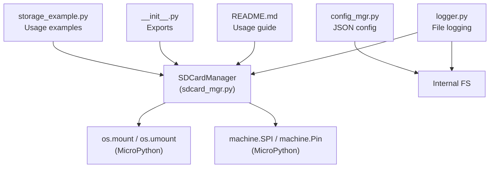
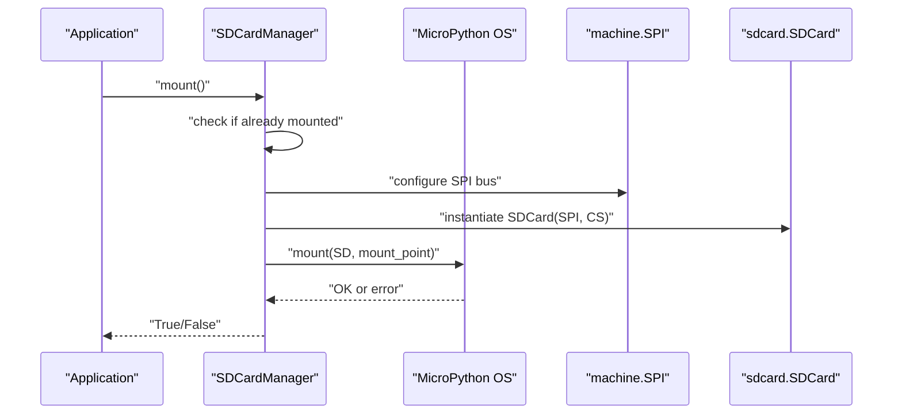
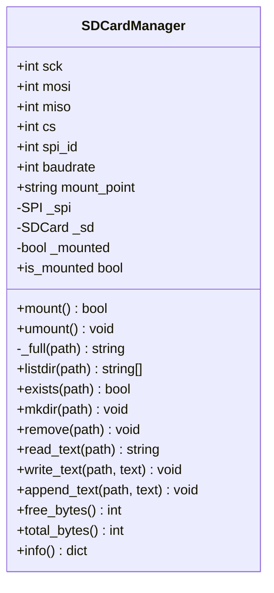
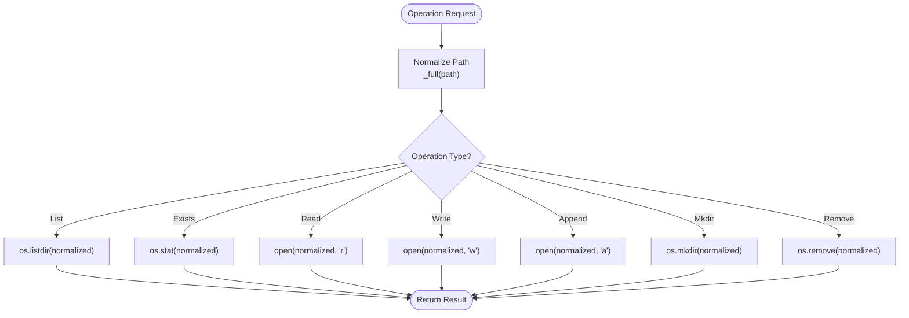
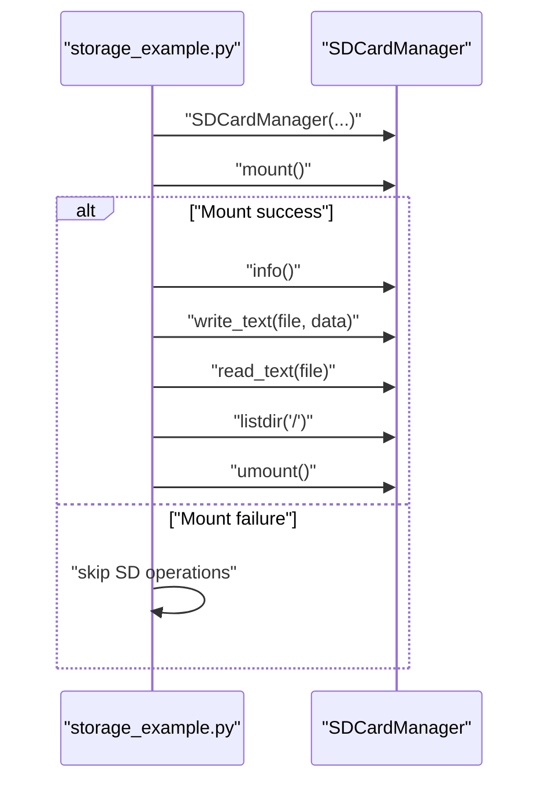
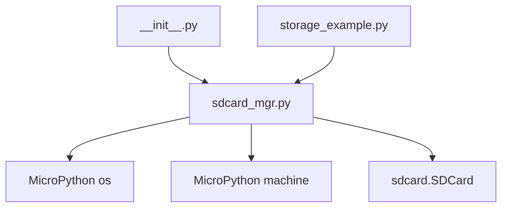

# External Storage

<cite>
**Referenced Files in This Document**
- [storage_example.py](file://src/main/examples/storage_example.py)
- [sdcard_mgr.py](file://src/lib/storage/sdcard_mgr.py)
- [__init__.py](file://src/lib/storage/__init__.py)
- [README.md](file://src/lib/storage/README.md)
- [config_mgr.py](file://src/lib/storage/config_mgr.py)
- [logger.py](file://src/lib/storage/logger.py)
- [main.py](file://src/main/main.py)
</cite>

## Table of Contents
1. [Introduction](#introduction)
2. [Project Structure](#project-structure)
3. [Core Components](#core-components)
4. [Architecture Overview](#architecture-overview)
5. [Detailed Component Analysis](#detailed-component-analysis)
6. [Dependency Analysis](#dependency-analysis)
7. [Performance Considerations](#performance-considerations)
8. [Troubleshooting Guide](#troubleshooting-guide)
9. [Conclusion](#conclusion)
10. [Appendices](#appendices)

## Introduction
This document explains how to manage external storage using SD card integration on MicroPython-based embedded devices. It covers SD card detection and initialization via SPI, mounting the FAT filesystem, performing file operations (read, write, create, delete), directory navigation, and capacity reporting. It also documents practical usage patterns shown in the example script, reliability considerations, error handling for card removal, and integration with the internal filesystem. Formatting procedures and backup/restore strategies are included to support robust embedded storage workflows.

## Project Structure
The storage subsystem resides under the storage library and includes:
- SDCardManager for SD card mounting, file operations, and capacity queries
- JsonConfigManager for configuration persistence
- FileLogger for logging to internal flash or SD card
- Example usage in the main examples module

**Diagram sources**
- [storage_example.py:32-53](file://src/main/examples/storage_example.py#L32-L53)
- [sdcard_mgr.py:35-78](file://src/lib/storage/sdcard_mgr.py#L35-L78)
- [__init__.py:8-10](file://src/lib/storage/__init__.py#L8-L10)
- [README.md:116-188](file://src/lib/storage/README.md#L116-L188)
- [config_mgr.py:10-85](file://src/lib/storage/config_mgr.py#L10-L85)
- [logger.py:10-90](file://src/lib/storage/logger.py#L10-L90)

**Section sources**
- [storage_example.py:1-63](file://src/main/examples/storage_example.py#L1-L63)
- [sdcard_mgr.py:11-129](file://src/lib/storage/sdcard_mgr.py#L11-L129)
- [__init__.py:1-11](file://src/lib/storage/__init__.py#L1-L11)
- [README.md:1-322](file://src/lib/storage/README.md#L1-L322)
- [config_mgr.py:1-85](file://src/lib/storage/config_mgr.py#L1-L85)
- [logger.py:1-90](file://src/lib/storage/logger.py#L1-L90)
- [main.py:1-84](file://src/main/main.py#L1-L84)

## Core Components
- SDCardManager: Provides SD card mounting/unmounting, SPI configuration, FAT filesystem mounting, directory listing, existence checks, file operations (text read/write/append), directory creation/deletion, and capacity reporting.
- JsonConfigManager: Manages JSON-based configuration files on the internal filesystem.
- FileLogger: Writes structured logs to internal flash or SD card with rotation and size limits.

Key capabilities:
- Mount SD card using SPI with configurable pins and baudrate
- Mount FAT filesystem at a fixed mount point
- Perform directory and file operations using standard MicroPython APIs
- Report total/free bytes via statvfs
- Unmount safely and deinitialize SPI resources

**Section sources**
- [sdcard_mgr.py:11-129](file://src/lib/storage/sdcard_mgr.py#L11-L129)
- [config_mgr.py:10-85](file://src/lib/storage/config_mgr.py#L10-L85)
- [logger.py:10-90](file://src/lib/storage/logger.py#L10-L90)
- [README.md:116-188](file://src/lib/storage/README.md#L116-L188)

## Architecture Overview
The SD card integration relies on MicroPython’s built-in SPI and filesystem modules. The SDCardManager encapsulates hardware setup and exposes a simple interface for filesystem operations.

**Diagram sources**
- [sdcard_mgr.py:35-62](file://src/lib/storage/sdcard_mgr.py#L35-L62)

## Detailed Component Analysis

### SDCardManager
Responsibilities:
- Initialize SPI bus and SD card driver
- Mount/unmount FAT filesystem
- Provide directory and file operations
- Report storage capacity

Implementation highlights:
- SPI configuration uses polarity/phase 0 and a configurable baudrate
- Uses MicroPython’s os.mount with the sdcard.SDCard instance
- Paths are normalized to absolute paths under the mount point
- Capacity reporting uses os.statvfs on the mount point

**Diagram sources**
- [sdcard_mgr.py:11-129](file://src/lib/storage/sdcard_mgr.py#L11-L129)

**Section sources**
- [sdcard_mgr.py:11-129](file://src/lib/storage/sdcard_mgr.py#L11-L129)

### File Operations and Directory Navigation
- Listing directories: listdir(path)
- Existence checks: exists(path)
- Create/remove directories: mkdir(path), remove(path)
- Text file operations: read_text(path), write_text(path, text), append_text(path, text)
- Path normalization ensures operations occur under the mount point

**Diagram sources**
- [sdcard_mgr.py:80-113](file://src/lib/storage/sdcard_mgr.py#L80-L113)

**Section sources**
- [sdcard_mgr.py:85-113](file://src/lib/storage/sdcard_mgr.py#L85-L113)

### Capacity Management and Info
- Total bytes: total_bytes()
- Free bytes: free_bytes()
- Combined info(): returns mounted status, mount point, and capacity metrics

These rely on os.statvfs on the mount point.

**Section sources**
- [sdcard_mgr.py:114-129](file://src/lib/storage/sdcard_mgr.py#L114-L129)

### Practical Usage Patterns from storage_example.py
- Basic SD card usage pattern: construct SDCardManager, mount, perform read/write/listdir, then unmount
- Conditional execution: mount returns False if SD card is not present or mounting fails

**Diagram sources**
- [storage_example.py:32-53](file://src/main/examples/storage_example.py#L32-L53)
- [sdcard_mgr.py:35-78](file://src/lib/storage/sdcard_mgr.py#L35-L78)

**Section sources**
- [storage_example.py:32-53](file://src/main/examples/storage_example.py#L32-L53)

### Integration with Internal Filesystem
- JsonConfigManager persists configuration on the internal filesystem
- FileLogger writes logs to either internal flash or SD card with rotation
- Both complement SD card usage for configuration and diagnostics

**Section sources**
- [config_mgr.py:10-85](file://src/lib/storage/config_mgr.py#L10-L85)
- [logger.py:10-90](file://src/lib/storage/logger.py#L10-L90)

## Dependency Analysis
- SDCardManager depends on:
  - MicroPython os module for mount/umount and stat/statvfs
  - MicroPython machine module for SPI and Pin configuration
  - sdcard.SDCard driver for FAT filesystem support
- Exported via storage.__init__ for convenient imports
- Example usage demonstrates typical integration patterns

**Diagram sources**
- [sdcard_mgr.py:35-62](file://src/lib/storage/sdcard_mgr.py#L35-L62)
- [__init__.py:8-10](file://src/lib/storage/__init__.py#L8-L10)
- [storage_example.py:32-53](file://src/main/examples/storage_example.py#L32-L53)

**Section sources**
- [sdcard_mgr.py:35-62](file://src/lib/storage/sdcard_mgr.py#L35-L62)
- [__init__.py:8-10](file://src/lib/storage/__init__.py#L8-L10)
- [storage_example.py:32-53](file://src/main/examples/storage_example.py#L32-L53)

## Performance Considerations
- SPI baudrate: The default is high; adjust based on cable length and noise. Lower rates reduce errors but increase transfer time.
- Batch operations: Group reads/writes to minimize filesystem overhead.
- Logging: Prefer append-only logs on SD card to avoid random writes.
- Capacity planning: Monitor free bytes before large transfers to prevent fragmentation and errors.
- Power stability: Ensure stable power during writes to prevent corruption.

[No sources needed since this section provides general guidance]

## Troubleshooting Guide
Common issues and resolutions:
- SD card not detected:
  - Verify wiring and CS pin selection; ensure CS is not conflicting with other peripherals.
  - Confirm sdcard module is available in the firmware/runtime.
- Mount failures:
  - Check filesystem format; SD cards must be formatted as FAT32.
  - Retry after power cycling the card or reseating the module.
- Write failures:
  - Ensure sufficient free space and unmounted state if switching between internal and external storage.
  - Use append mode for continuous logging to reduce metadata churn.
- Unmount warnings:
  - Ensure no open file handles; close files before unmounting.
- Reliability:
  - Avoid abrupt power-off; flush buffers and gracefully unmount.
  - Rotate logs and limit write frequency to reduce wear on SD card.

**Section sources**
- [sdcard_mgr.py:64-78](file://src/lib/storage/sdcard_mgr.py#L64-L78)
- [README.md:313-322](file://src/lib/storage/README.md#L313-L322)

## Conclusion
The storage library provides a concise, reliable interface for SD card integration on MicroPython platforms. By leveraging SPI and the built-in FAT filesystem, it supports essential operations such as mounting, directory navigation, file manipulation, and capacity monitoring. The example usage demonstrates practical patterns for reading/writing files, logging, and safe unmounting. Following the reliability and performance recommendations ensures robust operation in embedded environments.

[No sources needed since this section summarizes without analyzing specific files]

## Appendices

### SD Card Formatting and FAT Handling
- Format SD cards as FAT32 before use.
- The sdcard driver expects a valid FAT filesystem; exFAT or other formats are not supported.
- After formatting, mount the card and verify capacity reporting.

**Section sources**
- [README.md:313-322](file://src/lib/storage/README.md#L313-L322)

### Backup and Restore Strategies
- Use directory-based backups: copy directories to a backup location on SD card.
- Log rotation: employ FileLogger to maintain manageable log sizes and automatic rotation.
- Configuration backup: periodically export configuration to JSON files on SD card for restore.

**Section sources**
- [logger.py:43-67](file://src/lib/storage/logger.py#L43-L67)
- [config_mgr.py:44-61](file://src/lib/storage/config_mgr.py#L44-L61)

### Best Practices for Embedded Applications
- Always check mount status before performing operations.
- Use append mode for continuous logging to reduce metadata updates.
- Periodically check free bytes and plan storage usage accordingly.
- Gracefully unmount and deinitialize SPI when finished.
- Keep SD card modules physically stable and avoid frequent hot-plugging.

**Section sources**
- [sdcard_mgr.py:35-78](file://src/lib/storage/sdcard_mgr.py#L35-L78)
- [README.md:313-322](file://src/lib/storage/README.md#L313-L322)