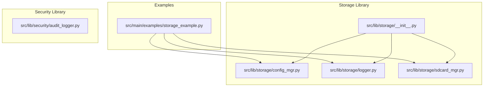
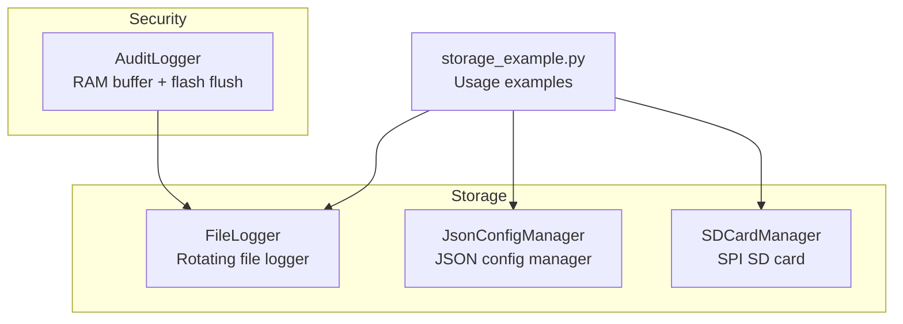
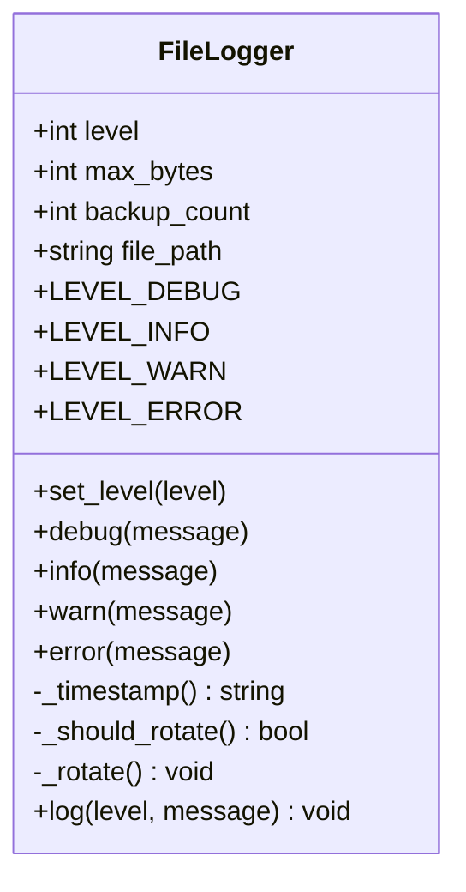
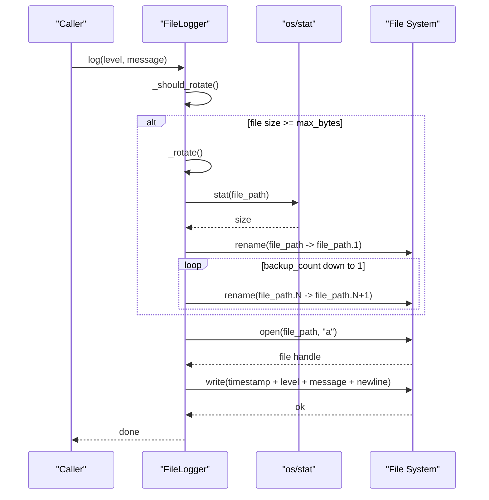
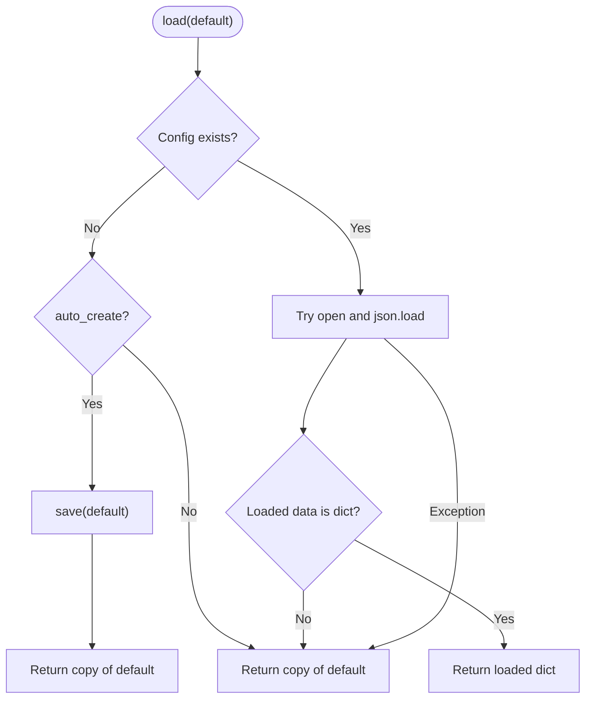
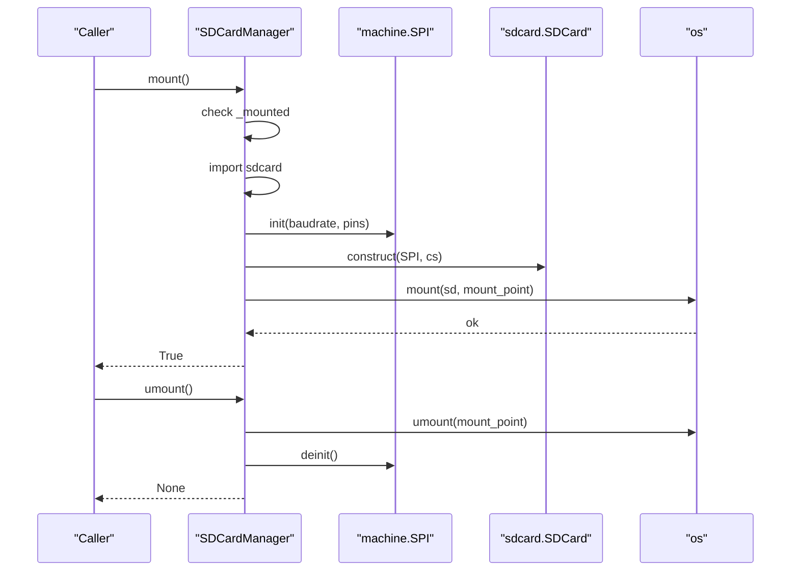
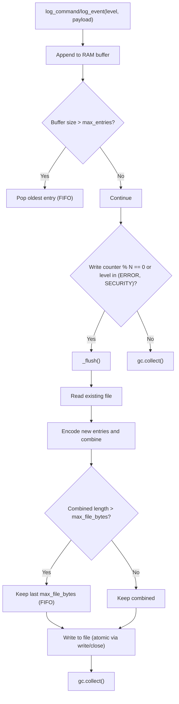
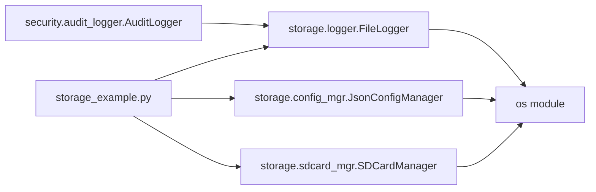

# File System Operations

<cite>
**Referenced Files in This Document**
- [storage_example.py](file://src/main/examples/storage_example.py)
- [logger.py](file://src/lib/storage/logger.py)
- [config_mgr.py](file://src/lib/storage/config_mgr.py)
- [sdcard_mgr.py](file://src/lib/storage/sdcard_mgr.py)
- [audit_logger.py](file://src/lib/security/audit_logger.py)
</cite>

## Table of Contents
1. [Introduction](#introduction)
2. [Project Structure](#project-structure)
3. [Core Components](#core-components)
4. [Architecture Overview](#architecture-overview)
5. [Detailed Component Analysis](#detailed-component-analysis)
6. [Dependency Analysis](#dependency-analysis)
7. [Performance Considerations](#performance-considerations)
8. [Troubleshooting Guide](#troubleshooting-guide)
9. [Conclusion](#conclusion)
10. [Appendices](#appendices)

## Introduction
This document explains file system operations and logging capabilities in the project, focusing on:
- File logger implementation with timestamped entries, log rotation, and file management
- Practical usage demonstrated in storage_example.py
- File operations on internal flash and external SD card
- Error handling, permissions, and disk space considerations
- Log formats, encoding, and configuration integration
- Best practices for embedded environments, including flash wear mitigation and performance optimization for frequent writes

## Project Structure
The storage and logging functionality resides under src/lib/storage and src/lib/security, with example usage in src/main/examples.

**Diagram sources**
- [storage_example.py:1-63](file://src/main/examples/storage_example.py#L1-L63)
- [logger.py:1-89](file://src/lib/storage/logger.py#L1-L89)
- [config_mgr.py:1-85](file://src/lib/storage/config_mgr.py#L1-L85)
- [sdcard_mgr.py:1-129](file://src/lib/storage/sdcard_mgr.py#L1-L129)
- [audit_logger.py:1-197](file://src/lib/security/audit_logger.py#L1-L197)
- [__init__.py:1-11](file://src/lib/storage/__init__.py#L1-L11)

**Section sources**
- [storage_example.py:1-63](file://src/main/examples/storage_example.py#L1-L63)
- [__init__.py:1-11](file://src/lib/storage/__init__.py#L1-L11)

## Core Components
- FileLogger: A rotating file logger supporting timestamped entries, configurable log level, and per-file size limits with numbered backups.
- JsonConfigManager: A JSON-backed configuration manager with atomic save semantics and safe defaults.
- SDCardManager: An SD card interface over SPI with mount/unmount, directory operations, and disk space reporting.
- AuditLogger: A specialized audit logger that buffers entries in RAM and periodically flushes to flash with FIFO constraints to reduce flash wear.

Practical usage is demonstrated in storage_example.py, which shows:
- Creating and using FileLogger with rotation
- Managing configuration via JsonConfigManager
- Interacting with SD card via SDCardManager

**Section sources**
- [logger.py:10-89](file://src/lib/storage/logger.py#L10-L89)
- [config_mgr.py:10-85](file://src/lib/storage/config_mgr.py#L10-L85)
- [sdcard_mgr.py:11-129](file://src/lib/storage/sdcard_mgr.py#L11-L129)
- [audit_logger.py:17-197](file://src/lib/security/audit_logger.py#L17-L197)
- [storage_example.py:10-62](file://src/main/examples/storage_example.py#L10-L62)

## Architecture Overview
The file system and logging architecture integrates three primary modules:
- Storage library for configuration, file logging, and SD card operations
- Security library for audit logging with RAM buffering and periodic flash flush
- Example entry point demonstrating usage patterns

**Diagram sources**
- [storage_example.py:10-62](file://src/main/examples/storage_example.py#L10-L62)
- [logger.py:10-89](file://src/lib/storage/logger.py#L10-L89)
- [config_mgr.py:10-85](file://src/lib/storage/config_mgr.py#L10-L85)
- [sdcard_mgr.py:11-129](file://src/lib/storage/sdcard_mgr.py#L11-L129)
- [audit_logger.py:17-197](file://src/lib/security/audit_logger.py#L17-L197)

## Detailed Component Analysis

### FileLogger: Rotating File Logger
FileLogger writes timestamped log entries and rotates files when size exceeds a configured limit. It supports:
- Timestamped entries with local time formatting
- Level filtering (DEBUG/INFO/WARN/ERROR)
- Size-based rotation with numbered backups
- Atomic-like rotation using rename and remove operations

Key behaviors:
- Rotation decision checks current file size against max_bytes
- Rotation renames N to N+1, removes the highest-numbered backup, and moves the main file to .1
- Writes append new lines with level-tagged messages

**Diagram sources**
- [logger.py:10-89](file://src/lib/storage/logger.py#L10-L89)

**Diagram sources**
- [logger.py:37-78](file://src/lib/storage/logger.py#L37-L78)

**Section sources**
- [logger.py:10-89](file://src/lib/storage/logger.py#L10-L89)

### JsonConfigManager: JSON Configuration Manager
JsonConfigManager provides robust configuration persistence with:
- Existence checks and safe loading with defaults
- Atomic save using a temporary file and atomic rename
- Update, get, set, delete_key, and reset operations
- Auto-create behavior controlled by constructor flag

**Diagram sources**
- [config_mgr.py:26-42](file://src/lib/storage/config_mgr.py#L26-L42)

**Section sources**
- [config_mgr.py:10-85](file://src/lib/storage/config_mgr.py#L10-L85)

### SDCardManager: SD Card Interface
SDCardManager mounts an SD card over SPI and exposes:
- Mount/umount lifecycle with error handling
- Directory listing and existence checks
- Text read/write/append operations
- Disk space queries via statvfs (free and total bytes)
- Utility to compute absolute paths from relative paths

**Diagram sources**
- [sdcard_mgr.py:35-78](file://src/lib/storage/sdcard_mgr.py#L35-L78)

**Section sources**
- [sdcard_mgr.py:11-129](file://src/lib/storage/sdcard_mgr.py#L11-L129)

### AuditLogger: RAM Buffer + Flash Flush
AuditLogger buffers entries in RAM and periodically flushes to flash to minimize flash writes:
- RAM buffer holds up to a configured number of entries (FIFO)
- Flush occurs every N writes or on specific levels (e.g., ERROR, SECURITY)
- On flush, reads existing file, appends new entries, enforces maximum file size (FIFO), and writes back atomically
- Includes suspicious command detection and optional clearing of logs

**Diagram sources**
- [audit_logger.py:76-131](file://src/lib/security/audit_logger.py#L76-L131)

**Section sources**
- [audit_logger.py:17-197](file://src/lib/security/audit_logger.py#L17-L197)

### Practical Usage Patterns from storage_example.py
- FileLogger usage demonstrates creating a rotating logger, setting levels, and writing messages at different severity levels.
- JsonConfigManager usage shows loading defaults, updating values, and retrieving keys safely.
- SDCardManager usage demonstrates mounting, writing and reading files, listing directory contents, and unmounting.

These examples illustrate real-world integration of logging, configuration, and file operations in embedded environments.

**Section sources**
- [storage_example.py:10-62](file://src/main/examples/storage_example.py#L10-L62)

## Dependency Analysis
- storage_example.py depends on storage modules exposed via storage.__init__.py
- Storage modules are cohesive around file system operations and configuration
- AuditLogger can complement FileLogger by reducing flash writes through buffering and periodic flush

**Diagram sources**
- [storage_example.py:10-62](file://src/main/examples/storage_example.py#L10-L62)
- [logger.py:6-7](file://src/lib/storage/logger.py#L6-L7)
- [config_mgr.py:6-7](file://src/lib/storage/config_mgr.py#L6-L7)
- [sdcard_mgr.py:7-8](file://src/lib/storage/sdcard_mgr.py#L7-L8)
- [audit_logger.py:1-1](file://src/lib/security/audit_logger.py#L1-L1)

**Section sources**
- [storage_example.py:10-62](file://src/main/examples/storage_example.py#L10-L62)
- [__init__.py:8-10](file://src/lib/storage/__init__.py#L8-L10)

## Performance Considerations
- Minimize flash writes:
  - Use AuditLogger’s RAM buffer with periodic flush to reduce frequent writes
  - Tune flush frequency and maximum file size to balance durability and wear
- Optimize log volume:
  - Set appropriate max_bytes and backup_count to cap disk usage
  - Filter by level to avoid unnecessary writes
- SD card performance:
  - Batch writes when possible to reduce filesystem overhead
  - Prefer append mode for continuous logging to avoid random writes
- Memory management:
  - Trigger garbage collection after flush operations to reclaim memory
- Embedded constraints:
  - Avoid excessive renaming and removing during rotation; prefer minimal file operations
  - Ensure sufficient free space before writing to prevent partial writes

[No sources needed since this section provides general guidance]

## Troubleshooting Guide
Common issues and mitigations:
- Permission and mount errors:
  - Verify SD card presence and wiring; ensure sdcard module is available
  - Check mount_point availability and permissions
- Disk space exhaustion:
  - Monitor free bytes before writing; rotate logs proactively
  - Limit max_file_bytes and backup_count to fit device capacity
- Partial writes and corruption:
  - Use atomic save patterns (temporary file + rename) for configuration
  - For logs, rely on append mode and rotation to avoid concurrent writes
- Error handling patterns:
  - Wrap file operations in try/except blocks
  - Log errors without crashing; continue operation when feasible
- Wear leveling and flash longevity:
  - Reduce write frequency using buffered flush strategies
  - Avoid frequent small writes; batch entries before flush
  - Rotate logs to distribute writes across files

**Section sources**
- [sdcard_mgr.py:35-78](file://src/lib/storage/sdcard_mgr.py#L35-L78)
- [config_mgr.py:44-61](file://src/lib/storage/config_mgr.py#L44-L61)
- [audit_logger.py:129-131](file://src/lib/security/audit_logger.py#L129-L131)

## Conclusion
The storage and logging stack provides robust primitives for embedded file system operations:
- FileLogger offers reliable, size-limited, rotating logs suitable for internal flash and SD cards
- JsonConfigManager ensures safe configuration persistence with atomic updates
- SDCardManager simplifies SD card integration with SPI and essential file operations
- AuditLogger complements these by buffering entries in RAM and flushing to flash to mitigate wear
Together, they enable scalable logging and configuration management in constrained environments.

[No sources needed since this section summarizes without analyzing specific files]

## Appendices

### Log Formats and Encoding
- FileLogger:
  - Format includes a timestamp and level tag followed by the message
  - Uses append mode for thread-safe single-writer logging
- AuditLogger:
  - Stores entries in RAM tuples and flushes UTF-8 encoded lines to flash
  - Maintains a fixed-size FIFO window on disk to prevent unbounded growth

**Section sources**
- [logger.py:75-77](file://src/lib/storage/logger.py#L75-L77)
- [audit_logger.py:112-127](file://src/lib/security/audit_logger.py#L112-L127)

### Configuration Integration
- JsonConfigManager persists configuration in JSON format
- Example usage demonstrates loading defaults, updating values, and retrieving keys
- Integrates seamlessly with application startup and runtime updates

**Section sources**
- [config_mgr.py:26-75](file://src/lib/storage/config_mgr.py#L26-L75)
- [storage_example.py:10-18](file://src/main/examples/storage_example.py#L10-L18)