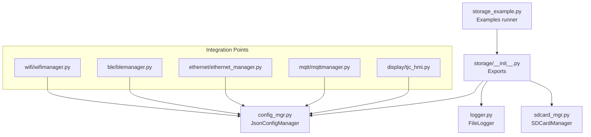
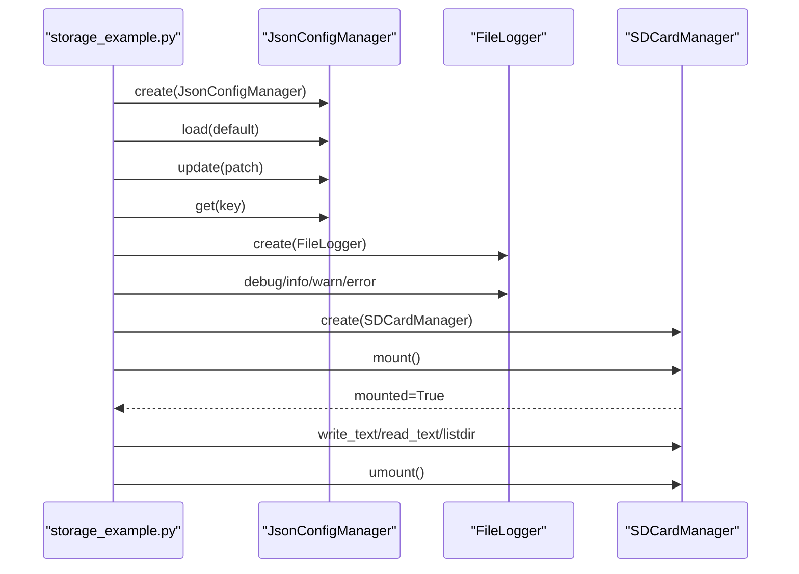
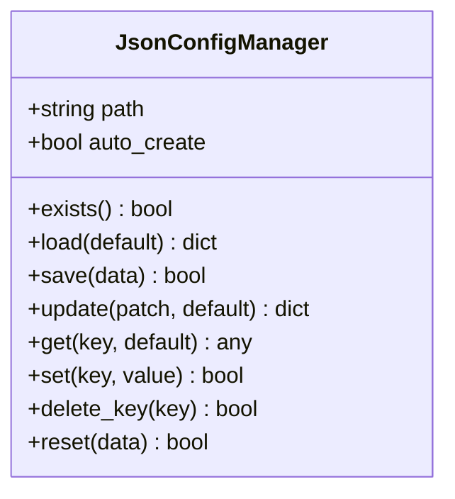
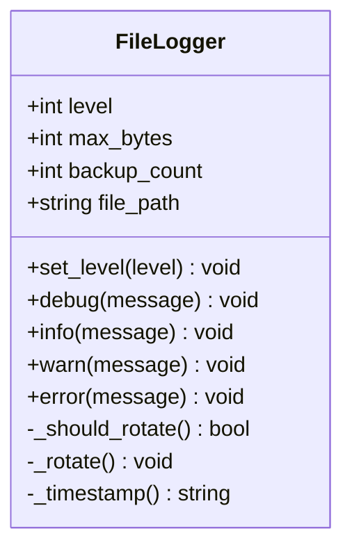
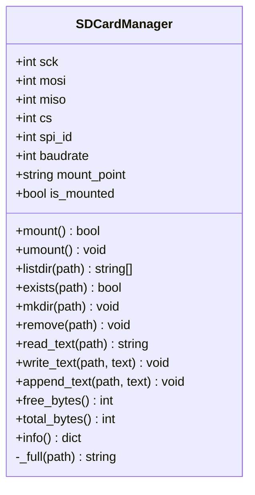
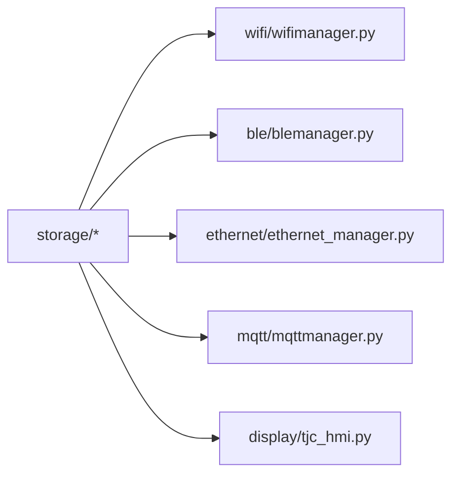

# Storage & File Management

<cite>
**Referenced Files in This Document**
- [storage_example.py](file://src/main/examples/storage_example.py)
- [config_mgr.py](file://src/lib/storage/config_mgr.py)
- [logger.py](file://src/lib/storage/logger.py)
- [sdcard_mgr.py](file://src/lib/storage/sdcard_mgr.py)
- [README.md](file://src/lib/storage/README.md)
- [__init__.py](file://src/lib/storage/__init__.py)
- [wifi_manager.py](file://src/lib/wifi/wifimanager.py)
- [ble_manager.py](file://src/lib/ble/blemanager.py)
- [ethernet_manager.py](file://src/lib/ethernet/ethernet_manager.py)
- [mqtt_manager.py](file://src/lib/mqtt/mqttmanager.py)
- [display_tjc_hmi.py](file://src/lib/display/tjc_hmi.py)
</cite>

## Table of Contents
1. [Introduction](#introduction)
2. [Project Structure](#project-structure)
3. [Core Components](#core-components)
4. [Architecture Overview](#architecture-overview)
5. [Detailed Component Analysis](#detailed-component-analysis)
6. [Dependency Analysis](#dependency-analysis)
7. [Performance Considerations](#performance-considerations)
8. [Troubleshooting Guide](#troubleshooting-guide)
9. [Conclusion](#conclusion)
10. [Appendices](#appendices)

## Introduction
This document explains the storage and file management capabilities for the ESP32-C3 platform using the storage library. It covers:
- Configuration management with JsonConfigManager for persistent settings
- File system operations with FileLogger and log rotation
- External storage via SDCardManager and SD card file operations
- Practical examples from storage_example.py demonstrating configuration persistence, logging, and file operations
- Storage optimization techniques, wear leveling, error handling, and best practices for data retention and archival

## Project Structure
The storage subsystem resides under src/lib/storage and is composed of three primary modules:
- JsonConfigManager: manages JSON-based configuration files with atomic updates
- FileLogger: provides file-based logging with rotation and backup support
- SDCardManager: mounts/unmounts SD cards over SPI and exposes file operations

**Diagram sources**
- [storage_example.py:1-63](file://src/main/examples/storage_example.py#L1-L63)
- [__init__.py:1-11](file://src/lib/storage/__init__.py#L1-L11)
- [config_mgr.py:1-85](file://src/lib/storage/config_mgr.py#L1-L85)
- [logger.py:1-90](file://src/lib/storage/logger.py#L1-L90)
- [sdcard_mgr.py:1-129](file://src/lib/storage/sdcard_mgr.py#L1-L129)
- [wifi_manager.py:24-26](file://src/lib/wifi/wifimanager.py#L24-L26)
- [ble_manager.py:24-26](file://src/lib/ble/blemanager.py#L24-L26)
- [ethernet_manager.py:44-46](file://src/lib/ethernet/ethernet_manager.py#L44-L46)
- [mqtt_manager.py:8-10](file://src/lib/mqtt/mqttmanager.py#L8-L10)
- [display_tjc_hmi.py:26-26](file://src/lib/display/tjc_hmi.py#L26-L26)

**Section sources**
- [storage_example.py:1-63](file://src/main/examples/storage_example.py#L1-L63)
- [__init__.py:1-11](file://src/lib/storage/__init__.py#L1-L11)

## Core Components
- JsonConfigManager: Atomic JSON configuration persistence with safe load/save/update/get/set/delete/reset operations
- FileLogger: Timestamped file logger with automatic rotation and backup count management
- SDCardManager: SPI-based SD card mounting and filesystem operations (list, read, write, append, delete, mkdir)

Practical usage examples are demonstrated in storage_example.py for configuration persistence, logging, and SD card operations.

**Section sources**
- [config_mgr.py:10-85](file://src/lib/storage/config_mgr.py#L10-L85)
- [logger.py:10-90](file://src/lib/storage/logger.py#L10-L90)
- [sdcard_mgr.py:11-129](file://src/lib/storage/sdcard_mgr.py#L11-L129)
- [storage_example.py:10-62](file://src/main/examples/storage_example.py#L10-L62)

## Architecture Overview
The storage library integrates with higher-level modules (WiFi, BLE, Ethernet, MQTT, Display) to persist configuration data safely and reliably. The example runner demonstrates typical usage patterns for configuration, logging, and SD card operations.

**Diagram sources**
- [storage_example.py:10-62](file://src/main/examples/storage_example.py#L10-L62)
- [config_mgr.py:26-81](file://src/lib/storage/config_mgr.py#L26-L81)
- [logger.py:68-89](file://src/lib/storage/logger.py#L68-L89)
- [sdcard_mgr.py:35-78](file://src/lib/storage/sdcard_mgr.py#L35-L78)

## Detailed Component Analysis

### JsonConfigManager
JsonConfigManager provides robust configuration persistence with the following characteristics:
- Safe file operations using temporary file and atomic rename to prevent corruption
- Load with default fallback and validation-friendly structure
- Update, get, set, delete, and reset helpers
- Existence checks and safe defaults

**Diagram sources**
- [config_mgr.py:10-85](file://src/lib/storage/config_mgr.py#L10-L85)

Key behaviors:
- Atomic save: writes to a temporary file, removes original, renames temp to target
- Error handling: logs exceptions during load/save and returns defaults on failure
- Validation-friendly: supports default dictionaries and incremental updates

Best practices:
- Keep configuration size small for performance on MicroPython
- Use versioned configs and migration logic for backward compatibility
- Avoid frequent writes; batch updates when possible

**Section sources**
- [config_mgr.py:15-85](file://src/lib/storage/config_mgr.py#L15-L85)
- [README.md:92-112](file://src/lib/storage/README.md#L92-L112)

### FileLogger
FileLogger implements file-based logging with rotation and backup management:
- Levels: DEBUG, INFO, WARN, ERROR
- Automatic rotation when file size exceeds configured maximum bytes
- Backup chain rotation with configurable backup count
- Timestamped entries with level tagging

**Diagram sources**
- [logger.py:10-90](file://src/lib/storage/logger.py#L10-L90)

Rotation policy:
- Check file size against threshold before logging
- Rotate by renaming current file to numbered backup, shifting existing backups, and removing the oldest beyond backup_count

Operational notes:
- Suitable for internal flash and SD card targets
- Backups are numbered sequentially; oldest removed when limit reached

**Section sources**
- [logger.py:23-89](file://src/lib/storage/logger.py#L23-L89)
- [README.md:224-310](file://src/lib/storage/README.md#L224-L310)

### SDCardManager
SDCardManager mounts an SD card over SPI and exposes filesystem operations:
- Mount/Unmount with SPI configuration and OS mount
- Directory listing, existence checks, mkdir, remove
- Text read/write and append operations
- Disk usage reporting (total/free bytes)
- Path resolution helpers

**Diagram sources**
- [sdcard_mgr.py:11-129](file://src/lib/storage/sdcard_mgr.py#L11-L129)

Usage patterns:
- Mount once per session and unmount before power-off
- Use absolute paths under mount_point for operations
- Prefer append mode for continuous logging to avoid rewriting entire files

**Section sources**
- [sdcard_mgr.py:16-129](file://src/lib/storage/sdcard_mgr.py#L16-L129)
- [README.md:116-221](file://src/lib/storage/README.md#L116-L221)

### Integration with System Modules
Multiple system modules rely on JsonConfigManager for persistent configuration:
- WiFi Manager
- BLE Manager
- Ethernet Manager
- MQTT Manager
- Display TJC HMI

These integrations demonstrate configuration persistence across subsystems and reinforce the importance of robust configuration management.

**Section sources**
- [wifi_manager.py:24-26](file://src/lib/wifi/wifimanager.py#L24-L26)
- [ble_manager.py:24-26](file://src/lib/ble/blemanager.py#L24-L26)
- [ethernet_manager.py:44-46](file://src/lib/ethernet/ethernet_manager.py#L44-L46)
- [mqtt_manager.py:8-10](file://src/lib/mqtt/mqttmanager.py#L8-L10)
- [display_tjc_hmi.py:26-26](file://src/lib/display/tjc_hmi.py#L26-L26)

## Dependency Analysis
The storage library is intentionally decoupled and provides clean interfaces. Integration occurs through imports in higher-level modules, enabling configuration persistence without tight coupling.

**Diagram sources**
- [__init__.py:8-10](file://src/lib/storage/__init__.py#L8-L10)
- [wifi_manager.py:24-26](file://src/lib/wifi/wifimanager.py#L24-L26)
- [ble_manager.py:24-26](file://src/lib/ble/blemanager.py#L24-L26)
- [ethernet_manager.py:44-46](file://src/lib/ethernet/ethernet_manager.py#L44-L46)
- [mqtt_manager.py:8-10](file://src/lib/mqtt/mqttmanager.py#L8-L10)
- [display_tjc_hmi.py:26-26](file://src/lib/display/tjc_hmi.py#L26-L26)

**Section sources**
- [__init__.py:1-11](file://src/lib/storage/__init__.py#L1-L11)

## Performance Considerations
- Flash write cycles: ESP32 flash has limited endurance; minimize writes by batching updates and avoiding frequent rewrites
- JSON config size: Keep configuration compact to improve load/save performance on MicroPython
- Logging frequency: Use appropriate log levels and sizes; enable rotation to cap file growth
- SD card operations: Prefer append mode for continuous logging; batch writes to reduce wear
- Wear leveling: While the ESP32 does not expose native wear-leveling APIs, distributing writes across different flash sectors (by using multiple files or rotating logs) helps mitigate hot-spot wear

[No sources needed since this section provides general guidance]

## Troubleshooting Guide
Common issues and resolutions:
- SD card mount failures: Verify wiring, SPI pins, and that the card is formatted with a supported filesystem; ensure CS pin conflicts are avoided
- Permission errors on SD: Confirm mount point and path resolution; always use absolute paths under the mount point
- JSON config corruption: The atomic save mechanism reduces risk; if corruption occurs, defaults are applied and manual recovery may be needed
- Log rotation not working: Ensure max_bytes threshold is set appropriately and backup_count is greater than zero
- Power loss during write: Use append mode for logs and flush before power-down; for critical data, prefer SD card logging and unmount gracefully

**Section sources**
- [sdcard_mgr.py:35-78](file://src/lib/storage/sdcard_mgr.py#L35-L78)
- [config_mgr.py:44-61](file://src/lib/storage/config_mgr.py#L44-L61)
- [logger.py:37-77](file://src/lib/storage/logger.py#L37-L77)
- [README.md:313-322](file://src/lib/storage/README.md#L313-L322)

## Conclusion
The storage library provides a cohesive set of primitives for configuration persistence, logging, and external storage on ESP32-C3. By leveraging atomic configuration updates, controlled log rotation, and SD card operations, applications can achieve reliable data retention and archival. Integrating these components across system modules ensures consistent behavior and maintainable code.

[No sources needed since this section summarizes without analyzing specific files]

## Appendices

### Practical Examples from storage_example.py
- Configuration persistence: Demonstrates creating a configuration manager, loading with defaults, updating values, and retrieving keys
- File logging: Shows constructing a logger with rotation limits and emitting messages at various levels
- SD card operations: Illustrates mounting an SD card, writing and reading files, listing directory contents, and unmounting

Refer to the example runner for runnable demonstrations of these patterns.

**Section sources**
- [storage_example.py:10-62](file://src/main/examples/storage_example.py#L10-L62)

### Configuration Migration and Validation
- Versioned configuration: Maintain a version field in defaults and apply migrations when upgrading
- Validation: Use default dictionaries to ensure required keys exist; perform type checks and coerce values as needed

**Section sources**
- [README.md:92-112](file://src/lib/storage/README.md#L92-L112)
- [config_mgr.py:26-81](file://src/lib/storage/config_mgr.py#L26-L81)

### Log Rotation Policies
- Threshold-based rotation: Rotate when file size reaches max_bytes
- Backup chain: Maintain a fixed number of backups; oldest backup is discarded when exceeding the count
- Level filtering: Only messages meeting or exceeding the configured level are written

**Section sources**
- [logger.py:23-89](file://src/lib/storage/logger.py#L23-L89)
- [README.md:224-310](file://src/lib/storage/README.md#L224-L310)

### SD Card Formatting and File Operations
- Formatting: Use a filesystem compatible with MicroPython (commonly FAT32)
- Mounting: Configure SPI pins and CS; mount to a dedicated mount point
- Operations: Use absolute paths under the mount point; prefer append mode for continuous logging

**Section sources**
- [sdcard_mgr.py:35-129](file://src/lib/storage/sdcard_mgr.py#L35-L129)
- [README.md:116-221](file://src/lib/storage/README.md#L116-L221)

### Data Integrity Verification
- Atomic writes: Use temporary file plus rename to avoid partial writes
- Backup copies: Rely on backup_count to retain recent history
- Graceful shutdown: Unmount SD cards and flush logs before power-down

**Section sources**
- [config_mgr.py:44-61](file://src/lib/storage/config_mgr.py#L44-L61)
- [logger.py:43-66](file://src/lib/storage/logger.py#L43-L66)
- [sdcard_mgr.py:64-78](file://src/lib/storage/sdcard_mgr.py#L64-L78)

### Storage Optimization and Wear Leveling
- Minimize writes: Batch configuration updates and log entries
- Distribute writes: Use multiple files or rotate logs to avoid repeated writes to the same location
- Choose storage wisely: Prefer SD card for large or frequently changing data; use flash for small, stable configuration

**Section sources**
- [README.md:313-322](file://src/lib/storage/README.md#L313-L322)