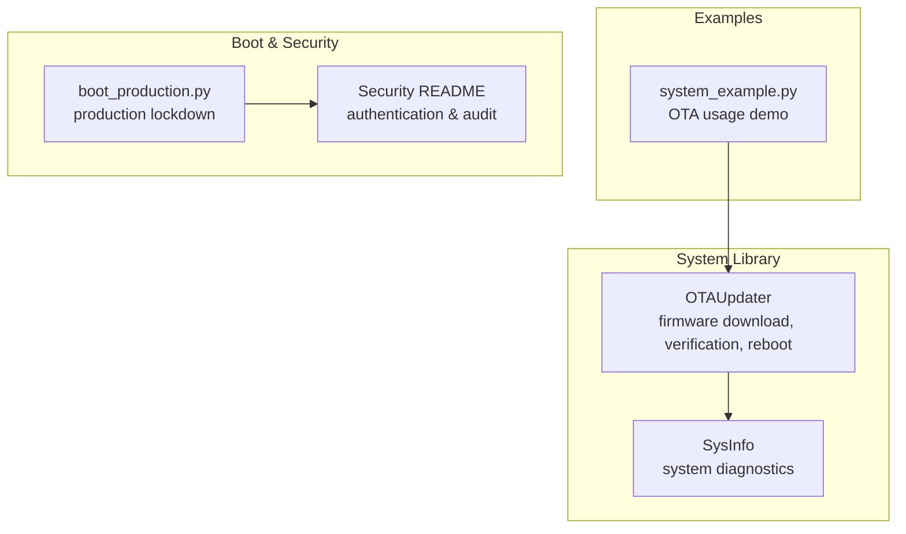
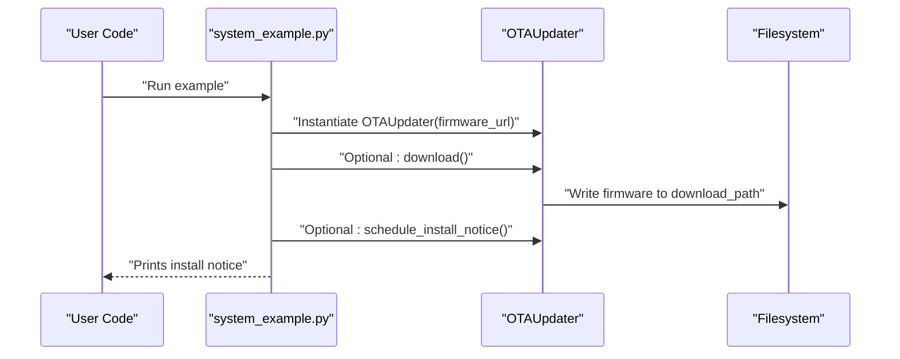
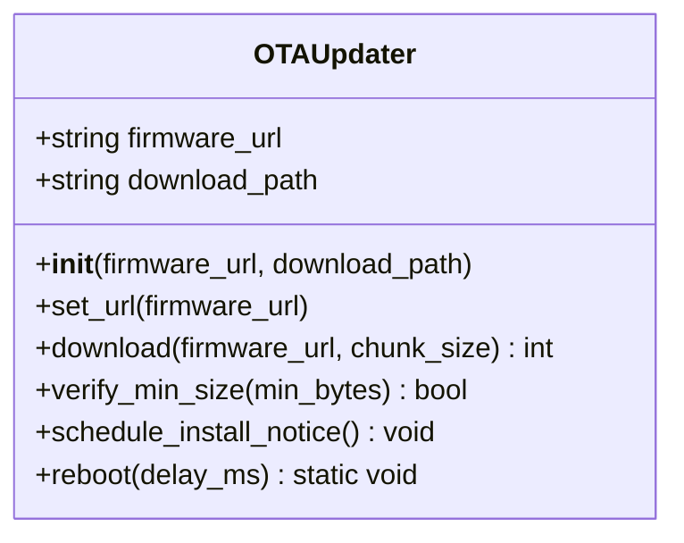
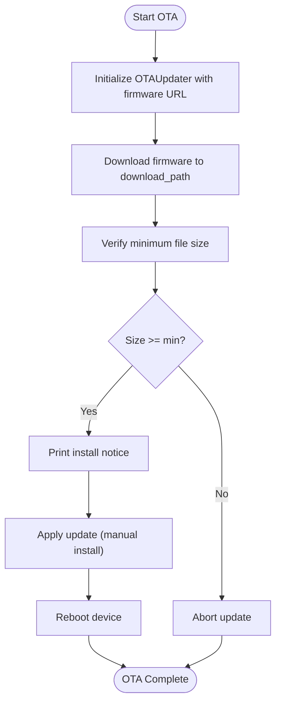
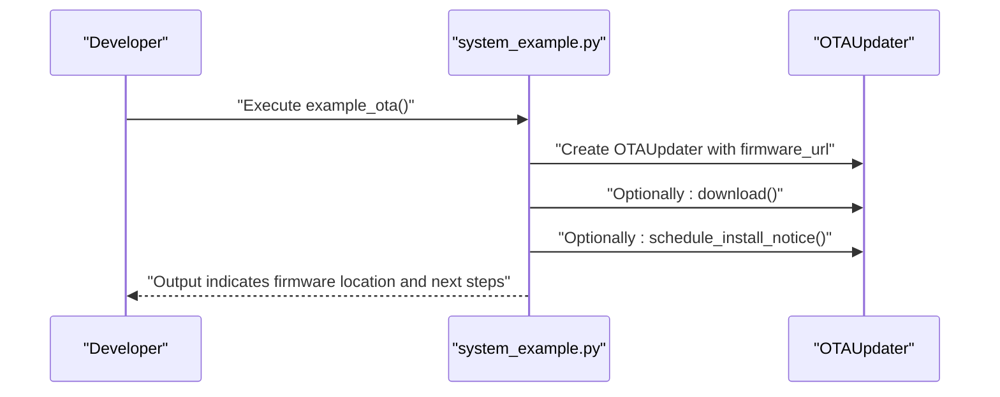
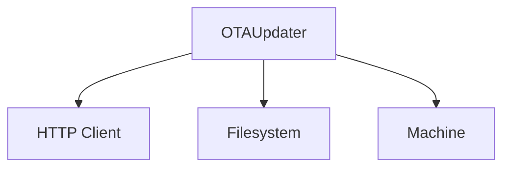

# OTA Updates

<cite>
**Referenced Files in This Document**
- [ota.py](file://src/lib/system/ota.py)
- [system_example.py](file://src/main/examples/system_example.py)
- [README.md](file://src/lib/system/README.md)
- [sysinfo.py](file://src/lib/system/sysinfo.py)
- [boot_production.py](file://src/main/boot_production.py)
- [README.md](file://src/lib/security/README.md)
</cite>

## Table of Contents
1. [Introduction](#introduction)
2. [Project Structure](#project-structure)
3. [Core Components](#core-components)
4. [Architecture Overview](#architecture-overview)
5. [Detailed Component Analysis](#detailed-component-analysis)
6. [Dependency Analysis](#dependency-analysis)
7. [Performance Considerations](#performance-considerations)
8. [Troubleshooting Guide](#troubleshooting-guide)
9. [Conclusion](#conclusion)
10. [Appendices](#appendices)

## Introduction
This document explains the Over-The-Air (OTA) firmware update system implemented in the repository. It focuses on the OTAUpdater class, covering firmware download, partition management considerations, update verification, and rollback mechanisms. It also documents the update workflow from initiation to completion, including safety checks, backup procedures, and recovery strategies. Configuration options for update sources, authentication requirements, and update scheduling are described, along with practical examples from system_example.py demonstrating OTA update procedures, rollback handling, and update monitoring. Security considerations for firmware updates, integrity verification, and secure update channels are addressed, including troubleshooting common update failures, partition conflicts, and recovery procedures for failed updates.

## Project Structure
The OTA update capability is implemented in the system library and demonstrated in the examples. The primary implementation resides in the OTAUpdater class, with supporting utilities for system information and optional production boot protection.

**Diagram sources**
- [ota.py:13-66](file://src/lib/system/ota.py#L13-L66)
- [system_example.py:28-34](file://src/main/examples/system_example.py#L28-L34)
- [sysinfo.py:10-63](file://src/lib/system/sysinfo.py#L10-L63)
- [boot_production.py:19-48](file://src/main/boot_production.py#L19-L48)
- [README.md:1-357](file://src/lib/security/README.md#L1-L357)

**Section sources**
- [ota.py:1-66](file://src/lib/system/ota.py#L1-L66)
- [system_example.py:1-42](file://src/main/examples/system_example.py#L1-L42)
- [README.md:21-83](file://src/lib/system/README.md#L21-L83)

## Core Components
- OTAUpdater: Provides firmware download, basic verification, scheduling notice, and reboot utilities.
- SysInfo: Offers system diagnostics helpful for pre/post update checks.
- boot_production.py: Demonstrates production lockdown via SecurityManager to harden the device before OTA.
- Security README: Documents authentication and audit capabilities that complement OTA security.

Key responsibilities:
- Download firmware from a configured URL to a local path.
- Verify minimum file size after download.
- Provide a notice for manual installation using a supported bootloader/partition strategy.
- Reboot the device safely after applying updates.

**Section sources**
- [ota.py:13-66](file://src/lib/system/ota.py#L13-L66)
- [sysinfo.py:10-63](file://src/lib/system/sysinfo.py#L10-L63)
- [boot_production.py:19-48](file://src/main/boot_production.py#L19-L48)
- [README.md:19-357](file://src/lib/security/README.md#L19-L357)

## Architecture Overview
The OTA workflow integrates user code, OTAUpdater, and system utilities. The example demonstrates constructing an OTAUpdater with a firmware URL and invoking download and apply sequences. The system_example.py shows how to initialize OTA and comment out steps for downloading and scheduling install notices.

**Diagram sources**
- [system_example.py:28-34](file://src/main/examples/system_example.py#L28-L34)
- [ota.py:14-48](file://src/lib/system/ota.py#L14-L48)

**Section sources**
- [system_example.py:28-34](file://src/main/examples/system_example.py#L28-L34)
- [ota.py:13-66](file://src/lib/system/ota.py#L13-L66)

## Detailed Component Analysis

### OTAUpdater Class
The OTAUpdater class encapsulates the OTA process. It supports setting a firmware URL, downloading firmware in chunks, verifying minimum file size, printing an install notice, and rebooting the device.

**Diagram sources**
- [ota.py:13-66](file://src/lib/system/ota.py#L13-L66)

Implementation highlights:
- Constructor initializes firmware URL and download path.
- download() fetches firmware via HTTP streaming and writes to the specified path, returning total bytes written.
- verify_min_size() checks the downloaded file size against a minimum threshold.
- schedule_install_notice() prints guidance for installing the downloaded firmware using a supported bootloader/partition strategy.
- reboot() performs a controlled reset after a short delay.

Safety and error handling:
- Validates presence of the HTTP client module and raises an error if missing.
- Ensures a firmware URL is provided before attempting download.
- Checks HTTP response status and raises an error on failure.
- Closes the HTTP response in a finally block to prevent resource leaks.

Practical usage:
- Construct OTAUpdater with a firmware URL.
- Optionally call download() to fetch firmware.
- Use schedule_install_notice() to guide manual installation.
- Reboot the device after applying updates.

**Section sources**
- [ota.py:13-66](file://src/lib/system/ota.py#L13-L66)

### Update Workflow: From Initiation to Completion
The workflow begins with initializing OTAUpdater and proceeds through download, verification, scheduling, and reboot.

**Diagram sources**
- [ota.py:21-66](file://src/lib/system/ota.py#L21-L66)

**Section sources**
- [ota.py:21-66](file://src/lib/system/ota.py#L21-L66)

### Practical Examples: OTA Procedures, Rollback Handling, Monitoring
The example demonstrates creating an OTAUpdater and outlines steps for downloading and scheduling installation. While rollback is not implemented in the OTAUpdater class, the example shows how to structure the workflow for future extension.

**Diagram sources**
- [system_example.py:28-34](file://src/main/examples/system_example.py#L28-L34)
- [ota.py:14-66](file://src/lib/system/ota.py#L14-L66)

**Section sources**
- [system_example.py:28-34](file://src/main/examples/system_example.py#L28-L34)

### Partition Management and Update Verification
Partition management and verification:
- The OTAUpdater writes firmware to a fixed download path and prints an install notice recommending a bootloader/partition strategy that supports OTA flashing.
- verify_min_size() ensures the downloaded firmware meets a minimum size threshold, helping detect truncated or empty downloads.

Operational guidance:
- Use a bootloader/partition strategy compatible with OTA to flash the downloaded firmware.
- Perform size verification before proceeding with installation.

**Section sources**
- [ota.py:50-66](file://src/lib/system/ota.py#L50-L66)

### Rollback Mechanisms
Current implementation:
- The OTAUpdater class does not implement a rollback method. Rollback handling is not present in the referenced file.

Recommended approach:
- Implement a dual-bank partition strategy with a dedicated "boot slot" and "update slot". After successful verification, switch the boot slot to the update slot and mark the previous slot as healthy. If verification fails or a watchdog-triggered reboot occurs, revert to the previous slot.

Note: The above describes a recommended pattern; it is not implemented in the current OTAUpdater class.

**Section sources**
- [ota.py:13-66](file://src/lib/system/ota.py#L13-L66)

### Configuration Options: Update Sources, Authentication, Scheduling
Configuration options:
- Update source: firmware_url passed to OTAUpdater constructor or set_url().
- Authentication: Not implemented in OTAUpdater; see Security README for authentication and audit capabilities.
- Scheduling: The example demonstrates periodic OTA checks using asyncio.

Security and audit:
- The Security README documents authentication via tokens and audit logging, which can be used alongside OTA to secure update channels and track events.

**Section sources**
- [ota.py:14-27](file://src/lib/system/ota.py#L14-L27)
- [README.md:19-357](file://src/lib/security/README.md#L19-L357)
- [system_example.py:61-82](file://src/main/examples/system_example.py#L61-L82)

## Dependency Analysis
The OTAUpdater depends on:
- HTTP client module for firmware retrieval.
- Filesystem for writing firmware to a specified path.
- Machine reset for rebooting after updates.

**Diagram sources**
- [ota.py:5-10](file://src/lib/system/ota.py#L5-L10)
- [ota.py:21-66](file://src/lib/system/ota.py#L21-L66)

**Section sources**
- [ota.py:5-10](file://src/lib/system/ota.py#L5-L10)
- [ota.py:21-66](file://src/lib/system/ota.py#L21-L66)

## Performance Considerations
- Streaming download: The download() method streams firmware in chunks to reduce memory usage during transfer.
- Minimum size verification: Ensures the firmware is not truncated, preventing unnecessary reboots on invalid images.
- Controlled reboot: A small delay before reset allows pending operations to complete.

Recommendations:
- Choose appropriate chunk sizes based on network stability and available RAM.
- Monitor filesystem space before downloading to avoid partial writes.
- Use watchdogs during long-running updates to recover from hangs.

**Section sources**
- [ota.py:21-48](file://src/lib/system/ota.py#L21-L48)
- [ota.py:50-56](file://src/lib/system/ota.py#L50-L56)

## Troubleshooting Guide
Common issues and resolutions:
- Missing HTTP client: Ensure the HTTP client module is available; otherwise, OTAUpdater raises a runtime error.
- No firmware URL: Provide a firmware URL either in the constructor or via set_url().
- Non-200 HTTP response: The download() method raises an error for non-success status codes.
- Insufficient disk space: Verify filesystem capacity before downloading.
- Truncated firmware: Use verify_min_size() to confirm the downloaded image meets the minimum size requirement.
- Recovery after failed update: Since rollback is not implemented, rely on a dual-bank partition strategy and manual intervention to restore the previous firmware.

**Section sources**
- [ota.py:22-27](file://src/lib/system/ota.py#L22-L27)
- [ota.py:32-33](file://src/lib/system/ota.py#L32-L33)
- [ota.py:50-56](file://src/lib/system/ota.py#L50-L56)

## Conclusion
The OTAUpdater class provides a focused, minimal implementation for downloading firmware, verifying minimum size, and rebooting the device. It emphasizes simplicity and safety by validating inputs, checking HTTP responses, and ensuring sufficient file size. While rollback and advanced partition management are not included in the current implementation, the class offers a foundation for building robust OTA systems. For secure update channels and audit trails, integrate with the Security module’s authentication and logging capabilities. The example demonstrates how to structure OTA workflows, and the README outlines best practices for OTA and system security.

## Appendices

### Appendix A: OTAUpdater API Summary
- Constructor: Initialize with firmware URL and download path.
- set_url(): Update the firmware URL dynamically.
- download(): Stream and write firmware to the download path; returns total bytes.
- verify_min_size(): Confirm minimum file size.
- schedule_install_notice(): Print guidance for manual installation.
- reboot(): Reset the device after applying updates.

**Section sources**
- [ota.py:13-66](file://src/lib/system/ota.py#L13-L66)

### Appendix B: Example References
- Basic OTA usage and scheduled checks are demonstrated in system_example.py and the system README.

**Section sources**
- [system_example.py:28-34](file://src/main/examples/system_example.py#L28-L34)
- [README.md:49-83](file://src/lib/system/README.md#L49-L83)