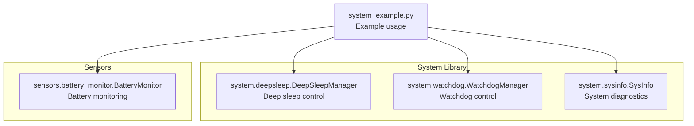
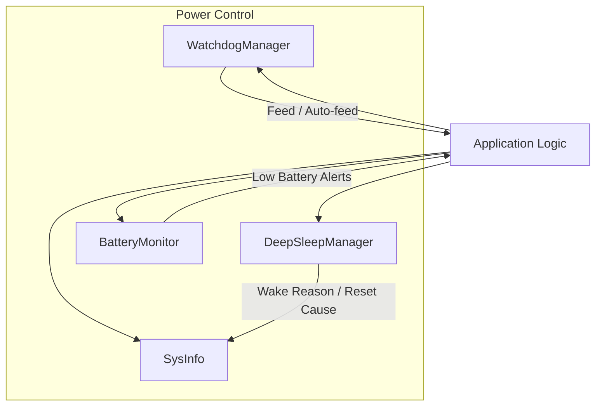
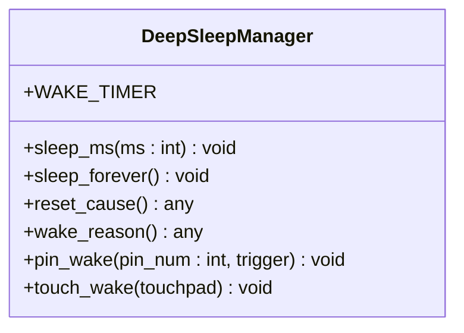
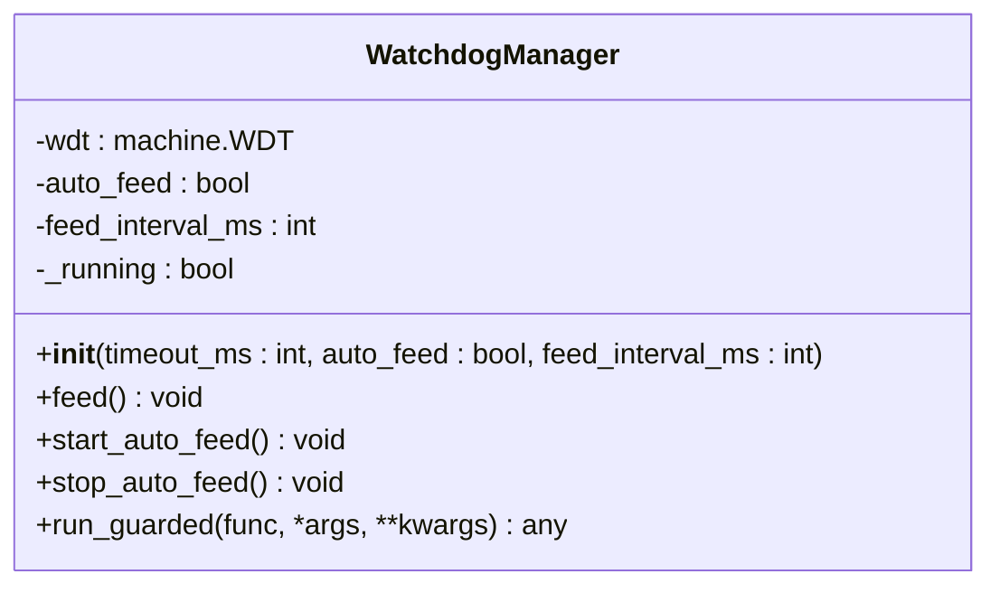
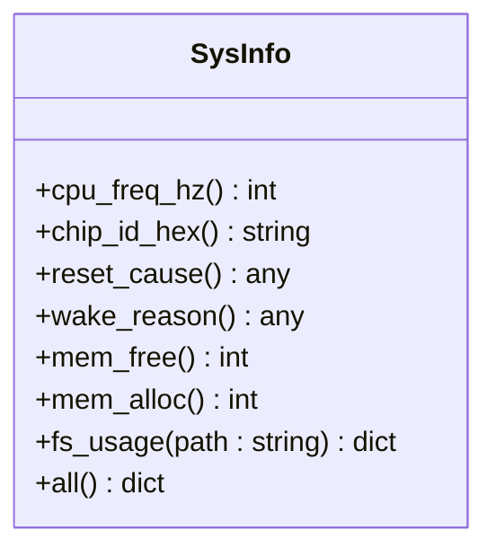
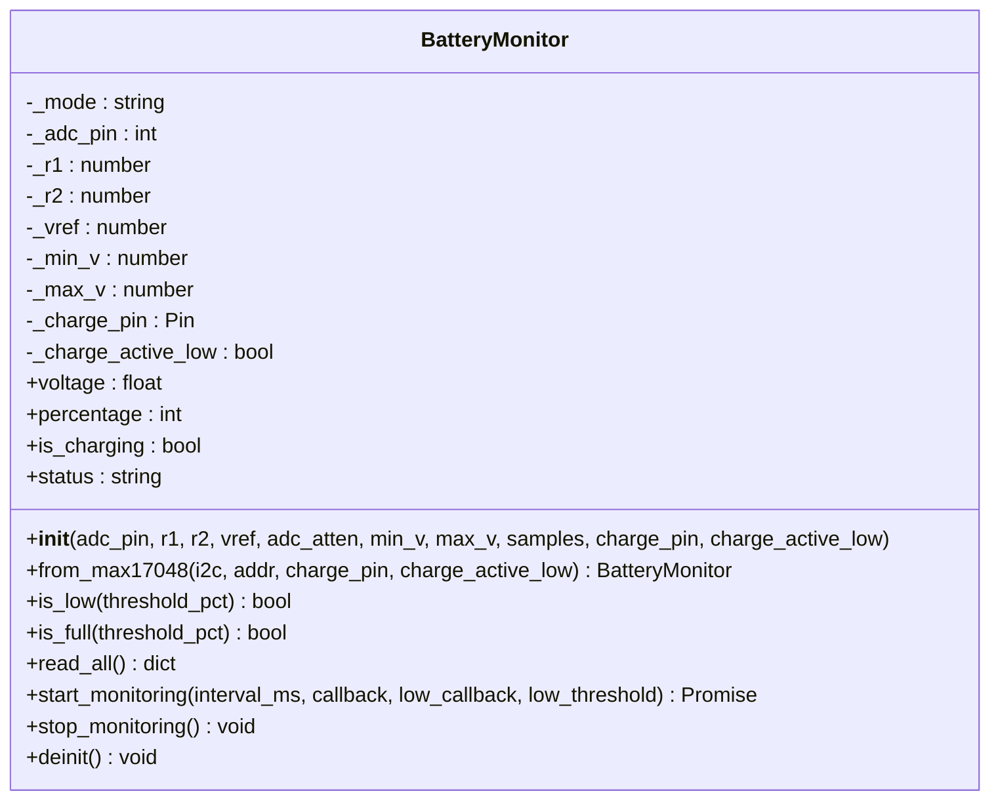
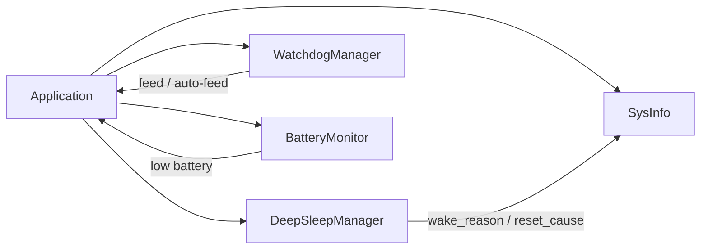
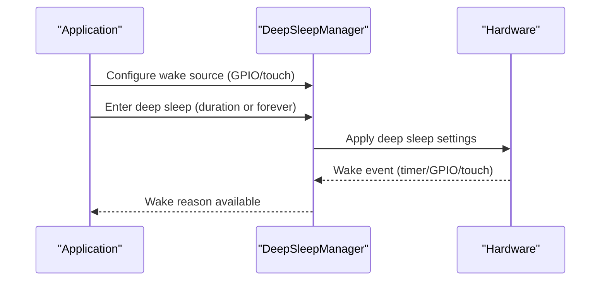
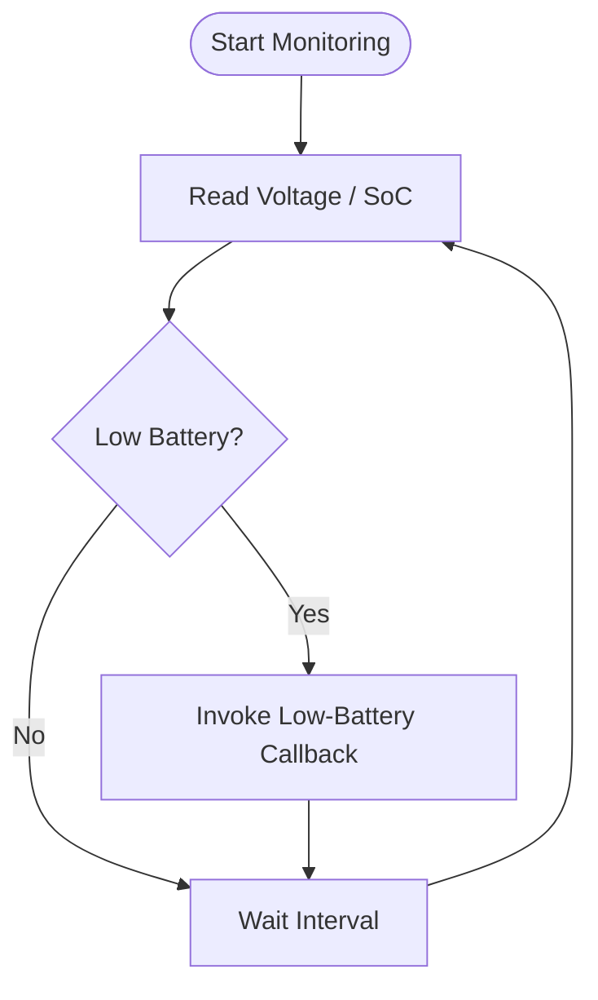

# Power Management

<cite>
**Referenced Files in This Document**
- [system_example.py](file://src/main/examples/system_example.py)
- [deepsleep.py](file://src/lib/system/deepsleep.py)
- [README.md](file://src/lib/system/README.md)
- [watchdog.py](file://src/lib/system/watchdog.py)
- [sysinfo.py](file://src/lib/system/sysinfo.py)
- [battery_monitor.py](file://src/lib/sensors/battery_monitor.py)
</cite>

## Table of Contents
1. [Introduction](#introduction)
2. [Project Structure](#project-structure)
3. [Core Components](#core-components)
4. [Architecture Overview](#architecture-overview)
5. [Detailed Component Analysis](#detailed-component-analysis)
6. [Dependency Analysis](#dependency-analysis)
7. [Performance Considerations](#performance-considerations)
8. [Troubleshooting Guide](#troubleshooting-guide)
9. [Conclusion](#conclusion)
10. [Appendices](#appendices)

## Introduction
This document explains the power management capabilities available in the embedded system, focusing on deep sleep implementation, wake source configuration, and power optimization strategies. It also covers battery monitoring for low-power operation, watchdog protection, and system diagnostics to support robust, energy-efficient designs for battery-powered IoT devices.

## Project Structure
The power management features are primarily implemented in the system library and integrated with example usage in the main examples. The relevant modules include:
- Deep sleep manager for entering and waking from deep sleep
- Watchdog manager for fault tolerance
- System information utility for diagnostics and wake/reset reasons
- Battery monitor for power-aware operation and alerts

**Diagram sources**
- [system_example.py:36-42](file://src/main/examples/system_example.py#L36-L42)
- [deepsleep.py:8-46](file://src/lib/system/deepsleep.py#L8-L46)
- [watchdog.py:9-38](file://src/lib/system/watchdog.py#L9-L38)
- [sysinfo.py:10-64](file://src/lib/system/sysinfo.py#L10-L64)
- [battery_monitor.py:24-291](file://src/lib/sensors/battery_monitor.py#L24-L291)

**Section sources**
- [system_example.py:15-42](file://src/main/examples/system_example.py#L15-L42)
- [README.md:179-248](file://src/lib/system/README.md#L179-L248)

## Core Components
- DeepSleepManager: Provides static methods to enter deep sleep for a given duration, indefinitely, and to configure external wake sources (GPIO and touch). It also exposes reset and wake reason inspection.
- WatchdogManager: Wraps hardware watchdog functionality with manual feeding and optional automatic feeding loops, plus guarded execution helpers.
- SysInfo: Offers system diagnostics including CPU frequency, chip ID, reset cause, wake reason, memory statistics, and filesystem usage.
- BatteryMonitor: Monitors battery voltage and state-of-charge (SoC), detects charging state, and supports asynchronous monitoring with low-battery alerts.

**Section sources**
- [deepsleep.py:8-46](file://src/lib/system/deepsleep.py#L8-L46)
- [watchdog.py:9-38](file://src/lib/system/watchdog.py#L9-L38)
- [sysinfo.py:10-64](file://src/lib/system/sysinfo.py#L10-L64)
- [battery_monitor.py:24-291](file://src/lib/sensors/battery_monitor.py#L24-L291)

## Architecture Overview
The power management architecture centers on three pillars:
- Sleep orchestration: deep sleep entry and wake source configuration
- Fault tolerance: watchdog supervision to prevent hangs
- Power awareness: battery monitoring and system diagnostics

**Diagram sources**
- [deepsleep.py:8-46](file://src/lib/system/deepsleep.py#L8-L46)
- [watchdog.py:9-38](file://src/lib/system/watchdog.py#L9-L38)
- [battery_monitor.py:24-291](file://src/lib/sensors/battery_monitor.py#L24-L291)
- [sysinfo.py:10-64](file://src/lib/system/sysinfo.py#L10-L64)

## Detailed Component Analysis

### Deep Sleep Manager
DeepSleepManager encapsulates deep sleep entry and wake source configuration. It supports:
- Sleep durations in milliseconds
- Forever sleep until a wake event
- Wake reason inspection
- External wake configuration via GPIO and optional touch (platform-dependent)

**Diagram sources**
- [deepsleep.py:8-46](file://src/lib/system/deepsleep.py#L8-L46)

Key behaviors:
- Sleep entry uses the underlying machine deep sleep interface.
- Wake source configuration requires platform support; missing APIs raise a not-implemented error.
- Wake reason and reset cause are exposed for post-wake analysis.

Practical usage examples are documented in the system library README under the DeepSleepManager section.

**Section sources**
- [deepsleep.py:11-46](file://src/lib/system/deepsleep.py#L11-L46)
- [README.md:179-248](file://src/lib/system/README.md#L179-L248)

### Watchdog Manager
WatchdogManager wraps hardware watchdog functionality:
- Manual feeding to keep the device alive
- Optional auto-feed loop with configurable interval
- Guarded execution to avoid feeding on exceptions

**Diagram sources**
- [watchdog.py:9-38](file://src/lib/system/watchdog.py#L9-L38)

Operational notes:
- Auto-feed continuously feeds the watchdog until stopped.
- Guarded execution runs a function and feeds upon successful completion; exceptions bypass feeding for fail-safe reset behavior.

**Section sources**
- [watchdog.py:9-38](file://src/lib/system/watchdog.py#L9-L38)

### System Information
SysInfo provides runtime diagnostics useful for power-aware applications:
- CPU frequency, chip ID
- Reset cause and wake reason
- Memory usage and filesystem statistics

**Diagram sources**
- [sysinfo.py:10-64](file://src/lib/system/sysinfo.py#L10-L64)

These diagnostics help analyze power-related resets and wake events, and assess resource usage during sleep/wake cycles.

**Section sources**
- [sysinfo.py:10-64](file://src/lib/system/sysinfo.py#L10-L64)

### Battery Monitor
BatteryMonitor supports two operational modes:
- ADC voltage divider: measures battery voltage via a resistive divider and estimates SoC using a lookup table and linear interpolation.
- MAX17048 I2C fuel gauge: reads voltage and state-of-charge directly from the fuel gauge chip.

**Diagram sources**
- [battery_monitor.py:24-291](file://src/lib/sensors/battery_monitor.py#L24-L291)

Asynchronous monitoring enables periodic checks and low-battery alerts, supporting proactive power management decisions.

**Section sources**
- [battery_monitor.py:24-291](file://src/lib/sensors/battery_monitor.py#L24-L291)

### Practical Examples from system_example.py
The example demonstrates how to integrate system utilities:
- System information retrieval
- RTC usage
- OTA updates

While deep sleep is not enabled in the example, the pattern shows how to import and use system modules.

**Section sources**
- [system_example.py:15-42](file://src/main/examples/system_example.py#L15-L42)

## Dependency Analysis
The power management modules are loosely coupled and designed for composability:
- Application code depends on system utilities for diagnostics and control.
- Deep sleep and watchdog are orthogonal concerns; both can be used together.
- Battery monitor integrates with application logic to trigger actions based on SoC and charging state.

**Diagram sources**
- [deepsleep.py:8-46](file://src/lib/system/deepsleep.py#L8-L46)
- [watchdog.py:9-38](file://src/lib/system/watchdog.py#L9-L38)
- [sysinfo.py:10-64](file://src/lib/system/sysinfo.py#L10-L64)
- [battery_monitor.py:24-291](file://src/lib/sensors/battery_monitor.py#L24-L291)

## Performance Considerations
- Deep sleep reduces power consumption significantly; ensure peripherals are disabled or powered down before sleep to minimize leakage.
- Use appropriate wake sources to minimize unnecessary wake-ups; configure GPIO triggers and levels carefully.
- Keep watchdog intervals safe but efficient; too frequent feeding increases activity, too infrequent intervals risk false resets.
- Battery monitoring should balance accuracy and power cost; adjust sampling intervals and averaging based on battery capacity and duty cycle.
- Use SysInfo to track memory and filesystem usage to prevent runtime degradation that could indirectly impact power behavior.

[No sources needed since this section provides general guidance]

## Troubleshooting Guide
Common issues and remedies:
- Deep sleep not waking: verify wake source configuration and platform support; inspect wake reason after reset.
- Watchdog resetting unexpectedly: ensure feeding occurs within the configured timeout; use guarded execution to avoid feeding on failures.
- Battery readings inaccurate: confirm voltage divider calibration and ADC attenuation; for MAX17048, verify I2C wiring and device presence.
- Insufficient power budget: reduce active-time activities, optimize sleep durations, and disable unused peripherals.

Diagnostics aids:
- Use SysInfo to inspect reset and wake reasons, memory usage, and filesystem stats.
- Enable logging around sleep/wake transitions and battery thresholds.

**Section sources**
- [sysinfo.py:21-28](file://src/lib/system/sysinfo.py#L21-L28)
- [README.md:390-399](file://src/lib/system/README.md#L390-L399)

## Conclusion
By combining deep sleep orchestration, watchdog supervision, and battery monitoring, the system enables robust, energy-efficient operation for battery-powered IoT devices. Proper configuration of wake sources, careful power budgeting, and continuous diagnostics are essential for reliable long-term performance.

[No sources needed since this section summarizes without analyzing specific files]

## Appendices

### Deep Sleep Workflow

**Diagram sources**
- [deepsleep.py:32-46](file://src/lib/system/deepsleep.py#L32-L46)

### Battery Monitoring Loop

**Diagram sources**
- [battery_monitor.py:245-277](file://src/lib/sensors/battery_monitor.py#L245-L277)