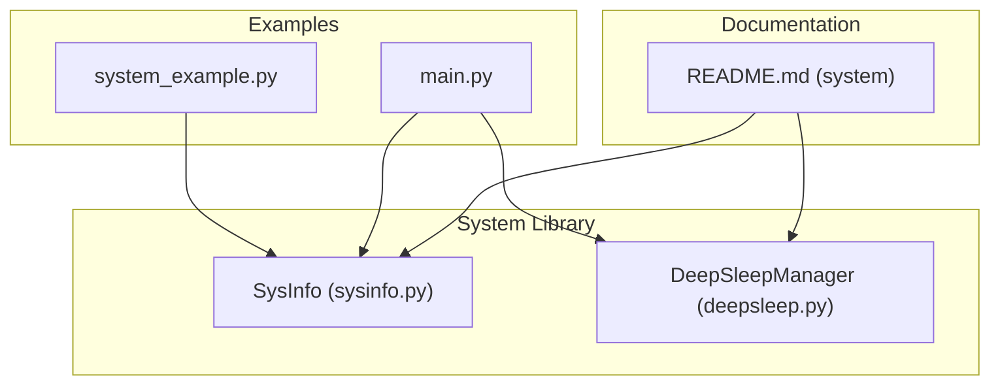
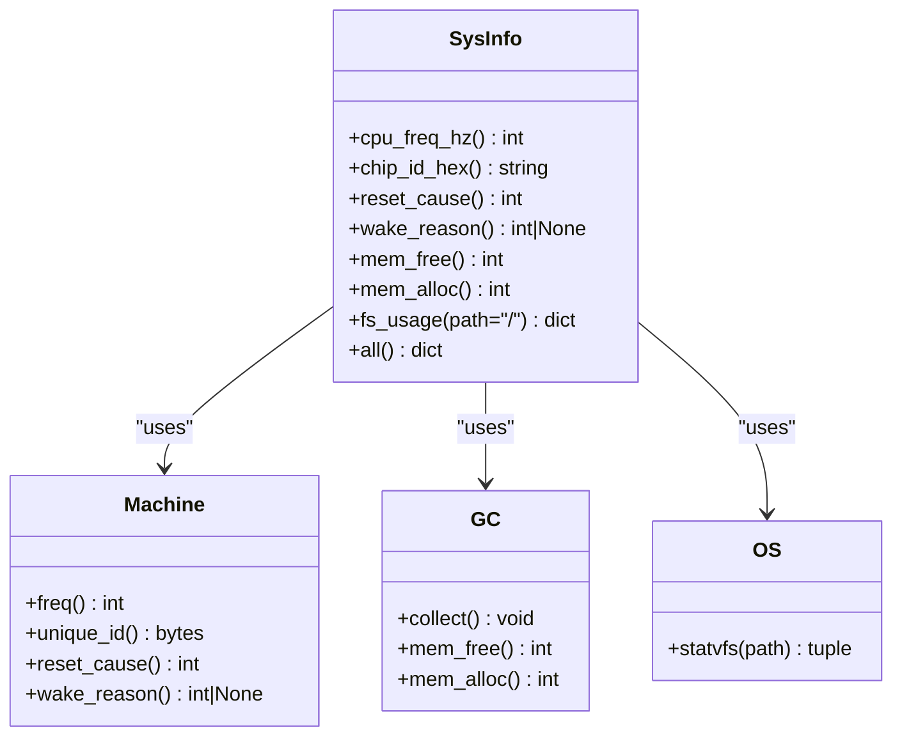
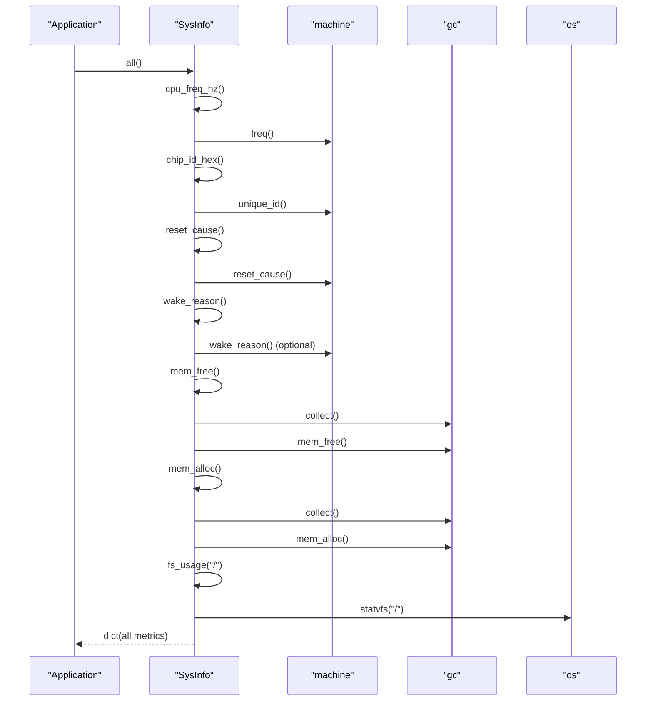
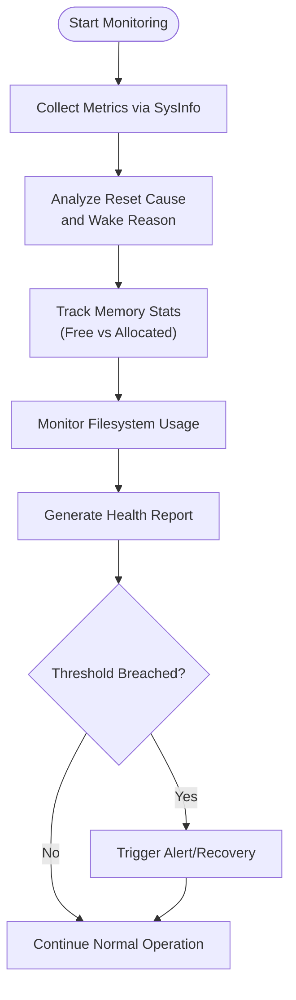
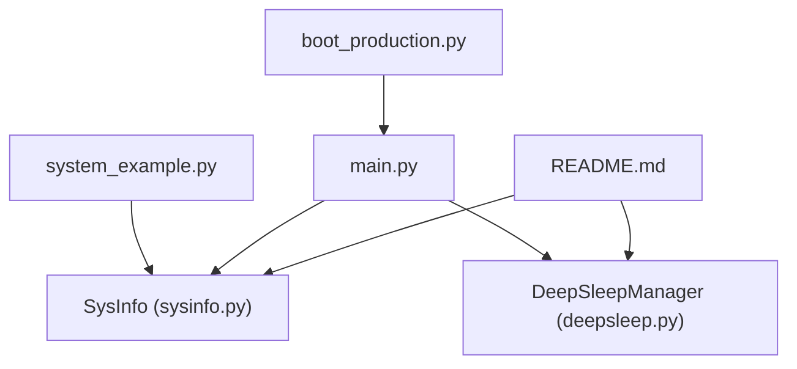

# System Information

<cite>
**Referenced Files in This Document**
- [sysinfo.py](file://src/lib/system/sysinfo.py)
- [system_example.py](file://src/main/examples/system_example.py)
- [main.py](file://src/main/main.py)
- [README.md](file://src/lib/system/README.md)
- [deepsleep.py](file://src/lib/system/deepsleep.py)
- [boot_production.py](file://src/main/boot_production.py)
</cite>

## Table of Contents
1. [Introduction](#introduction)
2. [Project Structure](#project-structure)
3. [Core Components](#core-components)
4. [Architecture Overview](#architecture-overview)
5. [Detailed Component Analysis](#detailed-component-analysis)
6. [Dependency Analysis](#dependency-analysis)
7. [Performance Considerations](#performance-considerations)
8. [Troubleshooting Guide](#troubleshooting-guide)
9. [Conclusion](#conclusion)
10. [Appendices](#appendices)

## Introduction
This document provides comprehensive documentation for the SysInfo system information utility used in embedded MicroPython environments (ESP32-C3 and compatible). It explains how to monitor CPU frequency, retrieve unique device identifiers, analyze system reset causes, inspect deep-sleep wake reasons, track memory usage, and monitor filesystem space. It also covers the all() method for consolidated diagnostics and demonstrates practical monitoring patterns using examples from system_example.py and main.py. Guidance is included for system health monitoring, performance optimization through memory analysis, and troubleshooting system resets, along with best practices for memory management in constrained embedded environments.

## Project Structure
The SysInfo utility resides under the system library and integrates with example applications and the main runtime. The relevant files are organized as follows:
- System utility: src/lib/system/sysinfo.py
- Example usage: src/main/examples/system_example.py
- Runtime integration: src/main/main.py
- System library documentation: src/lib/system/README.md
- Deep sleep support: src/lib/system/deepsleep.py
- Boot lockdown integration: src/main/boot_production.py

**Diagram sources**
- [sysinfo.py:1-64](file://src/lib/system/sysinfo.py#L1-L64)
- [system_example.py:1-43](file://src/main/examples/system_example.py#L1-L43)
- [main.py:1-84](file://src/main/main.py#L1-L84)
- [README.md:1-399](file://src/lib/system/README.md#L1-L399)
- [deepsleep.py:1-46](file://src/lib/system/deepsleep.py#L1-L46)

**Section sources**
- [sysinfo.py:1-64](file://src/lib/system/sysinfo.py#L1-L64)
- [system_example.py:1-43](file://src/main/examples/system_example.py#L1-L43)
- [main.py:1-84](file://src/main/main.py#L1-L84)
- [README.md:1-399](file://src/lib/system/README.md#L1-L399)
- [deepsleep.py:1-46](file://src/lib/system/deepsleep.py#L1-L46)

## Core Components
SysInfo is a static utility class providing system diagnostics and monitoring capabilities. Its primary methods include:
- cpu_freq_hz(): Reports CPU frequency in Hertz.
- chip_id_hex(): Returns the device’s unique identifier as a hexadecimal string.
- reset_cause(): Returns the reason for the last system reset.
- wake_reason(): Returns the reason for waking from deep sleep (platform-dependent).
- mem_free(): Returns free heap memory after a garbage collection cycle.
- mem_alloc(): Returns allocated heap memory after a garbage collection cycle.
- fs_usage(path="/"): Returns filesystem usage statistics for a given path.
- all(): Returns a dictionary containing all of the above metrics for consolidated diagnostics.

These methods rely on MicroPython built-ins:
- machine.freq(), machine.unique_id(), machine.reset_cause(), machine.wake_reason()
- gc module for memory statistics
- os.statvfs() for filesystem statistics

Practical usage is demonstrated in system_example.py and main.py, where SysInfo.all() is printed and memory metrics are periodically logged.

**Section sources**
- [sysinfo.py:10-63](file://src/lib/system/sysinfo.py#L10-L63)
- [system_example.py:15-18](file://src/main/examples/system_example.py#L15-L18)
- [main.py:38-43](file://src/main/main.py#L38-L43)

## Architecture Overview
The SysInfo utility is designed as a lightweight, static interface to system-level APIs. It encapsulates MicroPython calls and exposes them as simple, consistent methods. The all() method consolidates multiple metrics into a single dictionary for diagnostics and reporting.

**Diagram sources**
- [sysinfo.py:10-63](file://src/lib/system/sysinfo.py#L10-L63)

## Detailed Component Analysis

### SysInfo Methods
- cpu_freq_hz()
  - Purpose: Retrieve current CPU frequency in Hertz.
  - Implementation: Delegates to machine.freq().
  - Typical usage: Periodic logging and performance monitoring.
  - Example reference: [main.py](file://src/main/main.py#L42)

- chip_id_hex()
  - Purpose: Obtain a unique device identifier as a hex string.
  - Implementation: Reads machine.unique_id() and formats bytes to hex.
  - Typical usage: Device identification and telemetry correlation.
  - Example reference: [main.py](file://src/main/main.py#L52)

- reset_cause()
  - Purpose: Determine the reason for the last system reset.
  - Implementation: Delegates to machine.reset_cause().
  - Typical usage: Diagnosing unexpected reboots and stability analysis.
  - Example reference: [sysinfo.py:21-22](file://src/lib/system/sysinfo.py#L21-L22)

- wake_reason()
  - Purpose: Report the wake reason after deep sleep (platform-dependent).
  - Implementation: Checks for machine.wake_reason(); returns None if unavailable.
  - Typical usage: Verifying deep sleep behavior and wake triggers.
  - Example reference: [sysinfo.py:25-28](file://src/lib/system/sysinfo.py#L25-L28)

- mem_free()
  - Purpose: Return free heap memory after garbage collection.
  - Implementation: Calls gc.collect() then gc.mem_free().
  - Typical usage: Memory health checks and leak detection.
  - Example reference: [main.py](file://src/main/main.py#L41)

- mem_alloc()
  - Purpose: Return allocated heap memory after garbage collection.
  - Implementation: Calls gc.collect() then gc.mem_alloc().
  - Typical usage: Memory usage tracking and trend analysis.
  - Example reference: [main.py:40-43](file://src/main/main.py#L40-L43)

- fs_usage(path="/")
  - Purpose: Compute total, used, and free bytes for a filesystem path.
  - Implementation: Uses os.statvfs() and aggregates results.
  - Typical usage: Storage monitoring and capacity planning.
  - Example reference: [sysinfo.py:41-51](file://src/lib/system/sysinfo.py#L41-L51)

- all()
  - Purpose: Consolidated diagnostics including CPU frequency, chip ID, reset cause, wake reason, memory stats, and filesystem usage.
  - Implementation: Calls all other methods and returns a dictionary.
  - Typical usage: System health reports and dashboard integration.
  - Example reference: [system_example.py](file://src/main/examples/system_example.py#L17)

**Diagram sources**
- [sysinfo.py:54-63](file://src/lib/system/sysinfo.py#L54-L63)

**Section sources**
- [sysinfo.py:10-63](file://src/lib/system/sysinfo.py#L10-L63)
- [system_example.py:15-18](file://src/main/examples/system_example.py#L15-L18)
- [main.py:38-43](file://src/main/main.py#L38-L43)

### Practical Monitoring Patterns
- System monitoring with SysInfo.all()
  - Demonstrated in system_example.py, printing a consolidated snapshot of system metrics.
  - Reference: [system_example.py:15-18](file://src/main/examples/system_example.py#L15-L18)

- Memory usage tracking
  - Periodic logging of free and allocated memory in main.py.
  - Reference: [main.py:38-43](file://src/main/main.py#L38-L43)

- Diagnostic workflows
  - Combine reset_cause() and wake_reason() to analyze restart and deep-sleep behavior.
  - Reference: [sysinfo.py:21-28](file://src/lib/system/sysinfo.py#L21-L28)

- Filesystem space monitoring
  - Use fs_usage() to track storage availability and plan cleanup routines.
  - Reference: [sysinfo.py:41-51](file://src/lib/system/sysinfo.py#L41-L51)

**Section sources**
- [system_example.py:15-18](file://src/main/examples/system_example.py#L15-L18)
- [main.py:38-43](file://src/main/main.py#L38-L43)
- [sysinfo.py:21-28](file://src/lib/system/sysinfo.py#L21-L28)
- [sysinfo.py:41-51](file://src/lib/system/sysinfo.py#L41-L51)

### Conceptual Overview
The SysInfo utility provides a unified interface for system diagnostics. It bridges MicroPython’s low-level APIs with high-level observability, enabling developers to build robust monitoring and alerting systems tailored for resource-constrained devices.

[No sources needed since this diagram shows conceptual workflow, not actual code structure]

## Dependency Analysis
SysInfo depends on MicroPython built-ins and standard libraries:
- machine: CPU frequency, unique ID, reset cause, wake reason
- gc: memory statistics and collection
- os: filesystem statistics

Integration points:
- system_example.py imports SysInfo and prints all metrics.
- main.py integrates SysInfo into periodic tasks and logs memory/CPU metrics.
- README.md documents the class and usage patterns.
- DeepSleepManager complements SysInfo by providing wake reason analysis and sleep controls.
- boot_production.py initializes the environment and ensures clean memory state before application startup.

**Diagram sources**
- [sysinfo.py:1-64](file://src/lib/system/sysinfo.py#L1-L64)
- [system_example.py:1-43](file://src/main/examples/system_example.py#L1-L43)
- [main.py:1-84](file://src/main/main.py#L1-L84)
- [README.md:1-399](file://src/lib/system/README.md#L1-L399)
- [deepsleep.py:1-46](file://src/lib/system/deepsleep.py#L1-L46)
- [boot_production.py:1-56](file://src/main/boot_production.py#L1-L56)

**Section sources**
- [sysinfo.py:1-64](file://src/lib/system/sysinfo.py#L1-L64)
- [system_example.py:1-43](file://src/main/examples/system_example.py#L1-L43)
- [main.py:1-84](file://src/main/main.py#L1-L84)
- [README.md:1-399](file://src/lib/system/README.md#L1-L399)
- [deepsleep.py:1-46](file://src/lib/system/deepsleep.py#L1-L46)
- [boot_production.py:1-56](file://src/main/boot_production.py#L1-L56)

## Performance Considerations
- Memory pressure and GC overhead
  - mem_free() and mem_alloc() internally call gc.collect(), which can introduce latency. Batch metric reads and throttle sampling intervals to minimize impact.
  - Reference: [sysinfo.py:31-38](file://src/lib/system/sysinfo.py#L31-L38)

- CPU frequency scaling
  - cpu_freq_hz() reflects current CPU speed. Lower frequencies reduce power consumption but may affect throughput; use for adaptive performance tuning.
  - Reference: [sysinfo.py](file://src/lib/system/sysinfo.py#L12)

- Filesystem I/O
  - fs_usage() performs statvfs() on the target path. Avoid frequent polling on slow or shared filesystems; cache results and refresh periodically.
  - Reference: [sysinfo.py:41-51](file://src/lib/system/sysinfo.py#L41-L51)

- Deep sleep wake analysis
  - wake_reason() helps confirm whether deep sleep wake triggers are functioning as expected. Misconfiguration can lead to excessive wake-ups and power drain.
  - Reference: [sysinfo.py:25-28](file://src/lib/system/sysinfo.py#L25-L28), [deepsleep.py:26-29](file://src/lib/system/deepsleep.py#L26-L29)

[No sources needed since this section provides general guidance]

## Troubleshooting Guide
- Unexpected reboots
  - Use reset_cause() to identify the root cause (power-on, watchdog, panic, etc.). Combine with wake_reason() to distinguish between normal and abnormal wake-ups.
  - Reference: [sysinfo.py:21-28](file://src/lib/system/sysinfo.py#L21-L28)

- Memory leaks or fragmentation
  - Monitor mem_free() and mem_alloc() trends over time. Trigger manual gc.collect() before measurements to stabilize readings.
  - Reference: [sysinfo.py:31-38](file://src/lib/system/sysinfo.py#L31-L38), [main.py:40-43](file://src/main/main.py#L40-L43)

- Insufficient storage
  - Use fs_usage() to track used/free space and schedule cleanup or rotation when thresholds are approached.
  - Reference: [sysinfo.py:41-51](file://src/lib/system/sysinfo.py#L41-L51)

- Deep sleep anomalies
  - Verify wake_reason() and compare against intended wake sources. Ensure platform supports wake_reason() and configure external wake pins/touch as needed.
  - Reference: [sysinfo.py:25-28](file://src/lib/system/sysinfo.py#L25-L28), [deepsleep.py:32-46](file://src/lib/system/deepsleep.py#L32-L46)

- Boot-time stability
  - Use boot_production.py to enforce lockdown and ensure a clean environment before application starts. Confirm gc.collect() runs early to free memory.
  - Reference: [boot_production.py:52-53](file://src/main/boot_production.py#L52-L53)

**Section sources**
- [sysinfo.py:21-28](file://src/lib/system/sysinfo.py#L21-L28)
- [sysinfo.py:31-38](file://src/lib/system/sysinfo.py#L31-L38)
- [sysinfo.py:41-51](file://src/lib/system/sysinfo.py#L41-L51)
- [deepsleep.py:26-46](file://src/lib/system/deepsleep.py#L26-L46)
- [boot_production.py:52-53](file://src/main/boot_production.py#L52-L53)

## Conclusion
SysInfo offers a concise and powerful set of methods for embedded system diagnostics in MicroPython. By combining CPU frequency monitoring, device identification, reset and wake analysis, memory tracking, and filesystem usage, developers can build robust health monitoring and troubleshooting workflows. The all() method streamlines diagnostics, while practical examples in system_example.py and main.py demonstrate real-world usage patterns. Adhering to best practices for memory management and performance optimization ensures reliable operation in constrained environments.

[No sources needed since this section summarizes without analyzing specific files]

## Appendices

### Best Practices for Memory Management in Embedded Environments
- Minimize allocations during critical periods; pre-allocate buffers when possible.
- Periodically call gc.collect() before measuring memory to obtain stable readings.
- Monitor mem_free() and mem_alloc() trends; investigate persistent drops indicating potential leaks.
- Use fs_usage() to proactively manage storage and prevent full filesystem conditions.
- Reference: [sysinfo.py:31-38](file://src/lib/system/sysinfo.py#L31-L38), [sysinfo.py:41-51](file://src/lib/system/sysinfo.py#L41-L51)

### System Stability Monitoring Checklist
- Record reset_cause() on boot to detect recurring failures.
- Track wake_reason() to validate deep sleep behavior and energy efficiency.
- Log CPU frequency and memory metrics regularly to spot performance regressions.
- Reference: [sysinfo.py:21-28](file://src/lib/system/sysinfo.py#L21-L28), [sysinfo.py](file://src/lib/system/sysinfo.py#L12), [sysinfo.py:31-38](file://src/lib/system/sysinfo.py#L31-L38)