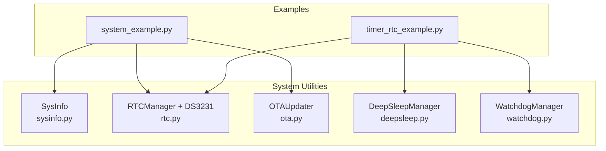
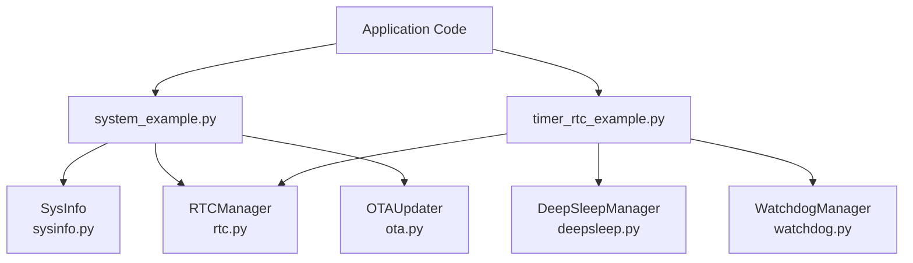
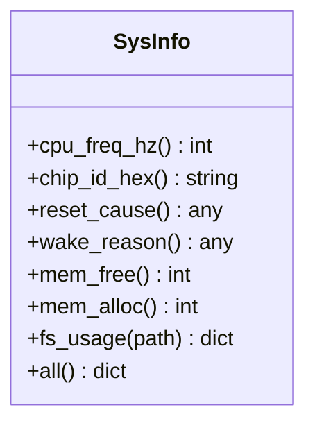
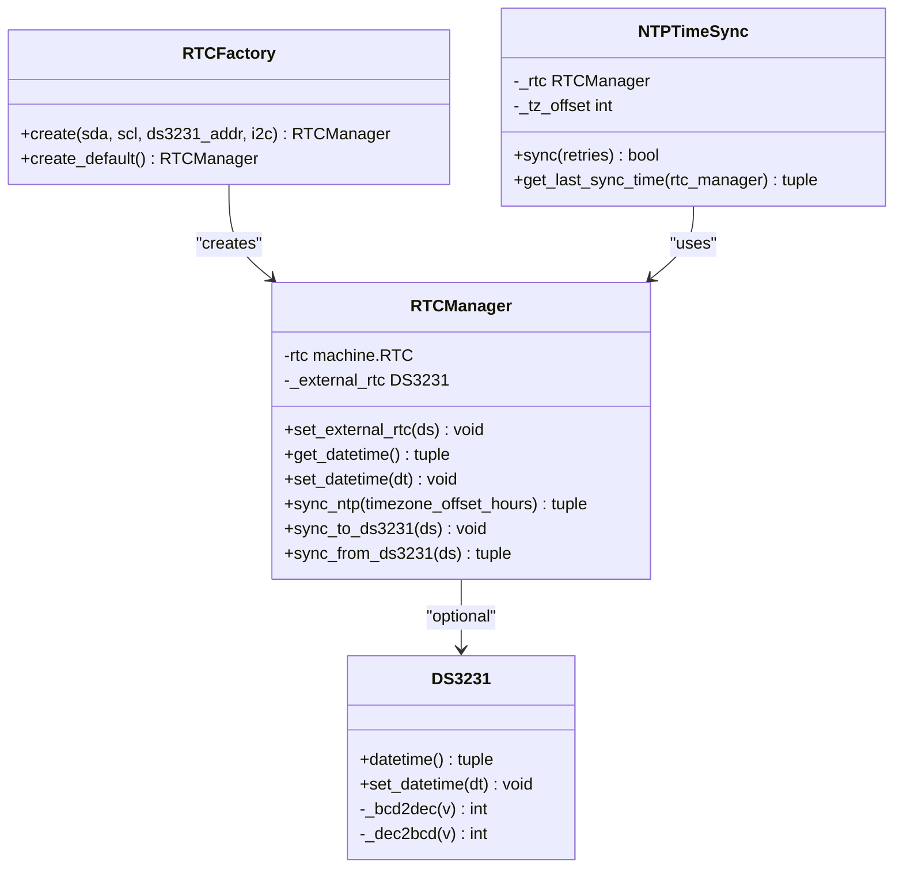
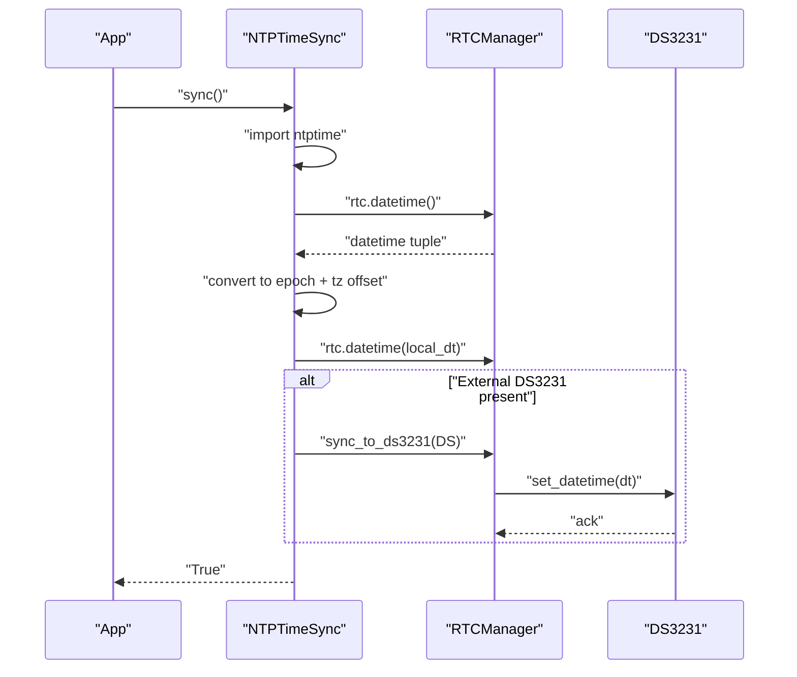
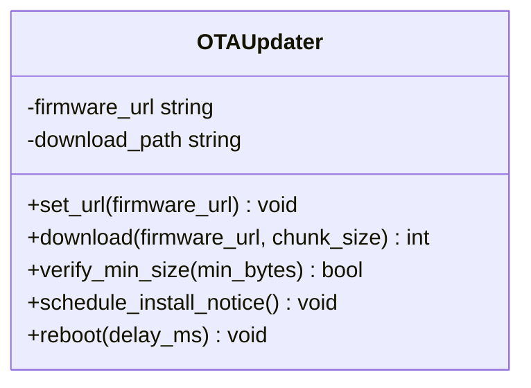
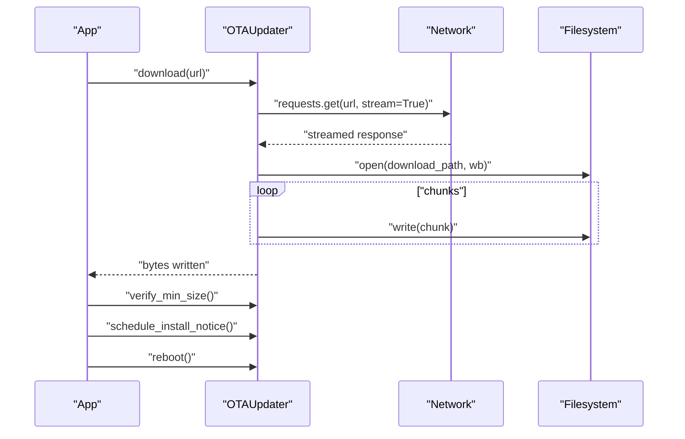
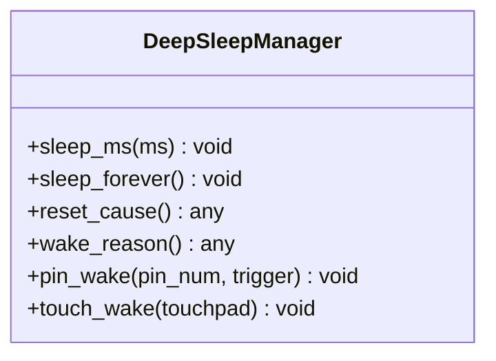
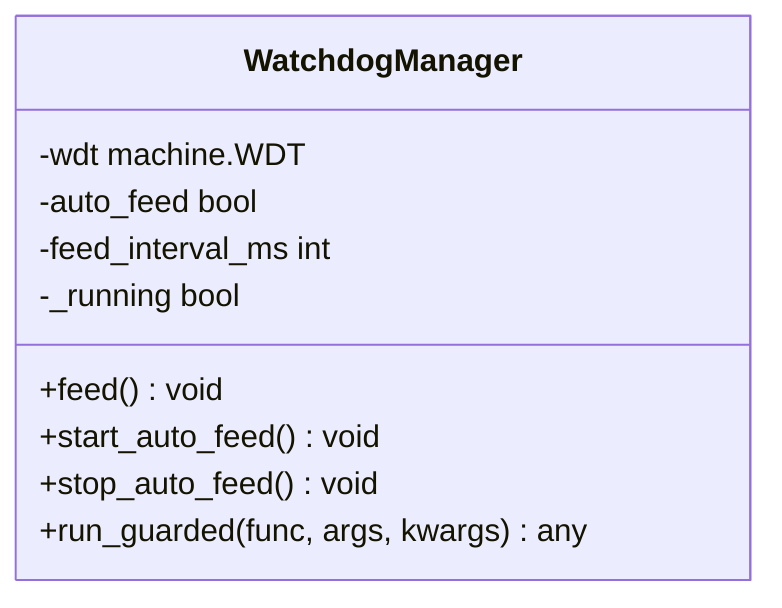
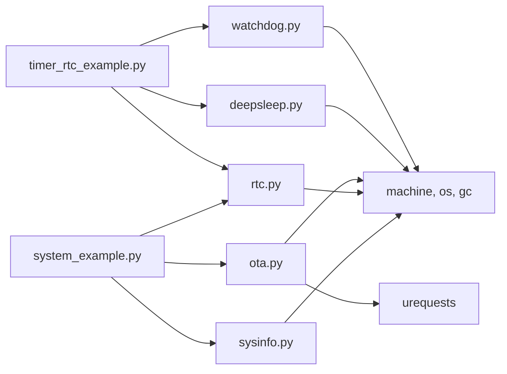

# System Utilities

<cite>
**Referenced Files in This Document**
- [system_example.py](file://src/main/examples/system_example.py)
- [timer_rtc_example.py](file://src/main/examples/timer_rtc_example.py)
- [sysinfo.py](file://src/lib/system/sysinfo.py)
- [rtc.py](file://src/lib/system/rtc.py)
- [ota.py](file://src/lib/system/ota.py)
- [deepsleep.py](file://src/lib/system/deepsleep.py)
- [watchdog.py](file://src/lib/system/watchdog.py)
- [README.md](file://src/lib/system/README.md)
</cite>

## Table of Contents
1. [Introduction](#introduction)
2. [Project Structure](#project-structure)
3. [Core Components](#core-components)
4. [Architecture Overview](#architecture-overview)
5. [Detailed Component Analysis](#detailed-component-analysis)
6. [Dependency Analysis](#dependency-analysis)
7. [Performance Considerations](#performance-considerations)
8. [Troubleshooting Guide](#troubleshooting-guide)
9. [Conclusion](#conclusion)
10. [Appendices](#appendices)

## Introduction
This document provides comprehensive documentation for system utility functions in the ESP32-C3 framework. It covers system information gathering with the SysInfo class for memory monitoring and CPU frequency tracking, OTA firmware updates with OTAUpdater implementation and rollback procedures, time management with RTCManager and NTP synchronization, power management with deep sleep implementation and wake source configuration, and watchdog implementation for system reliability. Practical examples are drawn from system_example.py and timer_rtc_example.py to demonstrate real-world usage patterns. Guidance is also included for system diagnostics, performance monitoring, thermal management, and best practices for embedded system reliability and maintenance.

## Project Structure
The system utilities reside under the system library and are accompanied by example scripts that demonstrate usage patterns:
- System utilities: sysinfo.py, rtc.py, ota.py, deepsleep.py, watchdog.py
- Example usage: system_example.py, timer_rtc_example.py
- Reference documentation: README.md

**Diagram sources**
- [sysinfo.py](file://src/lib/system/sysinfo.py)
- [rtc.py](file://src/lib/system/rtc.py)
- [ota.py](file://src/lib/system/ota.py)
- [deepsleep.py](file://src/lib/system/deepsleep.py)
- [watchdog.py](file://src/lib/system/watchdog.py)
- [system_example.py](file://src/main/examples/system_example.py)
- [timer_rtc_example.py](file://src/main/examples/timer_rtc_example.py)

**Section sources**
- [README.md](file://src/lib/system/README.md)

## Core Components
- SysInfo: Provides system-level metrics including CPU frequency, chip identifier, reset cause, wake reason, free and allocated memory, and filesystem usage.
- RTCManager and DS3231: Manage built-in RTC and optional external DS3231 real-time clock, with factory-style auto-detection and NTP synchronization helpers.
- OTAUpdater: Handles firmware downloads from a remote URL and schedules installation; supports minimum size verification and controlled reboot.
- DeepSleepManager: Controls deep sleep modes and wake sources including timer, GPIO, and touch (platform-dependent).
- WatchdogManager: Wraps hardware watchdog with manual and automatic feeding modes and guarded execution.

**Section sources**
- [sysinfo.py](file://src/lib/system/sysinfo.py)
- [rtc.py](file://src/lib/system/rtc.py)
- [ota.py](file://src/lib/system/ota.py)
- [deepsleep.py](file://src/lib/system/deepsleep.py)
- [watchdog.py](file://src/lib/system/watchdog.py)

## Architecture Overview
The system utilities integrate with MicroPython’s machine module for hardware control and with standard libraries for OS and networking. The examples illustrate how to combine these utilities for practical tasks such as monitoring, updating, timekeeping, power saving, and reliability.

**Diagram sources**
- [system_example.py](file://src/main/examples/system_example.py)
- [timer_rtc_example.py](file://src/main/examples/timer_rtc_example.py)
- [sysinfo.py](file://src/lib/system/sysinfo.py)
- [rtc.py](file://src/lib/system/rtc.py)
- [ota.py](file://src/lib/system/ota.py)
- [deepsleep.py](file://src/lib/system/deepsleep.py)
- [watchdog.py](file://src/lib/system/watchdog.py)

## Detailed Component Analysis

### SysInfo: System Information Gathering
SysInfo consolidates runtime diagnostics:
- CPU frequency retrieval
- Unique chip identifier
- Reset and wake reasons
- Memory statistics (free and allocated)
- Filesystem usage

Implementation highlights:
- Uses machine.freq() for CPU frequency
- Uses machine.unique_id() and machine.reset_cause()/wake_reason() when available
- Uses gc module for memory stats and os.statvfs() for filesystem usage

**Diagram sources**
- [sysinfo.py](file://src/lib/system/sysinfo.py)

Practical usage:
- Monitor memory trends to detect leaks
- Track reset/wake reasons for reliability analysis
- Report system health periodically

**Section sources**
- [sysinfo.py](file://src/lib/system/sysinfo.py)
- [README.md](file://src/lib/system/README.md)

### RTCManager and NTP Synchronization
RTCManager coordinates built-in and external DS3231 real-time clocks:
- Built-in RTC via machine.RTC
- Optional DS3231 via I2C with BCD conversion helpers
- NTP synchronization with timezone offset handling
- Factory pattern to auto-detect DS3231 or fall back to internal RTC

Key capabilities:
- Set/get datetime for both RTCs
- Sync NTP to local time and propagate to DS3231 if present
- Factory-based creation with sanity checks

**Diagram sources**
- [rtc.py](file://src/lib/system/rtc.py)

Sequence: NTP synchronization flow

**Diagram sources**
- [rtc.py](file://src/lib/system/rtc.py)

Practical usage:
- Use RTCFactory.create() to auto-detect DS3231 or default to internal RTC
- Use NTPTimeSync.sync() after connecting to WiFi
- Back up RTC to DS3231 for persistent timekeeping

**Section sources**
- [rtc.py](file://src/lib/system/rtc.py)
- [timer_rtc_example.py](file://src/main/examples/timer_rtc_example.py)

### OTAUpdater: Firmware Updates and Rollback
OTAUpdater enables downloading firmware images and scheduling installation:
- Download firmware from a URL with streaming to a local file
- Verify minimum size to guard against truncated downloads
- Schedule installation notice and controlled reboot

**Diagram sources**
- [ota.py](file://src/lib/system/ota.py)

Sequence: OTA download and installation flow

**Diagram sources**
- [ota.py](file://src/lib/system/ota.py)

Rollback strategy:
- Maintain a dual-image partition scheme and a dedicated flag to track the active image
- On successful boot, clear rollback flag; on failure, set rollback flag and reboot to previous image
- Use OTAUpdater.reboot() to initiate controlled reset after applying the new firmware

Note: The provided OTAUpdater implementation focuses on download and scheduling. Rollback requires platform-specific partition management and bootloader support.

**Section sources**
- [ota.py](file://src/lib/system/ota.py)
- [README.md](file://src/lib/system/README.md)

### Deep Sleep Management
DeepSleepManager controls low-power sleep modes and wake sources:
- Sleep for a specified duration or indefinitely
- Wake reasons and reset cause inspection
- Configure external wake sources (GPIO) and touch wake (platform-dependent)

**Diagram sources**
- [deepsleep.py](file://src/lib/system/deepsleep.py)

Power optimization approaches:
- Use timer wake for periodic tasks
- Use GPIO wake for event-driven operation
- Use touch wake for capacitive buttons (ESP32-class devices)
- Combine with RTC for accurate timing and minimal power draw

**Section sources**
- [deepsleep.py](file://src/lib/system/deepsleep.py)
- [timer_rtc_example.py](file://src/main/examples/timer_rtc_example.py)

### Watchdog Implementation
WatchdogManager wraps hardware watchdog with manual and automatic feeding:
- Feed the watchdog to prevent reset
- Start auto-feed loop at configured intervals
- Guarded execution to avoid feeding on exceptions

**Diagram sources**
- [watchdog.py](file://src/lib/system/watchdog.py)

Watchdog feeding patterns:
- Manual feeding inside tight loops
- Dedicated async task that feeds periodically
- Guarded execution around risky operations

**Section sources**
- [watchdog.py](file://src/lib/system/watchdog.py)
- [timer_rtc_example.py](file://src/main/examples/timer_rtc_example.py)

## Dependency Analysis
The system utilities depend on MicroPython’s machine module for hardware control and standard libraries for OS and networking. The examples demonstrate integration patterns.

**Diagram sources**
- [sysinfo.py](file://src/lib/system/sysinfo.py)
- [rtc.py](file://src/lib/system/rtc.py)
- [ota.py](file://src/lib/system/ota.py)
- [deepsleep.py](file://src/lib/system/deepsleep.py)
- [watchdog.py](file://src/lib/system/watchdog.py)
- [system_example.py](file://src/main/examples/system_example.py)
- [timer_rtc_example.py](file://src/main/examples/timer_rtc_example.py)

**Section sources**
- [sysinfo.py](file://src/lib/system/sysinfo.py)
- [rtc.py](file://src/lib/system/rtc.py)
- [ota.py](file://src/lib/system/ota.py)
- [deepsleep.py](file://src/lib/system/deepsleep.py)
- [watchdog.py](file://src/lib/system/watchdog.py)

## Performance Considerations
- Memory monitoring: Use SysInfo.mem_free() and mem_alloc() to track heap usage and detect leaks; schedule periodic reports.
- CPU frequency: Adjust CPU frequency dynamically to balance performance and power consumption.
- Network I/O: Stream OTA downloads to reduce peak memory usage; verify minimum size before installation.
- RTC synchronization: Retry NTP sync with backoff; handle missing ntptime gracefully.
- Watchdog: Choose appropriate timeout and feeding interval; avoid overly aggressive auto-feed that masks issues.

[No sources needed since this section provides general guidance]

## Troubleshooting Guide
Common issues and resolutions:
- OTA download failures: Ensure network connectivity and firmware URL validity; verify minimum size post-download.
- NTP synchronization: Confirm WiFi connection before attempting NTP; handle missing ntptime module by falling back to manual time setting.
- Deep sleep wake issues: Validate wake source configuration; remember that WiFi disconnects during deep sleep and must be reconnected after wake.
- Watchdog resets: Increase timeout or adjust feeding intervals; avoid feeding on exceptions to preserve fail-safe behavior.
- RTC persistence: Install a backup battery for DS3231 to maintain time across power cycles.

**Section sources**
- [README.md](file://src/lib/system/README.md)

## Conclusion
The ESP32-C3 system utilities provide robust capabilities for monitoring, updating, timekeeping, power management, and reliability. By combining SysInfo for diagnostics, OTAUpdater for over-the-air updates, RTCManager for precise timekeeping, DeepSleepManager for power optimization, and WatchdogManager for reliability, developers can build resilient embedded applications. The examples demonstrate practical integration patterns, and the best practices help ensure long-term system health and maintainability.

[No sources needed since this section summarizes without analyzing specific files]

## Appendices

### Practical Examples Index
- System monitoring: [system_example.py](file://src/main/examples/system_example.py)
- RTC and timers: [timer_rtc_example.py](file://src/main/examples/timer_rtc_example.py)

**Section sources**
- [system_example.py](file://src/main/examples/system_example.py)
- [timer_rtc_example.py](file://src/main/examples/timer_rtc_example.py)