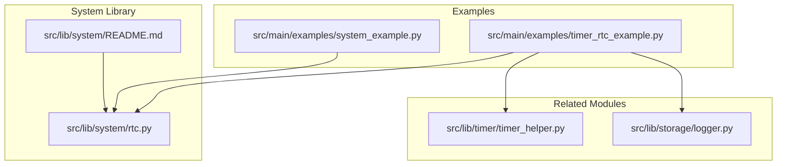
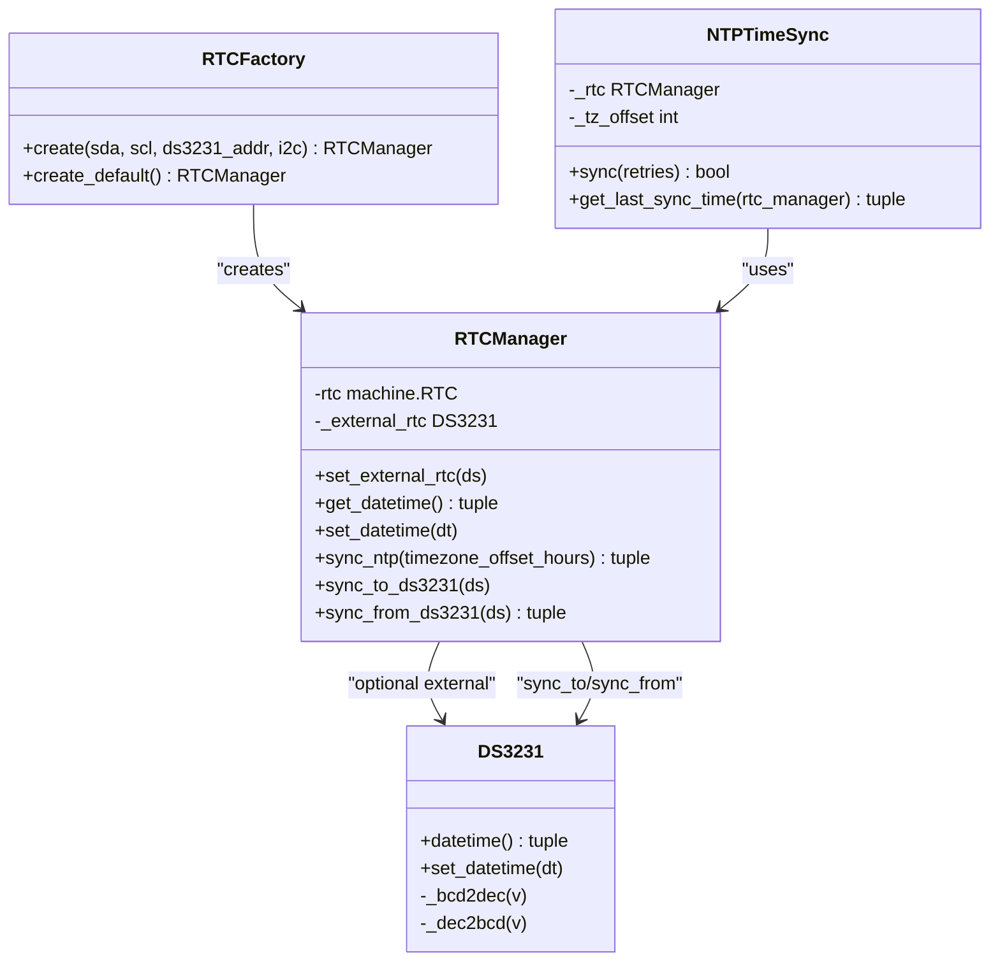
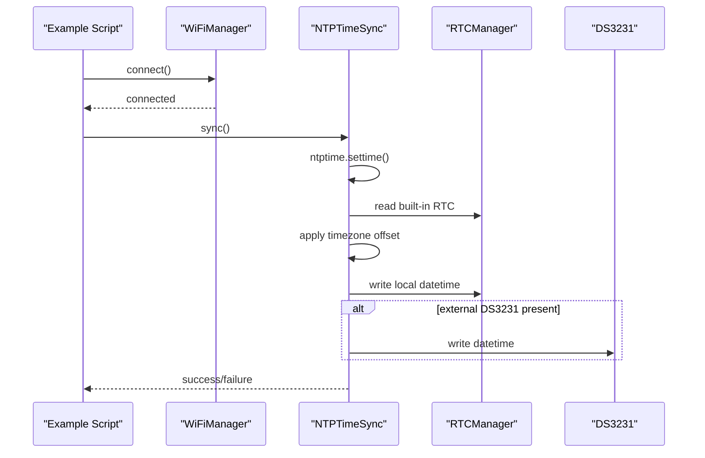
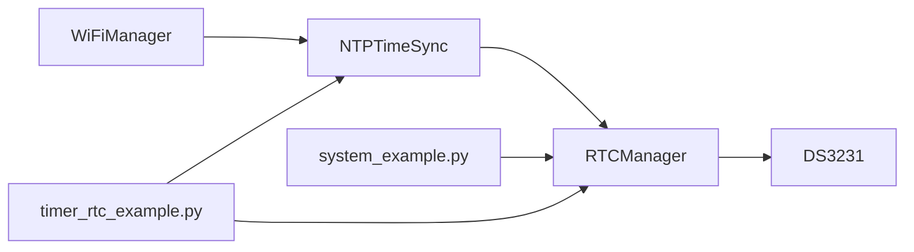

# Time Management

<cite>
**Referenced Files in This Document**
- [rtc.py](file://src/lib/system/rtc.py)
- [timer_rtc_example.py](file://src/main/examples/timer_rtc_example.py)
- [system_example.py](file://src/main/examples/system_example.py)
- [README.md](file://src/lib/system/README.md)
- [timer_helper.py](file://src/lib/timer/timer_helper.py)
- [logger.py](file://src/lib/storage/logger.py)
</cite>

## Table of Contents
1. [Introduction](#introduction)
2. [Project Structure](#project-structure)
3. [Core Components](#core-components)
4. [Architecture Overview](#architecture-overview)
5. [Detailed Component Analysis](#detailed-component-analysis)
6. [Dependency Analysis](#dependency-analysis)
7. [Performance Considerations](#performance-considerations)
8. [Troubleshooting Guide](#troubleshooting-guide)
9. [Conclusion](#conclusion)
10. [Appendices](#appendices)

## Introduction
This document explains the Real-Time Clock (RTC) and time management system implemented in the project. It covers the RTCManager class, RTC hardware integration with DS3231, NTP synchronization, timezone handling, and practical usage patterns demonstrated in the examples. It also addresses embedded timekeeping considerations such as battery-backed operation, fallback mechanisms, and power-aware time management.

## Project Structure
The time management functionality is centered around the system library’s RTC utilities and example scripts that demonstrate usage patterns.

**Diagram sources**
- [rtc.py:1-236](file://src/lib/system/rtc.py#L1-L236)
- [system_example.py:1-43](file://src/main/examples/system_example.py#L1-L43)
- [timer_rtc_example.py:1-284](file://src/main/examples/timer_rtc_example.py#L1-L284)
- [README.md:1-399](file://src/lib/system/README.md#L1-L399)
- [timer_helper.py:188-236](file://src/lib/timer/timer_helper.py#L188-L236)
- [logger.py:1-89](file://src/lib/storage/logger.py#L1-L89)

**Section sources**
- [rtc.py:1-236](file://src/lib/system/rtc.py#L1-L236)
- [system_example.py:1-43](file://src/main/examples/system_example.py#L1-L43)
- [timer_rtc_example.py:1-284](file://src/main/examples/timer_rtc_example.py#L1-L284)
- [README.md:1-399](file://src/lib/system/README.md#L1-L399)

## Core Components
- DS3231: External I2C RTC with battery backup for persistent timekeeping.
- RTCManager: Manages built-in RTC and optional DS3231, supports NTP synchronization and bidirectional sync.
- RTCFactory: Auto-detects DS3231 or falls back to built-in RTC.
- NTPTimeSync: Synchronizes time from NTP servers with timezone offset support and optional DS3231 propagation.

Key capabilities:
- Read/write DS3231 time in BCD format over I2C.
- Read/write built-in machine.RTC.
- NTP synchronization via ntptime and timezone offset application.
- Automatic selection of best RTC source.

**Section sources**
- [rtc.py:10-96](file://src/lib/system/rtc.py#L10-L96)
- [rtc.py:99-160](file://src/lib/system/rtc.py#L99-L160)
- [rtc.py:162-236](file://src/lib/system/rtc.py#L162-L236)

## Architecture Overview
The system integrates hardware RTC (DS3231) with software time management and network synchronization.

**Diagram sources**
- [rtc.py:10-96](file://src/lib/system/rtc.py#L10-L96)
- [rtc.py:99-160](file://src/lib/system/rtc.py#L99-L160)
- [rtc.py:162-236](file://src/lib/system/rtc.py#L162-L236)

## Detailed Component Analysis

### DS3231 I2C RTC
- Provides persistent timekeeping via I2C.
- Uses BCD-to-decimal conversion helpers for register values.
- Reads/writes 7-byte time registers starting at address 0x00.

Operational notes:
- Sanity checks on read values ensure valid time.
- Supports manual set/get for initial configuration.

**Section sources**
- [rtc.py:10-60](file://src/lib/system/rtc.py#L10-L60)

### RTCManager
- Wraps machine.RTC and optionally an external DS3231.
- Bidirectional sync between internal and external RTC.
- NTP synchronization with timezone offset applied to local time.

Important behaviors:
- NTP sync updates built-in RTC and propagates to DS3231 if present.
- Timezone handling is applied by converting to local time before writing.

**Section sources**
- [rtc.py:62-96](file://src/lib/system/rtc.py#L62-L96)

### RTCFactory
- Auto-detection order:
  1) External DS3231 (if accessible and returns valid time).
  2) Built-in machine.RTC fallback.
- Provides a convenience method to create without scanning (useful when DS3231 is not present).

**Section sources**
- [rtc.py:99-160](file://src/lib/system/rtc.py#L99-L160)

### NTPTimeSync
- Synchronizes from NTP with retry logic.
- Applies timezone offset to convert UTC to local time.
- Optionally writes synchronized time to DS3231 if available.

Error handling:
- Imports ntptime dynamically and reports when unavailable.
- Retries on transient failures.

**Section sources**
- [rtc.py:162-236](file://src/lib/system/rtc.py#L162-L236)

### Practical Examples and Usage Patterns
- Basic RTC inspection and NTP sync demonstration:
  - Example script initializes RTCManager and prints current time; NTP sync commented for WiFi-dependent scenario.
- Comprehensive RTC examples:
  - Factory pattern usage with DS3231 auto-detection.
  - NTP sync with WiFi connection and timezone offset.
  - Backup/restore between DS3231 and built-in RTC.

**Diagram sources**
- [timer_rtc_example.py:201-228](file://src/main/examples/timer_rtc_example.py#L201-L228)
- [rtc.py:183-225](file://src/lib/system/rtc.py#L183-L225)

**Section sources**
- [system_example.py:20-26](file://src/main/examples/system_example.py#L20-L26)
- [timer_rtc_example.py:175-228](file://src/main/examples/timer_rtc_example.py#L175-L228)

## Dependency Analysis
- RTCManager depends on machine.RTC and optionally DS3231.
- NTPTimeSync depends on RTCManager and ntptime.
- RTCFactory composes RTCManager and optionally DS3231.
- Example scripts depend on WiFiManager for NTP connectivity.

**Diagram sources**
- [timer_rtc_example.py:214-216](file://src/main/examples/timer_rtc_example.py#L214-L216)
- [rtc.py:175-211](file://src/lib/system/rtc.py#L175-L211)
- [system_example.py:20-26](file://src/main/examples/system_example.py#L20-L26)

**Section sources**
- [timer_rtc_example.py:201-228](file://src/main/examples/timer_rtc_example.py#L201-L228)
- [rtc.py:162-236](file://src/lib/system/rtc.py#L162-L236)

## Performance Considerations
- NTP synchronization involves network I/O and may require retries; keep retry count reasonable to avoid long blocking periods.
- DS3231 I2C operations are fast but should be batched to minimize bus contention.
- Built-in RTC updates are immediate; ensure timezone calculations occur infrequently to reduce CPU load.
- Power-aware designs should leverage DS3231 for time persistence during deep sleep and power loss.

## Troubleshooting Guide
Common issues and resolutions:
- NTP module missing: The NTP sync helper reports when ntptime is unavailable and aborts gracefully.
- WiFi required for NTP: Examples show connecting to WiFi before attempting NTP sync.
- External RTC not detected: Factory falls back to built-in RTC; verify wiring and I2C address.
- Timezone offset errors: Ensure correct offset in hours; verify weekday field mapping when writing DS3231.
- DS3231 backup battery: Replace or verify CR2032 battery if time resets after power-off.

**Section sources**
- [rtc.py:190-194](file://src/lib/system/rtc.py#L190-L194)
- [timer_rtc_example.py:213-227](file://src/main/examples/timer_rtc_example.py#L213-L227)
- [README.md:390-399](file://src/lib/system/README.md#L390-L399)

## Conclusion
The RTC and time management system provides robust timekeeping with automatic hardware detection, NTP synchronization, and timezone-aware updates. It supports power-aware operation through DS3231 and offers practical examples for integration in IoT applications. Following the recommended patterns ensures reliable timestamps and resilient time synchronization.

## Appendices

### Best Practices for IoT Time Synchronization
- Prefer DS3231 with backup battery for persistent timekeeping.
- Use NTP synchronization with retries and fallback to last known time.
- Apply timezone offsets carefully; store UTC internally and localize for display.
- Minimize NTP frequency to save power and bandwidth.
- Log timestamps using a consistent format and include timezone awareness.

### Time Zone Configuration Notes
- The system applies a fixed UTC offset; adjust the offset value according to your region.
- For regions with daylight saving transitions, implement application-level rules or use a time zone database if available.

### Timestamp Generation Patterns
- Use DS3231 for high-precision logs; otherwise rely on built-in RTC.
- Combine with structured logging utilities to maintain readable and searchable records.

**Section sources**
- [timer_rtc_example.py:156-175](file://src/main/examples/timer_rtc_example.py#L156-L175)
- [logger.py:33-35](file://src/lib/storage/logger.py#L33-L35)